# Simple File Sharing with Transfer Family Web Apps

## Problem

Business users frequently need to share files with partners, vendors, and team members without exposing sensitive data or requiring technical expertise. Traditional file sharing solutions either lack enterprise security controls, require complex client software installation, or demand significant IT resources to maintain custom applications. Organizations struggle to provide a simple, secure, browser-based file sharing solution that integrates with existing identity management systems while maintaining strict access controls.

## Solution

AWS Transfer Family Web Apps provides a fully managed, browser-based file sharing solution that requires no infrastructure management or custom development. By integrating Transfer Family with S3 for secure storage and IAM Identity Center for authentication, users can upload, download, and manage files through an intuitive web interface. This serverless approach automatically scales based on demand while maintaining enterprise-grade security through AWS's native access controls and encryption.

## Architecture Diagram

```mermaid
graph TB
    subgraph "User Access"
        USER[Business Users]
        BROWSER[Web Browser]
    end
    
    subgraph "AWS Transfer Family"
        WEBAPP[Transfer Family Web App]
        AUTH[IAM Identity Center]
    end
    
    subgraph "Storage & Access Control"
        S3[S3 Bucket]
        GRANTS[S3 Access Grants]
        CORS[CORS Configuration]
    end
    
    USER-->BROWSER
    BROWSER-->WEBAPP
    WEBAPP-->AUTH
    AUTH-->GRANTS
    GRANTS-->S3
    S3-->CORS
    
    style WEBAPP fill:#FF9900
    style S3 fill:#3F8624
    style AUTH fill:#232F3E
```



## Prerequisites

1. AWS account with administrative permissions for Transfer Family, S3, and IAM Identity Center
2. AWS CLI v2 installed and configured (or AWS CloudShell)
3. Basic understanding of file permissions and user management
4. IAM Identity Center must be enabled in your AWS account
5. Estimated cost: $0.05-$0.25 for testing (includes S3 storage, Transfer Family web app units, and minimal data transfer)

> **Note**: Transfer Family Web Apps are available in all Transfer Family supported regions except Mexico (Central). Ensure your region supports this service before proceeding.

## Preparation

```bash
# Set environment variables
export AWS_REGION=$(aws configure get region)
export AWS_ACCOUNT_ID=$(aws sts get-caller-identity \
    --query Account --output text)

# Generate unique identifiers for resources
RANDOM_SUFFIX=$(aws secretsmanager get-random-password \
    --exclude-punctuation --exclude-uppercase \
    --password-length 6 --require-each-included-type \
    --output text --query RandomPassword)

# Set resource names
export BUCKET_NAME="file-sharing-demo-${RANDOM_SUFFIX}"
export WEB_APP_NAME="file-sharing-app-${RANDOM_SUFFIX}"
export USER_NAME="demo-user-${RANDOM_SUFFIX}"

echo "✅ Environment configured with region: ${AWS_REGION}"
echo "✅ Account ID: ${AWS_ACCOUNT_ID}"
echo "✅ Resources will use suffix: ${RANDOM_SUFFIX}"
```

## Steps

1. **Create S3 Bucket for File Storage**:

   S3 provides highly durable object storage with 99.999999999% (11 9's) durability, making it the ideal foundation for our file sharing solution. Creating a dedicated bucket establishes the secure storage layer that will handle all file uploads and downloads while supporting fine-grained access controls through S3 Access Grants.

   ```bash
   # Create S3 bucket with versioning and encryption
   aws s3 mb s3://${BUCKET_NAME} --region ${AWS_REGION}
   
   # Enable versioning for file history tracking
   aws s3api put-bucket-versioning \
       --bucket ${BUCKET_NAME} \
       --versioning-configuration Status=Enabled
   
   # Enable server-side encryption
   aws s3api put-bucket-encryption \
       --bucket ${BUCKET_NAME} \
       --server-side-encryption-configuration \
       'Rules=[{ApplyServerSideEncryptionByDefault:{SSEAlgorithm:AES256}}]'
   
   echo "✅ S3 bucket created: ${BUCKET_NAME}"
   ```

   The bucket is now configured with enterprise-grade security features including versioning for file history and encryption at rest for data protection.

2. **Verify IAM Identity Center Configuration**:

   IAM Identity Center provides centralized user authentication and single sign-on capabilities, eliminating the need to manage separate credentials for file sharing access. This service integrates seamlessly with Transfer Family Web Apps to provide secure, federated authentication.

   ```bash
   # Check if IAM Identity Center is already enabled
   IDENTITY_CENTER_ARN=$(aws sso-admin list-instances \
       --query 'Instances[0].InstanceArn' --output text)
   
   if [ "$IDENTITY_CENTER_ARN" = "None" ] || [ "$IDENTITY_CENTER_ARN" = "null" ]; then
       echo "❌ IAM Identity Center not enabled. Please enable it manually:"
       echo "1. Go to https://console.aws.amazon.com/singlesignon/"
       echo "2. Click 'Enable' and follow the setup wizard"
       echo "3. Re-run this recipe after enabling IAM Identity Center"
       exit 1
   fi
   
   # Get Identity Center instance details
   export IDENTITY_STORE_ID=$(aws sso-admin list-instances \
       --query 'Instances[0].IdentityStoreId' --output text)
   
   echo "✅ IAM Identity Center detected: ${IDENTITY_CENTER_ARN}"
   echo "✅ Identity Store ID: ${IDENTITY_STORE_ID}"
   ```

   IAM Identity Center is now ready to authenticate users for the Transfer Family Web App with centralized identity management.

3. **Create Demo User in IAM Identity Center**:

   Creating a dedicated test user allows us to validate the file sharing functionality without affecting existing user accounts. This user will demonstrate the end-user experience of accessing files through the web interface.

   ```bash
   # Create a demo user in IAM Identity Center
   aws identitystore create-user \
       --identity-store-id ${IDENTITY_STORE_ID} \
       --user-name ${USER_NAME} \
       --display-name "Demo File Sharing User" \
       --name 'FamilyName=User,GivenName=Demo' \
       --emails 'Value=demo@example.com,Type=work,Primary=true' \
       > user-creation-result.json
   
   # Extract user ID for later use
   export DEMO_USER_ID=$(cat user-creation-result.json | \
       jq -r '.UserId')
   
   echo "✅ Demo user created: ${USER_NAME}"
   echo "✅ User ID: ${DEMO_USER_ID}"
   ```

   The demo user is now available in IAM Identity Center and ready to be assigned to the Transfer Family Web App for testing file sharing access.

4. **Create S3 Access Grants Instance**:

   S3 Access Grants provide fine-grained, temporary credentials for specific S3 locations, enabling secure access control without managing permanent IAM policies. This approach follows the principle of least privilege by granting only necessary permissions for the specified bucket location.

   ```bash
   # Create S3 Access Grants instance (if not exists)
   aws s3control create-access-grants-instance \
       --account-id ${AWS_ACCOUNT_ID} \
       --identity-center-arn ${IDENTITY_CENTER_ARN} \
       --region ${AWS_REGION} 2>/dev/null || echo "Access Grants instance may already exist"
   
   # Wait for the instance to be ready
   sleep 10
   
   # Register the S3 location for access grants
   aws s3control create-access-grants-location \
       --account-id ${AWS_ACCOUNT_ID} \
       --location-scope s3://${BUCKET_NAME}/* \
       --iam-role-arn arn:aws:iam::${AWS_ACCOUNT_ID}:role/S3AccessGrantsLocationRole \
       > location-result.json 2>/dev/null || \
       aws s3control create-access-grants-location \
           --account-id ${AWS_ACCOUNT_ID} \
           --location-scope s3://${BUCKET_NAME}/* \
           > location-result.json
   
   # Extract location ID
   export LOCATION_ID=$(cat location-result.json | \
       jq -r '.AccessGrantsLocationId')
   
   echo "✅ S3 Access Grants location registered: ${LOCATION_ID}"
   ```

   S3 Access Grants infrastructure is now configured to provide secure access controls for the file sharing solution.

5. **Create Access Grant for Demo User**:

   Creating an access grant establishes the specific permissions for our demo user to access files in the S3 bucket. This grant will enable read and write access to the designated bucket location through the Transfer Family Web App.

   ```bash
   # Create access grant for the demo user
   aws s3control create-access-grant \
       --account-id ${AWS_ACCOUNT_ID} \
       --access-grants-location-id ${LOCATION_ID} \
       --grantee '{
           "GranteeType": "DIRECTORY_USER",
           "GranteeIdentifier": "'"${IDENTITY_STORE_ID}:user/${DEMO_USER_ID}"'"
       }' \
       --permission READWRITE \
       > grant-result.json
   
   export GRANT_ID=$(cat grant-result.json | \
       jq -r '.AccessGrantId')
   
   echo "✅ S3 Access Grant created: ${GRANT_ID}"
   ```

   The demo user now has appropriate access permissions configured through S3 Access Grants for secure file operations.

6. **Create Transfer Family Web App**:

   Transfer Family Web Apps provide a fully managed, browser-based interface for file operations without requiring custom development or infrastructure management. The service automatically handles user authentication, authorization, and provides an intuitive interface for file uploads and downloads.

   ```bash
   # Create the Transfer Family Web App
   aws transfer create-web-app \
       --identity-provider-details '{
           "IdentityCenterConfig": {
               "InstanceArn": "'"${IDENTITY_CENTER_ARN}"'",
               "Role": "arn:aws:iam::'"${AWS_ACCOUNT_ID}"':role/TransferFamily-S3AccessGrants-WebAppRole"
           }
       }' \
       --tags 'Key=Name,Value='"${WEB_APP_NAME}" \
       'Key=Purpose,Value=FileSharing' \
       > webapp-creation-result.json
   
   # Extract Web App ID
   export WEB_APP_ID=$(cat webapp-creation-result.json | \
       jq -r '.WebAppId')
   
   # Wait for web app to be available
   echo "⏳ Waiting for web app to become available..."
   aws transfer wait web-app-available --web-app-id ${WEB_APP_ID} || sleep 30
   
   # Get the access endpoint
   export ACCESS_ENDPOINT=$(aws transfer describe-web-app \
       --web-app-id ${WEB_APP_ID} \
       --query 'WebApp.AccessEndpoint' --output text)
   
   echo "✅ Transfer Family Web App created: ${WEB_APP_ID}"
   echo "✅ Access endpoint: ${ACCESS_ENDPOINT}"
   ```

   The Transfer Family Web App is now active and provides a secure, branded interface for file sharing operations with automatic scaling and managed infrastructure.

7. **Configure S3 CORS for Web App Access**:

   Cross-Origin Resource Sharing (CORS) configuration enables the Transfer Family Web App to securely access S3 objects from the browser. This configuration defines which origins can make requests to the S3 bucket and which HTTP methods are allowed.

   ```bash
   # Create CORS configuration for the web app
   cat > cors-config.json << EOF
   {
       "CORSRules": [
           {
               "AllowedHeaders": ["*"],
               "AllowedMethods": ["GET", "PUT", "POST", "DELETE", "HEAD"],
               "AllowedOrigins": ["${ACCESS_ENDPOINT}"],
               "ExposeHeaders": [
                   "last-modified", "content-length", "etag", 
                   "x-amz-version-id", "content-type", "x-amz-request-id",
                   "x-amz-id-2", "date", "x-amz-cf-id", "x-amz-storage-class"
               ],
               "MaxAgeSeconds": 3000
           }
       ]
   }
   EOF
   
   # Apply CORS configuration to S3 bucket
   aws s3api put-bucket-cors \
       --bucket ${BUCKET_NAME} \
       --cors-configuration file://cors-config.json
   
   echo "✅ CORS configuration applied to bucket: ${BUCKET_NAME}"
   ```

   The S3 bucket now allows secure cross-origin requests from the Transfer Family Web App, enabling seamless file operations through the browser interface.

8. **Assign User to Transfer Family Web App**:

   Assigning users to the Transfer Family Web App establishes the connection between IAM Identity Center authentication and S3 access permissions. This step completes the secure file sharing setup by linking user identity to storage access through the web interface.

   ```bash
   # Assign the demo user to the web app
   aws transfer create-web-app-assignment \
       --web-app-id ${WEB_APP_ID} \
       --grantee '{
           "Type": "USER",
           "Identifier": "'"${DEMO_USER_ID}"'"
       }' \
       > assignment-result.json
   
   echo "✅ User assigned to Transfer Family Web App"
   echo "✅ User can now access: ${ACCESS_ENDPOINT}"
   echo "📝 Note: Set a password for user '${USER_NAME}' in IAM Identity Center console to enable login"
   ```

   The demo user now has complete access to the file sharing web app and can upload, download, and manage files in the designated S3 bucket.

## Validation & Testing

1. **Verify Transfer Family Web App Status**:

   ```bash
   # Check web app status and configuration
   aws transfer describe-web-app --web-app-id ${WEB_APP_ID}
   ```

   Expected output: Web app status should show "AVAILABLE" with the correct access endpoint URL.

2. **Test S3 Bucket Access and CORS Configuration**:

   ```bash
   # Verify bucket exists and CORS is configured
   aws s3api get-bucket-cors --bucket ${BUCKET_NAME}
   
   # Upload a test file to verify permissions
   echo "Test file for sharing" > test-file.txt
   aws s3 cp test-file.txt s3://${BUCKET_NAME}/test-file.txt
   
   echo "✅ Test file uploaded successfully"
   ```

3. **Validate S3 Access Grants Configuration**:

   ```bash
   # List access grants to verify configuration
   aws s3control list-access-grants \
       --account-id ${AWS_ACCOUNT_ID} \
       --granted-account-id ${AWS_ACCOUNT_ID}
   ```

   Expected output: Should show the access grant created for the demo user with READWRITE permissions.

4. **Test User Assignment to Web App**:

   ```bash
   # List web app assignments
   aws transfer list-web-app-assignments --web-app-id ${WEB_APP_ID}
   ```

   Expected output: Should display the demo user assignment with the correct user ID.

> **Note**: To fully test the web app, you need to set a password for the demo user in IAM Identity Center console and access the web interface using a browser. The access endpoint URL provides the complete file sharing interface.

## Cleanup

1. **Remove Transfer Family Web App Resources**:

   ```bash
   # Delete web app assignment
   aws transfer delete-web-app-assignment \
       --web-app-id ${WEB_APP_ID} \
       --grantee '{
           "Type": "USER", 
           "Identifier": "'"${DEMO_USER_ID}"'"
       }'
   
   # Delete the web app
   aws transfer delete-web-app --web-app-id ${WEB_APP_ID}
   
   echo "✅ Transfer Family Web App removed"
   ```

2. **Remove S3 Access Grants**:

   ```bash
   # Delete the access grant
   aws s3control delete-access-grant \
       --account-id ${AWS_ACCOUNT_ID} \
       --access-grant-id ${GRANT_ID}
   
   # Delete the access grants location
   aws s3control delete-access-grants-location \
       --account-id ${AWS_ACCOUNT_ID} \
       --access-grants-location-id ${LOCATION_ID}
   
   echo "✅ S3 Access Grants removed"
   ```

3. **Remove S3 Bucket and Contents**:

   ```bash
   # Delete S3 objects first
   aws s3 rm s3://${BUCKET_NAME} --recursive
   
   # Delete the S3 bucket
   aws s3 rb s3://${BUCKET_NAME}
   
   echo "✅ S3 bucket and contents removed"
   ```

4. **Remove Demo User from IAM Identity Center**:

   ```bash
   # Delete the demo user
   aws identitystore delete-user \
       --identity-store-id ${IDENTITY_STORE_ID} \
       --user-id ${DEMO_USER_ID}
   
   echo "✅ Demo user removed from IAM Identity Center"
   ```

5. **Clean up local files**:

   ```bash
   # Remove temporary files
   rm -f cors-config.json webapp-creation-result.json
   rm -f user-creation-result.json location-result.json
   rm -f grant-result.json assignment-result.json test-file.txt
   
   echo "✅ Local cleanup completed"
   ```

## Discussion

AWS Transfer Family Web Apps revolutionizes secure file sharing by providing a fully managed, browser-based solution that eliminates the complexity of traditional file transfer systems. This serverless approach automatically scales to handle varying workloads while maintaining enterprise-grade security through AWS's native access controls, encryption, and audit capabilities. Organizations benefit from reduced operational overhead since there's no infrastructure to manage, patch, or monitor.

The integration with IAM Identity Center enables seamless single sign-on experiences and centralized user management, while S3 Access Grants provide fine-grained, temporary access controls that follow the principle of least privilege. This architecture ensures that users can only access files they're explicitly authorized to view, with all activities logged through AWS CloudTrail for compliance and audit purposes. The solution scales effortlessly from small teams to enterprise-wide deployments without requiring additional configuration or management overhead.

The CORS configuration enables secure cross-origin requests between the web app and S3, ensuring that file operations work seamlessly within modern browser security models. Transfer Family Web Apps support advanced features like custom branding, custom domain names, and integration with third-party identity providers like Okta, making them suitable for both internal file sharing and external partner collaboration scenarios. The service automatically handles complex aspects like session management, file upload progress tracking, and error handling.

Transfer Family Web Apps are built using Storage Browser for Amazon S3, providing a consistent user experience with familiar file management operations. The service includes built-in support for large file uploads (up to 160 GB per file), folder operations, and search capabilities across thousands of files. The solution follows AWS Well-Architected Framework principles for security, reliability, and cost optimization.

> **Tip**: For production deployments, consider implementing custom domain names and SSL certificates through Amazon CloudFront to provide a branded experience that aligns with your organization's domain structure and security policies.

**Documentation References:**
- [Transfer Family Web Apps User Guide](https://docs.aws.amazon.com/transfer/latest/userguide/web-app.html)
- [Setting up a Transfer Family Web App Tutorial](https://docs.aws.amazon.com/transfer/latest/userguide/web-app-tutorial.html)
- [S3 Access Grants Documentation](https://docs.aws.amazon.com/AmazonS3/latest/userguide/access-grants.html)
- [IAM Identity Center User Guide](https://docs.aws.amazon.com/singlesignon/latest/userguide/)
- [AWS Transfer Family Web Apps Announcement](https://aws.amazon.com/blogs/aws/announcing-aws-transfer-family-web-apps-for-fully-managed-amazon-s3-file-transfers/)

## Challenge

Extend this file sharing solution by implementing these enhancements:

1. **Custom Branding and Domain**: Configure a custom domain name using Amazon CloudFront and Route 53, and add your organization's branding elements including custom logos and color schemes to create a fully branded file sharing experience.

2. **Group-Based Access Control**: Create user groups in IAM Identity Center and configure S3 Access Grants for different access levels (read-only for viewers, read-write for contributors, admin access for managers) to implement role-based file sharing permissions.

3. **Integration with External Identity Provider**: Connect an external identity provider like Okta or Active Directory to IAM Identity Center, enabling existing organizational users to access the file sharing platform without creating separate AWS accounts.

4. **Automated File Lifecycle Management**: Implement S3 Intelligent Tiering and lifecycle policies to automatically move older files to cost-effective storage classes, and configure automated deletion of files after specified retention periods.

5. **Advanced Monitoring and Alerting**: Set up CloudWatch dashboards to monitor file sharing activity, CloudTrail log analysis to track user actions, and SNS notifications for security events like unauthorized access attempts or large file uploads.

## Infrastructure Code

### Available Infrastructure as Code:

- [Infrastructure Code Overview](code/README.md) - Detailed description of all infrastructure components
- [AWS CDK (Python)](code/cdk-python/) - AWS CDK Python implementation
- [AWS CDK (TypeScript)](code/cdk-typescript/) - AWS CDK TypeScript implementation
- [CloudFormation](code/cloudformation.yaml) - AWS CloudFormation template
- [Bash CLI Scripts](code/scripts/) - Example bash scripts using AWS CLI commands to deploy infrastructure
- [Terraform](code/terraform/) - Terraform configuration files