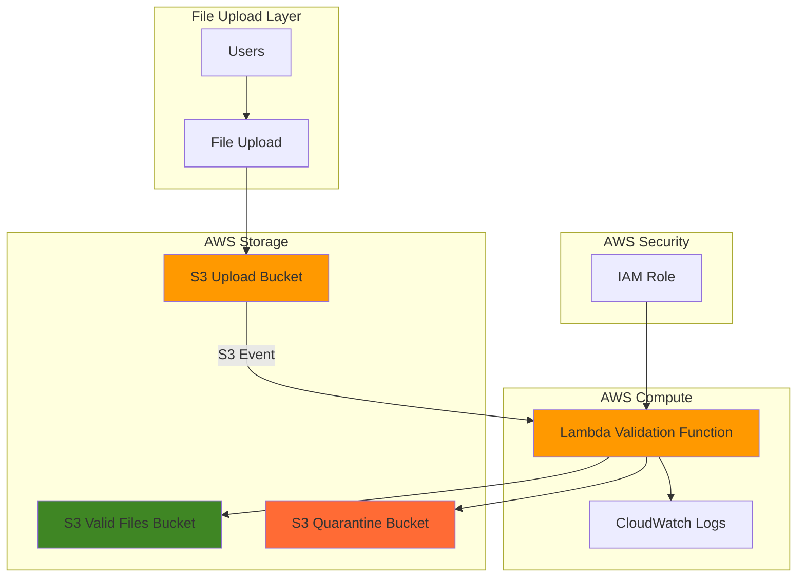

# Simple File Validation with S3 and Lambda

## Problem

Organizations frequently struggle with uncontrolled file uploads that can contain malicious content, exceed size limits, or have unsupported file types. Without automated validation, teams must manually review each uploaded file, creating bottlenecks and potential security vulnerabilities that can compromise data integrity and system performance.

## Solution

AWS S3 event notifications combined with Lambda functions provide an automated, serverless file validation system that triggers immediately upon file upload. This solution validates file types and sizes in real-time, moving valid files to approved locations while quarantining or rejecting invalid uploads, ensuring data quality and security without manual intervention.

## Architecture Diagram



## Prerequisites

1. AWS account with appropriate permissions to create S3 buckets, Lambda functions, and IAM roles
2. AWS CLI v2 installed and configured (or AWS CloudShell)
3. Basic understanding of serverless computing concepts
4. Familiarity with file types and validation requirements
5. Estimated cost: Less than $1 for testing (includes S3 storage, Lambda executions, and data transfer)

> **Note**: This recipe follows AWS Well-Architected Framework principles for operational excellence and security.

## Preparation

```bash
# Set environment variables
export AWS_REGION=$(aws configure get region)
export AWS_ACCOUNT_ID=$(aws sts get-caller-identity \
    --query Account --output text)

# Generate unique identifiers for resources
RANDOM_SUFFIX=$(aws secretsmanager get-random-password \
    --exclude-punctuation --exclude-uppercase \
    --password-length 6 --require-each-included-type \
    --output text --query RandomPassword)

# Set bucket names
export UPLOAD_BUCKET_NAME="file-upload-${RANDOM_SUFFIX}"
export VALID_BUCKET_NAME="valid-files-${RANDOM_SUFFIX}"
export QUARANTINE_BUCKET_NAME="quarantine-files-${RANDOM_SUFFIX}"
export LAMBDA_FUNCTION_NAME="file-validator-${RANDOM_SUFFIX}"

echo "✅ AWS environment configured with unique identifiers"
```

## Steps

1. **Create S3 Buckets for File Management**:

   S3 provides highly durable object storage with 99.999999999% (11 9's) durability, making it the ideal foundation for our file validation system. We'll create three buckets: one for initial uploads, one for validated files, and one for quarantined content. This separation follows security best practices by isolating potentially malicious content.

   ```bash
   # Create upload bucket
   aws s3 mb s3://${UPLOAD_BUCKET_NAME} --region ${AWS_REGION}
   
   # Create valid files bucket
   aws s3 mb s3://${VALID_BUCKET_NAME} --region ${AWS_REGION}
   
   # Create quarantine bucket
   aws s3 mb s3://${QUARANTINE_BUCKET_NAME} --region ${AWS_REGION}
   
   # Enable versioning for data protection
   aws s3api put-bucket-versioning \
       --bucket ${UPLOAD_BUCKET_NAME} \
       --versioning-configuration Status=Enabled
   
   echo "✅ Created S3 buckets: ${UPLOAD_BUCKET_NAME}, ${VALID_BUCKET_NAME}, ${QUARANTINE_BUCKET_NAME}"
   ```

2. **Create IAM Role for Lambda Function**:

   IAM roles provide secure, temporary credentials that follow the principle of least privilege. This role grants our Lambda function only the specific permissions needed to read from the upload bucket, write to destination buckets, and log execution details to CloudWatch.

   ```bash
   # Create trust policy for Lambda
   cat > lambda-trust-policy.json << 'EOF'
   {
     "Version": "2012-10-17",
     "Statement": [
       {
         "Effect": "Allow",
         "Principal": {
           "Service": "lambda.amazonaws.com"
         },
         "Action": "sts:AssumeRole"
       }
     ]
   }
   EOF
   
   # Create IAM role
   aws iam create-role \
       --role-name ${LAMBDA_FUNCTION_NAME}-role \
       --assume-role-policy-document file://lambda-trust-policy.json
   
   # Attach basic Lambda execution policy
   aws iam attach-role-policy \
       --role-name ${LAMBDA_FUNCTION_NAME}-role \
       --policy-arn arn:aws:iam::aws:policy/service-role/AWSLambdaBasicExecutionRole
   
   echo "✅ Created IAM role: ${LAMBDA_FUNCTION_NAME}-role"
   ```

3. **Create S3 Access Policy for Lambda**:

   This custom IAM policy grants precise S3 permissions required for file validation operations. The policy allows reading from the upload bucket, writing to both valid and quarantine buckets, and deleting original files after processing to prevent accumulation of processed files.

   ```bash
   # Create S3 access policy
   cat > s3-access-policy.json << EOF
   {
     "Version": "2012-10-17",
     "Statement": [
       {
         "Effect": "Allow",
         "Action": [
           "s3:GetObject",
           "s3:DeleteObject"
         ],
         "Resource": "arn:aws:s3:::${UPLOAD_BUCKET_NAME}/*"
       },
       {
         "Effect": "Allow",
         "Action": [
           "s3:PutObject"
         ],
         "Resource": [
           "arn:aws:s3:::${VALID_BUCKET_NAME}/*",
           "arn:aws:s3:::${QUARANTINE_BUCKET_NAME}/*"
         ]
       }
     ]
   }
   EOF
   
   # Create and attach the policy
   aws iam create-policy \
       --policy-name ${LAMBDA_FUNCTION_NAME}-s3-policy \
       --policy-document file://s3-access-policy.json \
       --query 'Policy.Arn' --output text > policy-arn.txt
   
   aws iam attach-role-policy \
       --role-name ${LAMBDA_FUNCTION_NAME}-role \
       --policy-arn $(cat policy-arn.txt)
   
   echo "✅ Created and attached S3 access policy"
   ```

4. **Create Lambda Function Code**:

   AWS Lambda provides serverless compute that automatically scales based on incoming S3 events. Our validation function implements business logic to check file types and sizes, demonstrating event-driven architecture patterns. The function uses the S3 event payload to identify uploaded files and applies validation rules before moving files to appropriate destinations.

   ```bash
   # Create Lambda function code
   mkdir lambda-function
   cat > lambda-function/index.py << 'EOF'
   import json
   import boto3
   import urllib.parse
   import os
   from datetime import datetime
   
   s3_client = boto3.client('s3')
   
   # Configuration
   MAX_FILE_SIZE = 10 * 1024 * 1024  # 10 MB
   ALLOWED_EXTENSIONS = ['.txt', '.pdf', '.jpg', '.jpeg', '.png', '.doc', '.docx']
   
   def lambda_handler(event, context):
       print(f"Received event: {json.dumps(event)}")
       
       valid_bucket = os.environ['VALID_BUCKET_NAME']
       quarantine_bucket = os.environ['QUARANTINE_BUCKET_NAME']
       
       for record in event['Records']:
           # Extract S3 information
           bucket_name = record['s3']['bucket']['name']
           object_key = urllib.parse.unquote_plus(record['s3']['object']['key'])
           object_size = record['s3']['object']['size']
           
           print(f"Processing file: {object_key}, Size: {object_size} bytes")
           
           # Validate file
           validation_result = validate_file(object_key, object_size)
           
           # Move file based on validation result
           if validation_result['valid']:
               destination_bucket = valid_bucket
               print(f"✅ File {object_key} is valid")
           else:
               destination_bucket = quarantine_bucket
               print(f"❌ File {object_key} is invalid: {validation_result['reason']}")
           
           # Copy file to appropriate bucket
           copy_source = {'Bucket': bucket_name, 'Key': object_key}
           destination_key = f"{datetime.now().strftime('%Y/%m/%d')}/{object_key}"
           
           s3_client.copy_object(
               CopySource=copy_source,
               Bucket=destination_bucket,
               Key=destination_key
           )
           
           # Delete original file from upload bucket
           s3_client.delete_object(
               Bucket=bucket_name,
               Key=object_key
           )
           
           print(f"Moved {object_key} to {destination_bucket} and deleted original")
       
       return {'statusCode': 200, 'body': json.dumps('File validation completed')}
   
   def validate_file(filename, file_size):
       # Check file size
       if file_size > MAX_FILE_SIZE:
           return {'valid': False, 'reason': f'File size {file_size} exceeds maximum {MAX_FILE_SIZE}'}
       
       # Check file extension (more robust validation)
       if '.' not in filename:
           return {'valid': False, 'reason': 'File has no extension'}
           
       file_extension = '.' + filename.lower().split('.')[-1]
       if file_extension not in ALLOWED_EXTENSIONS:
           return {'valid': False, 'reason': f'File extension {file_extension} not allowed'}
       
       return {'valid': True, 'reason': 'File passed validation'}
   EOF
   
   echo "✅ Created Lambda function code with validation logic"
   ```

5. **Deploy Lambda Function**:

   Lambda deployment packages contain your function code and dependencies. This step creates the deployment package and uploads it to AWS Lambda, establishing the serverless compute resource that will process S3 events. The function configuration includes timeout and memory settings optimized for file processing operations with environment variables for bucket names.

   ```bash
   # Create deployment package
   cd lambda-function
   zip -r ../function.zip .
   cd ..
   
   # Get IAM role ARN
   ROLE_ARN=$(aws iam get-role \
       --role-name ${LAMBDA_FUNCTION_NAME}-role \
       --query 'Role.Arn' --output text)
   
   # Wait for role propagation
   sleep 10
   
   # Create Lambda function
   aws lambda create-function \
       --function-name ${LAMBDA_FUNCTION_NAME} \
       --runtime python3.12 \
       --role ${ROLE_ARN} \
       --handler index.lambda_handler \
       --zip-file fileb://function.zip \
       --timeout 60 \
       --memory-size 256 \
       --description "File validation function for S3 uploads" \
       --environment Variables="{VALID_BUCKET_NAME=${VALID_BUCKET_NAME},QUARANTINE_BUCKET_NAME=${QUARANTINE_BUCKET_NAME}}"
   
   echo "✅ Deployed Lambda function: ${LAMBDA_FUNCTION_NAME}"
   ```

6. **Configure S3 Event Notification**:

   S3 event notifications enable real-time processing by automatically triggering Lambda functions when objects are created. This configuration creates the event-driven architecture that eliminates the need for polling or scheduled processing, providing immediate response to file uploads while maintaining cost efficiency.

   ```bash
   # Add permission for S3 to invoke Lambda
   aws lambda add-permission \
       --function-name ${LAMBDA_FUNCTION_NAME} \
       --principal s3.amazonaws.com \
       --action lambda:InvokeFunction \
       --statement-id s3-trigger-permission \
       --source-arn arn:aws:s3:::${UPLOAD_BUCKET_NAME}
   
   # Create event notification configuration
   cat > event-notification.json << EOF
   {
     "LambdaConfigurations": [
       {
         "Id": "file-validation-trigger",
         "LambdaFunctionArn": "arn:aws:lambda:${AWS_REGION}:${AWS_ACCOUNT_ID}:function:${LAMBDA_FUNCTION_NAME}",
         "Events": ["s3:ObjectCreated:*"]
       }
     ]
   }
   EOF
   
   # Apply notification configuration
   aws s3api put-bucket-notification-configuration \
       --bucket ${UPLOAD_BUCKET_NAME} \
       --notification-configuration file://event-notification.json
   
   echo "✅ Configured S3 event notification for Lambda trigger"
   ```

## Validation & Testing

1. **Test File Upload and Validation**:

   ```bash
   # Create test files
   echo "This is a valid text file for testing" > test-valid.txt
   echo "This content has invalid extension" > test-invalid.exe
   
   # Upload valid file
   aws s3 cp test-valid.txt s3://${UPLOAD_BUCKET_NAME}/
   
   # Wait for processing
   sleep 15
   
   # Check if file was moved to valid bucket
   aws s3 ls s3://${VALID_BUCKET_NAME}/ --recursive
   
   # Verify file was removed from upload bucket
   aws s3 ls s3://${UPLOAD_BUCKET_NAME}/
   ```

   Expected output: File should appear in valid bucket with date-organized path and should be removed from upload bucket.

2. **Test Invalid File Handling**:

   ```bash
   # Upload file with invalid extension
   aws s3 cp test-invalid.exe s3://${UPLOAD_BUCKET_NAME}/
   
   # Wait for processing
   sleep 15
   
   # Check quarantine bucket
   aws s3 ls s3://${QUARANTINE_BUCKET_NAME}/ --recursive
   
   # Verify file was removed from upload bucket
   aws s3 ls s3://${UPLOAD_BUCKET_NAME}/
   ```

   Expected output: Invalid file should appear in quarantine bucket and be removed from upload bucket.

3. **Verify Lambda Function Logs**:

   ```bash
   # Get recent log events
   aws logs describe-log-streams \
       --log-group-name /aws/lambda/${LAMBDA_FUNCTION_NAME} \
       --order-by LastEventTime \
       --descending \
       --max-items 1 \
       --query 'logStreams[0].logStreamName' \
       --output text > latest-log-stream.txt
   
   # View logs
   aws logs get-log-events \
       --log-group-name /aws/lambda/${LAMBDA_FUNCTION_NAME} \
       --log-stream-name $(cat latest-log-stream.txt) \
       --query 'events[].message' --output text
   ```

   Expected output: Log entries showing file processing, validation results, and move operations.

## Cleanup

1. **Remove S3 Event Notification**:

   ```bash
   # Remove event notification
   aws s3api put-bucket-notification-configuration \
       --bucket ${UPLOAD_BUCKET_NAME} \
       --notification-configuration '{}'
   
   echo "✅ Removed S3 event notification"
   ```

2. **Delete Lambda Function**:

   ```bash
   # Delete Lambda function
   aws lambda delete-function --function-name ${LAMBDA_FUNCTION_NAME}
   
   echo "✅ Deleted Lambda function"
   ```

3. **Remove IAM Resources**:

   ```bash
   # Detach policies from role
   aws iam detach-role-policy \
       --role-name ${LAMBDA_FUNCTION_NAME}-role \
       --policy-arn arn:aws:iam::aws:policy/service-role/AWSLambdaBasicExecutionRole
   
   aws iam detach-role-policy \
       --role-name ${LAMBDA_FUNCTION_NAME}-role \
       --policy-arn $(cat policy-arn.txt)
   
   # Delete custom policy
   aws iam delete-policy --policy-arn $(cat policy-arn.txt)
   
   # Delete IAM role
   aws iam delete-role --role-name ${LAMBDA_FUNCTION_NAME}-role
   
   echo "✅ Cleaned up IAM resources"
   ```

4. **Empty and Delete S3 Buckets**:

   ```bash
   # Empty buckets
   aws s3 rm s3://${UPLOAD_BUCKET_NAME} --recursive
   aws s3 rm s3://${VALID_BUCKET_NAME} --recursive
   aws s3 rm s3://${QUARANTINE_BUCKET_NAME} --recursive
   
   # Delete buckets
   aws s3 rb s3://${UPLOAD_BUCKET_NAME}
   aws s3 rb s3://${VALID_BUCKET_NAME}
   aws s3 rb s3://${QUARANTINE_BUCKET_NAME}
   
   # Clean up local files
   rm -f lambda-trust-policy.json s3-access-policy.json event-notification.json
   rm -f policy-arn.txt latest-log-stream.txt function.zip
   rm -f test-valid.txt test-invalid.exe
   rm -rf lambda-function
   
   echo "✅ Cleaned up all AWS resources and local files"
   ```

## Discussion

This serverless file validation solution demonstrates the power of event-driven architecture using AWS S3 and Lambda. The pattern provides immediate response to file uploads while maintaining cost efficiency through pay-per-execution pricing. By leveraging S3 event notifications, the system eliminates the need for polling mechanisms or scheduled processing, ensuring real-time validation without constant resource consumption.

The architecture follows AWS Well-Architected Framework principles, particularly in security and operational excellence. IAM roles implement least-privilege access, while the separation of buckets provides defense-in-depth security. The Lambda function's stateless design ensures reliable scaling and consistent performance regardless of upload volume. This pattern is particularly effective for content management systems, document workflows, and any application requiring automated file processing.

From a cost optimization perspective, this solution scales from zero to handle thousands of concurrent uploads without infrastructure management overhead. Lambda's millisecond billing and S3's storage class options provide opportunities for further cost reduction in production environments. The quarantine mechanism prevents potentially malicious files from entering trusted storage areas, supporting compliance requirements in regulated industries.

The validation logic can be extended to include virus scanning, content analysis, or integration with additional AWS services like Amazon Rekognition for image analysis or Amazon Textract for document processing. Consider implementing dead letter queues for failed processing and CloudWatch alarms for monitoring validation metrics in production deployments. The automatic deletion of processed files from the upload bucket prevents accumulation and reduces storage costs while maintaining a clean separation of concerns.

> **Tip**: Use AWS X-Ray for distributed tracing to monitor Lambda performance and identify bottlenecks in file processing workflows. The [AWS X-Ray documentation](https://docs.aws.amazon.com/xray/latest/devguide/) provides comprehensive guidance for serverless observability.

**Documentation References:**
- [Process Amazon S3 event notifications with Lambda](https://docs.aws.amazon.com/lambda/latest/dg/with-s3.html)
- [Amazon S3 Event Notifications](https://docs.aws.amazon.com/AmazonS3/latest/userguide/EventNotifications.html)
- [Best practices for working with AWS Lambda functions](https://docs.aws.amazon.com/lambda/latest/dg/best-practices.html)
- [Security best practices in IAM](https://docs.aws.amazon.com/IAM/latest/UserGuide/best-practices.html)
- [AWS Well-Architected Framework](https://docs.aws.amazon.com/wellarchitected/latest/framework/welcome.html)

## Challenge

Extend this solution by implementing these enhancements:

1. **Add Content-Based Validation**: Integrate Amazon Rekognition to validate image content and detect inappropriate material beyond file type checking.

2. **Implement Virus Scanning**: Use AWS Lambda layers with ClamAV antivirus or integrate with Amazon GuardDuty malware detection for comprehensive security scanning.

3. **Create Notification System**: Add Amazon SNS integration to notify administrators when files are quarantined or when validation failures exceed normal thresholds.

4. **Build Processing Pipeline**: Extend the architecture with Amazon SQS for buffering large volumes of files and Step Functions for orchestrating complex validation workflows.

5. **Add Metadata Extraction**: Use Amazon Textract or custom Lambda functions to extract and store file metadata in DynamoDB for searchability and audit trails.

## Infrastructure Code

*Infrastructure code will be generated after recipe approval.*