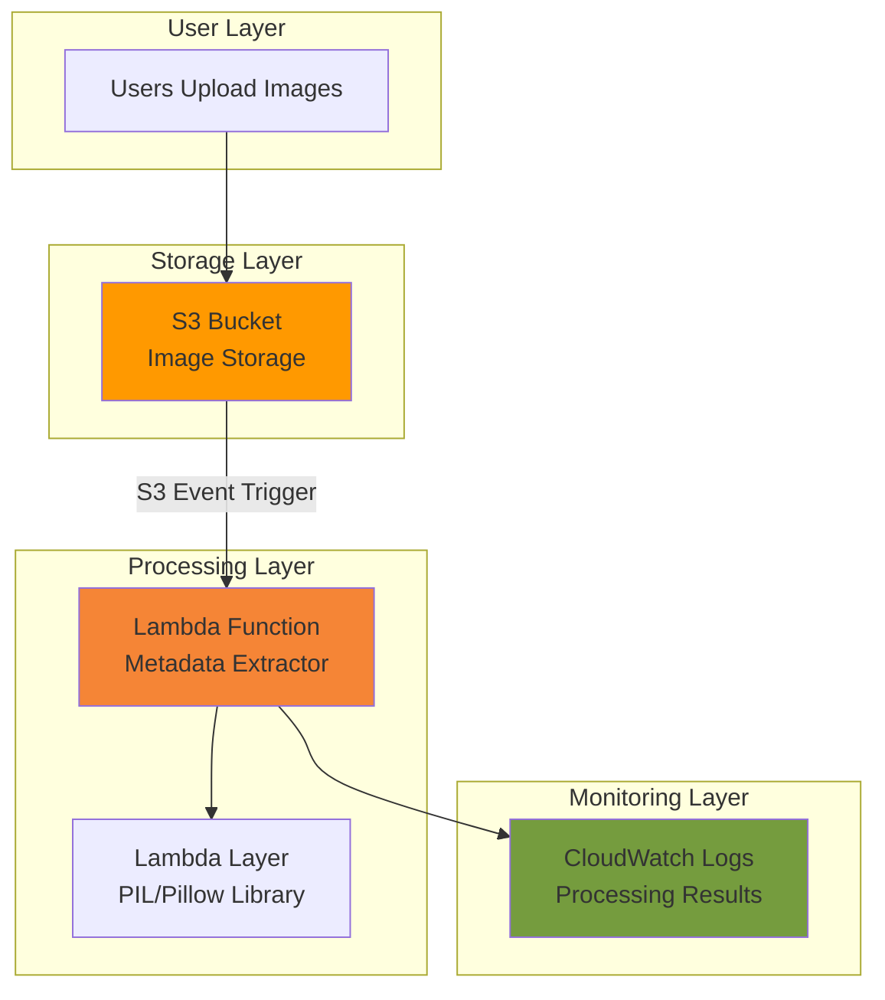

# Simple Image Metadata Extractor with Lambda and S3

## Problem

Digital content creators and developers often need to automatically extract metadata from uploaded images such as dimensions, file size, and format information. Manually processing each uploaded image for metadata extraction is time-consuming and doesn't scale for applications handling hundreds or thousands of images daily.

## Solution

Create a serverless image metadata extraction system using AWS Lambda and S3 that automatically processes uploaded images and extracts key metadata. This event-driven architecture provides cost-effective, scalable image processing that responds instantly to file uploads without maintaining dedicated servers.

## Architecture Diagram



## Prerequisites

1. AWS account with appropriate permissions for Lambda, S3, and IAM
2. AWS CLI installed and configured (or use AWS CloudShell)
3. Basic understanding of Python programming and AWS services
4. Text editor for creating Python function code
5. Estimated cost: $0.01-$0.05 for testing (AWS Free Tier eligible)

> **Note**: This recipe uses AWS Free Tier eligible services. Lambda provides 1 million free requests per month, and S3 provides 5GB of free storage.

## Preparation

```bash
# Set environment variables
export AWS_REGION=$(aws configure get region)
export AWS_ACCOUNT_ID=$(aws sts get-caller-identity \
    --query Account --output text)

# Generate unique identifiers for resources
RANDOM_SUFFIX=$(aws secretsmanager get-random-password \
    --exclude-punctuation --exclude-uppercase \
    --password-length 6 --require-each-included-type \
    --output text --query RandomPassword)

export BUCKET_NAME="image-metadata-bucket-${RANDOM_SUFFIX}"
export FUNCTION_NAME="image-metadata-extractor-${RANDOM_SUFFIX}"
export ROLE_NAME="lambda-s3-metadata-role-${RANDOM_SUFFIX}"

echo "✅ AWS environment configured"
echo "Bucket: ${BUCKET_NAME}"
echo "Function: ${FUNCTION_NAME}"
```

## Steps

1. **Create S3 Bucket for Image Storage**:

   Amazon S3 provides highly durable object storage with 99.999999999% (11 9's) durability, making it ideal for storing images that need reliable access. The bucket will serve as both the source for image uploads and the trigger point for our metadata extraction workflow.

   ```bash
   # Create S3 bucket with versioning enabled
   aws s3 mb s3://${BUCKET_NAME} --region ${AWS_REGION}
   
   aws s3api put-bucket-versioning \
       --bucket ${BUCKET_NAME} \
       --versioning-configuration Status=Enabled
   
   aws s3api put-bucket-encryption \
       --bucket ${BUCKET_NAME} \
       --server-side-encryption-configuration \
       'Rules=[{ApplyServerSideEncryptionByDefault:{SSEAlgorithm:AES256}}]'
   
   echo "✅ S3 bucket created: ${BUCKET_NAME}"
   ```

   The bucket is now configured with enterprise-grade security features including versioning for data protection and server-side encryption for data at rest, following AWS security best practices.

2. **Create IAM Role for Lambda Function**:

   IAM roles provide secure, temporary credentials that allow Lambda functions to access AWS services without embedding long-term access keys. This follows the AWS Well-Architected Framework's security pillar principle of least privilege access.

   ```bash
   # Create trust policy for Lambda service
   cat > lambda-trust-policy.json << 'EOF'
   {
       "Version": "2012-10-17",
       "Statement": [
           {
               "Effect": "Allow",
               "Principal": {
                   "Service": "lambda.amazonaws.com"
               },
               "Action": "sts:AssumeRole"
           }
       ]
   }
   EOF
   
   # Create IAM role
   aws iam create-role \
       --role-name ${ROLE_NAME} \
       --assume-role-policy-document file://lambda-trust-policy.json
   
   # Get role ARN for later use
   ROLE_ARN=$(aws iam get-role --role-name ${ROLE_NAME} \
       --query Role.Arn --output text)
   
   echo "✅ IAM role created: ${ROLE_NAME}"
   ```

   The trust policy ensures only the Lambda service can assume this role, providing secure access boundaries for our function's execution environment.

3. **Attach Policies to Lambda Role**:

   Lambda execution roles require specific permissions to access S3 objects and write logs to CloudWatch. These managed policies provide pre-configured permissions following AWS security best practices.

   ```bash
   # Attach basic Lambda execution policy
   aws iam attach-role-policy \
       --role-name ${ROLE_NAME} \
       --policy-arn arn:aws:iam::aws:policy/service-role/AWSLambdaBasicExecutionRole
   
   # Create custom policy for S3 read access
   cat > s3-read-policy.json << EOF
   {
       "Version": "2012-10-17",
       "Statement": [
           {
               "Effect": "Allow",
               "Action": [
                   "s3:GetObject"
               ],
               "Resource": "arn:aws:s3:::${BUCKET_NAME}/*"
           }
       ]
   }
   EOF
   
   aws iam put-role-policy \
       --role-name ${ROLE_NAME} \
       --policy-name S3ReadPolicy \
       --policy-document file://s3-read-policy.json
   
   echo "✅ IAM policies attached to role"
   ```

   The policies grant minimal required permissions: basic execution (CloudWatch Logs) and read-only access to objects in our specific S3 bucket, implementing security through least privilege.

4. **Create Lambda Function Code**:

   AWS Lambda supports Python runtime with built-in AWS SDK (Boto3) for seamless AWS service integration. The function will process S3 events and extract image metadata using Python's PIL (Pillow) library for comprehensive image analysis.

   ```bash
   # Create Lambda function directory
   mkdir lambda-function
   cd lambda-function
   
   # Create Lambda function code
   cat > lambda_function.py << 'EOF'
   import json
   import boto3
   import logging
   from PIL import Image
   from urllib.parse import unquote_plus
   import io
   
   # Initialize S3 client outside handler for reuse
   s3_client = boto3.client('s3')
   
   # Configure logging
   logger = logging.getLogger()
   logger.setLevel(logging.INFO)
   
   def lambda_handler(event, context):
       """
       Main Lambda handler for S3 image upload events
       Extracts metadata from uploaded images
       """
       try:
           # Process each S3 event record
           for record in event['Records']:
               # Get bucket and object key from S3 event
               bucket = record['s3']['bucket']['name']
               key = unquote_plus(record['s3']['object']['key'])
               
               logger.info(f"Processing image: {key} from bucket: {bucket}")
               
               # Download image from S3
               response = s3_client.get_object(Bucket=bucket, Key=key)
               image_content = response['Body'].read()
               
               # Extract metadata
               metadata = extract_image_metadata(image_content, key)
               
               # Log extracted metadata
               logger.info(f"Extracted metadata for {key}: {json.dumps(metadata, indent=2)}")
               
           return {
               'statusCode': 200,
               'body': json.dumps('Successfully processed images')
           }
           
       except Exception as e:
           logger.error(f"Error processing image: {str(e)}")
           raise
   
   def extract_image_metadata(image_content, filename):
       """
       Extract comprehensive metadata from image content
       """
       try:
           # Open image with PIL
           with Image.open(io.BytesIO(image_content)) as img:
               metadata = {
                   'filename': filename,
                   'format': img.format,
                   'mode': img.mode,
                   'size': img.size,
                   'width': img.width,
                   'height': img.height,
                   'file_size_bytes': len(image_content),
                   'file_size_kb': round(len(image_content) / 1024, 2),
                   'aspect_ratio': round(img.width / img.height, 2) if img.height > 0 else 0
               }
               
               # Extract EXIF data if available using getexif()
               try:
                   exif_dict = img.getexif()
                   if exif_dict:
                       metadata['has_exif'] = True
                       metadata['exif_tags_count'] = len(exif_dict)
                   else:
                       metadata['has_exif'] = False
               except Exception:
                   metadata['has_exif'] = False
                   
               return metadata
               
       except Exception as e:
           logger.error(f"Error extracting metadata: {str(e)}")
           return {
               'filename': filename,
               'error': str(e),
               'file_size_bytes': len(image_content)
           }
   EOF
   
   echo "✅ Lambda function code created"
   ```

   The function implements comprehensive image metadata extraction including dimensions, format, file size, and EXIF data detection using the modern `getexif()` method, providing valuable insights for image management workflows.

5. **Create Lambda Layer with PIL Library**:

   Lambda layers enable sharing code and dependencies across multiple functions. Since PIL (Pillow) isn't included in the standard Lambda Python runtime, we create a layer to provide image processing capabilities.

   ```bash
   # Create layer directory structure
   mkdir -p layer/python
   cd layer
   
   # Install Pillow library for the layer using current best practices
   pip install Pillow -t python/ --platform manylinux2014_x86_64 \
       --implementation cp --python-version 3.12 --only-binary=:all:
   
   # Create layer zip file
   zip -r pillow-layer.zip python/
   
   # Create Lambda layer with updated runtime compatibility
   LAYER_ARN=$(aws lambda publish-layer-version \
       --layer-name pillow-image-processing \
       --description "PIL/Pillow library for image processing" \
       --zip-file fileb://pillow-layer.zip \
       --compatible-runtimes python3.12 python3.11 python3.10 \
       --query LayerVersionArn --output text)
   
   cd ../lambda-function
   echo "✅ Lambda layer created: ${LAYER_ARN}"
   ```

   The layer provides the PIL library across multiple Python runtime versions, enabling efficient image processing capabilities for our Lambda function using current supported runtimes.

6. **Package and Deploy Lambda Function**:

   Lambda deployment packages contain your function code and any dependencies. Proper packaging ensures reliable function execution with consistent behavior across invocations.

   ```bash
   # Create deployment package
   zip -r function.zip lambda_function.py
   
   # Wait for IAM role propagation
   sleep 10
   
   # Create Lambda function with updated runtime
   aws lambda create-function \
       --function-name ${FUNCTION_NAME} \
       --runtime python3.12 \
       --role ${ROLE_ARN} \
       --handler lambda_function.lambda_handler \
       --zip-file fileb://function.zip \
       --description "Extract metadata from uploaded images" \
       --timeout 30 \
       --memory-size 256 \
       --layers ${LAYER_ARN}
   
   echo "✅ Lambda function deployed: ${FUNCTION_NAME}"
   ```

   The function is configured with Python 3.12 runtime for optimal performance and security, with appropriate timeout and memory settings for image processing workloads, and the PIL layer attached for image manipulation capabilities.

7. **Configure S3 Event Trigger**:

   S3 event notifications enable real-time processing of uploaded objects. The trigger automatically invokes our Lambda function whenever new images are uploaded, creating a fully automated metadata extraction pipeline.

   ```bash
   # Add permission for S3 to invoke Lambda
   aws lambda add-permission \
       --function-name ${FUNCTION_NAME} \
       --principal s3.amazonaws.com \
       --action lambda:InvokeFunction \
       --source-arn arn:aws:s3:::${BUCKET_NAME} \
       --statement-id s3-trigger-permission
   
   # Create notification configuration with multiple image formats
   cat > notification.json << EOF
   {
       "LambdaConfigurations": [
           {
               "Id": "ImageUploadTriggerJPG",
               "LambdaFunctionArn": "arn:aws:lambda:${AWS_REGION}:${AWS_ACCOUNT_ID}:function:${FUNCTION_NAME}",
               "Events": ["s3:ObjectCreated:*"],
               "Filter": {
                   "Key": {
                       "FilterRules": [
                           {
                               "Name": "suffix",
                               "Value": ".jpg"
                           }
                       ]
                   }
               }
           },
           {
               "Id": "ImageUploadTriggerJPEG",
               "LambdaFunctionArn": "arn:aws:lambda:${AWS_REGION}:${AWS_ACCOUNT_ID}:function:${FUNCTION_NAME}",
               "Events": ["s3:ObjectCreated:*"],
               "Filter": {
                   "Key": {
                       "FilterRules": [
                           {
                               "Name": "suffix",
                               "Value": ".jpeg"
                           }
                       ]
                   }
               }
           },
           {
               "Id": "ImageUploadTriggerPNG",
               "LambdaFunctionArn": "arn:aws:lambda:${AWS_REGION}:${AWS_ACCOUNT_ID}:function:${FUNCTION_NAME}",
               "Events": ["s3:ObjectCreated:*"],
               "Filter": {
                   "Key": {
                       "FilterRules": [
                           {
                               "Name": "suffix",
                               "Value": ".png"
                           }
                       ]
                   }
               }
           }
       ]
   }
   EOF
   
   # Configure S3 notification
   aws s3api put-bucket-notification-configuration \
       --bucket ${BUCKET_NAME} \
       --notification-configuration file://notification.json
   
   echo "✅ S3 event trigger configured for image uploads"
   ```

   The trigger is configured to process JPG, JPEG, and PNG files, ensuring comprehensive coverage of common image formats while filtering out non-image files to optimize processing efficiency.

## Validation & Testing

1. **Upload Test Images**:

   ```bash
   # Create a simple test image file for validation
   echo "Create and upload a test image:"
   echo "You can use any JPG, JPEG, or PNG image file you have"
   
   # Example upload command (replace with actual image file)
   echo "aws s3 cp your-test-image.jpg s3://${BUCKET_NAME}/test-image.jpg"
   echo "aws s3 cp your-test-image.png s3://${BUCKET_NAME}/test-image.png"
   
   # If you have sample images available, uncomment and modify:
   # aws s3 cp sample-image.jpg s3://${BUCKET_NAME}/test-image.jpg
   ```

2. **Verify Lambda Function Execution**:

   ```bash
   # Check Lambda function logs
   aws logs describe-log-groups \
       --log-group-name-prefix "/aws/lambda/${FUNCTION_NAME}"
   
   # Get recent log events (wait a moment after upload)
   sleep 5
   LOG_STREAM=$(aws logs describe-log-streams \
       --log-group-name "/aws/lambda/${FUNCTION_NAME}" \
       --order-by LastEventTime --descending \
       --query 'logStreams[0].logStreamName' --output text)
   
   if [ "${LOG_STREAM}" != "None" ]; then
       aws logs get-log-events \
           --log-group-name "/aws/lambda/${FUNCTION_NAME}" \
           --log-stream-name "${LOG_STREAM}" \
           --query 'events[*].message' --output text
   else
       echo "No log streams found yet. Upload an image and wait a few seconds."
   fi
   ```

   Expected output: JSON metadata including image dimensions, format, file size, EXIF presence, and other extracted information.

3. **Test Function Manually**:

   ```bash
   # Create test event payload
   cat > test-event.json << EOF
   {
       "Records": [
           {
               "s3": {
                   "bucket": {"name": "${BUCKET_NAME}"},
                   "object": {"key": "test-image.jpg"}
               }
           }
       ]
   }
   EOF
   
   # Invoke function directly (only works if test-image.jpg exists in bucket)
   aws lambda invoke \
       --function-name ${FUNCTION_NAME} \
       --payload file://test-event.json \
       response.json
   
   # View response
   cat response.json
   echo ""
   ```

## Cleanup

1. **Remove S3 Event Trigger**:

   ```bash
   # Remove S3 notification configuration
   aws s3api put-bucket-notification-configuration \
       --bucket ${BUCKET_NAME} \
       --notification-configuration '{}'
   
   echo "✅ S3 event trigger removed"
   ```

2. **Delete Lambda Function and Layer**:

   ```bash
   # Delete Lambda function
   aws lambda delete-function --function-name ${FUNCTION_NAME}
   
   # Delete Lambda layer (optional - layers can be reused)
   LAYER_VERSION=$(echo ${LAYER_ARN} | cut -d: -f8)
   aws lambda delete-layer-version \
       --layer-name pillow-image-processing \
       --version-number ${LAYER_VERSION}
   
   echo "✅ Lambda function and layer deleted"
   ```

3. **Remove IAM Role and Policies**:

   ```bash
   # Detach policies from role
   aws iam detach-role-policy \
       --role-name ${ROLE_NAME} \
       --policy-arn arn:aws:iam::aws:policy/service-role/AWSLambdaBasicExecutionRole
   
   aws iam delete-role-policy \
       --role-name ${ROLE_NAME} \
       --policy-name S3ReadPolicy
   
   # Delete IAM role
   aws iam delete-role --role-name ${ROLE_NAME}
   
   echo "✅ IAM role and policies removed"
   ```

4. **Delete S3 Bucket**:

   ```bash
   # Remove all objects from bucket
   aws s3 rm s3://${BUCKET_NAME} --recursive
   
   # Delete bucket
   aws s3 rb s3://${BUCKET_NAME}
   
   echo "✅ S3 bucket deleted"
   ```

5. **Clean Up Local Files**:

   ```bash
   # Remove temporary files
   cd ..
   rm -rf lambda-function/ layer/
   rm -f lambda-trust-policy.json s3-read-policy.json \
       notification.json test-event.json response.json
   
   echo "✅ Local files cleaned up"
   ```

## Discussion

This serverless image metadata extraction solution demonstrates several key AWS architectural patterns and best practices. The event-driven architecture using S3 triggers and Lambda functions provides automatic, cost-effective processing that scales seamlessly with your image upload volume, embodying the core principles of serverless computing.

AWS Lambda's serverless compute model eliminates server management overhead while providing automatic scaling from zero to thousands of concurrent executions. The pay-per-invocation pricing model means you only pay for actual image processing, making it extremely cost-effective for applications with variable or unpredictable image upload patterns. Lambda layers enable efficient code reuse by sharing the PIL library across multiple functions without increasing deployment package sizes, following infrastructure optimization best practices.

The solution follows AWS Well-Architected Framework principles across all pillars. Security is implemented through IAM roles with least privilege access, encryption at rest for S3 objects, and secure credential management. Reliability is achieved through S3's 99.999999999% durability and Lambda's built-in fault tolerance with automatic retry mechanisms. Performance efficiency comes from Lambda's automatic scaling and optimized memory allocation, while the updated Python 3.12 runtime provides improved performance and security. Cost optimization is realized through serverless pricing, efficient resource utilization, and event-driven processing that eliminates idle costs.

The PIL (Pillow) library provides comprehensive image processing capabilities including format detection, dimension analysis, color mode identification, and EXIF metadata extraction using the modern `getexif()` method. This metadata is valuable for content management systems, digital asset workflows, automated image optimization pipelines, and digital rights management. The extracted information can be stored in databases, used for search indexing, or trigger additional processing workflows based on image characteristics.

> **Tip**: Monitor Lambda function metrics in CloudWatch to optimize memory allocation and timeout settings. The [Lambda monitoring documentation](https://docs.aws.amazon.com/lambda/latest/dg/lambda-monitoring.html) provides comprehensive guidance on performance optimization and troubleshooting.

## Challenge

Extend this solution by implementing these enhancements:

1. **Database Storage**: Store extracted metadata in DynamoDB with searchable attributes for creating an image catalog system with query capabilities and full-text search functionality.

2. **Thumbnail Generation**: Add thumbnail creation functionality using PIL's resize capabilities and store thumbnails in a separate S3 prefix with multiple size variants for web optimization.

3. **Multi-Format Support**: Extend the trigger configuration to support additional image formats (GIF, WEBP, TIFF, BMP) and handle format-specific metadata extraction requirements.

4. **Batch Processing**: Create a separate Lambda function to process existing images in bulk using S3 batch operations for retroactive metadata extraction across entire image archives.

5. **Advanced Metadata**: Integrate with Amazon Rekognition to extract advanced metadata like object detection, facial recognition, content moderation scores, and scene analysis for comprehensive image understanding.

## Infrastructure Code

*Infrastructure code will be generated after recipe approval.*