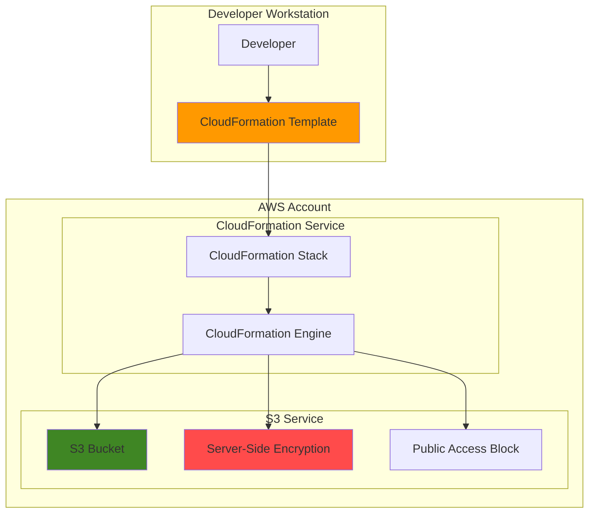

# Simple Infrastructure Templates with CloudFormation and S3

## Problem

Organizations struggle with manual infrastructure provisioning that leads to configuration drift, human errors, and inconsistent environments across development and production. Manual S3 bucket creation often results in security misconfigurations, missing encryption settings, and inconsistent access policies that expose sensitive data to unauthorized access.

## Solution

AWS CloudFormation provides Infrastructure as Code (IaC) capabilities that automate resource provisioning through declarative templates. By creating a CloudFormation template for S3 bucket deployment, we establish repeatable, version-controlled infrastructure that ensures consistent security configurations and eliminates manual setup errors across all environments.

## Architecture Diagram



## Prerequisites

1. AWS account with CloudFormation and S3 permissions
2. AWS CLI v2 installed and configured (or AWS CloudShell)
3. Basic understanding of YAML syntax and AWS services
4. Text editor for creating template files
5. Estimated cost: $0.02-0.10/month for S3 storage (minimal usage)

> **Note**: CloudFormation itself is free, but you pay for the AWS resources it creates. S3 charges are based on storage usage, requests, and data transfer.

## Preparation

```bash
# Set environment variables for AWS configuration
export AWS_REGION=$(aws configure get region)
export AWS_ACCOUNT_ID=$(aws sts get-caller-identity \
    --query Account --output text)

# Generate unique identifier for S3 bucket naming
RANDOM_SUFFIX=$(aws secretsmanager get-random-password \
    --exclude-punctuation --exclude-uppercase \
    --password-length 6 --require-each-included-type \
    --output text --query RandomPassword)

# Set stack and bucket names
export STACK_NAME="simple-s3-infrastructure"
export BUCKET_NAME="my-infrastructure-bucket-${RANDOM_SUFFIX}"

echo "✅ AWS environment configured"
echo "Stack Name: ${STACK_NAME}"
echo "Bucket Name: ${BUCKET_NAME}"
```

## Steps

1. **Create CloudFormation Template File**:

   Infrastructure as Code transforms manual processes into automated, repeatable deployments. This CloudFormation template defines an S3 bucket using YAML syntax with enterprise-grade security settings including AES-256 encryption, versioning for data protection, and comprehensive public access blocking that follows AWS security best practices and prevents accidental data exposure.

   ```bash
   # Create template file with S3 bucket definition
   cat > s3-infrastructure-template.yaml << 'EOF'
   AWSTemplateFormatVersion: '2010-09-09'
   Description: 'Simple S3 bucket with security best practices'
   
   Parameters:
     BucketName:
       Type: String
       Description: Name for the S3 bucket
       MinLength: 3
       MaxLength: 63
   
   Resources:
     MyS3Bucket:
       Type: AWS::S3::Bucket
       Properties:
         BucketName: !Ref BucketName
         VersioningConfiguration:
           Status: Enabled
         BucketEncryption:
           ServerSideEncryptionConfiguration:
             - ServerSideEncryptionByDefault:
                 SSEAlgorithm: AES256
               BucketKeyEnabled: true
         PublicAccessBlockConfiguration:
           BlockPublicAcls: true
           BlockPublicPolicy: true
           IgnorePublicAcls: true
           RestrictPublicBuckets: true
         Tags:
           - Key: Environment
             Value: Development
           - Key: Purpose
             Value: Infrastructure-Template-Demo
   
   Outputs:
     BucketName:
       Description: Name of the created S3 bucket
       Value: !Ref MyS3Bucket
       Export:
         Name: !Sub "${AWS::StackName}-BucketName"
     BucketArn:
       Description: ARN of the created S3 bucket
       Value: !GetAtt MyS3Bucket.Arn
   EOF
   
   echo "✅ CloudFormation template created"
   ```

   The template now exists locally with parameterized configuration that enables reusable deployments across different environments while maintaining consistent security posture through declarative resource definitions.

2. **Validate the CloudFormation Template**:

   Template validation ensures your infrastructure code is syntactically correct and follows CloudFormation specifications before deployment. CloudFormation first checks JSON validity, then YAML syntax, catching configuration errors early in the development process and preventing deployment failures from malformed templates.

   ```bash
   # Validate template syntax and structure
   aws cloudformation validate-template \
       --template-body file://s3-infrastructure-template.yaml
   
   echo "✅ Template validation successful"
   ```

   Successful validation confirms the template structure is correct, parameters are properly defined, and resource properties follow AWS CloudFormation specifications. This validation step is crucial for identifying syntax errors before attempting stack deployment.

3. **Deploy the CloudFormation Stack**:

   CloudFormation stack deployment converts your template into actual AWS resources through the CloudFormation service engine. The stack creation process orchestrates resource provisioning, manages dependencies automatically, and provides comprehensive rollback capabilities if any resource fails to create properly, ensuring infrastructure consistency.

   ```bash
   # Create CloudFormation stack with S3 bucket
   aws cloudformation create-stack \
       --stack-name ${STACK_NAME} \
       --template-body file://s3-infrastructure-template.yaml \
       --parameters ParameterKey=BucketName,ParameterValue=${BUCKET_NAME}
   
   echo "✅ Stack deployment initiated"
   ```

   The stack creation command returns immediately with a stack ID, while actual resource provisioning occurs asynchronously. CloudFormation manages the complex orchestration of AWS service APIs to create your S3 bucket with the specified security configurations.

4. **Monitor Stack Creation Progress**:

   Stack monitoring provides real-time visibility into resource creation status and helps identify any issues during deployment. CloudFormation events provide detailed progression information for each resource, including timestamps, status updates, and descriptive error messages if problems occur during provisioning.

   ```bash
   # Wait for stack creation to complete
   aws cloudformation wait stack-create-complete \
       --stack-name ${STACK_NAME}
   
   # Check stack status and events
   aws cloudformation describe-stacks \
       --stack-name ${STACK_NAME} \
       --query 'Stacks[0].StackStatus' \
       --output text
   
   echo "✅ Stack creation completed"
   ```

   The wait command blocks execution until the stack reaches a completed state (either CREATE_COMPLETE or CREATE_FAILED), providing a synchronous deployment experience while CloudFormation handles the asynchronous resource creation process.

5. **Retrieve Stack Outputs**:

   CloudFormation outputs provide essential information about created resources that can be consumed by other stacks, applications, or automation scripts. These outputs enable infrastructure composition patterns where multiple stacks work together through cross-stack references, supporting modular architecture and service integration.

   ```bash
   # Get stack outputs with resource information
   aws cloudformation describe-stacks \
       --stack-name ${STACK_NAME} \
       --query 'Stacks[0].Outputs' \
       --output table
   
   # Store bucket name from stack output
   CREATED_BUCKET=$(aws cloudformation describe-stacks \
       --stack-name ${STACK_NAME} \
       --query 'Stacks[0].Outputs[?OutputKey==`BucketName`].OutputValue' \
       --output text)
   
   echo "✅ Created bucket: ${CREATED_BUCKET}"
   ```

   Stack outputs now provide the actual bucket name and ARN for integration with other AWS services or external systems, enabling programmatic access to infrastructure resource identifiers.

## Validation & Testing

1. Verify S3 bucket was created with correct configuration:

   ```bash
   # Check bucket exists and location
   aws s3api head-bucket --bucket ${CREATED_BUCKET}
   aws s3api get-bucket-location --bucket ${CREATED_BUCKET}
   ```

   Expected output: HTTP 200 response and bucket region information

2. Validate bucket encryption settings:

   ```bash
   # Verify server-side encryption configuration
   aws s3api get-bucket-encryption --bucket ${CREATED_BUCKET}
   ```

   Expected output: AES256 encryption configuration with BucketKeyEnabled

3. Check versioning and public access settings:

   ```bash
   # Verify versioning is enabled
   aws s3api get-bucket-versioning --bucket ${CREATED_BUCKET}
   
   # Verify public access is blocked
   aws s3api get-public-access-block --bucket ${CREATED_BUCKET}
   ```

   Expected output: Versioning status "Enabled" and all public access blocks set to "true"

4. Test basic bucket functionality:

   ```bash
   # Upload a test file to verify bucket works
   echo "Hello CloudFormation!" > test-file.txt
   aws s3 cp test-file.txt s3://${CREATED_BUCKET}/
   
   # List bucket contents
   aws s3 ls s3://${CREATED_BUCKET}/
   ```

## Cleanup

1. Remove test files from S3 bucket:

   ```bash
   # Delete all objects in bucket (required before stack deletion)
   aws s3 rm s3://${CREATED_BUCKET}/ --recursive
   
   echo "✅ Bucket contents removed"
   ```

2. Delete the CloudFormation stack:

   ```bash
   # Delete CloudFormation stack
   aws cloudformation delete-stack --stack-name ${STACK_NAME}
   
   # Wait for stack deletion to complete
   aws cloudformation wait stack-delete-complete \
       --stack-name ${STACK_NAME}
   
   echo "✅ CloudFormation stack deleted"
   ```

3. Clean up local files:

   ```bash
   # Remove local template and test files
   rm -f s3-infrastructure-template.yaml test-file.txt
   
   # Clear environment variables
   unset STACK_NAME BUCKET_NAME CREATED_BUCKET RANDOM_SUFFIX
   
   echo "✅ Local cleanup completed"
   ```

## Discussion

CloudFormation transforms infrastructure management from manual, error-prone processes into automated, repeatable deployments that align with AWS Well-Architected Framework principles. This recipe demonstrates core Infrastructure as Code concepts by defining S3 bucket configuration in a version-controlled template that ensures consistent deployments across environments. The template includes essential security configurations like AES-256 encryption at rest, versioning for data protection, and comprehensive public access blocking to prevent accidental data exposure.

The declarative approach means you specify the desired end state rather than the procedural steps to achieve it. CloudFormation handles the complex orchestration of resource creation, dependency management, and rollback scenarios automatically. This abstraction reduces operational complexity while providing deterministic infrastructure provisioning that scales from single resources to complex multi-service architectures with hundreds of interconnected components.

Stack outputs enable infrastructure composition by exposing resource identifiers that other stacks can reference through cross-stack imports. This pattern supports modular architecture where networking, security, and application components are managed in separate templates but work together seamlessly. Template parameterization allows the same infrastructure code to be deployed across multiple environments (development, staging, production) with environment-specific configurations while maintaining consistency in resource definitions and security policies.

> **Tip**: Use CloudFormation drift detection with `aws cloudformation detect-stack-drift` to identify when resources have been modified outside of CloudFormation and restore consistency with your infrastructure code.

This solution follows AWS Well-Architected Framework principles by enabling operational excellence through automated deployments, security through consistent configurations, reliability through automatic rollback capabilities, performance efficiency through optimized resource provisioning, and cost optimization through declarative resource lifecycle management. For comprehensive guidance on CloudFormation best practices, see the [AWS CloudFormation User Guide](https://docs.aws.amazon.com/AWSCloudFormation/latest/UserGuide/Welcome.html). The S3 security configurations follow AWS security best practices outlined in the [Amazon S3 Security Best Practices Guide](https://docs.aws.amazon.com/AmazonS3/latest/userguide/security-best-practices.html). Additional template examples and advanced patterns are available in the [AWS CloudFormation Sample Templates](https://docs.aws.amazon.com/AWSCloudFormation/latest/UserGuide/sample-templates-services-us-west-2.html). For comprehensive infrastructure as code governance and compliance guidance, refer to the [AWS Well-Architected Framework](https://docs.aws.amazon.com/wellarchitected/latest/framework/welcome.html).

## Challenge

Extend this infrastructure template by implementing these enhancements:

1. Add CloudTrail logging to track S3 bucket access and modifications for security auditing and compliance requirements
2. Implement S3 lifecycle policies to automatically transition objects to cheaper storage classes (Standard-IA, Glacier) based on access patterns
3. Create multiple environment deployments (dev, staging, prod) using CloudFormation parameters and mappings for environment-specific configurations
4. Add CloudWatch alarms for bucket metrics like object count, storage size, and request rates to monitor usage patterns and costs
5. Integrate AWS Config rules to continuously monitor bucket compliance with security policies and automatically remediate violations

## Infrastructure Code

### Available Infrastructure as Code:

- [Infrastructure Code Overview](code/README.md) - Detailed description of all infrastructure components
- [AWS CDK (Python)](code/cdk-python/) - AWS CDK Python implementation
- [AWS CDK (TypeScript)](code/cdk-typescript/) - AWS CDK TypeScript implementation
- [CloudFormation](code/cloudformation.yaml) - AWS CloudFormation template
- [Bash CLI Scripts](code/scripts/) - Example bash scripts using AWS CLI commands to deploy infrastructure
- [Terraform](code/terraform/) - Terraform configuration files