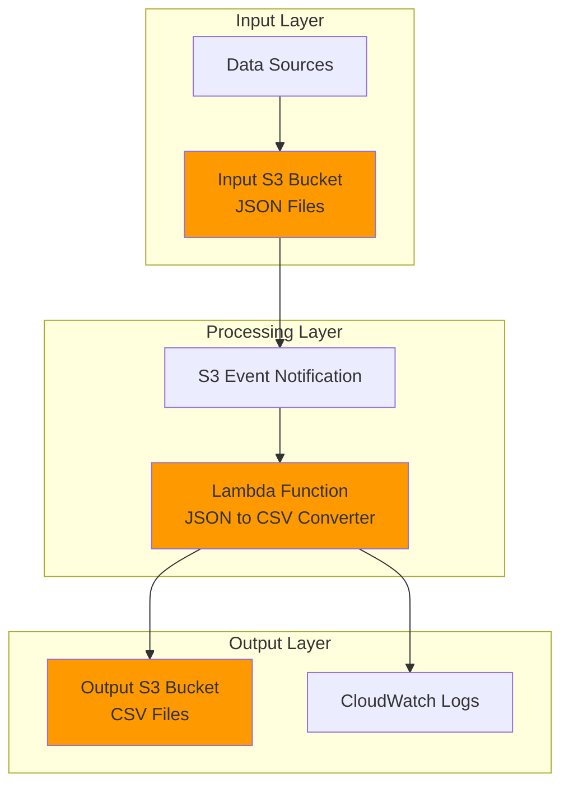

# Simple JSON to CSV Converter with Lambda and S3

## Problem

Organizations frequently receive data in JSON format from APIs, applications, or data feeds, but need to convert this data to CSV format for analysis in spreadsheet applications, business intelligence tools, or data warehouses. Manual conversion processes are time-consuming and error-prone, especially when dealing with large volumes of files or frequent data updates, leading to delayed insights and increased operational overhead.

## Solution

This solution creates an automated, serverless JSON-to-CSV conversion pipeline using AWS Lambda and S3. When JSON files are uploaded to an S3 input bucket, Lambda functions automatically detect the upload event, process the JSON data, convert it to CSV format, and save the result to an output bucket, providing seamless data transformation without server management or infrastructure provisioning.

## Architecture Diagram



## Prerequisites

1. AWS account with appropriate permissions for Lambda, S3, and IAM
2. AWS CLI installed and configured (or AWS CloudShell access)
3. Basic understanding of JSON and CSV data formats
4. Knowledge of Python programming (for Lambda function code)
5. Estimated cost: $0.01-$0.10 for testing (Lambda requests and S3 storage)

> **Note**: This recipe uses AWS free tier eligible services. Costs will be minimal for testing purposes but can scale based on usage volume.

## Preparation

```bash
# Set environment variables
export AWS_REGION=$(aws configure get region)
export AWS_ACCOUNT_ID=$(aws sts get-caller-identity \
    --query Account --output text)

# Generate unique identifiers for resources
RANDOM_SUFFIX=$(aws secretsmanager get-random-password \
    --exclude-punctuation --exclude-uppercase \
    --password-length 6 --require-each-included-type \
    --output text --query RandomPassword)

# Set resource names
export INPUT_BUCKET_NAME="json-input-${RANDOM_SUFFIX}"
export OUTPUT_BUCKET_NAME="csv-output-${RANDOM_SUFFIX}"
export LAMBDA_FUNCTION_NAME="json-csv-converter-${RANDOM_SUFFIX}"
export LAMBDA_ROLE_NAME="json-csv-converter-role-${RANDOM_SUFFIX}"

echo "✅ AWS environment configured with unique resource names"
```

## Steps

1. **Create S3 Buckets for Input and Output**:

   Amazon S3 provides highly durable object storage with 99.999999999% (11 9's) durability, making it ideal for data transformation workflows. Creating separate input and output buckets follows AWS best practices by preventing recursive triggers and enabling clear data flow separation while providing robust storage for both source and transformed data.

   ```bash
   # Create input bucket for JSON files
   aws s3 mb s3://${INPUT_BUCKET_NAME} --region ${AWS_REGION}
   
   # Create output bucket for CSV files
   aws s3 mb s3://${OUTPUT_BUCKET_NAME} --region ${AWS_REGION}
   
   # Enable versioning for data protection
   aws s3api put-bucket-versioning \
       --bucket ${INPUT_BUCKET_NAME} \
       --versioning-configuration Status=Enabled
   
   aws s3api put-bucket-versioning \
       --bucket ${OUTPUT_BUCKET_NAME} \
       --versioning-configuration Status=Enabled
   
   echo "✅ S3 buckets created with versioning enabled"
   ```

   The buckets are now ready with enterprise-grade durability and versioning capabilities. This foundational step establishes the data storage layer that will handle both input JSON files and converted CSV outputs with automatic backup through versioning.

2. **Create IAM Role for Lambda Function**:

   Lambda functions require an IAM execution role that defines what AWS services the function can access. This role follows the principle of least privilege, granting only the minimum permissions required for S3 access and CloudWatch logging, which enhances security posture and reduces potential attack surface.

   ```bash
   # Create trust policy for Lambda service
   cat > trust-policy.json << EOF
   {
     "Version": "2012-10-17",
     "Statement": [
       {
         "Effect": "Allow",
         "Principal": {
           "Service": "lambda.amazonaws.com"
         },
         "Action": "sts:AssumeRole"
       }
     ]
   }
   EOF
   
   # Create IAM role
   aws iam create-role \
       --role-name ${LAMBDA_ROLE_NAME} \
       --assume-role-policy-document file://trust-policy.json
   
   # Attach basic Lambda execution policy
   aws iam attach-role-policy \
       --role-name ${LAMBDA_ROLE_NAME} \
       --policy-arn arn:aws:iam::aws:policy/service-role/AWSLambdaBasicExecutionRole
   
   echo "✅ IAM role created for Lambda execution"
   ```

   The IAM role is now configured with the trust relationship allowing Lambda to assume the role and execute functions on your behalf. The basic execution policy enables CloudWatch logging for monitoring and troubleshooting.

3. **Create S3 Access Policy for Lambda**:

   This custom policy grants the Lambda function specific permissions to read from the input bucket and write to the output bucket, implementing security best practices through resource-specific access controls and following the AWS Well-Architected Framework security pillar.

   ```bash
   # Create S3 access policy
   cat > s3-policy.json << EOF
   {
     "Version": "2012-10-17",
     "Statement": [
       {
         "Effect": "Allow",
         "Action": [
           "s3:GetObject"
         ],
         "Resource": "arn:aws:s3:::${INPUT_BUCKET_NAME}/*"
       },
       {
         "Effect": "Allow",
         "Action": [
           "s3:PutObject"
         ],
         "Resource": "arn:aws:s3:::${OUTPUT_BUCKET_NAME}/*"
       }
     ]
   }
   EOF
   
   # Create and attach the policy
   aws iam put-role-policy \
       --role-name ${LAMBDA_ROLE_NAME} \
       --policy-name S3AccessPolicy \
       --policy-document file://s3-policy.json
   
   echo "✅ S3 access policy attached to Lambda role"
   ```

   The Lambda function now has precisely the permissions needed to read JSON files from the input bucket and write CSV files to the output bucket, with no additional privileges that could compromise security.

4. **Create Lambda Function Code**:

   The Lambda function uses Python's built-in JSON and CSV libraries to perform data transformation. This serverless approach automatically scales based on the number of files uploaded and provides built-in error handling and retry mechanisms, eliminating the need for server provisioning or capacity planning.

   ```bash
   # Create Lambda function code
   cat > lambda_function.py << 'EOF'
   import json
   import csv
   import boto3
   import urllib.parse
   import os
   from io import StringIO
   
   s3_client = boto3.client('s3')
   
   def lambda_handler(event, context):
       try:
           # Get bucket and object key from S3 event
           bucket = event['Records'][0]['s3']['bucket']['name']
           key = urllib.parse.unquote_plus(
               event['Records'][0]['s3']['object']['key'], 
               encoding='utf-8'
           )
           
           print(f"Processing file: {key} from bucket: {bucket}")
           
           # Read JSON file from S3
           response = s3_client.get_object(Bucket=bucket, Key=key)
           json_content = response['Body'].read().decode('utf-8')
           data = json.loads(json_content)
           
           # Convert JSON to CSV
           if isinstance(data, list) and len(data) > 0:
               # Handle array of objects
               csv_buffer = StringIO()
               if isinstance(data[0], dict):
                   fieldnames = data[0].keys()
                   writer = csv.DictWriter(csv_buffer, fieldnames=fieldnames)
                   writer.writeheader()
                   writer.writerows(data)
               else:
                   # Handle array of simple values
                   writer = csv.writer(csv_buffer)
                   writer.writerow(['value'])  # Add header for simple values
                   for item in data:
                       writer.writerow([item])
           elif isinstance(data, dict):
               # Handle single object
               csv_buffer = StringIO()
               writer = csv.DictWriter(csv_buffer, fieldnames=data.keys())
               writer.writeheader()
               writer.writerow(data)
           else:
               raise ValueError("Unsupported JSON structure")
           
           # Generate output file name
           output_key = key.replace('.json', '.csv')
           
           # Upload CSV to output bucket
           s3_client.put_object(
               Bucket=os.environ['OUTPUT_BUCKET'],
               Key=output_key,
               Body=csv_buffer.getvalue(),
               ContentType='text/csv'
           )
           
           print(f"Successfully converted {key} to {output_key}")
           
           return {
               'statusCode': 200,
               'body': json.dumps(f'Successfully converted {key} to CSV')
           }
           
       except Exception as e:
           print(f"Error processing file {key}: {str(e)}")
           raise e
   EOF
   
   # Create deployment package
   zip lambda-deployment.zip lambda_function.py
   
   echo "✅ Lambda function code created and packaged"
   ```

   The function code now handles multiple JSON data structures including arrays of objects, arrays of simple values, and single objects. The improved error handling and logging provide better visibility into processing operations and failures.

5. **Deploy Lambda Function**:

   AWS Lambda provides automatic scaling and high availability for serverless compute workloads. The function configuration includes memory allocation, timeout settings, and environment variables that control its behavior and performance characteristics while using the latest Python runtime for optimal performance and security.

   ```bash
   # Get IAM role ARN
   ROLE_ARN=$(aws iam get-role \
       --role-name ${LAMBDA_ROLE_NAME} \
       --query 'Role.Arn' --output text)
   
   # Create Lambda function
   aws lambda create-function \
       --function-name ${LAMBDA_FUNCTION_NAME} \
       --runtime python3.12 \
       --role ${ROLE_ARN} \
       --handler lambda_function.lambda_handler \
       --zip-file fileb://lambda-deployment.zip \
       --timeout 60 \
       --memory-size 256 \
       --environment Variables="{OUTPUT_BUCKET=${OUTPUT_BUCKET_NAME}}"
   
   # Wait for function to be active
   aws lambda wait function-active \
       --function-name ${LAMBDA_FUNCTION_NAME}
   
   echo "✅ Lambda function deployed successfully"
   ```

   The Lambda function is now deployed with the current Python 3.12 runtime, providing better performance and security compared to older versions. The function configuration balances cost efficiency with processing capability through appropriate memory and timeout settings.

6. **Configure S3 Event Trigger**:

   S3 event notifications enable event-driven processing by automatically triggering Lambda functions when objects are created, modified, or deleted. This configuration creates a seamless data pipeline that processes files as soon as they're uploaded, eliminating the need for polling or scheduled processing.

   ```bash
   # Add permission for S3 to invoke Lambda
   aws lambda add-permission \
       --function-name ${LAMBDA_FUNCTION_NAME} \
       --principal s3.amazonaws.com \
       --action lambda:InvokeFunction \
       --statement-id s3-trigger-permission \
       --source-arn arn:aws:s3:::${INPUT_BUCKET_NAME}
   
   # Get Lambda function ARN
   LAMBDA_ARN=$(aws lambda get-function \
       --function-name ${LAMBDA_FUNCTION_NAME} \
       --query 'Configuration.FunctionArn' --output text)
   
   # Create notification configuration
   cat > notification-config.json << EOF
   {
     "LambdaConfigurations": [
       {
         "Id": "json-csv-converter-trigger",
         "LambdaFunctionArn": "${LAMBDA_ARN}",
         "Events": ["s3:ObjectCreated:*"],
         "Filter": {
           "Key": {
             "FilterRules": [
               {
                 "Name": "suffix",
                 "Value": ".json"
               }
             ]
           }
         }
       }
     ]
   }
   EOF
   
   # Configure S3 bucket notification
   aws s3api put-bucket-notification-configuration \
       --bucket ${INPUT_BUCKET_NAME} \
       --notification-configuration file://notification-config.json
   
   echo "✅ S3 event trigger configured for JSON files"
   ```

   The event-driven architecture is now complete, with S3 automatically triggering the Lambda function whenever JSON files are uploaded. The filter ensures only JSON files trigger processing, preventing unnecessary function invocations and costs.

## Validation & Testing

1. **Create test JSON file and upload to input bucket**:

   ```bash
   # Create sample JSON data for testing
   cat > sample-data.json << EOF
   [
     {
       "id": 1,
       "name": "John Doe",
       "email": "john@example.com",
       "department": "Engineering"
     },
     {
       "id": 2,
       "name": "Jane Smith",
       "email": "jane@example.com",
       "department": "Marketing"
     },
     {
       "id": 3,
       "name": "Bob Wilson",
       "email": "bob@example.com",
       "department": "Sales"
     }
   ]
   EOF
   
   # Upload test file to input bucket
   aws s3 cp sample-data.json s3://${INPUT_BUCKET_NAME}/
   
   echo "✅ Test JSON file uploaded to input bucket"
   ```

   Expected output: Upload should complete successfully and trigger Lambda function automatically.

2. **Verify Lambda function execution**:

   ```bash
   # Wait a few seconds for processing
   sleep 10
   
   # Check Lambda function logs
   LOG_STREAM=$(aws logs describe-log-streams \
       --log-group-name /aws/lambda/${LAMBDA_FUNCTION_NAME} \
       --order-by LastEventTime --descending \
       --max-items 1 \
       --query 'logStreams[0].logStreamName' --output text)
   
   # Display recent log events
   aws logs get-log-events \
       --log-group-name /aws/lambda/${LAMBDA_FUNCTION_NAME} \
       --log-stream-name ${LOG_STREAM} \
       --query 'events[*].message' --output text
   ```

   Expected output: Log messages showing successful file processing and conversion.

3. **Verify CSV file creation in output bucket**:

   ```bash
   # List files in output bucket
   aws s3 ls s3://${OUTPUT_BUCKET_NAME}/
   
   # Download and display the converted CSV file
   aws s3 cp s3://${OUTPUT_BUCKET_NAME}/sample-data.csv ./
   cat sample-data.csv
   ```

   Expected output: CSV file with headers (id,name,email,department) and properly formatted data rows.

## Cleanup

1. **Remove S3 bucket contents and buckets**:

   ```bash
   # Empty and delete input bucket
   aws s3 rm s3://${INPUT_BUCKET_NAME} --recursive
   aws s3 rb s3://${INPUT_BUCKET_NAME}
   
   # Empty and delete output bucket
   aws s3 rm s3://${OUTPUT_BUCKET_NAME} --recursive
   aws s3 rb s3://${OUTPUT_BUCKET_NAME}
   
   echo "✅ S3 buckets deleted"
   ```

2. **Delete Lambda function**:

   ```bash
   # Delete Lambda function
   aws lambda delete-function \
       --function-name ${LAMBDA_FUNCTION_NAME}
   
   echo "✅ Lambda function deleted"
   ```

3. **Remove IAM role and policies**:

   ```bash
   # Detach policies from role
   aws iam detach-role-policy \
       --role-name ${LAMBDA_ROLE_NAME} \
       --policy-arn arn:aws:iam::aws:policy/service-role/AWSLambdaBasicExecutionRole
   
   # Delete inline policy
   aws iam delete-role-policy \
       --role-name ${LAMBDA_ROLE_NAME} \
       --policy-name S3AccessPolicy
   
   # Delete IAM role
   aws iam delete-role --role-name ${LAMBDA_ROLE_NAME}
   
   echo "✅ IAM role and policies deleted"
   ```

4. **Clean up local files**:

   ```bash
   # Remove temporary files
   rm -f trust-policy.json s3-policy.json
   rm -f lambda_function.py lambda-deployment.zip
   rm -f notification-config.json sample-data.json sample-data.csv
   
   echo "✅ Local files cleaned up"
   ```

## Discussion

This serverless JSON-to-CSV converter demonstrates the power of event-driven architecture using AWS Lambda and S3. The solution automatically scales based on the number of files uploaded, processing multiple files concurrently without any server management overhead. Lambda's pay-per-invocation pricing model ensures cost efficiency, especially for sporadic or variable workloads where traditional server-based solutions would incur unnecessary costs.

The architecture follows AWS Well-Architected Framework principles, particularly in the areas of cost optimization and operational excellence. By using separate S3 buckets for input and output, we prevent recursive triggers that could cause infinite loops and excessive charges. The IAM role implements least privilege access, granting only the minimum permissions required for the function to operate, which enhances security posture and reduces potential attack surface.

S3 event notifications provide near real-time processing capabilities, typically triggering Lambda functions within seconds of file upload. This responsiveness makes the solution suitable for time-sensitive data processing workflows. The built-in retry mechanisms and error handling in Lambda ensure reliable processing, while CloudWatch logs provide comprehensive monitoring and troubleshooting capabilities for operational visibility.

For production deployments, consider implementing additional features such as dead letter queues for failed processing attempts, input validation to handle malformed JSON files gracefully, and CloudWatch alarms for monitoring processing metrics. Enhanced error handling could include retry logic for transient failures and notification systems for persistent errors. The [AWS Lambda Developer Guide](https://docs.aws.amazon.com/lambda/latest/dg/) provides comprehensive guidance on best practices, while the [Amazon S3 Event Notifications documentation](https://docs.aws.amazon.com/AmazonS3/latest/userguide/EventNotifications.html) offers detailed configuration options for event-driven architectures.

> **Tip**: Use CloudWatch metrics to monitor Lambda function duration, error rates, and concurrent executions to optimize memory allocation and identify potential performance bottlenecks in your data processing pipeline.

## Challenge

Extend this solution by implementing these enhancements:

1. **Add support for nested JSON structures** by implementing flattening logic that converts complex objects into flat CSV columns with dot notation (e.g., "address.city", "address.zipcode").

2. **Implement error handling with dead letter queues** to capture and reprocess failed conversions, including SNS notifications for administrator alerts when processing failures occur.

3. **Create a batch processing mode** that combines multiple small JSON files into a single CSV file, reducing S3 storage costs and improving downstream analytics performance.

4. **Add data validation and transformation rules** using AWS Step Functions to orchestrate complex data processing workflows, including data cleansing, format validation, and conditional processing paths.

5. **Implement multi-format support** by extending the Lambda function to detect and convert various input formats (XML, YAML, TSV) to standardized CSV output, making it a universal data conversion service.

## Infrastructure Code

### Available Infrastructure as Code:

- [Infrastructure Code Overview](code/README.md) - Detailed description of all infrastructure components
- [AWS CDK (Python)](code/cdk-python/) - AWS CDK Python implementation
- [AWS CDK (TypeScript)](code/cdk-typescript/) - AWS CDK TypeScript implementation
- [CloudFormation](code/cloudformation.yaml) - AWS CloudFormation template
- [Bash CLI Scripts](code/scripts/) - Example bash scripts using AWS CLI commands to deploy infrastructure
- [Terraform](code/terraform/) - Terraform configuration files