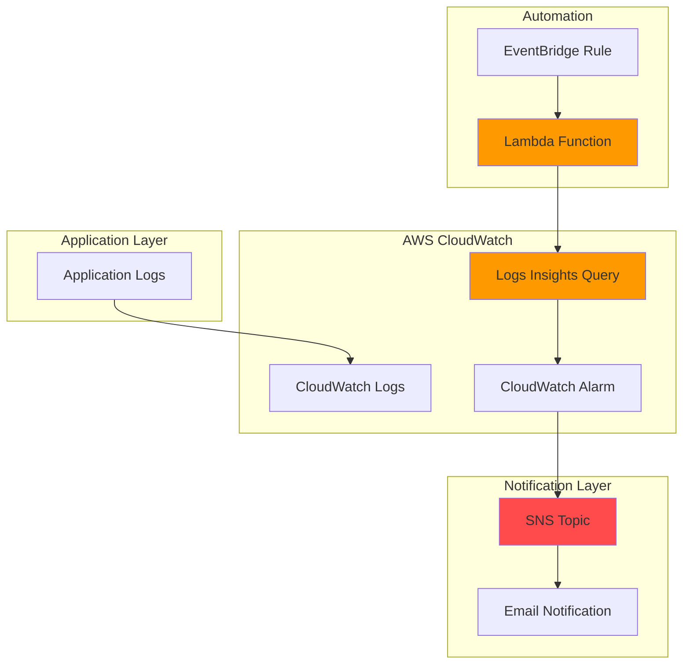

# Simple Log Analysis with CloudWatch Insights and SNS

## Problem

Organizations struggle to monitor application performance and detect critical issues in their log data due to the overwhelming volume of log events generated by modern applications. Without automated log analysis and alerting, teams often discover problems only after customers report issues, leading to prolonged downtime and poor user experience. Manual log review processes are time-consuming and prone to missing important patterns that indicate system failures or security threats.

## Solution

Create an automated log monitoring solution using CloudWatch Logs Insights to query application logs for specific error patterns and automatically send notifications via SNS when critical issues are detected. This approach combines CloudWatch's powerful query capabilities with Lambda-based automation to provide real-time alerting for log-based anomalies, enabling proactive incident response and improved system reliability.

## Architecture Diagram



## Prerequisites

1. AWS account with permissions for CloudWatch, SNS, Lambda, and IAM services
2. AWS CLI v2 installed and configured (or AWS CloudShell access)
3. Basic understanding of AWS services and log analysis concepts
4. Email address for receiving notifications
5. Estimated cost: $0.10-$1.00 for testing (mainly CloudWatch Logs Insights queries at $0.005 per GB scanned)

> **Note**: This recipe follows AWS Well-Architected Framework principles for operational excellence and reliability. Ensure you have appropriate IAM permissions before proceeding.

## Preparation

```bash
# Set environment variables
export AWS_REGION=$(aws configure get region)
export AWS_ACCOUNT_ID=$(aws sts get-caller-identity \
    --query Account --output text)

# Generate unique identifiers for resources
RANDOM_SUFFIX=$(aws secretsmanager get-random-password \
    --exclude-punctuation --exclude-uppercase \
    --password-length 6 --require-each-included-type \
    --output text --query RandomPassword)

# Set resource names
export LOG_GROUP_NAME="/aws/lambda/demo-app-${RANDOM_SUFFIX}"
export SNS_TOPIC_NAME="log-analysis-alerts-${RANDOM_SUFFIX}"
export LAMBDA_FUNCTION_NAME="log-analyzer-${RANDOM_SUFFIX}"
export ALARM_NAME="error-pattern-alarm-${RANDOM_SUFFIX}"

echo "✅ Environment variables configured"
echo "Log Group: ${LOG_GROUP_NAME}"
echo "SNS Topic: ${SNS_TOPIC_NAME}"
echo "Lambda Function: ${LAMBDA_FUNCTION_NAME}"
```

## Steps

1. **Create CloudWatch Log Group and Generate Sample Logs**:

   CloudWatch Logs provides centralized log storage and management for AWS resources and applications. Creating a dedicated log group establishes the foundation for our log analysis solution, enabling structured log storage with configurable retention policies and access controls that support enterprise-scale log aggregation.

   ```bash
   # Create CloudWatch log group
   aws logs create-log-group \
       --log-group-name ${LOG_GROUP_NAME} \
       --region ${AWS_REGION}
   
   # Set log retention to 7 days for cost optimization
   aws logs put-retention-policy \
       --log-group-name ${LOG_GROUP_NAME} \
       --retention-in-days 7
   
   echo "✅ Log group created: ${LOG_GROUP_NAME}"
   ```

2. **Generate Sample Log Events**:

   To demonstrate log analysis capabilities, we'll create sample log entries that include both normal application events and error patterns. This simulates a real-world application environment where various log levels and message types provide the foundation for effective monitoring and alerting strategies.

   ```bash
   # Create sample log events with different severity levels
   CURRENT_TIME=$(date +%s000)
   
   # Normal application logs
   aws logs put-log-events \
       --log-group-name ${LOG_GROUP_NAME} \
       --log-stream-name "application-stream" \
       --log-events \
       timestamp=${CURRENT_TIME},message="INFO: Application started successfully" \
       timestamp=$((CURRENT_TIME + 1000)),message="INFO: User authentication completed" \
       timestamp=$((CURRENT_TIME + 2000)),message="DEBUG: Database connection established"
   
   # Error log events to trigger alerts
   aws logs put-log-events \
       --log-group-name ${LOG_GROUP_NAME} \
       --log-stream-name "error-stream" \
       --log-events \
       timestamp=$((CURRENT_TIME + 3000)),message="ERROR: Database connection failed - timeout" \
       timestamp=$((CURRENT_TIME + 4000)),message="ERROR: Authentication service unavailable" \
       timestamp=$((CURRENT_TIME + 5000)),message="CRITICAL: Application crash detected"
   
   echo "✅ Sample log events created"
   ```

3. **Create SNS Topic for Notifications**:

   Amazon SNS provides reliable, scalable message delivery that enables immediate notification of critical log patterns. The SNS topic serves as the central communication hub for alert distribution, supporting multiple notification endpoints including email, SMS, and integration with incident management systems for comprehensive alerting strategies.

   ```bash
   # Create SNS topic for log alerts
   SNS_TOPIC_ARN=$(aws sns create-topic \
       --name ${SNS_TOPIC_NAME} \
       --query 'TopicArn' --output text)
   
   # Subscribe email address to receive notifications
   read -p "Enter your email address for notifications: " EMAIL_ADDRESS
   aws sns subscribe \
       --topic-arn ${SNS_TOPIC_ARN} \
       --protocol email \
       --notification-endpoint ${EMAIL_ADDRESS}
   
   echo "✅ SNS topic created: ${SNS_TOPIC_ARN}"
   echo "Check your email and confirm the subscription"
   ```

4. **Create IAM Role for Lambda Function**:

   AWS Lambda requires appropriate IAM permissions to access CloudWatch Logs for querying and SNS for sending notifications. This role implementation follows the principle of least privilege, granting only the specific permissions required for log analysis and notification delivery while maintaining security best practices.

   ```bash
   # Create trust policy for Lambda
   cat > lambda-trust-policy.json << 'EOF'
   {
       "Version": "2012-10-17",
       "Statement": [
           {
               "Effect": "Allow",
               "Principal": {
                   "Service": "lambda.amazonaws.com"
               },
               "Action": "sts:AssumeRole"
           }
       ]
   }
   EOF
   
   # Create Lambda execution role
   LAMBDA_ROLE_ARN=$(aws iam create-role \
       --role-name log-analyzer-role-${RANDOM_SUFFIX} \
       --assume-role-policy-document file://lambda-trust-policy.json \
       --query 'Role.Arn' --output text)
   
   # Attach necessary policies
   aws iam attach-role-policy \
       --role-name log-analyzer-role-${RANDOM_SUFFIX} \
       --policy-arn arn:aws:iam::aws:policy/service-role/AWSLambdaBasicExecutionRole
   
   # Create custom policy for CloudWatch Logs and SNS access
   cat > lambda-permissions-policy.json << EOF
   {
       "Version": "2012-10-17",
       "Statement": [
           {
               "Effect": "Allow",
               "Action": [
                   "logs:StartQuery",
                   "logs:GetQueryResults",
                   "logs:StopQuery",
                   "logs:DescribeLogGroups",
                   "logs:DescribeLogStreams"
               ],
               "Resource": "*"
           },
           {
               "Effect": "Allow",
               "Action": [
                   "sns:Publish"
               ],
               "Resource": "${SNS_TOPIC_ARN}"
           }
       ]
   }
   EOF
   
   aws iam put-role-policy \
       --role-name log-analyzer-role-${RANDOM_SUFFIX} \
       --policy-name LogAnalyzerPolicy \
       --policy-document file://lambda-permissions-policy.json
   
   echo "✅ IAM role created: ${LAMBDA_ROLE_ARN}"
   ```

5. **Create Lambda Function for Log Analysis**:

   The Lambda function implements automated log analysis using CloudWatch Logs Insights queries to detect error patterns and trigger notifications. This serverless approach provides cost-effective, event-driven log monitoring that scales automatically based on query frequency while eliminating server management overhead.

   ```bash
   # Create Lambda function code
   cat > log_analyzer.py << 'EOF'
   import json
   import boto3
   import time
   import os
   from datetime import datetime, timedelta
   
   def lambda_handler(event, context):
       logs_client = boto3.client('logs')
       sns_client = boto3.client('sns')
       
       log_group = os.environ['LOG_GROUP_NAME']
       sns_topic = os.environ['SNS_TOPIC_ARN']
       
       # Define time range (last 10 minutes)
       end_time = datetime.now()
       start_time = end_time - timedelta(minutes=10)
       
       # CloudWatch Logs Insights query for error patterns
       query = '''
       fields @timestamp, @message
       | filter @message like /ERROR|CRITICAL/
       | sort @timestamp desc
       | limit 100
       '''
       
       try:
           # Start the query
           response = logs_client.start_query(
               logGroupName=log_group,
               startTime=int(start_time.timestamp()),
               endTime=int(end_time.timestamp()),
               queryString=query
           )
           
           query_id = response['queryId']
           
           # Wait for query completion
           while True:
               time.sleep(2)
               result = logs_client.get_query_results(queryId=query_id)
               if result['status'] == 'Complete':
                   break
               elif result['status'] == 'Failed':
                   raise Exception('Query failed')
           
           # Process results
           error_count = len(result['results'])
           
           if error_count > 0:
               # Format alert message
               alert_message = f"""
   🚨 Log Analysis Alert
   
   Time: {datetime.now().strftime('%Y-%m-%d %H:%M:%S')}
   Log Group: {log_group}
   Error Count: {error_count} errors found in the last 10 minutes
   
   Recent Errors:
   """
               
               for i, log_entry in enumerate(result['results'][:5]):  # Show first 5 errors
                   timestamp = next(field['value'] for field in log_entry if field['field'] == '@timestamp')
                   message = next(field['value'] for field in log_entry if field['field'] == '@message')
                   alert_message += f"\n{i+1}. {timestamp}: {message}"
               
               # Send SNS notification
               sns_client.publish(
                   TopicArn=sns_topic,
                   Subject='CloudWatch Log Analysis Alert',
                   Message=alert_message
               )
               
               print(f"Alert sent: {error_count} errors detected")
           else:
               print("No errors detected in recent logs")
           
           return {
               'statusCode': 200,
               'body': json.dumps({
                   'error_count': error_count,
                   'status': 'success'
               })
           }
           
       except Exception as e:
           print(f"Error analyzing logs: {str(e)}")
           return {
               'statusCode': 500,
               'body': json.dumps({
                   'error': str(e),
                   'status': 'error'
               })
           }
   EOF
   
   # Package Lambda function
   zip -q lambda-function.zip log_analyzer.py
   
   # Wait for IAM role propagation
   echo "Waiting for IAM role propagation..."
   sleep 10
   
   # Create Lambda function with updated Python runtime
   aws lambda create-function \
       --function-name ${LAMBDA_FUNCTION_NAME} \
       --runtime python3.12 \
       --role ${LAMBDA_ROLE_ARN} \
       --handler log_analyzer.lambda_handler \
       --zip-file fileb://lambda-function.zip \
       --timeout 60 \
       --memory-size 256 \
       --environment Variables="{LOG_GROUP_NAME=${LOG_GROUP_NAME},SNS_TOPIC_ARN=${SNS_TOPIC_ARN}}"
   
   echo "✅ Lambda function created: ${LAMBDA_FUNCTION_NAME}"
   ```

6. **Create EventBridge Rule for Scheduled Execution**:

   Amazon EventBridge provides reliable, cron-based scheduling that triggers our log analysis function at regular intervals. This automated approach ensures consistent monitoring without manual intervention, enabling continuous log surveillance that can detect and alert on critical issues within minutes of occurrence.

   ```bash
   # Create EventBridge rule for scheduled execution (every 5 minutes)
   aws events put-rule \
       --name log-analysis-schedule-${RANDOM_SUFFIX} \
       --schedule-expression "rate(5 minutes)" \
       --description "Trigger log analysis every 5 minutes"
   
   # Get Lambda function ARN
   LAMBDA_ARN=$(aws lambda get-function \
       --function-name ${LAMBDA_FUNCTION_NAME} \
       --query 'Configuration.FunctionArn' --output text)
   
   # Add Lambda as target for EventBridge rule
   aws events put-targets \
       --rule log-analysis-schedule-${RANDOM_SUFFIX} \
       --targets "Id"="1","Arn"="${LAMBDA_ARN}"
   
   # Grant EventBridge permission to invoke Lambda
   aws lambda add-permission \
       --function-name ${LAMBDA_FUNCTION_NAME} \
       --statement-id allow-eventbridge \
       --action lambda:InvokeFunction \
       --principal events.amazonaws.com \
       --source-arn arn:aws:events:${AWS_REGION}:${AWS_ACCOUNT_ID}:rule/log-analysis-schedule-${RANDOM_SUFFIX}
   
   echo "✅ EventBridge rule configured for automatic execution"
   ```

7. **Test Manual Log Analysis**:

   Before relying on automated scheduling, we'll manually test the log analysis function to verify that it correctly identifies error patterns and sends notifications. This validation step ensures the complete workflow functions properly before enabling continuous monitoring.

   ```bash
   # Manually invoke Lambda function to test functionality
   aws lambda invoke \
       --function-name ${LAMBDA_FUNCTION_NAME} \
       --payload '{}' \
       lambda-response.json
   
   # Display the response
   cat lambda-response.json
   
   echo "✅ Manual test completed - check your email for notification"
   ```

## Validation & Testing

1. **Verify Log Group and Sample Data**:

   ```bash
   # Check log group exists
   aws logs describe-log-groups \
       --log-group-name-prefix ${LOG_GROUP_NAME}
   
   # List log streams
   aws logs describe-log-streams \
       --log-group-name ${LOG_GROUP_NAME}
   ```

   Expected output: Log group details and at least two log streams (application-stream and error-stream).

2. **Test CloudWatch Logs Insights Query**:

   ```bash
   # Run manual Logs Insights query to verify error detection
   QUERY_ID=$(aws logs start-query \
       --log-group-name ${LOG_GROUP_NAME} \
       --start-time $(date -d '1 hour ago' +%s) \
       --end-time $(date +%s) \
       --query-string 'fields @timestamp, @message | filter @message like /ERROR|CRITICAL/ | sort @timestamp desc' \
       --query 'queryId' --output text)
   
   # Wait and get results
   sleep 5
   aws logs get-query-results --query-id ${QUERY_ID}
   ```

   Expected output: Query results showing the ERROR and CRITICAL log entries we created.

3. **Verify SNS Topic and Subscription**:

   ```bash
   # Check SNS topic exists
   aws sns get-topic-attributes --topic-arn ${SNS_TOPIC_ARN}
   
   # List subscriptions
   aws sns list-subscriptions-by-topic --topic-arn ${SNS_TOPIC_ARN}
   ```

   Expected output: Topic attributes and confirmed email subscription.

4. **Test Complete Workflow**:

   ```bash
   # Add more error logs to trigger notification
   CURRENT_TIME=$(date +%s000)
   aws logs put-log-events \
       --log-group-name ${LOG_GROUP_NAME} \
       --log-stream-name "test-stream" \
       --log-events \
       timestamp=${CURRENT_TIME},message="ERROR: Critical system failure detected" \
       timestamp=$((CURRENT_TIME + 1000)),message="ERROR: Service unavailable"
   
   # Wait for next scheduled execution or manually invoke
   aws lambda invoke \
       --function-name ${LAMBDA_FUNCTION_NAME} \
       --payload '{}' \
       test-response.json
   
   echo "Check your email for alert notification"
   ```

## Cleanup

1. **Remove EventBridge Rule and Targets**:

   ```bash
   # Remove targets from EventBridge rule
   aws events remove-targets \
       --rule log-analysis-schedule-${RANDOM_SUFFIX} \
       --ids "1"
   
   # Delete EventBridge rule
   aws events delete-rule \
       --name log-analysis-schedule-${RANDOM_SUFFIX}
   
   echo "✅ EventBridge rule deleted"
   ```

2. **Delete Lambda Function and IAM Role**:

   ```bash
   # Delete Lambda function
   aws lambda delete-function \
       --function-name ${LAMBDA_FUNCTION_NAME}
   
   # Delete IAM role policies and role
   aws iam delete-role-policy \
       --role-name log-analyzer-role-${RANDOM_SUFFIX} \
       --policy-name LogAnalyzerPolicy
   
   aws iam detach-role-policy \
       --role-name log-analyzer-role-${RANDOM_SUFFIX} \
       --policy-arn arn:aws:iam::aws:policy/service-role/AWSLambdaBasicExecutionRole
   
   aws iam delete-role \
       --role-name log-analyzer-role-${RANDOM_SUFFIX}
   
   echo "✅ Lambda function and IAM role deleted"
   ```

3. **Remove SNS Topic and CloudWatch Log Group**:

   ```bash
   # Delete SNS topic
   aws sns delete-topic --topic-arn ${SNS_TOPIC_ARN}
   
   # Delete CloudWatch log group
   aws logs delete-log-group --log-group-name ${LOG_GROUP_NAME}
   
   # Clean up local files
   rm -f lambda-trust-policy.json lambda-permissions-policy.json
   rm -f log_analyzer.py lambda-function.zip
   rm -f lambda-response.json test-response.json
   
   echo "✅ All resources cleaned up"
   ```

## Discussion

This recipe demonstrates the power of combining CloudWatch Logs Insights with automated alerting to create a robust log monitoring solution. CloudWatch Logs Insights provides a sophisticated query language that enables complex pattern matching and analysis across massive log datasets, while maintaining cost efficiency through its pay-per-query pricing model of $0.005 per GB scanned. The integration with Lambda and SNS creates a serverless monitoring pipeline that scales automatically based on log volume and query frequency.

The architectural approach follows AWS Well-Architected Framework principles by implementing automated monitoring (operational excellence), using managed services for reliability, and optimizing costs through serverless compute and configurable log retention. The solution provides immediate visibility into application health while reducing the operational burden of manual log analysis. Organizations can extend this pattern to monitor multiple log groups, implement different alert thresholds, and integrate with incident management systems for comprehensive observability.

The CloudWatch Logs Insights query language supports advanced features including statistical analysis, field extraction, and time-series aggregation that enable sophisticated log analysis scenarios. By leveraging these capabilities, teams can identify performance trends, detect security anomalies, and troubleshoot application issues with greater precision than traditional grep-based log searching approaches. The `filter @message like /ERROR|CRITICAL/` syntax provides flexible pattern matching that can be customized for specific application requirements.

Key architectural decisions include using EventBridge for scheduling rather than CloudWatch Events (the newer, more feature-rich service), implementing least-privilege IAM permissions for security, and using Python 3.12 runtime for long-term support. The 5-minute execution interval balances timely alerting with cost optimization, though this can be adjusted based on specific monitoring requirements and log volume patterns. For more details, see the [CloudWatch Logs Insights documentation](https://docs.aws.amazon.com/AmazonCloudWatch/latest/logs/AnalyzingLogData.html).

> **Tip**: Use CloudWatch Logs Insights saved queries to standardize common analysis patterns across your organization. The [CloudWatch Logs Insights query syntax documentation](https://docs.aws.amazon.com/AmazonCloudWatch/latest/logs/CWL_QuerySyntax.html) provides comprehensive guidance on query optimization and best practices.

## Challenge

Extend this solution by implementing these enhancements:

1. **Multi-Log Group Analysis**: Modify the Lambda function to query multiple log groups simultaneously and correlate error patterns across different application components or services.

2. **Dynamic Alert Thresholds**: Implement configurable error thresholds stored in Parameter Store or DynamoDB, allowing different alert sensitivity levels for various log patterns or time periods.

3. **Slack Integration**: Add Slack webhook notifications alongside email alerts, formatting messages with rich formatting and actionable buttons for incident response workflows.

4. **Metric Dashboard**: Create CloudWatch dashboards that visualize error trends over time using custom metrics generated from log analysis results, enabling historical analysis and capacity planning.

5. **Advanced Pattern Detection**: Implement machine learning-based anomaly detection using CloudWatch Anomaly Detection or integrate with Amazon Lookout for Metrics to identify unusual log patterns that exceed simple threshold-based alerting.

## Infrastructure Code

*Infrastructure code will be generated after recipe approval.*