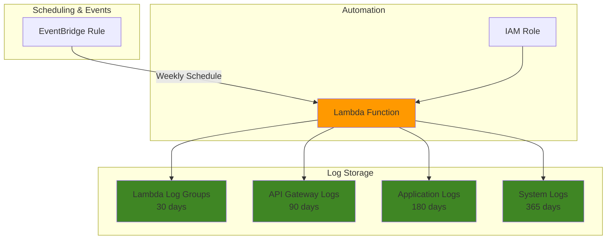

# Simple Log Retention Management with CloudWatch and Lambda

## Problem

Organizations struggle with uncontrolled log storage costs as applications generate massive amounts of log data that accumulates indefinitely in CloudWatch Logs without retention policies. Manual log management becomes impossible at scale, leading to compliance violations when sensitive data isn't purged according to regulatory requirements, and unexpected cloud bills from storing unnecessary historical log data for months or years.

## Solution

Implement automated log retention management using CloudWatch Logs retention policies and Lambda functions to systematically apply appropriate retention periods based on log group classification. This solution provides cost-effective log governance by automatically setting retention periods, ensures compliance with data retention requirements, and reduces manual overhead through automation.

## Architecture Diagram



## Prerequisites

1. AWS account with CloudWatch Logs and Lambda permissions (CloudWatchLogsFullAccess, AWSLambdaExecute)
2. AWS CLI installed and configured (version 2.0 or later) or access to AWS CloudShell
3. Basic understanding of AWS IAM roles and policies
4. Existing CloudWatch log groups with log data (or ability to create test log groups)
5. Estimated cost: $0.50-2.00 for testing (Lambda executions + log storage during testing period)

> **Note**: This solution follows AWS Well-Architected Framework cost optimization principles by implementing automated resource management and reducing manual operational overhead.

## Preparation

```bash
# Set environment variables
export AWS_REGION=$(aws configure get region)
export AWS_ACCOUNT_ID=$(aws sts get-caller-identity \
    --query Account --output text)

# Generate unique identifiers for resources
RANDOM_SUFFIX=$(aws secretsmanager get-random-password \
    --exclude-punctuation --exclude-uppercase \
    --password-length 6 --require-each-included-type \
    --output text --query RandomPassword)

export FUNCTION_NAME="log-retention-manager-${RANDOM_SUFFIX}"
export ROLE_NAME="LogRetentionManagerRole-${RANDOM_SUFFIX}"
export TEST_LOG_GROUP="/aws/test-logs-${RANDOM_SUFFIX}"
export RULE_NAME="log-retention-schedule-${RANDOM_SUFFIX}"

echo "✅ AWS environment configured with unique identifiers"
```

## Steps

1. **Create IAM Role for Lambda Function**:

   AWS Lambda requires an execution role with specific permissions to manage CloudWatch Logs retention policies. This role follows the principle of least privilege, granting only the necessary permissions to read log group information and modify retention settings across your AWS account.

   ```bash
   # Create trust policy for Lambda service
   cat > trust-policy.json << EOF
   {
     "Version": "2012-10-17",
     "Statement": [
       {
         "Effect": "Allow",
         "Principal": {
           "Service": "lambda.amazonaws.com"
         },
         "Action": "sts:AssumeRole"
       }
     ]
   }
   EOF
   
   # Create IAM role
   aws iam create-role \
       --role-name ${ROLE_NAME} \
       --assume-role-policy-document file://trust-policy.json
   
   # Create custom policy for CloudWatch Logs management
   cat > logs-policy.json << EOF
   {
     "Version": "2012-10-17",
     "Statement": [
       {
         "Effect": "Allow",
         "Action": [
           "logs:DescribeLogGroups",
           "logs:PutRetentionPolicy"
         ],
         "Resource": "*"
       },
       {
         "Effect": "Allow",
         "Action": [
           "logs:CreateLogGroup",
           "logs:CreateLogStream",
           "logs:PutLogEvents"
         ],
         "Resource": "arn:aws:logs:*:*:log-group:/aws/lambda/*"
       }
     ]
   }
   EOF
   
   # Attach custom policy to role
   aws iam put-role-policy \
       --role-name ${ROLE_NAME} \
       --policy-name LogRetentionPolicy \
       --policy-document file://logs-policy.json
   
   echo "✅ IAM role created with CloudWatch Logs permissions"
   ```

2. **Create Lambda Function Code**:

   The Lambda function uses the AWS SDK for Python (boto3) to scan CloudWatch log groups and apply retention policies based on configurable rules. This serverless approach ensures cost-effective execution that scales automatically with the number of log groups in your account.

   ```bash
   # Create Lambda function code
   cat > lambda_function.py << 'EOF'
   import json
   import boto3
   import logging
   import os
   from botocore.exceptions import ClientError
   
   # Initialize CloudWatch Logs client
   logs_client = boto3.client('logs')
   
   # Configure logging
   logger = logging.getLogger()
   logger.setLevel(logging.INFO)
   
   def apply_retention_policy(log_group_name, retention_days):
       """Apply retention policy to a specific log group"""
       try:
           logs_client.put_retention_policy(
               logGroupName=log_group_name,
               retentionInDays=retention_days
           )
           logger.info(f"Applied {retention_days} day retention to {log_group_name}")
           return True
       except ClientError as e:
           logger.error(f"Failed to set retention for {log_group_name}: {e}")
           return False
   
   def get_retention_days(log_group_name):
       """Determine appropriate retention period based on log group name patterns"""
       # Define retention rules based on log group naming patterns
       retention_rules = {
           '/aws/lambda/': 30,       # Lambda logs: 30 days
           '/aws/apigateway/': 90,   # API Gateway logs: 90 days  
           '/aws/codebuild/': 14,    # CodeBuild logs: 14 days
           '/aws/ecs/': 60,          # ECS logs: 60 days
           '/aws/stepfunctions/': 90, # Step Functions: 90 days
           '/application/': 180,     # Application logs: 180 days
           '/system/': 365,          # System logs: 1 year
       }
       
       # Check log group name against patterns
       for pattern, days in retention_rules.items():
           if pattern in log_group_name:
               return days
       
       # Default retention for unmatched patterns
       return int(os.environ.get('DEFAULT_RETENTION_DAYS', '30'))
   
   def lambda_handler(event, context):
       """Main Lambda handler for log retention management"""
       try:
           processed_groups = 0
           updated_groups = 0
           errors = []
           
           # Get all log groups (paginated)
           paginator = logs_client.get_paginator('describe_log_groups')
           
           for page in paginator.paginate():
               for log_group in page['logGroups']:
                   log_group_name = log_group['logGroupName']
                   current_retention = log_group.get('retentionInDays')
                   
                   # Determine appropriate retention period
                   target_retention = get_retention_days(log_group_name)
                   
                   processed_groups += 1
                   
                   # Apply retention policy if needed
                   if current_retention != target_retention:
                       if apply_retention_policy(log_group_name, target_retention):
                           updated_groups += 1
                       else:
                           errors.append(log_group_name)
                   else:
                       logger.info(f"Log group {log_group_name} already has correct retention: {current_retention} days")
           
           # Return summary
           result = {
               'statusCode': 200,
               'message': f'Processed {processed_groups} log groups, updated {updated_groups} retention policies',
               'processedGroups': processed_groups,
               'updatedGroups': updated_groups,
               'errors': errors
           }
           
           logger.info(json.dumps(result))
           return result
           
       except Exception as e:
           logger.error(f"Error in log retention management: {str(e)}")
           return {
               'statusCode': 500,
               'error': str(e)
           }
   EOF
   
   echo "✅ Lambda function code created"
   ```

3. **Package and Deploy Lambda Function**:

   AWS Lambda requires function code to be packaged as a ZIP file for deployment. The deployment process uploads the code and configures the function with appropriate runtime settings, environment variables, and execution role permissions. We'll use Python 3.12 for optimal performance and AWS support lifecycle.

   ```bash
   # Create deployment package
   zip lambda-function.zip lambda_function.py
   
   # Wait for IAM role to be available
   sleep 10
   
   # Get IAM role ARN
   ROLE_ARN=$(aws iam get-role \
       --role-name ${ROLE_NAME} \
       --query 'Role.Arn' --output text)
   
   # Create Lambda function
   aws lambda create-function \
       --function-name ${FUNCTION_NAME} \
       --runtime python3.12 \
       --role ${ROLE_ARN} \
       --handler lambda_function.lambda_handler \
       --zip-file fileb://lambda-function.zip \
       --timeout 300 \
       --memory-size 256 \
       --environment Variables="{DEFAULT_RETENTION_DAYS=30}" \
       --description "Automated CloudWatch Logs retention management"
   
   echo "✅ Lambda function deployed successfully"
   ```

4. **Create Test Log Groups**:

   To demonstrate the log retention management functionality, we'll create several test log groups with different naming patterns that will trigger various retention policies based on our function's logic.

   ```bash
   # Create test log groups with different naming patterns
   aws logs create-log-group \
       --log-group-name "/aws/lambda/test-function-${RANDOM_SUFFIX}"
   
   aws logs create-log-group \
       --log-group-name "/aws/apigateway/test-api-${RANDOM_SUFFIX}"
   
   aws logs create-log-group \
       --log-group-name "/application/web-app-${RANDOM_SUFFIX}"
   
   aws logs create-log-group \
       --log-group-name ${TEST_LOG_GROUP}
   
   echo "✅ Test log groups created with various naming patterns"
   ```

5. **Execute Lambda Function**:

   The Lambda function execution will scan all CloudWatch log groups in your account and apply appropriate retention policies based on the configured naming patterns. This demonstrates the automated log governance in action.

   ```bash
   # Invoke Lambda function to apply retention policies
   aws lambda invoke \
       --function-name ${FUNCTION_NAME} \
       --payload '{}' \
       --cli-binary-format raw-in-base64-out \
       response.json
   
   # Display execution results
   cat response.json | python3 -m json.tool
   
   echo "✅ Lambda function executed - retention policies applied"
   ```

6. **Configure Automated Execution Schedule**:

   AWS EventBridge enables scheduled execution of the Lambda function to ensure ongoing log retention management. This automation ensures retention policies are consistently applied to new log groups without manual intervention.

   ```bash
   # Create EventBridge rule for weekly execution
   aws events put-rule \
       --name ${RULE_NAME} \
       --schedule-expression "rate(7 days)" \
       --description "Weekly log retention policy management" \
       --state ENABLED
   
   # Create targets configuration file
   cat > targets.json << EOF
   [
     {
       "Id": "1",
       "Arn": "arn:aws:lambda:${AWS_REGION}:${AWS_ACCOUNT_ID}:function:${FUNCTION_NAME}"
     }
   ]
   EOF
   
   # Add Lambda function as target
   aws events put-targets \
       --rule ${RULE_NAME} \
       --targets file://targets.json
   
   # Grant EventBridge permission to invoke Lambda
   aws lambda add-permission \
       --function-name ${FUNCTION_NAME} \
       --statement-id "allow-eventbridge-${RANDOM_SUFFIX}" \
       --action "lambda:InvokeFunction" \
       --principal "events.amazonaws.com" \
       --source-arn "arn:aws:events:${AWS_REGION}:${AWS_ACCOUNT_ID}:rule/${RULE_NAME}"
   
   echo "✅ Automated weekly execution schedule configured"
   ```

## Validation & Testing

1. **Verify retention policies were applied**:

   ```bash
   # Check retention settings for test log groups
   aws logs describe-log-groups \
       --log-group-name-prefix "/aws/lambda/test-function-${RANDOM_SUFFIX}" \
       --query 'logGroups[*].{Name:logGroupName,Retention:retentionInDays}'
   
   aws logs describe-log-groups \
       --log-group-name-prefix "/aws/apigateway/test-api-${RANDOM_SUFFIX}" \
       --query 'logGroups[*].{Name:logGroupName,Retention:retentionInDays}'
   
   aws logs describe-log-groups \
       --log-group-name-prefix "/application/web-app-${RANDOM_SUFFIX}" \
       --query 'logGroups[*].{Name:logGroupName,Retention:retentionInDays}'
   ```

   Expected output: Lambda log group should show 30 days retention, API Gateway should show 90 days retention, application logs should show 180 days retention.

2. **Verify EventBridge rule is active**:

   ```bash
   # Check EventBridge rule status
   aws events describe-rule \
       --name ${RULE_NAME} \
       --query '{Name:Name,State:State,ScheduleExpression:ScheduleExpression}'
   ```

   Expected output: Rule should show "ENABLED" state with "rate(7 days)" schedule.

3. **Test function with manual invocation**:

   ```bash
   # Test function execution again to verify idempotency
   aws lambda invoke \
       --function-name ${FUNCTION_NAME} \
       --payload '{}' \
       --cli-binary-format raw-in-base64-out \
       test-response.json
   
   echo "Second execution results:"
   cat test-response.json | python3 -m json.tool
   ```

## Cleanup

1. **Remove EventBridge rule and targets**:

   ```bash
   # Remove targets from EventBridge rule
   aws events remove-targets \
       --rule ${RULE_NAME} \
       --ids "1"
   
   # Delete EventBridge rule
   aws events delete-rule \
       --name ${RULE_NAME}
   
   echo "✅ EventBridge rule deleted"
   ```

2. **Delete Lambda function**:

   ```bash
   # Delete Lambda function
   aws lambda delete-function \
       --function-name ${FUNCTION_NAME}
   
   echo "✅ Lambda function deleted"
   ```

3. **Remove test log groups**:

   ```bash
   # Delete test log groups
   aws logs delete-log-group \
       --log-group-name "/aws/lambda/test-function-${RANDOM_SUFFIX}"
   
   aws logs delete-log-group \
       --log-group-name "/aws/apigateway/test-api-${RANDOM_SUFFIX}"
   
   aws logs delete-log-group \
       --log-group-name "/application/web-app-${RANDOM_SUFFIX}"
   
   aws logs delete-log-group \
       --log-group-name ${TEST_LOG_GROUP}
   
   echo "✅ Test log groups deleted"
   ```

4. **Remove IAM role and policies**:

   ```bash
   # Delete IAM role policy
   aws iam delete-role-policy \
       --role-name ${ROLE_NAME} \
       --policy-name LogRetentionPolicy
   
   # Delete IAM role
   aws iam delete-role \
       --role-name ${ROLE_NAME}
   
   # Clean up local files
   rm -f trust-policy.json logs-policy.json lambda_function.py
   rm -f lambda-function.zip response.json test-response.json targets.json
   
   echo "✅ IAM resources and local files cleaned up"
   ```

## Discussion

This solution implements automated log retention management using AWS serverless technologies to address the common challenge of uncontrolled log storage costs. The Lambda function leverages the [CloudWatch Logs PutRetentionPolicy API](https://docs.aws.amazon.com/AmazonCloudWatchLogs/latest/APIReference/API_PutRetentionPolicy.html) to systematically apply retention periods based on configurable naming patterns. This approach follows AWS Well-Architected Framework principles by automating operational tasks and optimizing costs through intelligent resource management.

The retention policy implementation uses pattern matching to classify log groups and apply appropriate policies. For example, Lambda function logs typically have shorter retention requirements (30 days) compared to application logs that might need longer retention for troubleshooting (180 days). The [CloudWatch Logs retention documentation](https://docs.aws.amazon.com/AmazonCloudWatch/latest/logs/Working-with-log-groups-and-streams.html) explains that log events are marked for deletion when they reach their retention period, but actual deletion may take up to 72 hours. This design accommodates various compliance requirements while balancing storage costs with operational needs.

EventBridge scheduling provides reliable automation that ensures new log groups are continuously managed without manual intervention. The serverless architecture scales automatically and only incurs costs during execution, making it highly cost-effective for organizations with hundreds or thousands of log groups. The solution's modular design allows easy customization of retention rules through environment variables or external configuration files, supporting diverse organizational requirements and compliance frameworks.

> **Tip**: Monitor your CloudWatch Logs storage costs using AWS Cost Explorer to measure the financial impact of implementing retention policies. The savings can be substantial for organizations with long-running applications that generate significant log volumes.

## Challenge

Extend this solution by implementing these enhancements:

1. **Multi-environment support** - Modify the function to apply different retention policies based on AWS account tags or environment variables (dev: 7 days, staging: 30 days, production: 365 days)

2. **Compliance reporting** - Add functionality to generate monthly reports showing which log groups have retention policies applied and send notifications via SNS for compliance auditing

3. **Cost optimization dashboard** - Integrate with AWS Cost and Billing APIs to calculate and visualize cost savings achieved through retention policy implementation using CloudWatch dashboards

4. **Dynamic policy configuration** - Replace hardcoded retention rules with DynamoDB table storage, allowing administrators to update retention policies without modifying Lambda code

5. **Integration with AWS Config** - Create Config rules that monitor log group retention compliance and trigger automatic remediation when log groups are created without proper retention policies

## Infrastructure Code

*Infrastructure code will be generated after recipe approval.*