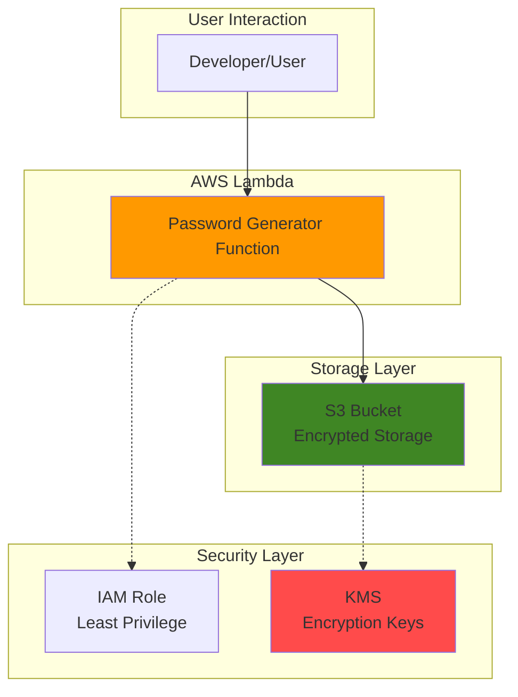

# Simple Password Generator with Lambda and S3

## Problem

Organizations frequently need secure, unique passwords for various applications, but manually generating them is time-consuming and often results in weak patterns. Development teams require a scalable solution that can generate cryptographically secure passwords with customizable complexity while providing secure storage and easy retrieval for authorized users.

## Solution

Build a serverless password generator using AWS Lambda for computation and S3 for secure storage. This solution leverages Lambda's event-driven architecture to generate passwords on-demand with configurable strength parameters, while S3 provides durable, encrypted storage with fine-grained access controls for password retrieval and management.

## Architecture Diagram



## Prerequisites

1. AWS account with appropriate permissions to create Lambda functions, S3 buckets, and IAM roles
2. AWS CLI installed and configured (or AWS CloudShell access)
3. Basic understanding of Python and serverless concepts
4. No existing resources required
5. Estimated cost: Less than $1.00 for testing (Lambda free tier + S3 minimal storage)

> **Note**: This recipe follows AWS Well-Architected Framework security principles with least privilege access and encryption at rest.

## Preparation

```bash
# Set environment variables
export AWS_REGION=$(aws configure get region)
export AWS_ACCOUNT_ID=$(aws sts get-caller-identity \
    --query Account --output text)

# Generate unique identifiers for resources
RANDOM_SUFFIX=$(aws secretsmanager get-random-password \
    --exclude-punctuation --exclude-uppercase \
    --password-length 6 --require-each-included-type \
    --output text --query RandomPassword)

# Set resource names
export BUCKET_NAME="password-generator-${RANDOM_SUFFIX}"
export LAMBDA_FUNCTION_NAME="password-generator-${RANDOM_SUFFIX}"
export IAM_ROLE_NAME="lambda-password-generator-role-${RANDOM_SUFFIX}"

echo "✅ AWS environment configured with region: ${AWS_REGION}"
echo "✅ Resources will use suffix: ${RANDOM_SUFFIX}"
```

## Steps

1. **Create S3 Bucket for Password Storage**:

   Amazon S3 provides 99.999999999% (11 9's) durability and built-in encryption capabilities, making it ideal for securely storing generated passwords. The bucket will use server-side encryption and versioning to ensure data protection and maintain password history when needed.

   ```bash
   # Create S3 bucket with encryption enabled
   aws s3 mb s3://${BUCKET_NAME} --region ${AWS_REGION}
   
   # Enable server-side encryption
   aws s3api put-bucket-encryption \
       --bucket ${BUCKET_NAME} \
       --server-side-encryption-configuration \
       'Rules=[{ApplyServerSideEncryptionByDefault:{SSEAlgorithm:AES256}}]'
   
   # Enable versioning for password history
   aws s3api put-bucket-versioning \
       --bucket ${BUCKET_NAME} \
       --versioning-configuration Status=Enabled
   
   # Block public access for security
   aws s3api put-public-access-block \
       --bucket ${BUCKET_NAME} \
       --public-access-block-configuration \
       BlockPublicAcls=true,IgnorePublicAcls=true,BlockPublicPolicy=true,RestrictPublicBuckets=true
   
   echo "✅ S3 bucket created: ${BUCKET_NAME}"
   ```

2. **Create IAM Role for Lambda Function**:

   Following the principle of least privilege, this IAM role grants only the necessary permissions for the Lambda function to write to the specific S3 bucket and create CloudWatch logs. This security boundary ensures the function cannot access unauthorized resources.

   ```bash
   # Create trust policy for Lambda
   cat > trust-policy.json << 'EOF'
   {
       "Version": "2012-10-17",
       "Statement": [
           {
               "Effect": "Allow",
               "Principal": {
                   "Service": "lambda.amazonaws.com"
               },
               "Action": "sts:AssumeRole"
           }
       ]
   }
   EOF
   
   # Create IAM role
   aws iam create-role \
       --role-name ${IAM_ROLE_NAME} \
       --assume-role-policy-document file://trust-policy.json
   
   # Create custom policy for S3 access
   cat > lambda-policy.json << EOF
   {
       "Version": "2012-10-17",
       "Statement": [
           {
               "Effect": "Allow",
               "Action": [
                   "s3:PutObject",
                   "s3:GetObject",
                   "s3:ListBucket"
               ],
               "Resource": [
                   "arn:aws:s3:::${BUCKET_NAME}",
                   "arn:aws:s3:::${BUCKET_NAME}/*"
               ]
           },
           {
               "Effect": "Allow",
               "Action": [
                   "logs:CreateLogGroup",
                   "logs:CreateLogStream",
                   "logs:PutLogEvents"
               ],
               "Resource": "arn:aws:logs:${AWS_REGION}:${AWS_ACCOUNT_ID}:*"
           }
       ]
   }
   EOF
   
   # Attach custom policy to role
   aws iam put-role-policy \
       --role-name ${IAM_ROLE_NAME} \
       --policy-name LambdaPasswordGeneratorPolicy \
       --policy-document file://lambda-policy.json
   
   echo "✅ IAM role created: ${IAM_ROLE_NAME}"
   ```

3. **Create Lambda Function Code**:

   The Lambda function implements secure password generation using Python's secrets module, which provides cryptographically strong random numbers suitable for security-sensitive applications. The function accepts parameters for password complexity and stores results in S3 with timestamps.

   ```bash
   # Create the Lambda function code
   cat > lambda_function.py << 'EOF'
   import json
   import boto3
   import secrets
   import string
   from datetime import datetime
   import logging
   import os
   
   # Configure logging
   logger = logging.getLogger()
   logger.setLevel(logging.INFO)
   
   # Initialize S3 client
   s3_client = boto3.client('s3')
   BUCKET_NAME = os.environ['BUCKET_NAME']
   
   def lambda_handler(event, context):
       try:
           # Parse request parameters
           body = json.loads(event.get('body', '{}')) if event.get('body') else event
           
           # Default password parameters
           length = body.get('length', 16)
           include_uppercase = body.get('include_uppercase', True)
           include_lowercase = body.get('include_lowercase', True)
           include_numbers = body.get('include_numbers', True)
           include_symbols = body.get('include_symbols', True)
           password_name = body.get('name', f'password_{datetime.now().strftime("%Y%m%d_%H%M%S")}')
           
           # Validate parameters
           if length < 8 or length > 128:
               raise ValueError("Password length must be between 8 and 128 characters")
           
           # Build character set
           charset = ""
           if include_lowercase:
               charset += string.ascii_lowercase
           if include_uppercase:
               charset += string.ascii_uppercase
           if include_numbers:
               charset += string.digits
           if include_symbols:
               charset += "!@#$%^&*()_+-=[]{}|;:,.<>?"
           
           if not charset:
               raise ValueError("At least one character type must be selected")
           
           # Generate secure password
           password = ''.join(secrets.choice(charset) for _ in range(length))
           
           # Create password metadata
           password_data = {
               'password': password,
               'length': length,
               'created_at': datetime.now().isoformat(),
               'parameters': {
                   'include_uppercase': include_uppercase,
                   'include_lowercase': include_lowercase,
                   'include_numbers': include_numbers,
                   'include_symbols': include_symbols
               }
           }
           
           # Store password in S3
           s3_key = f'passwords/{password_name}.json'
           s3_client.put_object(
               Bucket=BUCKET_NAME,
               Key=s3_key,
               Body=json.dumps(password_data, indent=2),
               ContentType='application/json',
               ServerSideEncryption='AES256'
           )
           
           logger.info(f"Password generated and stored: {s3_key}")
           
           # Return response (without actual password for security)
           return {
               'statusCode': 200,
               'body': json.dumps({
                   'message': 'Password generated successfully',
                   'password_name': password_name,
                   's3_key': s3_key,
                   'length': length,
                   'created_at': password_data['created_at']
               })
           }
           
       except Exception as e:
           logger.error(f"Error generating password: {str(e)}")
           return {
               'statusCode': 500,
               'body': json.dumps({
                   'error': 'Failed to generate password',
                   'message': str(e)
               })
           }
   EOF
   
   echo "✅ Lambda function code created"
   ```

4. **Package and Deploy Lambda Function**:

   AWS Lambda requires Python code to be packaged in a ZIP file for deployment. This step creates the deployment package and uploads the function with appropriate configuration including environment variables and timeout settings. We use Python 3.12 runtime as it provides the latest security features and performance improvements.

   ```bash
   # Create deployment package
   zip lambda-function.zip lambda_function.py
   
   # Get IAM role ARN
   ROLE_ARN=$(aws iam get-role \
       --role-name ${IAM_ROLE_NAME} \
       --query 'Role.Arn' --output text)
   
   # Wait for role to be ready
   sleep 10
   
   # Create Lambda function
   aws lambda create-function \
       --function-name ${LAMBDA_FUNCTION_NAME} \
       --runtime python3.12 \
       --role ${ROLE_ARN} \
       --handler lambda_function.lambda_handler \
       --zip-file fileb://lambda-function.zip \
       --timeout 30 \
       --memory-size 128 \
       --environment "Variables={BUCKET_NAME=${BUCKET_NAME}}" \
       --description "Secure password generator with S3 storage"
   
   echo "✅ Lambda function deployed: ${LAMBDA_FUNCTION_NAME}"
   ```

5. **Test Password Generation**:

   Testing verifies the Lambda function correctly generates passwords with the specified parameters and stores them securely in S3. This validation ensures the complete workflow functions as expected before production use.

   ```bash
   # Test with default parameters
   aws lambda invoke \
       --function-name ${LAMBDA_FUNCTION_NAME} \
       --payload '{"length": 20, "name": "test-password-1"}' \
       response.json
   
   # Display the response
   cat response.json | python3 -m json.tool
   
   # Test with custom parameters
   aws lambda invoke \
       --function-name ${LAMBDA_FUNCTION_NAME} \
       --payload '{"length": 12, "include_symbols": false, "name": "simple-password"}' \
       response2.json
   
   echo "✅ Password generation tests completed"
   ```

## Validation & Testing

1. **Verify S3 bucket contains generated passwords**:

   ```bash
   # List generated passwords in S3
   aws s3 ls s3://${BUCKET_NAME}/passwords/
   ```

   Expected output: List of JSON files with timestamps

2. **Retrieve and verify password content**:

   ```bash
   # Download a generated password file
   aws s3 cp s3://${BUCKET_NAME}/passwords/test-password-1.json ./password.json
   
   # Display password metadata (be careful with actual passwords)
   cat password.json | python3 -m json.tool
   ```

3. **Test Lambda function logs**:

   ```bash
   # Check CloudWatch logs
   aws logs describe-log-groups \
       --log-group-name-prefix /aws/lambda/${LAMBDA_FUNCTION_NAME}
   ```

## Cleanup

1. **Delete Lambda function**:

   ```bash
   # Delete Lambda function
   aws lambda delete-function \
       --function-name ${LAMBDA_FUNCTION_NAME}
   
   echo "✅ Lambda function deleted"
   ```

2. **Empty and delete S3 bucket**:

   ```bash
   # Delete all objects in bucket
   aws s3 rm s3://${BUCKET_NAME} --recursive
   
   # Delete bucket
   aws s3 rb s3://${BUCKET_NAME}
   
   echo "✅ S3 bucket deleted"
   ```

3. **Delete IAM role and policies**:

   ```bash
   # Delete inline policy
   aws iam delete-role-policy \
       --role-name ${IAM_ROLE_NAME} \
       --policy-name LambdaPasswordGeneratorPolicy
   
   # Delete IAM role
   aws iam delete-role --role-name ${IAM_ROLE_NAME}
   
   echo "✅ IAM resources deleted"
   ```

4. **Clean up local files**:

   ```bash
   # Remove temporary files
   rm -f lambda_function.py lambda-function.zip trust-policy.json
   rm -f lambda-policy.json response.json response2.json password.json
   
   echo "✅ Local files cleaned up"
   ```

## Discussion

This serverless password generator demonstrates the core AWS serverless pattern of combining Lambda for compute with S3 for storage. AWS Lambda provides automatic scaling, pay-per-invocation pricing, and built-in high availability, making it ideal for intermittent workloads like password generation. The function uses Python's `secrets` module, which is specifically designed for cryptographically secure random number generation, ensuring passwords meet security standards for production use.

The integration with S3 provides several architectural benefits beyond simple storage. S3's encryption at rest using AES-256 ensures sensitive password data remains protected, while versioning enables password history tracking without additional complexity. The bucket's public access blocking configuration prevents accidental exposure, and the IAM role's least-privilege permissions limit the function's access to only necessary resources, following [AWS security best practices](https://docs.aws.amazon.com/IAM/latest/UserGuide/best-practices.html).

From a cost perspective, this solution is highly efficient. Lambda charges only for actual compute time (with a generous free tier), and S3 charges minimal fees for small JSON files. The serverless architecture eliminates infrastructure management overhead while providing enterprise-grade security features. The solution automatically scales from zero to thousands of concurrent requests without manual intervention, making it suitable for both development teams and enterprise applications.

This pattern can be extended to integrate with AWS Secrets Manager for enterprise password management, API Gateway for HTTP endpoints, or AWS Organizations for multi-account password policies. The foundation established here supports advanced features like password rotation, audit logging, and compliance reporting. For production deployments, consider implementing additional monitoring with CloudWatch alarms and [AWS X-Ray for distributed tracing](https://docs.aws.amazon.com/xray/latest/devguide/) to ensure optimal performance and reliability.

> **Tip**: Store the S3 bucket name as a Lambda environment variable rather than hardcoding it in the function, enabling easy deployment across multiple environments while maintaining security boundaries.

## Challenge

Extend this solution by implementing these enhancements:

1. **Add API Gateway integration** to create HTTP endpoints for password generation, enabling web and mobile application integration with authentication and rate limiting
2. **Implement password strength validation** using regex patterns and entropy calculations to ensure generated passwords meet organizational security policies
3. **Create password expiration and rotation** by adding CloudWatch Events triggers and S3 lifecycle policies for automatic password cleanup
4. **Build a password retrieval API** with secure authentication using AWS Cognito to allow authorized users to retrieve stored passwords
5. **Add CloudTrail integration** for comprehensive audit logging of password generation and access events to meet compliance requirements

## Infrastructure Code

### Available Infrastructure as Code:

- [Infrastructure Code Overview](code/README.md) - Detailed description of all infrastructure components
- [AWS CDK (Python)](code/cdk-python/) - AWS CDK Python implementation
- [AWS CDK (TypeScript)](code/cdk-typescript/) - AWS CDK TypeScript implementation
- [CloudFormation](code/cloudformation.yaml) - AWS CloudFormation template
- [Bash CLI Scripts](code/scripts/) - Example bash scripts using AWS CLI commands to deploy infrastructure
- [Terraform](code/terraform/) - Terraform configuration files