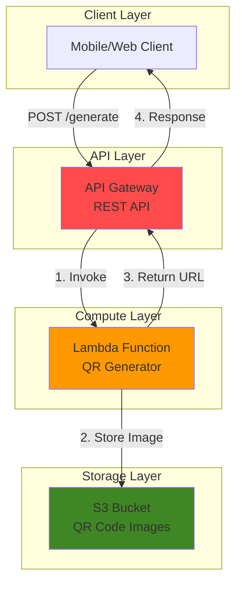

# Simple QR Code Generator with Lambda and S3

## Problem

Small businesses and developers need a quick way to generate QR codes for marketing materials, event tickets, or contact information sharing. Manual QR code generation tools require desktop software or online services that may not integrate well with existing applications. Without a programmable solution, teams struggle to automate QR code creation for dynamic content, leading to manual workflows that don't scale with business growth.

## Solution

Create a serverless QR code generator using AWS Lambda to process text input, generate QR code images, store them in S3, and return downloadable URLs through API Gateway. This serverless approach provides automatic scaling, cost-effective pay-per-use pricing, and seamless integration with other applications through a REST API interface.

## Architecture Diagram



## Prerequisites

1. AWS account with appropriate permissions for Lambda, S3, API Gateway, and IAM
2. AWS CLI installed and configured (or use AWS CloudShell)
3. Basic understanding of REST APIs and serverless concepts
4. Python programming knowledge for Lambda function customization
5. Estimated cost: $0.01-$0.10 for testing (minimal usage of serverless services)

> **Note**: This recipe uses AWS Free Tier eligible services, making it cost-effective for learning and small-scale usage.

## Preparation

```bash
# Set environment variables
export AWS_REGION=$(aws configure get region)
export AWS_ACCOUNT_ID=$(aws sts get-caller-identity \
    --query Account --output text)

# Generate unique identifiers for resources
RANDOM_SUFFIX=$(aws secretsmanager get-random-password \
    --exclude-punctuation --exclude-uppercase \
    --password-length 6 --require-each-included-type \
    --output text --query RandomPassword)

# Set resource names
export BUCKET_NAME="qr-generator-bucket-${RANDOM_SUFFIX}"
export FUNCTION_NAME="qr-generator-function-${RANDOM_SUFFIX}"
export ROLE_NAME="qr-generator-role-${RANDOM_SUFFIX}"
export API_NAME="qr-generator-api-${RANDOM_SUFFIX}"

echo "✅ AWS environment configured"
echo "Bucket: ${BUCKET_NAME}"
echo "Function: ${FUNCTION_NAME}"
echo "Region: ${AWS_REGION}"
```

## Steps

1. **Create S3 Bucket for QR Code Storage**:

   Amazon S3 provides highly durable object storage with 99.999999999% (11 9's) durability, making it perfect for storing generated QR code images. The bucket will serve as our persistent storage layer, allowing the Lambda function to save QR codes and provide public access URLs for downloading.

   ```bash
   # Create S3 bucket for storing QR code images
   aws s3 mb s3://${BUCKET_NAME} --region ${AWS_REGION}
   
   # Configure bucket for public read access to QR codes
   aws s3api put-public-access-block \
       --bucket ${BUCKET_NAME} \
       --public-access-block-configuration \
       "BlockPublicAcls=false,IgnorePublicAcls=false,BlockPublicPolicy=false,RestrictPublicBuckets=false"
   
   # Create bucket policy for public read access
   cat > bucket-policy.json << EOF
   {
       "Version": "2012-10-17",
       "Statement": [
           {
               "Sid": "PublicReadGetObject",
               "Effect": "Allow",
               "Principal": "*",
               "Action": "s3:GetObject",
               "Resource": "arn:aws:s3:::${BUCKET_NAME}/*"
           }
       ]
   }
   EOF
   
   aws s3api put-bucket-policy \
       --bucket ${BUCKET_NAME} \
       --policy file://bucket-policy.json
   
   echo "✅ S3 bucket created: ${BUCKET_NAME}"
   ```

   > **Warning**: This configuration enables public read access to the bucket. Only use this for non-sensitive QR codes. For production use, consider using signed URLs or CloudFront with Origin Access Control.

2. **Create IAM Role for Lambda Function**:

   AWS Lambda requires an IAM role that defines permissions for accessing other AWS services. This role will allow our function to write QR code images to S3 and write logs to CloudWatch for monitoring and debugging purposes.

   ```bash
   # Create trust policy for Lambda service
   cat > trust-policy.json << EOF
   {
       "Version": "2012-10-17",
       "Statement": [
           {
               "Effect": "Allow",
               "Principal": {
                   "Service": "lambda.amazonaws.com"
               },
               "Action": "sts:AssumeRole"
           }
       ]
   }
   EOF
   
   # Create IAM role
   aws iam create-role \
       --role-name ${ROLE_NAME} \
       --assume-role-policy-document file://trust-policy.json
   
   # Create policy for S3 access
   cat > s3-policy.json << EOF
   {
       "Version": "2012-10-17",
       "Statement": [
           {
               "Effect": "Allow",
               "Action": [
                   "s3:PutObject",
                   "s3:PutObjectAcl"
               ],
               "Resource": "arn:aws:s3:::${BUCKET_NAME}/*"
           }
       ]
   }
   EOF
   
   # Attach policies to role
   aws iam attach-role-policy \
       --role-name ${ROLE_NAME} \
       --policy-arn "arn:aws:iam::aws:policy/service-role/AWSLambdaBasicExecutionRole"
   
   aws iam put-role-policy \
       --role-name ${ROLE_NAME} \
       --policy-name S3AccessPolicy \
       --policy-document file://s3-policy.json
   
   export ROLE_ARN="arn:aws:iam::${AWS_ACCOUNT_ID}:role/${ROLE_NAME}"
   echo "✅ IAM role created: ${ROLE_ARN}"
   ```

3. **Create Lambda Function Package**:

   The Lambda function will use Python with the `qrcode` library to generate QR code images. We'll create a deployment package that includes both our function code and the required dependencies for QR code generation.

   ```bash
   # Create function directory and Python code
   mkdir qr-function && cd qr-function
   
   # Create Lambda function code
   cat > lambda_function.py << 'EOF'
   import json
   import boto3
   import qrcode
   import io
   from datetime import datetime
   import uuid
   import os
   
   # Initialize S3 client outside handler for connection reuse
   s3_client = boto3.client('s3')
   
   def lambda_handler(event, context):
       try:
           # Parse request body
           if 'body' in event:
               body = json.loads(event['body'])
           else:
               body = event
           
           text = body.get('text', '').strip()
           if not text:
               return {
                   'statusCode': 400,
                   'headers': {
                       'Content-Type': 'application/json',
                       'Access-Control-Allow-Origin': '*'
                   },
                   'body': json.dumps({'error': 'Text parameter is required'})
               }
           
           # Limit text length for security and performance
           if len(text) > 1000:
               return {
                   'statusCode': 400,
                   'headers': {
                       'Content-Type': 'application/json',
                       'Access-Control-Allow-Origin': '*'
                   },
                   'body': json.dumps({'error': 'Text too long (max 1000 characters)'})
               }
           
           # Generate QR code
           qr = qrcode.QRCode(
               version=1,
               error_correction=qrcode.constants.ERROR_CORRECT_L,
               box_size=10,
               border=4,
           )
           qr.add_data(text)
           qr.make(fit=True)
           
           # Create QR code image
           img = qr.make_image(fill_color="black", back_color="white")
           
           # Convert to bytes
           img_buffer = io.BytesIO()
           img.save(img_buffer, format='PNG')
           img_buffer.seek(0)
           
           # Generate unique filename
           timestamp = datetime.now().strftime('%Y%m%d_%H%M%S')
           filename = f"qr_{timestamp}_{str(uuid.uuid4())[:8]}.png"
           
           # Get bucket name from environment variable
           bucket_name = os.environ.get('BUCKET_NAME')
           if not bucket_name:
               # Fallback to context-based naming for backward compatibility
               bucket_name = context.function_name.replace(
                   'qr-generator-function-', 'qr-generator-bucket-'
               )
           
           # Upload to S3
           s3_client.put_object(
               Bucket=bucket_name,
               Key=filename,
               Body=img_buffer.getvalue(),
               ContentType='image/png',
               CacheControl='max-age=31536000'  # Cache for 1 year
           )
           
           # Generate public URL
           region = boto3.Session().region_name
           url = f"https://{bucket_name}.s3.{region}.amazonaws.com/{filename}"
           
           return {
               'statusCode': 200,
               'headers': {
                   'Content-Type': 'application/json',
                   'Access-Control-Allow-Origin': '*'
               },
               'body': json.dumps({
                   'message': 'QR code generated successfully',
                   'url': url,
                   'filename': filename,
                   'text_length': len(text)
               })
           }
           
       except Exception as e:
           # Log error for debugging
           print(f"Error generating QR code: {str(e)}")
           return {
               'statusCode': 500,
               'headers': {
                   'Content-Type': 'application/json',
                   'Access-Control-Allow-Origin': '*'
               },
               'body': json.dumps({'error': 'Internal server error'})
           }
   EOF
   
   # Install qrcode library with PIL support
   pip install "qrcode[pil]" -t .
   
   # Create deployment package
   zip -r ../qr-function.zip .
   cd ..
   
   echo "✅ Lambda function package created"
   ```

4. **Deploy Lambda Function**:

   AWS Lambda provides serverless compute that automatically scales based on incoming requests. Our function will process QR code generation requests without requiring server management, providing cost-effective execution that scales from zero to thousands of concurrent invocations.

   ```bash
   # Wait for IAM role to propagate
   sleep 10
   
   # Create Lambda function with latest Python runtime
   aws lambda create-function \
       --function-name ${FUNCTION_NAME} \
       --runtime python3.12 \
       --role ${ROLE_ARN} \
       --handler lambda_function.lambda_handler \
       --zip-file fileb://qr-function.zip \
       --timeout 30 \
       --memory-size 256 \
       --environment Variables="{BUCKET_NAME=${BUCKET_NAME}}"
   
   # Get function ARN
   export FUNCTION_ARN=$(aws lambda get-function \
       --function-name ${FUNCTION_NAME} \
       --query Configuration.FunctionArn --output text)
   
   echo "✅ Lambda function deployed: ${FUNCTION_NAME}"
   echo "Function ARN: ${FUNCTION_ARN}"
   ```

5. **Create API Gateway REST API**:

   Amazon API Gateway creates a managed REST API that routes HTTP requests to our Lambda function. This provides a public endpoint for QR code generation while handling authentication, throttling, and request/response transformation automatically.

   ```bash
   # Create REST API
   export API_ID=$(aws apigateway create-rest-api \
       --name ${API_NAME} \
       --description "QR Code Generator API" \
       --query id --output text)
   
   # Get root resource ID
   export ROOT_RESOURCE_ID=$(aws apigateway get-resources \
       --rest-api-id ${API_ID} \
       --query 'items[0].id' --output text)
   
   # Create 'generate' resource
   export RESOURCE_ID=$(aws apigateway create-resource \
       --rest-api-id ${API_ID} \
       --parent-id ${ROOT_RESOURCE_ID} \
       --path-part generate \
       --query id --output text)
   
   # Create POST method
   aws apigateway put-method \
       --rest-api-id ${API_ID} \
       --resource-id ${RESOURCE_ID} \
       --http-method POST \
       --authorization-type NONE
   
   echo "✅ API Gateway REST API created: ${API_ID}"
   ```

6. **Configure Lambda Integration**:

   API Gateway integration connects HTTP requests to our Lambda function using Lambda proxy integration. This configuration passes the entire request to Lambda and expects a specific response format, enabling flexible request handling and response customization.

   ```bash
   # Configure Lambda integration
   aws apigateway put-integration \
       --rest-api-id ${API_ID} \
       --resource-id ${RESOURCE_ID} \
       --http-method POST \
       --type AWS_PROXY \
       --integration-http-method POST \
       --uri "arn:aws:apigateway:${AWS_REGION}:lambda:path/2015-03-31/functions/${FUNCTION_ARN}/invocations"
   
   # Grant API Gateway permission to invoke Lambda
   aws lambda add-permission \
       --function-name ${FUNCTION_NAME} \
       --statement-id allow-apigateway \
       --action lambda:InvokeFunction \
       --principal apigateway.amazonaws.com \
       --source-arn "arn:aws:execute-api:${AWS_REGION}:${AWS_ACCOUNT_ID}:${API_ID}/*/*"
   
   echo "✅ Lambda integration configured"
   ```

7. **Deploy API Gateway**:

   API Gateway requires deployment to a stage before it becomes accessible. The deployment creates a versioned snapshot of the API configuration and provides the public endpoint URL for making requests to our QR code generator.

   ```bash
   # Deploy API to 'prod' stage
   aws apigateway create-deployment \
       --rest-api-id ${API_ID} \
       --stage-name prod \
       --description "Production deployment"
   
   # Get API endpoint URL
   export API_URL="https://${API_ID}.execute-api.${AWS_REGION}.amazonaws.com/prod"
   
   echo "✅ API deployed successfully"
   echo "API Endpoint: ${API_URL}/generate"
   ```

## Validation & Testing

1. Test QR code generation with sample text:

   ```bash
   # Test API with curl
   curl -X POST ${API_URL}/generate \
       -H "Content-Type: application/json" \
       -d '{"text": "Hello, World! This is my first QR code."}' \
       | jq '.'
   ```

   Expected output: JSON response with success message, download URL, filename, and text length.

2. Verify QR code image was stored in S3:

   ```bash
   # List objects in S3 bucket
   aws s3 ls s3://${BUCKET_NAME}/
   
   # Check bucket size and usage
   aws s3 ls s3://${BUCKET_NAME} --summarize --human-readable
   ```

3. Test Lambda function directly:

   ```bash
   # Invoke Lambda function directly
   aws lambda invoke \
       --function-name ${FUNCTION_NAME} \
       --payload '{"text": "Direct Lambda test"}' \
       response.json
   
   # View response
   cat response.json | jq '.'
   ```

4. Test error handling with invalid input:

   ```bash
   # Test with empty text
   curl -X POST ${API_URL}/generate \
       -H "Content-Type: application/json" \
       -d '{"text": ""}' \
       | jq '.'
   ```

## Cleanup

1. Delete API Gateway:

   ```bash
   # Delete API Gateway
   aws apigateway delete-rest-api --rest-api-id ${API_ID}
   
   echo "✅ API Gateway deleted"
   ```

2. Delete Lambda function:

   ```bash
   # Delete Lambda function
   aws lambda delete-function --function-name ${FUNCTION_NAME}
   
   echo "✅ Lambda function deleted"
   ```

3. Delete IAM role and policies:

   ```bash
   # Detach policies and delete role
   aws iam detach-role-policy \
       --role-name ${ROLE_NAME} \
       --policy-arn "arn:aws:iam::aws:policy/service-role/AWSLambdaBasicExecutionRole"
   
   aws iam delete-role-policy \
       --role-name ${ROLE_NAME} \
       --policy-name S3AccessPolicy
   
   aws iam delete-role --role-name ${ROLE_NAME}
   
   echo "✅ IAM role deleted"
   ```

4. Delete S3 bucket and contents:

   ```bash
   # Delete all objects in bucket
   aws s3 rm s3://${BUCKET_NAME} --recursive
   
   # Delete bucket
   aws s3 rb s3://${BUCKET_NAME}
   
   echo "✅ S3 bucket and contents deleted"
   ```

5. Clean up local files:

   ```bash
   # Remove local files
   rm -rf qr-function qr-function.zip *.json response.json
   
   echo "✅ Local files cleaned up"
   ```

## Discussion

This serverless QR code generator demonstrates the power of AWS's event-driven architecture. The solution uses **API Gateway** as the entry point, providing a managed REST API that handles request routing, throttling, and authentication. **Lambda** processes the QR code generation logic using Python's `qrcode` library, benefiting from automatic scaling and pay-per-invocation pricing. **S3** serves as durable storage for generated images while providing public access URLs for easy sharing.

The serverless approach offers significant advantages over traditional server-based solutions. There's no infrastructure to manage, costs scale with usage, and the system automatically handles traffic spikes. The Lambda function cold start latency is minimal for this use case, and the qrcode library generates images quickly. S3's 99.999999999% durability ensures generated QR codes remain accessible long-term.

This architecture follows AWS Well-Architected Framework principles by implementing security through IAM roles, reliability through managed services, and cost optimization through serverless pricing models. The solution includes input validation, error handling, and proper logging for production readiness. For enhanced security, consider implementing API keys, rate limiting, or using CloudFront with Origin Access Control instead of public S3 bucket policies.

> **Tip**: Use S3 lifecycle policies to automatically archive or delete old QR codes after a specified period to optimize storage costs. The [S3 Lifecycle Management documentation](https://docs.aws.amazon.com/AmazonS3/latest/userguide/object-lifecycle-mgmt.html) provides comprehensive configuration guidance.

## Challenge

Extend this solution by implementing these enhancements:

1. **Add custom styling options** by modifying the Lambda function to accept parameters for QR code colors, size, and error correction levels through the API request body.

2. **Implement usage analytics** by integrating DynamoDB to track QR code generation requests, including timestamps, text content length, and request IP addresses for usage reporting.

3. **Add batch processing capabilities** by creating an SQS queue and additional Lambda function to handle multiple QR code generation requests simultaneously with status tracking.

4. **Create a web interface** using S3 static website hosting and CloudFront to provide a simple HTML form that calls your API and displays generated QR codes inline.

5. **Implement enhanced security** by replacing public bucket access with CloudFront distribution and Origin Access Control, adding API authentication, and implementing rate limiting.

## Infrastructure Code

*Infrastructure code will be generated after recipe approval.*