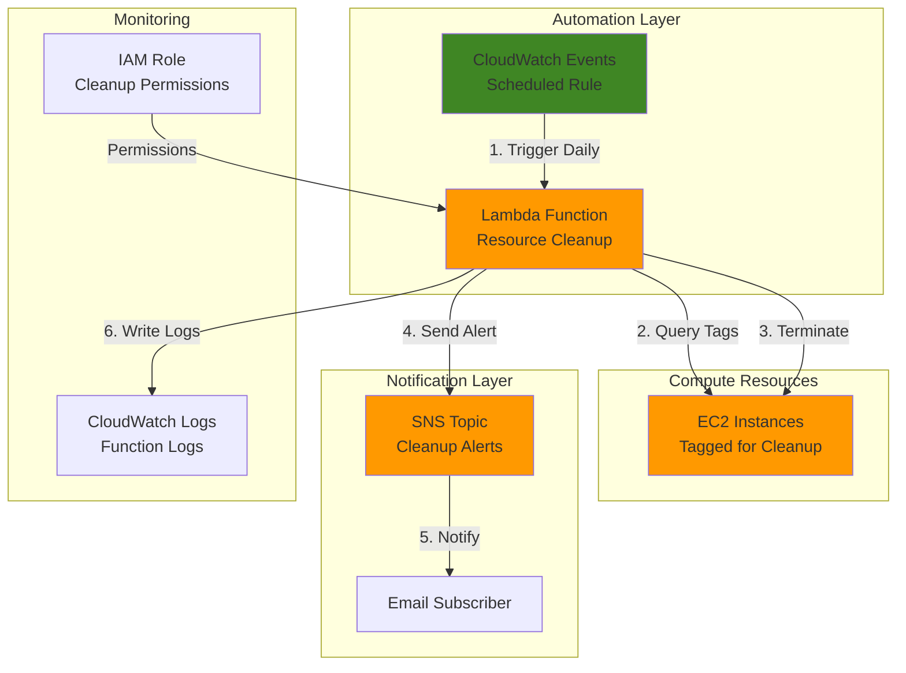

# Resource Cleanup Automation with Lambda and Tags

## Problem

Organizations often struggle with rising AWS costs due to forgotten or unused EC2 instances that continue running after development work is complete. Without proper resource lifecycle management, these orphaned instances can accumulate substantial charges over time, especially when developers forget to terminate test environments or temporary workloads after projects end, potentially increasing cloud spend by 20-40% monthly.

## Solution

Create an automated resource cleanup system using AWS Lambda to identify and terminate EC2 instances based on specific tags, with SNS notifications to alert administrators about cleanup actions. This serverless approach provides cost-effective resource governance by automatically removing resources tagged for cleanup while maintaining audit trails through notifications, potentially saving thousands of dollars in unneeded compute costs.

## Architecture Diagram



## Prerequisites

1. AWS account with IAM permissions for Lambda, EC2, SNS, and CloudWatch
2. AWS CLI installed and configured (version 2.0 or later)
3. Basic understanding of AWS Lambda and EC2 tagging strategies
4. Email address for receiving cleanup notifications
5. Estimated cost: $0.50-$2.00 per month for Lambda executions and SNS notifications

> **Note**: This recipe follows AWS Well-Architected Framework cost optimization principles by implementing automated resource lifecycle management.

## Preparation

```bash
# Set environment variables
export AWS_REGION=$(aws configure get region)
export AWS_ACCOUNT_ID=$(aws sts get-caller-identity \
    --query Account --output text)

# Generate unique identifiers for resources
RANDOM_SUFFIX=$(aws secretsmanager get-random-password \
    --exclude-punctuation --exclude-uppercase \
    --password-length 6 --require-each-included-type \
    --output text --query RandomPassword)

# Set resource names
export FUNCTION_NAME="resource-cleanup-${RANDOM_SUFFIX}"
export ROLE_NAME="resource-cleanup-role-${RANDOM_SUFFIX}"
export SNS_TOPIC_NAME="resource-cleanup-alerts-${RANDOM_SUFFIX}"
export TEST_INSTANCE_NAME="test-cleanup-instance-${RANDOM_SUFFIX}"

# Get latest Amazon Linux 2023 AMI ID
export LATEST_AMI_ID=$(aws ssm get-parameter \
    --name "/aws/service/ami-amazon-linux-latest/al2023-ami-kernel-default-x86_64" \
    --query 'Parameter.Value' --output text)

echo "✅ Environment variables configured"
echo "Function Name: ${FUNCTION_NAME}"
echo "SNS Topic: ${SNS_TOPIC_NAME}"
echo "Latest AMI ID: ${LATEST_AMI_ID}"
```

## Steps

1. **Create SNS Topic for Cleanup Notifications**:

   Amazon SNS provides a fully managed messaging service that enables asynchronous communication between the cleanup Lambda function and administrators. Creating a dedicated topic ensures reliable delivery of cleanup notifications across multiple endpoints while supporting future scaling to additional notification channels.

   ```bash
   # Create SNS topic for cleanup alerts
   aws sns create-topic --name ${SNS_TOPIC_NAME}
   
   # Get topic ARN for later use
   export SNS_TOPIC_ARN=$(aws sns get-topic-attributes \
       --topic-arn arn:aws:sns:${AWS_REGION}:${AWS_ACCOUNT_ID}:${SNS_TOPIC_NAME} \
       --query 'Attributes.TopicArn' --output text)
   
   echo "✅ SNS topic created: ${SNS_TOPIC_ARN}"
   ```

   The SNS topic now provides the messaging infrastructure for cleanup notifications, enabling real-time alerts about automated resource termination actions.

2. **Subscribe Email to SNS Topic**:

   ```bash
   # Subscribe your email to receive cleanup notifications
   read -p "Enter your email address for notifications: " EMAIL_ADDRESS
   
   aws sns subscribe \
       --topic-arn ${SNS_TOPIC_ARN} \
       --protocol email \
       --notification-endpoint ${EMAIL_ADDRESS}
   
   echo "✅ Email subscription created - check your inbox to confirm"
   ```

   > **Note**: You must confirm the email subscription by clicking the link sent to your email address before notifications will be delivered.

3. **Create IAM Role for Lambda Function**:

   AWS Lambda requires an execution role with appropriate permissions to interact with EC2 instances and send SNS notifications. This role implements least privilege access by granting only the specific permissions needed for resource cleanup operations while maintaining security best practices outlined in the [AWS IAM best practices](https://docs.aws.amazon.com/IAM/latest/UserGuide/best-practices.html).

   ```bash
   # Create trust policy for Lambda service  
   cat > trust-policy.json << EOF
   {
       "Version": "2012-10-17",
       "Statement": [
           {
               "Effect": "Allow",
               "Principal": {
                   "Service": "lambda.amazonaws.com"
               },
               "Action": "sts:AssumeRole"
           }
       ]
   }
   EOF
   
   # Create IAM role
   aws iam create-role \
       --role-name ${ROLE_NAME} \
       --assume-role-policy-document file://trust-policy.json
   
   echo "✅ IAM role created: ${ROLE_NAME}"
   ```

4. **Attach Permissions to Lambda Role**:

   ```bash
   # Create custom policy for resource cleanup permissions
   cat > cleanup-policy.json << EOF
   {
       "Version": "2012-10-17",
       "Statement": [
           {
               "Effect": "Allow",
               "Action": [
                   "logs:CreateLogGroup",
                   "logs:CreateLogStream",
                   "logs:PutLogEvents"
               ],
               "Resource": "arn:aws:logs:*:*:*"
           },
           {
               "Effect": "Allow",
               "Action": [
                   "ec2:DescribeInstances",
                   "ec2:TerminateInstances",
                   "ec2:DescribeTags"
               ],
               "Resource": "*"
           },
           {
               "Effect": "Allow",
               "Action": [
                   "sns:Publish"
               ],
               "Resource": "${SNS_TOPIC_ARN}"
           }
       ]
   }
   EOF
   
   # Create and attach policy
   aws iam put-role-policy \
       --role-name ${ROLE_NAME} \
       --policy-name ResourceCleanupPolicy \
       --policy-document file://cleanup-policy.json
   
   # Get role ARN
   export ROLE_ARN=$(aws iam get-role \
       --role-name ${ROLE_NAME} \
       --query 'Role.Arn' --output text)
   
   echo "✅ Permissions attached to role: ${ROLE_ARN}"
   ```

5. **Create Lambda Function Code**:

   The Lambda function implements the core cleanup logic by querying EC2 instances with specific tags and terminating those marked for cleanup. This serverless approach provides cost-effective execution that scales automatically and only incurs charges when cleanup operations are performed, following AWS Lambda best practices for error handling and logging.

   ```bash
   # Create Lambda function code
   cat > cleanup_function.py << 'EOF'
   import json
   import boto3
   import os
   from datetime import datetime, timezone
   
   def lambda_handler(event, context):
       ec2 = boto3.client('ec2')
       sns = boto3.client('sns')
       
       # Get environment variables
       sns_topic_arn = os.environ['SNS_TOPIC_ARN']
       
       try:
           # Query instances with cleanup tag
           response = ec2.describe_instances(
               Filters=[
                   {
                       'Name': 'tag:AutoCleanup',
                       'Values': ['true', 'True', 'TRUE']
                   },
                   {
                       'Name': 'instance-state-name',
                       'Values': ['running', 'stopped']
                   }
               ]
           )
           
           instances_to_cleanup = []
           
           # Extract instance information
           for reservation in response['Reservations']:
               for instance in reservation['Instances']:
                   instance_id = instance['InstanceId']
                   instance_name = 'Unnamed'
                   instance_type = instance.get('InstanceType', 'Unknown')
                   
                   # Get instance name from tags
                   for tag in instance.get('Tags', []):
                       if tag['Key'] == 'Name':
                           instance_name = tag['Value']
                           break
                   
                   instances_to_cleanup.append({
                       'InstanceId': instance_id,
                       'Name': instance_name,
                       'State': instance['State']['Name'],
                       'Type': instance_type
                   })
           
           if not instances_to_cleanup:
               print("No instances found with AutoCleanup tag")
               return {
                   'statusCode': 200,
                   'body': json.dumps('No instances to cleanup')
               }
           
           # Terminate instances
           instance_ids = [inst['InstanceId'] for inst in instances_to_cleanup]
           ec2.terminate_instances(InstanceIds=instance_ids)
           
           # Send SNS notification
           message = f"""
   AWS Resource Cleanup Report
   Time: {datetime.now(timezone.utc).strftime('%Y-%m-%d %H:%M:%S')} UTC
   Region: {os.environ.get('AWS_REGION', 'Unknown')}
   
   The following EC2 instances were terminated:
   
   """
           
           for instance in instances_to_cleanup:
               message += f"- {instance['Name']} ({instance['InstanceId']}) - Type: {instance['Type']}, State: {instance['State']}\n"
           
           message += f"\nTotal instances cleaned up: {len(instances_to_cleanup)}"
           message += f"\nEstimated monthly savings: Varies by instance type and usage"
           
           # Publish to SNS
           sns.publish(
               TopicArn=sns_topic_arn,
               Subject='AWS Resource Cleanup Completed',
               Message=message
           )
           
           print(f"Successfully terminated {len(instances_to_cleanup)} instances")
           
           return {
               'statusCode': 200,
               'body': json.dumps(f'Cleaned up {len(instances_to_cleanup)} instances')
           }
           
       except Exception as e:
           error_message = f"Error during cleanup: {str(e)}"
           print(error_message)
           
           # Send error notification
           try:
               sns.publish(
                   TopicArn=sns_topic_arn,
                   Subject='AWS Resource Cleanup Error',
                   Message=f"Error occurred during resource cleanup:\n\n{error_message}"
               )
           except Exception as sns_error:
               print(f"Failed to send error notification: {sns_error}")
           
           return {
               'statusCode': 500,
               'body': json.dumps(error_message)
           }
   EOF
   
   # Create deployment package
   zip function.zip cleanup_function.py
   
   echo "✅ Lambda function code created and packaged"
   ```

6. **Deploy Lambda Function**:

   ```bash
   # Create Lambda function with latest Python runtime
   aws lambda create-function \
       --function-name ${FUNCTION_NAME} \
       --runtime python3.12 \
       --role ${ROLE_ARN} \
       --handler cleanup_function.lambda_handler \
       --zip-file fileb://function.zip \
       --timeout 300 \
       --memory-size 256 \
       --environment Variables="{SNS_TOPIC_ARN=${SNS_TOPIC_ARN}}" \
       --description "Automated cleanup of tagged EC2 instances"
   
   echo "✅ Lambda function deployed: ${FUNCTION_NAME}"
   ```

7. **Create Test EC2 Instance with Cleanup Tag**:

   To validate the cleanup automation, we'll create a test EC2 instance with the AutoCleanup tag. This demonstrates how the tagging strategy works and provides a safe way to test the function without affecting production resources. The instance uses the latest Amazon Linux 2023 AMI for security and performance.

   ```bash
   # Launch test instance with cleanup tag
   INSTANCE_ID=$(aws ec2 run-instances \
       --image-id ${LATEST_AMI_ID} \
       --instance-type t2.micro \
       --tag-specifications \
       "ResourceType=instance,Tags=[{Key=Name,Value=${TEST_INSTANCE_NAME}},{Key=AutoCleanup,Value=true},{Key=Environment,Value=test},{Key=Purpose,Value=cleanup-testing}]" \
       --query 'Instances[0].InstanceId' \
       --output text)
   
   export TEST_INSTANCE_ID=${INSTANCE_ID}
   
   # Wait for instance to be in running state
   aws ec2 wait instance-running --instance-ids ${TEST_INSTANCE_ID}
   
   echo "✅ Test instance created: ${TEST_INSTANCE_ID}"
   echo "Instance will be terminated by cleanup function"
   ```

   > **Warning**: The test instance will be terminated when the Lambda function runs. Only use this for testing purposes with non-production resources.

8. **Test Lambda Function Manually**:

   ```bash
   # Invoke Lambda function to test cleanup
   aws lambda invoke \
       --function-name ${FUNCTION_NAME} \
       --payload '{}' \
       response.json
   
   # Display function response
   cat response.json
   echo ""
   
   echo "✅ Lambda function tested successfully"
   ```

## Validation & Testing

1. **Verify Lambda Function Execution**:

   ```bash
   # Check Lambda function logs
   aws logs describe-log-groups \
       --log-group-name-prefix "/aws/lambda/${FUNCTION_NAME}"
   
   # Get recent log events (using epoch timestamp for cross-platform compatibility)
   FIVE_MINUTES_AGO=$(python3 -c "import time; print(int((time.time() - 300) * 1000))")
   aws logs filter-log-events \
       --log-group-name "/aws/lambda/${FUNCTION_NAME}" \
       --start-time ${FIVE_MINUTES_AGO}
   ```

   Expected output: Log entries showing instance discovery and termination actions.

2. **Verify Test Instance Termination**:

   ```bash
   # Check instance state
   aws ec2 describe-instances \
       --instance-ids ${TEST_INSTANCE_ID} \
       --query 'Reservations[0].Instances[0].State.Name' \
       --output text
   ```

   Expected output: `shutting-down` or `terminated`

3. **Verify SNS Notification**:

   Check your email inbox for a cleanup notification message with details about the terminated instance, including instance type and estimated cost savings information.

## Cleanup

1. **Delete Lambda Function**:

   ```bash
   # Delete Lambda function
   aws lambda delete-function --function-name ${FUNCTION_NAME}
   
   echo "✅ Lambda function deleted"
   ```

2. **Remove IAM Role and Policies**:

   ```bash
   # Delete inline policy
   aws iam delete-role-policy \
       --role-name ${ROLE_NAME} \
       --policy-name ResourceCleanupPolicy
   
   # Delete IAM role
   aws iam delete-role --role-name ${ROLE_NAME}
   
   echo "✅ IAM role and policies deleted"
   ```

3. **Delete SNS Topic**:

   ```bash
   # Delete SNS topic
   aws sns delete-topic --topic-arn ${SNS_TOPIC_ARN}
   
   echo "✅ SNS topic deleted"
   ```

4. **Clean Up Local Files**:

   ```bash
   # Remove temporary files
   rm -f trust-policy.json cleanup-policy.json
   rm -f cleanup_function.py function.zip response.json
   
   # Unset environment variables
   unset FUNCTION_NAME ROLE_NAME SNS_TOPIC_NAME
   unset SNS_TOPIC_ARN ROLE_ARN TEST_INSTANCE_ID LATEST_AMI_ID
   
   echo "✅ Local files and environment variables cleaned up"
   ```

## Discussion

This solution demonstrates AWS cost optimization principles by implementing automated resource lifecycle management through tagging strategies. The Lambda function leverages EC2 tags as metadata to identify resources eligible for cleanup, following the [AWS tagging best practices](https://docs.aws.amazon.com/prescriptive-guidance/latest/tagging-best-practices/introduction.html) for resource organization and cost tracking. By using the `AutoCleanup` tag, organizations can mark temporary or development resources for automatic termination, reducing the risk of forgotten instances accumulating costs and potentially saving thousands of dollars monthly.

The serverless architecture provides significant cost advantages over traditional scheduled cleanup scripts running on dedicated servers. Lambda's pay-per-invocation model means you only pay for actual cleanup operations, while automatic scaling handles varying workloads without manual intervention. The integration with SNS ensures administrators maintain visibility into cleanup actions while supporting future expansion to additional notification channels like Slack or Microsoft Teams through webhook endpoints. This pattern follows the [AWS Well-Architected Framework](https://docs.aws.amazon.com/wellarchitected/latest/framework/welcome.html) cost optimization pillar.

The tag-based approach enables flexible resource management policies where different tag values could trigger different cleanup behaviors. For example, extending the solution to support time-based cleanup (e.g., `AutoCleanup=7days`) would provide more granular control over resource lifecycles. The improved Lambda function now includes enhanced error handling, instance type reporting, and better logging for operational visibility, making it suitable for production environments with proper monitoring and alerting in place.

> **Tip**: Consider implementing CloudWatch Events rules to schedule the Lambda function for regular execution, such as daily cleanup runs during off-peak hours to minimize disruption to development workflows. Use [EventBridge rules](https://docs.aws.amazon.com/eventbridge/latest/userguide/create-eventbridge-rule.html) for more advanced scheduling capabilities.

## Challenge

Extend this solution by implementing these enhancements:

1. **Time-Based Cleanup**: Modify the Lambda function to support time-based cleanup tags (e.g., `AutoCleanup=3days`) that calculate instance age before termination using launch time comparison
2. **Multi-Resource Support**: Expand the function to clean up additional AWS resources like RDS instances, EBS volumes, and Elastic Load Balancers based on similar tagging strategies
3. **Approval Workflow**: Integrate with AWS Step Functions to create an approval workflow that sends cleanup requests to administrators before terminating resources, including approval timeouts
4. **Cost Reporting**: Add functionality to calculate and report estimated cost savings from cleanup actions using AWS Cost Explorer APIs and pricing data
5. **Slack Integration**: Replace or supplement email notifications with Slack webhook integration for team-based cleanup alerts and interactive approval workflows

## Infrastructure Code

*Infrastructure code will be generated after recipe approval.*