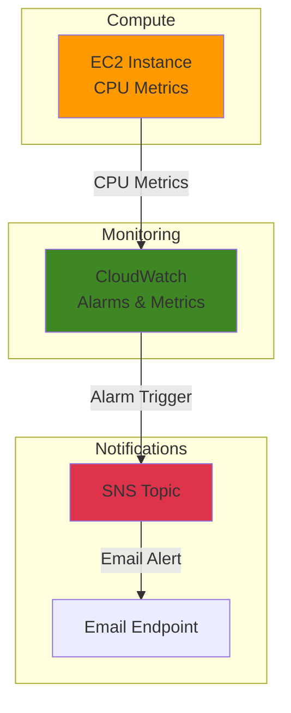

# Simple Resource Monitoring with CloudWatch and SNS

## Problem

Your growing startup needs basic monitoring for critical EC2 instances but lacks sophisticated monitoring infrastructure. Without proactive alerts, system outages go unnoticed until customers complain, leading to lost revenue and damaged reputation. You need a simple, cost-effective way to get email notifications when server resources exceed normal operating thresholds.

## Solution

Set up foundational AWS monitoring by creating CloudWatch alarms that track EC2 CPU utilization and send email notifications through SNS. This serverless approach provides automated alerting without managing additional infrastructure, enabling proactive response to performance issues before they impact users.

## Architecture Diagram



## Prerequisites

1. AWS account with permissions for EC2, CloudWatch, and SNS services
2. AWS CLI installed and configured (or CloudShell access)
3. Basic understanding of EC2 instances and monitoring concepts
4. Valid email address for receiving notifications
5. Estimated cost: $0.15-$0.75 for testing (includes EC2 instance hours, CloudWatch alarms, and SNS messages)

> **Note**: This recipe uses AWS free tier eligible resources where possible to minimize costs. CloudWatch alarms cost $0.10 per alarm per month, and SNS email notifications are free for the first 1,000 emails monthly.

## Preparation

```bash
# Set environment variables
export AWS_REGION=$(aws configure get region)
export AWS_ACCOUNT_ID=$(aws sts get-caller-identity \
    --query Account --output text)

# Generate unique identifiers for resources
RANDOM_SUFFIX=$(aws secretsmanager get-random-password \
    --exclude-punctuation --exclude-uppercase \
    --password-length 6 --require-each-included-type \
    --output text --query RandomPassword)

export INSTANCE_NAME="monitoring-demo-${RANDOM_SUFFIX}"
export TOPIC_NAME="cpu-alerts-${RANDOM_SUFFIX}"
export ALARM_NAME="high-cpu-${RANDOM_SUFFIX}"

# Set your email address for notifications
read -p "Enter your email address for alerts: " USER_EMAIL
export USER_EMAIL

echo "✅ Environment configured for monitoring setup"
```

## Steps

1. **Launch EC2 Instance for Monitoring**:

   AWS EC2 provides the compute foundation that generates CloudWatch metrics automatically. Every EC2 instance publishes basic metrics like CPU utilization, disk I/O, and network activity to CloudWatch at no additional charge, creating the data source for our monitoring system.

   ```bash
   # Launch t2.micro instance using latest Amazon Linux 2023 AMI
   INSTANCE_ID=$(aws ec2 run-instances \
       --image-id resolve:ssm:/aws/service/ami-amazon-linux-latest/al2023-ami-kernel-default-x86_64 \
       --instance-type t2.micro \
       --security-groups default \
       --tag-specifications \
       "ResourceType=instance,Tags=[{Key=Name,Value=${INSTANCE_NAME}}]" \
       --query 'Instances[0].InstanceId' --output text)
   
   export INSTANCE_ID
   echo "✅ EC2 instance launched: ${INSTANCE_ID}"
   ```

2. **Create SNS Topic for Notifications**:

   Amazon SNS provides a fully managed messaging service that acts as the central hub for sending notifications to multiple endpoints. Creating a topic establishes the communication channel that CloudWatch will use to deliver alert messages when monitoring thresholds are breached.

   ```bash
   # Create SNS topic for alert notifications
   TOPIC_ARN=$(aws sns create-topic \
       --name ${TOPIC_NAME} \
       --query 'TopicArn' --output text)
   
   export TOPIC_ARN
   echo "✅ SNS topic created: ${TOPIC_ARN}"
   ```

3. **Subscribe Email Address to SNS Topic**:

   Email subscriptions in SNS require confirmation to prevent spam and ensure legitimate ownership of the email address. This two-step process protects both the service and email recipients while establishing a reliable notification endpoint for critical system alerts.

   ```bash
   # Subscribe email to receive notifications
   SUBSCRIPTION_ARN=$(aws sns subscribe \
       --topic-arn ${TOPIC_ARN} \
       --protocol email \
       --notification-endpoint ${USER_EMAIL} \
       --query 'SubscriptionArn' --output text)
   
   echo "✅ Email subscription created (pending confirmation)"
   echo "   Check your email and confirm the subscription"
   
   # Wait for user to confirm subscription
   echo "Please confirm your email subscription before continuing..."
   read -p "Press Enter after confirming the subscription in your email"
   ```

4. **Wait for Instance to Initialize**:

   EC2 instances require time to fully boot and begin publishing metrics to CloudWatch. The instance must be in a running state and pass system status checks before reliable CPU metrics become available for alarm configuration.

   ```bash
   # Wait for instance to reach running state
   echo "Waiting for instance to start..."
   aws ec2 wait instance-running --instance-ids ${INSTANCE_ID}
   
   # Allow additional time for CloudWatch metrics to populate
   echo "Waiting for CloudWatch metrics to initialize..."
   sleep 180
   
   echo "✅ Instance ready for monitoring"
   ```

5. **Create CloudWatch CPU Alarm**:

   CloudWatch alarms continuously evaluate metrics against defined thresholds using configurable evaluation periods and comparison operators. This alarm monitors CPU utilization every 5 minutes and triggers when the average exceeds 70% for two consecutive periods, providing balanced sensitivity without false positives.

   ```bash
   # Create alarm for high CPU utilization
   aws cloudwatch put-metric-alarm \
       --alarm-name ${ALARM_NAME} \
       --alarm-description "Alert when CPU exceeds 70%" \
       --metric-name CPUUtilization \
       --namespace AWS/EC2 \
       --statistic Average \
       --period 300 \
       --threshold 70 \
       --comparison-operator GreaterThanThreshold \
       --dimensions "Name=InstanceId,Value=${INSTANCE_ID}" \
       --evaluation-periods 2 \
       --alarm-actions ${TOPIC_ARN} \
       --unit Percent
   
   echo "✅ CloudWatch alarm created: ${ALARM_NAME}"
   ```

6. **Test Alarm with Simulated CPU Load**:

   Generating synthetic CPU load validates the complete monitoring pipeline from metric collection through alarm evaluation to notification delivery. This controlled test ensures the system responds appropriately to actual performance issues without waiting for natural load spikes.

   ```bash
   # Generate CPU load using AWS Systems Manager Run Command
   echo "Testing alarm by generating CPU load..."
   
   # Create stress command document
   COMMAND_ID=$(aws ssm send-command \
       --document-name "AWS-RunShellScript" \
       --instance-ids ${INSTANCE_ID} \
       --parameters 'commands=["stress-ng --cpu 4 --timeout 600s || (yum install -y stress-ng && stress-ng --cpu 4 --timeout 600s)"]' \
       --query 'Command.CommandId' --output text)
   
   if [ $? -eq 0 ]; then
       echo "✅ CPU stress test initiated via SSM"
       echo "   Command ID: ${COMMAND_ID}"
       echo "   Monitor your email for alarm notifications"
   else
       echo "⚠️  SSM command failed. Manual testing required:"
       echo "   1. Connect to EC2 instance via SSH or Session Manager"
       echo "   2. Run: sudo yum install -y stress-ng"
       echo "   3. Run: stress-ng --cpu 4 --timeout 600s"
   fi
   ```

## Validation & Testing

1. **Verify CloudWatch alarm configuration**:

   ```bash
   # Check alarm details and current state
   aws cloudwatch describe-alarms \
       --alarm-names ${ALARM_NAME} \
       --query 'MetricAlarms[0].[AlarmName,StateValue,Threshold,ComparisonOperator]' \
       --output table
   ```

   Expected output: Alarm should show "OK" or "ALARM" state with 70.0 threshold and "GreaterThanThreshold" operator.

2. **Confirm SNS subscription status**:

   ```bash
   # List subscriptions for the topic
   aws sns list-subscriptions-by-topic \
       --topic-arn ${TOPIC_ARN} \
       --query 'Subscriptions[0].[Protocol,Endpoint,SubscriptionArn]' \
       --output table
   ```

   Expected output: Email protocol with your email address and confirmed ARN (not "PendingConfirmation").

3. **Monitor alarm state changes**:

   ```bash
   # Watch for alarm state transitions
   aws cloudwatch describe-alarm-history \
       --alarm-name ${ALARM_NAME} \
       --history-item-type StateUpdate \
       --query 'AlarmHistoryItems[0:3].[Timestamp,HistorySummary]' \
       --output table
   ```

4. **Verify CPU metrics are being collected**:

   ```bash
   # Check recent CPU utilization metrics
   aws cloudwatch get-metric-statistics \
       --namespace AWS/EC2 \
       --metric-name CPUUtilization \
       --dimensions Name=InstanceId,Value=${INSTANCE_ID} \
       --start-time $(date -u -d '10 minutes ago' +%Y-%m-%dT%H:%M:%S) \
       --end-time $(date -u +%Y-%m-%dT%H:%M:%S) \
       --period 300 \
       --statistics Average \
       --query 'Datapoints[*].[Timestamp,Average]' \
       --output table
   ```

## Cleanup

1. **Delete CloudWatch alarm**:

   ```bash
   # Remove the monitoring alarm
   aws cloudwatch delete-alarms --alarm-names ${ALARM_NAME}
   echo "✅ CloudWatch alarm deleted"
   ```

2. **Unsubscribe from SNS topic**:

   ```bash
   # Get subscription ARN and unsubscribe
   SUBSCRIPTION_ARN=$(aws sns list-subscriptions-by-topic \
       --topic-arn ${TOPIC_ARN} \
       --query 'Subscriptions[0].SubscriptionArn' --output text)
   
   if [ "${SUBSCRIPTION_ARN}" != "None" ] && [ "${SUBSCRIPTION_ARN}" != "PendingConfirmation" ]; then
       aws sns unsubscribe --subscription-arn ${SUBSCRIPTION_ARN}
       echo "✅ Email subscription removed"
   else
       echo "✅ No subscription to remove"
   fi
   ```

3. **Delete SNS topic**:

   ```bash
   # Remove the notification topic
   aws sns delete-topic --topic-arn ${TOPIC_ARN}
   echo "✅ SNS topic deleted"
   ```

4. **Terminate EC2 instance**:

   ```bash
   # Stop any running SSM commands
   if [ ! -z "${COMMAND_ID}" ]; then
       aws ssm cancel-command --command-id ${COMMAND_ID} \
           --instance-ids ${INSTANCE_ID} 2>/dev/null || true
   fi
   
   # Terminate the test instance
   aws ec2 terminate-instances --instance-ids ${INSTANCE_ID}
   
   # Wait for termination to complete
   aws ec2 wait instance-terminated --instance-ids ${INSTANCE_ID}
   echo "✅ EC2 instance terminated"
   ```

## Discussion

This recipe demonstrates the foundation of AWS monitoring by combining CloudWatch's metric collection capabilities with SNS's reliable notification system. CloudWatch automatically collects basic metrics from EC2 instances at 5-minute intervals, providing essential visibility into system performance without requiring agent installation or custom configuration. This approach follows the AWS Well-Architected Framework's Operational Excellence pillar by establishing automated monitoring and alerting capabilities.

The alarm configuration uses a threshold of 70% CPU utilization with a 2-period evaluation window, striking a balance between responsive alerting and false positive prevention. This approach follows AWS monitoring best practices by avoiding overly sensitive thresholds that generate noise while ensuring genuine performance issues trigger timely notifications. The 5-minute metric resolution provides sufficient granularity for most business applications while keeping costs minimal under the free tier limits.

SNS serves as the crucial link between monitoring detection and human response, supporting multiple endpoint types including email, SMS, HTTP webhooks, and AWS service integrations. The email confirmation requirement enhances security by preventing unauthorized subscriptions while ensuring message delivery to verified recipients. This serverless notification architecture scales automatically and requires no maintenance overhead, making it ideal for startups and small teams.

The monitoring approach established here forms the building blocks for more sophisticated observability strategies. Organizations typically expand this foundation by adding custom metrics through the CloudWatch agent, implementing composite alarms for complex conditions, and integrating with incident management platforms for automated response workflows. The use of Systems Manager for testing demonstrates how AWS services integrate to provide comprehensive operational capabilities.

> **Tip**: Use CloudWatch Logs Insights to correlate alarm events with application logs, providing deeper context for troubleshooting performance issues. Consider setting up additional alarms for memory and disk usage by installing the CloudWatch agent.

**Documentation References:**
- [Using Amazon CloudWatch alarms](https://docs.aws.amazon.com/AmazonCloudWatch/latest/monitoring/AlarmThatSendsEmail.html)
- [Amazon SNS email subscription setup and management](https://docs.aws.amazon.com/sns/latest/dg/sns-email-notifications.html)
- [Manage CloudWatch alarms for your EC2 instances](https://docs.aws.amazon.com/AWSEC2/latest/UserGuide/ec2-instance-alarms.html)
- [AWS Well-Architected Framework - Operational Excellence](https://docs.aws.amazon.com/wellarchitected/latest/operational-excellence-pillar/welcome.html)
- [Amazon Linux 2023 on EC2](https://docs.aws.amazon.com/linux/al2023/ug/ec2.html)

## Challenge

Extend this monitoring solution with these enhancements:

1. **Add Memory and Disk Monitoring**: Install the CloudWatch agent to collect custom metrics for memory usage and disk space utilization, expanding beyond basic EC2 metrics
2. **Create Composite Alarms**: Combine multiple metric alarms using boolean logic to trigger notifications only when multiple conditions are met simultaneously, reducing false positives
3. **Implement Auto-Scaling Integration**: Configure alarms to trigger Auto Scaling actions that automatically add or remove instances based on demand, enabling self-healing infrastructure
4. **Add Dashboard Visualization**: Create CloudWatch dashboards to visualize metrics trends and alarm states in a centralized view for operational awareness
5. **Set Up Cross-Region Monitoring**: Replicate the monitoring setup across multiple AWS regions for comprehensive infrastructure oversight and disaster recovery scenarios

## Infrastructure Code

*Infrastructure code will be generated after recipe approval.*