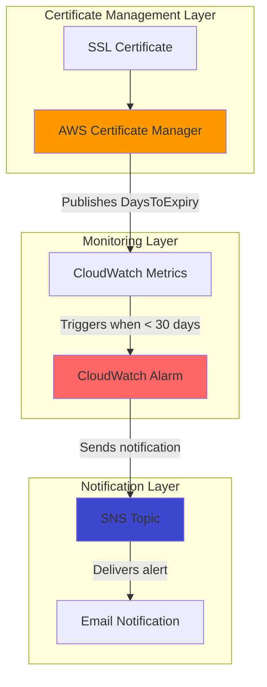

# Simple SSL Certificate Monitoring with Certificate Manager and SNS

## Problem

Organizations often experience unexpected website downtime when SSL certificates expire without warning, leading to customer trust issues and revenue loss. Manual certificate tracking becomes error-prone as infrastructure scales, and expired certificates can cause security vulnerabilities and service interruptions that impact business operations.

## Solution

AWS Certificate Manager automatically publishes certificate expiration metrics to CloudWatch, enabling proactive monitoring through automated alerts. By creating CloudWatch alarms that trigger SNS notifications when certificates approach expiration, teams receive timely warnings to renew certificates before they cause service disruptions.

## Architecture Diagram



## Prerequisites

1. AWS account with Certificate Manager, CloudWatch, and SNS permissions
2. AWS CLI installed and configured (or CloudShell access)
3. An existing SSL certificate in AWS Certificate Manager (or domain to create one)
4. Valid email address for receiving alert notifications
5. Estimated cost: $0.10-0.50/month for CloudWatch alarms and SNS notifications

> **Note**: ACM certificates used with AWS services like CloudFront or Application Load Balancer are automatically managed and renewed at no additional charge.

## Preparation

```bash
# Set environment variables
export AWS_REGION=$(aws configure get region)
export AWS_ACCOUNT_ID=$(aws sts get-caller-identity \
    --query Account --output text)

# Generate unique identifiers for resources
RANDOM_SUFFIX=$(aws secretsmanager get-random-password \
    --exclude-punctuation --exclude-uppercase \
    --password-length 6 --require-each-included-type \
    --output text --query RandomPassword)

# Set email address for notifications (update with your email)
export NOTIFICATION_EMAIL="your-email@example.com"

# Create topic name
export SNS_TOPIC_NAME="ssl-cert-alerts-${RANDOM_SUFFIX}"

echo "✅ AWS environment configured for certificate monitoring"
```

## Steps

1. **Create SNS Topic for Certificate Alerts**:

   Amazon SNS provides a reliable, scalable messaging service that ensures certificate expiration alerts reach the right people at the right time. The topic acts as a central hub for distributing notifications across multiple endpoints, enabling team-wide awareness of certificate status changes.

   ```bash
   # Create SNS topic for certificate notifications
   SNS_TOPIC_ARN=$(aws sns create-topic \
       --name ${SNS_TOPIC_NAME} \
       --query TopicArn --output text)
   
   echo "✅ SNS topic created: ${SNS_TOPIC_ARN}"
   ```

2. **Subscribe Email Address to SNS Topic**:

   Email subscriptions provide immediate notification delivery to security and operations teams. This ensures certificate expiration warnings reach responsible personnel who can take action to prevent service disruptions.

   ```bash
   # Subscribe email to receive certificate alerts
   aws sns subscribe \
       --topic-arn ${SNS_TOPIC_ARN} \
       --protocol email \
       --notification-endpoint ${NOTIFICATION_EMAIL}
   
   echo "✅ Email subscription created - check your inbox to confirm"
   ```

   > **Important**: Check your email and click the confirmation link to activate the subscription.

3. **List Available SSL Certificates**:

   AWS Certificate Manager maintains metadata for all certificates in your account, including expiration dates and renewal status. Identifying certificate ARNs is essential for creating targeted monitoring that tracks specific certificates critical to your applications.

   ```bash
   # List all certificates in your account
   aws acm list-certificates \
       --certificate-statuses ISSUED \
       --query 'CertificateSummaryList[*].[CertificateArn,DomainName]' \
       --output table
   
   # Store the first certificate ARN for monitoring
   CERTIFICATE_ARN=$(aws acm list-certificates \
       --certificate-statuses ISSUED \
       --query 'CertificateSummaryList[0].CertificateArn' \
       --output text)
   
   echo "✅ Certificate selected for monitoring: ${CERTIFICATE_ARN}"
   ```

4. **Create CloudWatch Alarm for Certificate Expiration**:

   CloudWatch alarms continuously monitor ACM's DaysToExpiry metric, which updates twice daily for each certificate. Setting a 30-day threshold provides sufficient lead time for certificate renewal while avoiding false alarms for certificates with longer validity periods.

   ```bash
   # Create CloudWatch alarm for certificate expiration
   aws cloudwatch put-metric-alarm \
       --alarm-name "SSL-Certificate-Expiring-${RANDOM_SUFFIX}" \
       --alarm-description "Alert when SSL certificate expires in 30 days" \
       --metric-name DaysToExpiry \
       --namespace AWS/CertificateManager \
       --statistic Minimum \
       --period 86400 \
       --threshold 30 \
       --comparison-operator LessThanThreshold \
       --dimensions Name=CertificateArn,Value=${CERTIFICATE_ARN} \
       --evaluation-periods 1 \
       --alarm-actions ${SNS_TOPIC_ARN} \
       --treat-missing-data notBreaching
   
   echo "✅ CloudWatch alarm created for certificate monitoring"
   ```

5. **Verify Alarm Configuration**:

   Confirming alarm configuration ensures monitoring operates as expected. The alarm state should initially show "INSUFFICIENT_DATA" until CloudWatch receives the first metric data points from ACM, which occurs within 24 hours of certificate activity.

   ```bash
   # Check alarm status and configuration
   aws cloudwatch describe-alarms \
       --alarm-names "SSL-Certificate-Expiring-${RANDOM_SUFFIX}" \
       --query 'MetricAlarms[0].[AlarmName,StateValue,StateReason]' \
       --output table
   
   echo "✅ Alarm configuration verified"
   ```

6. **Set Up Additional Certificate Monitoring** (Optional):

   Enterprise environments typically manage multiple certificates across different services and domains. Creating comprehensive monitoring coverage requires individual alarms for each critical certificate, ensuring no single point of failure in certificate management.

   ```bash
   # Create alarms for all certificates (if multiple exist)
   aws acm list-certificates \
       --certificate-statuses ISSUED \
       --query 'CertificateSummaryList[].CertificateArn' \
       --output text | tr '\t' '\n' | while read cert_arn; do
       
       DOMAIN_NAME=$(aws acm describe-certificate \
           --certificate-arn $cert_arn \
           --query 'Certificate.DomainName' --output text)
       
       # Create alarm for each certificate
       aws cloudwatch put-metric-alarm \
           --alarm-name "SSL-${DOMAIN_NAME}-Expiring-${RANDOM_SUFFIX}" \
           --alarm-description "Alert for ${DOMAIN_NAME} certificate expiration" \
           --metric-name DaysToExpiry \
           --namespace AWS/CertificateManager \
           --statistic Minimum \
           --period 86400 \
           --threshold 30 \
           --comparison-operator LessThanThreshold \
           --dimensions Name=CertificateArn,Value=$cert_arn \
           --evaluation-periods 1 \
           --alarm-actions ${SNS_TOPIC_ARN} \
           --treat-missing-data notBreaching
       
       echo "✅ Monitoring configured for certificate: ${DOMAIN_NAME}"
   done
   ```

## Validation & Testing

1. **Verify CloudWatch Metrics Are Available**:

   ```bash
   # Check for DaysToExpiry metrics in CloudWatch
   aws cloudwatch get-metric-statistics \
       --namespace AWS/CertificateManager \
       --metric-name DaysToExpiry \
       --dimensions Name=CertificateArn,Value=${CERTIFICATE_ARN} \
       --start-time $(date -d '2 days ago' -u +%Y-%m-%dT%H:%M:%S) \
       --end-time $(date -u +%Y-%m-%dT%H:%M:%S) \
       --period 86400 \
       --statistics Minimum
   ```

   Expected output: Metric data points showing days remaining until certificate expiration.

2. **Test SNS Topic Subscription**:

   ```bash
   # Send test notification to verify email delivery
   aws sns publish \
       --topic-arn ${SNS_TOPIC_ARN} \
       --message "Test: SSL Certificate Monitoring System Active" \
       --subject "SSL Certificate Alert Test"
   ```

   Expected result: Test email received at the subscribed email address.

3. **Verify Alarm State and History**:

   ```bash
   # Check alarm history for proper configuration
   aws cloudwatch describe-alarm-history \
       --alarm-name "SSL-Certificate-Expiring-${RANDOM_SUFFIX}" \
       --query 'AlarmHistoryItems[0].[Timestamp,HistorySummary]' \
       --output table
   ```

4. **Test Alarm Threshold** (Optional):

   ```bash
   # Temporarily lower threshold to test alarm triggering
   aws cloudwatch put-metric-alarm \
       --alarm-name "SSL-Certificate-Expiring-${RANDOM_SUFFIX}" \
       --alarm-description "Test alarm with high threshold" \
       --metric-name DaysToExpiry \
       --namespace AWS/CertificateManager \
       --statistic Minimum \
       --period 86400 \
       --threshold 365 \
       --comparison-operator LessThanThreshold \
       --dimensions Name=CertificateArn,Value=${CERTIFICATE_ARN} \
       --evaluation-periods 1 \
       --alarm-actions ${SNS_TOPIC_ARN}
   
   # Reset to original 30-day threshold after testing
   sleep 60
   aws cloudwatch put-metric-alarm \
       --alarm-name "SSL-Certificate-Expiring-${RANDOM_SUFFIX}" \
       --metric-name DaysToExpiry \
       --namespace AWS/CertificateManager \
       --statistic Minimum \
       --period 86400 \
       --threshold 30 \
       --comparison-operator LessThanThreshold \
       --dimensions Name=CertificateArn,Value=${CERTIFICATE_ARN} \
       --evaluation-periods 1 \
       --alarm-actions ${SNS_TOPIC_ARN} \
       --treat-missing-data notBreaching
   ```

## Cleanup

1. **Delete CloudWatch Alarms**:

   ```bash
   # Delete the main certificate alarm
   aws cloudwatch delete-alarms \
       --alarm-names "SSL-Certificate-Expiring-${RANDOM_SUFFIX}"
   
   # Delete any additional certificate alarms created
   aws cloudwatch describe-alarms \
       --alarm-name-prefix "SSL-" \
       --query "MetricAlarms[?contains(AlarmName, '${RANDOM_SUFFIX}')].AlarmName" \
       --output text | tr '\t' '\n' | while read alarm_name; do
       aws cloudwatch delete-alarms --alarm-names "$alarm_name"
       echo "✅ Deleted alarm: $alarm_name"
   done
   ```

2. **Remove SNS Topic and Subscriptions**:

   ```bash
   # Delete SNS topic (automatically removes subscriptions)
   aws sns delete-topic --topic-arn ${SNS_TOPIC_ARN}
   
   echo "✅ SNS topic and subscriptions deleted"
   ```

3. **Clean Up Environment Variables**:

   ```bash
   # Clear environment variables
   unset SNS_TOPIC_ARN CERTIFICATE_ARN SNS_TOPIC_NAME NOTIFICATION_EMAIL
   
   echo "✅ Environment variables cleared"
   ```

## Discussion

SSL certificate expiration monitoring is a critical operational practice that prevents costly service outages and security vulnerabilities. AWS Certificate Manager's integration with CloudWatch provides automated tracking of certificate lifecycle events, eliminating manual processes that are prone to human error. The DaysToExpiry metric, published twice daily for each certificate, enables proactive monitoring with sufficient lead time for renewal activities.

CloudWatch alarms offer sophisticated threshold monitoring with configurable evaluation periods and missing data handling. The 30-day warning threshold balances early notification with operational noise, providing teams adequate time to coordinate certificate renewals without overwhelming notification channels. The alarm's "treat-missing-data" configuration as "notBreaching" prevents false alarms when certificates are temporarily unavailable for metric collection.

SNS provides enterprise-grade notification delivery with support for multiple endpoint types, including email, SMS, HTTP/HTTPS webhooks, and integration with AWS services like Lambda for automated remediation workflows. Email notifications offer immediate visibility to security and operations teams, while programmatic endpoints enable integration with existing incident management and ticketing systems for comprehensive operational coverage.

This monitoring approach follows AWS Well-Architected Framework principles by implementing automated operational excellence through infrastructure-as-code practices and proactive monitoring. The solution scales automatically as certificate portfolios grow, requiring minimal ongoing maintenance while providing consistent operational visibility across all managed certificates.

> **Tip**: Consider implementing certificate renewal automation using AWS Lambda functions triggered by these same CloudWatch alarms to achieve fully automated certificate lifecycle management.

**Documentation References:**
- [AWS Certificate Manager CloudWatch Metrics](https://docs.aws.amazon.com/acm/latest/userguide/cloudwatch-metrics.html)
- [Creating Amazon CloudWatch Alarms](https://docs.aws.amazon.com/AmazonCloudWatch/latest/monitoring/AlarmThatSendsEmail.html)
- [Amazon SNS Email Notifications](https://docs.aws.amazon.com/sns/latest/dg/sns-email-notifications.html)
- [AWS Well-Architected Framework - Operational Excellence](https://docs.aws.amazon.com/wellarchitected/latest/operational-excellence-pillar/welcome.html)

## Challenge

Extend this solution by implementing these enhancements:

1. **Multi-Region Certificate Monitoring**: Deploy alarms across multiple AWS regions to monitor certificates used with global services like CloudFront distributions and Route 53 health checks.

2. **Automated Certificate Renewal**: Create Lambda functions triggered by CloudWatch alarms that automatically request new certificates and update associated AWS services like Application Load Balancers.

3. **Certificate Inventory Dashboard**: Build a QuickSight dashboard that visualizes certificate expiration timelines, renewal history, and compliance status across your entire certificate portfolio.

4. **Integration with Ticketing Systems**: Configure SNS to deliver notifications to ITSM platforms like ServiceNow or Jira, automatically creating tickets for certificate renewal workflows with proper priority and assignment.

5. **Custom Certificate Validation**: Implement Lambda functions that perform additional certificate health checks, including chain validation, revocation status, and security policy compliance beyond basic expiration monitoring.

## Infrastructure Code

### Available Infrastructure as Code:

- [Infrastructure Code Overview](code/README.md) - Detailed description of all infrastructure components
- [AWS CDK (Python)](code/cdk-python/) - AWS CDK Python implementation
- [AWS CDK (TypeScript)](code/cdk-typescript/) - AWS CDK TypeScript implementation
- [CloudFormation](code/cloudformation.yaml) - AWS CloudFormation template
- [Bash CLI Scripts](code/scripts/) - Example bash scripts using AWS CLI commands to deploy infrastructure
- [Terraform](code/terraform/) - Terraform configuration files