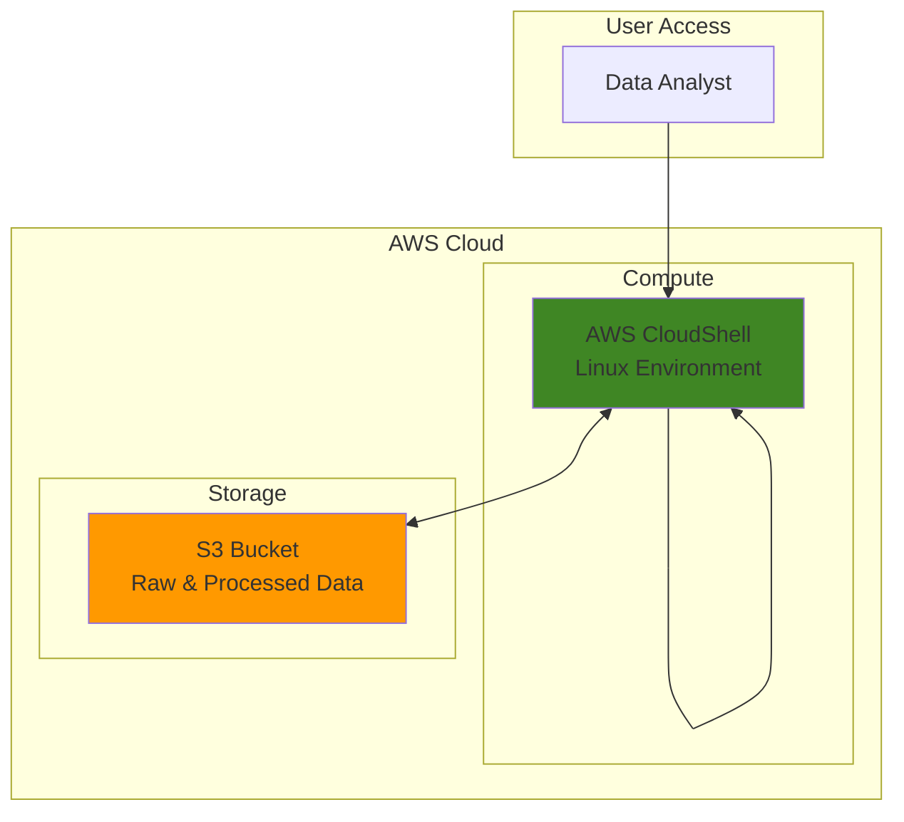

# Simple Text Processing with CloudShell and S3

## Problem

Organizations frequently need to process and analyze text files containing business data like sales reports, log files, or customer feedback. However, setting up local development environments for simple text processing tasks can be time-consuming and inconsistent across team members. Without a standardized cloud-based approach, teams struggle with file sharing, processing consistency, and collaboration on data analysis tasks.

## Solution

This recipe demonstrates how to use AWS CloudShell's built-in Linux tools to process text files stored in S3, providing a consistent, cloud-based environment for text analysis. CloudShell eliminates the need for local setup while S3 provides scalable storage and easy file sharing capabilities, creating an efficient workflow for basic data processing tasks.

## Architecture Diagram



## Prerequisites

1. AWS account with CloudShell access permissions (AWSCloudShellFullAccess policy)
2. Basic familiarity with Linux command-line tools (grep, awk, sort, wc)
3. Understanding of S3 bucket concepts
4. Sample text data file for processing (we'll create one if needed)
5. Estimated cost: $0.01-0.05 for S3 storage during this tutorial

> **Note**: CloudShell provides 1 GB of persistent storage per AWS Region at no additional charge. S3 charges apply for storage and requests.

## Preparation

AWS CloudShell comes pre-configured with AWS CLI and provides a persistent Linux environment accessible through the AWS Management Console. This eliminates the need for local software installation while providing consistent access to AWS services and Linux text processing tools.

```bash
# Set environment variables for this session
export AWS_REGION=$(aws configure get region)
export AWS_ACCOUNT_ID=$(aws sts get-caller-identity \
    --query Account --output text)

# Generate unique identifiers for resources
RANDOM_SUFFIX=$(aws secretsmanager get-random-password \
    --exclude-punctuation --exclude-uppercase \
    --password-length 6 --require-each-included-type \
    --output text --query RandomPassword)

# Set bucket name with unique suffix
export BUCKET_NAME="text-processing-demo-${RANDOM_SUFFIX}"

echo "✅ Environment configured for region: ${AWS_REGION}"
echo "✅ Using bucket name: ${BUCKET_NAME}"
```

## Steps

1. **Create S3 Bucket for Data Storage**:

   S3 provides highly durable object storage with 99.999999999% (11 9's) durability that serves as the central repository for both raw input files and processed output files. Creating a dedicated bucket establishes a workspace for our text processing pipeline while enabling easy file sharing and version management across team members.

   ```bash
   # Create S3 bucket for storing text files
   aws s3 mb s3://${BUCKET_NAME} --region ${AWS_REGION}
   
   # Verify bucket creation
   aws s3 ls | grep ${BUCKET_NAME}
   
   echo "✅ S3 bucket created: ${BUCKET_NAME}"
   ```

   The bucket is now ready to store both input and output files for our text processing workflow. S3's virtually unlimited storage capacity and global accessibility make it ideal for collaborative data analysis projects that scale from small teams to enterprise deployments.

2. **Create Sample Data File**:

   For this demonstration, we'll create a sample sales report file that mimics real-world business data. This CSV-formatted file contains structured text data with multiple fields that we can analyze using various Linux command-line tools available in CloudShell.

   ```bash
   # Create a sample sales data file
   cat << 'EOF' > sales_data.txt
   Date,Region,Product,Sales,Quantity
   2024-01-15,North,Laptop,1200,2
   2024-01-16,South,Mouse,25,5
   2024-01-17,East,Keyboard,75,3
   2024-01-18,West,Monitor,300,1
   2024-01-19,North,Laptop,600,1
   2024-01-20,South,Tablet,400,2
   2024-01-21,East,Mouse,50,10
   2024-01-22,West,Keyboard,150,6
   2024-01-23,North,Monitor,900,3
   2024-01-24,South,Laptop,2400,4
   2024-01-25,East,Tablet,800,4
   2024-01-26,West,Mouse,75,15
   EOF
   
   # Display file contents to verify creation
   echo "Sample data file created with $(wc -l < sales_data.txt) lines"
   head -5 sales_data.txt
   
   echo "✅ Sample sales data file created locally"
   ```

   The sample file contains realistic business data with multiple fields (date, region, product, sales amount, and quantity) that we can analyze using different text processing techniques. This simulates common data analysis scenarios encountered in business environments where CSV files are frequently used for reporting and analysis.

3. **Upload Data File to S3**:

   Uploading our sample data to S3 establishes the input source for our processing pipeline and demonstrates the seamless integration between CloudShell and S3 storage. This step shows how to transfer files from CloudShell's local environment to S3 storage, enabling data sharing and creating a backup of our source data.

   ```bash
   # Upload sample data to S3 input folder
   aws s3 cp sales_data.txt s3://${BUCKET_NAME}/input/
   
   # Verify upload successful
   aws s3 ls s3://${BUCKET_NAME}/input/
   
   echo "✅ Sample data uploaded to S3"
   ```

   The file is now stored in S3 and accessible for processing from any CloudShell session. This approach enables team collaboration and provides a centralized data source for analysis workflows that can be accessed by multiple users while maintaining data consistency and version control.

4. **Download and Analyze Data with Text Processing Tools**:

   CloudShell provides a comprehensive set of Linux text processing tools including grep, awk, sed, sort, and wc. These powerful command-line utilities enable complex data analysis tasks like filtering, counting, and summarizing without requiring specialized software installation or configuration.

   ```bash
   # Create processing directory for organized workspace
   mkdir -p processing
   cd processing
   
   # Download the file from S3 for local processing
   aws s3 cp s3://${BUCKET_NAME}/input/sales_data.txt .
   
   # Basic file analysis using Linux text processing tools
   echo "=== File Analysis ==="
   echo "Total lines: $(wc -l < sales_data.txt)"
   echo "Total words: $(wc -w < sales_data.txt)"
   echo "File size: $(wc -c < sales_data.txt) bytes"
   
   echo "✅ File downloaded and basic analysis completed"
   ```

   We now have the data locally in CloudShell and have performed basic file metrics analysis. The processing directory provides an organized workspace for our analysis tasks while the file metrics give us initial insights into our dataset size and structure.

5. **Perform Advanced Text Processing**:

   Using Linux command-line tools, we'll extract business insights from our sales data. These operations demonstrate common data analysis patterns like filtering by criteria, calculating totals, and generating summary reports that are essential for business intelligence workflows.

   ```bash
   # Extract sales data for specific region using grep
   echo "=== North Region Sales ==="
   grep "North" sales_data.txt
   
   # Calculate total sales by region using AWK field processing
   echo "=== Sales Summary by Region ==="
   awk -F',' 'NR>1 {sales[$2]+=$4} END {for (region in sales) 
       print region ": $" sales[region]}' sales_data.txt
   
   # Find high-value transactions (>$500) using conditional logic
   echo "=== High-Value Transactions ==="
   awk -F',' 'NR>1 && $4>500 {print $0}' sales_data.txt
   
   # Count products sold and sort by frequency
   echo "=== Product Count ==="
   awk -F',' 'NR>1 {count[$3]++} END {for (product in count) 
       print product ": " count[product] " transactions"}' sales_data.txt \
       | sort -k2 -nr
   
   echo "✅ Advanced text processing completed"
   ```

   These commands demonstrate powerful text processing capabilities available in CloudShell, enabling complex data analysis without specialized software installation. AWK's field processing capabilities combined with grep's pattern matching provide sophisticated analysis tools that handle CSV data efficiently and can scale to process much larger datasets.

6. **Generate Processed Output Files**:

   Creating structured output files from our analysis enables sharing results and building automated reporting workflows. We'll generate multiple CSV output files containing different analytical perspectives on our sales data, demonstrating how to transform raw data into actionable business insights.

   ```bash
   # Generate regional sales summary with totals
   awk -F',' 'NR>1 {sales[$2]+=$4; qty[$2]+=$5} END {
       print "Region,Total_Sales,Total_Quantity";
       for (region in sales) 
           print region "," sales[region] "," qty[region]
   }' sales_data.txt > regional_summary.csv
   
   # Generate high-value transactions report
   echo "Date,Region,Product,Sales,Quantity" > high_value_sales.csv
   awk -F',' 'NR>1 && $4>500 {print $0}' sales_data.txt >> high_value_sales.csv
   
   # Generate comprehensive product performance report
   awk -F',' 'NR>1 {
       sales[$3]+=$4; 
       qty[$3]+=$5; 
       count[$3]++
   } END {
       print "Product,Total_Sales,Total_Quantity,Transaction_Count";
       for (product in sales) 
           print product "," sales[product] "," qty[product] "," count[product]
   }' sales_data.txt > product_performance.csv
   
   # Display generated files for verification
   echo "Generated analysis files:"
   ls -la *.csv
   
   echo "✅ Processed output files generated"
   ```

   We've created three analytical reports that provide different business perspectives on our sales data, demonstrating how text processing can generate valuable business insights. These CSV files can be easily imported into spreadsheet applications or business intelligence tools for further analysis and visualization.

7. **Upload Processed Results to S3**:

   Storing processed results in S3 completes our text processing pipeline and makes the analytical outputs available for sharing, further processing, or integration with other systems. This establishes S3 as both input source and output destination, creating a complete data processing workflow.

   ```bash
   # Upload all processed files to S3 output folder
   aws s3 cp regional_summary.csv s3://${BUCKET_NAME}/output/
   aws s3 cp high_value_sales.csv s3://${BUCKET_NAME}/output/
   aws s3 cp product_performance.csv s3://${BUCKET_NAME}/output/
   
   # Verify all uploads completed successfully
   echo "=== Files in S3 Output Folder ==="
   aws s3 ls s3://${BUCKET_NAME}/output/
   
   # Display one of the processed files to verify content
   echo "=== Regional Summary Results ==="
   cat regional_summary.csv
   
   echo "✅ All processed files uploaded to S3"
   ```

   Our text processing pipeline is complete with results stored in S3 for easy access and sharing. The organized folder structure (input/ and output/) provides clear data flow organization that supports collaborative workflows and enables automated processing pipelines.

## Validation & Testing

1. **Verify S3 bucket and file structure**:

   ```bash
   # Check bucket exists and contains expected folders
   aws s3 ls s3://${BUCKET_NAME}/
   
   # Verify input files are present
   aws s3 ls s3://${BUCKET_NAME}/input/
   
   # Verify output files are present
   aws s3 ls s3://${BUCKET_NAME}/output/
   ```

   Expected output: Lists showing input/ and output/ folders with respective files in each location.

2. **Validate processed data accuracy**:

   ```bash
   # Create verification directory
   mkdir -p verify
   
   # Download and verify one output file
   aws s3 cp s3://${BUCKET_NAME}/output/regional_summary.csv verify/
   
   # Display contents to verify data accuracy
   cat verify/regional_summary.csv
   
   # Count total records in original vs processed
   echo "Original records: $(tail -n +2 sales_data.txt | wc -l)"
   echo "Regional summary records: $(tail -n +2 verify/regional_summary.csv | wc -l)"
   ```

   Expected output: CSV file with regional summaries and record counts confirming processing accuracy.

3. **Test CloudShell persistent storage**:

   ```bash
   # Verify files persist in CloudShell home directory
   ls -la ~/
   echo "Current working directory files:"
   ls -la
   ```

   Expected output: Files created during the session are visible and accessible for future CloudShell sessions.

## Cleanup

1. **Remove S3 bucket and all contents**:

   ```bash
   # Delete all objects in the bucket recursively
   aws s3 rm s3://${BUCKET_NAME} --recursive
   
   # Delete the bucket itself
   aws s3 rb s3://${BUCKET_NAME}
   
   echo "✅ S3 bucket and contents deleted"
   ```

2. **Clean up local CloudShell files**:

   ```bash
   # Return to home directory
   cd ~
   
   # Remove processing directories and files
   rm -rf processing/
   rm -rf verify/
   rm -f sales_data.txt
   rm -f *.csv
   
   # Clean up environment variables
   unset BUCKET_NAME
   unset RANDOM_SUFFIX
   
   echo "✅ Local files and variables cleaned up"
   ```

## Discussion

AWS CloudShell provides an ideal environment for text processing tasks by combining the power of Linux command-line tools with seamless AWS service integration. Unlike local development environments, CloudShell eliminates setup complexity while ensuring consistent tool availability across different users and sessions. The service includes AWS CLI pre-installed and pre-authenticated, making it simple to work with S3 and other AWS services without additional configuration. According to the [AWS CloudShell User Guide](https://docs.aws.amazon.com/cloudshell/latest/userguide/welcome.html), CloudShell provides up to 1 GB of persistent storage per AWS Region that maintains files between sessions.

The integration between CloudShell and S3 creates a powerful data processing pipeline suitable for various business scenarios. S3's durability (99.999999999% - 11 9's) ensures data safety while providing virtually unlimited storage capacity for growing datasets. The combination enables teams to process files ranging from small configuration files to large log files without infrastructure management overhead. This serverless approach to text processing eliminates the need for dedicated compute resources while providing on-demand access to powerful Linux text processing capabilities.

Linux command-line tools like awk, grep, and sed offer surprising power for data analysis tasks that many users overlook in favor of more complex software solutions. These tools can handle complex text transformations, pattern matching, and calculations without requiring specialized software or programming knowledge. For many business users, these tools provide sufficient capability for routine data analysis tasks like log file analysis, report generation, and data format conversion. The skills learned with these tools translate directly to other Linux environments and can serve as stepping stones to more advanced data processing techniques.

Cost optimization becomes straightforward with this approach since CloudShell usage is included with AWS accounts (with reasonable usage limits), and S3 charges only for actual storage and requests. Organizations can implement sophisticated text processing workflows without upfront software licensing costs or infrastructure investments. This makes the solution particularly attractive for startups, small teams, or experimental projects where cost control is essential. The [AWS CloudShell pricing model](https://docs.aws.amazon.com/cloudshell/latest/userguide/limits.html) includes generous usage limits that accommodate most text processing use cases.

> **Tip**: Use AWS CLI's `--output table` option for better formatted command output when working interactively in CloudShell. For example: `aws s3 ls --output table` provides more readable results than the default output format.

The approach demonstrated here scales naturally as data volumes grow. S3's integration with other AWS services like Lambda, Glue, and EMR provides clear upgrade paths when simple command-line processing reaches its limits. Teams can start with CloudShell for proof-of-concept work and migrate to more sophisticated services as requirements evolve, maintaining the same S3-based data storage approach throughout their growth journey.

## Challenge

Extend this solution by implementing these enhancements:

1. **Automated Processing Pipeline**: Create a CloudShell script that processes multiple files in an S3 folder automatically, generating timestamped output reports for each input file and implementing error handling for missing or corrupted files.

2. **Error Handling and Logging**: Add comprehensive error handling to your text processing scripts and implement logging to track processing status, execution times, and any issues encountered during file processing operations.

3. **Advanced Analytics**: Implement more sophisticated analysis using tools like `jq` for JSON processing or `sqlite3` for relational queries on your text data, enabling complex joins and aggregations across multiple data sources.

4. **Integration with Lambda**: Convert your CloudShell scripts into Lambda functions that automatically trigger when new files are uploaded to your S3 bucket, creating a fully automated text processing pipeline with event-driven architecture.

5. **Visualization Dashboard**: Use the processed CSV outputs to create visualizations in Amazon QuickSight, connecting your text processing pipeline to business intelligence tools for interactive dashboards and automated reporting.

## Infrastructure Code

*Infrastructure code will be generated after recipe approval.*