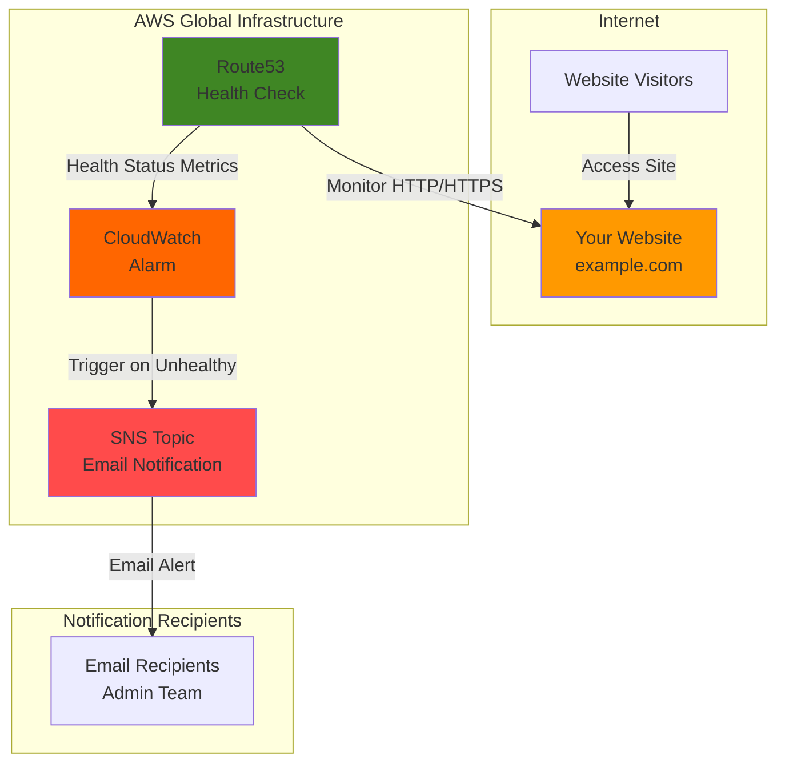

# Simple Website Uptime Monitoring with Route53 and SNS

## Problem

Your business website is critical to customer experience and revenue generation, but you have no automated way to know when it goes down. Manual monitoring is unreliable and time-consuming, leading to extended outages that damage customer trust and result in lost sales. You need an automated monitoring solution that immediately alerts you via email when your website becomes unreachable, allowing for rapid response and resolution.

## Solution

Create an automated uptime monitoring system using Route53 health checks to continuously monitor your website's availability, with SNS email notifications triggered through CloudWatch alarms when downtime is detected. This serverless solution provides 24/7 monitoring with global health check locations, immediate email alerts, and minimal operational overhead while leveraging AWS's highly available infrastructure.

## Architecture Diagram



## Prerequisites

1. AWS account with Route53 and SNS permissions (estimated monthly cost: $0.50-$2.00)
2. AWS CLI installed and configured (version 2.0 or higher)  
3. A publicly accessible website URL to monitor (HTTP or HTTPS)
4. Basic understanding of DNS concepts and email systems
5. Valid email address for receiving alerts

> **Note**: This recipe follows AWS Well-Architected Framework monitoring principles and leverages globally distributed health checkers for reliable uptime detection. See the [AWS Well-Architected Framework](https://docs.aws.amazon.com/wellarchitected/latest/framework/welcome.html) for additional guidance.

## Preparation

```bash
# Set environment variables
export AWS_REGION=$(aws configure get region)
export AWS_ACCOUNT_ID=$(aws sts get-caller-identity \
    --query Account --output text)

# Generate unique identifiers for resources
RANDOM_SUFFIX=$(aws secretsmanager get-random-password \
    --exclude-punctuation --exclude-uppercase \
    --password-length 6 --require-each-included-type \
    --output text --query RandomPassword)

# Set monitoring parameters - Replace with your actual values
export WEBSITE_URL="https://example.com"
export ADMIN_EMAIL="admin@example.com"
export TOPIC_NAME="website-uptime-alerts-${RANDOM_SUFFIX}"
export HEALTH_CHECK_NAME="website-health-${RANDOM_SUFFIX}"

echo "✅ Environment configured for uptime monitoring setup"
echo "   - Website to monitor: ${WEBSITE_URL}"
echo "   - Alert email: ${ADMIN_EMAIL}"
echo "   - Topic name: ${TOPIC_NAME}"
```

## Steps

1. **Create SNS Topic for Email Alerts**:

   Amazon SNS provides reliable, scalable message delivery that forms the foundation of our notification system. Creating the SNS topic first establishes the communication channel that will deliver instant email alerts when website issues are detected, ensuring rapid response to outages.

   ```bash
   # Create SNS topic for uptime alerts
   export TOPIC_ARN=$(aws sns create-topic \
       --name ${TOPIC_NAME} \
       --query 'TopicArn' --output text)
   
   # Add topic tags for organization and cost allocation
   aws sns tag-resource \
       --resource-arn ${TOPIC_ARN} \
       --tags Key=Purpose,Value=UptimeMonitoring \
              Key=Environment,Value=Production
   
   echo "✅ SNS topic created: ${TOPIC_ARN}"
   ```

   The SNS topic is now ready to distribute notifications across multiple channels and supports future expansion to SMS, mobile push, or webhook endpoints.

2. **Subscribe Email Address to Receive Alerts**:

   Email subscriptions provide immediate, reliable notification delivery that most teams already monitor actively. The subscription requires confirmation to prevent spam and ensures only authorized recipients receive alerts about system status changes.

   ```bash
   # Subscribe email to SNS topic  
   export SUBSCRIPTION_ARN=$(aws sns subscribe \
       --topic-arn ${TOPIC_ARN} \
       --protocol email \
       --notification-endpoint ${ADMIN_EMAIL} \
       --query 'SubscriptionArn' --output text)
   
   echo "✅ Email subscription created: ${SUBSCRIPTION_ARN}"
   echo "⚠️  Check ${ADMIN_EMAIL} and confirm the subscription to receive alerts"
   ```

   Check your inbox for a confirmation email from AWS and click the confirmation link to activate alert delivery. The subscription will remain "PendingConfirmation" until you confirm it.

3. **Create Route53 Health Check for Website Monitoring**:

   Route53 health checks leverage AWS's global infrastructure to monitor your website from multiple geographic locations, providing reliable detection of outages and performance issues. The health check performs continuous HTTP/HTTPS requests to verify website availability and response times from over 15 locations worldwide.

   ```bash
   # Extract domain from URL for health check configuration
   DOMAIN_NAME=$(echo ${WEBSITE_URL} | sed 's|https\?://||' | sed 's|/.*||')
   
   # Determine port and protocol based on URL
   if [[ ${WEBSITE_URL} == https* ]]; then
       PORT=443
       PROTOCOL="HTTPS"
       ENABLE_SNI="true"
   else
       PORT=80
       PROTOCOL="HTTP"
       ENABLE_SNI="false"
   fi
   
   # Create health check configuration
   cat > health-check-config.json << EOF
   {
       "Type": "${PROTOCOL}",
       "ResourcePath": "/",
       "FullyQualifiedDomainName": "${DOMAIN_NAME}",
       "Port": ${PORT},
       "RequestInterval": 30,
       "FailureThreshold": 3,
       "EnableSNI": ${ENABLE_SNI}
   }
   EOF
   
   # Create Route53 health check
   export HEALTH_CHECK_ID=$(aws route53 create-health-check \
       --caller-reference "health-check-$(date +%s)" \
       --health-check-config file://health-check-config.json \
       --query 'HealthCheck.Id' --output text)
   
   echo "✅ Route53 health check created: ${HEALTH_CHECK_ID}"
   ```

   The health check now monitors your website every 30 seconds from multiple AWS locations worldwide, providing comprehensive coverage and rapid failure detection with a 3-failure threshold to prevent false positives.

4. **Configure Health Check Tags and Properties**:

   Proper tagging and naming improve operational visibility and help organize monitoring resources across multiple websites and environments. These tags also support cost allocation and automated management workflows, following AWS tagging best practices.

   ```bash
   # Add descriptive tags to health check for organization
   aws route53 change-tags-for-resource \
       --resource-type healthcheck \
       --resource-id ${HEALTH_CHECK_ID} \
       --add-tags Key=Name,Value=${HEALTH_CHECK_NAME} \
              Key=Website,Value=${WEBSITE_URL} \
              Key=Purpose,Value=UptimeMonitoring \
              Key=Environment,Value=Production
   
   # Clean up temporary configuration file
   rm health-check-config.json
   
   echo "✅ Health check configured with descriptive tags"
   ```

   The health check is now properly labeled and ready for CloudWatch alarm integration, enabling easy identification and management in the AWS console.

5. **Create CloudWatch Alarm for Health Check Status**:

   CloudWatch alarms bridge Route53 health checks with SNS notifications, automatically triggering alerts when the health check detects failures. The alarm uses Route53's built-in HealthCheckStatus metric, which reports 1 for healthy and 0 for unhealthy status from the global health checkers.

   ```bash
   # Create CloudWatch alarm for health check failures
   aws cloudwatch put-metric-alarm \
       --alarm-name "Website-Down-${HEALTH_CHECK_NAME}" \
       --alarm-description "Alert when website ${WEBSITE_URL} is down" \
       --metric-name HealthCheckStatus \
       --namespace AWS/Route53 \
       --statistic Minimum \
       --period 60 \
       --threshold 1 \
       --comparison-operator LessThanThreshold \
       --evaluation-periods 1 \
       --alarm-actions ${TOPIC_ARN} \
       --ok-actions ${TOPIC_ARN} \
       --dimensions Name=HealthCheckId,Value=${HEALTH_CHECK_ID}
   
   echo "✅ CloudWatch alarm created for health check monitoring"
   ```

   The alarm now monitors health check status and will send notifications for both failure and recovery events, providing complete visibility into website availability with minimal false positives.

6. **Create Recovery Notification Alarm**:

   Recovery notifications inform your team when website service is restored, enabling them to communicate with customers and stakeholders about resolution. This completes the monitoring lifecycle by providing both problem detection and resolution confirmation with a 2-period evaluation for stability.

   ```bash
   # Create alarm for website recovery notification
   aws cloudwatch put-metric-alarm \
       --alarm-name "Website-Recovered-${HEALTH_CHECK_NAME}" \
       --alarm-description "Notify when website ${WEBSITE_URL} recovers" \
       --metric-name HealthCheckStatus \
       --namespace AWS/Route53 \
       --statistic Minimum \
       --period 60 \
       --threshold 1 \
       --comparison-operator GreaterThanOrEqualToThreshold \
       --evaluation-periods 2 \
       --alarm-actions ${TOPIC_ARN} \
       --dimensions Name=HealthCheckId,Value=${HEALTH_CHECK_ID}
   
   echo "✅ Recovery notification alarm configured"
   echo "🎯 Uptime monitoring system is now fully operational"
   ```

   Your comprehensive monitoring system is now active and will provide immediate notifications for both outages and recovery events, ensuring complete visibility into your website's availability status.

## Validation & Testing

1. **Verify Health Check Status**:

   ```bash
   # Check health check current status from global checkers
   aws route53 get-health-check-status \
       --health-check-id ${HEALTH_CHECK_ID}
   
   # View health check configuration details
   aws route53 get-health-check \
       --health-check-id ${HEALTH_CHECK_ID}
   ```

   Expected output: Health check should show "StatusList" with "Success" status from multiple checker locations.

2. **Confirm SNS Subscription**:

   ```bash
   # Verify email subscription is confirmed
   aws sns list-subscriptions-by-topic \
       --topic-arn ${TOPIC_ARN}
   ```

   Expected output: Subscription should show "SubscriptionArn" (not "PendingConfirmation") if email was confirmed.

3. **Test CloudWatch Alarm Configuration**:

   ```bash
   # View alarm details and current state
   aws cloudwatch describe-alarms \
       --alarm-names "Website-Down-${HEALTH_CHECK_NAME}"
   
   # Check alarm history for state changes
   aws cloudwatch describe-alarm-history \
       --alarm-name "Website-Down-${HEALTH_CHECK_NAME}" \
       --max-records 5
   ```

   Expected output: Alarm should show "StateValue": "OK" when website is healthy.

4. **Monitor Route53 Health Check Metrics**:

   ```bash
   # View health check metrics in CloudWatch
   aws cloudwatch get-metric-statistics \
       --namespace AWS/Route53 \
       --metric-name HealthCheckStatus \
       --dimensions Name=HealthCheckId,Value=${HEALTH_CHECK_ID} \
       --start-time $(date -u -d '1 hour ago' +%Y-%m-%dT%H:%M:%S) \
       --end-time $(date -u +%Y-%m-%dT%H:%M:%S) \
       --period 300 \
       --statistics Minimum,Maximum
   ```

   Expected output: Metrics should show consistent values of 1.0 for healthy website status.

## Cleanup

1. **Delete CloudWatch Alarms**:

   ```bash
   # Remove all created alarms
   aws cloudwatch delete-alarms \
       --alarm-names "Website-Down-${HEALTH_CHECK_NAME}" \
                    "Website-Recovered-${HEALTH_CHECK_NAME}"
   
   echo "✅ CloudWatch alarms deleted"
   ```

2. **Remove Route53 Health Check**:

   ```bash
   # Delete health check and associated metrics
   aws route53 delete-health-check \
       --health-check-id ${HEALTH_CHECK_ID}
   
   echo "✅ Route53 health check deleted"
   ```

3. **Clean Up SNS Resources**:

   ```bash
   # Unsubscribe email from topic (if subscription was confirmed)
   if [[ ${SUBSCRIPTION_ARN} != "PendingConfirmation" ]]; then
       aws sns unsubscribe --subscription-arn ${SUBSCRIPTION_ARN}
   fi
   
   # Delete SNS topic
   aws sns delete-topic --topic-arn ${TOPIC_ARN}
   
   echo "✅ SNS topic and subscription removed"
   ```

4. **Remove Environment Variables**:

   ```bash
   # Clean up environment variables
   unset WEBSITE_URL ADMIN_EMAIL TOPIC_NAME HEALTH_CHECK_NAME
   unset TOPIC_ARN SUBSCRIPTION_ARN HEALTH_CHECK_ID RANDOM_SUFFIX
   unset DOMAIN_NAME PORT PROTOCOL ENABLE_SNI
   
   echo "✅ Environment variables cleared"
   ```

## Discussion

This recipe implements a comprehensive website uptime monitoring solution using AWS's native services to provide reliable, scalable, and cost-effective alerting. Route53 health checks leverage AWS's global infrastructure with health checkers distributed across multiple geographic regions, ensuring that local network issues or regional outages don't cause false positive alerts. The system monitors your website every 30 seconds and requires three consecutive failures before triggering an alarm, balancing rapid detection with false positive prevention as documented in the [Route53 health check types guide](https://docs.aws.amazon.com/Route53/latest/DeveloperGuide/health-checks-types.html).

The integration between Route53, CloudWatch, and SNS creates a robust notification pipeline that automatically scales with your monitoring needs. CloudWatch alarms provide sophisticated threshold monitoring and state management, while SNS offers reliable message delivery with support for multiple protocols. This architecture follows AWS Well-Architected Framework principles by implementing automated monitoring, using managed services to reduce operational overhead, and designing for both availability and cost optimization. The [monitoring health checks documentation](https://docs.aws.amazon.com/Route53/latest/DeveloperGuide/monitoring-health-checks.html) provides additional details on CloudWatch integration patterns.

SNS email notifications provide immediate delivery to your team's existing email infrastructure, ensuring alerts reach the right people without requiring additional tools or training. The system supports easy expansion to include SMS notifications, mobile push alerts, or webhook integrations for ticketing systems. Cost optimization is built-in through the use of serverless services that charge only for actual usage - typically under $2 per month for basic website monitoring according to current [Route53 pricing](https://aws.amazon.com/route53/pricing/).

The solution also addresses common operational challenges by providing both failure and recovery notifications, giving teams complete visibility into service status changes. Route53 health checks include detailed metrics about response times and success rates, enabling trend analysis and capacity planning. For enterprise environments, this monitoring foundation can be extended with custom metrics, multi-region failover, and integration with broader observability platforms as described in the [DNS failover configuration guide](https://docs.aws.amazon.com/Route53/latest/DeveloperGuide/dns-failover-configuring.html).

> **Tip**: Configure health checks with appropriate failure thresholds based on your website's normal response patterns. For critical applications, consider reducing the RequestInterval to 10 seconds for faster detection, though this will increase monitoring costs. Review the [health check determining guide](https://docs.aws.amazon.com/Route53/latest/DeveloperGuide/dns-failover-determining-health-of-endpoints.html) for optimization strategies.

## Challenge

Extend this solution by implementing these enhancements:

1. **Multi-Region Monitoring**: Create health checks from different AWS regions and implement composite alarms that require failures in multiple regions before alerting, reducing false positives from regional network issues.

2. **Advanced Notification Channels**: Add SMS notifications for critical alerts and integrate with Slack or Microsoft Teams using SNS webhook subscriptions for broader team visibility.

3. **Response Time Monitoring**: Configure CloudWatch alarms for Route53 ConnectionTime and TimeToFirstByte metrics to detect performance degradation before complete outages occur.

4. **Automated Response Actions**: Integrate the monitoring system with Lambda functions that can automatically restart services, update DNS records, or create support tickets when outages are detected.

5. **Dashboard and Reporting**: Create CloudWatch dashboards showing website availability trends and integrate with QuickSight for executive reporting on uptime SLAs and performance metrics.

## Infrastructure Code

### Available Infrastructure as Code:

- [Infrastructure Code Overview](code/README.md) - Detailed description of all infrastructure components
- [AWS CDK (Python)](code/cdk-python/) - AWS CDK Python implementation
- [AWS CDK (TypeScript)](code/cdk-typescript/) - AWS CDK TypeScript implementation
- [CloudFormation](code/cloudformation.yaml) - AWS CloudFormation template
- [Bash CLI Scripts](code/scripts/) - Example bash scripts using AWS CLI commands to deploy infrastructure
- [Terraform](code/terraform/) - Terraform configuration files