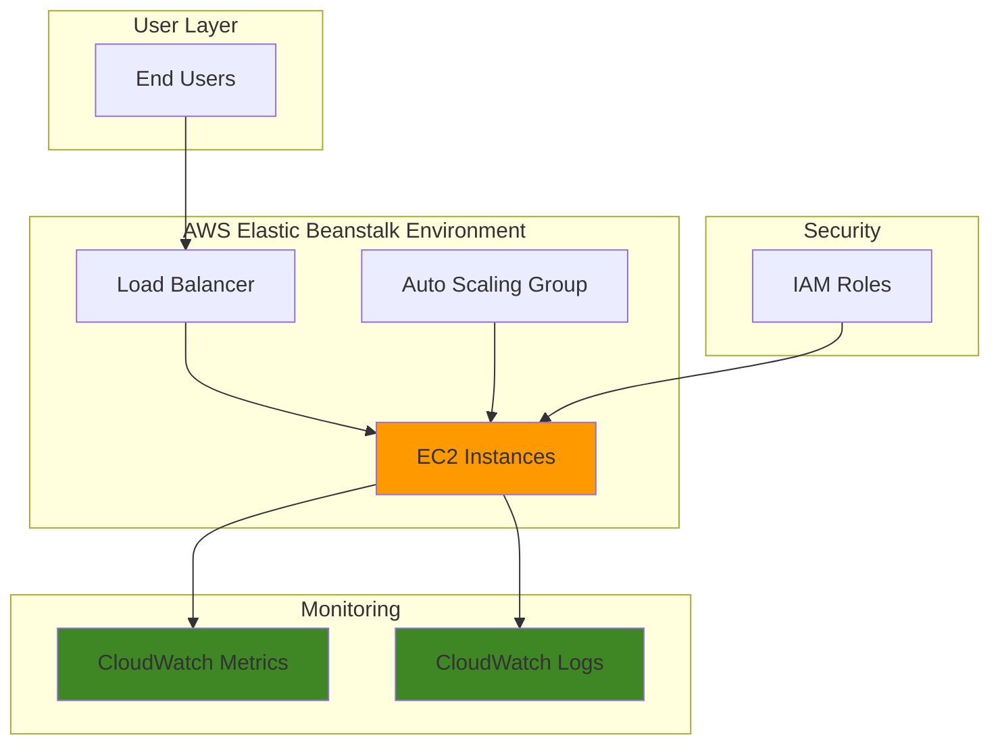

# Simple Web Application Deployment with Elastic Beanstalk and CloudWatch

## Problem

Small development teams often struggle with the complexity of deploying web applications to the cloud, managing underlying infrastructure, and setting up proper monitoring. Manual server configuration and monitoring setup can take days or weeks, delaying product launches and creating maintenance overhead that diverts resources from core development activities.

## Solution

AWS Elastic Beanstalk provides a managed platform service that automatically handles infrastructure provisioning, load balancing, and health monitoring for web applications. Combined with CloudWatch logs and metrics, this solution enables rapid deployment of web applications with comprehensive monitoring capabilities, allowing developers to focus on application code rather than infrastructure management.

## Architecture Diagram



## Prerequisites

1. AWS account with Elastic Beanstalk, CloudWatch, and IAM permissions
2. AWS CLI installed and configured (or AWS CloudShell)
3. Basic knowledge of web applications and command-line interfaces
4. Text editor or IDE for creating application files
5. Estimated cost: $0.02-$0.10 per hour for t3.micro instances during testing

> **Note**: This recipe uses AWS Free Tier eligible resources where possible. Monitor usage to stay within free tier limits.

## Preparation

```bash
# Set environment variables
export AWS_REGION=$(aws configure get region)
export AWS_ACCOUNT_ID=$(aws sts get-caller-identity \
    --query Account --output text)

# Generate unique identifiers for resources
RANDOM_SUFFIX=$(aws secretsmanager get-random-password \
    --exclude-punctuation --exclude-uppercase \
    --password-length 6 --require-each-included-type \
    --output text --query RandomPassword)

export APP_NAME="simple-web-app-${RANDOM_SUFFIX}"
export ENV_NAME="simple-web-env-${RANDOM_SUFFIX}"

# Create application directory
mkdir -p ~/eb-sample-app
cd ~/eb-sample-app

echo "✅ AWS environment configured with region: ${AWS_REGION}"
echo "✅ Application name: ${APP_NAME}"
echo "✅ Environment name: ${ENV_NAME}"
```

## Steps

1. **Create Simple Web Application Files**:

   Elastic Beanstalk supports multiple programming languages and platforms. For this beginner-friendly recipe, we'll create a simple Python Flask application that demonstrates basic web functionality while being easy to understand and modify.

   ```bash
   # Create main application file
   cat > application.py << 'EOF'
import flask
import logging
from datetime import datetime

# Create Flask application instance
application = flask.Flask(__name__)

# Configure logging for CloudWatch
logging.basicConfig(level=logging.INFO)
logger = logging.getLogger(__name__)

@application.route('/')
def hello():
    logger.info("Home page accessed")
    return flask.render_template('index.html')

@application.route('/health')
def health():
    logger.info("Health check accessed")
    return {'status': 'healthy', 'timestamp': datetime.now().isoformat()}

@application.route('/api/info')
def info():
    logger.info("Info API accessed")
    return {
        'application': 'Simple Web App',
        'version': '1.0',
        'environment': 'production'
    }

if __name__ == '__main__':
    application.run(debug=True)
EOF

   # Create requirements file for Python dependencies
   cat > requirements.txt << 'EOF'
Flask==3.0.3
Werkzeug==3.0.3
EOF

   # Create templates directory and HTML template
   mkdir -p templates
   cat > templates/index.html << 'EOF'
<!DOCTYPE html>
<html>
<head>
    <title>Simple Web App</title>
    <style>
        body { font-family: Arial, sans-serif; margin: 40px; }
        .container { max-width: 600px; margin: 0 auto; }
        .status { background: #e8f5e8; padding: 20px; border-radius: 5px; }
    </style>
</head>
<body>
    <div class="container">
        <h1>Welcome to Simple Web App</h1>
        <div class="status">
            <h3>Application Status: Running</h3>
            <p>This application is deployed on AWS Elastic Beanstalk with CloudWatch monitoring enabled.</p>
            <ul>
                <li><a href="/health">Health Check</a></li>
                <li><a href="/api/info">Application Info</a></li>
            </ul>
        </div>
    </div>
</body>
</html>
EOF
   
   echo "✅ Application files created successfully"
   ```

   The Flask application includes structured logging that will automatically integrate with CloudWatch Logs, health check endpoints for monitoring, and a simple web interface to verify deployment success.

2. **Create Elastic Beanstalk Application**:

   Elastic Beanstalk applications serve as containers for multiple environments (development, staging, production). Creating the application establishes the foundation for deploying and managing your web application across different stages of the development lifecycle.

   ```bash
   # Create Elastic Beanstalk application
   aws elasticbeanstalk create-application \
       --application-name ${APP_NAME} \
       --description "Simple web application for learning deployment"
   
   # Wait for application creation
   aws elasticbeanstalk describe-applications \
       --application-names ${APP_NAME} \
       --query 'Applications[0].ApplicationName' \
       --output text
   
   echo "✅ Elastic Beanstalk application '${APP_NAME}' created"
   ```

   The application is now registered in Elastic Beanstalk and ready to host environments. This separation allows you to manage multiple environments for the same application with different configurations and monitoring settings.

3. **Package Application for Deployment**:

   Elastic Beanstalk requires applications to be packaged as source bundles in specific formats. The ZIP file must contain all application code and configuration files at the root level for proper deployment and execution.

   ```bash
   # Create application source bundle
   zip -r ${APP_NAME}-source.zip . -x "*.git*" "__pycache__/*" "*.pyc"
   
   # Upload source bundle to S3 for Elastic Beanstalk
   aws s3 mb s3://eb-source-${RANDOM_SUFFIX} --region ${AWS_REGION}
   
   aws s3 cp ${APP_NAME}-source.zip \
       s3://eb-source-${RANDOM_SUFFIX}/${APP_NAME}-source.zip
   
   # Create application version
   aws elasticbeanstalk create-application-version \
       --application-name ${APP_NAME} \
       --version-label "v1-${RANDOM_SUFFIX}" \
       --source-bundle S3Bucket="eb-source-${RANDOM_SUFFIX}",S3Key="${APP_NAME}-source.zip" \
       --description "Initial deployment version"
   
   echo "✅ Application packaged and uploaded as version v1-${RANDOM_SUFFIX}"
   ```

   The source bundle is now stored in S3 and registered as an application version, ready for deployment to Elastic Beanstalk environments with full version tracking capabilities.

4. **Configure CloudWatch Integration Settings**:

   Enhanced monitoring and logging configuration ensures comprehensive observability for your application. This step creates the foundation for monitoring application performance, errors, and usage patterns through CloudWatch services.

   ```bash
   # Create configuration for CloudWatch Logs integration
   mkdir -p .ebextensions
   cat > .ebextensions/cloudwatch-logs.config << 'EOF'
option_settings:
  aws:elasticbeanstalk:cloudwatch:logs:
    StreamLogs: true
    DeleteOnTerminate: false
    RetentionInDays: 7
  aws:elasticbeanstalk:cloudwatch:logs:health:
    HealthStreamingEnabled: true
    DeleteOnTerminate: false
    RetentionInDays: 7
  aws:elasticbeanstalk:healthreporting:system:
    SystemType: enhanced
    EnhancedHealthAuthEnabled: true
EOF
   
   echo "✅ CloudWatch integration configuration created"
   ```

   This configuration enables automatic log streaming to CloudWatch, health monitoring, and enhanced health reporting that provides detailed application and infrastructure metrics for comprehensive monitoring.

5. **Create and Deploy Elastic Beanstalk Environment**:

   The environment represents the actual running infrastructure that hosts your application. Elastic Beanstalk automatically provisions EC2 instances, load balancers, and auto-scaling groups while configuring CloudWatch monitoring integration.

   ```bash
   # Create Elastic Beanstalk environment with CloudWatch enabled
   aws elasticbeanstalk create-environment \
       --application-name ${APP_NAME} \
       --environment-name ${ENV_NAME} \
       --version-label "v1-${RANDOM_SUFFIX}" \
       --solution-stack-name "64bit Amazon Linux 2023 v4.6.1 running Python 3.11" \
       --tier Name=WebServer,Type=Standard \
       --option-settings \
           Namespace=aws:autoscaling:launchconfiguration,OptionName=InstanceType,Value=t3.micro \
           Namespace=aws:elasticbeanstalk:cloudwatch:logs,OptionName=StreamLogs,Value=true \
           Namespace=aws:elasticbeanstalk:healthreporting:system,OptionName=SystemType,Value=enhanced
   
   echo "✅ Environment creation started - this may take 5-10 minutes"
   
   # Wait for environment to be ready
   aws elasticbeanstalk wait environment-ready \
       --application-name ${APP_NAME} \
       --environment-names ${ENV_NAME}
   
   echo "✅ Environment '${ENV_NAME}' is ready and running"
   ```

   The environment is now running with your application deployed, automatically configured with load balancing, auto-scaling, and CloudWatch integration for comprehensive monitoring and logging.

6. **Retrieve Application URL and Configure Monitoring**:

   After successful deployment, Elastic Beanstalk provides a unique URL for accessing your application. This step also retrieves important identifiers needed for setting up additional CloudWatch monitoring and alarms.

   ```bash
   # Get environment URL
   export APP_URL=$(aws elasticbeanstalk describe-environments \
       --application-name ${APP_NAME} \
       --environment-names ${ENV_NAME} \
       --query 'Environments[0].CNAME' \
       --output text)
   
   # Get environment ID for CloudWatch setup
   export ENV_ID=$(aws elasticbeanstalk describe-environments \
       --application-name ${APP_NAME} \
       --environment-names ${ENV_NAME} \
       --query 'Environments[0].EnvironmentId' \
       --output text)
   
   echo "✅ Application URL: http://${APP_URL}"
   echo "✅ Environment ID: ${ENV_ID}"
   ```

   Your application is now accessible via the internet and ready for monitoring setup. The environment automatically publishes basic metrics to CloudWatch for immediate visibility into application health and performance.

7. **Create CloudWatch Alarms for Application Monitoring**:

   CloudWatch alarms provide proactive monitoring by automatically detecting and alerting on application issues. These alarms monitor critical metrics like environment health, application errors, and response times to ensure reliable application operation.

   ```bash
   # Create alarm for environment health
   aws cloudwatch put-metric-alarm \
       --alarm-name "${ENV_NAME}-health-alarm" \
       --alarm-description "Monitor Elastic Beanstalk environment health" \
       --metric-name EnvironmentHealth \
       --namespace AWS/ElasticBeanstalk \
       --statistic Average \
       --period 300 \
       --threshold 15 \
       --comparison-operator GreaterThanThreshold \
       --evaluation-periods 2 \
       --dimensions Name=EnvironmentName,Value=${ENV_NAME}
   
   # Create alarm for application errors (4xx responses)
   aws cloudwatch put-metric-alarm \
       --alarm-name "${ENV_NAME}-4xx-errors" \
       --alarm-description "Monitor 4xx application errors" \
       --metric-name ApplicationRequests4xx \
       --namespace AWS/ElasticBeanstalk \
       --statistic Sum \
       --period 300 \
       --threshold 10 \
       --comparison-operator GreaterThanThreshold \
       --evaluation-periods 1 \
       --dimensions Name=EnvironmentName,Value=${ENV_NAME}
   
   echo "✅ CloudWatch alarms created for environment monitoring"
   ```

   The monitoring system now actively watches your application health and performance, automatically detecting issues and providing visibility into application behavior through CloudWatch dashboards and alarm notifications.

## Validation & Testing

1. **Verify Application Deployment**:

   ```bash
   # Check environment status
   aws elasticbeanstalk describe-environments \
       --application-name ${APP_NAME} \
       --environment-names ${ENV_NAME} \
       --query 'Environments[0].[EnvironmentName,Status,Health]' \
       --output table
   ```

   Expected output: Environment should show "Ready" status and "Ok" health.

2. **Test Application Endpoints**:

   ```bash
   # Test main application page
   curl -s http://${APP_URL} | grep -o "<title>.*</title>"
   
   # Test health endpoint
   curl -s http://${APP_URL}/health | jq .
   
   # Test API endpoint
   curl -s http://${APP_URL}/api/info | jq .
   ```

   Expected output: HTML title, JSON health response, and JSON info response.

3. **Verify CloudWatch Logs Integration**:

   ```bash
   # List CloudWatch log groups for the environment
   aws logs describe-log-groups \
       --log-group-name-prefix "/aws/elasticbeanstalk/${ENV_NAME}" \
       --query 'logGroups[].logGroupName' \
       --output table
   
   # Check recent log entries
   aws logs describe-log-streams \
       --log-group-name "/aws/elasticbeanstalk/${ENV_NAME}/var/log/eb-engine.log" \
       --order-by LastEventTime \
       --descending \
       --max-items 1 \
       --query 'logStreams[0].logStreamName' \
       --output text
   ```

4. **Verify CloudWatch Alarms**:

   ```bash
   # Check alarm status
   aws cloudwatch describe-alarms \
       --alarm-names "${ENV_NAME}-health-alarm" "${ENV_NAME}-4xx-errors" \
       --query 'MetricAlarms[].[AlarmName,StateValue,StateReason]' \
       --output table
   ```

## Cleanup

1. **Terminate Elastic Beanstalk Environment**:

   ```bash
   # Terminate the environment
   aws elasticbeanstalk terminate-environment \
       --environment-name ${ENV_NAME}
   
   # Wait for environment termination
   aws elasticbeanstalk wait environment-terminated \
       --application-name ${APP_NAME} \
       --environment-names ${ENV_NAME}
   
   echo "✅ Environment terminated"
   ```

2. **Delete CloudWatch Alarms**:

   ```bash
   # Delete CloudWatch alarms
   aws cloudwatch delete-alarms \
       --alarm-names "${ENV_NAME}-health-alarm" "${ENV_NAME}-4xx-errors"
   
   echo "✅ CloudWatch alarms deleted"
   ```

3. **Remove Application and Source Files**:

   ```bash
   # Delete Elastic Beanstalk application
   aws elasticbeanstalk delete-application \
       --application-name ${APP_NAME} \
       --terminate-env-by-force
   
   # Delete S3 bucket and source bundle
   aws s3 rm s3://eb-source-${RANDOM_SUFFIX} --recursive
   aws s3 rb s3://eb-source-${RANDOM_SUFFIX}
   
   # Clean up local files
   cd ~
   rm -rf ~/eb-sample-app
   
   echo "✅ All resources cleaned up"
   ```

## Discussion

AWS Elastic Beanstalk simplifies web application deployment by abstracting away infrastructure complexity while maintaining the flexibility and control of underlying AWS services. This managed platform service automatically handles capacity provisioning, load balancing, auto-scaling, and health monitoring, allowing developers to focus on application code rather than infrastructure management. The integration with CloudWatch provides comprehensive monitoring capabilities that are essential for production applications, offering both real-time metrics and historical analysis for performance optimization and troubleshooting.

The solution demonstrates the AWS Well-Architected Framework principles by implementing operational excellence through automated deployment and monitoring, security through managed IAM integration, reliability through auto-scaling and health checks, and cost optimization through efficient resource utilization. Elastic Beanstalk's support for multiple programming languages and deployment strategies makes it an ideal choice for teams transitioning from traditional hosting environments to cloud-native architectures. The platform supports both rolling deployments and blue-green deployments, enabling zero-downtime updates for production applications.

CloudWatch integration provides multi-layered monitoring including application logs, system metrics, and custom metrics that can be used for automated scaling decisions and alerting. The enhanced health reporting system goes beyond basic infrastructure monitoring to provide application-level insights including request latency, error rates, and resource utilization patterns. This comprehensive monitoring approach enables proactive issue detection and resolution, reducing mean time to recovery for application incidents.

The combination of Elastic Beanstalk and CloudWatch represents a cost-effective solution for small to medium-sized applications that require enterprise-grade reliability and monitoring without the complexity of managing underlying infrastructure. For organizations adopting DevOps practices, this approach provides a foundation for implementing continuous integration and continuous deployment pipelines while maintaining operational visibility and control.

> **Tip**: Enable enhanced health monitoring from the start to access detailed application metrics and faster troubleshooting capabilities. The additional cost is minimal compared to the operational benefits.

**Documentation References:**
- [AWS Elastic Beanstalk User Guide](https://docs.aws.amazon.com/elasticbeanstalk/latest/dg/Welcome.html)
- [Using Elastic Beanstalk with Amazon CloudWatch Logs](https://docs.aws.amazon.com/elasticbeanstalk/latest/dg/AWSHowTo.cloudwatchlogs.html)
- [AWS Well-Architected Framework](https://docs.aws.amazon.com/wellarchitected/latest/framework/welcome.html)
- [Enhanced Health Reporting and Monitoring](https://docs.aws.amazon.com/elasticbeanstalk/latest/dg/health-enhanced.html)
- [Elastic Beanstalk Deployment Options](https://docs.aws.amazon.com/elasticbeanstalk/latest/dg/using-features.deploy-existing-version.html)

## Challenge

Extend this solution by implementing these enhancements:

1. **Add Application Performance Monitoring**: Integrate AWS X-Ray distributed tracing to monitor application performance and identify bottlenecks across service calls and database queries.

2. **Implement Blue-Green Deployments**: Configure Elastic Beanstalk for zero-downtime deployments using blue-green deployment strategy with automated rollback capabilities based on CloudWatch metrics.

3. **Create Custom CloudWatch Dashboard**: Build a comprehensive monitoring dashboard that displays application metrics, infrastructure health, cost tracking, and business KPIs in a single view.

4. **Add Database Integration**: Extend the application to use Amazon RDS with connection pooling, implement database health monitoring, and configure automated backup strategies.

5. **Implement Auto-Scaling Policies**: Configure advanced auto-scaling based on custom CloudWatch metrics like application response time and queue depth, rather than just CPU utilization.

## Infrastructure Code

*Infrastructure code will be generated after recipe approval.*