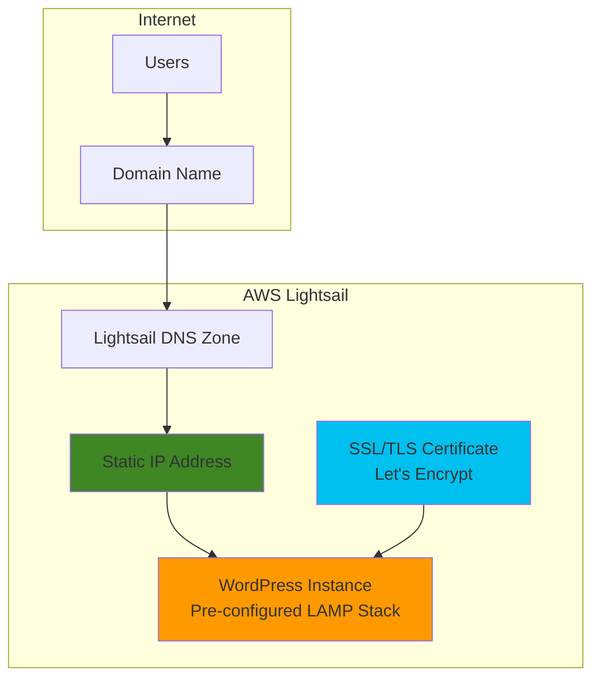

# Simple Website Hosting with Lightsail

## Problem

Small businesses and developers need an affordable, easy-to-manage solution for hosting WordPress websites without the complexity of managing multiple AWS services or handling server administration tasks. Traditional web hosting providers often lack the scalability and integration benefits of cloud infrastructure, while full AWS implementations require significant technical expertise and time investment that many small teams cannot afford.

## Solution

AWS Lightsail provides a simplified virtual private server solution that bundles compute, storage, networking, and management tools into predictable monthly pricing plans. Using the pre-configured WordPress blueprint, you can deploy a fully functional website in minutes with automatic SSL certificate management, static IP allocation, and integrated domain management, all while maintaining the scalability and reliability of AWS infrastructure.

## Architecture Diagram



## Prerequisites

1. AWS account with Lightsail access permissions
2. AWS CLI installed and configured (or use AWS CloudShell)
3. Basic understanding of WordPress administration
4. Domain name (optional - can use public IP initially)
5. Estimated cost: $5-12 USD/month for basic WordPress hosting (3 months free with AWS Free Tier)

> **Note**: Lightsail includes a simplified pricing model with compute, storage, and data transfer bundled together, making it ideal for predictable workloads.

## Preparation

```bash
# Set environment variables for AWS region
export AWS_REGION=$(aws configure get region)
export AWS_DEFAULT_REGION=${AWS_REGION}

# Generate unique identifier for resources
RANDOM_SUFFIX=$(aws secretsmanager get-random-password \
    --exclude-punctuation --exclude-uppercase \
    --password-length 6 --require-each-included-type \
    --output text --query RandomPassword)

# Set Lightsail instance name
export INSTANCE_NAME="wordpress-site-${RANDOM_SUFFIX}"
export STATIC_IP_NAME="wordpress-ip-${RANDOM_SUFFIX}"

echo "✅ Environment configured for Lightsail deployment"
echo "Instance name: ${INSTANCE_NAME}"
echo "Static IP name: ${STATIC_IP_NAME}"
```

## Steps

1. **Create WordPress Lightsail Instance**:

   AWS Lightsail simplifies WordPress deployment by providing pre-configured application blueprints that include a complete LAMP (Linux, Apache, MySQL, PHP) stack with WordPress already installed and optimized. This eliminates the need to manually configure web servers, databases, or application dependencies.

   ```bash
   # Create WordPress instance with smallest plan for demonstration
   aws lightsail create-instances \
       --instance-names "${INSTANCE_NAME}" \
       --availability-zone "${AWS_REGION}a" \
       --blueprint-id "wordpress" \
       --bundle-id "nano_3_0" \
       --tags key=Purpose,value=WebsiteHosting \
              key=Environment,value=Production
   
   echo "✅ WordPress instance ${INSTANCE_NAME} creation initiated"
   ```

   The instance is now being provisioned with the latest WordPress version, PHP 8, MySQL/MariaDB, and Apache web server pre-configured with security best practices and performance optimizations.

2. **Wait for Instance to Become Available**:

   ```bash
   # Wait for instance to be running (typically 2-3 minutes)
   echo "Waiting for instance to become available..."
   
   while true; do
       INSTANCE_STATE=$(aws lightsail get-instance \
           --instance-name "${INSTANCE_NAME}" \
           --query 'instance.state.name' \
           --output text)
       
       if [ "$INSTANCE_STATE" = "running" ]; then
           echo "✅ Instance is now running"
           break
       else
           echo "Instance state: $INSTANCE_STATE - waiting..."
           sleep 10
       fi
   done
   ```

3. **Create and Attach Static IP Address**:

   A static IP address ensures your website remains accessible even if the underlying instance is stopped and restarted. This is essential for production websites and enables reliable DNS configuration for custom domains.

   ```bash
   # Allocate static IP address
   aws lightsail allocate-static-ip \
       --static-ip-name "${STATIC_IP_NAME}"
   
   # Attach static IP to the WordPress instance
   aws lightsail attach-static-ip \
       --static-ip-name "${STATIC_IP_NAME}" \
       --instance-name "${INSTANCE_NAME}"
   
   # Get the static IP address
   STATIC_IP=$(aws lightsail get-static-ip \
       --static-ip-name "${STATIC_IP_NAME}" \
       --query 'staticIp.ipAddress' \
       --output text)
   
   echo "✅ Static IP ${STATIC_IP} attached to ${INSTANCE_NAME}"
   ```

   Your WordPress site is now accessible via the static IP address and will maintain this address throughout the instance lifecycle.

4. **Configure Firewall Rules for Web Traffic**:

   ```bash
   # Open HTTP and HTTPS ports for web traffic
   aws lightsail put-instance-public-ports \
       --instance-name "${INSTANCE_NAME}" \
       --port-infos fromPort=80,toPort=80,protocol=TCP,cidrSources=0.0.0.0/0 \
                    fromPort=443,toPort=443,protocol=TCP,cidrSources=0.0.0.0/0 \
                    fromPort=22,toPort=22,protocol=TCP,cidrSources=0.0.0.0/0
   
   echo "✅ Firewall configured for web traffic (HTTP/HTTPS)"
   ```

5. **Retrieve WordPress Admin Credentials**:

   Bitnami WordPress instances store the admin password in a specific file that can be accessed via SSH. The default username is 'user' for WordPress admin access.

   ```bash
   # Get SSH connection details
   echo "Getting WordPress admin password..."
   
   # Note: For Bitnami WordPress, the password is stored in a file
   # You can retrieve it by connecting to the instance via SSH and reading:
   # sudo cat /home/bitnami/bitnami_application_password
   
   echo "✅ WordPress admin credentials information:"
   echo "Access your site at: http://${STATIC_IP}"
   echo "WordPress admin at: http://${STATIC_IP}/wp-admin"
   echo "Username: user"
   echo "Password: Connect via SSH and run: sudo cat /home/bitnami/bitnami_application_password"
   echo ""
   echo "To connect via SSH:"
   echo "ssh -i ~/.ssh/your-key-pair.pem bitnami@${STATIC_IP}"
   ```

6. **Set Up DNS Zone (Optional - for Custom Domain)**:

   If you have a custom domain, Lightsail can manage your DNS records automatically, providing seamless integration between your domain and static IP address.

   ```bash
   # Create DNS zone for your domain (replace with your actual domain)
   # Uncomment and modify the following commands if you have a domain
   
   # export DOMAIN_NAME="yourdomain.com"
   # 
   # aws lightsail create-domain \
   #     --domain-name "${DOMAIN_NAME}"
   # 
   # # Create A record pointing to your static IP
   # aws lightsail create-domain-entry \
   #     --domain-name "${DOMAIN_NAME}" \
   #     --domain-entry name=@,type=A,target="${STATIC_IP}"
   # 
   # # Create CNAME record for www subdomain
   # aws lightsail create-domain-entry \
   #     --domain-name "${DOMAIN_NAME}" \
   #     --domain-entry name=www,type=CNAME,target="${DOMAIN_NAME}"
   
   echo "✅ DNS configuration ready (custom domain setup available)"
   ```

## Validation & Testing

1. Verify instance is running and accessible:

   ```bash
   # Check instance status
   aws lightsail get-instance \
       --instance-name "${INSTANCE_NAME}" \
       --query 'instance.{Name:name,State:state.name,IP:publicIpAddress}'
   
   # Test web server response
   curl -I "http://${STATIC_IP}" | head -n 1
   ```

   Expected output: `HTTP/1.1 200 OK` indicating WordPress is responding.

2. Test WordPress admin access:

   ```bash
   # Test admin login page accessibility
   curl -s "http://${STATIC_IP}/wp-admin" | grep -q "WordPress" && \
       echo "✅ WordPress admin page accessible" || \
       echo "❌ WordPress admin page not accessible"
   ```

3. Verify firewall configuration:

   ```bash
   # Check open ports
   aws lightsail get-instance-port-states \
       --instance-name "${INSTANCE_NAME}" \
       --query 'portStates[?state==`open`].{Port:fromPort,Protocol:protocol}'
   ```

## Cleanup

1. Remove static IP attachment and release it:

   ```bash
   # Detach static IP from instance
   aws lightsail detach-static-ip \
       --static-ip-name "${STATIC_IP_NAME}"
   
   # Release static IP
   aws lightsail release-static-ip \
       --static-ip-name "${STATIC_IP_NAME}"
   
   echo "✅ Static IP released"
   ```

2. Delete the WordPress instance:

   ```bash
   # Delete Lightsail instance
   aws lightsail delete-instance \
       --instance-name "${INSTANCE_NAME}"
   
   echo "✅ WordPress instance deleted"
   ```

3. Clean up DNS zone (if created):

   ```bash
   # Delete DNS zone if created (uncomment if you created one)
   # aws lightsail delete-domain \
   #     --domain-name "${DOMAIN_NAME}"
   
   # Clear environment variables
   unset INSTANCE_NAME STATIC_IP_NAME STATIC_IP AWS_REGION
   
   echo "✅ All resources cleaned up"
   ```

## Discussion

AWS Lightsail represents Amazon's answer to simplified cloud hosting, designed specifically for developers and small businesses who need the power and reliability of AWS infrastructure without the complexity of managing multiple services. The service bundles virtual private servers, SSD storage, data transfer, DNS management, and static IP addresses into predictable monthly pricing plans starting at $5 USD per month. This approach follows AWS Well-Architected Framework principles by providing cost optimization and operational excellence through simplified management interfaces.

The WordPress blueprint included with Lightsail provides a production-ready LAMP stack with the latest WordPress version, PHP 8, MySQL/MariaDB, and Apache web server pre-configured with security hardening and performance optimizations. This eliminates hours of manual server configuration and ensures your website follows current best practices for security and performance. The integration with Let's Encrypt provides automated SSL certificate management, enabling HTTPS encryption with minimal configuration effort through the Lightsail console.

Lightsail's simplified approach to cloud hosting makes it an excellent stepping stone for teams transitioning from traditional shared hosting to cloud infrastructure. Unlike EC2 instances that require separate management of storage, networking, and security groups, Lightsail bundles these components while maintaining the ability to connect with other AWS services as your needs grow. The service includes built-in monitoring, automatic backups, and one-click snapshots, providing enterprise-grade reliability at small business pricing. For more information, see the [AWS Lightsail User Guide](https://docs.aws.amazon.com/lightsail/latest/userguide/what-is-amazon-lightsail.html).

The static IP address functionality ensures consistent access to your website regardless of instance lifecycle events, while the integrated DNS management simplifies domain configuration and enables advanced routing scenarios. For businesses planning growth, Lightsail instances can seamlessly connect to AWS services like RDS databases, CloudFront CDN, and S3 storage, providing a clear migration path to more complex AWS architectures as requirements evolve.

> **Tip**: Enable automatic backups through the Lightsail console to protect your WordPress content and configuration. Snapshots can be created manually or scheduled automatically for consistent data protection.

## Challenge

Extend this solution by implementing these enhancements:

1. **SSL Certificate Setup**: Configure Let's Encrypt SSL certificates for HTTPS encryption using the Lightsail console's website setup wizard with a custom domain name.

2. **CDN Integration**: Create a Lightsail CDN distribution to cache and accelerate content delivery globally, improving website performance for international visitors.

3. **Database Separation**: Migrate to a Lightsail managed database to separate your WordPress database from the web server, improving security and enabling independent scaling.

4. **Backup Automation**: Implement automated snapshot scheduling and cross-region backup replication for disaster recovery planning.

5. **Load Balancer Configuration**: Add a Lightsail load balancer with multiple WordPress instances for high availability and traffic distribution in production environments.

## Infrastructure Code

### Available Infrastructure as Code:

- [Infrastructure Code Overview](code/README.md) - Detailed description of all infrastructure components
- [AWS CDK (Python)](code/cdk-python/) - AWS CDK Python implementation
- [AWS CDK (TypeScript)](code/cdk-typescript/) - AWS CDK TypeScript implementation
- [CloudFormation](code/cloudformation.yaml) - AWS CloudFormation template
- [Bash CLI Scripts](code/scripts/) - Example bash scripts using AWS CLI commands to deploy infrastructure
- [Terraform](code/terraform/) - Terraform configuration files