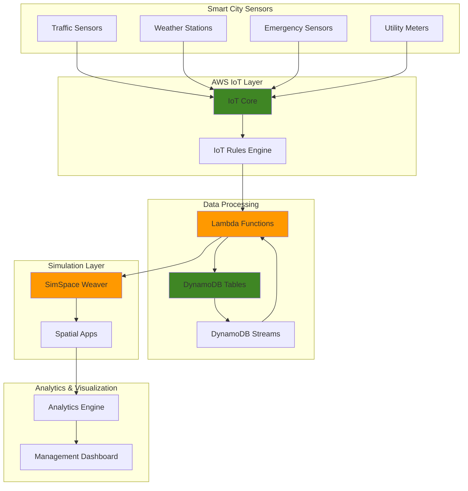

# Simulating Cities with SimSpace Weaver and IoT

## Problem

Urban planners face critical challenges in making data-driven decisions for traffic management, infrastructure optimization, and emergency response due to the complexity of interconnected city systems. Traditional planning methods rely on historical data and limited simulations, making it difficult to predict the impact of infrastructure changes or optimize resource allocation in real-time. Cities lose millions annually due to traffic congestion, inefficient resource deployment, and delayed emergency responses that could be prevented with better predictive modeling.

## Solution

Create a comprehensive smart city digital twin that combines real-time IoT sensor data ingestion through AWS IoT Core with large-scale spatial simulations using AWS SimSpace Weaver. The solution processes sensor data in real-time using Lambda functions, stores historical and real-time data in DynamoDB, and runs complex urban simulations to provide actionable insights for traffic optimization, emergency response planning, and infrastructure decision-making.

## Architecture Diagram



## Prerequisites

1. AWS account with appropriate permissions for IoT Core, SimSpace Weaver, DynamoDB, and Lambda
2. AWS CLI installed and configured (version 2.0 or later)
3. Basic understanding of IoT protocols, spatial computing concepts, and urban planning principles
4. Python 3.9+ for Lambda development and simulation apps
5. Estimated cost: $50-100 for initial setup and testing (varies by simulation complexity and data volume)

> **Warning**: AWS SimSpace Weaver will reach end of support on May 20, 2026. Consider alternative simulation platforms for long-term production deployments.

## Preparation

```bash
# Set environment variables
export AWS_REGION=$(aws configure get region)
export AWS_ACCOUNT_ID=$(aws sts get-caller-identity \
    --query Account --output text)

# Generate unique identifiers for resources
RANDOM_SUFFIX=$(aws secretsmanager get-random-password \
    --exclude-punctuation --exclude-uppercase \
    --password-length 6 --require-each-included-type \
    --output text --query RandomPassword)

# Set project variables
export PROJECT_NAME="smartcity-${RANDOM_SUFFIX}"
export IOT_THING_GROUP_NAME="${PROJECT_NAME}-sensors"
export DYNAMODB_TABLE_NAME="${PROJECT_NAME}-sensor-data"
export LAMBDA_FUNCTION_NAME="${PROJECT_NAME}-processor"
export SIMSPACE_PROJECT_NAME="${PROJECT_NAME}-simulation"

# Create IAM role for Lambda execution
aws iam create-role \
    --role-name ${PROJECT_NAME}-lambda-role \
    --assume-role-policy-document '{
        "Version": "2012-10-17",
        "Statement": [
            {
                "Effect": "Allow",
                "Principal": {
                    "Service": "lambda.amazonaws.com"
                },
                "Action": "sts:AssumeRole"
            }
        ]
    }'

# Attach managed policies for Lambda execution
aws iam attach-role-policy \
    --role-name ${PROJECT_NAME}-lambda-role \
    --policy-arn arn:aws:iam::aws:policy/service-role/AWSLambdaBasicExecutionRole

aws iam attach-role-policy \
    --role-name ${PROJECT_NAME}-lambda-role \
    --policy-arn arn:aws:iam::aws:policy/AWSLambdaDynamoDBExecutionRole

echo "✅ AWS environment configured for smart city digital twin project"
```

## Steps

1. **Create DynamoDB Table for Sensor Data Storage**:

   DynamoDB provides the scalable NoSQL foundation for storing high-volume IoT sensor data with single-digit millisecond latency. The table design supports time-series data patterns essential for smart city analytics, with partition keys optimized for sensor type and sort keys for timestamp-based queries. DynamoDB Streams enable real-time data processing triggers for simulation updates.

   ```bash
   # Create DynamoDB table with streams enabled
   aws dynamodb create-table \
       --table-name ${DYNAMODB_TABLE_NAME} \
       --attribute-definitions \
           AttributeName=sensor_id,AttributeType=S \
           AttributeName=timestamp,AttributeType=S \
       --key-schema \
           AttributeName=sensor_id,KeyType=HASH \
           AttributeName=timestamp,KeyType=RANGE \
       --provisioned-throughput \
           ReadCapacityUnits=10,WriteCapacityUnits=10 \
       --stream-specification StreamEnabled=true,StreamViewType=NEW_AND_OLD_IMAGES
   
   # Wait for table creation to complete
   aws dynamodb wait table-exists \
       --table-name ${DYNAMODB_TABLE_NAME}
   
   # Store table ARN for later use
   export TABLE_ARN=$(aws dynamodb describe-table \
       --table-name ${DYNAMODB_TABLE_NAME} \
       --query 'Table.TableArn' --output text)
   
   echo "✅ DynamoDB table created with streams enabled: ${DYNAMODB_TABLE_NAME}"
   ```

   The table now provides the scalable storage foundation for IoT sensor data with real-time stream processing capabilities. This configuration supports the high-throughput requirements of smart city sensor networks while maintaining cost-effective provisioned capacity.

2. **Configure IoT Core Thing Group and Policies**:

   AWS IoT Core manages device connectivity, authentication, and message routing for smart city sensor networks. Thing groups enable bulk device management and policy application across sensor categories, while IoT policies define granular permissions for device operations. This approach follows AWS IoT security best practices with certificate-based authentication and least-privilege access controls.

   ```bash
   # Create IoT Thing Group for smart city sensors
   aws iot create-thing-group \
       --thing-group-name ${IOT_THING_GROUP_NAME} \
       --thing-group-properties \
           'thingGroupDescription="Smart city sensor fleet for digital twin"'
   
   # Create IoT policy for sensor devices
   aws iot create-policy \
       --policy-name ${PROJECT_NAME}-sensor-policy \
       --policy-document '{
           "Version": "2012-10-17",
           "Statement": [
               {
                   "Effect": "Allow",
                   "Action": ["iot:Connect"],
                   "Resource": "arn:aws:iot:'${AWS_REGION}':'${AWS_ACCOUNT_ID}':client/${aws:username}"
               },
               {
                   "Effect": "Allow",
                   "Action": ["iot:Publish"],
                   "Resource": "arn:aws:iot:'${AWS_REGION}':'${AWS_ACCOUNT_ID}':topic/smartcity/sensors/*"
               }
           ]
       }'
   
   # Create sample IoT thing for testing
   aws iot create-thing \
       --thing-name ${PROJECT_NAME}-traffic-sensor-001 \
       --thing-type-name traffic-sensor
   
   # Add thing to group
   aws iot add-thing-to-thing-group \
       --thing-group-name ${IOT_THING_GROUP_NAME} \
       --thing-name ${PROJECT_NAME}-traffic-sensor-001
   
   echo "✅ IoT Core configured with thing group: ${IOT_THING_GROUP_NAME}"
   ```

   IoT Core is now configured to securely manage smart city sensor connectivity with organized device grouping and appropriate security policies. This foundation supports scalable device onboarding and centralized fleet management.

3. **Deploy Lambda Function for Data Processing**:

   Lambda provides serverless compute for processing IoT sensor data with automatic scaling based on message volume. The function transforms raw sensor data, performs data validation, and stores structured records in DynamoDB. This event-driven architecture ensures efficient processing of high-volume sensor streams while maintaining cost-effectiveness through pay-per-invocation pricing.

   ```bash
   # Create Lambda function deployment package
   cat > lambda_function.py << 'EOF'
import json
import boto3
import uuid
from datetime import datetime
import logging

logger = logging.getLogger()
logger.setLevel(logging.INFO)

dynamodb = boto3.resource('dynamodb')
table = dynamodb.Table('REPLACE_TABLE_NAME')

def lambda_handler(event, context):
    """Process IoT sensor data and store in DynamoDB"""
    try:
        # Parse IoT message
        for record in event.get('Records', []):
            # Extract sensor data from IoT message
            message = json.loads(record['body']) if 'body' in record else record
            
            sensor_data = {
                'sensor_id': message.get('sensor_id', 'unknown'),
                'timestamp': datetime.utcnow().isoformat(),
                'sensor_type': message.get('sensor_type', 'generic'),
                'location': message.get('location', {}),
                'data': message.get('data', {}),
                'metadata': {
                    'processed_at': datetime.utcnow().isoformat(),
                    'processor_id': context.function_name
                }
            }
            
            # Store in DynamoDB
            table.put_item(Item=sensor_data)
            
            logger.info(f"Processed sensor data: {sensor_data['sensor_id']}")
            
        return {
            'statusCode': 200,
            'body': json.dumps('Successfully processed sensor data')
        }
        
    except Exception as e:
        logger.error(f"Error processing sensor data: {str(e)}")
        raise
EOF
   
   # Replace table name in function code
   sed -i.bak "s/REPLACE_TABLE_NAME/${DYNAMODB_TABLE_NAME}/g" lambda_function.py
   
   # Create deployment package
   zip -r lambda_function.zip lambda_function.py
   
   # Create Lambda function
   aws lambda create-function \
       --function-name ${LAMBDA_FUNCTION_NAME} \
       --runtime python3.9 \
       --role arn:aws:iam::${AWS_ACCOUNT_ID}:role/${PROJECT_NAME}-lambda-role \
       --handler lambda_function.lambda_handler \
       --zip-file fileb://lambda_function.zip \
       --timeout 60 \
       --memory-size 256 \
       --environment Variables="{TABLE_NAME=${DYNAMODB_TABLE_NAME}}"
   
   # Grant DynamoDB permissions to Lambda
   aws iam attach-role-policy \
       --role-name ${PROJECT_NAME}-lambda-role \
       --policy-arn arn:aws:iam::aws:policy/AmazonDynamoDBFullAccess
   
   echo "✅ Lambda function deployed: ${LAMBDA_FUNCTION_NAME}"
   ```

   The Lambda function is now ready to process IoT sensor data with built-in error handling and logging. This serverless architecture automatically scales to handle varying sensor data volumes while maintaining cost efficiency.

4. **Create IoT Rule for Message Routing**:

   IoT Rules Engine provides serverless message routing and transformation for IoT device data. Rules enable real-time data processing by triggering Lambda functions based on message patterns, supporting complex SQL-like queries for data filtering and transformation. This approach eliminates the need for dedicated message broker infrastructure while providing flexible routing capabilities.

   ```bash
   # Create IoT rule for sensor data processing
   aws iot create-topic-rule \
       --rule-name ${PROJECT_NAME//-/_}_sensor_processing \
       --topic-rule-payload '{
           "sql": "SELECT * FROM '\''smartcity/sensors/+/data'\''",
           "description": "Route smart city sensor data to processing Lambda",
           "actions": [
               {
                   "lambda": {
                       "functionArn": "arn:aws:lambda:'${AWS_REGION}':'${AWS_ACCOUNT_ID}':function:'${LAMBDA_FUNCTION_NAME}'"
                   }
               }
           ]
       }'
   
   # Grant IoT permission to invoke Lambda
   aws lambda add-permission \
       --function-name ${LAMBDA_FUNCTION_NAME} \
       --statement-id iot-invoke-permission \
       --action lambda:InvokeFunction \
       --principal iot.amazonaws.com \
       --source-arn arn:aws:iot:${AWS_REGION}:${AWS_ACCOUNT_ID}:rule/${PROJECT_NAME//-/_}_sensor_processing
   
   echo "✅ IoT rule created for sensor data routing"
   ```

   IoT Rules Engine now automatically routes sensor messages to the Lambda function for processing, enabling real-time data ingestion and transformation without managing message queues or brokers.

5. **Configure DynamoDB Streams for Real-time Processing**:

   DynamoDB Streams capture real-time changes to the sensor data table, enabling event-driven processing for simulation updates. Stream processing provides the data pipeline for feeding real-time sensor updates into the digital twin simulation, ensuring that the virtual city model reflects current conditions. This architecture supports the low-latency requirements of smart city decision-making systems.

   ```bash
   # Get DynamoDB stream ARN
   export STREAM_ARN=$(aws dynamodb describe-table \
       --table-name ${DYNAMODB_TABLE_NAME} \
       --query 'Table.LatestStreamArn' --output text)
   
   # Create stream processing function
   cat > stream_processor.py << 'EOF'
import json
import boto3
import logging
from datetime import datetime

logger = logging.getLogger()
logger.setLevel(logging.INFO)

def lambda_handler(event, context):
    """Process DynamoDB stream events for simulation updates"""
    try:
        for record in event['Records']:
            event_name = record['eventName']
            
            if event_name in ['INSERT', 'MODIFY']:
                # Extract sensor data from stream record
                sensor_data = record['dynamodb']['NewImage']
                
                # Process for simulation input
                simulation_input = {
                    'sensor_id': sensor_data['sensor_id']['S'],
                    'timestamp': sensor_data['timestamp']['S'],
                    'sensor_type': sensor_data['sensor_type']['S'],
                    'event_type': event_name,
                    'data': sensor_data.get('data', {})
                }
                
                logger.info(f"Processed stream event: {simulation_input}")
                
                # TODO: Send to SimSpace Weaver simulation
                # This would typically trigger simulation updates
                
        return {'statusCode': 200, 'body': 'Stream processed successfully'}
        
    except Exception as e:
        logger.error(f"Error processing stream: {str(e)}")
        raise
EOF
   
   # Create stream processing deployment package
   zip -r stream_processor.zip stream_processor.py
   
   # Create stream processing Lambda function
   aws lambda create-function \
       --function-name ${PROJECT_NAME}-stream-processor \
       --runtime python3.9 \
       --role arn:aws:iam::${AWS_ACCOUNT_ID}:role/${PROJECT_NAME}-lambda-role \
       --handler stream_processor.lambda_handler \
       --zip-file fileb://stream_processor.zip \
       --timeout 60 \
       --memory-size 256
   
   # Create event source mapping for DynamoDB stream
   aws lambda create-event-source-mapping \
       --function-name ${PROJECT_NAME}-stream-processor \
       --event-source-arn ${STREAM_ARN} \
       --starting-position LATEST \
       --batch-size 10
   
   echo "✅ DynamoDB stream processing configured"
   ```

   Real-time stream processing is now active, enabling immediate simulation updates when sensor data changes. This event-driven architecture ensures the digital twin maintains current state representation for accurate urban modeling.

6. **Set Up SimSpace Weaver Simulation Project**:

   SimSpace Weaver provides managed infrastructure for large-scale spatial simulations, enabling complex urban modeling scenarios with automatic scaling and partition management. The simulation schema defines spatial domains, partitioning strategies, and application configurations required for smart city digital twin operations. This setup creates the foundation for running distributed simulations across multiple compute instances.

   ```bash
   # Create simulation schema configuration
   cat > simulation_schema.yaml << 'EOF'
name: smart-city-digital-twin
spatial_domains:
  - name: city_grid
    partitioning_strategy: grid_partitioning
    dimensions:
      x: 1000
      y: 1000
      z: 100
    
partitioning_strategies:
  grid_partitioning:
    type: grid
    grid_size: 4
    overlap: 10
    
apps:
  - name: traffic_simulation
    type: spatial
    executable: traffic_sim.py
    instances: 4
    
  - name: utility_monitoring
    type: spatial
    executable: utility_sim.py
    instances: 2
    
  - name: emergency_response
    type: spatial
    executable: emergency_sim.py
    instances: 1
EOF
   
   # Create basic simulation application
   cat > traffic_sim.py << 'EOF'
import json
import time
import random
from datetime import datetime

class TrafficSimulation:
    def __init__(self):
        self.vehicles = []
        self.traffic_lights = []
        self.current_time = datetime.now()
        
    def initialize(self):
        """Initialize simulation state"""
        print("Initializing traffic simulation...")
        # Create initial vehicles and traffic infrastructure
        self.create_initial_state()
        
    def create_initial_state(self):
        """Create initial simulation entities"""
        # Generate traffic lights
        for i in range(10):
            light = {
                'id': f'light_{i}',
                'position': {'x': random.randint(0, 1000), 'y': random.randint(0, 1000)},
                'state': 'green',
                'cycle_time': 30
            }
            self.traffic_lights.append(light)
            
        # Generate vehicles
        for i in range(50):
            vehicle = {
                'id': f'vehicle_{i}',
                'position': {'x': random.randint(0, 1000), 'y': random.randint(0, 1000)},
                'speed': random.randint(20, 60),
                'destination': {'x': random.randint(0, 1000), 'y': random.randint(0, 1000)}
            }
            self.vehicles.append(vehicle)
            
    def update(self, sensor_data):
        """Update simulation based on real sensor data"""
        print(f"Updating simulation with sensor data: {len(sensor_data)} records")
        
        # Process traffic sensor data
        for data in sensor_data:
            if data.get('sensor_type') == 'traffic':
                self.process_traffic_data(data)
                
    def process_traffic_data(self, data):
        """Process traffic sensor data for simulation"""
        location = data.get('location', {})
        traffic_count = data.get('data', {}).get('vehicle_count', 0)
        
        # Update simulation based on real traffic data
        print(f"Processing traffic data: {traffic_count} vehicles at {location}")
        
    def simulate_step(self):
        """Execute one simulation step"""
        # Update vehicle positions
        for vehicle in self.vehicles:
            # Simple movement simulation
            vehicle['position']['x'] += random.randint(-5, 5)
            vehicle['position']['y'] += random.randint(-5, 5)
            
        # Update traffic lights
        for light in self.traffic_lights:
            # Simple traffic light cycling
            if random.random() < 0.1:  # 10% chance to change state
                light['state'] = 'red' if light['state'] == 'green' else 'green'
                
        return {
            'vehicles': len(self.vehicles),
            'traffic_lights': len(self.traffic_lights),
            'timestamp': datetime.now().isoformat()
        }

if __name__ == "__main__":
    sim = TrafficSimulation()
    sim.initialize()
    
    # Run simulation loop
    for step in range(100):
        result = sim.simulate_step()
        print(f"Step {step}: {result}")
        time.sleep(1)
EOF
   
   # Create simulation deployment package
   zip -r simulation_package.zip simulation_schema.yaml traffic_sim.py
   
   # Upload to S3 for SimSpace Weaver
   aws s3 mb s3://${PROJECT_NAME}-simulation-${AWS_REGION}
   aws s3 cp simulation_package.zip s3://${PROJECT_NAME}-simulation-${AWS_REGION}/
   
   echo "✅ SimSpace Weaver simulation project configured"
   ```

   The simulation infrastructure is now ready with a comprehensive schema defining spatial domains, partitioning strategies, and application configurations. This setup enables distributed urban simulations that can process real-time sensor data for digital twin operations.

7. **Create Simulation Management Functions**:

   Simulation management requires orchestration functions to start, stop, and monitor SimSpace Weaver simulations based on real-time conditions and scheduled scenarios. These functions provide the control plane for digital twin operations, enabling automated simulation lifecycle management and integration with city management systems.

   ```bash
   # Create simulation management function
   cat > simulation_manager.py << 'EOF'
import json
import boto3
import logging
from datetime import datetime

logger = logging.getLogger()
logger.setLevel(logging.INFO)

simspace = boto3.client('simspaceweaver')
s3 = boto3.client('s3')

def lambda_handler(event, context):
    """Manage SimSpace Weaver simulations"""
    try:
        action = event.get('action', 'status')
        
        if action == 'start':
            return start_simulation(event, context)
        elif action == 'stop':
            return stop_simulation(event)
        elif action == 'status':
            return get_simulation_status(event)
        else:
            return {'statusCode': 400, 'body': 'Invalid action'}
            
    except Exception as e:
        logger.error(f"Error managing simulation: {str(e)}")
        return {'statusCode': 500, 'body': str(e)}

def start_simulation(event, context):
    """Start a new simulation"""
    simulation_name = event.get('simulation_name', 'smart-city-simulation')
    
    try:
        # Extract AWS account ID from context
        account_id = context.invoked_function_arn.split(':')[4]
        
        response = simspace.start_simulation(
            Name=simulation_name,
            RoleArn=f'arn:aws:iam::{account_id}:role/SimSpaceWeaverRole',
            SchemaS3Location={
                'BucketName': f'{simulation_name}-{context.aws_region}',
                'ObjectKey': 'simulation_schema.yaml'
            }
        )
        
        logger.info(f"Started simulation: {simulation_name}")
        return {
            'statusCode': 200,
            'body': json.dumps({
                'message': 'Simulation started',
                'simulation_name': simulation_name,
                'arn': response.get('Arn')
            })
        }
        
    except Exception as e:
        logger.error(f"Failed to start simulation: {str(e)}")
        return {'statusCode': 500, 'body': str(e)}

def stop_simulation(event):
    """Stop running simulation"""
    simulation_name = event.get('simulation_name')
    
    try:
        simspace.stop_simulation(Simulation=simulation_name)
        
        logger.info(f"Stopped simulation: {simulation_name}")
        return {
            'statusCode': 200,
            'body': json.dumps({
                'message': 'Simulation stopped',
                'simulation_name': simulation_name
            })
        }
        
    except Exception as e:
        logger.error(f"Failed to stop simulation: {str(e)}")
        return {'statusCode': 500, 'body': str(e)}

def get_simulation_status(event):
    """Get current simulation status"""
    try:
        response = simspace.list_simulations()
        
        simulations = []
        for sim in response.get('Simulations', []):
            simulations.append({
                'name': sim.get('Name'),
                'status': sim.get('Status'),
                'created': sim.get('CreationTime').isoformat() if sim.get('CreationTime') else None
            })
            
        return {
            'statusCode': 200,
            'body': json.dumps({
                'simulations': simulations,
                'count': len(simulations)
            })
        }
        
    except Exception as e:
        logger.error(f"Failed to get simulation status: {str(e)}")
        return {'statusCode': 500, 'body': str(e)}
EOF
   
   # Create deployment package
   zip -r simulation_manager.zip simulation_manager.py
   
   # Deploy simulation management function
   aws lambda create-function \
       --function-name ${PROJECT_NAME}-simulation-manager \
       --runtime python3.9 \
       --role arn:aws:iam::${AWS_ACCOUNT_ID}:role/${PROJECT_NAME}-lambda-role \
       --handler simulation_manager.lambda_handler \
       --zip-file fileb://simulation_manager.zip \
       --timeout 300 \
       --memory-size 512
   
   echo "✅ Simulation management functions deployed"
   ```

   Simulation management capabilities are now in place, providing programmatic control over digital twin operations with comprehensive lifecycle management and monitoring functions.

8. **Deploy Data Analytics and Visualization Components**:

   Analytics components process historical sensor data and simulation results to generate actionable insights for urban planning decisions. The system aggregates data across multiple dimensions, performs trend analysis, and creates visualization-ready datasets for city management dashboards. This analytical layer transforms raw sensor data into strategic planning intelligence.

   ```bash
   # Create analytics processing function
   cat > analytics_processor.py << 'EOF'
import json
import boto3
import logging
from datetime import datetime, timedelta
from decimal import Decimal

logger = logging.getLogger()
logger.setLevel(logging.INFO)

dynamodb = boto3.resource('dynamodb')
table = dynamodb.Table('REPLACE_TABLE_NAME')

def lambda_handler(event, context):
    """Process analytics for smart city insights"""
    try:
        analytics_type = event.get('type', 'traffic_summary')
        time_range = event.get('time_range', '24h')
        
        if analytics_type == 'traffic_summary':
            return generate_traffic_summary(time_range)
        elif analytics_type == 'sensor_health':
            return generate_sensor_health_report()
        elif analytics_type == 'simulation_insights':
            return generate_simulation_insights()
        else:
            return {'statusCode': 400, 'body': 'Invalid analytics type'}
            
    except Exception as e:
        logger.error(f"Error processing analytics: {str(e)}")
        return {'statusCode': 500, 'body': str(e)}

def generate_traffic_summary(time_range):
    """Generate traffic analytics summary"""
    try:
        # Calculate time range
        end_time = datetime.now()
        if time_range == '24h':
            start_time = end_time - timedelta(hours=24)
        elif time_range == '7d':
            start_time = end_time - timedelta(days=7)
        else:
            start_time = end_time - timedelta(hours=1)
            
        # Query traffic sensor data
        response = table.scan(
            FilterExpression='#sensor_type = :sensor_type AND #timestamp BETWEEN :start_time AND :end_time',
            ExpressionAttributeNames={
                '#sensor_type': 'sensor_type',
                '#timestamp': 'timestamp'
            },
            ExpressionAttributeValues={
                ':sensor_type': 'traffic',
                ':start_time': start_time.isoformat(),
                ':end_time': end_time.isoformat()
            }
        )
        
        # Process traffic data
        traffic_data = response['Items']
        total_vehicles = sum(item.get('data', {}).get('vehicle_count', 0) for item in traffic_data)
        average_speed = sum(item.get('data', {}).get('average_speed', 0) for item in traffic_data) / len(traffic_data) if traffic_data else 0
        
        # Generate congestion metrics
        congestion_score = calculate_congestion_score(traffic_data)
        
        summary = {
            'time_range': time_range,
            'total_vehicles': total_vehicles,
            'average_speed': float(average_speed),
            'congestion_score': congestion_score,
            'sensor_count': len(set(item['sensor_id'] for item in traffic_data)),
            'generated_at': datetime.now().isoformat()
        }
        
        return {
            'statusCode': 200,
            'body': json.dumps(summary, default=str)
        }
        
    except Exception as e:
        logger.error(f"Failed to generate traffic summary: {str(e)}")
        return {'statusCode': 500, 'body': str(e)}

def calculate_congestion_score(traffic_data):
    """Calculate traffic congestion score"""
    if not traffic_data:
        return 0
        
    # Simple congestion calculation based on speed and volume
    total_score = 0
    for item in traffic_data:
        speed = item.get('data', {}).get('average_speed', 50)
        volume = item.get('data', {}).get('vehicle_count', 0)
        
        # Higher volume and lower speed = higher congestion
        score = (volume / 10) * (60 - speed) / 60
        total_score += max(0, min(100, score))
        
    return total_score / len(traffic_data)

def generate_sensor_health_report():
    """Generate sensor health and connectivity report"""
    try:
        # Query recent sensor data
        end_time = datetime.now()
        start_time = end_time - timedelta(hours=1)
        
        response = table.scan(
            FilterExpression='#timestamp BETWEEN :start_time AND :end_time',
            ExpressionAttributeNames={'#timestamp': 'timestamp'},
            ExpressionAttributeValues={
                ':start_time': start_time.isoformat(),
                ':end_time': end_time.isoformat()
            }
        )
        
        # Analyze sensor health
        sensors = {}
        for item in response['Items']:
            sensor_id = item['sensor_id']
            if sensor_id not in sensors:
                sensors[sensor_id] = {
                    'sensor_id': sensor_id,
                    'sensor_type': item.get('sensor_type', 'unknown'),
                    'message_count': 0,
                    'last_seen': item['timestamp'],
                    'status': 'active'
                }
            sensors[sensor_id]['message_count'] += 1
            
        # Determine sensor health status
        for sensor in sensors.values():
            if sensor['message_count'] < 5:  # Less than 5 messages per hour
                sensor['status'] = 'warning'
            if sensor['message_count'] == 0:
                sensor['status'] = 'offline'
                
        health_report = {
            'total_sensors': len(sensors),
            'active_sensors': sum(1 for s in sensors.values() if s['status'] == 'active'),
            'warning_sensors': sum(1 for s in sensors.values() if s['status'] == 'warning'),
            'offline_sensors': sum(1 for s in sensors.values() if s['status'] == 'offline'),
            'sensors': list(sensors.values()),
            'generated_at': datetime.now().isoformat()
        }
        
        return {
            'statusCode': 200,
            'body': json.dumps(health_report, default=str)
        }
        
    except Exception as e:
        logger.error(f"Failed to generate sensor health report: {str(e)}")
        return {'statusCode': 500, 'body': str(e)}

def generate_simulation_insights():
    """Generate insights from simulation results"""
    try:
        # This would typically query simulation results
        # For now, return mock insights
        insights = {
            'traffic_optimization': {
                'potential_improvement': '15%',
                'recommended_actions': [
                    'Optimize traffic light timing at Main St intersection',
                    'Implement dynamic routing for congested areas',
                    'Add traffic sensors to Highway 101 corridor'
                ]
            },
            'emergency_response': {
                'average_response_time': '4.2 minutes',
                'optimization_opportunities': [
                    'Relocate ambulance station to reduce coverage gaps',
                    'Implement priority traffic routing for emergency vehicles'
                ]
            },
            'infrastructure_utilization': {
                'capacity_utilization': '68%',
                'peak_hours': ['8:00-9:00 AM', '5:00-6:00 PM'],
                'recommendations': [
                    'Implement congestion pricing during peak hours',
                    'Promote alternative transportation options'
                ]
            },
            'generated_at': datetime.now().isoformat()
        }
        
        return {
            'statusCode': 200,
            'body': json.dumps(insights)
        }
        
    except Exception as e:
        logger.error(f"Failed to generate simulation insights: {str(e)}")
        return {'statusCode': 500, 'body': str(e)}
EOF
   
   # Replace table name
   sed -i.bak "s/REPLACE_TABLE_NAME/${DYNAMODB_TABLE_NAME}/g" analytics_processor.py
   
   # Create deployment package
   zip -r analytics_processor.zip analytics_processor.py
   
   # Deploy analytics function
   aws lambda create-function \
       --function-name ${PROJECT_NAME}-analytics \
       --runtime python3.9 \
       --role arn:aws:iam::${AWS_ACCOUNT_ID}:role/${PROJECT_NAME}-lambda-role \
       --handler analytics_processor.lambda_handler \
       --zip-file fileb://analytics_processor.zip \
       --timeout 300 \
       --memory-size 1024
   
   echo "✅ Analytics and visualization components deployed"
   ```

   Analytics processing capabilities are now deployed, providing comprehensive data analysis and insight generation for smart city management. The system can generate traffic summaries, sensor health reports, and simulation-based recommendations for urban planning decisions.

## Validation & Testing

1. **Test IoT Data Ingestion**:

   ```bash
   # Publish test sensor data to IoT Core
   aws iot-data publish \
       --topic "smartcity/sensors/traffic-001/data" \
       --payload '{
           "sensor_id": "traffic-001",
           "sensor_type": "traffic",
           "location": {"lat": 37.7749, "lon": -122.4194},
           "data": {
               "vehicle_count": 15,
               "average_speed": 35,
               "congestion_level": "moderate"
           },
           "timestamp": "'$(date -u +%Y-%m-%dT%H:%M:%SZ)'"
       }'
   
   # Verify data was processed and stored
   aws dynamodb scan --table-name ${DYNAMODB_TABLE_NAME} --limit 5
   ```

   Expected output: DynamoDB scan should return processed sensor data with timestamps and metadata.

2. **Test Analytics Processing**:

   ```bash
   # Generate traffic analytics report
   aws lambda invoke \
       --function-name ${PROJECT_NAME}-analytics \
       --payload '{"type": "traffic_summary", "time_range": "24h"}' \
       --output text analytics_output.json
   
   # View analytics results
   cat analytics_output.json
   ```

   Expected output: JSON report with traffic metrics, congestion scores, and sensor statistics.

3. **Test Simulation Management**:

   ```bash
   # Check simulation status
   aws lambda invoke \
       --function-name ${PROJECT_NAME}-simulation-manager \
       --payload '{"action": "status"}' \
       --output text simulation_status.json
   
   # View simulation results
   cat simulation_status.json
   ```

   Expected output: List of running simulations with their status and metadata.

4. **Verify Data Flow Integration**:

   ```bash
   # Check Lambda function logs
   aws logs describe-log-groups \
       --log-group-name-prefix "/aws/lambda/${PROJECT_NAME}"
   
   # View recent processing logs
   aws logs describe-log-streams \
       --log-group-name "/aws/lambda/${LAMBDA_FUNCTION_NAME}" \
       --order-by LastEventTime --descending
   ```

   Expected output: Log streams showing successful message processing and data storage operations.

## Cleanup

1. **Remove Lambda Functions**:

   ```bash
   # Delete Lambda functions
   aws lambda delete-function \
       --function-name ${LAMBDA_FUNCTION_NAME}
   
   aws lambda delete-function \
       --function-name ${PROJECT_NAME}-stream-processor
   
   aws lambda delete-function \
       --function-name ${PROJECT_NAME}-simulation-manager
   
   aws lambda delete-function \
       --function-name ${PROJECT_NAME}-analytics
   
   echo "✅ Lambda functions deleted"
   ```

2. **Remove IoT Resources**:

   ```bash
   # Delete IoT rule
   aws iot delete-topic-rule \
       --rule-name ${PROJECT_NAME//-/_}_sensor_processing
   
   # Remove thing from group and delete
   aws iot remove-thing-from-thing-group \
       --thing-group-name ${IOT_THING_GROUP_NAME} \
       --thing-name ${PROJECT_NAME}-traffic-sensor-001
   
   aws iot delete-thing \
       --thing-name ${PROJECT_NAME}-traffic-sensor-001
   
   # Delete thing group and policy
   aws iot delete-thing-group \
       --thing-group-name ${IOT_THING_GROUP_NAME}
   
   aws iot delete-policy \
       --policy-name ${PROJECT_NAME}-sensor-policy
   
   echo "✅ IoT resources deleted"
   ```

3. **Remove DynamoDB Table**:

   ```bash
   # Delete DynamoDB table
   aws dynamodb delete-table \
       --table-name ${DYNAMODB_TABLE_NAME}
   
   # Wait for deletion
   aws dynamodb wait table-not-exists \
       --table-name ${DYNAMODB_TABLE_NAME}
   
   echo "✅ DynamoDB table deleted"
   ```

4. **Remove S3 Resources and IAM Roles**:

   ```bash
   # Delete S3 bucket contents and bucket
   aws s3 rm s3://${PROJECT_NAME}-simulation-${AWS_REGION} --recursive
   aws s3 rb s3://${PROJECT_NAME}-simulation-${AWS_REGION}
   
   # Detach policies and delete IAM role
   aws iam detach-role-policy \
       --role-name ${PROJECT_NAME}-lambda-role \
       --policy-arn arn:aws:iam::aws:policy/service-role/AWSLambdaBasicExecutionRole
   
   aws iam detach-role-policy \
       --role-name ${PROJECT_NAME}-lambda-role \
       --policy-arn arn:aws:iam::aws:policy/AWSLambdaDynamoDBExecutionRole
   
   aws iam detach-role-policy \
       --role-name ${PROJECT_NAME}-lambda-role \
       --policy-arn arn:aws:iam::aws:policy/AmazonDynamoDBFullAccess
   
   aws iam delete-role \
       --role-name ${PROJECT_NAME}-lambda-role
   
   # Clean up local files
   rm -f lambda_function.py lambda_function.py.bak lambda_function.zip
   rm -f stream_processor.py stream_processor.zip
   rm -f simulation_manager.py simulation_manager.zip
   rm -f analytics_processor.py analytics_processor.py.bak analytics_processor.zip
   rm -f simulation_schema.yaml traffic_sim.py simulation_package.zip
   rm -f analytics_output.json simulation_status.json
   
   echo "✅ All resources cleaned up"
   ```

## Discussion

This smart city digital twin implementation demonstrates the power of combining real-time IoT data ingestion with large-scale spatial simulation capabilities. The architecture follows AWS Well-Architected Framework principles by implementing operational excellence through automated resource management, security through IAM roles and IoT device certificates, reliability through managed services and error handling, performance efficiency through serverless compute and DynamoDB scaling, and cost optimization through pay-per-use pricing models.

The solution addresses critical urban planning challenges by providing real-time visibility into city operations and predictive modeling capabilities for infrastructure decisions. IoT Core handles the massive scale of sensor connectivity with built-in security and device management features, while DynamoDB provides the high-performance data storage required for time-series sensor data. Lambda functions ensure cost-effective data processing with automatic scaling based on sensor data volume.

SimSpace Weaver's managed simulation infrastructure eliminates the complexity of distributed computing for spatial simulations, though organizations should plan for the service's discontinuation in 2026. The event-driven architecture using DynamoDB Streams ensures that simulation models stay synchronized with real-world conditions, enabling accurate predictive analytics for traffic optimization, emergency response planning, and infrastructure utilization analysis.

For production deployments, consider implementing enhanced security measures such as AWS IoT Device Defender for fleet security monitoring, Amazon CloudWatch for comprehensive observability, and AWS X-Ray for distributed tracing across the data processing pipeline. The architecture can be extended with additional AWS services like Amazon QuickSight for business intelligence dashboards and Amazon SageMaker for advanced predictive analytics using machine learning models.

> **Note**: This implementation follows AWS IoT security best practices with certificate-based device authentication and granular IAM permissions. For production use, implement additional security measures such as device certificates rotation and network isolation using VPC endpoints.

**Key Documentation References:**
- [AWS SimSpace Weaver Developer Guide](https://docs.aws.amazon.com/simspaceweaver/latest/userguide/what-is-simspaceweaver.html)
- [AWS IoT Core Developer Guide](https://docs.aws.amazon.com/iot/latest/developerguide/what-is-aws-iot.html)
- [DynamoDB Streams and Lambda Integration](https://docs.aws.amazon.com/lambda/latest/dg/services-dynamodb-eventsourcemapping.html)
- [AWS Well-Architected Framework](https://docs.aws.amazon.com/wellarchitected/latest/framework/welcome.html)
- [IoT Rules Engine SQL Reference](https://docs.aws.amazon.com/iot/latest/developerguide/iot-sql-reference.html)

## Challenge

Extend this smart city digital twin solution by implementing these enhancements:

1. **Multi-Modal Transportation Integration**: Add support for public transit, bike-sharing, and pedestrian traffic data to create a comprehensive transportation digital twin that optimizes multi-modal urban mobility.

2. **Predictive Maintenance System**: Implement machine learning models using Amazon SageMaker to predict infrastructure failures based on sensor data trends, enabling proactive maintenance scheduling and cost optimization.

3. **Emergency Response Optimization**: Create advanced simulation scenarios for emergency response planning, including natural disaster modeling, evacuation route optimization, and resource allocation algorithms for first responders.

4. **Carbon Footprint Monitoring**: Integrate environmental sensors and emissions data to track city-wide carbon footprint metrics, enabling sustainability reporting and green infrastructure planning decisions.

5. **Citizen Engagement Platform**: Build a public-facing dashboard using Amazon QuickSight that allows citizens to view city performance metrics, report issues, and participate in urban planning decisions through data-driven insights.

## Infrastructure Code

*Infrastructure code will be generated after recipe approval.*