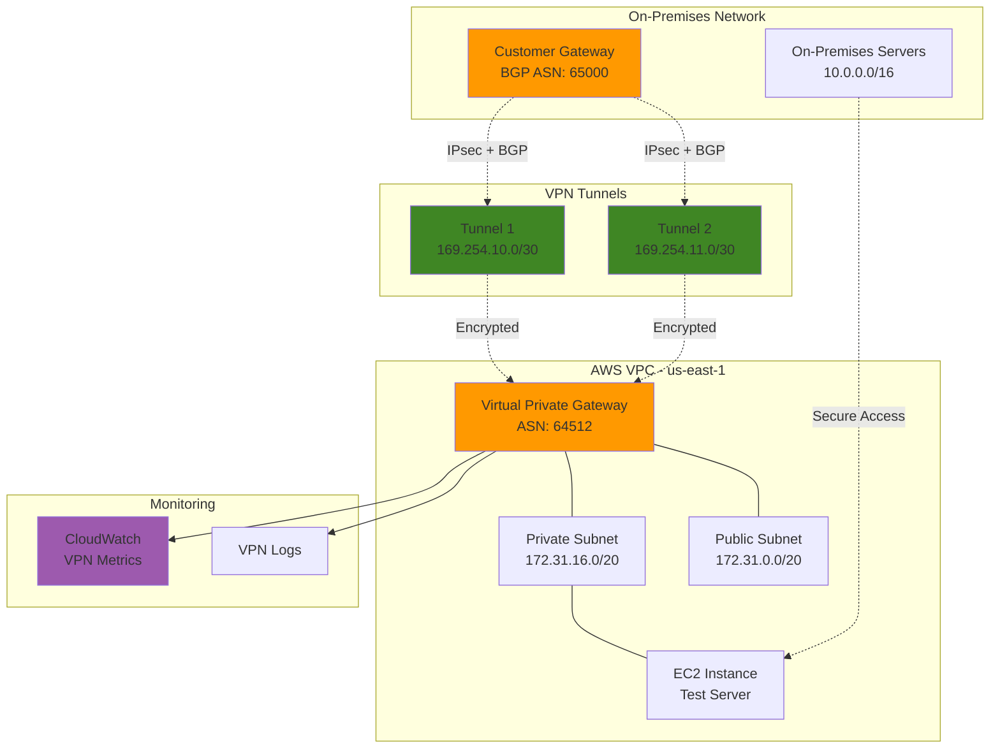

# Site-to-Site VPN Connections with AWS

## Problem

Organizations need secure, reliable connectivity between their on-premises infrastructure and AWS cloud resources for hybrid cloud deployments. Traditional methods like dedicated connections are expensive and time-consuming to establish, while internet-based connections lack the security and reliability required for production workloads. Companies require encrypted tunnels with redundancy, BGP routing capabilities, and monitoring to ensure business continuity while maintaining security compliance standards.

## Solution

AWS Site-to-Site VPN provides secure IPsec tunnels between your on-premises network and AWS VPC, enabling encrypted communication over the public internet. This solution creates redundant VPN tunnels with BGP routing for automatic failover, comprehensive monitoring with CloudWatch, and security best practices including proper customer gateway configuration and route management.

## Architecture Diagram



## Prerequisites

1. AWS account with appropriate VPC and EC2 permissions
2. AWS CLI v2 installed and configured (or AWS CloudShell)
3. On-premises router/firewall with IPsec and BGP capabilities
4. Static public IP address for customer gateway device
5. Basic knowledge of networking concepts (BGP, IPsec, routing)
6. Estimated cost: $0.05 per VPN connection-hour (~$36/month) + data transfer costs

> **Note**: This recipe uses simulated customer gateway for demonstration. In production, you'll need actual on-premises network equipment.

## Preparation

```bash
# Set environment variables
export AWS_REGION=$(aws configure get region)
export AWS_ACCOUNT_ID=$(aws sts get-caller-identity \
    --query Account --output text)

# Generate unique identifier for resources
RANDOM_SUFFIX=$(aws secretsmanager get-random-password \
    --exclude-punctuation --exclude-uppercase \
    --password-length 6 --require-each-included-type \
    --output text --query RandomPassword)

# Set resource names
export VPC_NAME="vpn-demo-vpc-${RANDOM_SUFFIX}"
export VGW_NAME="vpn-demo-vgw-${RANDOM_SUFFIX}"
export CGW_NAME="vpn-demo-cgw-${RANDOM_SUFFIX}"
export VPN_NAME="vpn-demo-connection-${RANDOM_SUFFIX}"

# Customer gateway configuration (replace with your actual public IP)
export CGW_PUBLIC_IP="203.0.113.12"  # Example IP - replace with actual
export CGW_BGP_ASN="65000"           # On-premises ASN
export AWS_BGP_ASN="64512"           # AWS side ASN

echo "✅ Environment variables configured"
echo "VPC Name: ${VPC_NAME}"
echo "Customer Gateway IP: ${CGW_PUBLIC_IP}"
```

## Steps

1. **Create VPC and Networking Infrastructure**:

   Amazon VPC provides the isolated network foundation required for secure VPN connectivity between your on-premises infrastructure and AWS cloud resources. VPCs offer complete control over your virtual networking environment, including IP address ranges, subnets, and routing tables. This network isolation is critical for maintaining security boundaries and implementing hybrid cloud architectures that extend your on-premises network into AWS.

   ```bash
   # Create VPC
   VPC_ID=$(aws ec2 create-vpc \
       --cidr-block 172.31.0.0/16 \
       --tag-specifications "ResourceType=vpc,Tags=[{Key=Name,Value=${VPC_NAME}}]" \
       --query 'Vpc.VpcId' --output text)
   
   # Create Internet Gateway
   IGW_ID=$(aws ec2 create-internet-gateway \
       --tag-specifications "ResourceType=internet-gateway,Tags=[{Key=Name,Value=${VPC_NAME}-igw}]" \
       --query 'InternetGateway.InternetGatewayId' --output text)
   
   # Attach Internet Gateway to VPC
   aws ec2 attach-internet-gateway \
       --internet-gateway-id ${IGW_ID} \
       --vpc-id ${VPC_ID}
   
   echo "✅ VPC created: ${VPC_ID}"
   echo "✅ Internet Gateway attached: ${IGW_ID}"
   ```

   Your VPC now provides the secure, isolated network environment needed for the VPN connection. The Internet Gateway enables outbound connectivity for the VPN tunnels while maintaining security through proper routing and security group controls. This foundation supports both the VPN infrastructure and your application workloads.

2. **Create Subnets and Route Tables**:

   Subnets segment your VPC into smaller network ranges, enabling you to place resources in different Availability Zones for high availability and implement network security controls. The private subnet will host resources that should only be accessible through the VPN connection, while the public subnet provides internet access when needed. Custom route tables give you precise control over traffic routing, which is essential for directing VPN traffic correctly between your on-premises network and AWS resources.

   ```bash
   # Create public subnet
   PUB_SUBNET_ID=$(aws ec2 create-subnet \
       --vpc-id ${VPC_ID} \
       --cidr-block 172.31.0.0/20 \
       --availability-zone ${AWS_REGION}a \
       --tag-specifications "ResourceType=subnet,Tags=[{Key=Name,Value=${VPC_NAME}-public}]" \
       --query 'Subnet.SubnetId' --output text)
   
   # Create private subnet
   PRIV_SUBNET_ID=$(aws ec2 create-subnet \
       --vpc-id ${VPC_ID} \
       --cidr-block 172.31.16.0/20 \
       --availability-zone ${AWS_REGION}b \
       --tag-specifications "ResourceType=subnet,Tags=[{Key=Name,Value=${VPC_NAME}-private}]" \
       --query 'Subnet.SubnetId' --output text)
   
   # Create custom route table for VPN routes
   VPN_RT_ID=$(aws ec2 create-route-table \
       --vpc-id ${VPC_ID} \
       --tag-specifications "ResourceType=route-table,Tags=[{Key=Name,Value=${VPC_NAME}-vpn-rt}]" \
       --query 'RouteTable.RouteTableId' --output text)
   
   # Associate private subnet with VPN route table
   aws ec2 associate-route-table \
       --route-table-id ${VPN_RT_ID} \
       --subnet-id ${PRIV_SUBNET_ID}
   
   echo "✅ Public subnet created: ${PUB_SUBNET_ID}"
   echo "✅ Private subnet created: ${PRIV_SUBNET_ID}"
   echo "✅ VPN route table created: ${VPN_RT_ID}"
   ```

   The subnet architecture is now established with clear separation between public and private networks. The custom route table associated with the private subnet will automatically receive route advertisements from the VPN gateway through BGP, enabling seamless connectivity to your on-premises networks without manual route management.

3. **Create Customer Gateway**:

   The Customer Gateway represents your on-premises VPN device in AWS, serving as the logical representation of your physical or virtual VPN appliance. This configuration includes your public IP address and BGP Autonomous System Number (ASN), which are essential for establishing the IPsec tunnels and enabling dynamic routing. BGP provides automatic route advertisement and failover capabilities, eliminating the need for manual route management and ensuring your network remains connected even when individual tunnels experience issues.

   ```bash
   # Create customer gateway with BGP
   CGW_ID=$(aws ec2 create-customer-gateway \
       --type ipsec.1 \
       --public-ip ${CGW_PUBLIC_IP} \
       --bgp-asn ${CGW_BGP_ASN} \
       --tag-specifications "ResourceType=customer-gateway,Tags=[{Key=Name,Value=${CGW_NAME}}]" \
       --query 'CustomerGateway.CustomerGatewayId' --output text)
   
   # Wait for customer gateway to be available
   aws ec2 wait customer-gateway-available \
       --customer-gateway-ids ${CGW_ID}
   
   echo "✅ Customer Gateway created: ${CGW_ID}"
   echo "✅ BGP ASN: ${CGW_BGP_ASN}"
   ```

   AWS now recognizes your on-premises VPN device and its routing capabilities. The BGP ASN you specified will be used for route exchange, enabling automatic discovery of your on-premises networks. This dynamic approach significantly reduces operational overhead compared to static routing configurations.

4. **Create Virtual Private Gateway**:

   The Virtual Private Gateway (VGW) serves as the AWS-side endpoint for your VPN connection, acting as the bridge between your VPC and the encrypted tunnels to your on-premises network. This managed service handles IPsec tunnel termination, BGP routing, and high availability across multiple Availability Zones. By specifying a custom ASN, you ensure proper BGP neighbor relationships and enable advanced routing policies for traffic engineering and redundancy.

   ```bash
   # Create virtual private gateway with custom ASN
   VGW_ID=$(aws ec2 create-vpn-gateway \
       --type ipsec.1 \
       --amazon-side-asn ${AWS_BGP_ASN} \
       --tag-specifications "ResourceType=vpn-gateway,Tags=[{Key=Name,Value=${VGW_NAME}}]" \
       --query 'VpnGateway.VpnGatewayId' --output text)
   
   # Wait for VPN gateway to be available
   aws ec2 wait vpn-gateway-available \
       --vpn-gateway-ids ${VGW_ID}
   
   # Attach VPN gateway to VPC
   aws ec2 attach-vpn-gateway \
       --vpn-gateway-id ${VGW_ID} \
       --vpc-id ${VPC_ID}
   
   echo "✅ Virtual Private Gateway created: ${VGW_ID}"
   echo "✅ Gateway attached to VPC: ${VPC_ID}"
   ```

   The Virtual Private Gateway is now active and attached to your VPC, ready to terminate VPN tunnels and participate in BGP routing. This AWS-managed service provides built-in redundancy and handles the complexity of IPsec tunnel management, allowing you to focus on your business applications rather than VPN infrastructure maintenance.

   > **Tip**: Virtual Private Gateways automatically distribute across multiple Availability Zones for high availability. Each VPN connection creates two tunnels in different AZs for maximum resilience.

5. **Create Site-to-Site VPN Connection**:

   The VPN connection establishes the actual IPsec tunnels between your Customer Gateway and Virtual Private Gateway, creating two redundant encrypted channels for secure data transmission. Each connection automatically creates two tunnels for high availability, with each tunnel terminating in a different AWS Availability Zone. This redundancy ensures that your hybrid connectivity remains operational even during AWS infrastructure maintenance or unexpected failures.

   ```bash
   # Create VPN connection with BGP routing
   VPN_ID=$(aws ec2 create-vpn-connection \
       --type ipsec.1 \
       --customer-gateway-id ${CGW_ID} \
       --vpn-gateway-id ${VGW_ID} \
       --tag-specifications "ResourceType=vpn-connection,Tags=[{Key=Name,Value=${VPN_NAME}}]" \
       --query 'VpnConnection.VpnConnectionId' --output text)
   
   # Wait for VPN connection to be available
   echo "⏳ Creating VPN connection (this may take 5-10 minutes)..."
   aws ec2 wait vpn-connection-available \
       --vpn-connection-ids ${VPN_ID}
   
   echo "✅ VPN Connection created: ${VPN_ID}"
   ```

   Your VPN connection is now established with two IPsec tunnels ready for configuration on your on-premises device. AWS has generated the necessary PSK (Pre-Shared Keys), tunnel IP addresses, and BGP configuration parameters that you'll need to configure your customer gateway device. The connection provides enterprise-grade encryption and supports up to 1.25 Gbps of throughput per tunnel.

6. **Configure Route Propagation**:

   Route propagation enables the Virtual Private Gateway to automatically advertise routes learned through BGP into your VPC route tables, eliminating the need for manual route management. This automation ensures that as your on-premises network topology changes, AWS automatically learns about new networks and updates routing accordingly. This dynamic approach is crucial for enterprise environments where network changes are frequent and manual route updates would be operationally intensive.

   ```bash
   # Enable route propagation from VPN gateway to route table
   aws ec2 enable-vgw-route-propagation \
       --route-table-id ${VPN_RT_ID} \
       --gateway-id ${VGW_ID}
   
   # Get main route table ID for public subnet
   MAIN_RT_ID=$(aws ec2 describe-route-tables \
       --filters "Name=vpc-id,Values=${VPC_ID}" \
           "Name=association.main,Values=true" \
       --query 'RouteTables[0].RouteTableId' --output text)
   
   # Add route to internet gateway in main route table
   aws ec2 create-route \
       --route-table-id ${MAIN_RT_ID} \
       --destination-cidr-block 0.0.0.0/0 \
       --gateway-id ${IGW_ID}
   
   echo "✅ Route propagation enabled for VPN gateway"
   echo "✅ Internet route added to main route table"
   ```

   Route propagation is now active, and your VPC will automatically receive route updates from your on-premises network via BGP. Any networks advertised by your customer gateway will appear in the route table, enabling seamless connectivity without manual intervention. The internet route ensures that resources in the public subnet can access the internet for management and updates.

7. **Create Security Group for VPN Access**:

   Security groups act as virtual firewalls that control inbound and outbound traffic to your EC2 instances, providing essential network-level security for your hybrid cloud architecture. By restricting access to only your on-premises network ranges, you maintain the principle of least privilege while enabling necessary connectivity for management and application traffic. This approach ensures that resources in AWS are only accessible through your secure VPN connection, not from the broader internet.

   ```bash
   # Create security group for VPN testing
   SG_ID=$(aws ec2 create-security-group \
       --group-name ${VPC_NAME}-vpn-sg \
       --description "Security group for VPN testing" \
       --vpc-id ${VPC_ID} \
       --tag-specifications "ResourceType=security-group,Tags=[{Key=Name,Value=${VPC_NAME}-vpn-sg}]" \
       --query 'GroupId' --output text)
   
   # Allow SSH from on-premises network
   aws ec2 authorize-security-group-ingress \
       --group-id ${SG_ID} \
       --protocol tcp \
       --port 22 \
       --cidr 10.0.0.0/16
   
   # Allow ICMP from on-premises network
   aws ec2 authorize-security-group-ingress \
       --group-id ${SG_ID} \
       --protocol icmp \
       --port -1 \
       --cidr 10.0.0.0/16
   
   # Allow all traffic from VPC
   aws ec2 authorize-security-group-ingress \
       --group-id ${SG_ID} \
       --protocol -1 \
       --source-group ${SG_ID}
   
   echo "✅ Security group created: ${SG_ID}"
   ```

   The security group now implements a secure access model that permits SSH and ICMP traffic only from your on-premises network, preventing unauthorized access from the internet. The self-referencing rule allows resources within the same security group to communicate freely, enabling internal application traffic while maintaining external security boundaries.

8. **Download VPN Configuration**:

   AWS automatically generates the complete configuration needed for your on-premises VPN device, including IPsec parameters, BGP settings, pre-shared keys, and tunnel IP addresses. This configuration file contains vendor-specific templates for popular VPN appliances, making it easier to implement the connection on your customer gateway. The configuration includes security best practices like strong encryption algorithms and proper tunnel monitoring settings.

   ```bash
   # Download customer gateway configuration
   aws ec2 describe-vpn-connections \
       --vpn-connection-ids ${VPN_ID} \
       --query 'VpnConnections[0].CustomerGatewayConfiguration' \
       --output text > vpn-config.txt
   
   # Get VPN connection details
   aws ec2 describe-vpn-connections \
       --vpn-connection-ids ${VPN_ID} \
       --query 'VpnConnections[0].VgwTelemetry' \
       --output table
   
   echo "✅ VPN configuration downloaded to vpn-config.txt"
   echo "✅ Review tunnel status above"
   ```

   The configuration file contains all parameters needed to configure your on-premises VPN device. Until you configure your customer gateway with these settings, the tunnel status will show as "DOWN". Once properly configured, the tunnels will establish IPsec connections and begin exchanging routes via BGP.

9. **Create Test EC2 Instance**:

   A test EC2 instance in the private subnet validates that your VPN connectivity works correctly and provides a target for testing network connectivity from your on-premises environment. By placing this instance in the private subnet with no direct internet access, you ensure that the only way to reach it is through the VPN connection, proving that your hybrid networking is functioning properly. This testing approach simulates real-world application deployment scenarios.

   ```bash
   # Get Amazon Linux 2 AMI ID
   AMI_ID=$(aws ec2 describe-images \
       --owners amazon \
       --filters "Name=name,Values=amzn2-ami-hvm-*-x86_64-gp2" \
           "Name=state,Values=available" \
       --query 'Images | sort_by(@, &CreationDate) | [-1].ImageId' \
       --output text)
   
   # Launch EC2 instance in private subnet
   INSTANCE_ID=$(aws ec2 run-instances \
       --image-id ${AMI_ID} \
       --instance-type t3.micro \
       --subnet-id ${PRIV_SUBNET_ID} \
       --security-group-ids ${SG_ID} \
       --tag-specifications "ResourceType=instance,Tags=[{Key=Name,Value=${VPC_NAME}-test-instance}]" \
       --query 'Instances[0].InstanceId' --output text)
   
   # Wait for instance to be running
   aws ec2 wait instance-running --instance-ids ${INSTANCE_ID}
   
   # Get instance private IP
   INSTANCE_IP=$(aws ec2 describe-instances \
       --instance-ids ${INSTANCE_ID} \
       --query 'Reservations[0].Instances[0].PrivateIpAddress' \
       --output text)
   
   echo "✅ Test instance created: ${INSTANCE_ID}"
   echo "✅ Instance private IP: ${INSTANCE_IP}"
   ```

   Your test instance is now running in the private subnet and ready for connectivity testing. Once your VPN tunnels are established and your on-premises routes are properly configured, you'll be able to SSH to this instance using its private IP address from your on-premises network, demonstrating successful hybrid cloud connectivity.

10. **Set up CloudWatch Monitoring**:

    CloudWatch monitoring provides essential visibility into your VPN connection health, performance, and traffic patterns. Monitoring VPN metrics enables proactive issue detection, capacity planning, and troubleshooting. The dashboard visualizes connection status, tunnel health, and traffic volume, helping you maintain reliable hybrid connectivity and identify issues before they impact business operations. This observability is crucial for enterprise environments requiring high availability guarantees.

    ```bash
    # Create CloudWatch dashboard for VPN monitoring
    DASHBOARD_NAME="VPN-Monitoring-${RANDOM_SUFFIX}"
    
    # Create dashboard JSON configuration
    cat > dashboard-config.json << EOF
{
    "widgets": [
        {
            "type": "metric",
            "properties": {
                "metrics": [
                    [ "AWS/VPN", "VpnState", "VpnId", "${VPN_ID}" ],
                    [ ".", "VpnTunnelIpAddress", ".", "." ],
                    [ ".", "VpnTunnelState", ".", "." ]
                ],
                "period": 300,
                "stat": "Average",
                "region": "${AWS_REGION}",
                "title": "VPN Connection Status"
            }
        },
        {
            "type": "metric",
            "properties": {
                "metrics": [
                    [ "AWS/VPN", "VpnPacketsReceived", "VpnId", "${VPN_ID}" ],
                    [ ".", "VpnPacketsSent", ".", "." ]
                ],
                "period": 300,
                "stat": "Sum",
                "region": "${AWS_REGION}",
                "title": "VPN Traffic"
            }
        }
    ]
}
EOF
    
    # Create CloudWatch dashboard
    aws cloudwatch put-dashboard \
        --dashboard-name ${DASHBOARD_NAME} \
        --dashboard-body file://dashboard-config.json
    
    echo "✅ CloudWatch dashboard created: ${DASHBOARD_NAME}"
    ```

    Your CloudWatch dashboard is now configured to monitor VPN connection health and traffic patterns. The dashboard provides real-time visibility into tunnel status and enables you to set up alarms for proactive notification of connection issues. This monitoring capability is essential for maintaining SLA commitments and ensuring business continuity.

## Validation & Testing

1. **Verify VPN Connection Status**:

   Verifying the VPN connection status ensures that AWS has successfully provisioned the IPsec infrastructure and the connection is ready for tunnel establishment. The "available" state indicates that all AWS-side configuration is complete and the connection is ready to accept IPsec tunnels from your customer gateway.

   ```bash
   # Check VPN connection state
   aws ec2 describe-vpn-connections \
       --vpn-connection-ids ${VPN_ID} \
       --query 'VpnConnections[0].State' \
       --output text
   ```

   Expected output: `available`

2. **Check Tunnel Status**:

   Tunnel telemetry provides real-time information about the health and performance of each IPsec tunnel. The status will show "DOWN" until you configure your on-premises device with the parameters from the configuration file. Once configured, the tunnels should show "UP" and begin accepting routes via BGP.

   ```bash
   # Check tunnel telemetry
   aws ec2 describe-vpn-connections \
       --vpn-connection-ids ${VPN_ID} \
       --query 'VpnConnections[0].VgwTelemetry[*].{IP:OutsideIpAddress,Status:Status,Routes:AcceptedRouteCount}' \
       --output table
   ```

   Expected output: Shows both tunnels with their status (UP/DOWN)

3. **Verify Route Propagation**:

   Route propagation verification confirms that your VPC route tables are correctly receiving route advertisements from the VPN gateway. Once your customer gateway establishes BGP sessions and advertises routes, they should automatically appear in the route table with the VPN gateway as the target.

   ```bash
   # Check propagated routes
   aws ec2 describe-route-tables \
       --route-table-ids ${VPN_RT_ID} \
       --query 'RouteTables[0].Routes[*].{Destination:DestinationCidrBlock,Gateway:GatewayId,State:State}' \
       --output table
   ```

   Expected output: Shows VPN propagated routes

4. **Test Network Connectivity** (requires configured customer gateway):

   ```bash
   # Test connectivity from on-premises to AWS instance
   # This would be run from your on-premises network
   ping ${INSTANCE_IP}
   
   # Test DNS resolution
   nslookup ${INSTANCE_IP}
   ```

5. **Monitor VPN Metrics**:

   ```bash
   # Check VPN metrics
   aws cloudwatch get-metric-statistics \
       --namespace AWS/VPN \
       --metric-name VpnState \
       --dimensions Name=VpnId,Value=${VPN_ID} \
       --start-time $(date -u -d '1 hour ago' +%Y-%m-%dT%H:%M:%S) \
       --end-time $(date -u +%Y-%m-%dT%H:%M:%S) \
       --period 300 \
       --statistics Average
   ```

## Cleanup

1. **Remove CloudWatch Dashboard**:

   Cleaning up the CloudWatch dashboard removes the monitoring configuration and prevents ongoing charges for dashboard storage. This step ensures that test resources don't accumulate costs in your AWS account.

   ```bash
   # Delete CloudWatch dashboard
   aws cloudwatch delete-dashboards \
       --dashboard-names ${DASHBOARD_NAME}
   
   # Clean up dashboard config file
   rm -f dashboard-config.json
   
   echo "✅ CloudWatch dashboard deleted"
   ```

2. **Terminate EC2 Instance**:

   Terminating the test instance stops compute charges and removes the test target from your VPC. This cleanup step is important for cost management, as running EC2 instances incur hourly charges.

   ```bash
   # Terminate test instance
   aws ec2 terminate-instances --instance-ids ${INSTANCE_ID}
   
   # Wait for instance termination
   aws ec2 wait instance-terminated --instance-ids ${INSTANCE_ID}
   
   echo "✅ Test instance terminated"
   ```

3. **Delete VPN Connection**:

   Deleting the VPN connection terminates the IPsec tunnels and stops the hourly connection charges. This step removes the secure connectivity between your on-premises network and AWS, ensuring you're not charged for unused VPN capacity.

   ```bash
   # Delete VPN connection
   aws ec2 delete-vpn-connection \
       --vpn-connection-id ${VPN_ID}
   
   echo "✅ VPN connection deleted: ${VPN_ID}"
   ```

4. **Clean Up VPN Gateway**:

   ```bash
   # Detach VPN gateway from VPC
   aws ec2 detach-vpn-gateway \
       --vpn-gateway-id ${VGW_ID} \
       --vpc-id ${VPC_ID}
   
   # Delete VPN gateway
   aws ec2 delete-vpn-gateway \
       --vpn-gateway-id ${VGW_ID}
   
   echo "✅ Virtual Private Gateway deleted"
   ```

5. **Delete Customer Gateway**:

   ```bash
   # Delete customer gateway
   aws ec2 delete-customer-gateway \
       --customer-gateway-id ${CGW_ID}
   
   echo "✅ Customer Gateway deleted"
   ```

6. **Clean Up VPC Resources**:

   ```bash
   # Delete security group
   aws ec2 delete-security-group --group-id ${SG_ID}
   
   # Detach and delete internet gateway
   aws ec2 detach-internet-gateway \
       --internet-gateway-id ${IGW_ID} \
       --vpc-id ${VPC_ID}
   aws ec2 delete-internet-gateway \
       --internet-gateway-id ${IGW_ID}
   
   # Delete route table (disassociate first)
   aws ec2 disassociate-route-table \
       --association-id $(aws ec2 describe-route-tables \
           --route-table-ids ${VPN_RT_ID} \
           --query 'RouteTables[0].Associations[0].RouteTableAssociationId' \
           --output text)
   aws ec2 delete-route-table --route-table-id ${VPN_RT_ID}
   
   # Delete subnets
   aws ec2 delete-subnet --subnet-id ${PUB_SUBNET_ID}
   aws ec2 delete-subnet --subnet-id ${PRIV_SUBNET_ID}
   
   # Delete VPC
   aws ec2 delete-vpc --vpc-id ${VPC_ID}
   
   # Clean up configuration file
   rm -f vpn-config.txt
   
   echo "✅ All VPC resources cleaned up"
   ```

## Discussion

AWS Site-to-Site VPN provides a cost-effective solution for establishing secure connectivity between on-premises networks and AWS VPCs. The implementation uses IPsec tunnels for encryption and BGP for dynamic routing, ensuring both security and reliability. The architecture creates two redundant tunnels for high availability, with automatic failover capabilities when one tunnel experiences issues. Each VPN connection supports Internet Key Exchange version 2 (IKEv2), NAT traversal, and 4-byte ASN configurations for advanced networking requirements.

Key design decisions include using BGP routing instead of static routes for automatic route propagation and failover. The virtual private gateway serves as the AWS-side VPN endpoint, while the customer gateway represents your on-premises device. Route propagation enables automatic advertisement of on-premises routes to AWS route tables, simplifying network management and ensuring connectivity as network topologies change. The solution supports both IPv4 and IPv6 traffic, with configurable tunnel options including inside IP addresses, pre-shared keys, and startup actions.

Security considerations include proper IPsec configuration with strong encryption algorithms, regular monitoring of tunnel health, and implementation of appropriate security group rules. AWS Site-to-Site VPN supports additional encryption options including AES 256-bit encryption, SHA-2 hashing, and additional Diffie-Hellman groups for enhanced security. CloudWatch monitoring provides visibility into connection status, traffic patterns, and performance metrics, enabling proactive management and troubleshooting.

> **Warning**: VPN connections incur hourly charges regardless of usage. Monitor costs through AWS Cost Explorer and implement proper cleanup procedures for test environments. As of 2025, pricing is approximately $0.05 per VPN connection-hour plus data transfer charges.

For production deployments, consider implementing multiple VPN connections across different Availability Zones, using AWS Direct Connect as a primary connection with VPN as backup, and establishing proper monitoring and alerting for tunnel failures. The solution scales to support multiple on-premises locations through additional customer gateways and VPN connections. For enhanced performance, consider AWS Accelerated Site-to-Site VPN which uses AWS Global Accelerator to improve performance and reduce packet loss. Reference the [AWS Site-to-Site VPN User Guide](https://docs.aws.amazon.com/vpn/latest/s2svpn/) for complete implementation details and best practices.

## Challenge

Extend this solution by implementing these enhancements:

1. **Multi-Site VPN Architecture**: Create connections to multiple on-premises locations with proper routing policies and traffic engineering using BGP communities and local preferences.

2. **Transit Gateway Integration**: Migrate the VPN connection to use AWS Transit Gateway for centralized routing and better scalability across multiple VPCs and regions.

3. **VPN Connection Automation**: Develop Lambda functions to automatically create VPN connections based on customer gateway registrations and implement self-healing capabilities for failed tunnels.

4. **Advanced Monitoring and Alerting**: Create comprehensive CloudWatch alarms for tunnel failures, route propagation issues, and performance degradation with automated remediation workflows.

5. **Hybrid DNS Resolution**: Implement Route 53 Resolver for seamless DNS resolution between on-premises and AWS environments, including conditional forwarding rules and private hosted zones.

## Infrastructure Code

*Infrastructure code will be generated after recipe approval.*