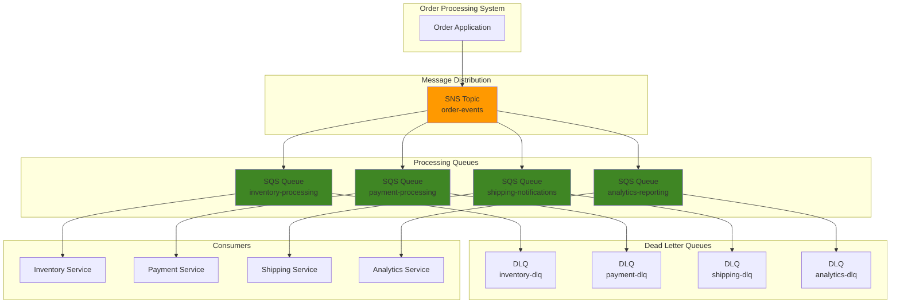

# SNS Message Fan-out with Multiple SQS Queues

## Problem

E-commerce platforms need to process customer orders through multiple business functions simultaneously - inventory management, payment processing, shipping notifications, and analytics reporting. Traditional point-to-point integrations create tight coupling between services, making the system fragile and difficult to scale. When order volumes spike during sales events, the inability to process orders in parallel leads to system bottlenecks and poor customer experience.

## Solution

Implement a message fan-out pattern using Amazon SNS to distribute order events to multiple SQS queues, each dedicated to a specific business function. SNS acts as a central message broker that publishes order events to multiple subscribers, while SQS queues provide reliable, asynchronous processing for each service. This decoupled architecture enables independent scaling, fault isolation, and simplified system maintenance.

## Architecture Diagram



## Prerequisites

1. AWS account with permissions for SNS, SQS, IAM, and CloudWatch
2. AWS CLI v2 installed and configured (or AWS CloudShell)
3. Basic understanding of message queuing patterns and JSON formatting
4. Familiarity with AWS IAM policies and resource-based permissions
5. Estimated cost: $0.50-$2.00 per million messages processed (SNS requests + SQS requests + data transfer)

> **Note**: This recipe creates multiple SQS queues and SNS topics. Ensure you have sufficient service quotas for your AWS account region.

## Preparation

```bash
# Set environment variables
export AWS_REGION=$(aws configure get region)
export AWS_ACCOUNT_ID=$(aws sts get-caller-identity \
    --query Account --output text)

# Generate unique identifiers for resources
RANDOM_SUFFIX=$(aws secretsmanager get-random-password \
    --exclude-punctuation --exclude-uppercase \
    --password-length 6 --require-each-included-type \
    --output text --query RandomPassword)

export TOPIC_NAME="order-events-${RANDOM_SUFFIX}"
export INVENTORY_QUEUE_NAME="inventory-processing-${RANDOM_SUFFIX}"
export PAYMENT_QUEUE_NAME="payment-processing-${RANDOM_SUFFIX}"
export SHIPPING_QUEUE_NAME="shipping-notifications-${RANDOM_SUFFIX}"
export ANALYTICS_QUEUE_NAME="analytics-reporting-${RANDOM_SUFFIX}"

# Create IAM role for SNS to SQS delivery
aws iam create-role \
    --role-name sns-sqs-fanout-role-${RANDOM_SUFFIX} \
    --assume-role-policy-document '{
        "Version": "2012-10-17",
        "Statement": [
            {
                "Effect": "Allow",
                "Principal": {
                    "Service": "sns.amazonaws.com"
                },
                "Action": "sts:AssumeRole"
            }
        ]
    }'

export SNS_ROLE_ARN="arn:aws:iam::${AWS_ACCOUNT_ID}:role/sns-sqs-fanout-role-${RANDOM_SUFFIX}"
```

## Steps

1. **Create Dead Letter Queues for Error Handling**:

   Dead letter queues are essential safety nets in distributed messaging systems, providing a holding area for messages that cannot be successfully processed by their intended consumers. In high-volume e-commerce environments, transient failures like database timeouts, network issues, or temporary service outages can cause message processing to fail. Without DLQs, these failed messages would be lost forever, potentially resulting in inventory inconsistencies, missed payments, or undelivered notifications that directly impact customer satisfaction and business revenue.

   ```bash
   # Create DLQ for inventory processing
   aws sqs create-queue \
       --queue-name "inventory-dlq-${RANDOM_SUFFIX}" \
       --attributes '{
           "MessageRetentionPeriod": "1209600",
           "VisibilityTimeoutSeconds": "60"
       }'
   
   export INVENTORY_DLQ_URL=$(aws sqs get-queue-url \
       --queue-name "inventory-dlq-${RANDOM_SUFFIX}" \
       --query QueueUrl --output text)
   
   # Create DLQ for payment processing
   aws sqs create-queue \
       --queue-name "payment-dlq-${RANDOM_SUFFIX}" \
       --attributes '{
           "MessageRetentionPeriod": "1209600",
           "VisibilityTimeoutSeconds": "60"
       }'
   
   export PAYMENT_DLQ_URL=$(aws sqs get-queue-url \
       --queue-name "payment-dlq-${RANDOM_SUFFIX}" \
       --query QueueUrl --output text)
   
   # Create DLQ for shipping notifications
   aws sqs create-queue \
       --queue-name "shipping-dlq-${RANDOM_SUFFIX}" \
       --attributes '{
           "MessageRetentionPeriod": "1209600",
           "VisibilityTimeoutSeconds": "60"
       }'
   
   export SHIPPING_DLQ_URL=$(aws sqs get-queue-url \
       --queue-name "shipping-dlq-${RANDOM_SUFFIX}" \
       --query QueueUrl --output text)
   
   # Create DLQ for analytics reporting
   aws sqs create-queue \
       --queue-name "analytics-dlq-${RANDOM_SUFFIX}" \
       --attributes '{
           "MessageRetentionPeriod": "1209600",
           "VisibilityTimeoutSeconds": "60"
       }'
   
   export ANALYTICS_DLQ_URL=$(aws sqs get-queue-url \
       --queue-name "analytics-dlq-${RANDOM_SUFFIX}" \
       --query QueueUrl --output text)
   
   echo "✅ Created dead letter queues for error handling"
   ```

   The dead letter queues are now established with a 14-day message retention period, providing sufficient time for operations teams to investigate and resolve processing issues. The 60-second visibility timeout ensures that messages in DLQs remain available for debugging without being hidden by concurrent access attempts. These DLQs will automatically receive messages from their corresponding primary queues after three failed processing attempts, enabling systematic error handling and system reliability monitoring.

2. **Create Primary SQS Queues with DLQ Configuration**:

   The primary SQS queues form the backbone of our distributed processing architecture, each dedicated to a specific business domain within the e-commerce workflow. SQS provides guaranteed message delivery with configurable retry policies, ensuring that critical business events like order processing, payment confirmation, and inventory updates are reliably handled even during system failures. The redrive policy configuration automatically routes messages to dead letter queues after failed processing attempts, preventing message loss while maintaining system performance.

   ```bash
   # Extract DLQ ARNs for redrive policy
   export INVENTORY_DLQ_ARN=$(aws sqs get-queue-attributes \
       --queue-url $INVENTORY_DLQ_URL \
       --attribute-names QueueArn \
       --query Attributes.QueueArn --output text)
   
   export PAYMENT_DLQ_ARN=$(aws sqs get-queue-attributes \
       --queue-url $PAYMENT_DLQ_URL \
       --attribute-names QueueArn \
       --query Attributes.QueueArn --output text)
   
   export SHIPPING_DLQ_ARN=$(aws sqs get-queue-attributes \
       --queue-url $SHIPPING_DLQ_URL \
       --attribute-names QueueArn \
       --query Attributes.QueueArn --output text)
   
   export ANALYTICS_DLQ_ARN=$(aws sqs get-queue-attributes \
       --queue-url $ANALYTICS_DLQ_URL \
       --attribute-names QueueArn \
       --query Attributes.QueueArn --output text)
   
   # Create inventory processing queue
   aws sqs create-queue \
       --queue-name $INVENTORY_QUEUE_NAME \
       --attributes '{
           "VisibilityTimeoutSeconds": "300",
           "MessageRetentionPeriod": "1209600",
           "RedrivePolicy": "{\"deadLetterTargetArn\":\"'$INVENTORY_DLQ_ARN'\",\"maxReceiveCount\":3}"
       }'
   
   export INVENTORY_QUEUE_URL=$(aws sqs get-queue-url \
       --queue-name $INVENTORY_QUEUE_NAME \
       --query QueueUrl --output text)
   
   # Create payment processing queue
   aws sqs create-queue \
       --queue-name $PAYMENT_QUEUE_NAME \
       --attributes '{
           "VisibilityTimeoutSeconds": "300",
           "MessageRetentionPeriod": "1209600",
           "RedrivePolicy": "{\"deadLetterTargetArn\":\"'$PAYMENT_DLQ_ARN'\",\"maxReceiveCount\":3}"
       }'
   
   export PAYMENT_QUEUE_URL=$(aws sqs get-queue-url \
       --queue-name $PAYMENT_QUEUE_NAME \
       --query QueueUrl --output text)
   
   # Create shipping notifications queue
   aws sqs create-queue \
       --queue-name $SHIPPING_QUEUE_NAME \
       --attributes '{
           "VisibilityTimeoutSeconds": "300",
           "MessageRetentionPeriod": "1209600",
           "RedrivePolicy": "{\"deadLetterTargetArn\":\"'$SHIPPING_DLQ_ARN'\",\"maxReceiveCount\":3}"
       }'
   
   export SHIPPING_QUEUE_URL=$(aws sqs get-queue-url \
       --queue-name $SHIPPING_QUEUE_NAME \
       --query QueueUrl --output text)
   
   # Create analytics reporting queue
   aws sqs create-queue \
       --queue-name $ANALYTICS_QUEUE_NAME \
       --attributes '{
           "VisibilityTimeoutSeconds": "300",
           "MessageRetentionPeriod": "1209600",
           "RedrivePolicy": "{\"deadLetterTargetArn\":\"'$ANALYTICS_DLQ_ARN'\",\"maxReceiveCount\":3}"
       }'
   
   export ANALYTICS_QUEUE_URL=$(aws sqs get-queue-url \
       --queue-name $ANALYTICS_QUEUE_NAME \
       --query QueueUrl --output text)
   
   echo "✅ Created primary SQS queues with DLQ configuration"
   ```

   Each queue is now configured with a 5-minute visibility timeout, allowing sufficient time for complex business logic processing while preventing message duplication during normal operations. The 14-day message retention ensures that unprocessed messages remain available for extended periods, accommodating service maintenance windows and operational delays. The redrive policy linkage to DLQs creates a robust error handling pipeline that automatically manages failed messages without manual intervention.

3. **Create SNS Topic for Order Events**:

   Amazon SNS serves as the central nervous system of our fan-out architecture, enabling publish-subscribe messaging patterns that decouple event producers from consumers. This design allows the order application to publish events once while automatically distributing them to multiple interested services, eliminating the need for complex point-to-point integrations. The delivery policy configuration ensures reliable message delivery with automatic retry mechanisms, crucial for maintaining data consistency across distributed business functions.

   ```bash
   # Create SNS topic for order events
   aws sns create-topic --name $TOPIC_NAME
   
   export TOPIC_ARN=$(aws sns get-topic-attributes \
       --topic-arn "arn:aws:sns:${AWS_REGION}:${AWS_ACCOUNT_ID}:${TOPIC_NAME}" \
       --query Attributes.TopicArn --output text)
   
   # Enable delivery status logging for monitoring
   aws sns set-topic-attributes \
       --topic-arn $TOPIC_ARN \
       --attribute-name DeliveryPolicy \
       --attribute-value '{
           "http": {
               "defaultHealthyRetryPolicy": {
                   "numRetries": 3,
                   "numNoDelayRetries": 0,
                   "minDelayTarget": 20,
                   "maxDelayTarget": 20,
                   "numMinDelayRetries": 0,
                   "numMaxDelayRetries": 0,
                   "backoffFunction": "linear"
               }
           }
       }'
   
   echo "✅ Created SNS topic: $TOPIC_ARN"
   ```

   The SNS topic is now active and configured with intelligent retry policies that handle transient delivery failures automatically. The linear backoff function with 20-second delays provides a balance between rapid retry attempts and avoiding overwhelming downstream systems during outages. This topic will serve as the single point of publication for all order-related events, ensuring consistent message distribution across the entire e-commerce processing pipeline.

4. **Configure SQS Queue Policies for SNS Access**:

   Security is paramount in distributed messaging systems, and SQS queue policies provide fine-grained access control that follows the principle of least privilege. These resource-based policies ensure that only our specific SNS topic can deliver messages to the queues, preventing unauthorized access or message injection attacks. The source ARN condition creates a trust relationship that validates the identity of the message publisher, establishing a secure communication channel between SNS and SQS services.

   ```bash
   # Get queue ARNs for policy configuration
   export INVENTORY_QUEUE_ARN=$(aws sqs get-queue-attributes \
       --queue-url $INVENTORY_QUEUE_URL \
       --attribute-names QueueArn \
       --query Attributes.QueueArn --output text)
   
   export PAYMENT_QUEUE_ARN=$(aws sqs get-queue-attributes \
       --queue-url $PAYMENT_QUEUE_URL \
       --attribute-names QueueArn \
       --query Attributes.QueueArn --output text)
   
   export SHIPPING_QUEUE_ARN=$(aws sqs get-queue-attributes \
       --queue-url $SHIPPING_QUEUE_URL \
       --attribute-names QueueArn \
       --query Attributes.QueueArn --output text)
   
   export ANALYTICS_QUEUE_ARN=$(aws sqs get-queue-attributes \
       --queue-url $ANALYTICS_QUEUE_URL \
       --attribute-names QueueArn \
       --query Attributes.QueueArn --output text)
   
   # Configure access policy for inventory queue
   aws sqs set-queue-attributes \
       --queue-url $INVENTORY_QUEUE_URL \
       --attributes Policy='{
           "Version": "2012-10-17",
           "Statement": [
               {
                   "Effect": "Allow",
                   "Principal": "*",
                   "Action": "sqs:SendMessage",
                   "Resource": "'$INVENTORY_QUEUE_ARN'",
                   "Condition": {
                       "ArnEquals": {
                           "aws:SourceArn": "'$TOPIC_ARN'"
                       }
                   }
               }
           ]
       }'
   
   # Configure access policy for payment queue
   aws sqs set-queue-attributes \
       --queue-url $PAYMENT_QUEUE_URL \
       --attributes Policy='{
           "Version": "2012-10-17",
           "Statement": [
               {
                   "Effect": "Allow",
                   "Principal": "*",
                   "Action": "sqs:SendMessage",
                   "Resource": "'$PAYMENT_QUEUE_ARN'",
                   "Condition": {
                       "ArnEquals": {
                           "aws:SourceArn": "'$TOPIC_ARN'"
                       }
                   }
               }
           ]
       }'
   
   # Configure access policy for shipping queue
   aws sqs set-queue-attributes \
       --queue-url $SHIPPING_QUEUE_URL \
       --attributes Policy='{
           "Version": "2012-10-17",
           "Statement": [
               {
                   "Effect": "Allow",
                   "Principal": "*",
                   "Action": "sqs:SendMessage",
                   "Resource": "'$SHIPPING_QUEUE_ARN'",
                   "Condition": {
                       "ArnEquals": {
                           "aws:SourceArn": "'$TOPIC_ARN'"
                       }
                   }
               }
           ]
       }'
   
   # Configure access policy for analytics queue
   aws sqs set-queue-attributes \
       --queue-url $ANALYTICS_QUEUE_URL \
       --attributes Policy='{
           "Version": "2012-10-17",
           "Statement": [
               {
                   "Effect": "Allow",
                   "Principal": "*",
                   "Action": "sqs:SendMessage",
                   "Resource": "'$ANALYTICS_QUEUE_ARN'",
                   "Condition": {
                       "ArnEquals": {
                           "aws:SourceArn": "'$TOPIC_ARN'"
                       }
                   }
               }
           ]
       }'
   
   echo "✅ Configured SQS queue policies for SNS access"
   ```

   The queue policies are now active, creating secure communication channels that allow SNS message delivery while preventing unauthorized access. Each policy includes conditional logic that validates the source ARN, ensuring that only messages from our designated SNS topic can reach the queues. This security model protects against message tampering and unauthorized data injection while maintaining the performance characteristics required for high-volume e-commerce operations.

5. **Create SNS Subscriptions with Message Filtering**:

   Message filtering is a powerful SNS feature that enables intelligent message routing based on message attributes, significantly reducing unnecessary network traffic and processing overhead. By applying filters at the subscription level, each business service receives only the events relevant to its domain, improving system efficiency and reducing operational costs. This selective delivery mechanism allows different services to subscribe to the same topic while receiving customized event streams tailored to their specific processing requirements.

   ```bash
   # Subscribe inventory queue with filter for inventory events
   aws sns subscribe \
       --topic-arn $TOPIC_ARN \
       --protocol sqs \
       --notification-endpoint $INVENTORY_QUEUE_ARN \
       --attributes FilterPolicy='{
           "eventType": ["inventory_update", "stock_check"],
           "priority": ["high", "medium"]
       }'
   
   # Subscribe payment queue with filter for payment events
   aws sns subscribe \
       --topic-arn $TOPIC_ARN \
       --protocol sqs \
       --notification-endpoint $PAYMENT_QUEUE_ARN \
       --attributes FilterPolicy='{
           "eventType": ["payment_request", "payment_confirmation"],
           "priority": ["high"]
       }'
   
   # Subscribe shipping queue with filter for shipping events
   aws sns subscribe \
       --topic-arn $TOPIC_ARN \
       --protocol sqs \
       --notification-endpoint $SHIPPING_QUEUE_ARN \
       --attributes FilterPolicy='{
           "eventType": ["shipping_notification", "delivery_update"],
           "priority": ["high", "medium", "low"]
       }'
   
   # Subscribe analytics queue for all events (no filter)
   aws sns subscribe \
       --topic-arn $TOPIC_ARN \
       --protocol sqs \
       --notification-endpoint $ANALYTICS_QUEUE_ARN
   
   echo "✅ Created SNS subscriptions with message filtering"
   ```

   The subscription filters are now active, creating intelligent routing logic that ensures each business service receives precisely the events it needs to process. Inventory services will receive inventory updates and stock checks, payment services handle payment-related events, and shipping services manage delivery notifications. The analytics queue receives all events without filtering, enabling comprehensive business intelligence and reporting capabilities across the entire order processing workflow.

6. **Configure CloudWatch Alarms for Monitoring**:

   Proactive monitoring is essential for maintaining reliable distributed systems, and CloudWatch alarms provide automated alerting that enables rapid response to system anomalies. Queue depth monitoring helps identify processing bottlenecks before they impact customer experience, while SNS delivery failure alerts indicate potential infrastructure issues that require immediate attention. These alarms create an early warning system that allows operations teams to address issues proactively rather than reactively responding to customer complaints.

   ```bash
   # Create alarm for inventory queue depth
   aws cloudwatch put-metric-alarm \
       --alarm-name "inventory-queue-depth-${RANDOM_SUFFIX}" \
       --alarm-description "Monitor inventory queue depth" \
       --metric-name ApproximateNumberOfVisibleMessages \
       --namespace AWS/SQS \
       --statistic Average \
       --period 300 \
       --evaluation-periods 2 \
       --threshold 100 \
       --comparison-operator GreaterThanThreshold \
       --dimensions Name=QueueName,Value=$INVENTORY_QUEUE_NAME
   
   # Create alarm for payment queue depth
   aws cloudwatch put-metric-alarm \
       --alarm-name "payment-queue-depth-${RANDOM_SUFFIX}" \
       --alarm-description "Monitor payment queue depth" \
       --metric-name ApproximateNumberOfVisibleMessages \
       --namespace AWS/SQS \
       --statistic Average \
       --period 300 \
       --evaluation-periods 2 \
       --threshold 50 \
       --comparison-operator GreaterThanThreshold \
       --dimensions Name=QueueName,Value=$PAYMENT_QUEUE_NAME
   
   # Create alarm for SNS failed deliveries
   aws cloudwatch put-metric-alarm \
       --alarm-name "sns-failed-deliveries-${RANDOM_SUFFIX}" \
       --alarm-description "Monitor SNS failed deliveries" \
       --metric-name NumberOfNotificationsFailed \
       --namespace AWS/SNS \
       --statistic Sum \
       --period 300 \
       --evaluation-periods 1 \
       --threshold 5 \
       --comparison-operator GreaterThanThreshold \
       --dimensions Name=TopicName,Value=$TOPIC_NAME
   
   echo "✅ Configured CloudWatch alarms for monitoring"
   ```

   The monitoring infrastructure is now established with intelligent thresholds that balance sensitivity with operational noise. Inventory and payment queue alarms will trigger when message backlogs indicate processing delays, while SNS failure alarms provide immediate notification of delivery issues. This monitoring strategy enables proactive capacity management and rapid incident response, ensuring that the message processing system maintains high availability and performance standards.

7. **Test Message Fan-out with Sample Order Events**:

   Testing the complete message flow validates that our fan-out architecture functions correctly and that message filtering routes events to appropriate consumers. These test messages simulate real e-commerce scenarios with proper message attributes that trigger the filtering logic, demonstrating how different event types are distributed across the system. The test data includes realistic business context like order IDs, customer information, and timestamps that mirror production message patterns.

   ```bash
   # Publish high-priority inventory update event
   aws sns publish \
       --topic-arn $TOPIC_ARN \
       --message '{
           "orderId": "order-12345",
           "customerId": "customer-789",
           "productId": "product-abc",
           "quantity": 2,
           "timestamp": "'$(date -u +%Y-%m-%dT%H:%M:%SZ)'"
       }' \
       --message-attributes '{
           "eventType": {
               "DataType": "String",
               "StringValue": "inventory_update"
           },
           "priority": {
               "DataType": "String",
               "StringValue": "high"
           }
       }'
   
   # Publish payment confirmation event
   aws sns publish \
       --topic-arn $TOPIC_ARN \
       --message '{
           "orderId": "order-12345",
           "paymentId": "payment-456",
           "amount": 99.99,
           "currency": "USD",
           "timestamp": "'$(date -u +%Y-%m-%dT%H:%M:%SZ)'"
       }' \
       --message-attributes '{
           "eventType": {
               "DataType": "String",
               "StringValue": "payment_confirmation"
           },
           "priority": {
               "DataType": "String",
               "StringValue": "high"
           }
       }'
   
   # Publish shipping notification event
   aws sns publish \
       --topic-arn $TOPIC_ARN \
       --message '{
           "orderId": "order-12345",
           "trackingNumber": "tracking-789",
           "carrier": "UPS",
           "estimatedDelivery": "'$(date -u -d '+3 days' +%Y-%m-%d)'"
       }' \
       --message-attributes '{
           "eventType": {
               "DataType": "String",
               "StringValue": "shipping_notification"
           },
           "priority": {
               "DataType": "String",
               "StringValue": "medium"
           }
       }'
   
   echo "✅ Published test order events to SNS topic"
   ```

   The test messages have been successfully published and are now propagating through the fan-out system, with each message being evaluated against subscription filters and routed to appropriate queues. This validation demonstrates that the architecture correctly handles different event types and priority levels, ensuring that inventory updates reach inventory systems, payment confirmations reach payment processors, and shipping notifications reach logistics services while analytics receives comprehensive event data for business intelligence.

8. **Configure Enhanced Monitoring and Metrics**:

   Comprehensive observability requires detailed metrics collection and centralized dashboards that provide real-time visibility into system performance. CloudWatch dashboards create unified views of distributed system health, enabling operations teams to quickly identify bottlenecks, performance trends, and potential issues across the entire message processing pipeline. Enhanced logging provides detailed audit trails that support troubleshooting and compliance requirements in regulated e-commerce environments.

   ```bash
   # Enable detailed CloudWatch metrics for SQS queues
   aws sqs set-queue-attributes \
       --queue-url $INVENTORY_QUEUE_URL \
       --attributes EnableLogging=true
   
   aws sqs set-queue-attributes \
       --queue-url $PAYMENT_QUEUE_URL \
       --attributes EnableLogging=true
   
   aws sqs set-queue-attributes \
       --queue-url $SHIPPING_QUEUE_URL \
       --attributes EnableLogging=true
   
   aws sqs set-queue-attributes \
       --queue-url $ANALYTICS_QUEUE_URL \
       --attributes EnableLogging=true
   
   # Create custom CloudWatch dashboard for fan-out monitoring
   aws cloudwatch put-dashboard \
       --dashboard-name "sns-fanout-dashboard-${RANDOM_SUFFIX}" \
       --dashboard-body '{
           "widgets": [
               {
                   "type": "metric",
                   "properties": {
                       "metrics": [
                           ["AWS/SNS", "NumberOfMessagesPublished", "TopicName", "'$TOPIC_NAME'"],
                           ["AWS/SNS", "NumberOfNotificationsFailed", "TopicName", "'$TOPIC_NAME'"]
                       ],
                       "period": 300,
                       "stat": "Sum",
                       "region": "'$AWS_REGION'",
                       "title": "SNS Message Publishing"
                   }
               },
               {
                   "type": "metric",
                   "properties": {
                       "metrics": [
                           ["AWS/SQS", "ApproximateNumberOfVisibleMessages", "QueueName", "'$INVENTORY_QUEUE_NAME'"],
                           ["AWS/SQS", "ApproximateNumberOfVisibleMessages", "QueueName", "'$PAYMENT_QUEUE_NAME'"],
                           ["AWS/SQS", "ApproximateNumberOfVisibleMessages", "QueueName", "'$SHIPPING_QUEUE_NAME'"],
                           ["AWS/SQS", "ApproximateNumberOfVisibleMessages", "QueueName", "'$ANALYTICS_QUEUE_NAME'"]
                       ],
                       "period": 300,
                       "stat": "Average",
                       "region": "'$AWS_REGION'",
                       "title": "SQS Queue Depths"
                   }
               }
           ]
       }'
   
   echo "✅ Configured enhanced monitoring and CloudWatch dashboard"
   ```

   The monitoring infrastructure now provides comprehensive visibility into both SNS publishing metrics and SQS queue performance, enabling data-driven operational decisions. The dashboard creates a unified view of message flow patterns, queue depths, and delivery success rates that supports both real-time monitoring and historical analysis. This observability foundation enables continuous optimization of the message processing system and provides the insights needed to maintain high performance as business volumes scale.

## Validation & Testing

1. **Verify SNS topic and subscriptions**:

   ```bash
   # Check SNS topic attributes
   aws sns get-topic-attributes --topic-arn $TOPIC_ARN
   
   # List all subscriptions for the topic
   aws sns list-subscriptions-by-topic --topic-arn $TOPIC_ARN
   ```

   Expected output: Topic ARN, delivery policy, and 4 SQS subscriptions with their filter policies.

2. **Test message filtering and delivery**:

   ```bash
   # Wait for message propagation
   sleep 10
   
   # Check inventory queue (should have 1 message - inventory_update event)
   aws sqs get-queue-attributes \
       --queue-url $INVENTORY_QUEUE_URL \
       --attribute-names ApproximateNumberOfMessages
   
   # Check payment queue (should have 1 message - payment_confirmation event)
   aws sqs get-queue-attributes \
       --queue-url $PAYMENT_QUEUE_URL \
       --attribute-names ApproximateNumberOfMessages
   
   # Check shipping queue (should have 1 message - shipping_notification event)
   aws sqs get-queue-attributes \
       --queue-url $SHIPPING_QUEUE_URL \
       --attribute-names ApproximateNumberOfMessages
   
   # Check analytics queue (should have 3 messages - all events)
   aws sqs get-queue-attributes \
       --queue-url $ANALYTICS_QUEUE_URL \
       --attribute-names ApproximateNumberOfMessages
   ```

3. **Verify message content and structure**:

   ```bash
   # Receive and inspect message from analytics queue
   aws sqs receive-message \
       --queue-url $ANALYTICS_QUEUE_URL \
       --max-number-of-messages 1 \
       --wait-time-seconds 10
   
   # Receive and inspect message from inventory queue
   aws sqs receive-message \
       --queue-url $INVENTORY_QUEUE_URL \
       --max-number-of-messages 1 \
       --wait-time-seconds 10
   ```

   Expected output: JSON messages containing SNS metadata, original message content, and message attributes.

4. **Test dead letter queue functionality**:

   ```bash
   # Send message to inventory queue and simulate processing failures
   MESSAGE_RECEIPT=$(aws sqs receive-message \
       --queue-url $INVENTORY_QUEUE_URL \
       --max-number-of-messages 1 \
       --query Messages[0].ReceiptHandle --output text)
   
   # Simulate processing failure by not deleting message (it will return to queue)
   # After visibility timeout, message will be available again
   # After 3 failed attempts, message will move to DLQ
   
   # Check DLQ after simulated failures
   aws sqs get-queue-attributes \
       --queue-url $INVENTORY_DLQ_URL \
       --attribute-names ApproximateNumberOfMessages
   ```

5. **Monitor CloudWatch metrics**:

   ```bash
   # Check SNS publishing metrics
   aws cloudwatch get-metric-statistics \
       --namespace AWS/SNS \
       --metric-name NumberOfMessagesPublished \
       --dimensions Name=TopicName,Value=$TOPIC_NAME \
       --start-time $(date -u -d '1 hour ago' +%Y-%m-%dT%H:%M:%S) \
       --end-time $(date -u +%Y-%m-%dT%H:%M:%S) \
       --period 300 \
       --statistics Sum
   
   # Check SQS queue depth metrics
   aws cloudwatch get-metric-statistics \
       --namespace AWS/SQS \
       --metric-name ApproximateNumberOfVisibleMessages \
       --dimensions Name=QueueName,Value=$ANALYTICS_QUEUE_NAME \
       --start-time $(date -u -d '1 hour ago' +%Y-%m-%dT%H:%M:%S) \
       --end-time $(date -u +%Y-%m-%dT%H:%M:%S) \
       --period 300 \
       --statistics Average
   ```

## Cleanup

1. **Delete SNS subscriptions and topic**:

   ```bash
   # List and delete all subscriptions
   SUBSCRIPTION_ARNS=$(aws sns list-subscriptions-by-topic \
       --topic-arn $TOPIC_ARN \
       --query 'Subscriptions[].SubscriptionArn' \
       --output text)
   
   for SUB_ARN in $SUBSCRIPTION_ARNS; do
       aws sns unsubscribe --subscription-arn $SUB_ARN
   done
   
   # Delete SNS topic
   aws sns delete-topic --topic-arn $TOPIC_ARN
   
   echo "✅ Deleted SNS topic and subscriptions"
   ```

2. **Delete SQS queues and dead letter queues**:

   ```bash
   # Delete primary queues
   aws sqs delete-queue --queue-url $INVENTORY_QUEUE_URL
   aws sqs delete-queue --queue-url $PAYMENT_QUEUE_URL
   aws sqs delete-queue --queue-url $SHIPPING_QUEUE_URL
   aws sqs delete-queue --queue-url $ANALYTICS_QUEUE_URL
   
   # Delete dead letter queues
   aws sqs delete-queue --queue-url $INVENTORY_DLQ_URL
   aws sqs delete-queue --queue-url $PAYMENT_DLQ_URL
   aws sqs delete-queue --queue-url $SHIPPING_DLQ_URL
   aws sqs delete-queue --queue-url $ANALYTICS_DLQ_URL
   
   echo "✅ Deleted SQS queues and dead letter queues"
   ```

3. **Delete CloudWatch alarms and dashboard**:

   ```bash
   # Delete CloudWatch alarms
   aws cloudwatch delete-alarms \
       --alarm-names \
       "inventory-queue-depth-${RANDOM_SUFFIX}" \
       "payment-queue-depth-${RANDOM_SUFFIX}" \
       "sns-failed-deliveries-${RANDOM_SUFFIX}"
   
   # Delete CloudWatch dashboard
   aws cloudwatch delete-dashboards \
       --dashboard-names "sns-fanout-dashboard-${RANDOM_SUFFIX}"
   
   echo "✅ Deleted CloudWatch alarms and dashboard"
   ```

4. **Delete IAM role**:

   ```bash
   # Delete IAM role
   aws iam delete-role --role-name "sns-sqs-fanout-role-${RANDOM_SUFFIX}"
   
   echo "✅ Deleted IAM role"
   ```

5. **Clean up environment variables**:

   ```bash
   # Unset environment variables
   unset AWS_REGION AWS_ACCOUNT_ID RANDOM_SUFFIX
   unset TOPIC_NAME TOPIC_ARN SNS_ROLE_ARN
   unset INVENTORY_QUEUE_NAME INVENTORY_QUEUE_URL INVENTORY_QUEUE_ARN
   unset PAYMENT_QUEUE_NAME PAYMENT_QUEUE_URL PAYMENT_QUEUE_ARN
   unset SHIPPING_QUEUE_NAME SHIPPING_QUEUE_URL SHIPPING_QUEUE_ARN
   unset ANALYTICS_QUEUE_NAME ANALYTICS_QUEUE_URL ANALYTICS_QUEUE_ARN
   unset INVENTORY_DLQ_URL INVENTORY_DLQ_ARN
   unset PAYMENT_DLQ_URL PAYMENT_DLQ_ARN
   unset SHIPPING_DLQ_URL SHIPPING_DLQ_ARN
   unset ANALYTICS_DLQ_URL ANALYTICS_DLQ_ARN
   
   echo "✅ Cleaned up environment variables"
   ```

## Discussion

The SNS-SQS fan-out pattern is a cornerstone of modern distributed systems architecture, enabling loose coupling between services while maintaining high availability and scalability. This pattern addresses the fundamental challenge of distributing events to multiple consumers without creating direct dependencies between publishers and subscribers. By using SNS as a central message broker, applications can publish events once and have them automatically distributed to all interested parties.

Message filtering capabilities in SNS subscriptions provide powerful routing logic that reduces unnecessary processing and network traffic. In our e-commerce example, inventory services only receive inventory-related events, while payment services receive payment-specific messages. This selective delivery improves system efficiency and reduces the cognitive load on individual services. The analytics service receives all events without filtering, demonstrating how different consumption patterns can coexist in the same architecture.

Dead letter queues (DLQs) provide critical error handling and debugging capabilities in asynchronous messaging systems. When messages fail to process after the configured number of retries, they are automatically moved to DLQs for later analysis and potential reprocessing. This prevents message loss and provides visibility into system failures. The three-retry configuration with exponential backoff helps handle transient failures while avoiding infinite retry loops that could overwhelm downstream systems.

Monitoring and observability are essential for maintaining reliable message-driven architectures. CloudWatch metrics for queue depths, message ages, and delivery failures provide real-time insights into system health. Setting up proactive alarms ensures that operations teams are notified of potential issues before they impact end users. The CloudWatch dashboard provides a centralized view of the entire fan-out system, making it easier to identify bottlenecks and performance issues.

> **Tip**: Use SNS message attributes for filtering instead of parsing message bodies, as attribute-based filtering is more efficient and reduces processing overhead for subscribers.

## Challenge

Extend this solution by implementing these enhancements:

1. **Implement priority-based message routing** by creating separate high-priority and low-priority queues for each service, with different visibility timeouts and processing guarantees.

2. **Add message deduplication** by implementing FIFO queues for critical services like payment processing, ensuring exactly-once delivery for financial transactions.

3. **Create a message replay system** by implementing an S3-based message archive that captures all published events, allowing for historical data analysis and system recovery scenarios.

4. **Build auto-scaling consumers** by integrating the queues with Lambda functions that scale automatically based on queue depth, implementing backpressure mechanisms when processing capacity is exceeded.

5. **Implement cross-region message replication** by setting up SNS topics in multiple regions with cross-region subscriptions, ensuring global availability and disaster recovery capabilities.

## Infrastructure Code

*Infrastructure code will be generated after recipe approval.*