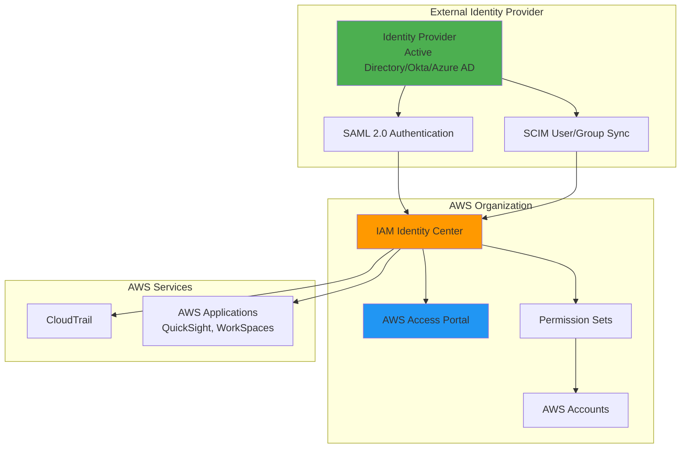

# SSO with External Identity Providers


## Problem

Organizations with existing identity management systems face the challenge of providing secure, centralized access to AWS accounts and applications without requiring users to maintain separate credentials. Managing multiple sets of credentials increases security risks, operational overhead, and user friction while making it difficult to enforce consistent access policies across cloud resources.

## Solution

AWS IAM Identity Center (formerly AWS Single Sign-On) provides centralized identity management by integrating with external identity providers through SAML 2.0 and SCIM protocols. This solution enables organizations to leverage existing identity infrastructure while providing seamless access to AWS accounts and applications through a unified portal.

## Architecture Diagram



## Prerequisites

1. AWS Organizations with management account access
2. AWS CLI v2 installed and configured (or AWS CloudShell)
3. Administrative access to external identity provider (Active Directory, Okta, Azure AD, etc.)
4. SAML metadata from your identity provider
5. Basic understanding of SAML 2.0 and identity federation concepts
6. Estimated cost: $0.50-$2.00 per user per month (depending on usage)

> **Note**: IAM Identity Center is available at no additional charge for workforce users. Additional charges may apply for application integrations and advanced features.

## Preparation

```bash
# Set environment variables
export AWS_REGION=$(aws configure get region)
export AWS_ACCOUNT_ID=$(aws sts get-caller-identity \
    --query Account --output text)

# Generate unique identifiers for resources
RANDOM_SUFFIX=$(aws secretsmanager get-random-password \
    --exclude-punctuation --exclude-uppercase \
    --password-length 6 --require-each-included-type \
    --output text --query RandomPassword)

# Set identity provider name
export IDP_NAME="ExternalIdP-${RANDOM_SUFFIX}"

# Verify AWS Organizations is enabled
aws organizations describe-organization \
    --query 'Organization.MasterAccountId' --output text

echo "✅ Environment prepared for IAM Identity Center setup"
```

## Steps

1. **Enable IAM Identity Center**:

   [AWS IAM Identity Center](https://docs.aws.amazon.com/singlesignon/latest/userguide/what-is.html) serves as the centralized workforce identity solution for AWS, replacing the complexity of managing multiple identity systems across your organization. Enabling Identity Center establishes the foundation for secure, scalable access management that integrates with your existing identity infrastructure while providing comprehensive audit trails and compliance capabilities.

   ```bash
   # Enable IAM Identity Center (if not already enabled)
   aws sso-admin create-instance-access-control-attribute-configuration \
       --instance-arn $(aws sso-admin list-instances \
           --query 'Instances[0].InstanceArn' --output text) \
       --access-control-attributes AttributeKey=Department,AttributeValue='{\"Source\":[\"department\"]}'
   
   # Get the IAM Identity Center instance ARN
   SSO_INSTANCE_ARN=$(aws sso-admin list-instances \
       --query 'Instances[0].InstanceArn' --output text)
   
   # Get the Identity Store ID
   IDENTITY_STORE_ID=$(aws sso-admin list-instances \
       --query 'Instances[0].IdentityStoreId' --output text)
   
   echo "✅ IAM Identity Center instance: $SSO_INSTANCE_ARN"
   echo "✅ Identity Store ID: $IDENTITY_STORE_ID"
   ```

   The IAM Identity Center instance is now active and ready to serve as your centralized identity hub. The instance ARN and Identity Store ID are essential identifiers that enable all subsequent configuration steps, establishing the secure foundation for workforce access across your AWS organization.

2. **Configure External Identity Provider**:

   [SAML 2.0 integration](https://docs.aws.amazon.com/singlesignon/latest/userguide/how-to-connect-idp.html) enables secure authentication between your existing identity provider and AWS without exposing user credentials. This federation approach eliminates password synchronization risks while maintaining centralized user management in your existing directory services like Active Directory, Okta, or Azure AD.

   ```bash
   # Create SAML metadata file (example for testing)
   cat > /tmp/saml-metadata.xml << 'EOF'
   <?xml version="1.0" encoding="UTF-8"?>
   <md:EntityDescriptor xmlns:md="urn:oasis:names:tc:SAML:2.0:metadata" 
                        entityID="https://example.com/sso">
       <md:IDPSSODescriptor WantAuthnRequestsSigned="false" 
                           protocolSupportEnumeration="urn:oasis:names:tc:SAML:2.0:protocol">
           <md:KeyDescriptor use="signing">
               <ds:KeyInfo xmlns:ds="http://www.w3.org/2000/09/xmldsig#">
                   <ds:X509Data>
                       <ds:X509Certificate>MIIC...EXAMPLE</ds:X509Certificate>
                   </ds:X509Data>
               </ds:KeyInfo>
           </md:KeyDescriptor>
           <md:SingleLogoutService Binding="urn:oasis:names:tc:SAML:2.0:bindings:HTTP-POST" 
                                  Location="https://example.com/slo/saml"/>
           <md:SingleSignOnService Binding="urn:oasis:names:tc:SAML:2.0:bindings:HTTP-POST" 
                                  Location="https://example.com/sso/saml"/>
       </md:IDPSSODescriptor>
   </md:EntityDescriptor>
   EOF
   
   echo "✅ SAML metadata file created for external identity provider"
   ```

   The SAML metadata file contains the cryptographic keys and endpoint configurations that enable secure communication between your identity provider and AWS. In production environments, you'll obtain this metadata directly from your identity provider's SAML configuration, ensuring authentic and secure federation trust relationships.

3. **Create Permission Sets**:

   [Permission sets](https://docs.aws.amazon.com/singlesignon/latest/userguide/permissionsetsconcept.html) function as reusable templates that define access levels across your AWS accounts, enabling consistent security policies while reducing administrative complexity. These templates combine IAM policies with session duration controls, ensuring users receive appropriate access without over-privileging while maintaining operational efficiency through standardized access patterns.

   ```bash
   # Create Developer permission set
   DEVELOPER_PS_ARN=$(aws sso-admin create-permission-set \
       --instance-arn $SSO_INSTANCE_ARN \
       --name "DeveloperAccess" \
       --description "Developer access with PowerUser permissions" \
       --session-duration "PT8H" \
       --query 'PermissionSet.PermissionSetArn' --output text)
   
   # Create Administrator permission set
   ADMIN_PS_ARN=$(aws sso-admin create-permission-set \
       --instance-arn $SSO_INSTANCE_ARN \
       --name "AdministratorAccess" \
       --description "Full administrator access" \
       --session-duration "PT4H" \
       --query 'PermissionSet.PermissionSetArn' --output text)
   
   # Create ReadOnly permission set
   READONLY_PS_ARN=$(aws sso-admin create-permission-set \
       --instance-arn $SSO_INSTANCE_ARN \
       --name "ReadOnlyAccess" \
       --description "Read-only access to AWS resources" \
       --session-duration "PT12H" \
       --query 'PermissionSet.PermissionSetArn' --output text)
   
   echo "✅ Permission sets created:"
   echo "  Developer: $DEVELOPER_PS_ARN"
   echo "  Administrator: $ADMIN_PS_ARN"
   echo "  ReadOnly: $READONLY_PS_ARN"
   ```

   The permission sets now exist as security policy templates that can be assigned across multiple AWS accounts. Notice the different session durations: administrators get shorter sessions (4 hours) for security, while read-only users get longer sessions (12 hours) for convenience. This approach balances security requirements with user productivity needs.

4. **Attach Managed Policies to Permission Sets**:

   AWS managed policies provide pre-defined, battle-tested permission templates that follow security best practices and are automatically updated by AWS as new services and features are released. Using these managed policies ensures your permission sets remain current with AWS service evolution while reducing the risk of security misconfigurations that can occur with custom policies.

   ```bash
   # Attach PowerUserAccess to Developer permission set
   aws sso-admin attach-managed-policy-to-permission-set \
       --instance-arn $SSO_INSTANCE_ARN \
       --permission-set-arn $DEVELOPER_PS_ARN \
       --managed-policy-arn "arn:aws:iam::aws:policy/PowerUserAccess"
   
   # Attach AdministratorAccess to Administrator permission set
   aws sso-admin attach-managed-policy-to-permission-set \
       --instance-arn $SSO_INSTANCE_ARN \
       --permission-set-arn $ADMIN_PS_ARN \
       --managed-policy-arn "arn:aws:iam::aws:policy/AdministratorAccess"
   
   # Attach ReadOnlyAccess to ReadOnly permission set
   aws sso-admin attach-managed-policy-to-permission-set \
       --instance-arn $SSO_INSTANCE_ARN \
       --permission-set-arn $READONLY_PS_ARN \
       --managed-policy-arn "arn:aws:iam::aws:policy/ReadOnlyAccess"
   
   echo "✅ Managed policies attached to permission sets"
   ```

   The managed policies are now attached, providing each permission set with its intended access level. PowerUserAccess gives developers broad access while blocking IAM modifications, AdministratorAccess provides full control for admins, and ReadOnlyAccess ensures safe browsing capabilities for auditors and analysts.

5. **Configure Identity Source (External Identity Provider)**:

   Attribute-based access control (ABAC) leverages user attributes from your identity provider to make dynamic access decisions, enabling more granular and contextual security policies than traditional role-based access. This approach allows you to implement policies like "developers from the finance department can only access production finance accounts" without creating hundreds of individual permission sets.

   ```bash
   # Note: The following commands demonstrate the process but require 
   # actual SAML metadata from your identity provider
   
   # Get current identity source
   CURRENT_SOURCE=$(aws sso-admin describe-instance-access-control-attribute-configuration \
       --instance-arn $SSO_INSTANCE_ARN \
       --query 'Status' --output text 2>/dev/null || echo "None")
   
   # Create attribute mapping configuration
   cat > /tmp/attribute-mapping.json << 'EOF'
   {
       "AccessControlAttributes": [
           {
               "Key": "Department",
               "Value": {
                   "Source": ["${path:enterprise.department}"]
               }
           },
           {
               "Key": "CostCenter",
               "Value": {
                   "Source": ["${path:enterprise.costCenter}"]
               }
           }
       ]
   }
   EOF
   
   echo "✅ Identity source configuration prepared"
   echo "  Current source: $CURRENT_SOURCE"
   ```

   The attribute mapping configuration defines how user attributes from your external identity provider will be passed as session tags to AWS, enabling condition-based policies that can dynamically restrict access based on user properties like department or cost center.

6. **Create Custom Inline Policy for Permission Set**:

   Custom inline policies enable fine-grained access control for organization-specific resources that aren't covered by AWS managed policies. This approach implements the principle of least privilege by granting access only to specific resources needed for business operations, while the managed policies provide broader foundational access across AWS services.

   ```bash
   # Create custom policy for specific S3 bucket access
   cat > /tmp/s3-policy.json << EOF
   {
       "Version": "2012-10-17",
       "Statement": [
           {
               "Effect": "Allow",
               "Action": [
                   "s3:GetObject",
                   "s3:PutObject",
                   "s3:DeleteObject"
               ],
               "Resource": "arn:aws:s3:::company-data-${RANDOM_SUFFIX}/*"
           },
           {
               "Effect": "Allow",
               "Action": [
                   "s3:ListBucket"
               ],
               "Resource": "arn:aws:s3:::company-data-${RANDOM_SUFFIX}"
           }
       ]
   }
   EOF
   
   # Attach inline policy to Developer permission set
   aws sso-admin put-inline-policy-to-permission-set \
       --instance-arn $SSO_INSTANCE_ARN \
       --permission-set-arn $DEVELOPER_PS_ARN \
       --inline-policy file:///tmp/s3-policy.json
   
   echo "✅ Custom inline policy attached to Developer permission set"
   ```

   The custom policy is now attached to the Developer permission set, providing specific access to the designated S3 bucket. This demonstrates how permission sets can combine managed policies for broad service access with inline policies for resource-specific requirements.

7. **Provision Permission Sets**:

   Permission set provisioning translates the abstract policy templates into actual IAM roles within each target AWS account, enabling users to assume these roles for cross-account access. This process ensures that the permission sets are deployed consistently across your entire AWS organization, providing uniform access patterns regardless of which accounts users need to access.

   ```bash
   # Get list of accounts in organization
   ACCOUNT_LIST=$(aws organizations list-accounts \
       --query 'Accounts[?Status==`ACTIVE`].Id' --output text)
   
   # Provision permission sets to accounts
   for ACCOUNT_ID in $ACCOUNT_LIST; do
       echo "Provisioning permission sets for account: $ACCOUNT_ID"
       
       # Provision Developer permission set
       aws sso-admin provision-permission-set \
           --instance-arn $SSO_INSTANCE_ARN \
           --permission-set-arn $DEVELOPER_PS_ARN \
           --target-id $ACCOUNT_ID \
           --target-type AWS_ACCOUNT
       
       # Provision Administrator permission set
       aws sso-admin provision-permission-set \
           --instance-arn $SSO_INSTANCE_ARN \
           --permission-set-arn $ADMIN_PS_ARN \
           --target-id $ACCOUNT_ID \
           --target-type AWS_ACCOUNT
       
       # Provision ReadOnly permission set
       aws sso-admin provision-permission-set \
           --instance-arn $SSO_INSTANCE_ARN \
           --permission-set-arn $READONLY_PS_ARN \
           --target-id $ACCOUNT_ID \
           --target-type AWS_ACCOUNT
   done
   
   echo "✅ Permission sets provisioned to all organization accounts"
   ```

   Permission sets are now provisioned across all organization accounts, creating the underlying IAM infrastructure needed for user access. Each account now contains IAM roles corresponding to your permission sets, ready for user assignment and secure cross-account access.

8. **Configure SCIM for User Provisioning**:

   [SCIM (System for Cross-domain Identity Management)](https://docs.aws.amazon.com/singlesignon/latest/userguide/how-to-with-scim.html) automates user and group lifecycle management between your identity provider and AWS, eliminating manual provisioning tasks while ensuring user access remains synchronized with your authoritative identity source. This automation reduces security risks from orphaned accounts and ensures users receive appropriate access immediately upon joining or changing roles.

   ```bash
   # Generate SCIM access token (this would typically be done via console)
   # The token is needed for your external identity provider to sync users
   
   # Get SCIM endpoint
   SCIM_ENDPOINT=$(aws sso-admin list-instances \
       --query 'Instances[0].InstanceArn' --output text | \
       sed 's/sso-instance/scim/' | \
       sed 's/arn:aws:sso::/https:\/\/scim./')
   
   echo "✅ SCIM configuration details:"
   echo "  SCIM Endpoint: $SCIM_ENDPOINT"
   echo "  Note: Generate SCIM access token in AWS Console"
   ```

   The SCIM endpoint is now available for your identity provider configuration. In production, you'll generate a SCIM bearer token through the AWS console and configure your identity provider to automatically synchronize user and group information to IAM Identity Center.

9. **Configure Account Assignments**:

   Identity store management in IAM Identity Center provides a local user repository for organizations without external identity providers or for managing service accounts and emergency access users. While most production environments will use SCIM to synchronize users from external systems, the local identity store ensures you always have a backup access method and supports hybrid identity scenarios.

   ```bash
   # Create sample users for demonstration
   # Note: In production, users would be synced from external IdP
   
   # Create a test user
   TEST_USER_ID=$(aws identitystore create-user \
       --identity-store-id $IDENTITY_STORE_ID \
       --user-name "testuser@example.com" \
       --display-name "Test User" \
       --name '{
           "GivenName": "Test",
           "FamilyName": "User"
       }' \
       --emails '[{
           "Value": "testuser@example.com",
           "Type": "Work",
           "Primary": true
       }]' \
       --query 'UserId' --output text)
   
   # Create a test group
   TEST_GROUP_ID=$(aws identitystore create-group \
       --identity-store-id $IDENTITY_STORE_ID \
       --display-name "Developers" \
       --description "Developer group for testing" \
       --query 'GroupId' --output text)
   
   # Add user to group
   aws identitystore create-group-membership \
       --identity-store-id $IDENTITY_STORE_ID \
       --group-id $TEST_GROUP_ID \
       --member-id '{
           "UserId": "'$TEST_USER_ID'"
       }'
   
   echo "✅ Test user and group created:"
   echo "  User ID: $TEST_USER_ID"
   echo "  Group ID: $TEST_GROUP_ID"
   ```

   The test user and group are now created in the identity store, demonstrating the local identity management capabilities. Group memberships enable efficient access management by allowing you to assign permissions to groups rather than individual users, simplifying administration as your organization grows.

10. **Assign Account Access**:

    Account assignments connect users or groups with permission sets for specific AWS accounts, creating the final link that enables secure access. This step demonstrates how the same user can have different access levels across multiple accounts (through group membership and direct assignment), providing the flexibility needed for complex organizational structures while maintaining clear audit trails.

    ```bash
    # Get first account ID for assignment
    FIRST_ACCOUNT=$(aws organizations list-accounts \
        --query 'Accounts[?Status==`ACTIVE`].Id' --output text | \
        awk '{print $1}')
    
    # Assign group to account with Developer permission set
    aws sso-admin create-account-assignment \
        --instance-arn $SSO_INSTANCE_ARN \
        --target-id $FIRST_ACCOUNT \
        --target-type AWS_ACCOUNT \
        --permission-set-arn $DEVELOPER_PS_ARN \
        --principal-type GROUP \
        --principal-id $TEST_GROUP_ID
    
    # Assign user to account with ReadOnly permission set
    aws sso-admin create-account-assignment \
        --instance-arn $SSO_INSTANCE_ARN \
        --target-id $FIRST_ACCOUNT \
        --target-type AWS_ACCOUNT \
        --permission-set-arn $READONLY_PS_ARN \
        --principal-type USER \
        --principal-id $TEST_USER_ID
    
    echo "✅ Account assignments created for account: $FIRST_ACCOUNT"
    ```

    The account assignments are now active, enabling users to access the specified AWS account with their assigned permission levels. The test user now has both Developer access (through group membership) and ReadOnly access (through direct assignment), demonstrating how IAM Identity Center resolves multiple permissions by granting the union of all assigned access.

## Validation & Testing

1. **Verify IAM Identity Center Configuration**:

   ```bash
   # Check instance status
   aws sso-admin list-instances \
       --query 'Instances[0].{Status:Status,InstanceArn:InstanceArn}'
   
   # List permission sets
   aws sso-admin list-permission-sets \
       --instance-arn $SSO_INSTANCE_ARN \
       --query 'PermissionSets'
   ```

   Expected output: Status should be "ACTIVE" and permission sets should be listed.

2. **Validate Permission Set Configuration**:

   ```bash
   # Check permission set details
   aws sso-admin describe-permission-set \
       --instance-arn $SSO_INSTANCE_ARN \
       --permission-set-arn $DEVELOPER_PS_ARN
   
   # List attached managed policies
   aws sso-admin list-managed-policies-in-permission-set \
       --instance-arn $SSO_INSTANCE_ARN \
       --permission-set-arn $DEVELOPER_PS_ARN
   ```

3. **Test Account Assignments**:

   ```bash
   # List account assignments
   aws sso-admin list-account-assignments \
       --instance-arn $SSO_INSTANCE_ARN \
       --account-id $FIRST_ACCOUNT \
       --permission-set-arn $DEVELOPER_PS_ARN
   
   # Check assignment status
   aws sso-admin list-account-assignments \
       --instance-arn $SSO_INSTANCE_ARN \
       --account-id $FIRST_ACCOUNT \
       --permission-set-arn $READONLY_PS_ARN
   ```

4. **Verify User and Group Creation**:

   ```bash
   # List users in identity store
   aws identitystore list-users \
       --identity-store-id $IDENTITY_STORE_ID \
       --query 'Users[*].{UserId:UserId,UserName:UserName,DisplayName:DisplayName}'
   
   # List groups in identity store
   aws identitystore list-groups \
       --identity-store-id $IDENTITY_STORE_ID \
       --query 'Groups[*].{GroupId:GroupId,DisplayName:DisplayName}'
   ```

## Cleanup

1. **Remove Account Assignments**:

   ```bash
   # Delete account assignments
   aws sso-admin delete-account-assignment \
       --instance-arn $SSO_INSTANCE_ARN \
       --target-id $FIRST_ACCOUNT \
       --target-type AWS_ACCOUNT \
       --permission-set-arn $DEVELOPER_PS_ARN \
       --principal-type GROUP \
       --principal-id $TEST_GROUP_ID
   
   aws sso-admin delete-account-assignment \
       --instance-arn $SSO_INSTANCE_ARN \
       --target-id $FIRST_ACCOUNT \
       --target-type AWS_ACCOUNT \
       --permission-set-arn $READONLY_PS_ARN \
       --principal-type USER \
       --principal-id $TEST_USER_ID
   
   echo "✅ Account assignments deleted"
   ```

2. **Remove Users and Groups**:

   ```bash
   # Delete group membership
   MEMBERSHIP_ID=$(aws identitystore list-group-memberships \
       --identity-store-id $IDENTITY_STORE_ID \
       --group-id $TEST_GROUP_ID \
       --query 'GroupMemberships[0].MembershipId' --output text)
   
   aws identitystore delete-group-membership \
       --identity-store-id $IDENTITY_STORE_ID \
       --membership-id $MEMBERSHIP_ID
   
   # Delete test user
   aws identitystore delete-user \
       --identity-store-id $IDENTITY_STORE_ID \
       --user-id $TEST_USER_ID
   
   # Delete test group
   aws identitystore delete-group \
       --identity-store-id $IDENTITY_STORE_ID \
       --group-id $TEST_GROUP_ID
   
   echo "✅ Test users and groups deleted"
   ```

3. **Remove Permission Sets**:

   ```bash
   # Delete permission sets
   aws sso-admin delete-permission-set \
       --instance-arn $SSO_INSTANCE_ARN \
       --permission-set-arn $DEVELOPER_PS_ARN
   
   aws sso-admin delete-permission-set \
       --instance-arn $SSO_INSTANCE_ARN \
       --permission-set-arn $ADMIN_PS_ARN
   
   aws sso-admin delete-permission-set \
       --instance-arn $SSO_INSTANCE_ARN \
       --permission-set-arn $READONLY_PS_ARN
   
   echo "✅ Permission sets deleted"
   ```

4. **Clean Up Temporary Files**:

   ```bash
   # Remove temporary files
   rm -f /tmp/saml-metadata.xml
   rm -f /tmp/attribute-mapping.json
   rm -f /tmp/s3-policy.json
   
   # Clear environment variables
   unset SSO_INSTANCE_ARN IDENTITY_STORE_ID IDP_NAME
   unset DEVELOPER_PS_ARN ADMIN_PS_ARN READONLY_PS_ARN
   unset TEST_USER_ID TEST_GROUP_ID FIRST_ACCOUNT
   
   echo "✅ Cleanup completed"
   ```

## Discussion

AWS IAM Identity Center provides a robust solution for centralized identity management by bridging external identity providers with AWS resources. The SAML 2.0 integration enables secure authentication flows while SCIM automates user and group provisioning, reducing administrative overhead and ensuring consistency across environments.

Permission sets act as templates that define what AWS resources and actions users can access. By leveraging AWS managed policies and custom inline policies, organizations can implement fine-grained access controls that align with their security requirements. The ability to assign different permission sets to the same user across multiple accounts provides flexibility for complex organizational structures.

The integration with AWS Organizations enables centralized management of multi-account environments, while CloudTrail integration provides comprehensive audit logs for compliance and security monitoring. This architecture supports both federated and local identity management approaches, allowing organizations to adopt a hybrid strategy that meets their specific needs.

> **Tip**: Use attribute-based access control (ABAC) with session tags to implement dynamic access policies based on user attributes from your identity provider.

For more information, see the [AWS IAM Identity Center Documentation](https://docs.aws.amazon.com/singlesignon/latest/userguide/what-is.html), [SAML 2.0 Federation](https://docs.aws.amazon.com/IAM/latest/UserGuide/id_roles_providers_saml.html), and [Permission Sets Concept](https://docs.aws.amazon.com/singlesignon/latest/userguide/permissionsetsconcept.html).

## Challenge

Extend this solution by implementing these enhancements:

1. **Advanced Attribute Mapping**: Configure attribute-based access control using custom attributes from your identity provider to dynamically assign permissions based on user properties like department, cost center, or project.

2. **Multi-Region Application Access**: Set up IAM Identity Center to provide access to AWS applications across multiple regions, implementing geo-specific access controls and compliance requirements.

3. **Custom Application Integration**: Develop a custom SAML-enabled application that integrates with IAM Identity Center for seamless user authentication and authorization.

4. **Automated Compliance Monitoring**: Create CloudWatch alarms and Lambda functions to monitor access patterns and automatically remediate policy violations or suspicious activities.

5. **Advanced Permission Set Policies**: Implement time-based access controls and break-glass procedures using custom policies with condition keys for emergency access scenarios.

## Infrastructure Code

*Infrastructure code will be generated after recipe approval.*