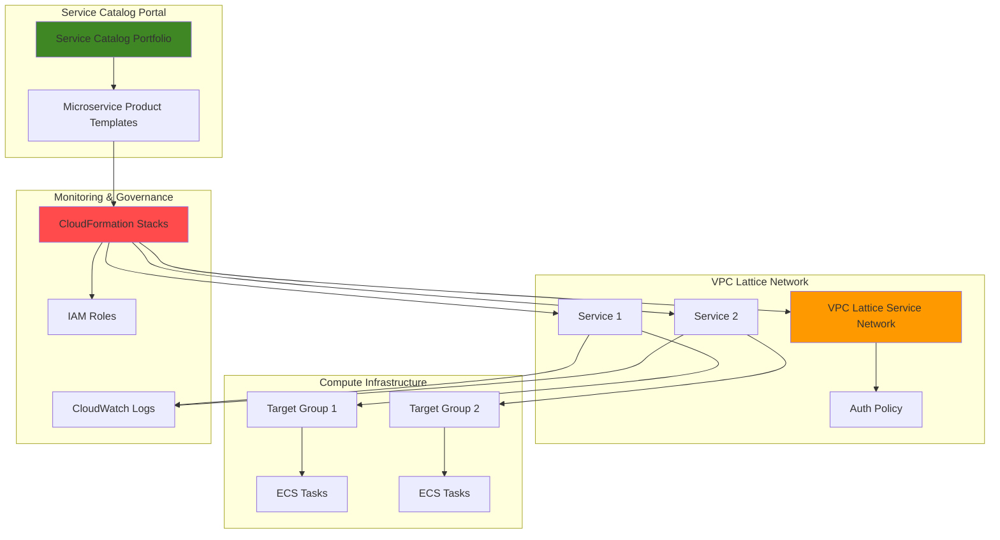

# Standardized Service Deployment with VPC Lattice and Service Catalog

## Problem

Organizations with multiple development teams struggle to maintain consistent microservice deployment patterns, leading to fragmented networking configurations, security inconsistencies, and operational overhead. Teams often deploy services across different VPCs and accounts without standardized governance, creating networking complexity and making service discovery and communication difficult. This results in delayed deployments, security vulnerabilities, and increased operational costs as each team reinvents deployment patterns.

## Solution

Create a self-service deployment portal using AWS Service Catalog that enables teams to deploy standardized microservices with built-in VPC Lattice networking, monitoring, and security configurations. This approach combines Service Catalog's governance capabilities with VPC Lattice's application networking features to provide consistent, secure, and scalable service deployments. Teams can deploy services through a standardized catalog while automatically receiving proper networking, security policies, and observability features.

## Architecture Diagram



## Prerequisites

1. AWS account with VPC Lattice and Service Catalog permissions
2. AWS CLI v2 installed and configured (or CloudShell access)
3. Basic understanding of microservices architecture and CloudFormation
4. Existing VPC with subnets for ECS task deployment
5. Estimated cost: $15-25/month for the infrastructure created (ECS tasks, VPC Lattice service network, CloudWatch logs)

> **Note**: VPC Lattice charges are based on service network hours and data processing. Review [VPC Lattice pricing](https://aws.amazon.com/vpc-lattice/pricing/) for detailed cost information.

## Preparation

```bash
# Set AWS environment variables
export AWS_REGION=$(aws configure get region)
export AWS_ACCOUNT_ID=$(aws sts get-caller-identity \
    --query Account --output text)

# Generate unique identifiers for resources
RANDOM_SUFFIX=$(aws secretsmanager get-random-password \
    --exclude-punctuation --exclude-uppercase \
    --password-length 6 --require-each-included-type \
    --output text --query RandomPassword)

# Set project-specific variables
export SERVICE_CATALOG_PORTFOLIO_NAME="microservice-deployment-portfolio-${RANDOM_SUFFIX}"
export VPC_LATTICE_NETWORK_NAME="microservice-network-${RANDOM_SUFFIX}"
export IAM_ROLE_NAME="ServiceCatalogLaunchRole-${RANDOM_SUFFIX}"

# Get default VPC information for the demo
export DEFAULT_VPC_ID=$(aws ec2 describe-vpcs \
    --filters "Name=is-default,Values=true" \
    --query "Vpcs[0].VpcId" --output text)

export SUBNET_IDS=$(aws ec2 describe-subnets \
    --filters "Name=vpc-id,Values=${DEFAULT_VPC_ID}" \
    --query "Subnets[*].SubnetId" --output text | tr '\t' ',')

echo "✅ AWS environment configured"
echo "   Region: ${AWS_REGION}"
echo "   Account: ${AWS_ACCOUNT_ID}"
echo "   Portfolio: ${SERVICE_CATALOG_PORTFOLIO_NAME}"
```

## Steps

1. **Create IAM Role for Service Catalog Launch Constraint**:

   Service Catalog requires an IAM role with sufficient permissions to launch the CloudFormation resources defined in product templates. This launch constraint role ensures that end users can deploy products without requiring direct IAM permissions for all underlying AWS services, following the principle of least privilege while enabling self-service deployment capabilities.

   ```bash
   # Create trust policy for Service Catalog
   cat > trust-policy.json << 'EOF'
   {
       "Version": "2012-10-17",
       "Statement": [
           {
               "Effect": "Allow",
               "Principal": {
                   "Service": "servicecatalog.amazonaws.com"
               },
               "Action": "sts:AssumeRole"
           }
       ]
   }
   EOF
   
   # Create the IAM role
   aws iam create-role \
       --role-name ${IAM_ROLE_NAME} \
       --assume-role-policy-document file://trust-policy.json \
       --description "Service Catalog launch role for microservice deployment"
   
   # Attach necessary policies for VPC Lattice and ECS
   aws iam attach-role-policy \
       --role-name ${IAM_ROLE_NAME} \
       --policy-arn arn:aws:iam::aws:policy/AmazonVPCLatticeFullAccess
   
   aws iam attach-role-policy \
       --role-name ${IAM_ROLE_NAME} \
       --policy-arn arn:aws:iam::aws:policy/AmazonECS_FullAccess
   
   aws iam attach-role-policy \
       --role-name ${IAM_ROLE_NAME} \
       --policy-arn arn:aws:iam::aws:policy/CloudWatchLogsFullAccess
   
   export LAUNCH_ROLE_ARN="arn:aws:iam::${AWS_ACCOUNT_ID}:role/${IAM_ROLE_NAME}"
   
   echo "✅ IAM launch role created: ${LAUNCH_ROLE_ARN}"
   ```

   The launch role now has the necessary permissions to create VPC Lattice services, ECS tasks, and CloudWatch resources on behalf of end users. This approach maintains security while enabling self-service capabilities through Service Catalog.

2. **Create VPC Lattice Service Network**:

   VPC Lattice service networks provide the foundational networking layer that connects microservices across VPCs and accounts. Creating the service network first establishes the logical boundary where all standardized services will be deployed, enabling consistent service-to-service communication, security policies, and observability across the entire microservice ecosystem.

   ```bash
   # Create VPC Lattice service network
   aws vpc-lattice create-service-network \
       --name ${VPC_LATTICE_NETWORK_NAME} \
       --auth-type "AWS_IAM" \
       --tags Key=Environment,Value=Demo \
              Key=Purpose,Value=StandardizedDeployment
   
   # Get the service network details
   export SERVICE_NETWORK_ARN=$(aws vpc-lattice list-service-networks \
       --query "items[?name=='${VPC_LATTICE_NETWORK_NAME}'].arn" \
       --output text)
   
   export SERVICE_NETWORK_ID=$(aws vpc-lattice list-service-networks \
       --query "items[?name=='${VPC_LATTICE_NETWORK_NAME}'].id" \
       --output text)
   
   echo "✅ VPC Lattice service network created"
   echo "   Network ARN: ${SERVICE_NETWORK_ARN}"
   echo "   Network ID: ${SERVICE_NETWORK_ID}"
   ```

   The service network is now ready to host microservices with AWS IAM authentication, providing secure and scalable service-to-service communication across your infrastructure.

3. **Associate VPC with Service Network**:

   Associating the VPC with the VPC Lattice service network enables resources within the VPC to communicate with services registered in the network. This step establishes the connectivity foundation that allows ECS tasks and other compute resources to participate in the service mesh without complex networking configurations or load balancer management.

   ```bash
   # Associate VPC with the service network
   aws vpc-lattice create-service-network-vpc-association \
       --service-network-identifier ${SERVICE_NETWORK_ID} \
       --vpc-identifier ${DEFAULT_VPC_ID} \
       --tags Key=Environment,Value=Demo
   
   # Store the association ID for cleanup
   export VPC_ASSOCIATION_ID=$(aws vpc-lattice list-service-network-vpc-associations \
       --service-network-identifier ${SERVICE_NETWORK_ID} \
       --query "items[?vpcId=='${DEFAULT_VPC_ID}'].id" \
       --output text)
   
   echo "✅ VPC associated with service network"
   echo "   Association ID: ${VPC_ASSOCIATION_ID}"
   ```

   The VPC association enables seamless service discovery and communication for all resources deployed within the network through VPC Lattice's built-in service mesh capabilities.

4. **Create CloudFormation Template for Microservice Product**:

   This CloudFormation template defines the standardized microservice deployment pattern that teams will use through Service Catalog. The template includes VPC Lattice service creation, ECS task definitions, target groups, and CloudWatch logging configurations, ensuring every deployed service follows organizational standards for networking, security, and observability.

   ```bash
   # Create CloudFormation template for microservice deployment
   cat > microservice-template.yaml << 'EOF'
   AWSTemplateFormatVersion: '2010-09-09'
   Description: 'Standardized microservice deployment with VPC Lattice'
   
   Parameters:
     ServiceName:
       Type: String
       Description: Name of the microservice
       Default: demo-service
     
     ServicePort:
       Type: Number
       Description: Port on which the service listens
       Default: 80
     
     ServiceNetworkId:
       Type: String
       Description: VPC Lattice Service Network ID
     
     VpcId:
       Type: String
       Description: VPC ID for deployment
     
     SubnetIds:
       Type: CommaDelimitedList
       Description: Subnet IDs for ECS tasks
   
   Resources:
     # CloudWatch Log Group
     ServiceLogGroup:
       Type: AWS::Logs::LogGroup
       Properties:
         LogGroupName: !Sub '/aws/ecs/${ServiceName}'
         RetentionInDays: 30
     
     # ECS Cluster
     ECSCluster:
       Type: AWS::ECS::Cluster
       Properties:
         ClusterName: !Sub '${ServiceName}-cluster'
         CapacityProviders:
           - FARGATE
         DefaultCapacityProviderStrategy:
           - CapacityProvider: FARGATE
             Weight: 1
     
     # ECS Task Definition
     TaskDefinition:
       Type: AWS::ECS::TaskDefinition
       Properties:
         Family: !Sub '${ServiceName}-task'
         NetworkMode: awsvpc
         RequiresCompatibilities:
           - FARGATE
         Cpu: 256
         Memory: 512
         ExecutionRoleArn: !Sub 'arn:aws:iam::${AWS::AccountId}:role/ecsTaskExecutionRole'
         ContainerDefinitions:
           - Name: !Ref ServiceName
             Image: httpd:2.4
             PortMappings:
               - ContainerPort: !Ref ServicePort
                 Protocol: tcp
             LogConfiguration:
               LogDriver: awslogs
               Options:
                 awslogs-group: !Ref ServiceLogGroup
                 awslogs-region: !Ref AWS::Region
                 awslogs-stream-prefix: ecs
     
     # VPC Lattice Target Group
     TargetGroup:
       Type: AWS::VpcLattice::TargetGroup
       Properties:
         Name: !Sub '${ServiceName}-targets'
         Type: IP
         Port: !Ref ServicePort
         Protocol: HTTP
         VpcIdentifier: !Ref VpcId
         HealthCheck:
           Enabled: true
           Path: /
           Protocol: HTTP
           Port: !Ref ServicePort
           HealthCheckIntervalSeconds: 30
           HealthCheckTimeoutSeconds: 5
           HealthyThresholdCount: 2
           UnhealthyThresholdCount: 3
         Tags:
           - Key: Service
             Value: !Ref ServiceName
     
     # VPC Lattice Service
     LatticeService:
       Type: AWS::VpcLattice::Service
       Properties:
         Name: !Ref ServiceName
         AuthType: AWS_IAM
         Tags:
           - Key: Environment
             Value: Demo
     
     # VPC Lattice Listener
     ServiceListener:
       Type: AWS::VpcLattice::Listener
       Properties:
         ServiceIdentifier: !Ref LatticeService
         Protocol: HTTP
         Port: !Ref ServicePort
         DefaultAction:
           Forward:
             TargetGroups:
               - TargetGroupIdentifier: !Ref TargetGroup
                 Weight: 100
     
     # Associate service with network
     ServiceNetworkAssociation:
       Type: AWS::VpcLattice::ServiceNetworkServiceAssociation
       Properties:
         ServiceNetworkIdentifier: !Ref ServiceNetworkId
         ServiceIdentifier: !Ref LatticeService
     
     # ECS Service
     ECSService:
       Type: AWS::ECS::Service
       Properties:
         ServiceName: !Sub '${ServiceName}-ecs'
         Cluster: !Ref ECSCluster
         TaskDefinition: !Ref TaskDefinition
         DesiredCount: 2
         LaunchType: FARGATE
         NetworkConfiguration:
           AwsvpcConfiguration:
             SecurityGroups:
               - !Ref ServiceSecurityGroup
             Subnets: !Ref SubnetIds
             AssignPublicIp: ENABLED
         LoadBalancers:
           - TargetGroupArn: !Ref TargetGroup
             ContainerName: !Ref ServiceName
             ContainerPort: !Ref ServicePort
     
     # Security Group for ECS tasks
     ServiceSecurityGroup:
       Type: AWS::EC2::SecurityGroup
       Properties:
         GroupDescription: !Sub 'Security group for ${ServiceName}'
         VpcId: !Ref VpcId
         SecurityGroupIngress:
           - IpProtocol: tcp
             FromPort: !Ref ServicePort
             ToPort: !Ref ServicePort
             CidrIp: 0.0.0.0/0
         Tags:
           - Key: Name
             Value: !Sub '${ServiceName}-sg'
   
   Outputs:
     ServiceId:
       Description: VPC Lattice Service ID
       Value: !Ref LatticeService
     
     ServiceArn:
       Description: VPC Lattice Service ARN
       Value: !GetAtt LatticeService.Arn
     
     ECSClusterName:
       Description: ECS Cluster Name
       Value: !Ref ECSCluster
   EOF
   
   echo "✅ CloudFormation template created for microservice deployment"
   ```

   This template provides a comprehensive standardized deployment pattern that includes VPC Lattice networking, ECS container hosting, health checks, and centralized logging, ensuring consistency across all deployed microservices.

5. **Create Service Catalog Portfolio**:

   The Service Catalog portfolio serves as the organizational container for standardized deployment products, enabling centralized governance and access control. Creating a portfolio allows administrators to group related products, apply consistent constraints, and distribute deployment capabilities to development teams while maintaining organizational standards and compliance requirements.

   ```bash
   # Create Service Catalog portfolio
   aws servicecatalog create-portfolio \
       --display-name "${SERVICE_CATALOG_PORTFOLIO_NAME}" \
       --description "Standardized microservice deployment templates with VPC Lattice" \
       --provider-name "Platform Engineering Team" \
       --tags Key=Environment,Value=Demo \
              Key=Purpose,Value=StandardizedDeployment
   
   # Get portfolio details
   export PORTFOLIO_ID=$(aws servicecatalog list-portfolios \
       --query "PortfolioDetails[?DisplayName=='${SERVICE_CATALOG_PORTFOLIO_NAME}'].Id" \
       --output text)
   
   echo "✅ Service Catalog portfolio created"
   echo "   Portfolio ID: ${PORTFOLIO_ID}"
   ```

   The portfolio is now ready to host standardized microservice deployment products that development teams can use for self-service deployments.

6. **Create Service Catalog Product**:

   Creating the Service Catalog product makes the standardized microservice template available to end users through a self-service portal. This product encapsulates all the complexity of VPC Lattice networking, ECS deployment, and monitoring configuration into a simple interface that development teams can use to deploy services consistently across the organization.

   ```bash
   # Upload CloudFormation template to S3 for Service Catalog
   aws s3 mb s3://service-catalog-templates-${RANDOM_SUFFIX} \
       --region ${AWS_REGION}
   
   aws s3 cp microservice-template.yaml \
       s3://service-catalog-templates-${RANDOM_SUFFIX}/microservice-template.yaml
   
   export TEMPLATE_URL="https://service-catalog-templates-${RANDOM_SUFFIX}.s3.${AWS_REGION}.amazonaws.com/microservice-template.yaml"
   
   # Create Service Catalog product
   aws servicecatalog create-product \
       --name "Standardized Microservice" \
       --description "Deploy microservices with VPC Lattice networking and ECS hosting" \
       --owner "Platform Engineering Team" \
       --product-type "CLOUD_FORMATION_TEMPLATE" \
       --provisioning-artifact-parameters \
           Name="v1.0",Description="Initial version with VPC Lattice integration",Info="{\"LoadTemplateFromURL\":\"${TEMPLATE_URL}\"}" \
       --tags Key=Environment,Value=Demo
   
   # Get product details
   export PRODUCT_ID=$(aws servicecatalog search-products-as-admin \
       --query "ProductViewDetails[?ProductViewSummary.Name=='Standardized Microservice'].ProductViewSummary.ProductId" \
       --output text)
   
   # Associate product with portfolio
   aws servicecatalog associate-product-with-portfolio \
       --product-id ${PRODUCT_ID} \
       --portfolio-id ${PORTFOLIO_ID}
   
   echo "✅ Service Catalog product created and associated with portfolio"
   echo "   Product ID: ${PRODUCT_ID}"
   ```

   The standardized microservice product is now available in the portfolio, ready for teams to deploy consistent, governed microservices with built-in VPC Lattice networking.

7. **Add Launch Constraint to Portfolio**:

   Launch constraints define the IAM role that Service Catalog uses to provision resources on behalf of end users. This security mechanism allows users to deploy products without requiring direct permissions for all underlying AWS services, implementing the principle of least privilege while enabling self-service capabilities through the platform.

   ```bash
   # Add launch constraint to the portfolio
   aws servicecatalog create-constraint \
       --portfolio-id ${PORTFOLIO_ID} \
       --product-id ${PRODUCT_ID} \
       --parameters RoleArn=${LAUNCH_ROLE_ARN} \
       --type "LAUNCH" \
       --description "Launch role for microservice deployment"
   
   echo "✅ Launch constraint added to portfolio"
   echo "   Using role: ${LAUNCH_ROLE_ARN}"
   ```

   The launch constraint ensures secure, controlled deployment of microservices while maintaining the self-service experience for development teams.

8. **Grant Portfolio Access to Current User**:

   Granting access to the portfolio enables end users to discover and launch standardized microservice products through the Service Catalog console. This step demonstrates how administrators can control access to deployment capabilities while enabling teams to self-serve their infrastructure needs through approved, standardized templates.

   ```bash
   # Get current user ARN
   export CURRENT_USER_ARN=$(aws sts get-caller-identity --query Arn --output text)
   
   # Grant portfolio access to current user
   aws servicecatalog associate-principal-with-portfolio \
       --portfolio-id ${PORTFOLIO_ID} \
       --principal-arn ${CURRENT_USER_ARN} \
       --principal-type "IAM"
   
   echo "✅ Portfolio access granted to current user"
   echo "   User ARN: ${CURRENT_USER_ARN}"
   ```

   The current user now has access to deploy standardized microservices through the Service Catalog portal, demonstrating the end-user self-service experience.

9. **Deploy Test Microservice through Service Catalog**:

   Deploying a test microservice validates the complete standardized deployment workflow and demonstrates the end-user experience. This deployment creates a fully functional microservice with VPC Lattice networking, ECS hosting, health checks, and monitoring, showcasing how teams can quickly deploy services following organizational standards.

   ```bash
   # Deploy test microservice through Service Catalog
   aws servicecatalog provision-product \
       --product-id ${PRODUCT_ID} \
       --provisioned-product-name "demo-microservice-${RANDOM_SUFFIX}" \
       --provisioning-parameters \
           Key=ServiceName,Value="demo-service-${RANDOM_SUFFIX}" \
           Key=ServicePort,Value=80 \
           Key=ServiceNetworkId,Value=${SERVICE_NETWORK_ID} \
           Key=VpcId,Value=${DEFAULT_VPC_ID} \
           Key=SubnetIds,Value="\"${SUBNET_IDS}\""
   
   # Wait for provisioning to complete
   echo "Waiting for service deployment to complete (this may take 5-10 minutes)..."
   
   # Get provisioned product details
   export PROVISIONED_PRODUCT_ID=$(aws servicecatalog search-provisioned-products \
       --query "ProvisionedProducts[?Name=='demo-microservice-${RANDOM_SUFFIX}'].Id" \
       --output text)
   
   echo "✅ Test microservice deployment initiated"
   echo "   Provisioned Product ID: ${PROVISIONED_PRODUCT_ID}"
   ```

   The standardized microservice deployment is now in progress, demonstrating how teams can quickly deploy consistent, governed infrastructure through the self-service portal.

## Validation & Testing

1. **Verify Service Catalog Portfolio and Product**:

   ```bash
   # Check portfolio status
   aws servicecatalog describe-portfolio --id ${PORTFOLIO_ID}
   
   # List products in portfolio
   aws servicecatalog search-products-as-admin \
       --portfolio-id ${PORTFOLIO_ID} \
       --query "ProductViewDetails[*].ProductViewSummary.{Name:Name,Id:ProductId}"
   ```

   Expected output: Portfolio details and associated microservice product information.

2. **Verify VPC Lattice Service Network Configuration**:

   ```bash
   # Check service network status
   aws vpc-lattice get-service-network --service-network-identifier ${SERVICE_NETWORK_ID}
   
   # List services in the network
   aws vpc-lattice list-service-network-service-associations \
       --service-network-identifier ${SERVICE_NETWORK_ID}
   ```

   Expected output: Service network details and associated services.

3. **Test Microservice Deployment Status**:

   ```bash
   # Check provisioned product status
   aws servicecatalog describe-provisioned-product \
       --id ${PROVISIONED_PRODUCT_ID} \
       --query "ProvisionedProductDetail.{Name:Name,Status:Status,Type:Type}"
   
   # Get CloudFormation stack outputs if deployment succeeded
   aws servicecatalog get-provisioned-product-outputs \
       --provisioned-product-id ${PROVISIONED_PRODUCT_ID} \
       --query "Outputs[*].{Key:OutputKey,Value:OutputValue}"
   ```

   Expected output: Provisioned product status showing "AVAILABLE" and stack outputs with service details.

4. **Verify ECS Service and VPC Lattice Integration**:

   ```bash
   # List ECS services in the region
   aws ecs list-services --query "serviceArns[?contains(@, 'demo-service')]"
   
   # Check VPC Lattice services
   aws vpc-lattice list-services \
       --query "items[?contains(name, 'demo-service')]"
   ```

   Expected output: Running ECS services and corresponding VPC Lattice services.

## Cleanup

1. **Terminate Provisioned Products**:

   ```bash
   # Terminate the test microservice deployment
   aws servicecatalog terminate-provisioned-product \
       --provisioned-product-id ${PROVISIONED_PRODUCT_ID}
   
   echo "✅ Provisioned product termination initiated"
   echo "Waiting for termination to complete before proceeding with cleanup..."
   sleep 30
   ```

2. **Remove Service Catalog Configuration**:

   ```bash
   # Remove principal association
   aws servicecatalog disassociate-principal-from-portfolio \
       --portfolio-id ${PORTFOLIO_ID} \
       --principal-arn ${CURRENT_USER_ARN}
   
   # Remove product from portfolio
   aws servicecatalog disassociate-product-from-portfolio \
       --product-id ${PRODUCT_ID} \
       --portfolio-id ${PORTFOLIO_ID}
   
   # Delete product
   aws servicecatalog delete-product --id ${PRODUCT_ID}
   
   # Delete portfolio
   aws servicecatalog delete-portfolio --id ${PORTFOLIO_ID}
   
   echo "✅ Service Catalog resources cleaned up"
   ```

3. **Remove VPC Lattice Resources**:

   ```bash
   # Remove VPC association (after services are terminated)
   aws vpc-lattice delete-service-network-vpc-association \
       --service-network-vpc-association-identifier ${VPC_ASSOCIATION_ID}
   
   # Delete service network
   aws vpc-lattice delete-service-network \
       --service-network-identifier ${SERVICE_NETWORK_ID}
   
   echo "✅ VPC Lattice resources cleaned up"
   ```

4. **Remove IAM Role and S3 Bucket**:

   ```bash
   # Detach policies from IAM role
   aws iam detach-role-policy \
       --role-name ${IAM_ROLE_NAME} \
       --policy-arn arn:aws:iam::aws:policy/AmazonVPCLatticeFullAccess
   
   aws iam detach-role-policy \
       --role-name ${IAM_ROLE_NAME} \
       --policy-arn arn:aws:iam::aws:policy/AmazonECS_FullAccess
   
   aws iam detach-role-policy \
       --role-name ${IAM_ROLE_NAME} \
       --policy-arn arn:aws:iam::aws:policy/CloudWatchLogsFullAccess
   
   # Delete IAM role
   aws iam delete-role --role-name ${IAM_ROLE_NAME}
   
   # Clean up S3 bucket
   aws s3 rm s3://service-catalog-templates-${RANDOM_SUFFIX} --recursive
   aws s3 rb s3://service-catalog-templates-${RANDOM_SUFFIX}
   
   # Remove local files
   rm -f microservice-template.yaml trust-policy.json
   
   echo "✅ IAM and S3 resources cleaned up"
   ```

## Discussion

This recipe demonstrates the powerful combination of AWS Service Catalog and VPC Lattice to create a standardized, self-service microservice deployment platform. Service Catalog provides the governance layer that enables platform teams to define approved deployment patterns while giving development teams the autonomy to deploy services when needed. VPC Lattice simplifies the networking complexity traditionally associated with microservice architectures by providing application-level networking that works across VPCs and accounts without requiring complex load balancer configurations.

The solution addresses key enterprise challenges including deployment consistency, security governance, and operational overhead. By standardizing the deployment pattern through CloudFormation templates, organizations ensure that every microservice includes proper logging, monitoring, security groups, and networking configurations. The Service Catalog launch constraints provide secure delegation of permissions, allowing teams to deploy infrastructure without requiring broad IAM permissions that could compromise security.

VPC Lattice's service mesh capabilities provide significant architectural benefits over traditional networking approaches. Unlike Application Load Balancers that require complex routing configurations, VPC Lattice automatically handles service discovery, health checking, and traffic routing through its native integration with compute services like ECS, EKS, and Lambda. This approach follows AWS Well-Architected Framework principles by improving operational excellence through automation, enhancing security through built-in IAM integration, and increasing reliability through managed service capabilities. The [AWS Well-Architected Framework](https://docs.aws.amazon.com/wellarchitected/latest/framework/welcome.html) provides comprehensive guidance on implementing these architectural principles.

The standardized approach enables organizations to implement consistent observability and security policies across all microservices. CloudWatch integration provides centralized logging and monitoring, while VPC Lattice's AWS IAM authentication ensures secure service-to-service communication. This pattern scales effectively as teams can deploy multiple services through the same standardized template while maintaining organizational governance and compliance requirements. For detailed implementation guidance, refer to the [VPC Lattice User Guide](https://docs.aws.amazon.com/vpc-lattice/latest/ug/what-is-vpc-lattice.html) and [Service Catalog Administrator Guide](https://docs.aws.amazon.com/servicecatalog/latest/adminguide/introduction.html).

> **Tip**: Consider implementing additional Service Catalog constraints such as template constraints to limit instance types or notification constraints to alert administrators of deployments. The [Service Catalog constraints documentation](https://docs.aws.amazon.com/servicecatalog/latest/adminguide/constraints.html) provides detailed guidance on available constraint types.

## Challenge

Extend this solution by implementing these enhancements:

1. **Multi-Environment Support**: Modify the CloudFormation template to support multiple environments (dev, staging, production) with different configurations and VPC Lattice service networks for each environment.

2. **Advanced Monitoring Integration**: Add AWS X-Ray distributed tracing, custom CloudWatch metrics, and dashboard creation to the standardized template for comprehensive observability across deployed microservices.

3. **Security Policy Automation**: Implement VPC Lattice auth policies through CloudFormation to automatically configure service-to-service authorization rules based on service tags or naming conventions.

4. **GitOps Integration**: Create a CI/CD pipeline that automatically updates Service Catalog products when CloudFormation templates change in source control, enabling version-controlled infrastructure templates.

5. **Cost Optimization Features**: Add AWS Cost Explorer integration and budget alerts to the template, enabling automatic cost tracking and optimization recommendations for each deployed microservice.

## Infrastructure Code

*Infrastructure code will be generated after recipe approval.*