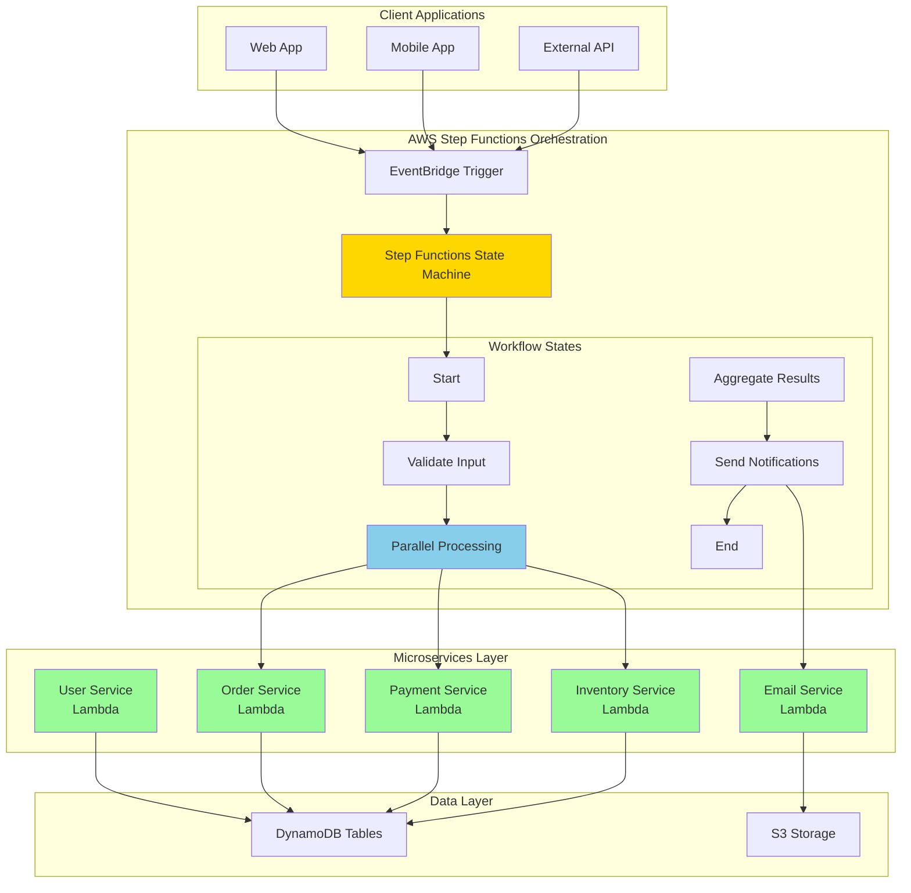

# Step Functions Microservices Orchestration

## Problem

Your organization has transitioned to a microservices architecture where multiple services need to work together to complete complex business workflows. However, coordinating these distributed services manually leads to tight coupling, difficult error handling, inconsistent retry logic, and poor visibility into workflow execution. You need a reliable way to orchestrate service interactions while maintaining loose coupling, implementing robust error handling, and providing clear visibility into execution status across your distributed system.

## Solution

Implement a workflow orchestration system using AWS Step Functions to coordinate microservices interactions through state machines. This solution decouples service coordination from business logic, provides visual workflow monitoring, implements standardized error handling and retry mechanisms, and enables parallel execution paths for improved performance. The Step Functions workflow acts as a central coordinator while maintaining service independence and resilience.

## Architecture Diagram



## Prerequisites

1. AWS account with permissions to create Step Functions, Lambda functions, and IAM roles
2. Basic understanding of state machines and workflow concepts
3. Existing microservices or ability to create Lambda functions
4. AWS CLI v2 installed and configured
5. Understanding of JSON and Amazon States Language (ASL)
6. Estimated cost: $10-15 for Step Functions executions and Lambda invocations during testing

> **Note**: Step Functions charges per state transition. Review [Step Functions pricing](https://aws.amazon.com/step-functions/pricing/) to understand costs for your expected workflow volume.

## Preparation

```bash
# Set environment variables
export AWS_REGION=$(aws configure get region)
export AWS_ACCOUNT_ID=$(aws sts get-caller-identity \
    --query Account --output text)

# Generate unique identifiers for resources
RANDOM_SUFFIX=$(aws secretsmanager get-random-password \
    --exclude-punctuation --exclude-uppercase \
    --password-length 6 --require-each-included-type \
    --output text --query RandomPassword)

export PROJECT_NAME="microservices-stepfn-${RANDOM_SUFFIX}"
export ROLE_NAME="${PROJECT_NAME}-execution-role"
export LAMBDA_ROLE_NAME="${PROJECT_NAME}-lambda-role"

# Create IAM role for Lambda functions
aws iam create-role \
    --role-name $LAMBDA_ROLE_NAME \
    --assume-role-policy-document '{
        "Version": "2012-10-17",
        "Statement": [
            {
                "Effect": "Allow",
                "Principal": {
                    "Service": "lambda.amazonaws.com"
                },
                "Action": "sts:AssumeRole"
            }
        ]
    }'

# Attach basic Lambda execution policy
aws iam attach-role-policy \
    --role-name $LAMBDA_ROLE_NAME \
    --policy-arn arn:aws:iam::aws:policy/service-role/AWSLambdaBasicExecutionRole

# Create IAM role for Step Functions execution
aws iam create-role \
    --role-name $ROLE_NAME \
    --assume-role-policy-document '{
        "Version": "2012-10-17",
        "Statement": [
            {
                "Effect": "Allow",
                "Principal": {
                    "Service": "states.amazonaws.com"
                },
                "Action": "sts:AssumeRole"
            }
        ]
    }'

# Create custom IAM policy for Step Functions execution
cat > stepfunctions-execution-policy.json << 'EOF'
{
    "Version": "2012-10-17",
    "Statement": [
        {
            "Effect": "Allow",
            "Action": [
                "lambda:InvokeFunction"
            ],
            "Resource": "arn:aws:lambda:${AWS_REGION}:${AWS_ACCOUNT_ID}:function:${PROJECT_NAME}-*"
        },
        {
            "Effect": "Allow",
            "Action": [
                "xray:PutTraceSegments",
                "xray:PutTelemetryRecords",
                "xray:GetSamplingRules",
                "xray:GetSamplingTargets"
            ],
            "Resource": "*"
        }
    ]
}
EOF

# Create and attach the policy
aws iam create-policy \
    --policy-name "${PROJECT_NAME}-stepfunctions-policy" \
    --policy-document file://stepfunctions-execution-policy.json

aws iam attach-role-policy \
    --role-name $ROLE_NAME \
    --policy-arn arn:aws:iam::${AWS_ACCOUNT_ID}:policy/${PROJECT_NAME}-stepfunctions-policy

echo "✅ IAM role created: $ROLE_NAME"
```

## Steps

1. **Create User Service Lambda Function**:

   The User Service handles user validation and profile retrieval in our workflow. Lambda provides serverless compute that automatically scales based on demand, making it ideal for microservices architectures. This service will validate user credentials and fetch user profile data needed for order processing.

   ```bash
   # Create user service function
   cat > user-service.py << 'EOF'
import json
import boto3
import random

def lambda_handler(event, context):
    user_id = event.get('userId')
    
    # Simulate user validation
    if not user_id:
        raise Exception("User ID is required")
    
    # Mock user data
    user_data = {
        'userId': user_id,
        'email': f'user{user_id}@example.com',
        'status': 'active',
        'creditScore': random.randint(600, 850)
    }
    
    return {
        'statusCode': 200,
        'body': json.dumps(user_data)
    }
EOF

   # Package and deploy function
   zip user-service.zip user-service.py
   
   aws lambda create-function \
       --function-name "${PROJECT_NAME}-user-service" \
       --runtime python3.12 \
       --role arn:aws:iam::${AWS_ACCOUNT_ID}:role/${LAMBDA_ROLE_NAME} \
       --handler user-service.lambda_handler \
       --zip-file fileb://user-service.zip \
       --timeout 30
   
   echo "✅ User Service Lambda created successfully"
   ```

   The User Service is now deployed and ready to validate users in our workflow. This establishes the foundation for user-centric business processes and enables secure access control throughout the microservices ecosystem.

2. **Create Order Service Lambda Function**:

   The Order Service manages order creation and validation logic. This microservice demonstrates how Step Functions can coordinate business operations while maintaining service independence. Orders require complex validation including inventory checks and payment authorization.

   ```bash
   # Create order service function
   cat > order-service.py << 'EOF'
import json
import uuid
import datetime

def lambda_handler(event, context):
    order_data = event.get('orderData', {})
    user_data = event.get('userData', {})
    
    # Validate order requirements
    if not order_data.get('items'):
        raise Exception("Order items are required")
    
    # Create order
    order = {
        'orderId': str(uuid.uuid4()),
        'userId': user_data.get('userId'),
        'items': order_data.get('items'),
        'total': sum(item.get('price', 0) for item in order_data.get('items', [])),
        'status': 'pending',
        'created': datetime.datetime.utcnow().isoformat()
    }
    
    return {
        'statusCode': 200,
        'body': json.dumps(order)
    }
EOF

   zip order-service.zip order-service.py
   
   aws lambda create-function \
       --function-name "${PROJECT_NAME}-order-service" \
       --runtime python3.12 \
       --role arn:aws:iam::${AWS_ACCOUNT_ID}:role/${LAMBDA_ROLE_NAME} \
       --handler order-service.lambda_handler \
       --zip-file fileb://order-service.zip \
       --timeout 30
   
   echo "✅ Order Service Lambda created successfully"
   ```

   The Order Service can now process order requests with proper validation and unique ID generation. This service integrates with user data from the previous step and prepares order information for downstream payment and inventory services.

3. **Create Payment Service Lambda Function**:

   The Payment Service handles payment processing and authorization. This critical microservice demonstrates error handling patterns and external system integration. Payment processing requires secure handling of sensitive data and robust error recovery mechanisms.

   ```bash
   # Create payment service function
   cat > payment-service.py << 'EOF'
import json
import random

def lambda_handler(event, context):
    order_data = event.get('orderData', {})
    user_data = event.get('userData', {})
    
    order_total = order_data.get('total', 0)
    credit_score = user_data.get('creditScore', 600)
    
    # Simulate payment processing
    if order_total > 1000 and credit_score < 650:
        raise Exception("Payment declined: Insufficient credit rating")
    
    # Simulate random payment failures
    if random.random() < 0.1:  # 10% failure rate
        raise Exception("Payment gateway timeout")
    
    payment_result = {
        'transactionId': f"txn_{random.randint(100000, 999999)}",
        'amount': order_total,
        'status': 'authorized',
        'method': 'credit_card'
    }
    
    return {
        'statusCode': 200,
        'body': json.dumps(payment_result)
    }
EOF

   zip payment-service.zip payment-service.py
   
   aws lambda create-function \
       --function-name "${PROJECT_NAME}-payment-service" \
       --runtime python3.12 \
       --role arn:aws:iam::${AWS_ACCOUNT_ID}:role/${LAMBDA_ROLE_NAME} \
       --handler payment-service.lambda_handler \
       --zip-file fileb://payment-service.zip \
       --timeout 30
   
   echo "✅ Payment Service Lambda created successfully"
   ```

   The Payment Service now handles transaction processing with built-in business logic for credit evaluation and error simulation. This service demonstrates how Step Functions can manage complex business rules and error conditions across distributed systems.

4. **Create Inventory Service Lambda Function**:

   The Inventory Service manages stock levels and reservation logic. This service showcases parallel processing capabilities where inventory checks can occur simultaneously with payment processing. Inventory management is critical for accurate order fulfillment and customer satisfaction.

   ```bash
   # Create inventory service function
   cat > inventory-service.py << 'EOF'
import json
import random

def lambda_handler(event, context):
    order_data = event.get('orderData', {})
    
    items = order_data.get('items', [])
    inventory_results = []
    
    for item in items:
        # Simulate inventory check
        available_qty = random.randint(0, 100)
        requested_qty = item.get('quantity', 1)
        
        if available_qty >= requested_qty:
            inventory_results.append({
                'productId': item.get('productId'),
                'status': 'reserved',
                'quantity': requested_qty
            })
        else:
            raise Exception(f"Insufficient inventory for product {item.get('productId')}")
    
    return {
        'statusCode': 200,
        'body': json.dumps({
            'reservations': inventory_results,
            'status': 'confirmed'
        })
    }
EOF

   zip inventory-service.zip inventory-service.py
   
   aws lambda create-function \
       --function-name "${PROJECT_NAME}-inventory-service" \
       --runtime python3.12 \
       --role arn:aws:iam::${AWS_ACCOUNT_ID}:role/${LAMBDA_ROLE_NAME} \
       --handler inventory-service.lambda_handler \
       --zip-file fileb://inventory-service.zip \
       --timeout 30
   
   echo "✅ Inventory Service Lambda created successfully"
   ```

   The Inventory Service can now validate stock availability and reserve items for orders. This service integrates with the parallel processing pattern in Step Functions, enabling efficient resource utilization and faster order processing.

5. **Create Notification Service Lambda Function**:

   The Notification Service handles customer communications and order confirmations. This service demonstrates how Step Functions can coordinate post-processing activities after main business logic completes. Reliable notifications are essential for customer experience and business process completion.

   ```bash
   # Create notification service function
   cat > notification-service.py << 'EOF'
import json

def lambda_handler(event, context):
    user_data = event.get('userData', {})
    order_data = event.get('orderData', {})
    payment_data = event.get('paymentData', {})
    
    # Create notification message
    notification = {
        'to': user_data.get('email'),
        'subject': f"Order Confirmation #{order_data.get('orderId')}",
        'message': f"Your order for ${order_data.get('total')} has been confirmed. Transaction ID: {payment_data.get('transactionId')}",
        'status': 'sent'
    }
    
    # In a real implementation, this would send actual notifications
    print(f"Notification sent: {json.dumps(notification)}")
    
    return {
        'statusCode': 200,
        'body': json.dumps(notification)
    }
EOF

   zip notification-service.zip notification-service.py
   
   aws lambda create-function \
       --function-name "${PROJECT_NAME}-notification-service" \
       --runtime python3.12 \
       --role arn:aws:iam::${AWS_ACCOUNT_ID}:role/${LAMBDA_ROLE_NAME} \
       --handler notification-service.lambda_handler \
       --zip-file fileb://notification-service.zip \
       --timeout 30
   
   echo "✅ Notification Service Lambda created successfully"
   ```

   The Notification Service completes our microservices suite and enables customer communication workflows. This service receives aggregated data from previous workflow steps and demonstrates how Step Functions can pass complex data structures between services.

6. **Create Step Functions State Machine Definition**:

   Step Functions uses Amazon States Language (ASL) to define workflow logic. State machines provide visual workflow representation, automatic error handling, and built-in retry mechanisms. This definition coordinates all microservices while maintaining loose coupling and enabling parallel execution for optimal performance.

   ```bash
   # Create state machine definition
   cat > stepfunctions-definition.json << EOF
{
  "Comment": "Microservices orchestration workflow",
  "StartAt": "ValidateInput",
  "States": {
    "ValidateInput": {
      "Type": "Pass",
      "Next": "GetUserData"
    },
    "GetUserData": {
      "Type": "Task",
      "Resource": "arn:aws:states:::lambda:invoke",
      "Parameters": {
        "FunctionName": "${PROJECT_NAME}-user-service",
        "Payload.$": "$"
      },
      "ResultPath": "$.userResult",
      "Retry": [
        {
          "ErrorEquals": ["States.TaskFailed"],
          "IntervalSeconds": 2,
          "MaxAttempts": 3,
          "BackoffRate": 2
        }
      ],
      "Next": "ProcessOrderAndPayment"
    },
    "ProcessOrderAndPayment": {
      "Type": "Parallel",
      "Branches": [
        {
          "StartAt": "CreateOrder",
          "States": {
            "CreateOrder": {
              "Type": "Task",
              "Resource": "arn:aws:states:::lambda:invoke",
              "Parameters": {
                "FunctionName": "${PROJECT_NAME}-order-service",
                "Payload": {
                  "orderData.$": "$.orderData",
                  "userData.$": "$.userResult.Payload"
                }
              },
              "End": true
            }
          }
        },
        {
          "StartAt": "ProcessPayment",
          "States": {
            "ProcessPayment": {
              "Type": "Task",
              "Resource": "arn:aws:states:::lambda:invoke",
              "Parameters": {
                "FunctionName": "${PROJECT_NAME}-payment-service",
                "Payload": {
                  "orderData.$": "$.orderData",
                  "userData.$": "$.userResult.Payload"
                }
              },
              "Retry": [
                {
                  "ErrorEquals": ["States.TaskFailed"],
                  "IntervalSeconds": 1,
                  "MaxAttempts": 2
                }
              ],
              "End": true
            }
          }
        },
        {
          "StartAt": "CheckInventory",
          "States": {
            "CheckInventory": {
              "Type": "Task",
              "Resource": "arn:aws:states:::lambda:invoke",
              "Parameters": {
                "FunctionName": "${PROJECT_NAME}-inventory-service",
                "Payload": {
                  "orderData.$": "$.orderData"
                }
              },
              "End": true
            }
          }
        }
      ],
      "Next": "SendNotification"
    },
    "SendNotification": {
      "Type": "Task",
      "Resource": "arn:aws:states:::lambda:invoke",
      "Parameters": {
        "FunctionName": "${PROJECT_NAME}-notification-service",
        "Payload": {
          "userData.$": "$.userResult.Payload",
          "orderData.$": "$[0].Payload",
          "paymentData.$": "$[1].Payload"
        }
      },
      "End": true
    }
  }
}
EOF

   echo "✅ Step Functions definition created"
   ```

   The state machine definition now implements a complete microservices orchestration pattern with parallel processing, error handling, and data flow management. This workflow coordinates all services while maintaining resilience and providing clear execution visibility.

7. **Deploy Step Functions State Machine**:

   Creating the Step Functions state machine establishes the central orchestration layer for your microservices architecture. Step Functions provides built-in monitoring, logging, and visual workflow tracking that gives operations teams complete visibility into business process execution.

   ```bash
   # Create Step Functions state machine
   aws stepfunctions create-state-machine \
       --name "${PROJECT_NAME}-workflow" \
       --definition file://stepfunctions-definition.json \
       --role-arn arn:aws:iam::${AWS_ACCOUNT_ID}:role/${ROLE_NAME}
   
   # Get state machine ARN
   export STATE_MACHINE_ARN=$(aws stepfunctions list-state-machines \
       --query "stateMachines[?name=='${PROJECT_NAME}-workflow'].stateMachineArn" \
       --output text)
   
   echo "✅ Step Functions state machine deployed: $STATE_MACHINE_ARN"
   ```

   The state machine is now operational and ready to orchestrate microservices workflows. This centralized coordination layer provides the foundation for reliable, scalable business process automation across your distributed architecture.

8. **Create EventBridge Rule for Workflow Triggering**:

   EventBridge enables event-driven architecture patterns by automatically triggering workflows based on business events. This integration allows your microservices orchestration to respond to real-time events from applications, external systems, or scheduled triggers without requiring direct API calls.

   ```bash
   # Create EventBridge rule
   aws events put-rule \
       --name "${PROJECT_NAME}-trigger" \
       --event-pattern '{
         "source": ["microservices.orders"],
         "detail-type": ["Order Submitted"]
       }' \
       --state ENABLED
   
   # Add Step Functions as target
   aws events put-targets \
       --rule "${PROJECT_NAME}-trigger" \
       --targets Id=1,Arn=${STATE_MACHINE_ARN},RoleArn=arn:aws:iam::${AWS_ACCOUNT_ID}:role/${ROLE_NAME}
   
   echo "✅ EventBridge rule configured for automatic workflow triggering"
   ```

   EventBridge integration enables your workflow to respond automatically to business events, creating a truly event-driven microservices architecture. This pattern improves system responsiveness and reduces coupling between event producers and workflow execution.

> **Warning**: Ensure Lambda execution roles have proper permissions for DynamoDB, S3, and other services your functions access. Missing permissions will cause workflow failures that may be difficult to debug without proper CloudWatch logging.

## Validation & Testing

1. **Test Individual Lambda Functions**:

   ```bash
   # Test user service
   aws lambda invoke \
       --function-name "${PROJECT_NAME}-user-service" \
       --payload '{"userId": "12345"}' \
       user-response.json
   
   cat user-response.json
   ```

   Expected output: JSON response with user data including userId, email, status, and creditScore fields.

2. **Execute Step Functions Workflow**:

   ```bash
   # Start workflow execution
   aws stepfunctions start-execution \
       --state-machine-arn $STATE_MACHINE_ARN \
       --input '{
         "userId": "12345",
         "orderData": {
           "items": [
             {"productId": "PROD001", "quantity": 2, "price": 29.99},
             {"productId": "PROD002", "quantity": 1, "price": 49.99}
           ]
         }
       }'
   
   # Check execution status
   aws stepfunctions list-executions \
       --state-machine-arn $STATE_MACHINE_ARN \
       --max-items 1
   ```

   Expected output: Execution should complete successfully with status "SUCCEEDED" and show parallel processing of order, payment, and inventory services.

3. **Test EventBridge Integration**:

   ```bash
   # Send test event
   aws events put-events \
       --entries Source=microservices.orders,DetailType="Order Submitted",Detail='{"userId":"12345","orderData":{"items":[{"productId":"PROD001","quantity":1,"price":99.99}]}}'
   
   # Monitor executions
   aws stepfunctions list-executions \
       --state-machine-arn $STATE_MACHINE_ARN
   ```

   Expected output: New execution should appear automatically triggered by the EventBridge event.

> **Tip**: Use the Step Functions console to visualize workflow execution and identify bottlenecks or failures in your microservices orchestration. The visual workflow makes debugging complex interactions much easier.

## Cleanup

1. **Delete Step Functions State Machine**:

   ```bash
   aws stepfunctions delete-state-machine \
       --state-machine-arn $STATE_MACHINE_ARN
   
   echo "✅ Step Functions state machine deleted"
   ```

2. **Remove EventBridge Rule**:

   ```bash
   aws events remove-targets \
       --rule "${PROJECT_NAME}-trigger" \
       --ids 1
   
   aws events delete-rule \
       --name "${PROJECT_NAME}-trigger"
   
   echo "✅ EventBridge rule removed"
   ```

3. **Delete Lambda Functions**:

   ```bash
   # Delete all Lambda functions
   for service in user-service order-service payment-service inventory-service notification-service; do
       aws lambda delete-function \
           --function-name "${PROJECT_NAME}-${service}"
   done
   
   echo "✅ Lambda functions deleted"
   ```

4. **Remove IAM Roles and Policies**:

   ```bash
   # Detach and delete Step Functions execution role
   aws iam detach-role-policy \
       --role-name $ROLE_NAME \
       --policy-arn arn:aws:iam::${AWS_ACCOUNT_ID}:policy/${PROJECT_NAME}-stepfunctions-policy
   
   aws iam delete-policy \
       --policy-arn arn:aws:iam::${AWS_ACCOUNT_ID}:policy/${PROJECT_NAME}-stepfunctions-policy
   
   aws iam delete-role --role-name $ROLE_NAME
   
   # Detach and delete Lambda execution role
   aws iam detach-role-policy \
       --role-name $LAMBDA_ROLE_NAME \
       --policy-arn arn:aws:iam::aws:policy/service-role/AWSLambdaBasicExecutionRole
   
   aws iam delete-role --role-name $LAMBDA_ROLE_NAME
   
   # Clean up local files
   rm -f *.py *.zip *.json user-response.json stepfunctions-execution-policy.json
   
   echo "✅ IAM roles, policies, and local files cleaned up"
   ```

## Discussion

AWS Step Functions provides a powerful serverless orchestration platform that addresses the complexity inherent in microservices architectures. By implementing workflows as state machines, organizations can maintain loose coupling between services while ensuring reliable coordination of business processes. The visual workflow representation makes complex distributed systems easier to understand and debug, while built-in error handling and retry mechanisms provide resilience against transient failures.

The parallel processing capabilities demonstrated in this recipe show how Step Functions can optimize performance by executing independent operations simultaneously. This pattern is particularly valuable for e-commerce and order processing workflows where user validation, payment processing, and inventory checks can occur concurrently rather than sequentially. The result is reduced latency and improved user experience without sacrificing data consistency or reliability.

Step Functions integrates seamlessly with EventBridge to create event-driven architectures that respond automatically to business events. This integration enables reactive systems that scale based on demand and maintain responsiveness to changing business conditions. The combination of these services provides the foundation for modern, cloud-native applications that can adapt to varying workloads while maintaining operational excellence.

Error handling and observability are critical considerations for production microservices orchestration. Step Functions provides comprehensive logging through CloudWatch and detailed execution history that enables rapid troubleshooting. The built-in retry mechanisms with exponential backoff help handle transient failures automatically, while custom error states can implement sophisticated compensation patterns for distributed transaction management. For detailed guidance on error handling patterns, see the [AWS Step Functions Error Handling documentation](https://docs.aws.amazon.com/step-functions/latest/dg/concepts-error-handling.html).

> **Note**: Consider implementing Step Functions Express Workflows for high-volume, short-duration workloads to reduce costs and improve performance. Express Workflows can handle over 100,000 executions per second with lower per-execution costs than Standard Workflows. See the [Express Workflows documentation](https://docs.aws.amazon.com/step-functions/latest/dg/concepts-express-workflows.html) for implementation guidance.

## Challenge

Extend this orchestration recipe by implementing these enhancements:

1. **Implement Saga Pattern**: Add compensating actions for each service operation (rollback inventory reservation, refund payments, cancel orders) that execute automatically when downstream services fail, ensuring data consistency across distributed transactions.

2. **Add Circuit Breaker Logic**: Implement Step Functions states that monitor service failure rates and automatically route traffic away from failing services, preventing cascade failures in your microservices ecosystem.

3. **Create Express Workflows**: Build Step Functions Express workflows for real-time inventory updates triggered by external events, enabling sub-second response times for high-frequency operations.

4. **Implement Advanced Monitoring**: Create CloudWatch dashboards that track workflow success rates, execution duration, service-level error patterns, and business metrics like order completion rates and revenue processing.

5. **Add Human-in-the-Loop**: Integrate Step Functions with manual approval steps for high-value orders, using SNS notifications and callback patterns to pause workflow execution for human review.

## Infrastructure Code

*Infrastructure code will be generated after recipe approval.*