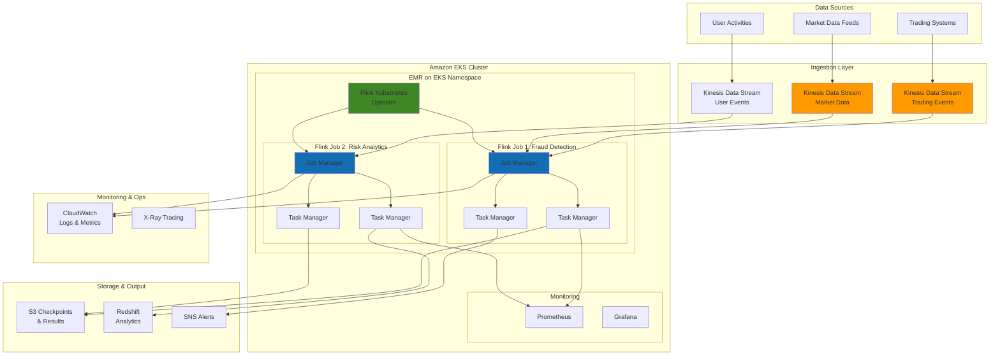

# Analyzing Streaming Data with EMR on EKS and Flink

## Problem

Financial services companies need to process millions of trading transactions in real-time to detect fraud patterns, calculate risk metrics, and trigger automated trading decisions within milliseconds. Traditional batch processing systems introduce unacceptable latency, while managed streaming services may not provide the complex event processing capabilities required for sophisticated financial algorithms. Organizations need a scalable, fault-tolerant streaming analytics platform that can handle complex windowing operations, stateful computations, and exactly-once processing guarantees while maintaining sub-second latency.

## Solution

This recipe implements an enterprise-grade real-time streaming analytics platform using Amazon EMR on EKS with Apache Flink. By deploying Flink jobs on Kubernetes, we achieve horizontal scalability, resource isolation, and operational flexibility. The solution includes the Flink Kubernetes operator for lifecycle management, integration with Kinesis Data Streams for data ingestion, and comprehensive monitoring with Prometheus and CloudWatch. This architecture provides exactly-once processing semantics, advanced windowing capabilities, and automatic scaling for varying workloads.

## Architecture Diagram



## Prerequisites

1. AWS account with permissions to create EKS clusters and EMR virtual clusters
2. AWS CLI v2 installed and configured (or AWS CloudShell)
3. kubectl, eksctl, and Helm installed locally
4. Docker knowledge for custom image building
5. Basic understanding of Apache Flink and stream processing concepts
6. Estimated cost: $150-300 for a 4-hour workshop (includes EKS cluster, EMR charges, and Kinesis streams)

> **Note**: This recipe creates substantial AWS resources. Monitor costs and clean up resources when not needed.

## Preparation

```bash
# Set environment variables for consistent resource naming
export AWS_REGION=$(aws configure get region)
export AWS_ACCOUNT_ID=$(aws sts get-caller-identity \
    --query Account --output text)
export CLUSTER_NAME="emr-flink-analytics"
export EMR_NAMESPACE="emr-flink"

# Generate unique suffix for global resources
export RANDOM_SUFFIX=$(aws secretsmanager get-random-password \
    --exclude-punctuation --exclude-uppercase \
    --password-length 6 --require-each-included-type \
    --output text --query RandomPassword)

# Set derived variables
export BUCKET_NAME="emr-flink-analytics-${RANDOM_SUFFIX}"
export STREAM_NAME_TRADING="trading-events-${RANDOM_SUFFIX}"
export STREAM_NAME_MARKET="market-data-${RANDOM_SUFFIX}"

# Verify required tools are installed
kubectl version --client
eksctl version
helm version

echo "✅ Environment prepared for EMR on EKS with Flink deployment"
```

## Steps

1. **Create EKS Cluster with EMR-optimized Configuration**:

   Amazon EKS provides the foundation for running Apache Flink in a containerized environment, offering automatic scaling, high availability, and seamless integration with AWS services. The EMR-optimized configuration includes specific node groups sized for streaming workloads, OIDC identity provider integration for secure workload identity, and essential add-ons for storage and networking. This setup establishes the Kubernetes platform that will host our Flink operators and streaming applications.

   ```bash
   # Create cluster configuration file
   cat > cluster-config.yaml << EOF
   apiVersion: eksctl.io/v1alpha5
   kind: ClusterConfig
   
   metadata:
     name: ${CLUSTER_NAME}
     region: ${AWS_REGION}
     version: "1.28"
   
   iam:
     withOIDC: true
   
   managedNodeGroups:
     - name: emr-flink-workers
       instanceType: m5.xlarge
       minSize: 2
       maxSize: 10
       desiredCapacity: 4
       volumeSize: 100
       privateNetworking: true
       iam:
         attachPolicyARNs:
           - arn:aws:iam::aws:policy/AmazonEKSWorkerNodePolicy
           - arn:aws:iam::aws:policy/AmazonEKS_CNI_Policy
           - arn:aws:iam::aws:policy/AmazonEC2ContainerRegistryReadOnly
           - arn:aws:iam::aws:policy/AmazonS3FullAccess
         withAddonPolicies:
           ebs: true
           cloudWatch: true
       tags:
         Environment: analytics
         Project: flink-streaming
   
   addons:
     - name: aws-ebs-csi-driver
       version: latest
     - name: vpc-cni
       version: latest
   EOF
   
   # Create the EKS cluster (this takes 15-20 minutes)
   eksctl create cluster -f cluster-config.yaml
   
   echo "✅ EKS cluster created successfully"
   ```

   The EKS cluster is now operational with managed node groups optimized for streaming analytics workloads. The OIDC provider enables secure IAM integration for service accounts, while the EBS CSI driver provides persistent storage for checkpoints. This foundational infrastructure supports the high-throughput, low-latency requirements of real-time stream processing.

2. **Set up IAM Roles for EMR on EKS**:

   IAM roles enable secure, least-privilege access between EMR containers and AWS services without hardcoding credentials. The service role allows EMR on EKS to manage virtual clusters and jobs, while the job execution role provides Flink applications with permissions to access Kinesis, S3, and CloudWatch. Using IAM roles for service accounts (IRSA) with OIDC federation ensures each Flink job receives only the minimal permissions required for its specific function.

   ```bash
   # Create EMR on EKS service role
   cat > emr-trust-policy.json << EOF
   {
     "Version": "2012-10-17",
     "Statement": [
       {
         "Effect": "Allow",
         "Principal": {
           "Service": "emr-containers.amazonaws.com"
         },
         "Action": "sts:AssumeRole"
       }
     ]
   }
   EOF
   
   aws iam create-role \
       --role-name EMRContainersServiceRole \
       --assume-role-policy-document file://emr-trust-policy.json
   
   aws iam attach-role-policy \
       --role-name EMRContainersServiceRole \
       --policy-arn arn:aws:iam::aws:policy/AmazonEMRContainersServiceRolePolicy
   
   # Create job execution role
   OIDC_ISSUER=$(aws eks describe-cluster \
       --name ${CLUSTER_NAME} \
       --query "cluster.identity.oidc.issuer" \
       --output text | sed 's|https://||')
   
   cat > job-execution-trust-policy.json << EOF
   {
     "Version": "2012-10-17",
     "Statement": [
       {
         "Effect": "Allow",
         "Principal": {
           "Federated": "arn:aws:iam::${AWS_ACCOUNT_ID}:oidc-provider/${OIDC_ISSUER}"
         },
         "Action": "sts:AssumeRoleWithWebIdentity",
         "Condition": {
           "StringLike": {
             "${OIDC_ISSUER}:sub": "system:serviceaccount:${EMR_NAMESPACE}:*"
           }
         }
       }
     ]
   }
   EOF
   
   aws iam create-role \
       --role-name EMRFlinkJobExecutionRole \
       --assume-role-policy-document file://job-execution-trust-policy.json
   
   # Attach necessary policies
   aws iam attach-role-policy \
       --role-name EMRFlinkJobExecutionRole \
       --policy-arn arn:aws:iam::aws:policy/AmazonS3FullAccess
   
   aws iam attach-role-policy \
       --role-name EMRFlinkJobExecutionRole \
       --policy-arn arn:aws:iam::aws:policy/AmazonKinesisFullAccess
   
   aws iam attach-role-policy \
       --role-name EMRFlinkJobExecutionRole \
       --policy-arn arn:aws:iam::aws:policy/CloudWatchFullAccess
   
   echo "✅ IAM roles configured for EMR on EKS"
   ```

   The IAM roles are now configured with appropriate trust relationships and permissions. The OIDC-based trust policy enables secure credential assumption without long-lived access keys, while the attached managed policies provide necessary access to AWS services. This security foundation ensures Flink applications can securely interact with data sources and sinks while maintaining compliance and auditability.

3. **Create EMR Virtual Cluster and Install Flink Operator**:

   EMR virtual clusters provide a logical boundary for running EMR jobs on EKS, enabling centralized billing, monitoring, and access control. The virtual cluster maps to a specific Kubernetes namespace and integrates with EMR's job management capabilities. The Flink Kubernetes operator acts as a controller that manages the lifecycle of Flink applications, handling deployments, scaling, savepoints, and upgrades automatically. This combination provides enterprise-grade stream processing with operational simplicity.

   ```bash
   # Create namespace and service account
   kubectl create namespace ${EMR_NAMESPACE}
   
   kubectl create serviceaccount emr-containers-sa-flink-operator \
       -n ${EMR_NAMESPACE}
   
   # Annotate service account with IAM role
   kubectl annotate serviceaccount emr-containers-sa-flink-operator \
       -n ${EMR_NAMESPACE} \
       eks.amazonaws.com/role-arn=arn:aws:iam::${AWS_ACCOUNT_ID}:role/EMRFlinkJobExecutionRole
   
   # Enable EMR on EKS namespace
   eksctl create iamidentitymapping \
       --cluster ${CLUSTER_NAME} \
       --namespace ${EMR_NAMESPACE} \
       --service-name emr-containers
   
   # Create EMR virtual cluster
   VIRTUAL_CLUSTER_ID=$(aws emr-containers create-virtual-cluster \
       --name "flink-analytics-cluster" \
       --container-provider '{
         "id": "'${CLUSTER_NAME}'",
         "type": "EKS",
         "info": {
           "eksInfo": {
             "namespace": "'${EMR_NAMESPACE}'"
           }
         }
       }' \
       --query 'id' --output text)
   
   echo "Virtual Cluster ID: ${VIRTUAL_CLUSTER_ID}"
   
   # Install Flink Kubernetes operator using Helm
   helm repo add flink-operator-repo \
       https://downloads.apache.org/flink/flink-kubernetes-operator-1.7.0/
   helm repo update
   
   helm install flink-kubernetes-operator \
       flink-operator-repo/flink-kubernetes-operator \
       --namespace ${EMR_NAMESPACE} \
       --set image.repository=public.ecr.aws/emr-on-eks/flink/flink-kubernetes-operator \
       --set image.tag=1.7.0-emr-7.0.0
   
   echo "✅ EMR virtual cluster and Flink operator installed"
   ```

   The EMR virtual cluster is now operational and linked to the EKS namespace, enabling managed execution of Flink jobs. The Flink operator is monitoring the namespace for FlinkDeployment resources and is ready to provision job managers and task managers. This setup provides a bridge between EMR's enterprise features and Kubernetes' container orchestration capabilities, creating a robust platform for production streaming workloads.

4. **Create Supporting Infrastructure**:

   Supporting infrastructure provides the data persistence, ingestion, and lifecycle management capabilities essential for streaming analytics. S3 serves as the durable checkpoint storage for Flink's exactly-once processing guarantees and provides cost-optimized storage through intelligent lifecycle policies. Kinesis Data Streams handles real-time data ingestion with automatic scaling, partitioning for parallel processing, and built-in durability. This infrastructure ensures data reliability, cost optimization, and seamless integration with the Flink processing layer.

   ```bash
   # Create S3 bucket for checkpoints and results
   aws s3 mb s3://${BUCKET_NAME} --region ${AWS_REGION}
   
   # Configure S3 bucket lifecycle policy
   cat > lifecycle-policy.json << EOF
   {
     "Rules": [
       {
         "ID": "FlinkCheckpointLifecycle",
         "Status": "Enabled",
         "Filter": {
           "Prefix": "checkpoints/"
         },
         "Transitions": [
           {
             "Days": 30,
             "StorageClass": "STANDARD_IA"
           },
           {
             "Days": 90,
             "StorageClass": "GLACIER"
           }
         ]
       }
     ]
   }
   EOF
   
   aws s3api put-bucket-lifecycle-configuration \
       --bucket ${BUCKET_NAME} \
       --lifecycle-configuration file://lifecycle-policy.json
   
   # Create Kinesis data streams
   aws kinesis create-stream \
       --stream-name ${STREAM_NAME_TRADING} \
       --shard-count 4
   
   aws kinesis create-stream \
       --stream-name ${STREAM_NAME_MARKET} \
       --shard-count 2
   
   # Wait for streams to become active
   aws kinesis wait stream-exists \
       --stream-name ${STREAM_NAME_TRADING}
   aws kinesis wait stream-exists \
       --stream-name ${STREAM_NAME_MARKET}
   
   echo "✅ Supporting infrastructure created"
   ```

   The supporting infrastructure is now ready to handle production streaming workloads. S3 provides reliable checkpoint storage with automatic cost optimization through lifecycle policies, while Kinesis streams are configured with appropriate shard counts for expected throughput. This foundation enables fault-tolerant stream processing with exactly-once semantics and efficient resource utilization across the entire data pipeline.

5. **Deploy Fraud Detection Flink Application**:

   The fraud detection application demonstrates real-time pattern matching and stateful computation capabilities essential for financial services. The FlinkDeployment resource defines the complete application specification including resource allocation, checkpointing configuration, and restart strategies. The RocksDB state backend provides efficient incremental checkpointing for large state, while the exactly-once processing mode ensures no duplicate or lost fraud alerts. This configuration enables sub-second fraud detection with enterprise-grade reliability.

   ```bash
   # Create Flink application for fraud detection
   cat > fraud-detection-job.yaml << EOF
   apiVersion: flink.apache.org/v1beta1
   kind: FlinkDeployment
   metadata:
     name: fraud-detection
     namespace: ${EMR_NAMESPACE}
   spec:
     image: public.ecr.aws/emr-on-eks/flink/flink:1.17.1-emr-7.0.0
     flinkVersion: v1_17
     flinkConfiguration:
       taskmanager.numberOfTaskSlots: "4"
       state.backend: rocksdb
       state.checkpoints.dir: s3://${BUCKET_NAME}/checkpoints/fraud-detection
       state.checkpoint-storage: filesystem
       execution.checkpointing.interval: 60s
       execution.checkpointing.mode: EXACTLY_ONCE
       restart-strategy: exponential-delay
       restart-strategy.exponential-delay.initial-backoff: 10s
       restart-strategy.exponential-delay.max-backoff: 2min
       restart-strategy.exponential-delay.backoff-multiplier: 2.0
       restart-strategy.exponential-delay.reset-backoff-threshold: 10min
       high-availability: org.apache.flink.kubernetes.highavailability.KubernetesHaServicesFactory
       high-availability.storageDir: s3://${BUCKET_NAME}/ha/fraud-detection
     serviceAccount: emr-containers-sa-flink-operator
     jobManager:
       resource:
         memory: 2048m
         cpu: 1
       replicas: 1
     taskManager:
       resource:
         memory: 4096m
         cpu: 2
       replicas: 3
     job:
       jarURI: local:///opt/flink/examples/streaming/StateMachineExample.jar
       parallelism: 6
       upgradeMode: stateless
       args:
         - "--input"
         - "kinesis"
         - "--aws.region"
         - "${AWS_REGION}"
         - "--kinesis.stream.name"
         - "${STREAM_NAME_TRADING}"
         - "--output"
         - "s3://${BUCKET_NAME}/fraud-alerts/"
     podTemplate:
       spec:
         containers:
           - name: flink-main-container
             env:
               - name: AWS_REGION
                 value: ${AWS_REGION}
               - name: ENABLE_NATIVE_S3_FILESYSTEM
                 value: "true"
             volumeMounts:
               - name: flink-logs
                 mountPath: /opt/flink/log
         volumes:
           - name: flink-logs
             emptyDir: {}
   EOF
   
   kubectl apply -f fraud-detection-job.yaml
   
   echo "✅ Fraud detection Flink job deployed"
   ```

   The fraud detection application is now processing trading events in real-time with exactly-once guarantees. The Flink operator has created the job manager and task managers, established checkpointing to S3, and configured high availability for automatic failover. This deployment demonstrates how complex event processing applications can achieve production-grade reliability and performance on the EMR on EKS platform.

> **Warning**: Flink checkpoints contain application state and should be stored in durable, versioned storage. Never delete checkpoint directories while jobs are running as this will cause data loss and processing failures.

6. **Deploy Risk Analytics Flink Application**:

   The risk analytics application showcases windowed aggregations and time-series processing for market data analysis. This application uses different resource allocation and checkpoint intervals optimized for analytical workloads rather than real-time alerting. The Prometheus metrics integration provides detailed visibility into job performance, throughput, and latency metrics. This multi-application deployment demonstrates how different streaming use cases can coexist efficiently on the same platform.

   ```bash
   # Create second Flink application for risk analytics
   cat > risk-analytics-job.yaml << EOF
   apiVersion: flink.apache.org/v1beta1
   kind: FlinkDeployment
   metadata:
     name: risk-analytics
     namespace: ${EMR_NAMESPACE}
   spec:
     image: public.ecr.aws/emr-on-eks/flink/flink:1.17.1-emr-7.0.0
     flinkVersion: v1_17
     flinkConfiguration:
       taskmanager.numberOfTaskSlots: "2"
       state.backend: rocksdb
       state.checkpoints.dir: s3://${BUCKET_NAME}/checkpoints/risk-analytics
       state.checkpoint-storage: filesystem
       execution.checkpointing.interval: 30s
       execution.checkpointing.mode: EXACTLY_ONCE
       restart-strategy: exponential-delay
       high-availability: org.apache.flink.kubernetes.highavailability.KubernetesHaServicesFactory
       high-availability.storageDir: s3://${BUCKET_NAME}/ha/risk-analytics
       metrics.reporter.prom.class: org.apache.flink.metrics.prometheus.PrometheusReporter
       metrics.reporter.prom.host: localhost
       metrics.reporter.prom.port: 9249
     serviceAccount: emr-containers-sa-flink-operator
     jobManager:
       resource:
         memory: 1536m
         cpu: 1
       replicas: 1
     taskManager:
       resource:
         memory: 2048m
         cpu: 1
       replicas: 2
     job:
       jarURI: local:///opt/flink/examples/streaming/WindowJoin.jar
       parallelism: 4
       upgradeMode: stateless
       args:
         - "--input"
         - "kinesis"
         - "--aws.region"
         - "${AWS_REGION}"
         - "--kinesis.stream.name"
         - "${STREAM_NAME_MARKET}"
     podTemplate:
       spec:
         containers:
           - name: flink-main-container
             env:
               - name: AWS_REGION
                 value: ${AWS_REGION}
               - name: ENABLE_NATIVE_S3_FILESYSTEM
                 value: "true"
             ports:
               - name: metrics
                 containerPort: 9249
                 protocol: TCP
   EOF
   
   kubectl apply -f risk-analytics-job.yaml
   
   echo "✅ Risk analytics Flink job deployed"
   ```

   The risk analytics application is now operational alongside the fraud detection system, processing market data with different performance characteristics. This demonstrates the platform's ability to support multiple streaming workloads with different SLAs and resource requirements. The Prometheus metrics endpoint enables comprehensive monitoring of job health, throughput, and resource utilization patterns.

7. **Configure Monitoring with Prometheus and Grafana**:

   Comprehensive monitoring is critical for production streaming analytics, providing visibility into job health, performance trends, and resource utilization. Prometheus collects metrics from both Kubernetes infrastructure and Flink applications, while Grafana provides rich visualization and alerting capabilities. The service monitor configuration automatically discovers Flink metrics endpoints, and CloudWatch integration ensures centralized logging for troubleshooting and compliance. This observability stack enables proactive management of streaming workloads.

   ```bash
   # Add Prometheus community Helm repository
   helm repo add prometheus-community \
       https://prometheus-community.github.io/helm-charts
   helm repo add grafana https://grafana.github.io/helm-charts
   helm repo update
   
   # Install Prometheus
   helm install prometheus prometheus-community/kube-prometheus-stack \
       --namespace monitoring \
       --create-namespace \
       --set prometheus.prometheusSpec.serviceMonitorSelectorNilUsesHelmValues=false \
       --set prometheus.prometheusSpec.podMonitorSelectorNilUsesHelmValues=false
   
   # Create service monitor for Flink metrics
   cat > flink-service-monitor.yaml << EOF
   apiVersion: monitoring.coreos.com/v1
   kind: ServiceMonitor
   metadata:
     name: flink-metrics
     namespace: monitoring
     labels:
       app: flink
   spec:
     selector:
       matchLabels:
         app: flink
     namespaceSelector:
       matchNames:
         - ${EMR_NAMESPACE}
     endpoints:
       - port: metrics
         interval: 15s
         path: /metrics
   EOF
   
   kubectl apply -f flink-service-monitor.yaml
   
   # Configure CloudWatch logging
   cat > fluentd-config.yaml << EOF
   apiVersion: v1
   kind: ConfigMap
   metadata:
     name: fluentd-config
     namespace: ${EMR_NAMESPACE}
   data:
     fluent.conf: |
       <source>
         @type tail
         path /opt/flink/log/*.log
         pos_file /var/log/fluentd-flink.log.pos
         tag flink.*
         format none
       </source>
       
       <match flink.*>
         @type cloudwatch_logs
         log_group_name /aws/emr-containers/flink
         log_stream_name ${EMR_NAMESPACE}
         region ${AWS_REGION}
         auto_create_stream true
       </match>
   EOF
   
   kubectl apply -f fluentd-config.yaml
   
   echo "✅ Monitoring and logging configured"
   ```

   The monitoring infrastructure is now collecting comprehensive metrics and logs from the streaming platform. Prometheus is scraping Flink job metrics and Kubernetes resource metrics, while Fluentd is forwarding application logs to CloudWatch. This observability foundation enables real-time monitoring of streaming jobs, capacity planning, and rapid troubleshooting of issues in production environments.

8. **Create Data Generator for Testing**:

   The data generator simulates realistic trading events to validate the streaming pipeline end-to-end. This containerized application produces JSON-formatted trading transactions at a controlled rate, enabling testing of throughput, latency, and fault tolerance characteristics. Running the generator as a Kubernetes deployment allows for easy scaling to simulate various load conditions and validate auto-scaling behavior of the Flink applications.

   ```bash
   # Create a simple data generator pod
   cat > data-generator.yaml << EOF
   apiVersion: apps/v1
   kind: Deployment
   metadata:
     name: trading-data-generator
     namespace: ${EMR_NAMESPACE}
   spec:
     replicas: 1
     selector:
       matchLabels:
         app: data-generator
     template:
       metadata:
         labels:
           app: data-generator
       spec:
         containers:
         - name: generator
           image: amazon/aws-cli:latest
           command: ["/bin/bash"]
           args:
             - -c
             - |
               while true; do
                 TIMESTAMP=\$(date +%s)
                 USER_ID=\$((RANDOM % 10000))
                 AMOUNT=\$((RANDOM % 10000))
                 TRANSACTION='{"timestamp":'"\$TIMESTAMP"',"user_id":'"\$USER_ID"',"amount":'"\$AMOUNT"',"type":"trade"}'
                 
                 aws kinesis put-record \
                   --stream-name ${STREAM_NAME_TRADING} \
                   --partition-key \$USER_ID \
                   --data "\$TRANSACTION" \
                   --region ${AWS_REGION}
                 
                 echo "Sent: \$TRANSACTION"
                 sleep 1
               done
           env:
           - name: AWS_DEFAULT_REGION
             value: ${AWS_REGION}
   EOF
   
   kubectl apply -f data-generator.yaml
   
   echo "✅ Data generator deployed for testing"
   ```

   The data generator is now producing test events to validate the complete streaming pipeline. This enables verification of data flow from Kinesis ingestion through Flink processing to S3 output, while providing a controlled mechanism for load testing and performance validation. The generator's scalable design allows testing various scenarios from normal operations to peak load conditions.

## Validation & Testing

1. **Verify Flink Jobs are Running**:

   ```bash
   # Check Flink deployments status
   kubectl get flinkdeployments -n ${EMR_NAMESPACE}
   
   # Check pod status
   kubectl get pods -n ${EMR_NAMESPACE} | grep -E "(fraud-detection|risk-analytics)"
   
   # Get job manager logs
   kubectl logs -n ${EMR_NAMESPACE} \
       $(kubectl get pods -n ${EMR_NAMESPACE} \
       -l app=fraud-detection,component=jobmanager -o name) \
       -f --tail=50
   ```

   Expected output: Flink deployments should show "READY" status, and logs should indicate successful job startup.

2. **Test Stream Processing**:

   ```bash
   # Check if data is being processed
   aws kinesis describe-stream-summary \
       --stream-name ${STREAM_NAME_TRADING} \
       --query 'StreamDescriptionSummary.OpenShardCount'
   
   # Check S3 for checkpoint data
   aws s3 ls s3://${BUCKET_NAME}/checkpoints/ --recursive
   
   # Monitor Kinesis metrics
   aws cloudwatch get-metric-statistics \
       --namespace AWS/Kinesis \
       --metric-name IncomingRecords \
       --dimensions Name=StreamName,Value=${STREAM_NAME_TRADING} \
       --start-time $(date -u -d '10 minutes ago' +%Y-%m-%dT%H:%M:%S) \
       --end-time $(date -u +%Y-%m-%dT%H:%M:%S) \
       --period 300 \
       --statistics Sum
   ```

3. **Access Flink Web UI**:

   ```bash
   # Port forward to access Flink dashboard
   kubectl port-forward -n ${EMR_NAMESPACE} \
       service/fraud-detection-rest 8081:8081 &
   
   echo "Flink UI available at: http://localhost:8081"
   
   # Port forward to Grafana (find the service name first)
   kubectl get svc -n monitoring | grep grafana
   kubectl port-forward -n monitoring \
       service/prometheus-grafana 3000:80 &
   
   echo "Grafana available at: http://localhost:3000"
   echo "Default login: admin/prom-operator"
   ```

4. **Verify Auto-scaling**:

   ```bash
   # Scale the data generator to increase load
   kubectl scale deployment trading-data-generator \
       -n ${EMR_NAMESPACE} --replicas=3
   
   # Monitor task manager scaling
   watch kubectl get pods -n ${EMR_NAMESPACE} \
       -l component=taskmanager
   
   # Check resource usage
   kubectl top pods -n ${EMR_NAMESPACE}
   ```

## Cleanup

1. **Remove Flink Applications**:

   ```bash
   # Delete Flink deployments
   kubectl delete flinkdeployment fraud-detection -n ${EMR_NAMESPACE}
   kubectl delete flinkdeployment risk-analytics -n ${EMR_NAMESPACE}
   
   # Delete data generator
   kubectl delete deployment trading-data-generator -n ${EMR_NAMESPACE}
   
   echo "✅ Flink applications removed"
   ```

2. **Remove EMR Virtual Cluster**:

   ```bash
   # Delete EMR virtual cluster
   aws emr-containers delete-virtual-cluster \
       --id ${VIRTUAL_CLUSTER_ID}
   
   # Remove Helm releases
   helm uninstall flink-kubernetes-operator -n ${EMR_NAMESPACE}
   helm uninstall prometheus -n monitoring
   
   echo "✅ EMR virtual cluster and operators removed"
   ```

3. **Clean up AWS Resources**:

   ```bash
   # Delete Kinesis streams
   aws kinesis delete-stream --stream-name ${STREAM_NAME_TRADING}
   aws kinesis delete-stream --stream-name ${STREAM_NAME_MARKET}
   
   # Empty and delete S3 bucket
   aws s3 rm s3://${BUCKET_NAME} --recursive
   aws s3 rb s3://${BUCKET_NAME}
   
   # Delete IAM roles
   aws iam detach-role-policy \
       --role-name EMRFlinkJobExecutionRole \
       --policy-arn arn:aws:iam::aws:policy/AmazonS3FullAccess
   aws iam detach-role-policy \
       --role-name EMRFlinkJobExecutionRole \
       --policy-arn arn:aws:iam::aws:policy/AmazonKinesisFullAccess
   aws iam detach-role-policy \
       --role-name EMRFlinkJobExecutionRole \
       --policy-arn arn:aws:iam::aws:policy/CloudWatchFullAccess
   
   aws iam delete-role --role-name EMRFlinkJobExecutionRole
   aws iam delete-role --role-name EMRContainersServiceRole
   
   echo "✅ AWS resources cleaned up"
   ```

4. **Delete EKS Cluster**:

   ```bash
   # Delete the entire EKS cluster (this takes 10-15 minutes)
   eksctl delete cluster --name ${CLUSTER_NAME} --region ${AWS_REGION}
   
   # Clean up local files
   rm -f cluster-config.yaml emr-trust-policy.json job-execution-trust-policy.json
   rm -f lifecycle-policy.json fraud-detection-job.yaml risk-analytics-job.yaml
   rm -f flink-service-monitor.yaml fluentd-config.yaml data-generator.yaml
   
   echo "✅ EKS cluster and local files removed"
   ```

## Discussion

This recipe demonstrates an enterprise-grade streaming analytics platform that combines the power of Apache Flink with the operational excellence of Kubernetes on AWS. The EMR on EKS approach provides several key advantages over traditional EMR clusters or managed Flink services.

The architecture leverages Kubernetes' native resource management and auto-scaling capabilities while maintaining Flink's advanced stream processing features. The Flink Kubernetes operator handles job lifecycle management, including automatic restarts, savepoint management, and rolling upgrades. This operational model reduces complexity while providing fine-grained control over resource allocation and job configuration.

The integration with AWS services creates a comprehensive data pipeline. Kinesis Data Streams provides scalable data ingestion with guaranteed ordering and exactly-once delivery semantics. S3 serves as the checkpoint and high-availability storage, ensuring fault tolerance and state recovery. CloudWatch and Prometheus integration provides observability across the entire stack, enabling proactive monitoring and alerting.

The solution supports complex event processing patterns typical in financial services, including windowed aggregations, pattern matching, and stateful computations. The exactly-once processing guarantee ensures data consistency, which is critical for financial calculations and compliance requirements. The exponential backoff restart strategy and high-availability configuration provide resilience against transient failures.

> **Tip**: Use Flink's savepoint feature before deploying application updates to ensure zero data loss during rolling deployments.

## Challenge

Extend this streaming analytics platform with these advanced capabilities:

1. **Implement Complex Event Processing (CEP)** - Add pattern detection for identifying sophisticated fraud scenarios using Flink CEP library with custom pattern definitions and dynamic rule updates.

2. **Build Multi-Cluster Federation** - Deploy Flink jobs across multiple EKS clusters in different regions with cross-cluster state replication and automated failover mechanisms.

3. **Add Machine Learning Integration** - Integrate real-time ML model inference using Amazon SageMaker endpoints for dynamic fraud scoring and risk assessment.

4. **Implement Schema Evolution** - Add Apache Avro with schema registry support for handling evolving data formats without breaking existing Flink jobs.

5. **Create Advanced Monitoring** - Build custom Grafana dashboards with SLA monitoring, predictive scaling alerts, and automated remediation workflows using AWS Lambda.

## Infrastructure Code

*Infrastructure code will be generated after recipe approval.*