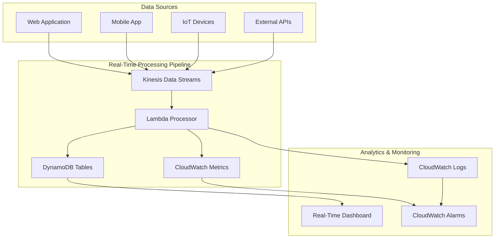

# Streaming Analytics with Kinesis and Lambda


## Problem

Your organization needs to process high-volume streams of data in real-time for analytics dashboards, anomaly detection, or event-driven applications. Traditional batch processing solutions introduce latency and complexity, while managing streaming infrastructure requires significant operational overhead. You need a solution that can automatically scale to handle variable data volumes while providing near-instantaneous processing of incoming events.

## Solution

Build a serverless real-time analytics pipeline using Amazon Kinesis Data Streams for data ingestion, AWS Lambda for stream processing, and Amazon DynamoDB for storing processed results. This architecture provides automatic scaling, high durability, and eliminates server management while processing thousands of records per second with sub-second latency.



## Prerequisites

- AWS account with administrator access
- Basic understanding of streaming data concepts and JSON data formats
- Familiarity with Lambda functions and event-driven architectures
- AWS CLI version 2 installed and configured with appropriate permissions
- Python 3.9+ installed locally for testing (optional)
- Estimated cost: $5-15 for full recipe execution depending on data volume

## Preparation

Let's set up the foundational components for our real-time analytics pipeline:

```bash
# Set environment variables
export KINESIS_STREAM_NAME="real-time-analytics-stream"
export LAMBDA_FUNCTION_NAME="kinesis-stream-processor"
export DYNAMODB_TABLE_NAME="analytics-results"
export IAM_ROLE_NAME="kinesis-lambda-processor-role"

# Create DynamoDB table for storing processed analytics
aws dynamodb create-table \
	--table-name $DYNAMODB_TABLE_NAME \
	--attribute-definitions \
		AttributeName=eventId,AttributeType=S \
		AttributeName=timestamp,AttributeType=N \
	--key-schema \
		AttributeName=eventId,KeyType=HASH \
		AttributeName=timestamp,KeyType=RANGE \
	--billing-mode PAY_PER_REQUEST \
	--stream-specification StreamEnabled=false

# Wait for table to become active
echo "Waiting for DynamoDB table to become active..."
aws dynamodb wait table-exists --table-name $DYNAMODB_TABLE_NAME

# Create IAM policy for Lambda execution role
cat << 'EOF' > lambda-kinesis-policy.json
{
    "Version": "2012-10-17",
    "Statement": [
        {
            "Effect": "Allow",
            "Action": [
                "logs:CreateLogGroup",
                "logs:CreateLogStream",
                "logs:PutLogEvents"
            ],
            "Resource": "arn:aws:logs:*:*:*"
        },
        {
            "Effect": "Allow",
            "Action": [
                "kinesis:DescribeStream",
                "kinesis:DescribeStreamSummary",
                "kinesis:GetRecords",
                "kinesis:GetShardIterator",
                "kinesis:ListShards",
                "kinesis:ListStreams",
                "kinesis:SubscribeToShard"
            ],
            "Resource": "*"
        },
        {
            "Effect": "Allow",
            "Action": [
                "dynamodb:PutItem",
                "dynamodb:GetItem",
                "dynamodb:UpdateItem",
                "dynamodb:Query",
                "dynamodb:Scan"
            ],
            "Resource": "*"
        },
        {
            "Effect": "Allow",
            "Action": [
                "cloudwatch:PutMetricData"
            ],
            "Resource": "*"
        }
    ]
}
EOF

# Create trust policy for Lambda
cat << 'EOF' > lambda-trust-policy.json
{
    "Version": "2012-10-17",
    "Statement": [
        {
            "Effect": "Allow",
            "Principal": {
                "Service": "lambda.amazonaws.com"
            },
            "Action": "sts:AssumeRole"
        }
    ]
}
EOF

# Create IAM role for Lambda function
aws iam create-role \
	--role-name $IAM_ROLE_NAME \
	--assume-role-policy-document file://lambda-trust-policy.json

# Attach custom policy to role
aws iam put-role-policy \
	--role-name $IAM_ROLE_NAME \
	--policy-name KinesisLambdaProcessorPolicy \
	--policy-document file://lambda-kinesis-policy.json

# Get and export the role ARN
LAMBDA_ROLE_ARN=$(aws iam get-role \
	--role-name $IAM_ROLE_NAME \
	--query 'Role.Arn' --output text)
export LAMBDA_ROLE_ARN

echo "Lambda role ARN: $LAMBDA_ROLE_ARN"
```

## Steps

1. **Create a Kinesis Data Stream for ingesting real-time data**:

   Amazon Kinesis Data Streams serves as the foundational data ingestion layer for our real-time analytics pipeline. Kinesis provides managed, scalable streaming capabilities that can handle millions of records per second while maintaining ordering within each shard. Unlike traditional message queues, Kinesis retains data for up to 365 days, enabling replay scenarios and multiple consumer applications to process the same data stream independently.

   ```bash
   # Create Kinesis Data Stream with multiple shards for scalability
   aws kinesis create-stream \
   	--stream-name $KINESIS_STREAM_NAME \
   	--shard-count 2
   
   # Wait for stream to become active
   echo "Waiting for Kinesis stream to become active..."
   aws kinesis wait stream-exists --stream-name $KINESIS_STREAM_NAME
   
   # Get stream details
   aws kinesis describe-stream --stream-name $KINESIS_STREAM_NAME
   ```

   The stream is now active and ready to receive data from multiple sources. With 2 shards, our pipeline can handle up to 2,000 records per second and 2 MB/second of data ingestion. Each shard provides 1,000 records/second write capacity and can support up to 5 reads per second with 2 MB/second throughput per consumer.

2. **Create the Lambda function code for processing streaming data**:

   AWS Lambda provides the serverless compute layer that processes our Kinesis stream events in real-time. Lambda automatically scales based on the incoming event volume and integrates natively with Kinesis through event source mappings. This eliminates the need to provision or manage servers while providing automatic scaling, built-in monitoring, and pay-per-invocation pricing that makes it cost-effective for variable workloads.

   ```bash
   # Create Lambda function directory and code
   mkdir lambda-processor
   cd lambda-processor

cat << 'EOF' > lambda_function.py
import json
import boto3
import base64
import time
from datetime import datetime
from decimal import Decimal

# Initialize AWS clients
dynamodb = boto3.resource('dynamodb')
cloudwatch = boto3.client('cloudwatch')

# Get table reference
table = dynamodb.Table('analytics-results')

def lambda_handler(event, context):
    """
    Process Kinesis stream records and store analytics in DynamoDB
    """
    print(f"Received {len(event['Records'])} records from Kinesis")
    
    processed_records = 0
    failed_records = 0
    
    for record in event['Records']:
        try:
            # Decode Kinesis data
            payload = base64.b64decode(record['kinesis']['data'])
            data = json.loads(payload.decode('utf-8'))
            
            # Extract event information
            event_id = record['kinesis']['sequenceNumber']
            timestamp = int(record['kinesis']['approximateArrivalTimestamp'])
            
            # Process the data (example: calculate metrics)
            processed_data = process_analytics_data(data)
            
            # Store in DynamoDB
            store_analytics_result(event_id, timestamp, processed_data, data)
            
            # Send custom metrics to CloudWatch
            send_custom_metrics(processed_data)
            
            processed_records += 1
            
        except Exception as e:
            print(f"Error processing record: {str(e)}")
            failed_records += 1
            continue
    
    print(f"Successfully processed {processed_records} records, {failed_records} failed")
    
    return {
        'statusCode': 200,
        'body': json.dumps({
            'processed': processed_records,
            'failed': failed_records
        })
    }

def process_analytics_data(data):
    """
    Process incoming data and calculate analytics metrics
    """
    processed = {
        'event_type': data.get('eventType', 'unknown'),
        'user_id': data.get('userId', 'anonymous'),
        'session_id': data.get('sessionId', ''),
        'device_type': data.get('deviceType', 'unknown'),
        'location': data.get('location', {}),
        'metrics': {}
    }
    
    # Calculate custom metrics based on event type
    if data.get('eventType') == 'page_view':
        processed['metrics'] = {
            'page_url': data.get('pageUrl', ''),
            'load_time': data.get('loadTime', 0),
            'bounce_rate': calculate_bounce_rate(data)
        }
    elif data.get('eventType') == 'purchase':
        processed['metrics'] = {
            'amount': Decimal(str(data.get('amount', 0))),
            'currency': data.get('currency', 'USD'),
            'items_count': data.get('itemsCount', 0)
        }
    elif data.get('eventType') == 'user_signup':
        processed['metrics'] = {
            'signup_method': data.get('signupMethod', 'email'),
            'campaign_source': data.get('campaignSource', 'direct')
        }
    
    return processed

def calculate_bounce_rate(data):
    """
    Example calculation for bounce rate analytics
    """
    session_length = data.get('sessionLength', 0)
    pages_viewed = data.get('pagesViewed', 1)
    
    # Simple bounce rate calculation
    if session_length < 30 and pages_viewed == 1:
        return 1.0  # High bounce rate
    else:
        return 0.0  # Low bounce rate

def store_analytics_result(event_id, timestamp, processed_data, raw_data):
    """
    Store processed analytics in DynamoDB
    """
    try:
        table.put_item(
            Item={
                'eventId': event_id,
                'timestamp': timestamp,
                'processedAt': int(time.time()),
                'eventType': processed_data['event_type'],
                'userId': processed_data['user_id'],
                'sessionId': processed_data['session_id'],
                'deviceType': processed_data['device_type'],
                'location': processed_data['location'],
                'metrics': processed_data['metrics'],
                'rawData': raw_data
            }
        )
    except Exception as e:
        print(f"Error storing data in DynamoDB: {str(e)}")
        raise

def send_custom_metrics(processed_data):
    """
    Send custom metrics to CloudWatch
    """
    try:
        # Send event type metrics
        cloudwatch.put_metric_data(
            Namespace='RealTimeAnalytics',
            MetricData=[
                {
                    'MetricName': 'EventsProcessed',
                    'Dimensions': [
                        {
                            'Name': 'EventType',
                            'Value': processed_data['event_type']
                        },
                        {
                            'Name': 'DeviceType',
                            'Value': processed_data['device_type']
                        }
                    ],
                    'Value': 1,
                    'Unit': 'Count'
                }
            ]
        )
        
        # Send purchase metrics if applicable
        if processed_data['event_type'] == 'purchase':
            cloudwatch.put_metric_data(
                Namespace='RealTimeAnalytics',
                MetricData=[
                    {
                        'MetricName': 'PurchaseAmount',
                        'Value': float(processed_data['metrics']['amount']),
                        'Unit': 'None'
                    }
                ]
            )
            
    except Exception as e:
        print(f"Error sending CloudWatch metrics: {str(e)}")
        # Don't raise exception to avoid processing failure
EOF

# Create deployment package
zip -r ../lambda-processor.zip .
cd ..
```

   The Lambda function code implements a robust event processing pattern that handles JSON data extraction, analytics calculations, and error management. The function processes events in batches, which improves efficiency and reduces DynamoDB write costs. By implementing idempotent processing logic and comprehensive error handling, the function ensures reliable data processing even when events are delivered multiple times or processing failures occur.

3. **Deploy the Lambda function**:

   Lambda function deployment establishes the serverless compute environment with specific runtime configurations optimized for stream processing. The 512 MB memory allocation provides sufficient resources for JSON parsing and DynamoDB operations while maintaining cost efficiency. The 5-minute timeout ensures adequate processing time for batch operations, which is critical when handling larger event batches during high-traffic periods.

   ```bash
   # Create Lambda function
   aws lambda create-function \
   	--function-name $LAMBDA_FUNCTION_NAME \
   	--runtime python3.9 \
   	--role $LAMBDA_ROLE_ARN \
   	--handler lambda_function.lambda_handler \
   	--zip-file fileb://lambda-processor.zip \
   	--timeout 300 \
   	--memory-size 512 \
   	--environment Variables="{DYNAMODB_TABLE=$DYNAMODB_TABLE_NAME}"
   
   # Get Lambda function ARN
   LAMBDA_FUNCTION_ARN=$(aws lambda get-function \
   	--function-name $LAMBDA_FUNCTION_NAME \
   	--query 'Configuration.FunctionArn' --output text)
   export LAMBDA_FUNCTION_ARN
   
   echo "Lambda function ARN: $LAMBDA_FUNCTION_ARN"
   ```

   The Lambda function is now deployed and ready to process Kinesis events. The function includes all necessary dependencies and runtime configurations for reliable stream processing, including environment variables for DynamoDB table references and appropriate IAM permissions for cross-service interactions.

4. **Create event source mapping between Kinesis and Lambda**:

   Event source mapping establishes the critical connection that enables Lambda to automatically consume events from Kinesis Data Streams. This managed integration handles the complexity of shard management, checkpointing, and error handling while providing configurable batching and timeout parameters. The mapping ensures that events are processed in order within each shard and provides automatic retry mechanisms for failed processing attempts.

   ```bash
   # Get Kinesis stream ARN
   KINESIS_STREAM_ARN=$(aws kinesis describe-stream \
   	--stream-name $KINESIS_STREAM_NAME \
   	--query 'StreamDescription.StreamARN' --output text)
   
   # Create event source mapping
   aws lambda create-event-source-mapping \
   	--function-name $LAMBDA_FUNCTION_NAME \
   	--event-source-arn $KINESIS_STREAM_ARN \
   	--starting-position LATEST \
   	--batch-size 100 \
   	--maximum-batching-window-in-seconds 5
   
   export KINESIS_STREAM_ARN
   ```

   The event source mapping is now active and will begin processing new events arriving in the Kinesis stream. The configuration optimizes for both latency and throughput by batching up to 100 records or waiting a maximum of 5 seconds before triggering Lambda execution. This balanced approach ensures near real-time processing while maximizing cost efficiency through reduced invocation frequency.

5. **Create a data producer script to generate test events**:

   A data producer simulates real-world event generation patterns that would typically come from web applications, mobile apps, or IoT devices. This script generates diverse event types with realistic data structures and timing patterns, enabling comprehensive testing of our analytics pipeline. Understanding data producer patterns is essential for designing robust streaming architectures that can handle variable event volumes and diverse data schemas.

   ```bash
   # Create test data producer
   cat << 'EOF' > data_producer.py
import boto3
import json
import time
import random
from datetime import datetime

# Initialize Kinesis client
kinesis = boto3.client('kinesis')

def generate_sample_events():
    """Generate sample events for testing"""
    event_types = ['page_view', 'purchase', 'user_signup', 'click']
    device_types = ['desktop', 'mobile', 'tablet']
    
    events = []
    
    for i in range(10):
        event = {
            'eventType': random.choice(event_types),
            'userId': f'user_{random.randint(1000, 9999)}',
            'sessionId': f'session_{random.randint(100000, 999999)}',
            'deviceType': random.choice(device_types),
            'timestamp': datetime.now().isoformat(),
            'location': {
                'country': random.choice(['US', 'UK', 'DE', 'FR', 'JP']),
                'city': random.choice(['New York', 'London', 'Berlin', 'Paris', 'Tokyo'])
            }
        }
        
        # Add event-specific data
        if event['eventType'] == 'page_view':
            event.update({
                'pageUrl': f'/page/{random.randint(1, 100)}',
                'loadTime': random.randint(500, 3000),
                'sessionLength': random.randint(10, 1800),
                'pagesViewed': random.randint(1, 10)
            })
        elif event['eventType'] == 'purchase':
            event.update({
                'amount': round(random.uniform(10.99, 299.99), 2),
                'currency': 'USD',
                'itemsCount': random.randint(1, 5)
            })
        elif event['eventType'] == 'user_signup':
            event.update({
                'signupMethod': random.choice(['email', 'social', 'phone']),
                'campaignSource': random.choice(['google', 'facebook', 'direct', 'email'])
            })
        
        events.append(event)
    
    return events

def send_events_to_kinesis(stream_name, events):
    """Send events to Kinesis Data Stream"""
    for event in events:
        try:
            response = kinesis.put_record(
                StreamName=stream_name,
                Data=json.dumps(event),
                PartitionKey=event['userId']
            )
            print(f"Sent event {event['eventType']} - Shard: {response['ShardId']}")
            time.sleep(0.1)  # Small delay between events
            
        except Exception as e:
            print(f"Error sending event: {str(e)}")

if __name__ == "__main__":
    stream_name = "real-time-analytics-stream"
    
    print("Generating and sending sample events...")
    
    # Send multiple batches of events
    for batch in range(3):
        print(f"\nSending batch {batch + 1}...")
        events = generate_sample_events()
        send_events_to_kinesis(stream_name, events)
        time.sleep(2)  # Wait between batches
    
    print("\nCompleted sending test events!")
EOF

# Generate requirements file for Python script
cat << 'EOF' > requirements.txt
boto3>=1.26.0
EOF
```

   The data producer is now ready to generate realistic test events that will flow through our entire analytics pipeline. The script creates diverse event types with varying data structures, mimicking real-world scenarios where different user actions generate different payload formats and processing requirements.

6. **Set up CloudWatch monitoring and alarms**:

   CloudWatch monitoring provides essential observability for production streaming pipelines, enabling proactive detection of processing errors, performance degradation, and capacity constraints. These alarms monitor critical failure points in our architecture and provide early warning systems that enable rapid response to operational issues. Effective monitoring reduces mean time to resolution and ensures high availability for real-time analytics workloads.

   ```bash
   # Create CloudWatch alarm for Lambda errors
   aws cloudwatch put-metric-alarm \
   	--alarm-name "KinesisLambdaProcessorErrors" \
   	--alarm-description "Monitor Lambda processing errors" \
   	--metric-name Errors \
   	--namespace AWS/Lambda \
   	--statistic Sum \
   	--period 300 \
   	--threshold 1 \
   	--comparison-operator GreaterThanOrEqualToThreshold \
   	--evaluation-periods 1 \
   	--dimensions Name=FunctionName,Value=$LAMBDA_FUNCTION_NAME
   
   # Create CloudWatch alarm for DynamoDB throttling
   aws cloudwatch put-metric-alarm \
   	--alarm-name "DynamoDBThrottling" \
   	--alarm-description "Monitor DynamoDB throttling events" \
   	--metric-name ThrottledRequests \
   	--namespace AWS/DynamoDB \
   	--statistic Sum \
   	--period 300 \
   	--threshold 1 \
   	--comparison-operator GreaterThanOrEqualToThreshold \
   	--evaluation-periods 1 \
   	--dimensions Name=TableName,Value=$DYNAMODB_TABLE_NAME
   ```

   CloudWatch alarms are now actively monitoring our pipeline for critical error conditions. These alarms will trigger when Lambda functions encounter processing errors or when DynamoDB experiences throttling events, enabling immediate response to operational issues that could impact data processing reliability.

## Validation & Testing

1. Test the pipeline by sending sample data to the Kinesis stream:

```bash
# Install Python dependencies and run the data producer
pip3 install boto3

# Send test events
python3 data_producer.py
```

2. Verify that Lambda is processing the Kinesis records:

```bash
# Check Lambda function logs
aws logs describe-log-groups \
	--log-group-name-prefix "/aws/lambda/$LAMBDA_FUNCTION_NAME"

# Get recent log events (replace LOG_GROUP_NAME with actual name)
LOG_GROUP_NAME="/aws/lambda/$LAMBDA_FUNCTION_NAME"
aws logs filter-log-events \
	--log-group-name $LOG_GROUP_NAME \
	--start-time $(date -d '10 minutes ago' +%s)000
```

Expected log output should show:
```
Received X records from Kinesis
Successfully processed X records, 0 failed
```

3. Verify that processed data is stored in DynamoDB:

```bash
# Scan DynamoDB table to see processed records
aws dynamodb scan \
	--table-name $DYNAMODB_TABLE_NAME \
	--max-items 5

# Query for specific event types
aws dynamodb scan \
	--table-name $DYNAMODB_TABLE_NAME \
	--filter-expression "eventType = :et" \
	--expression-attribute-values '{":et":{"S":"page_view"}}' \
	--max-items 3
```

> **Note**: Kinesis stream processing operates on eventual consistency principles. The sequence number ordering within each shard ensures data integrity, but cross-shard ordering is not guaranteed. For applications requiring strict global ordering, consider using a single shard or implementing application-level sequencing logic.

> **Tip**: If you don't see records immediately, wait 1-2 minutes for the asynchronous processing to complete. Lambda processes Kinesis records in batches, so there may be a slight delay.

4. Check CloudWatch metrics for the analytics pipeline:

```bash
# View custom metrics in CloudWatch
aws cloudwatch get-metric-statistics \
	--namespace RealTimeAnalytics \
	--metric-name EventsProcessed \
	--start-time $(date -d '1 hour ago' -u +%Y-%m-%dT%H:%M:%S) \
	--end-time $(date -u +%Y-%m-%dT%H:%M:%S) \
	--period 300 \
	--statistics Sum

# Check Lambda invocation metrics
aws cloudwatch get-metric-statistics \
	--namespace AWS/Lambda \
	--metric-name Invocations \
	--dimensions Name=FunctionName,Value=$LAMBDA_FUNCTION_NAME \
	--start-time $(date -d '1 hour ago' -u +%Y-%m-%dT%H:%M:%S) \
	--end-time $(date -u +%Y-%m-%dT%H:%M:%S) \
	--period 300 \
	--statistics Sum
```

## Cleanup

1. Delete the event source mapping:

```bash
# List event source mappings
EVENT_SOURCE_UUID=$(aws lambda list-event-source-mappings \
	--function-name $LAMBDA_FUNCTION_NAME \
	--query 'EventSourceMappings[0].UUID' --output text)

# Delete the mapping
if [ "$EVENT_SOURCE_UUID" != "None" ]; then
	aws lambda delete-event-source-mapping --uuid $EVENT_SOURCE_UUID
fi
```

2. Delete the Lambda function:

```bash
aws lambda delete-function --function-name $LAMBDA_FUNCTION_NAME
```

3. Delete the Kinesis Data Stream:

```bash
aws kinesis delete-stream --stream-name $KINESIS_STREAM_NAME
```

4. Delete the DynamoDB table:

```bash
aws dynamodb delete-table --table-name $DYNAMODB_TABLE_NAME
```

5. Delete IAM role and policies:

```bash
# Delete role policy
aws iam delete-role-policy \
	--role-name $IAM_ROLE_NAME \
	--policy-name KinesisLambdaProcessorPolicy

# Delete role
aws iam delete-role --role-name $IAM_ROLE_NAME
```

6. Delete CloudWatch alarms:

```bash
aws cloudwatch delete-alarms \
	--alarm-names "KinesisLambdaProcessorErrors" "DynamoDBThrottling"
```

7. Clean up local files:

```bash
rm -rf lambda-processor/
rm lambda-processor.zip
rm lambda-kinesis-policy.json
rm lambda-trust-policy.json
rm data_producer.py
rm requirements.txt
```

## Discussion

Real-time analytics pipelines enable organizations to react to business events as they happen, providing immediate insights for decision-making and operational improvements. This serverless architecture using Kinesis Data Streams and Lambda offers several key advantages over traditional streaming solutions.

The event-driven nature of Lambda ensures you only pay for actual processing time, making this solution cost-effective for variable workloads. Kinesis Data Streams provides durable, scalable ingestion with automatic sharding, while DynamoDB offers microsecond-latency data access for real-time queries. The combination eliminates the need to manage streaming infrastructure like Apache Kafka clusters or Spark streaming jobs.

This pattern excels in scenarios requiring immediate response to user behavior, such as personalization engines, fraud detection systems, or operational monitoring dashboards. Financial services companies use similar architectures for real-time transaction monitoring, while e-commerce platforms leverage them for recommendation engines and inventory management. The built-in integration between these AWS services reduces complexity and improves reliability compared to self-managed alternatives.

For production implementations, consider implementing dead letter queues for failed processing, using Kinesis Analytics for complex stream processing, and leveraging AWS X-Ray for distributed tracing across the pipeline. The architecture scales automatically but monitoring shard utilization and Lambda concurrency limits ensures optimal performance under high load conditions.

> Warning: Lambda event source mappings process each event at least once, and duplicate processing of records can occur. Always implement idempotent processing logic to handle potential duplicate events gracefully.

## Challenge

Extend this pipeline to implement real-time anomaly detection by adding a second Lambda function that analyzes processed metrics in DynamoDB using statistical analysis or machine learning models. Create CloudWatch custom metrics for detected anomalies and implement automated notifications using Amazon SNS when unusual patterns are identified. Additionally, implement data retention policies using DynamoDB TTL to automatically expire old analytics data and optimize storage costs.

## Infrastructure Code

*Infrastructure code will be generated after recipe approval.*