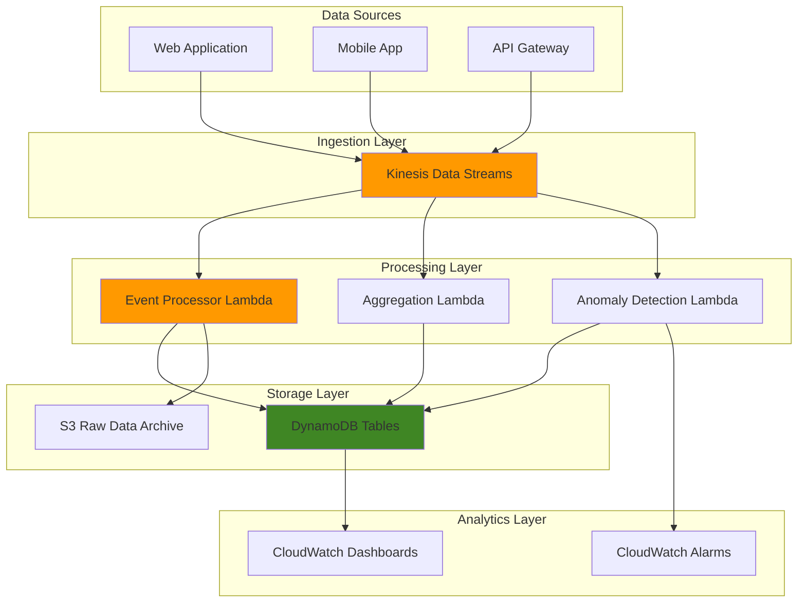

# Streaming Clickstream Analytics with Kinesis Data Streams

## Problem

E-commerce and digital marketing teams need to understand user behavior patterns in real-time to optimize conversion rates, personalize experiences, and detect anomalies. Traditional batch processing approaches introduce delays that prevent immediate response to user actions, resulting in missed opportunities for real-time personalization and delayed detection of issues like bot traffic or system problems.

## Solution

Build a real-time clickstream analytics pipeline using Kinesis Data Streams to capture user events, Lambda functions to process and analyze the data in real-time, and DynamoDB to store aggregated metrics. This architecture enables immediate insights into user behavior patterns, real-time alerting, and sub-second response times for personalization engines.

## Architecture Diagram



## Prerequisites

1. AWS account with permissions for Kinesis Data Streams, Lambda, DynamoDB, CloudWatch, and S3
2. AWS CLI v2 installed and configured (or AWS CloudShell)
3. Basic understanding of streaming data concepts and JavaScript/Python
4. Node.js 18+ for testing client applications
5. Estimated cost: $20-50/month for moderate traffic (1M events/day)

> **Note**: Costs vary significantly based on data volume and retention requirements

## Preparation

```bash
# Set environment variables
export AWS_REGION=$(aws configure get region)
export AWS_ACCOUNT_ID=$(aws sts get-caller-identity \
    --query Account --output text)

# Generate unique identifiers
RANDOM_SUFFIX=$(aws secretsmanager get-random-password \
    --exclude-punctuation --exclude-uppercase \
    --password-length 6 --require-each-included-type \
    --output text --query RandomPassword)

export STREAM_NAME="clickstream-events-${RANDOM_SUFFIX}"
export TABLE_PREFIX="clickstream-${RANDOM_SUFFIX}"

# Create S3 bucket for raw data archiving
export BUCKET_NAME="clickstream-archive-${RANDOM_SUFFIX}"
aws s3 mb s3://${BUCKET_NAME} --region ${AWS_REGION}

echo "✅ Environment prepared with stream: ${STREAM_NAME}"
```

## Steps

1. **Create Kinesis Data Stream for clickstream events**:

   Amazon Kinesis Data Streams forms the backbone of our real-time analytics pipeline, providing a managed streaming service that can handle millions of events per second with sub-second latency. Unlike traditional message queues, Kinesis Data Streams preserves event ordering within shards and provides durable storage for up to 365 days, enabling both real-time processing and historical replay capabilities.

   ```bash
   # Create the data stream with multiple shards for scalability
   # Multiple shards allow parallel processing and higher throughput
   aws kinesis create-stream \
       --stream-name ${STREAM_NAME} \
       --shard-count 2
   
   # Wait for stream to become active
   # This ensures the stream is ready before proceeding
   aws kinesis wait stream-exists \
       --stream-name ${STREAM_NAME}
   
   # Get stream details for later use
   STREAM_ARN=$(aws kinesis describe-stream \
       --stream-name ${STREAM_NAME} \
       --query 'StreamDescription.StreamARN' \
       --output text)
   
   echo "✅ Created Kinesis stream: ${STREAM_NAME}"
   ```

   The stream is now active and ready to receive clickstream events from multiple sources. Each shard provides 1,000 records per second write capacity and 2 MB per second read capacity, giving us an initial throughput of 2,000 writes/second. This foundational infrastructure enables real-time data ingestion with automatic load balancing across shards.

2. **Create DynamoDB tables for real-time metrics**:

   DynamoDB serves as our high-performance NoSQL storage layer, providing single-digit millisecond response times crucial for real-time analytics dashboards. The table design follows DynamoDB best practices with carefully chosen partition keys that distribute load evenly and support efficient query patterns. Pay-per-request billing ensures cost optimization during variable traffic patterns common in clickstream analytics.

   ```bash
   # Create table for page view metrics
   # Partition key is page_url to distribute load across pages
   # Sort key is timestamp_hour for time-based queries
   aws dynamodb create-table \
       --table-name ${TABLE_PREFIX}-page-metrics \
       --attribute-definitions \
           AttributeName=page_url,AttributeType=S \
           AttributeName=timestamp_hour,AttributeType=S \
       --key-schema \
           AttributeName=page_url,KeyType=HASH \
           AttributeName=timestamp_hour,KeyType=RANGE \
       --billing-mode PAY_PER_REQUEST
   
   # Create table for user session metrics
   # Session ID as partition key for fast session lookups
   aws dynamodb create-table \
       --table-name ${TABLE_PREFIX}-session-metrics \
       --attribute-definitions \
           AttributeName=session_id,AttributeType=S \
       --key-schema \
           AttributeName=session_id,KeyType=HASH \
       --billing-mode PAY_PER_REQUEST
   
   # Create table for real-time counters with TTL
   # Metric name and time window for aggregated data
   aws dynamodb create-table \
       --table-name ${TABLE_PREFIX}-counters \
       --attribute-definitions \
           AttributeName=metric_name,AttributeType=S \
           AttributeName=time_window,AttributeType=S \
       --key-schema \
           AttributeName=metric_name,KeyType=HASH \
           AttributeName=time_window,KeyType=RANGE \
       --billing-mode PAY_PER_REQUEST
   
   # Enable TTL on the counters table for automatic cleanup
   aws dynamodb update-time-to-live \
       --table-name ${TABLE_PREFIX}-counters \
       --time-to-live-specification \
           Enabled=true,AttributeName=ttl
   
   echo "✅ Created DynamoDB tables for metrics storage"
   ```

   These tables establish our real-time storage foundation with optimized access patterns for different analytics use cases. The page-metrics table enables efficient time-series queries by URL, session-metrics provides instant session lookups for anomaly detection, and counters support real-time aggregation with automatic TTL cleanup to control costs.

3. **Create IAM role for Lambda functions**:

   Security is paramount in real-time data processing systems that handle sensitive user behavior data. This IAM role implements the principle of least privilege, granting only the specific permissions required for clickstream processing operations. The role design enables secure, temporary credential delegation to Lambda functions while maintaining strict access controls over data processing operations.

   ```bash
   # Create trust policy for Lambda
   cat > lambda-trust-policy.json << 'EOF'
   {
       "Version": "2012-10-17",
       "Statement": [
           {
               "Effect": "Allow",
               "Principal": {
                   "Service": "lambda.amazonaws.com"
               },
               "Action": "sts:AssumeRole"
           }
       ]
   }
   EOF
   
   # Create the IAM role
   aws iam create-role \
       --role-name ClickstreamProcessorRole-${RANDOM_SUFFIX} \
       --assume-role-policy-document file://lambda-trust-policy.json
   
   # Create and attach policy for Lambda permissions
   # This follows least privilege principle - only necessary permissions
   cat > lambda-permissions.json << EOF
   {
       "Version": "2012-10-17",
       "Statement": [
           {
               "Effect": "Allow",
               "Action": [
                   "logs:CreateLogGroup",
                   "logs:CreateLogStream",
                   "logs:PutLogEvents"
               ],
               "Resource": "arn:aws:logs:${AWS_REGION}:${AWS_ACCOUNT_ID}:*"
           },
           {
               "Effect": "Allow",
               "Action": [
                   "kinesis:DescribeStream",
                   "kinesis:GetShardIterator",
                   "kinesis:GetRecords",
                   "kinesis:ListStreams"
               ],
               "Resource": "${STREAM_ARN}"
           },
           {
               "Effect": "Allow",
               "Action": [
                   "dynamodb:PutItem",
                   "dynamodb:UpdateItem",
                   "dynamodb:GetItem",
                   "dynamodb:Query"
               ],
               "Resource": "arn:aws:dynamodb:${AWS_REGION}:${AWS_ACCOUNT_ID}:table/${TABLE_PREFIX}-*"
           },
           {
               "Effect": "Allow",
               "Action": [
                   "s3:PutObject"
               ],
               "Resource": "arn:aws:s3:::${BUCKET_NAME}/*"
           },
           {
               "Effect": "Allow",
               "Action": [
                   "cloudwatch:PutMetricData"
               ],
               "Resource": "*"
           }
       ]
   }
   EOF
   
   aws iam put-role-policy \
       --role-name ClickstreamProcessorRole-${RANDOM_SUFFIX} \
       --policy-name ClickstreamProcessorPolicy \
       --policy-document file://lambda-permissions.json
   
   export LAMBDA_ROLE_ARN="arn:aws:iam::${AWS_ACCOUNT_ID}:role/ClickstreamProcessorRole-${RANDOM_SUFFIX}"
   
   # Wait for role to be available
   sleep 10
   
   echo "✅ Created IAM role for Lambda functions"
   ```

   The IAM role is now configured with precise permissions that enable Lambda functions to read from Kinesis streams, write metrics to DynamoDB, archive data to S3, and publish monitoring metrics to CloudWatch. This security foundation prevents unauthorized access while enabling all required processing operations for our clickstream analytics pipeline.

   > **Warning**: The IAM role uses least privilege principles. Avoid adding broader permissions unless absolutely necessary to maintain security. Review [AWS IAM best practices](https://docs.aws.amazon.com/IAM/latest/UserGuide/best-practices.html).

4. **Create Lambda function for event processing**:

   AWS Lambda provides the serverless compute foundation for our real-time processing pipeline, automatically scaling from zero to thousands of concurrent executions based on incoming event volume. This event-driven architecture eliminates infrastructure management while providing sub-second processing latency. The function design implements multiple processing patterns simultaneously - real-time aggregation, data archival, and metric publishing - demonstrating Lambda's versatility for complex stream processing workloads.

   ```bash
   # Create the Lambda function code
   mkdir -p lambda-functions/event-processor
   cat > lambda-functions/event-processor/index.js << 'EOF'
   const { DynamoDBClient } = require('@aws-sdk/client-dynamodb');
   const { DynamoDBDocumentClient, UpdateCommand } = require('@aws-sdk/lib-dynamodb');
   const { S3Client, PutObjectCommand } = require('@aws-sdk/client-s3');
   const { CloudWatchClient, PutMetricDataCommand } = require('@aws-sdk/client-cloudwatch');
   
   const dynamoClient = new DynamoDBClient({});
   const dynamodb = DynamoDBDocumentClient.from(dynamoClient);
   const s3 = new S3Client({});
   const cloudwatch = new CloudWatchClient({});
   
   const TABLE_PREFIX = process.env.TABLE_PREFIX;
   const BUCKET_NAME = process.env.BUCKET_NAME;
   
   exports.handler = async (event) => {
       console.log('Processing', event.Records.length, 'records');
       
       const promises = event.Records.map(async (record) => {
           try {
               // Decode the Kinesis data
               const payload = Buffer.from(record.kinesis.data, 'base64').toString('utf-8');
               const clickEvent = JSON.parse(payload);
               
               // Process different event types
               await Promise.all([
                   processPageView(clickEvent),
                   updateSessionMetrics(clickEvent),
                   updateRealTimeCounters(clickEvent),
                   archiveRawEvent(clickEvent),
                   publishMetrics(clickEvent)
               ]);
               
           } catch (error) {
               console.error('Error processing record:', error);
               throw error;
           }
       });
       
       await Promise.all(promises);
       return { statusCode: 200, body: 'Successfully processed events' };
   };
   
   async function processPageView(event) {
       if (event.event_type !== 'page_view') return;
       
       const hour = new Date(event.timestamp).toISOString().slice(0, 13);
       
       const command = new UpdateCommand({
           TableName: `${TABLE_PREFIX}-page-metrics`,
           Key: {
               page_url: event.page_url,
               timestamp_hour: hour
           },
           UpdateExpression: 'ADD view_count :inc SET last_updated = :now',
           ExpressionAttributeValues: {
               ':inc': 1,
               ':now': Date.now()
           }
       });
       
       await dynamodb.send(command);
   }
   
   async function updateSessionMetrics(event) {
       const command = new UpdateCommand({
           TableName: `${TABLE_PREFIX}-session-metrics`,
           Key: { session_id: event.session_id },
           UpdateExpression: 'SET last_activity = :now, user_agent = :ua ADD event_count :inc',
           ExpressionAttributeValues: {
               ':now': event.timestamp,
               ':ua': event.user_agent || 'unknown',
               ':inc': 1
           }
       });
       
       await dynamodb.send(command);
   }
   
   async function updateRealTimeCounters(event) {
       const minute = new Date(event.timestamp).toISOString().slice(0, 16);
       
       const command = new UpdateCommand({
           TableName: `${TABLE_PREFIX}-counters`,
           Key: {
               metric_name: `events_per_minute_${event.event_type}`,
               time_window: minute
           },
           UpdateExpression: 'ADD event_count :inc SET ttl = :ttl',
           ExpressionAttributeValues: {
               ':inc': 1,
               ':ttl': Math.floor(Date.now() / 1000) + (24 * 60 * 60) // 24 hour TTL
           }
       });
       
       await dynamodb.send(command);
   }
   
   async function archiveRawEvent(event) {
       const date = new Date(event.timestamp);
       const key = `year=${date.getFullYear()}/month=${date.getMonth() + 1}/day=${date.getDate()}/hour=${date.getHours()}/${event.session_id}-${Date.now()}.json`;
       
       const command = new PutObjectCommand({
           Bucket: BUCKET_NAME,
           Key: key,
           Body: JSON.stringify(event),
           ContentType: 'application/json'
       });
       
       await s3.send(command);
   }
   
   async function publishMetrics(event) {
       const command = new PutMetricDataCommand({
           Namespace: 'Clickstream/Events',
           MetricData: [
               {
                   MetricName: 'EventsProcessed',
                   Value: 1,
                   Unit: 'Count',
                   Dimensions: [
                       {
                           Name: 'EventType',
                           Value: event.event_type
                       }
                   ]
               }
           ]
       });
       
       await cloudwatch.send(command);
   }
   EOF
   
   # Create package.json with AWS SDK v3
   cat > lambda-functions/event-processor/package.json << 'EOF'
   {
       "name": "clickstream-event-processor",
       "version": "1.0.0",
       "main": "index.js",
       "dependencies": {
           "@aws-sdk/client-dynamodb": "^3.0.0",
           "@aws-sdk/lib-dynamodb": "^3.0.0",
           "@aws-sdk/client-s3": "^3.0.0",
           "@aws-sdk/client-cloudwatch": "^3.0.0"
       }
   }
   EOF
   
   # Package the Lambda function
   cd lambda-functions/event-processor
   npm install --omit=dev
   zip -r ../event-processor.zip .
   cd ../..
   
   # Create the Lambda function
   # Memory size affects performance for concurrent processing
   aws lambda create-function \
       --function-name clickstream-event-processor-${RANDOM_SUFFIX} \
       --runtime nodejs20.x \
       --role ${LAMBDA_ROLE_ARN} \
       --handler index.handler \
       --zip-file fileb://lambda-functions/event-processor.zip \
       --timeout 60 \
       --memory-size 256 \
       --environment Variables="{TABLE_PREFIX=${TABLE_PREFIX},BUCKET_NAME=${BUCKET_NAME}}"

   export PROCESSOR_FUNCTION_ARN=$(aws lambda get-function \
       --function-name clickstream-event-processor-${RANDOM_SUFFIX} \
       --query 'Configuration.FunctionArn' --output text)
   
   echo "✅ Created event processor Lambda function"
   ```

   The Lambda function is now deployed and ready to process clickstream events in real-time. The 256MB memory allocation provides optimal performance for JSON parsing and multiple AWS service calls, while the 60-second timeout accommodates batch processing scenarios. This serverless foundation automatically scales to handle traffic spikes without pre-provisioning capacity.

5. **Create event source mapping between Kinesis and Lambda**:

   Event source mapping establishes the critical connection between our data stream and processing functions, enabling automatic invocation of Lambda when new records arrive. This managed integration handles the complexity of shard management, error handling, and checkpointing while providing tunable parameters for optimizing latency versus throughput trade-offs.

   ```bash
   # Create event source mapping
   # Batch size determines how many records are processed together
   # This balances latency vs throughput (max 10,000 for Kinesis)
   aws lambda create-event-source-mapping \
       --event-source-arn ${STREAM_ARN} \
       --function-name clickstream-event-processor-${RANDOM_SUFFIX} \
       --starting-position LATEST \
       --batch-size 100 \
       --maximum-batching-window-in-seconds 5 \
       --parallelization-factor 1
   
   echo "✅ Created event source mapping for real-time processing"
   ```

   The event source mapping is now active, automatically polling Kinesis shards and invoking our Lambda function with batches of up to 100 records. The 5-second batching window ensures low latency while optimizing throughput, striking the ideal balance for real-time analytics where both responsiveness and efficiency matter.

6. **Create anomaly detection Lambda function**:

   Real-time anomaly detection represents one of the most valuable applications of streaming analytics, enabling immediate response to suspicious patterns, bot activity, and potential security threats. This Lambda function demonstrates pattern recognition techniques that can identify unusual user behavior within seconds of occurrence, providing the foundation for fraud prevention and system protection mechanisms.

   ```bash
   # Create anomaly detection function
   # This function demonstrates real-time pattern recognition
   mkdir -p lambda-functions/anomaly-detector
   cat > lambda-functions/anomaly-detector/index.js << 'EOF'
   const { DynamoDBClient } = require('@aws-sdk/client-dynamodb');
   const { DynamoDBDocumentClient, GetCommand } = require('@aws-sdk/lib-dynamodb');
   const { SNSClient, PublishCommand } = require('@aws-sdk/client-sns');
   
   const dynamoClient = new DynamoDBClient({});
   const dynamodb = DynamoDBDocumentClient.from(dynamoClient);
   const sns = new SNSClient({});
   
   const TABLE_PREFIX = process.env.TABLE_PREFIX;
   const SNS_TOPIC_ARN = process.env.SNS_TOPIC_ARN;
   
   exports.handler = async (event) => {
       console.log('Checking for anomalies in', event.Records.length, 'records');
       
       for (const record of event.Records) {
           try {
               const payload = Buffer.from(record.kinesis.data, 'base64').toString('utf-8');
               const clickEvent = JSON.parse(payload);
               
               await checkForAnomalies(clickEvent);
               
           } catch (error) {
               console.error('Error processing record for anomaly detection:', error);
           }
       }
       
       return { statusCode: 200 };
   };
   
   async function checkForAnomalies(event) {
       // Check for suspicious patterns
       const checks = await Promise.all([
           checkHighFrequencyClicks(event),
           checkSuspiciousUserAgent(event),
           checkUnusualPageSequence(event)
       ]);
       
       const anomalies = checks.filter(check => check.isAnomaly);
       
       if (anomalies.length > 0) {
           await sendAlert(event, anomalies);
       }
   }
   
   async function checkHighFrequencyClicks(event) {
       const minute = new Date(event.timestamp).toISOString().slice(0, 16);
       
       const command = new GetCommand({
           TableName: `${TABLE_PREFIX}-counters`,
           Key: {
               metric_name: `session_events_${event.session_id}`,
               time_window: minute
           }
       });
       
       const result = await dynamodb.send(command);
       const eventCount = result.Item ? result.Item.event_count : 0;
       
       // Flag if more than 50 events per minute from same session
       return {
           isAnomaly: eventCount > 50,
           type: 'high_frequency_clicks',
           details: `${eventCount} events in one minute`
       };
   }
   
   async function checkSuspiciousUserAgent(event) {
       const suspiciousPatterns = ['bot', 'crawler', 'spider', 'scraper'];
       const userAgent = (event.user_agent || '').toLowerCase();
       
       const isSuspicious = suspiciousPatterns.some(pattern => 
           userAgent.includes(pattern)
       );
       
       return {
           isAnomaly: isSuspicious,
           type: 'suspicious_user_agent',
           details: event.user_agent
       };
   }
   
   async function checkUnusualPageSequence(event) {
       // Simple check for direct access to checkout without viewing products
       if (event.page_url && event.page_url.includes('/checkout')) {
           const command = new GetCommand({
               TableName: `${TABLE_PREFIX}-session-metrics`,
               Key: { session_id: event.session_id }
           });
           
           const result = await dynamodb.send(command);
           const eventCount = result.Item ? result.Item.event_count : 0;
           
           // Flag if going to checkout with very few page views
           return {
               isAnomaly: eventCount < 3,
               type: 'unusual_page_sequence',
               details: `Direct checkout access with only ${eventCount} page views`
           };
       }
       
       return { isAnomaly: false };
   }
   
   async function sendAlert(event, anomalies) {
       if (!SNS_TOPIC_ARN) return;
       
       const message = {
           timestamp: event.timestamp,
           session_id: event.session_id,
           anomalies: anomalies,
           event_details: event
       };
       
       const command = new PublishCommand({
           TopicArn: SNS_TOPIC_ARN,
           Message: JSON.stringify(message, null, 2),
           Subject: 'Clickstream Anomaly Detected'
       });
       
       await sns.send(command);
       console.log('Alert sent for anomalies:', anomalies.map(a => a.type));
   }
   EOF
   
   # Create package.json for anomaly detector
   cat > lambda-functions/anomaly-detector/package.json << 'EOF'
   {
       "name": "anomaly-detector",
       "version": "1.0.0",
       "main": "index.js",
       "dependencies": {
           "@aws-sdk/client-dynamodb": "^3.0.0",
           "@aws-sdk/lib-dynamodb": "^3.0.0",
           "@aws-sdk/client-sns": "^3.0.0"
       }
   }
   EOF
   
   # Package the anomaly detection function
   cd lambda-functions/anomaly-detector
   npm install --omit=dev
   zip -r ../anomaly-detector.zip .
   cd ../..
   
   # Create the anomaly detection Lambda function
   aws lambda create-function \
       --function-name clickstream-anomaly-detector-${RANDOM_SUFFIX} \
       --runtime nodejs20.x \
       --role ${LAMBDA_ROLE_ARN} \
       --handler index.handler \
       --zip-file fileb://lambda-functions/anomaly-detector.zip \
       --timeout 30 \
       --memory-size 128 \
       --environment Variables="{TABLE_PREFIX=${TABLE_PREFIX}}"
   
   # Create second event source mapping for anomaly detection
   # Separate mapping allows independent scaling and error handling
   aws lambda create-event-source-mapping \
       --event-source-arn ${STREAM_ARN} \
       --function-name clickstream-anomaly-detector-${RANDOM_SUFFIX} \
       --starting-position LATEST \
       --batch-size 50 \
       --maximum-batching-window-in-seconds 10
   
   echo "✅ Created anomaly detection Lambda function"
   ```

   The anomaly detection function is now monitoring the same clickstream data with independent scaling and error handling. Multiple consumers on the same Kinesis stream demonstrate the fan-out pattern, enabling specialized processing workloads to operate simultaneously without interference while maintaining distinct performance characteristics.

7. **Create test client to generate sample clickstream data**:

   Realistic testing requires simulating actual user behavior patterns that mirror production clickstream characteristics. This test client generates diverse event types, realistic session patterns, and varied user agents to properly validate our analytics pipeline under conditions similar to real-world traffic scenarios.

   ```bash
   # Create test client
   mkdir -p test-client
   cat > test-client/generate-events.js << 'EOF'
   const { KinesisClient, PutRecordCommand } = require('@aws-sdk/client-kinesis');
   
   const kinesis = new KinesisClient({});
   
   const STREAM_NAME = process.env.STREAM_NAME;
   const USER_AGENTS = [
       'Mozilla/5.0 (Windows NT 10.0; Win64; x64) AppleWebKit/537.36',
       'Mozilla/5.0 (Macintosh; Intel Mac OS X 10_15_7) AppleWebKit/537.36',
       'Mozilla/5.0 (X11; Linux x86_64) AppleWebKit/537.36'
   ];
   
   const PAGES = [
       '/home',
       '/products',
       '/product/123',
       '/cart',
       '/checkout',
       '/about',
       '/contact'
   ];
   
   function generateSessionId() {
       return 'session_' + Math.random().toString(36).substr(2, 9);
   }
   
   function generateEvent(sessionId) {
       return {
           event_type: Math.random() > 0.1 ? 'page_view' : 'click',
           session_id: sessionId,
           user_id: 'user_' + Math.floor(Math.random() * 1000),
           timestamp: new Date().toISOString(),
           page_url: PAGES[Math.floor(Math.random() * PAGES.length)],
           user_agent: USER_AGENTS[Math.floor(Math.random() * USER_AGENTS.length)],
           ip_address: `192.168.1.${Math.floor(Math.random() * 255)}`,
           referrer: Math.random() > 0.5 ? 'https://google.com' : null
       };
   }
   
   async function sendEvents() {
       const sessionId = generateSessionId();
       const eventsPerSession = Math.floor(Math.random() * 10) + 1;
       
       console.log(`Generating ${eventsPerSession} events for session ${sessionId}`);
       
       for (let i = 0; i < eventsPerSession; i++) {
           const event = generateEvent(sessionId);
           
           const command = new PutRecordCommand({
               StreamName: STREAM_NAME,
               Data: JSON.stringify(event),
               PartitionKey: sessionId
           });
           
           try {
               await kinesis.send(command);
               console.log('Sent event:', event.event_type, event.page_url);
               
               // Small delay between events
               await new Promise(resolve => setTimeout(resolve, 100));
           } catch (error) {
               console.error('Error sending event:', error);
           }
       }
   }
   
   // Generate events continuously
   async function main() {
       console.log('Starting event generation...');
       
       while (true) {
           await sendEvents();
           // Wait 2-5 seconds between sessions
           await new Promise(resolve => 
               setTimeout(resolve, 2000 + Math.random() * 3000)
           );
       }
   }
   
   main().catch(console.error);
   EOF
   
   # Create package.json for test client
   cat > test-client/package.json << 'EOF'
   {
       "name": "clickstream-test-client",
       "version": "1.0.0",
       "main": "generate-events.js",
       "dependencies": {
           "@aws-sdk/client-kinesis": "^3.0.0"
       }
   }
   EOF
   
   echo "✅ Created test client for generating sample events"
   ```

   The test client is ready to generate realistic clickstream data with varied session patterns, multiple event types, and representative user agents. This testing infrastructure enables validation of our analytics pipeline under simulated production conditions, ensuring reliable performance before processing real user data.

8. **Create CloudWatch dashboard for monitoring**:

   Operational visibility is crucial for maintaining high-performance analytics systems, especially when processing business-critical user behavior data. CloudWatch dashboards provide real-time monitoring of system health, performance metrics, and processing throughput, enabling proactive identification of issues and optimization opportunities across the entire pipeline.

   ```bash
   # Create CloudWatch dashboard
   # This provides real-time visibility into system performance
   cat > dashboard-config.json << EOF
   {
       "widgets": [
           {
               "type": "metric",
               "x": 0,
               "y": 0,
               "width": 12,
               "height": 6,
               "properties": {
                   "metrics": [
                       [ "Clickstream/Events", "EventsProcessed", "EventType", "page_view" ],
                       [ "...", "click" ]
                   ],
                   "period": 300,
                   "stat": "Sum",
                   "region": "${AWS_REGION}",
                   "title": "Events Processed by Type"
               }
           },
           {
               "type": "metric",
               "x": 12,
               "y": 0,
               "width": 12,
               "height": 6,
               "properties": {
                   "metrics": [
                       [ "AWS/Lambda", "Duration", "FunctionName", "clickstream-event-processor-${RANDOM_SUFFIX}" ],
                       [ ".", "Errors", ".", "." ],
                       [ ".", "Invocations", ".", "." ]
                   ],
                   "period": 300,
                   "stat": "Average",
                   "region": "${AWS_REGION}",
                   "title": "Lambda Performance"
               }
           },
           {
               "type": "metric",
               "x": 0,
               "y": 6,
               "width": 24,
               "height": 6,
               "properties": {
                   "metrics": [
                       [ "AWS/Kinesis", "IncomingRecords", "StreamName", "${STREAM_NAME}" ],
                       [ ".", "OutgoingRecords", ".", "." ]
                   ],
                   "period": 300,
                   "stat": "Sum",
                   "region": "${AWS_REGION}",
                   "title": "Kinesis Stream Throughput"
               }
           }
       ]
   }
   EOF
   
   # Create the dashboard
   aws cloudwatch put-dashboard \
       --dashboard-name "Clickstream-Analytics-${RANDOM_SUFFIX}" \
       --dashboard-body file://dashboard-config.json
   
   echo "✅ Created CloudWatch dashboard for monitoring"
   ```

   The monitoring dashboard is now providing real-time visibility into pipeline performance, processing throughput, and system health metrics. This operational foundation enables data teams to monitor analytics performance, identify optimization opportunities, and maintain high service levels for business-critical clickstream insights.

## Validation & Testing

1. Verify all resources are created successfully:

   ```bash
   # Check Kinesis stream status
   aws kinesis describe-stream \
       --stream-name ${STREAM_NAME} \
       --query 'StreamDescription.StreamStatus'
   ```

   Expected output: `"ACTIVE"`

2. Test event generation and processing:

   ```bash
   # Install dependencies and run test client
   cd test-client
   npm install
   
   # Run event generator for 30 seconds
   timeout 30s node generate-events.js
   cd ..
   ```

3. Verify data is being processed:

   ```bash
   # Check Lambda function logs
   aws logs describe-log-groups \
       --log-group-name-prefix "/aws/lambda/clickstream-event-processor"
   
   # Check DynamoDB for processed data
   aws dynamodb scan \
       --table-name ${TABLE_PREFIX}-counters \
       --limit 5
   ```

4. Monitor real-time metrics:

   ```bash
   # Check CloudWatch metrics
   aws cloudwatch get-metric-statistics \
       --namespace "Clickstream/Events" \
       --metric-name "EventsProcessed" \
       --start-time $(date -u -d '5 minutes ago' +%Y-%m-%dT%H:%M:%S) \
       --end-time $(date -u +%Y-%m-%dT%H:%M:%S) \
       --period 300 \
       --statistics Sum
   ```

## Cleanup

1. Delete Lambda functions and event source mappings:

   ```bash
   # List and delete event source mappings
   aws lambda list-event-source-mappings \
       --function-name clickstream-event-processor-${RANDOM_SUFFIX} \
       --query 'EventSourceMappings[0].UUID' --output text | \
   xargs -I {} aws lambda delete-event-source-mapping --uuid {}
   
   aws lambda list-event-source-mappings \
       --function-name clickstream-anomaly-detector-${RANDOM_SUFFIX} \
       --query 'EventSourceMappings[0].UUID' --output text | \
   xargs -I {} aws lambda delete-event-source-mapping --uuid {}
   
   # Delete Lambda functions
   aws lambda delete-function \
       --function-name clickstream-event-processor-${RANDOM_SUFFIX}
   
   aws lambda delete-function \
       --function-name clickstream-anomaly-detector-${RANDOM_SUFFIX}
   
   echo "✅ Deleted Lambda functions"
   ```

2. Delete DynamoDB tables:

   ```bash
   # Delete all tables
   aws dynamodb delete-table --table-name ${TABLE_PREFIX}-page-metrics
   aws dynamodb delete-table --table-name ${TABLE_PREFIX}-session-metrics
   aws dynamodb delete-table --table-name ${TABLE_PREFIX}-counters
   
   echo "✅ Deleted DynamoDB tables"
   ```

3. Delete Kinesis stream and other resources:

   ```bash
   # Delete Kinesis stream
   aws kinesis delete-stream --stream-name ${STREAM_NAME}
   
   # Delete S3 bucket and contents
   aws s3 rm s3://${BUCKET_NAME} --recursive
   aws s3 rb s3://${BUCKET_NAME}
   
   # Delete CloudWatch dashboard
   aws cloudwatch delete-dashboards \
       --dashboard-names "Clickstream-Analytics-${RANDOM_SUFFIX}"
   
   # Delete IAM role and policy
   aws iam delete-role-policy \
       --role-name ClickstreamProcessorRole-${RANDOM_SUFFIX} \
       --policy-name ClickstreamProcessorPolicy
   
   aws iam delete-role \
       --role-name ClickstreamProcessorRole-${RANDOM_SUFFIX}
   
   # Clean up local files
   rm -rf lambda-functions test-client *.json
   
   echo "✅ Cleanup completed"
   ```

## Discussion

This real-time clickstream analytics solution demonstrates how to build a scalable, serverless architecture for processing user behavior data with sub-second latency. The architecture uses Kinesis Data Streams as the central ingestion point, enabling multiple Lambda functions to process the same data stream for different purposes - real-time aggregation, anomaly detection, and archival.

The solution addresses several key challenges in clickstream analytics. First, it handles high-velocity data ingestion through Kinesis Data Streams' automatic scaling capabilities. Second, it provides real-time processing through Lambda's event-driven architecture, eliminating the need for always-running infrastructure. Third, it enables multiple analytical workloads to operate independently on the same data stream without interference.

The DynamoDB storage layer is optimized for real-time queries with partition keys designed for efficient access patterns. Page metrics are partitioned by URL and time, session metrics by session ID, and counters by metric type and time window. This design enables fast lookups for dashboards and real-time alerting while maintaining cost efficiency through on-demand billing. The implementation of TTL on the counters table automatically manages data retention and controls storage costs.

The anomaly detection component showcases how to implement real-time fraud detection and bot identification. By analyzing patterns like click frequency, user agent strings, and navigation sequences, the system can identify suspicious behavior and trigger immediate alerts. This capability is crucial for e-commerce platforms and content sites that need to protect against automated attacks and ensure data quality. For more information on AWS Lambda event source mappings, see the [AWS Lambda Developer Guide](https://docs.aws.amazon.com/lambda/latest/dg/services-kinesis.html).

> **Tip**: Consider implementing data retention policies in DynamoDB using TTL attributes to automatically expire old metrics and control storage costs. This recipe already includes TTL configuration for the counters table as a best practice.

## Challenge

Extend this solution by implementing these enhancements:

1. **Add real-time personalization** by creating a Lambda function that updates user preference profiles based on clickstream data and integrates with Amazon Personalize for recommendation generation.

2. **Implement A/B testing analytics** by adding experiment tracking to events and creating real-time conversion rate calculations with statistical significance testing.

3. **Build predictive analytics** using Amazon SageMaker to train models on historical clickstream data for predicting user churn, conversion probability, or next-best-action recommendations.

4. **Create cross-device tracking** by implementing user identity resolution across multiple devices and sessions, storing unified user journeys in DynamoDB.

5. **Add geographic analytics** by integrating IP geolocation services and creating location-based user behavior analysis with real-time geographic dashboards.

## Infrastructure Code

### Available Infrastructure as Code:

- [Infrastructure Code Overview](code/README.md) - Detailed description of all infrastructure components
- [AWS CDK (Python)](code/cdk-python/) - AWS CDK Python implementation
- [AWS CDK (TypeScript)](code/cdk-typescript/) - AWS CDK TypeScript implementation
- [CloudFormation](code/cloudformation.yaml) - AWS CloudFormation template
- [Bash CLI Scripts](code/scripts/) - Example bash scripts using AWS CLI commands to deploy infrastructure
- [Terraform](code/terraform/) - Terraform configuration files