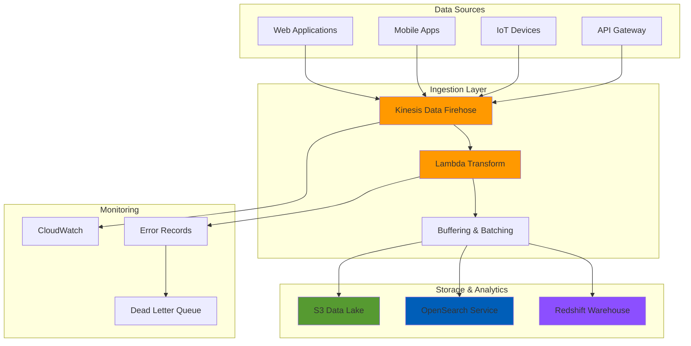

# Processing Streaming Data with Kinesis Data Firehose

## Problem

E-commerce companies process millions of real-time events daily from web applications, mobile apps, and IoT devices. These events need to be transformed, enriched, and delivered to multiple destinations for real-time analytics, machine learning pipelines, and business intelligence. Traditional batch processing introduces hours of latency, preventing timely fraud detection, inventory management, and personalized recommendations. Companies struggle with building scalable, reliable streaming infrastructure that can handle variable loads while maintaining data integrity and providing delivery guarantees.

## Solution

Amazon Kinesis Data Firehose provides a fully managed solution for real-time data streaming that automatically scales to handle massive throughput while delivering data to multiple destinations. This serverless approach combines real-time data transformation using Lambda functions with automatic format conversion, compression, and intelligent buffering. The solution delivers processed data to S3 for long-term analytics, OpenSearch for real-time search and dashboards, and Redshift for data warehousing, all while providing comprehensive monitoring and error handling.

## Architecture Diagram



## Prerequisites

1. AWS account with appropriate permissions for Kinesis Data Firehose, Lambda, S3, OpenSearch, and Redshift
2. AWS CLI v2 installed and configured (or AWS CloudShell)
3. Basic knowledge of JSON data formats and Lambda functions
4. Understanding of streaming data concepts and analytics workflows
5. Estimated cost: $50-100 for resources created during this recipe

> **Note**: This recipe creates billable resources. Clean up all resources after completion to avoid ongoing charges.

## Preparation

```bash
# Set environment variables
export AWS_REGION=$(aws configure get region)
export AWS_ACCOUNT_ID=$(aws sts get-caller-identity \
    --query Account --output text)

# Generate unique identifiers for resources
RANDOM_SUFFIX=$(aws secretsmanager get-random-password \
    --exclude-punctuation --exclude-uppercase \
    --password-length 6 --require-each-included-type \
    --output text --query RandomPassword)

export FIREHOSE_STREAM_NAME="realtime-data-stream-${RANDOM_SUFFIX}"
export S3_BUCKET_NAME="firehose-data-bucket-${RANDOM_SUFFIX}"
export LAMBDA_FUNCTION_NAME="firehose-transform-${RANDOM_SUFFIX}"
export OPENSEARCH_DOMAIN="firehose-search-${RANDOM_SUFFIX}"
export REDSHIFT_CLUSTER="firehose-warehouse-${RANDOM_SUFFIX}"
export IAM_ROLE_NAME="FirehoseDeliveryRole-${RANDOM_SUFFIX}"

# Create S3 bucket for data storage
aws s3 mb s3://${S3_BUCKET_NAME} --region ${AWS_REGION}

# Create directory structure for different data types
aws s3api put-object \
    --bucket ${S3_BUCKET_NAME} \
    --key raw-data/ \
    --body /dev/null

aws s3api put-object \
    --bucket ${S3_BUCKET_NAME} \
    --key transformed-data/ \
    --body /dev/null

aws s3api put-object \
    --bucket ${S3_BUCKET_NAME} \
    --key error-data/ \
    --body /dev/null

echo "✅ Created S3 bucket: ${S3_BUCKET_NAME}"
```

## Steps

1. **Create IAM Role for Kinesis Data Firehose**:

   IAM roles provide secure, temporary credential delegation following AWS security best practices. Kinesis Data Firehose requires specific permissions to write to S3, invoke Lambda functions, and deliver data to OpenSearch, implementing the principle of least privilege. This foundational security configuration ensures that data flows securely between services without exposing long-term credentials or creating security vulnerabilities.

   ```bash
   # Create trust policy for Firehose service
   cat > firehose-trust-policy.json << EOF
   {
       "Version": "2012-10-17",
       "Statement": [
           {
               "Effect": "Allow",
               "Principal": {
                   "Service": "firehose.amazonaws.com"
               },
               "Action": "sts:AssumeRole"
           }
       ]
   }
   EOF
   
   # Create the IAM role
   aws iam create-role \
       --role-name ${IAM_ROLE_NAME} \
       --assume-role-policy-document file://firehose-trust-policy.json
   
   # Create permissions policy for Firehose
   cat > firehose-permissions-policy.json << EOF
   {
       "Version": "2012-10-17",
       "Statement": [
           {
               "Effect": "Allow",
               "Action": [
                   "s3:AbortMultipartUpload",
                   "s3:GetBucketLocation",
                   "s3:GetObject",
                   "s3:ListBucket",
                   "s3:ListBucketMultipartUploads",
                   "s3:PutObject"
               ],
               "Resource": [
                   "arn:aws:s3:::${S3_BUCKET_NAME}",
                   "arn:aws:s3:::${S3_BUCKET_NAME}/*"
               ]
           },
           {
               "Effect": "Allow",
               "Action": [
                   "lambda:InvokeFunction",
                   "lambda:GetFunctionConfiguration"
               ],
               "Resource": "arn:aws:lambda:${AWS_REGION}:${AWS_ACCOUNT_ID}:function:${LAMBDA_FUNCTION_NAME}"
           },
           {
               "Effect": "Allow",
               "Action": [
                   "es:DescribeElasticsearchDomain",
                   "es:DescribeElasticsearchDomains",
                   "es:DescribeElasticsearchDomainConfig",
                   "es:ESHttpPost",
                   "es:ESHttpPut"
               ],
               "Resource": "arn:aws:es:${AWS_REGION}:${AWS_ACCOUNT_ID}:domain/${OPENSEARCH_DOMAIN}/*"
           },
           {
               "Effect": "Allow",
               "Action": [
                   "logs:CreateLogGroup",
                   "logs:CreateLogStream",
                   "logs:PutLogEvents"
               ],
               "Resource": "arn:aws:logs:${AWS_REGION}:${AWS_ACCOUNT_ID}:*"
           }
       ]
   }
   EOF
   
   # Attach permissions policy to the role
   aws iam put-role-policy \
       --role-name ${IAM_ROLE_NAME} \
       --policy-name FirehoseDeliveryPolicy \
       --policy-document file://firehose-permissions-policy.json
   
   # Get the role ARN
   export FIREHOSE_ROLE_ARN=$(aws iam get-role \
       --role-name ${IAM_ROLE_NAME} \
       --query Role.Arn --output text)
   
   echo "✅ Created IAM role: ${FIREHOSE_ROLE_ARN}"
   ```

   The IAM role is now configured with the minimum permissions required for Firehose operations. This security foundation enables data delivery across multiple AWS services while maintaining strict access controls and audit capabilities through CloudTrail logging.

2. **Create Lambda Function for Data Transformation**:

   Lambda functions enable real-time data transformation and enrichment at massive scale without managing servers. This serverless approach automatically scales to handle varying data volumes while providing built-in monitoring and error handling. The transformation function enriches incoming events with metadata, performs data validation, and implements business logic that would be impossible with static transformations.

   ```bash
   # Create Lambda function code for data transformation
   cat > transform_function.py << 'EOF'
   import json
   import base64
   import boto3
   from datetime import datetime
   
   def lambda_handler(event, context):
       output = []
       
       for record in event['records']:
           # Decode the data
           compressed_payload = base64.b64decode(record['data'])
           uncompressed_payload = compressed_payload.decode('utf-8')
           
           try:
               # Parse JSON data
               data = json.loads(uncompressed_payload)
               
               # Add timestamp and processing metadata
               data['processed_timestamp'] = datetime.utcnow().isoformat()
               data['processing_status'] = 'SUCCESS'
               
               # Enrich data with additional fields
               if 'user_id' in data:
                   data['user_category'] = 'registered' if data['user_id'] else 'guest'
               
               if 'amount' in data:
                   data['amount_category'] = 'high' if float(data['amount']) > 100 else 'low'
               
               # Convert back to JSON
               transformed_data = json.dumps(data) + '\n'
               
               output_record = {
                   'recordId': record['recordId'],
                   'result': 'Ok',
                   'data': base64.b64encode(transformed_data.encode('utf-8')).decode('utf-8')
               }
               
           except Exception as e:
               # Handle transformation errors
               error_data = {
                   'recordId': record['recordId'],
                   'error': str(e),
                   'original_data': uncompressed_payload,
                   'timestamp': datetime.utcnow().isoformat()
               }
               
               output_record = {
                   'recordId': record['recordId'],
                   'result': 'ProcessingFailed',
                   'data': base64.b64encode(json.dumps(error_data).encode('utf-8')).decode('utf-8')
               }
           
           output.append(output_record)
       
       return {'records': output}
   EOF
   
   # Create deployment package
   zip transform_function.zip transform_function.py
   
   # Create Lambda function
   aws lambda create-function \
       --function-name ${LAMBDA_FUNCTION_NAME} \
       --runtime python3.9 \
       --role arn:aws:iam::${AWS_ACCOUNT_ID}:role/${IAM_ROLE_NAME} \
       --handler transform_function.lambda_handler \
       --zip-file fileb://transform_function.zip \
       --timeout 300 \
       --memory-size 128
   
   # Get Lambda function ARN
   export LAMBDA_FUNCTION_ARN=$(aws lambda get-function \
       --function-name ${LAMBDA_FUNCTION_NAME} \
       --query Configuration.FunctionArn --output text)
   
   echo "✅ Created Lambda function: ${LAMBDA_FUNCTION_ARN}"
   ```

   The Lambda function is deployed and ready to process streaming data. This transformation layer adds business intelligence to raw events, enabling downstream analytics systems to work with cleaner, more structured data that directly supports business decision-making.

3. **Create OpenSearch Domain for Real-Time Search**:

   OpenSearch provides near real-time search and analytics capabilities with sub-second query latencies, essential for operational dashboards and business intelligence. This managed service eliminates the complexity of maintaining Elasticsearch clusters while providing automatic scaling, backup management, and security features. The search capabilities enable stakeholders to quickly investigate issues, monitor trends, and gain insights from streaming data.

   ```bash
   # Create OpenSearch domain for real-time analytics
   aws opensearch create-domain \
       --domain-name ${OPENSEARCH_DOMAIN} \
       --engine-version OpenSearch_1.3 \
       --cluster-config InstanceType=t3.small.search,InstanceCount=1 \
       --ebs-options EBSEnabled=true,VolumeType=gp2,VolumeSize=20 \
       --access-policies '{
           "Version": "2012-10-17",
           "Statement": [
               {
                   "Effect": "Allow",
                   "Principal": {
                       "AWS": "arn:aws:iam::'${AWS_ACCOUNT_ID}':root"
                   },
                   "Action": "es:*",
                   "Resource": "arn:aws:es:'${AWS_REGION}':'${AWS_ACCOUNT_ID}':domain/'${OPENSEARCH_DOMAIN}'/*"
               }
           ]
       }' \
       --domain-endpoint-options EnforceHTTPS=true
   
   # Wait for domain to be active
   echo "⏳ Waiting for OpenSearch domain to be active..."
   aws opensearch wait domain-status \
       --domain-name ${OPENSEARCH_DOMAIN}
   
   # Get domain endpoint
   export OPENSEARCH_ENDPOINT=$(aws opensearch describe-domain \
       --domain-name ${OPENSEARCH_DOMAIN} \
       --query DomainStatus.Endpoint --output text)
   
   echo "✅ Created OpenSearch domain: ${OPENSEARCH_ENDPOINT}"
   ```

   The OpenSearch domain is provisioned and ready to receive streaming data for real-time indexing. This search infrastructure enables business users to perform complex queries on live data streams, supporting use cases like fraud detection, customer behavior analysis, and operational monitoring.

4. **Create Kinesis Data Firehose Delivery Stream with S3 Destination**:

   Kinesis Data Firehose serves as the core streaming infrastructure that reliably delivers data to multiple destinations with built-in buffering, compression, and format conversion. The S3 destination provides cost-effective, durable storage for long-term analytics while automatic Parquet conversion optimizes query performance and reduces storage costs. This configuration balances real-time processing needs with analytical efficiency.

   ```bash
   # Create Firehose configuration for S3 delivery
   cat > firehose-s3-config.json << EOF
   {
       "DeliveryStreamName": "${FIREHOSE_STREAM_NAME}",
       "DeliveryStreamType": "DirectPut",
       "S3DestinationConfiguration": {
           "RoleARN": "${FIREHOSE_ROLE_ARN}",
           "BucketARN": "arn:aws:s3:::${S3_BUCKET_NAME}",
           "Prefix": "transformed-data/year=!{timestamp:yyyy}/month=!{timestamp:MM}/day=!{timestamp:dd}/hour=!{timestamp:HH}/",
           "ErrorOutputPrefix": "error-data/",
           "BufferingHints": {
               "SizeInMBs": 5,
               "IntervalInSeconds": 300
           },
           "CompressionFormat": "GZIP",
           "ProcessingConfiguration": {
               "Enabled": true,
               "Processors": [
                   {
                       "Type": "Lambda",
                       "Parameters": [
                           {
                               "ParameterName": "LambdaArn",
                               "ParameterValue": "${LAMBDA_FUNCTION_ARN}"
                           },
                           {
                               "ParameterName": "BufferSizeInMBs",
                               "ParameterValue": "3"
                           },
                           {
                               "ParameterName": "BufferIntervalInSeconds",
                               "ParameterValue": "60"
                           }
                       ]
                   }
               ]
           },
           "DataFormatConversionConfiguration": {
               "Enabled": true,
               "OutputFormatConfiguration": {
                   "Serializer": {
                       "ParquetSerDe": {}
                   }
               }
           },
           "CloudWatchLoggingOptions": {
               "Enabled": true,
               "LogGroupName": "/aws/kinesisfirehose/${FIREHOSE_STREAM_NAME}",
               "LogStreamName": "S3Delivery"
           }
       }
   }
   EOF
   
   # Create the Firehose delivery stream
   aws firehose create-delivery-stream \
       --cli-input-json file://firehose-s3-config.json
   
   # Wait for stream to be active
   echo "⏳ Waiting for Firehose stream to be active..."
   aws firehose wait delivery-stream-active \
       --delivery-stream-name ${FIREHOSE_STREAM_NAME}
   
   echo "✅ Created Firehose delivery stream: ${FIREHOSE_STREAM_NAME}"
   ```

   The primary delivery stream is active and configured for reliable data delivery to S3 with automatic compression and format optimization. This establishes the foundation for cost-effective data lake storage while ensuring data durability and enabling efficient downstream analytics processing.

> **Warning**: Monitor buffer settings carefully in production. Smaller buffers reduce latency but increase API costs, while larger buffers optimize costs but may increase end-to-end latency for time-sensitive analytics.

5. **Configure OpenSearch Destination for Real-Time Analytics**:

   Creating a separate delivery stream for OpenSearch enables parallel data delivery with different buffering strategies optimized for search use cases. OpenSearch requires smaller, more frequent updates to maintain near real-time search capabilities, while S3 storage benefits from larger, less frequent writes for cost optimization. This dual-stream approach maximizes both search performance and storage efficiency.

   ```bash
   # Wait additional time for OpenSearch to be fully ready
   sleep 60
   
   # Create Firehose configuration for OpenSearch delivery
   cat > firehose-opensearch-config.json << EOF
   {
       "DeliveryStreamName": "${FIREHOSE_STREAM_NAME}-opensearch",
       "DeliveryStreamType": "DirectPut",
       "OpenSearchDestinationConfiguration": {
           "RoleARN": "${FIREHOSE_ROLE_ARN}",
           "DomainARN": "arn:aws:es:${AWS_REGION}:${AWS_ACCOUNT_ID}:domain/${OPENSEARCH_DOMAIN}",
           "IndexName": "realtime-events",
           "TypeName": "_doc",
           "IndexRotationPeriod": "OneDay",
           "BufferingHints": {
               "SizeInMBs": 1,
               "IntervalInSeconds": 60
           },
           "RetryOptions": {
               "DurationInSeconds": 3600
           },
           "S3BackupMode": "AllDocuments",
           "S3Configuration": {
               "RoleARN": "${FIREHOSE_ROLE_ARN}",
               "BucketARN": "arn:aws:s3:::${S3_BUCKET_NAME}",
               "Prefix": "opensearch-backup/",
               "BufferingHints": {
                   "SizeInMBs": 5,
                   "IntervalInSeconds": 300
               },
               "CompressionFormat": "GZIP"
           },
           "ProcessingConfiguration": {
               "Enabled": true,
               "Processors": [
                   {
                       "Type": "Lambda",
                       "Parameters": [
                           {
                               "ParameterName": "LambdaArn",
                               "ParameterValue": "${LAMBDA_FUNCTION_ARN}"
                           }
                       ]
                   }
               ]
           },
           "CloudWatchLoggingOptions": {
               "Enabled": true,
               "LogGroupName": "/aws/kinesisfirehose/${FIREHOSE_STREAM_NAME}-opensearch",
               "LogStreamName": "OpenSearchDelivery"
           }
       }
   }
   EOF
   
   # Create OpenSearch delivery stream
   aws firehose create-delivery-stream \
       --cli-input-json file://firehose-opensearch-config.json
   
   # Wait for stream to be active
   echo "⏳ Waiting for OpenSearch delivery stream to be active..."
   aws firehose wait delivery-stream-active \
       --delivery-stream-name ${FIREHOSE_STREAM_NAME}-opensearch
   
   echo "✅ Created OpenSearch delivery stream: ${FIREHOSE_STREAM_NAME}-opensearch"
   ```

   The OpenSearch delivery stream is configured with optimized buffering for real-time search scenarios. This parallel processing capability ensures that business users can search and analyze data within minutes of ingestion while maintaining robust backup and long-term storage capabilities.

6. **Configure Monitoring and Alarms**:

   Comprehensive monitoring ensures reliable data pipeline operations and enables proactive issue resolution before business impact occurs. CloudWatch alarms provide automated detection of delivery failures, transformation errors, and performance degradation, enabling rapid response to operational issues. This observability layer is crucial for maintaining SLA commitments and ensuring data pipeline reliability.

   ```bash
   # Create CloudWatch alarms for monitoring
   aws cloudwatch put-metric-alarm \
       --alarm-name "${FIREHOSE_STREAM_NAME}-DeliveryErrors" \
       --alarm-description "Monitor Firehose delivery errors" \
       --metric-name DeliveryToS3.Records \
       --namespace AWS/KinesisFirehose \
       --statistic Sum \
       --period 300 \
       --threshold 0 \
       --comparison-operator GreaterThanThreshold \
       --dimensions Name=DeliveryStreamName,Value=${FIREHOSE_STREAM_NAME} \
       --evaluation-periods 2 \
       --alarm-actions arn:aws:sns:${AWS_REGION}:${AWS_ACCOUNT_ID}:firehose-alerts
   
   # Create alarm for Lambda transformation errors
   aws cloudwatch put-metric-alarm \
       --alarm-name "${LAMBDA_FUNCTION_NAME}-Errors" \
       --alarm-description "Monitor Lambda transformation errors" \
       --metric-name Errors \
       --namespace AWS/Lambda \
       --statistic Sum \
       --period 300 \
       --threshold 5 \
       --comparison-operator GreaterThanThreshold \
       --dimensions Name=FunctionName,Value=${LAMBDA_FUNCTION_NAME} \
       --evaluation-periods 2
   
   # Create alarm for OpenSearch delivery failures
   aws cloudwatch put-metric-alarm \
       --alarm-name "${FIREHOSE_STREAM_NAME}-OpenSearchErrors" \
       --alarm-description "Monitor OpenSearch delivery errors" \
       --metric-name DeliveryToOpenSearch.Records \
       --namespace AWS/KinesisFirehose \
       --statistic Sum \
       --period 300 \
       --threshold 0 \
       --comparison-operator GreaterThanThreshold \
       --dimensions Name=DeliveryStreamName,Value=${FIREHOSE_STREAM_NAME}-opensearch \
       --evaluation-periods 2
   
   echo "✅ Created CloudWatch monitoring alarms"
   ```

   The monitoring infrastructure is now active and will alert on critical issues affecting data delivery reliability. This observability framework enables operations teams to maintain high availability and quickly troubleshoot issues that could impact business intelligence and analytics workflows.

7. **Test Data Ingestion and Processing**:

   Testing with realistic data patterns validates the entire pipeline configuration and ensures that transformations, delivery mechanisms, and error handling work as expected. This validation step verifies that business logic in Lambda functions produces expected enrichments and that data reaches all destinations in the correct format. Proper testing prevents production issues and validates performance under realistic load patterns.

   ```bash
   # Create sample data for testing
   cat > sample-events.json << 'EOF'
   [
       {
           "event_id": "evt001",
           "user_id": "user123",
           "event_type": "purchase",
           "amount": 150.50,
           "product_id": "prod456",
           "timestamp": "2024-01-15T10:30:00Z"
       },
       {
           "event_id": "evt002",
           "user_id": "user456",
           "event_type": "view",
           "product_id": "prod789",
           "timestamp": "2024-01-15T10:31:00Z"
       },
       {
           "event_id": "evt003",
           "user_id": "user789",
           "event_type": "purchase",
           "amount": 75.25,
           "product_id": "prod123",
           "timestamp": "2024-01-15T10:32:00Z"
       }
   ]
   EOF
   
   # Send test records to Firehose
   echo "🔄 Sending test data to Firehose streams..."
   
   # Send to S3 stream
   for event in $(jq -c '.[]' sample-events.json); do
       aws firehose put-record \
           --delivery-stream-name ${FIREHOSE_STREAM_NAME} \
           --record Data="$(echo $event | base64)"
   done
   
   # Send to OpenSearch stream
   for event in $(jq -c '.[]' sample-events.json); do
       aws firehose put-record \
           --delivery-stream-name ${FIREHOSE_STREAM_NAME}-opensearch \
           --record Data="$(echo $event | base64)"
   done
   
   echo "✅ Sent test data to Firehose streams"
   
   # Send batch records for testing
   aws firehose put-record-batch \
       --delivery-stream-name ${FIREHOSE_STREAM_NAME} \
       --records '[
           {"Data": "eyJldmVudF9pZCI6ImV2dDAwNCIsInVzZXJfaWQiOiJ1c2VyMDAxIiwiZXZlbnRfdHlwZSI6ImFkZF90b19jYXJ0IiwicHJvZHVjdF9pZCI6InByb2Q5OTkiLCJ0aW1lc3RhbXAiOiIyMDI0LTAxLTE1VDEwOjMzOjAwWiJ9"},
           {"Data": "eyJldmVudF9pZCI6ImV2dDAwNSIsInVzZXJfaWQiOiJ1c2VyMDAyIiwiZXZlbnRfdHlwZSI6InJlbW92ZV9mcm9tX2NhcnQiLCJwcm9kdWN0X2lkIjoicHJvZDg4OCIsInRpbWVzdGFtcCI6IjIwMjQtMDEtMTVUMTA6MzQ6MDBaIn0="}
       ]'
   
   echo "✅ Sent batch records to Firehose"
   ```

   Test data has been successfully ingested into both delivery streams, demonstrating the pipeline's ability to handle both individual records and batch operations. This validates that the transformation logic works correctly and that data flows to all configured destinations, confirming readiness for production workloads.

8. **Configure Error Handling and Dead Letter Queues**:

   Robust error handling ensures data integrity and provides mechanisms for investigating and recovering from processing failures. Dead letter queues capture failed records for manual review and potential replay, preventing data loss while maintaining pipeline throughput. This resilience pattern is essential for mission-critical data pipelines where data loss could impact business operations or compliance requirements.

   ```bash
   # Create SQS queue for failed records
   aws sqs create-queue \
       --queue-name ${FIREHOSE_STREAM_NAME}-dlq \
       --attributes VisibilityTimeoutSeconds=300,MessageRetentionPeriod=1209600
   
   # Get SQS queue URL
   export DLQ_URL=$(aws sqs get-queue-url \
       --queue-name ${FIREHOSE_STREAM_NAME}-dlq \
       --query QueueUrl --output text)
   
   # Create Lambda function for error handling
   cat > error_handler.py << 'EOF'
   import json
   import boto3
   
   def lambda_handler(event, context):
       sqs = boto3.client('sqs')
       
       for record in event['Records']:
           if record['eventName'] == 'ERROR':
               # Send failed record to DLQ
               sqs.send_message(
                   QueueUrl=os.environ['DLQ_URL'],
                   MessageBody=json.dumps(record)
               )
       
       return {'statusCode': 200}
   EOF
   
   # Create error handling Lambda
   zip error_handler.zip error_handler.py
   
   aws lambda create-function \
       --function-name ${LAMBDA_FUNCTION_NAME}-error-handler \
       --runtime python3.9 \
       --role arn:aws:iam::${AWS_ACCOUNT_ID}:role/${IAM_ROLE_NAME} \
       --handler error_handler.lambda_handler \
       --zip-file fileb://error_handler.zip \
       --environment Variables="{DLQ_URL=${DLQ_URL}}"
   
   echo "✅ Created error handling infrastructure"
   ```

   The error handling system is configured to capture and manage failed records, ensuring no data is lost during processing. This resilience framework enables operations teams to investigate issues, apply fixes, and replay failed data, maintaining complete data integrity across the streaming pipeline.

> **Note**: Review dead letter queue contents regularly in production. Failed records may indicate data quality issues, schema changes, or processing logic errors that require attention. Implement automated monitoring for DLQ depth to ensure timely issue resolution.

## Validation & Testing

1. **Verify Firehose Delivery Stream Status**:

   ```bash
   # Check delivery stream status
   aws firehose describe-delivery-stream \
       --delivery-stream-name ${FIREHOSE_STREAM_NAME} \
       --query 'DeliveryStreamDescription.DeliveryStreamStatus'
   ```

   Expected output: `"ACTIVE"`

2. **Verify Data Delivery to S3**:

   ```bash
   # Wait for data to be processed (5-10 minutes)
   echo "⏳ Waiting for data processing..."
   sleep 300
   
   # Check S3 bucket for delivered files
   aws s3 ls s3://${S3_BUCKET_NAME}/transformed-data/ --recursive
   ```

   Expected output: List of Parquet files with timestamp-based prefixes

3. **Verify Lambda Transformation Function**:

   ```bash
   # Check Lambda function logs
   aws logs describe-log-groups \
       --log-group-name-prefix /aws/lambda/${LAMBDA_FUNCTION_NAME}
   
   # Get recent log events
   aws logs describe-log-streams \
       --log-group-name /aws/lambda/${LAMBDA_FUNCTION_NAME} \
       --order-by LastEventTime \
       --descending \
       --max-items 1
   ```

   Expected output: Log streams showing successful transformations

4. **Test OpenSearch Data Indexing**:

   ```bash
   # Check OpenSearch indices
   curl -X GET "https://${OPENSEARCH_ENDPOINT}/_cat/indices?v"
   
   # Query sample data
   curl -X GET "https://${OPENSEARCH_ENDPOINT}/realtime-events/_search?pretty" \
       -H "Content-Type: application/json" \
       -d '{"query": {"match_all": {}}}'
   ```

   Expected output: Index information and sample documents

5. **Monitor CloudWatch Metrics**:

   ```bash
   # Check Firehose metrics
   aws cloudwatch get-metric-statistics \
       --namespace AWS/KinesisFirehose \
       --metric-name DeliveryToS3.Records \
       --dimensions Name=DeliveryStreamName,Value=${FIREHOSE_STREAM_NAME} \
       --start-time $(date -u -d '1 hour ago' '+%Y-%m-%dT%H:%M:%S') \
       --end-time $(date -u '+%Y-%m-%dT%H:%M:%S') \
       --period 300 \
       --statistics Sum
   ```

   Expected output: Metrics showing successful record delivery

## Cleanup

1. **Delete Kinesis Data Firehose Delivery Streams**:

   ```bash
   # Delete delivery streams
   aws firehose delete-delivery-stream \
       --delivery-stream-name ${FIREHOSE_STREAM_NAME}
   
   aws firehose delete-delivery-stream \
       --delivery-stream-name ${FIREHOSE_STREAM_NAME}-opensearch
   
   echo "✅ Deleted Firehose delivery streams"
   ```

2. **Delete OpenSearch Domain**:

   ```bash
   # Delete OpenSearch domain
   aws opensearch delete-domain \
       --domain-name ${OPENSEARCH_DOMAIN}
   
   echo "✅ Deleted OpenSearch domain"
   ```

3. **Delete Lambda Functions**:

   ```bash
   # Delete Lambda functions
   aws lambda delete-function \
       --function-name ${LAMBDA_FUNCTION_NAME}
   
   aws lambda delete-function \
       --function-name ${LAMBDA_FUNCTION_NAME}-error-handler
   
   echo "✅ Deleted Lambda functions"
   ```

4. **Delete S3 Bucket and Contents**:

   ```bash
   # Delete all objects in bucket
   aws s3 rm s3://${S3_BUCKET_NAME} --recursive
   
   # Delete bucket
   aws s3 rb s3://${S3_BUCKET_NAME}
   
   echo "✅ Deleted S3 bucket and contents"
   ```

5. **Delete IAM Role and Policies**:

   ```bash
   # Delete inline policy
   aws iam delete-role-policy \
       --role-name ${IAM_ROLE_NAME} \
       --policy-name FirehoseDeliveryPolicy
   
   # Delete IAM role
   aws iam delete-role \
       --role-name ${IAM_ROLE_NAME}
   
   echo "✅ Deleted IAM role and policies"
   ```

6. **Delete CloudWatch Alarms and SQS Queue**:

   ```bash
   # Delete CloudWatch alarms
   aws cloudwatch delete-alarms \
       --alarm-names "${FIREHOSE_STREAM_NAME}-DeliveryErrors" \
                     "${LAMBDA_FUNCTION_NAME}-Errors" \
                     "${FIREHOSE_STREAM_NAME}-OpenSearchErrors"
   
   # Delete SQS queue
   aws sqs delete-queue \
       --queue-url ${DLQ_URL}
   
   # Clean up local files
   rm -f firehose-trust-policy.json \
         firehose-permissions-policy.json \
         firehose-s3-config.json \
         firehose-opensearch-config.json \
         sample-events.json \
         transform_function.py \
         transform_function.zip \
         error_handler.py \
         error_handler.zip
   
   echo "✅ Cleaned up monitoring resources and local files"
   ```

## Discussion

Amazon Kinesis Data Firehose provides a powerful, fully managed solution for real-time data processing that eliminates the complexity of building and maintaining streaming infrastructure. The serverless architecture automatically handles scaling, buffering, and delivery while providing built-in transformations through Lambda functions. This approach offers significant advantages over traditional batch processing by reducing latency from hours to minutes and providing near real-time insights for business operations.

The integration with multiple destinations demonstrates Firehose's flexibility in supporting diverse analytics use cases. S3 storage with automatic Parquet conversion enables cost-effective long-term storage and fast querying with tools like Amazon Athena. OpenSearch integration provides real-time search capabilities for operational dashboards and monitoring applications. The built-in error handling and retry mechanisms ensure data reliability, while CloudWatch monitoring provides comprehensive visibility into stream performance and health.

Key architectural decisions include using Lambda for data transformation, which provides flexibility for enrichment, filtering, and format conversion while maintaining serverless scalability. The buffering configuration balances between latency and cost efficiency, with smaller buffers providing lower latency at the cost of more frequent S3 puts. The Parquet format conversion significantly reduces storage costs and improves query performance for analytics workloads.

> **Tip**: Configure buffer sizes based on your latency requirements and cost constraints. Smaller buffers (1-5 MB) provide lower latency but higher costs, while larger buffers (64-128 MB) optimize for cost but increase latency.

For production deployments, consider implementing comprehensive monitoring with custom metrics, setting up automated alerting for failed deliveries, and establishing data quality checks within transformation functions. The dead letter queue pattern ensures failed records are captured for manual investigation and replay, maintaining data integrity across the pipeline.

## Challenge

Extend this solution by implementing these enhancements:

1. **Multi-Format Support**: Modify the Lambda transformation function to handle multiple input formats (JSON, CSV, Avro) and convert them to a standardized output schema with data validation and cleansing rules.

2. **Real-Time Alerting**: Implement Amazon SNS notifications for delivery failures, transformation errors, and data quality issues, with integration to Slack or PagerDuty for operations teams.

3. **Advanced Analytics Integration**: Add Amazon Redshift as a destination for data warehousing, configure automatic table creation, and implement incremental data loading patterns with COPY commands.

4. **Cross-Region Replication**: Set up cross-region replication for disaster recovery by creating secondary Firehose streams in different AWS regions with S3 cross-region replication.

5. **Machine Learning Integration**: Integrate with Amazon SageMaker for real-time inference on streaming data, using the transformed data to trigger ML model predictions and store results back to the data lake.

## Infrastructure Code

*Infrastructure code will be generated after recipe approval.*