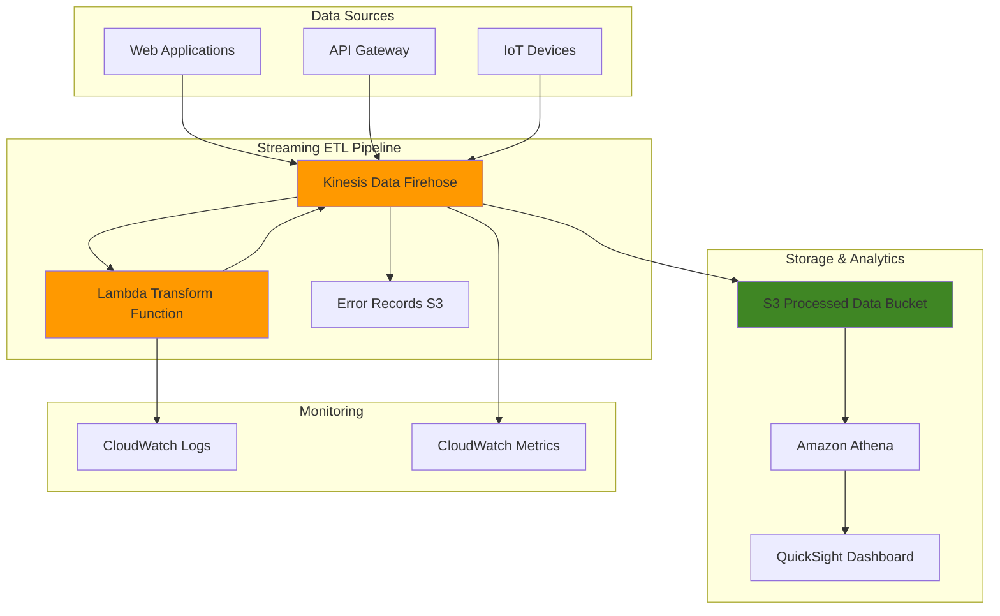

# Streaming ETL with Kinesis Data Firehose

## Problem

E-commerce companies need to process millions of real-time clickstream events daily to power analytics dashboards and machine learning models. Raw event data arrives in different formats from various sources, requires data enrichment, and must be converted to optimized formats like Parquet for cost-effective storage and fast querying. Traditional batch ETL processes introduce hours of latency, making real-time business insights impossible and delaying critical decision-making.

## Solution

Amazon Kinesis Data Firehose provides a fully managed streaming ETL solution that automatically scales to handle high-throughput data streams. By combining Firehose with Lambda transformation functions, you can clean, enrich, and format data in real-time before storing it in S3 as Parquet files. This serverless architecture eliminates infrastructure management while providing millisecond-level data processing latency.

## Architecture Diagram



## Prerequisites

1. AWS account with permissions for Kinesis Data Firehose, Lambda, S3, and CloudWatch
2. AWS CLI v2 installed and configured (or AWS CloudShell)
3. Basic understanding of streaming data processing concepts
4. Familiarity with Lambda functions and JSON data formats
5. jq command-line tool for JSON processing
6. Estimated cost: $15-25 for resources created during this recipe

> **Note**: Kinesis Data Firehose charges based on data volume ingested. This recipe uses minimal test data to keep costs low. For detailed pricing information, see the [Amazon Data Firehose pricing page](https://aws.amazon.com/firehose/pricing/).

## Preparation

```bash
# Set environment variables
export AWS_REGION=$(aws configure get region)
export AWS_ACCOUNT_ID=$(aws sts get-caller-identity \
    --query Account --output text)

# Generate unique identifiers for resources
RANDOM_SUFFIX=$(aws secretsmanager get-random-password \
    --exclude-punctuation --exclude-uppercase \
    --password-length 6 --require-each-included-type \
    --output text --query RandomPassword)

export FIREHOSE_STREAM_NAME="streaming-etl-${RANDOM_SUFFIX}"
export LAMBDA_FUNCTION_NAME="firehose-transform-${RANDOM_SUFFIX}"
export S3_BUCKET_NAME="streaming-etl-data-${RANDOM_SUFFIX}"
export IAM_ROLE_NAME="FirehoseDeliveryRole-${RANDOM_SUFFIX}"
export LAMBDA_ROLE_NAME="FirehoseLambdaRole-${RANDOM_SUFFIX}"

# Create S3 bucket for data storage with versioning and encryption
aws s3 mb s3://${S3_BUCKET_NAME} --region ${AWS_REGION}

aws s3api put-bucket-versioning \
    --bucket ${S3_BUCKET_NAME} \
    --versioning-configuration Status=Enabled

aws s3api put-bucket-encryption \
    --bucket ${S3_BUCKET_NAME} \
    --server-side-encryption-configuration \
    'Rules=[{ApplyServerSideEncryptionByDefault:{SSEAlgorithm:AES256}}]'

echo "✅ S3 bucket created with security features: s3://${S3_BUCKET_NAME}"
```

## Steps

1. **Create IAM Role for Firehose Delivery**:

   Kinesis Data Firehose requires an IAM role with appropriate permissions to access S3, Lambda, and other services. This role acts as the service's identity when performing actions on your behalf, following AWS security best practices of granting minimal necessary permissions. For detailed information about IAM roles and access control, see the [Controlling access with Amazon Data Firehose](https://docs.aws.amazon.com/firehose/latest/dev/controlling-access.html) documentation.

   ```bash
   # Create trust policy for Firehose
   cat > firehose-trust-policy.json << EOF
   {
     "Version": "2012-10-17",
     "Statement": [
       {
         "Effect": "Allow",
         "Principal": {
           "Service": "firehose.amazonaws.com"
         },
         "Action": "sts:AssumeRole"
       }
     ]
   }
   EOF
   
   # Create IAM role for Firehose
   aws iam create-role \
       --role-name ${IAM_ROLE_NAME} \
       --assume-role-policy-document file://firehose-trust-policy.json
   
   export FIREHOSE_ROLE_ARN=$(aws iam get-role \
       --role-name ${IAM_ROLE_NAME} \
       --query 'Role.Arn' --output text)
   
   echo "✅ Firehose IAM role created: ${FIREHOSE_ROLE_ARN}"
   ```

   The IAM role is now established with the proper trust relationship, allowing Firehose to assume this role and perform actions within your AWS account. This role will be granted specific permissions in subsequent steps.

2. **Create IAM Policy for Firehose S3 Access**:

   Firehose needs specific S3 permissions to deliver transformed data to your bucket. These permissions include the ability to write objects, manage multipart uploads, and list bucket contents - all essential for reliable data delivery.

   ```bash
   # Create policy for S3 access
   cat > firehose-s3-policy.json << EOF
   {
     "Version": "2012-10-17",
     "Statement": [
       {
         "Effect": "Allow",
         "Action": [
           "s3:AbortMultipartUpload",
           "s3:GetBucketLocation",
           "s3:GetObject",
           "s3:ListBucket",
           "s3:ListBucketMultipartUploads",
           "s3:PutObject",
           "s3:PutObjectAcl"
         ],
         "Resource": [
           "arn:aws:s3:::${S3_BUCKET_NAME}",
           "arn:aws:s3:::${S3_BUCKET_NAME}/*"
         ]
       }
     ]
   }
   EOF
   
   # Create and attach policy to Firehose role
   aws iam create-policy \
       --policy-name FirehoseS3DeliveryPolicy-${RANDOM_SUFFIX} \
       --policy-document file://firehose-s3-policy.json
   
   aws iam attach-role-policy \
       --role-name ${IAM_ROLE_NAME} \
       --policy-arn arn:aws:iam::${AWS_ACCOUNT_ID}:policy/FirehoseS3DeliveryPolicy-${RANDOM_SUFFIX}
   
   echo "✅ S3 delivery policy attached to Firehose role"
   ```

   The Firehose service now has the necessary permissions to write processed data to your S3 bucket, including handling large files through multipart uploads and managing object lifecycle operations.

3. **Create Lambda Function for Data Transformation**:

   Lambda functions integrated with Firehose require their own execution role to access CloudWatch Logs for monitoring and troubleshooting. This separation of roles follows security best practices and enables fine-grained permission management.

   ```bash
   # Create Lambda execution role
   cat > lambda-trust-policy.json << EOF
   {
     "Version": "2012-10-17",
     "Statement": [
       {
         "Effect": "Allow",
         "Principal": {
           "Service": "lambda.amazonaws.com"
         },
         "Action": "sts:AssumeRole"
       }
     ]
   }
   EOF
   
   aws iam create-role \
       --role-name ${LAMBDA_ROLE_NAME} \
       --assume-role-policy-document file://lambda-trust-policy.json
   
   # Attach basic execution policy
   aws iam attach-role-policy \
       --role-name ${LAMBDA_ROLE_NAME} \
       --policy-arn arn:aws:iam::aws:policy/service-role/AWSLambdaBasicExecutionRole
   
   export LAMBDA_ROLE_ARN=$(aws iam get-role \
       --role-name ${LAMBDA_ROLE_NAME} \
       --query 'Role.Arn' --output text)
   
   echo "✅ Lambda IAM role created: ${LAMBDA_ROLE_ARN}"
   ```

   The Lambda execution role is ready to support your transformation function. The basic execution policy provides essential logging capabilities, enabling you to monitor function performance and troubleshoot issues.

4. **Create Lambda Transformation Function Code**:

   The transformation function is the core of your ETL pipeline, responsible for parsing, enriching, and formatting incoming data. This function demonstrates key patterns including error handling, data enrichment, and proper encoding for Firehose compatibility. For detailed information about data transformation requirements, see the [Transform source data in Amazon Data Firehose](https://docs.aws.amazon.com/firehose/latest/dev/data-transformation.html) documentation.

   ```bash
   # Create Lambda function code
   cat > lambda_function.py << 'EOF'
   import json
   import base64
   import boto3
   from datetime import datetime
   
   def lambda_handler(event, context):
       output = []
       
       for record in event['records']:
           try:
               # Decode the data
               compressed_payload = base64.b64decode(record['data'])
               uncompressed_payload = compressed_payload.decode('utf-8')
               
               # Parse JSON data
               data = json.loads(uncompressed_payload)
               
               # Transform the data - add timestamp and enrich
               transformed_data = {
                   'timestamp': datetime.utcnow().isoformat(),
                   'event_type': data.get('event_type', 'unknown'),
                   'user_id': data.get('user_id', 'anonymous'),
                   'session_id': data.get('session_id', ''),
                   'page_url': data.get('page_url', ''),
                   'referrer': data.get('referrer', ''),
                   'user_agent': data.get('user_agent', ''),
                   'ip_address': data.get('ip_address', ''),
                   'processed_by': 'lambda-firehose-transform',
                   'processing_timestamp': datetime.utcnow().timestamp()
               }
               
               # Convert back to JSON and encode
               output_record = {
                   'recordId': record['recordId'],
                   'result': 'Ok',
                   'data': base64.b64encode(
                       (json.dumps(transformed_data) + '\n').encode('utf-8')
                   ).decode('utf-8')
               }
               
           except Exception as e:
               print(f"Error processing record {record['recordId']}: {str(e)}")
               # Mark as processing failed
               output_record = {
                   'recordId': record['recordId'],
                   'result': 'ProcessingFailed'
               }
           
           output.append(output_record)
       
       print(f"Successfully processed {len([r for r in output if r['result'] == 'Ok'])} out of {len(output)} records")
       return {'records': output}
   EOF
   
   # Create deployment package
   zip lambda-function.zip lambda_function.py
   
   echo "✅ Lambda function code created and packaged"
   ```

   Your transformation logic is now packaged and ready for deployment. The function handles common real-world scenarios like adding timestamps, enriching with metadata, and gracefully handling malformed records. The newline character added to each record ensures proper delimiting for downstream processing.

5. **Deploy Lambda Function**:

   Deploying the Lambda function creates the compute resource that will process your streaming data. The function configuration includes appropriate timeouts and memory allocation to handle the expected data transformation workload efficiently. We're using Python 3.12 as it's the current recommended runtime version.

   ```bash
   # Create Lambda function
   aws lambda create-function \
       --function-name ${LAMBDA_FUNCTION_NAME} \
       --runtime python3.12 \
       --role ${LAMBDA_ROLE_ARN} \
       --handler lambda_function.lambda_handler \
       --zip-file fileb://lambda-function.zip \
       --timeout 300 \
       --memory-size 256 \
       --description "Firehose data transformation function"
   
   # Wait for function to be active
   aws lambda wait function-active \
       --function-name ${LAMBDA_FUNCTION_NAME}
   
   # Get Lambda function ARN
   export LAMBDA_FUNCTION_ARN=$(aws lambda get-function \
       --function-name ${LAMBDA_FUNCTION_NAME} \
       --query 'Configuration.FunctionArn' --output text)
   
   echo "✅ Lambda function deployed: ${LAMBDA_FUNCTION_ARN}"
   ```

   Your Lambda function is now active and ready to process data from Firehose. The function ARN will be used to configure Firehose to invoke this specific function for data transformations.

6. **Grant Firehose Permission to Invoke Lambda**:

   Firehose must have explicit permission to invoke your Lambda function. This cross-service permission ensures that only your Firehose delivery stream can trigger the transformation function, maintaining security boundaries.

   ```bash
   # Add Lambda invoke permission to Firehose role policy
   cat > firehose-lambda-policy.json << EOF
   {
     "Version": "2012-10-17",
     "Statement": [
       {
         "Effect": "Allow",
         "Action": [
           "lambda:InvokeFunction"
         ],
         "Resource": "${LAMBDA_FUNCTION_ARN}"
       }
     ]
   }
   EOF
   
   aws iam create-policy \
       --policy-name FirehoseLambdaInvokePolicy-${RANDOM_SUFFIX} \
       --policy-document file://firehose-lambda-policy.json
   
   aws iam attach-role-policy \
       --role-name ${IAM_ROLE_NAME} \
       --policy-arn arn:aws:iam::${AWS_ACCOUNT_ID}:policy/FirehoseLambdaInvokePolicy-${RANDOM_SUFFIX}
   
   echo "✅ Lambda invoke permission granted to Firehose"
   ```

   The permission bridge between Firehose and Lambda is now established. Firehose can invoke your transformation function to process incoming data records before delivering them to S3.

7. **Create Kinesis Data Firehose Delivery Stream**:

   The delivery stream configuration defines how data flows through your pipeline, including buffering settings, compression, partitioning strategy, and format conversion. This configuration balances performance, cost, and data organization requirements. The Parquet format conversion feature is particularly valuable for analytics workloads.

   ```bash
   # Create Firehose delivery stream configuration
   cat > firehose-config.json << EOF
   {
     "DeliveryStreamName": "${FIREHOSE_STREAM_NAME}",
     "DeliveryStreamType": "DirectPut",
     "ExtendedS3DestinationConfiguration": {
       "RoleARN": "${FIREHOSE_ROLE_ARN}",
       "BucketARN": "arn:aws:s3:::${S3_BUCKET_NAME}",
       "Prefix": "processed-data/year=!{timestamp:yyyy}/month=!{timestamp:MM}/day=!{timestamp:dd}/hour=!{timestamp:HH}/",
       "ErrorOutputPrefix": "error-data/",
       "BufferingHints": {
         "SizeInMBs": 5,
         "IntervalInSeconds": 300
       },
       "CompressionFormat": "GZIP",
       "ProcessingConfiguration": {
         "Enabled": true,
         "Processors": [
           {
             "Type": "Lambda",
             "Parameters": [
               {
                 "ParameterName": "LambdaArn",
                 "ParameterValue": "${LAMBDA_FUNCTION_ARN}"
               },
               {
                 "ParameterName": "BufferSizeInMBs",
                 "ParameterValue": "1"
               },
               {
                 "ParameterName": "BufferIntervalInSeconds",
                 "ParameterValue": "60"
               }
             ]
           }
         ]
       },
       "DataFormatConversionConfiguration": {
         "Enabled": true,
         "OutputFormatConfiguration": {
           "Serializer": {
             "ParquetSerDe": {}
           }
         },
         "SchemaConfiguration": {
           "DatabaseName": "default",
           "TableName": "streaming_etl_data",
           "RoleARN": "${FIREHOSE_ROLE_ARN}"
         }
       },
       "CloudWatchLoggingOptions": {
         "Enabled": true,
         "LogGroupName": "/aws/kinesisfirehose/${FIREHOSE_STREAM_NAME}"
       }
     }
   }
   EOF
   
   # Create delivery stream
   aws firehose create-delivery-stream \
       --cli-input-json file://firehose-config.json
   
   echo "✅ Kinesis Data Firehose delivery stream created"
   ```

   Your streaming ETL pipeline is now fully configured with Lambda transformation, Parquet conversion, and intelligent partitioning. The stream will automatically buffer, transform, and deliver your data to S3 in an optimized format.

8. **Wait for Firehose Stream to be Active**:

   Firehose streams require initialization time to allocate resources and validate configurations. Waiting for the active status ensures the stream is ready to accept and process data reliably.

   ```bash
   # Wait for stream to be active
   echo "Waiting for Firehose stream to be active..."
   
   # Check stream status periodically
   while true; do
     STATUS=$(aws firehose describe-delivery-stream \
         --delivery-stream-name ${FIREHOSE_STREAM_NAME} \
         --query 'DeliveryStreamDescription.DeliveryStreamStatus' \
         --output text)
     
     if [ "$STATUS" = "ACTIVE" ]; then
       echo "✅ Firehose stream is active and ready"
       break
     fi
     
     echo "Stream status: $STATUS - waiting..."
     sleep 10
   done
   ```

   The delivery stream is now operational and can accept incoming data records. All components are properly configured and validated, ready for production data processing.

9. **Create and Send Test Data**:

   Testing with realistic sample data validates that your entire ETL pipeline functions correctly. The test data simulates common e-commerce clickstream events that demonstrate various transformation scenarios and error handling capabilities.

   ```bash
   # Create sample clickstream data
   cat > test-data.json << 'EOF'
   [
     {
       "event_type": "page_view",
       "user_id": "user123",
       "session_id": "session456",
       "page_url": "https://example.com/products",
       "referrer": "https://google.com",
       "user_agent": "Mozilla/5.0 (Windows NT 10.0; Win64; x64)",
       "ip_address": "192.168.1.1"
     },
     {
       "event_type": "click",
       "user_id": "user456",
       "session_id": "session789",
       "page_url": "https://example.com/checkout",
       "referrer": "https://example.com/cart",
       "user_agent": "Mozilla/5.0 (Macintosh; Intel Mac OS X 10_15_7)",
       "ip_address": "192.168.1.2"
     },
     {
       "event_type": "purchase",
       "user_id": "user789",
       "session_id": "session101",
       "page_url": "https://example.com/success",
       "referrer": "https://example.com/checkout",
       "user_agent": "Mozilla/5.0 (X11; Linux x86_64)",
       "ip_address": "192.168.1.3"
     }
   ]
   EOF
   
   # Send test records to Firehose
   for record in $(cat test-data.json | jq -c '.[]'); do
     aws firehose put-record \
         --delivery-stream-name ${FIREHOSE_STREAM_NAME} \
         --record "{\"Data\":\"$(echo $record | base64 -w 0)\"}"
     echo "Record sent: $record"
     sleep 1
   done
   
   echo "✅ Test data sent to Firehose stream"
   ```

   Sample data is now flowing through your pipeline, being transformed by Lambda and delivered to S3 in Parquet format. This validates the entire data flow from ingestion through transformation to storage.

10. **Configure CloudWatch Monitoring**:

    Comprehensive monitoring is essential for production streaming pipelines. CloudWatch integration provides visibility into delivery success rates, transformation errors, and overall pipeline health, enabling proactive operational management. For detailed monitoring configuration, see the [Monitor Amazon Data Firehose Using CloudWatch Logs](https://docs.aws.amazon.com/firehose/latest/dev/monitoring-with-cloudwatch-logs.html) documentation.

    ```bash
    # Enable CloudWatch logging for Firehose (already enabled in stream config)
    aws iam attach-role-policy \
        --role-name ${IAM_ROLE_NAME} \
        --policy-arn arn:aws:iam::aws:policy/service-role/AWSKinesisFirehoseServiceRolePolicy
    
    # Create CloudWatch log group for Lambda (auto-created but ensure exists)
    aws logs create-log-group \
        --log-group-name /aws/lambda/${LAMBDA_FUNCTION_NAME} \
        --retention-in-days 14 || echo "Log group already exists"
    
    # Create CloudWatch log group for Firehose
    aws logs create-log-group \
        --log-group-name /aws/kinesisfirehose/${FIREHOSE_STREAM_NAME} \
        --retention-in-days 14 || echo "Log group already exists"
    
    echo "✅ CloudWatch monitoring configured"
    ```

    Monitoring infrastructure is now in place to track pipeline performance, identify issues, and support troubleshooting. You can create alarms and dashboards based on these metrics for operational excellence.

## Validation & Testing

1. **Verify Firehose Stream Status**:

   ```bash
   # Check delivery stream status
   aws firehose describe-delivery-stream \
       --delivery-stream-name ${FIREHOSE_STREAM_NAME} \
       --query 'DeliveryStreamDescription.[DeliveryStreamStatus,ProcessingConfiguration.Enabled]' \
       --output table
   ```

   Expected output: Status should be "ACTIVE" and ProcessingConfiguration.Enabled should be "true"

2. **Check Lambda Function Execution**:

   ```bash
   # Check Lambda function logs (wait a moment for logs to appear)
   sleep 30
   
   aws logs describe-log-streams \
       --log-group-name /aws/lambda/${LAMBDA_FUNCTION_NAME} \
       --order-by LastEventTime --descending \
       --max-items 1
   
   # Get recent log events if streams exist
   LATEST_STREAM=$(aws logs describe-log-streams \
       --log-group-name /aws/lambda/${LAMBDA_FUNCTION_NAME} \
       --order-by LastEventTime --descending \
       --max-items 1 --query 'logStreams[0].logStreamName' \
       --output text 2>/dev/null)
   
   if [ "$LATEST_STREAM" != "None" ] && [ "$LATEST_STREAM" != "" ]; then
     aws logs get-log-events \
         --log-group-name /aws/lambda/${LAMBDA_FUNCTION_NAME} \
         --log-stream-name ${LATEST_STREAM} \
         --limit 10
   fi
   ```

3. **Verify Data Processing and Storage**:

   ```bash
   # Wait for data to be processed (5-10 minutes for buffering)
   echo "Waiting for data processing... (this may take 5-10 minutes)"
   sleep 300
   
   # Check if processed data exists in S3
   echo "Checking for processed data in S3..."
   aws s3 ls s3://${S3_BUCKET_NAME}/processed-data/ --recursive
   
   # Check for any error data
   echo "Checking for error data..."
   aws s3 ls s3://${S3_BUCKET_NAME}/error-data/ --recursive
   
   # Check Firehose CloudWatch logs
   aws logs describe-log-streams \
       --log-group-name /aws/kinesisfirehose/${FIREHOSE_STREAM_NAME} \
       --order-by LastEventTime --descending --max-items 3
   ```

4. **Test Error Handling**:

   ```bash
   # Send malformed data to test error handling
   echo "Testing error handling with malformed data..."
   aws firehose put-record \
       --delivery-stream-name ${FIREHOSE_STREAM_NAME} \
       --record '{"Data":"aW52YWxpZC1qc29uLWRhdGE="}'
   
   echo "✅ Error handling test data sent"
   ```

## Cleanup

1. **Delete Firehose Delivery Stream**:

   ```bash
   # Delete delivery stream
   aws firehose delete-delivery-stream \
       --delivery-stream-name ${FIREHOSE_STREAM_NAME}
   
   echo "✅ Firehose delivery stream deleted"
   ```

2. **Delete Lambda Function**:

   ```bash
   # Delete Lambda function
   aws lambda delete-function \
       --function-name ${LAMBDA_FUNCTION_NAME}
   
   echo "✅ Lambda function deleted"
   ```

3. **Delete CloudWatch Log Groups**:

   ```bash
   # Delete Lambda log group
   aws logs delete-log-group \
       --log-group-name /aws/lambda/${LAMBDA_FUNCTION_NAME}
   
   # Delete Firehose log group
   aws logs delete-log-group \
       --log-group-name /aws/kinesisfirehose/${FIREHOSE_STREAM_NAME}
   
   echo "✅ CloudWatch log groups deleted"
   ```

4. **Delete IAM Roles and Policies**:

   ```bash
   # Detach and delete policies from Firehose role
   aws iam detach-role-policy \
       --role-name ${IAM_ROLE_NAME} \
       --policy-arn arn:aws:iam::${AWS_ACCOUNT_ID}:policy/FirehoseS3DeliveryPolicy-${RANDOM_SUFFIX}
   
   aws iam detach-role-policy \
       --role-name ${IAM_ROLE_NAME} \
       --policy-arn arn:aws:iam::${AWS_ACCOUNT_ID}:policy/FirehoseLambdaInvokePolicy-${RANDOM_SUFFIX}
   
   aws iam detach-role-policy \
       --role-name ${IAM_ROLE_NAME} \
       --policy-arn arn:aws:iam::aws:policy/service-role/AWSKinesisFirehoseServiceRolePolicy
   
   # Delete custom policies
   aws iam delete-policy \
       --policy-arn arn:aws:iam::${AWS_ACCOUNT_ID}:policy/FirehoseS3DeliveryPolicy-${RANDOM_SUFFIX}
   
   aws iam delete-policy \
       --policy-arn arn:aws:iam::${AWS_ACCOUNT_ID}:policy/FirehoseLambdaInvokePolicy-${RANDOM_SUFFIX}
   
   # Delete roles
   aws iam detach-role-policy \
       --role-name ${LAMBDA_ROLE_NAME} \
       --policy-arn arn:aws:iam::aws:policy/service-role/AWSLambdaBasicExecutionRole
   
   aws iam delete-role --role-name ${IAM_ROLE_NAME}
   aws iam delete-role --role-name ${LAMBDA_ROLE_NAME}
   
   echo "✅ IAM roles and policies deleted"
   ```

5. **Clean Up S3 Bucket**:

   ```bash
   # Delete all objects in bucket
   aws s3 rm s3://${S3_BUCKET_NAME} --recursive
   
   # Delete the bucket
   aws s3 rb s3://${S3_BUCKET_NAME}
   
   echo "✅ S3 bucket and contents deleted"
   ```

6. **Remove Local Files**:

   ```bash
   # Remove temporary files
   rm -f firehose-trust-policy.json lambda-trust-policy.json
   rm -f firehose-s3-policy.json firehose-lambda-policy.json
   rm -f firehose-config.json test-data.json
   rm -f lambda_function.py lambda-function.zip
   
   echo "✅ Local files cleaned up"
   ```

## Discussion

Amazon Kinesis Data Firehose with Lambda transformations provides a powerful serverless streaming ETL solution that automatically scales to handle varying data volumes. The architecture separates concerns effectively: Firehose handles the streaming infrastructure and delivery reliability, while Lambda focuses on data transformation logic. This separation allows for independent scaling and maintenance of each component. For an overview of Firehose capabilities, see the [What is Amazon Data Firehose?](https://docs.aws.amazon.com/firehose/latest/dev/what-is-this-service.html) documentation.

The Lambda transformation function in this recipe demonstrates several key patterns for streaming ETL. First, it shows proper error handling by catching exceptions and marking failed records appropriately rather than causing the entire batch to fail. For details on error handling strategies, see the [Handle failure in data transformation](https://docs.aws.amazon.com/firehose/latest/dev/data-transformation-failure-handling.html) documentation. Second, it enriches data by adding timestamps and processing metadata, which is common in real-world scenarios. The base64 encoding/decoding pattern is essential for working with Firehose's binary data format, and the newline delimiter ensures proper record separation in the output files.

Data format conversion to Parquet provides significant benefits for analytics workloads. Parquet's columnar storage format reduces query costs and improves performance when using services like Amazon Athena or Amazon Redshift Spectrum. The partitioning strategy using timestamp-based prefixes (year/month/day/hour) enables efficient data pruning during queries, further reducing costs and improving performance. For more information about S3 object naming and partitioning strategies, see the [Configure Amazon S3 object name format](https://docs.aws.amazon.com/firehose/latest/dev/s3-object-name.html) documentation.

The buffering configuration balances between latency and cost efficiency. Firehose's Lambda buffering (1MB/60 seconds) processes data in smaller batches for transformation, while the S3 buffering (5MB/300 seconds) optimizes object size for cost-effective storage. This two-tier buffering approach maximizes both processing efficiency and storage optimization.

> **Tip**: Use Firehose's buffering configuration to balance between latency and cost. Larger buffers reduce the number of S3 objects created but increase latency. For most analytics use cases, 5-minute buffering provides a good balance between real-time processing and cost optimization.

## Challenge

Extend this solution by implementing these enhancements:

1. **Add data validation and schema enforcement** using Amazon Glue Schema Registry to validate incoming data against predefined schemas and reject invalid records before transformation.

2. **Implement dynamic routing** by modifying the Lambda function to route different event types to separate S3 prefixes or even different destinations based on content, enabling more granular data organization.

3. **Add real-time alerting** using CloudWatch alarms on Firehose delivery failures and Lambda error rates, with SNS notifications for operational teams and automated remediation workflows.

4. **Create a complete analytics pipeline** by adding AWS Glue crawlers to automatically discover the schema, Amazon Athena for ad-hoc queries, and Amazon QuickSight for visualization dashboards with automated refresh.

5. **Implement cross-region replication** for disaster recovery by setting up a secondary Firehose stream in another region with S3 cross-region replication and automated failover capabilities.

## Infrastructure Code

### Available Infrastructure as Code:

- [Infrastructure Code Overview](code/README.md) - Detailed description of all infrastructure components
- [AWS CDK (Python)](code/cdk-python/) - AWS CDK Python implementation
- [AWS CDK (TypeScript)](code/cdk-typescript/) - AWS CDK TypeScript implementation
- [CloudFormation](code/cloudformation.yaml) - AWS CloudFormation template
- [Bash CLI Scripts](code/scripts/) - Example bash scripts using AWS CLI commands to deploy infrastructure
- [Terraform](code/terraform/) - Terraform configuration files