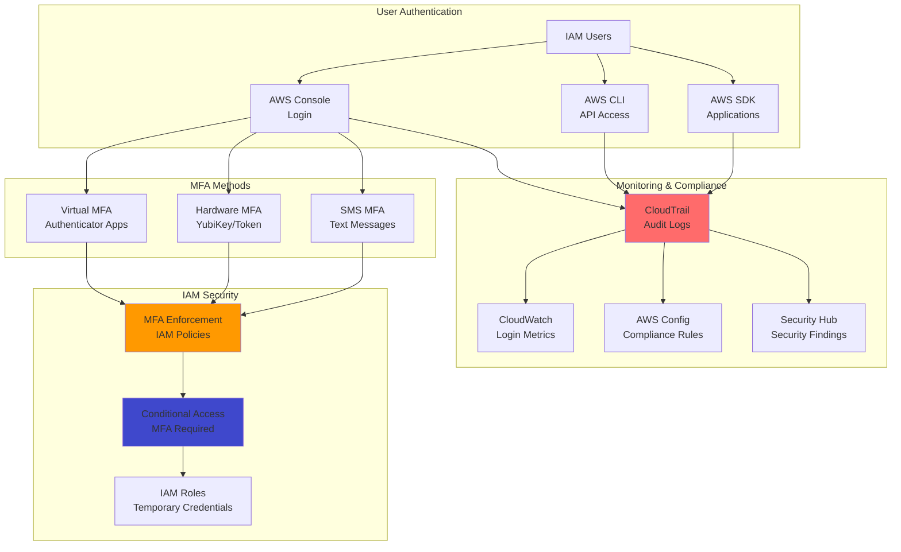

# Strengthening Authentication Security with IAM and MFA Devices

## Problem

Your organization needs to strengthen security for AWS account access beyond just usernames and passwords. Single-factor authentication leaves accounts vulnerable to credential theft, phishing attacks, and unauthorized access. Compliance requirements often mandate multi-factor authentication for privileged accounts, and security best practices recommend MFA for all users accessing sensitive cloud resources. You need a solution that adds an additional layer of security while remaining user-friendly and cost-effective for your team.

## Solution

Implement comprehensive multi-factor authentication using AWS IAM with virtual and hardware MFA devices. This solution enforces MFA requirements through IAM policies, supports multiple authentication methods including TOTP and hardware tokens, and provides granular access control based on MFA status. The approach includes automated MFA enforcement, user self-service MFA setup, and comprehensive audit logging to ensure security compliance while maintaining usability.

## Architecture Diagram



## Prerequisites

1. AWS account with administrator access or sufficient IAM permissions
2. AWS CLI v2 installed and configured
3. Mobile device or authenticator app for virtual MFA (Google Authenticator, Authy, etc.)
4. Hardware MFA device (optional, for enhanced security)
5. Understanding of IAM policies and JSON syntax
6. Estimated cost: Minimal (MFA is free, CloudTrail charges for events)

> **Note**: MFA enforcement can lock users out if not configured properly. Always test MFA policies with non-administrative users first and ensure you have emergency access procedures.

## Preparation

```bash
# Set environment variables
export AWS_REGION=$(aws configure get region)
export AWS_ACCOUNT_ID=$(aws sts get-caller-identity \
    --query Account --output text)

# Generate unique identifiers
RANDOM_SUFFIX=$(aws secretsmanager get-random-password \
    --exclude-punctuation --exclude-uppercase \
    --password-length 6 --require-each-included-type \
    --output text --query RandomPassword)

export TEST_USER_NAME="test-user-${RANDOM_SUFFIX}"
export MFA_POLICY_NAME="EnforceMFA-${RANDOM_SUFFIX}"
export ADMIN_GROUP_NAME="MFAAdmins-${RANDOM_SUFFIX}"
export CLOUDTRAIL_NAME="mfa-audit-trail-${RANDOM_SUFFIX}"

echo "✅ Environment configured for MFA setup"
```

## Steps

1. **Create Test User and Group Structure**:

   AWS IAM follows the principle of least privilege through user and group organization. This step creates a test user and administrative group to demonstrate MFA enforcement while ensuring you maintain access to configure and manage the system safely. The group-based approach scales better in production environments.

   ```bash
   # Create test user
   aws iam create-user --user-name $TEST_USER_NAME

   # Create login profile for console access
   TEMP_PASSWORD="TempPassword123!"
   aws iam create-login-profile \
       --user-name $TEST_USER_NAME \
       --password $TEMP_PASSWORD \
       --password-reset-required

   # Create administrative group for MFA users
   aws iam create-group --group-name $ADMIN_GROUP_NAME

   # Add test user to group
   aws iam add-user-to-group \
       --user-name $TEST_USER_NAME \
       --group-name $ADMIN_GROUP_NAME

   echo "✅ Test user created: $TEST_USER_NAME"
   echo "Temporary password: $TEMP_PASSWORD"
   ```

   The test user requires a temporary password and password reset on first login, following AWS security recommendations for initial user setup.

   > **Note**: IAM users should be used sparingly in production environments. Consider using AWS SSO or federated access for better security and management. This recipe demonstrates MFA concepts that apply to all authentication methods.

2. **Create MFA Enforcement IAM Policy**:

   This comprehensive policy demonstrates AWS IAM's conditional access capabilities by enforcing MFA through the `aws:MultiFactorAuthPresent` condition key. The policy follows the AWS Well-Architected Framework security pillar by implementing defense in depth and ensuring users can manage their own MFA devices.

   ```bash
   # Create comprehensive MFA enforcement policy
   cat > mfa-enforcement-policy.json << 'EOF'
   {
       "Version": "2012-10-17",
       "Statement": [
           {
               "Sid": "AllowViewAccountInfo",
               "Effect": "Allow",
               "Action": [
                   "iam:GetAccountPasswordPolicy",
                   "iam:ListVirtualMFADevices",
                   "iam:GetUser",
                   "iam:ListUsers"
               ],
               "Resource": "*"
           },
           {
               "Sid": "AllowManageOwnPasswords",
               "Effect": "Allow",
               "Action": [
                   "iam:ChangePassword",
                   "iam:GetUser"
               ],
               "Resource": "arn:aws:iam::*:user/${aws:username}"
           },
           {
               "Sid": "AllowManageOwnMFA",
               "Effect": "Allow",
               "Action": [
                   "iam:CreateVirtualMFADevice",
                   "iam:DeleteVirtualMFADevice",
                   "iam:EnableMFADevice",
                   "iam:DeactivateMFADevice",
                   "iam:ListMFADevices",
                   "iam:ResyncMFADevice"
               ],
               "Resource": [
                   "arn:aws:iam::*:mfa/${aws:username}",
                   "arn:aws:iam::*:user/${aws:username}"
               ]
           },
           {
               "Sid": "DenyAllExceptUnlessMFAAuthenticated",
               "Effect": "Deny",
               "NotAction": [
                   "iam:CreateVirtualMFADevice",
                   "iam:EnableMFADevice",
                   "iam:GetUser",
                   "iam:ListMFADevices",
                   "iam:ListVirtualMFADevices",
                   "iam:ResyncMFADevice",
                   "sts:GetSessionToken",
                   "iam:ChangePassword",
                   "iam:GetAccountPasswordPolicy"
               ],
               "Resource": "*",
               "Condition": {
                   "BoolIfExists": {
                       "aws:MultiFactorAuthPresent": "false"
                   }
               }
           },
           {
               "Sid": "AllowFullAccessWithMFA",
               "Effect": "Allow",
               "Action": "*",
               "Resource": "*",
               "Condition": {
                   "Bool": {
                       "aws:MultiFactorAuthPresent": "true"
                   }
               }
           }
       ]
   }
   EOF

   # Create the policy
   MFA_POLICY_ARN=$(aws iam create-policy \
       --policy-name $MFA_POLICY_NAME \
       --policy-document file://mfa-enforcement-policy.json \
       --description "Enforce MFA for all AWS access" \
       --query 'Policy.Arn' --output text)

   # Attach policy to group
   aws iam attach-group-policy \
       --group-name $ADMIN_GROUP_NAME \
       --policy-arn $MFA_POLICY_ARN

   echo "✅ MFA enforcement policy created and attached"
   ```

   The policy uses `BoolIfExists` condition to gracefully handle cases where the MFA condition key might not be present, preventing unintended access denials.

3. **Configure Virtual MFA Device Setup**:

   Virtual MFA devices leverage TOTP (Time-based One-time Password) algorithm as defined in RFC 6238, providing cost-effective multi-factor authentication using smartphone applications. AWS supports up to eight MFA devices per user, enabling backup devices for resilience.

   ```bash
   # Create virtual MFA device for test user
   aws iam create-virtual-mfa-device \
       --virtual-mfa-device-name $TEST_USER_NAME \
       --outfile mfa-qr-code.png \
       --bootstrap-method QRCodePNG

   # Get the serial number of the MFA device
   MFA_SERIAL=$(aws iam list-virtual-mfa-devices \
       --query "VirtualMFADevices[?User.UserName=='${TEST_USER_NAME}'].SerialNumber" \
       --output text)

   echo "✅ Virtual MFA device created"
   echo "QR Code saved as: mfa-qr-code.png"
   echo "MFA Serial Number: $MFA_SERIAL"

   # Instructions for users
   cat << EOF

   SETUP INSTRUCTIONS FOR USERS:
   ================================
   1. Open your authenticator app (Google Authenticator, Authy, etc.)
   2. Scan the QR code in mfa-qr-code.png
   3. Enter two consecutive MFA codes when prompted
   4. Save your backup codes in a secure location

   EMERGENCY ACCESS:
   ================
   - Always have backup codes or alternative access methods
   - Consider hardware MFA for critical accounts
   - Document emergency procedures for MFA device loss

   EOF
   ```

   The QR code contains the shared secret and AWS account information needed for the authenticator app to generate TOTP codes synchronized with AWS.

   > **Tip**: Provide clear setup instructions and support for users implementing MFA. Consider creating video tutorials and offering help desk support during initial rollout to ensure smooth adoption.

4. **Implement MFA Compliance Monitoring**:

   AWS CloudTrail provides comprehensive audit logging for MFA events, enabling compliance monitoring and security analysis. CloudWatch integration allows real-time monitoring and alerting on authentication patterns, supporting the AWS Well-Architected Framework's operational excellence pillar.

   ```bash
   # Create CloudTrail for MFA monitoring (if not exists)
   TRAIL_EXISTS=$(aws cloudtrail describe-trails \
       --query "trailList[?Name=='${CLOUDTRAIL_NAME}'].Name" \
       --output text)

   if [ -z "$TRAIL_EXISTS" ]; then
       # Create S3 bucket for CloudTrail logs
       BUCKET_NAME="mfa-cloudtrail-logs-${RANDOM_SUFFIX}"
       aws s3 mb s3://$BUCKET_NAME --region $AWS_REGION
       
       # Create CloudTrail
       aws cloudtrail create-trail \
           --name $CLOUDTRAIL_NAME \
           --s3-bucket-name $BUCKET_NAME \
           --include-global-service-events \
           --is-multi-region-trail
       
       # Start logging
       aws cloudtrail start-logging --name $CLOUDTRAIL_NAME
       
       echo "✅ CloudTrail created and started"
   fi

   # Create CloudWatch dashboard for MFA monitoring
   cat > mfa-dashboard.json << EOF
   {
       "widgets": [
           {
               "type": "metric",
               "width": 12,
               "height": 6,
               "properties": {
                   "metrics": [
                       ["AWS/CloudTrailMetrics", "MFALoginCount"],
                       [".", "NonMFALoginCount"]
                   ],
                   "period": 300,
                   "stat": "Sum",
                   "region": "${AWS_REGION}",
                   "title": "MFA vs Non-MFA Logins"
               }
           },
           {
               "type": "log",
               "width": 12,
               "height": 6,
               "properties": {
                   "query": "SOURCE '/aws/cloudtrail' | fields @timestamp, sourceIPAddress, userIdentity.type, userIdentity.userName, responseElements.ConsoleLogin\n| filter eventName = \"ConsoleLogin\"\n| filter responseElements.ConsoleLogin = \"Success\"\n| stats count() by userIdentity.userName",
                   "region": "${AWS_REGION}",
                   "title": "Console Logins by User"
               }
           }
       ]
   }
   EOF

   # Create CloudWatch dashboard
   aws cloudwatch put-dashboard \
       --dashboard-name "MFA-Security-Dashboard" \
       --dashboard-body file://mfa-dashboard.json

   echo "✅ MFA monitoring dashboard configured"
   ```

   The monitoring setup provides visibility into authentication patterns and helps identify potential security issues or non-compliant access attempts.

   > **Warning**: Monitor MFA compliance continuously and have procedures for handling compromised or lost MFA devices. Implement break-glass procedures for emergency access while maintaining security controls.

## Validation & Testing

1. Test MFA enforcement by attempting console login:

   ```bash
   # Get console login URL
   CONSOLE_URL="https://${AWS_ACCOUNT_ID}.signin.aws.amazon.com/console"
   echo "Console Login URL: $CONSOLE_URL"
   echo "Username: $TEST_USER_NAME"
   echo "Password: $TEMP_PASSWORD"
   
   echo "Test Steps:"
   echo "1. Login with test user credentials"
   echo "2. Attempt to access AWS services (should be denied)"
   echo "3. Set up MFA device using QR code"
   echo "4. Access services after MFA authentication"
   ```

   Expected behavior: Users without MFA will be restricted to MFA setup actions only.

2. Verify MFA device activation:

   ```bash
   # Check MFA devices for user
   aws iam list-mfa-devices --user-name $TEST_USER_NAME

   # Verify policy effectiveness using IAM policy simulator
   aws iam simulate-principal-policy \
       --policy-source-arn "arn:aws:iam::${AWS_ACCOUNT_ID}:user/${TEST_USER_NAME}" \
       --action-names "s3:ListBuckets" \
       --context-entries ContextKeyName=aws:MultiFactorAuthPresent,ContextKeyValues=false,ContextKeyType=boolean
   ```

   Expected output: Policy simulation should show "denied" for actions without MFA present.

3. Monitor authentication events:

   ```bash
   # Wait for CloudTrail events to be delivered
   sleep 30
   
   # Query recent console login events
   START_TIME=$(date -d '1 hour ago' --iso-8601)
   END_TIME=$(date --iso-8601)
   
   aws logs start-query \
       --log-group-name CloudTrail/${CLOUDTRAIL_NAME} \
       --start-time $(date -d "$START_TIME" +%s) \
       --end-time $(date -d "$END_TIME" +%s) \
       --query-string 'fields @timestamp, sourceIPAddress, userIdentity.userName, additionalEventData.MFAUsed | filter eventName = "ConsoleLogin" | sort @timestamp desc'
   ```

## Cleanup

1. Remove test user and MFA devices:

   ```bash
   # Deactivate and delete MFA device if it exists
   if [ ! -z "$MFA_SERIAL" ]; then
       aws iam deactivate-mfa-device \
           --user-name $TEST_USER_NAME \
           --serial-number $MFA_SERIAL 2>/dev/null || true
       
       aws iam delete-virtual-mfa-device \
           --serial-number $MFA_SERIAL 2>/dev/null || true
   fi

   # Remove user from group and delete
   aws iam remove-user-from-group \
       --user-name $TEST_USER_NAME \
       --group-name $ADMIN_GROUP_NAME

   aws iam delete-login-profile \
       --user-name $TEST_USER_NAME 2>/dev/null || true
   aws iam delete-user --user-name $TEST_USER_NAME

   echo "✅ Test user and MFA devices removed"
   ```

2. Clean up policies and groups:

   ```bash
   # Detach and delete policy
   aws iam detach-group-policy \
       --group-name $ADMIN_GROUP_NAME \
       --policy-arn $MFA_POLICY_ARN

   aws iam delete-policy --policy-arn $MFA_POLICY_ARN
   aws iam delete-group --group-name $ADMIN_GROUP_NAME

   echo "✅ Policies and groups cleaned up"
   ```

3. Remove monitoring resources:

   ```bash
   # Delete CloudWatch resources
   aws cloudwatch delete-dashboards \
       --dashboard-names MFA-Security-Dashboard 2>/dev/null || true

   # Stop and delete CloudTrail if created during this recipe
   if [ ! -z "$CLOUDTRAIL_NAME" ]; then
       aws cloudtrail stop-logging --name $CLOUDTRAIL_NAME
       aws cloudtrail delete-trail --name $CLOUDTRAIL_NAME
       
       # Delete S3 bucket if created
       if [ ! -z "$BUCKET_NAME" ]; then
           aws s3 rb s3://$BUCKET_NAME --force 2>/dev/null || true
       fi
   fi

   echo "✅ Monitoring resources cleaned up"
   ```

4. Clean up local files:

   ```bash
   rm -f mfa-qr-code.png *.json
   echo "✅ Local files cleaned up"
   ```

## Discussion

Multi-factor authentication represents one of the most effective security controls for preventing unauthorized access to cloud resources. AWS IAM's MFA implementation provides flexibility in authentication methods while maintaining strong security through policy-based enforcement. The conditional access model allows organizations to implement graduated security controls where sensitive operations require additional authentication factors, following the [AWS Well-Architected Framework security pillar](https://docs.aws.amazon.com/wellarchitected/latest/security-pillar/welcome.html).

The policy-based approach to MFA enforcement demonstrates the power of AWS IAM's fine-grained access control capabilities. By using condition keys like `aws:MultiFactorAuthPresent`, organizations can create sophisticated access patterns that balance security with usability. This approach scales effectively across large organizations while providing the flexibility to accommodate different user roles and access patterns, as outlined in the [AWS IAM best practices documentation](https://docs.aws.amazon.com/IAM/latest/UserGuide/best-practices.html).

Monitoring and compliance capabilities are essential for maintaining effective MFA programs. CloudTrail integration provides comprehensive audit logs that support compliance requirements and security investigations. The combination of real-time monitoring, automated alerting, and detailed reporting creates a robust security monitoring framework that helps organizations maintain their security posture over time, supporting frameworks like SOC 2 and ISO 27001.

The virtual MFA implementation leverages the TOTP standard (RFC 6238), ensuring compatibility with a wide range of authenticator applications while providing enterprise-grade security. Organizations can register up to eight MFA devices per user, enabling backup devices and supporting different use cases like mobile applications and hardware tokens.

> **Note**: Consider implementing adaptive authentication policies that adjust MFA requirements based on risk factors such as location, device, and user behavior patterns for enhanced security with improved user experience.

## Challenge

Enhance this MFA implementation by integrating with AWS SSO for centralized identity management, implementing risk-based authentication using AWS Cognito advanced security features, creating automated user onboarding workflows with MFA setup, adding support for FIDO2/WebAuthn hardware keys, and building comprehensive security dashboards that track authentication patterns and identify potential security threats across your organization.

## Infrastructure Code

*Infrastructure code will be generated after recipe approval.*