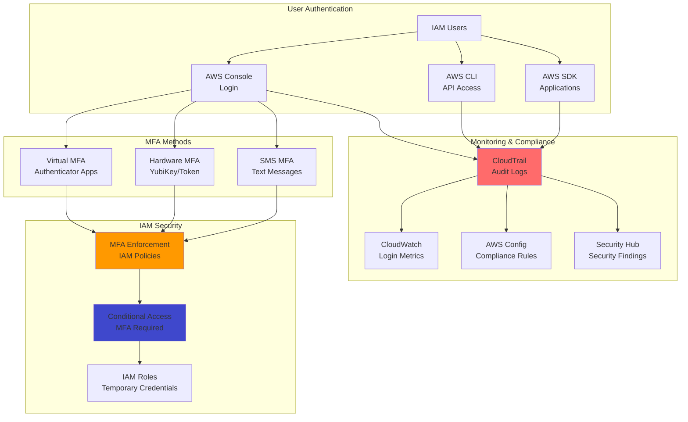

# Strengthening Authentication Security with IAM and MFA Devices

## Problem

Your organization needs to strengthen security for AWS account access beyond just usernames and passwords. Single-factor authentication leaves accounts vulnerable to credential theft, phishing attacks, and unauthorized access. Compliance requirements often mandate multi-factor authentication for privileged accounts, and security best practices recommend MFA for all users accessing sensitive cloud resources. You need a solution that adds an additional layer of security while remaining user-friendly and cost-effective for your team.

## Solution

Implement comprehensive multi-factor authentication using AWS IAM with virtual and hardware MFA devices. This solution enforces MFA requirements through IAM policies, supports multiple authentication methods including TOTP and hardware tokens, and provides granular access control based on MFA status. The approach includes automated MFA enforcement, user self-service MFA setup, and comprehensive audit logging to ensure security compliance while maintaining usability.

## Architecture Diagram



## Prerequisites

1. AWS account with administrator access or sufficient IAM permissions
2. AWS CLI v2 installed and configured
3. Mobile device or authenticator app for virtual MFA (Google Authenticator, Authy, etc.)
4. Hardware MFA device (optional, for enhanced security)
5. Understanding of IAM policies and JSON syntax
6. Estimated cost: Minimal (MFA is free, CloudTrail charges for events)

> **Note**: MFA enforcement can lock users out if not configured properly. Always test MFA policies with non-administrative users first and ensure you have emergency access procedures.

## Preparation

```bash
# Set environment variables
export AWS_REGION=$(aws configure get region)
export AWS_ACCOUNT_ID=$(aws sts get-caller-identity \
    --query Account --output text)

# Generate unique identifiers
RANDOM_SUFFIX=$(aws secretsmanager get-random-password \
    --exclude-punctuation --exclude-uppercase \
    --password-length 6 --require-each-included-type \
    --output text --query RandomPassword)

export TEST_USER_NAME="test-user-${RANDOM_SUFFIX}"
export MFA_POLICY_NAME="EnforceMFA-${RANDOM_SUFFIX}"
export ADMIN_GROUP_NAME="MFAAdmins-${RANDOM_SUFFIX}"

echo "✅ Environment configured for MFA setup"
```

## Steps

1. **Create Test User and Group Structure**:

   Proper user and group organization is essential for effective MFA implementation. We'll create a test user and administrative group to demonstrate MFA enforcement while ensuring you maintain access to configure and manage the system safely.

   ```bash
   # Create test user
   aws iam create-user --user-name $TEST_USER_NAME

   # Create login profile for console access
   TEMP_PASSWORD="TempPassword123!"
   aws iam create-login-profile \
       --user-name $TEST_USER_NAME \
       --password $TEMP_PASSWORD \
       --password-reset-required

   # Create administrative group for MFA users
   aws iam create-group --group-name $ADMIN_GROUP_NAME

   # Add test user to group
   aws iam add-user-to-group \
       --user-name $TEST_USER_NAME \
       --group-name $ADMIN_GROUP_NAME

   echo "✅ Test user created: $TEST_USER_NAME"
   echo "Temporary password: $TEMP_PASSWORD"
   ```

   > **Note**: IAM users should be used sparingly in production environments. Consider using AWS SSO or federated access for better security and management. This recipe demonstrates MFA concepts that apply to all authentication methods.

2. **Create MFA Enforcement IAM Policy**:

   This comprehensive policy enforces MFA by denying access to most AWS services unless the user has authenticated with MFA. The policy allows users to manage their own MFA devices and change passwords, ensuring they can complete the MFA setup process independently.

   ```bash
   # Create comprehensive MFA enforcement policy
   cat > mfa-enforcement-policy.json << 'EOF'
   {
       "Version": "2012-10-17",
       "Statement": [
           {
               "Sid": "AllowViewAccountInfo",
               "Effect": "Allow",
               "Action": [
                   "iam:GetAccountPasswordPolicy",
                   "iam:ListVirtualMFADevices",
                   "iam:GetUser",
                   "iam:ListUsers"
               ],
               "Resource": "*"
           },
           {
               "Sid": "AllowManageOwnPasswords",
               "Effect": "Allow",
               "Action": [
                   "iam:ChangePassword",
                   "iam:GetUser"
               ],
               "Resource": "arn:aws:iam::*:user/${aws:username}"
           },
           {
               "Sid": "AllowManageOwnMFA",
               "Effect": "Allow",
               "Action": [
                   "iam:CreateVirtualMFADevice",
                   "iam:DeleteVirtualMFADevice",
                   "iam:EnableMFADevice",
                   "iam:DeactivateMFADevice",
                   "iam:ListMFADevices",
                   "iam:ResyncMFADevice"
               ],
               "Resource": [
                   "arn:aws:iam::*:mfa/${aws:username}",
                   "arn:aws:iam::*:user/${aws:username}"
               ]
           },
           {
               "Sid": "DenyAllExceptUnlessMFAAuthenticated",
               "Effect": "Deny",
               "NotAction": [
                   "iam:CreateVirtualMFADevice",
                   "iam:EnableMFADevice",
                   "iam:GetUser",
                   "iam:ListMFADevices",
                   "iam:ListVirtualMFADevices",
                   "iam:ResyncMFADevice",
                   "sts:GetSessionToken",
                   "iam:ChangePassword",
                   "iam:GetAccountPasswordPolicy"
               ],
               "Resource": "*",
               "Condition": {
                   "BoolIfExists": {
                       "aws:MultiFactorAuthPresent": "false"
                   }
               }
           },
           {
               "Sid": "AllowFullAccessWithMFA",
               "Effect": "Allow",
               "Action": "*",
               "Resource": "*",
               "Condition": {
                   "Bool": {
                       "aws:MultiFactorAuthPresent": "true"
                   }
               }
           }
       ]
   }
   EOF

   # Create the policy
   MFA_POLICY_ARN=$(aws iam create-policy \
       --policy-name $MFA_POLICY_NAME \
       --policy-document file://mfa-enforcement-policy.json \
       --description "Enforce MFA for all AWS access" \
       --query 'Policy.Arn' --output text)

   # Attach policy to group
   aws iam attach-group-policy \
       --group-name $ADMIN_GROUP_NAME \
       --policy-arn $MFA_POLICY_ARN

   echo "✅ MFA enforcement policy created and attached"
   ```

3. **Configure Virtual MFA Device Setup**:

   Virtual MFA devices provide a cost-effective and user-friendly way to implement MFA using smartphone authenticator applications. This step demonstrates the complete workflow that users will follow to set up their MFA devices.

   ```bash
   # Create virtual MFA device for test user
   aws iam create-virtual-mfa-device \
       --virtual-mfa-device-name $TEST_USER_NAME \
       --outfile mfa-qr-code.png \
       --bootstrap-method QRCodePNG

   # Get the serial number of the MFA device
   MFA_SERIAL=$(aws iam list-virtual-mfa-devices \
       --query "VirtualMFADevices[?User.UserName=='${TEST_USER_NAME}'].SerialNumber" \
       --output text)

   echo "✅ Virtual MFA device created"
   echo "QR Code saved as: mfa-qr-code.png"
   echo "MFA Serial Number: $MFA_SERIAL"

   # Instructions for users
   cat << EOF

   SETUP INSTRUCTIONS FOR USERS:
   ================================
   1. Open your authenticator app (Google Authenticator, Authy, etc.)
   2. Scan the QR code in mfa-qr-code.png
   3. Enter two consecutive MFA codes when prompted
   4. Save your backup codes in a secure location

   EMERGENCY ACCESS:
   ================
   - Always have backup codes or alternative access methods
   - Consider hardware MFA for critical accounts
   - Document emergency procedures for MFA device loss

   EOF
   ```

   > **Tip**: Provide clear setup instructions and support for users implementing MFA. Consider creating video tutorials and offering help desk support during initial rollout to ensure smooth adoption.

4. **Implement MFA Compliance Monitoring**:

   Monitoring MFA usage and compliance is crucial for maintaining security posture. This monitoring setup tracks authentication events, identifies non-compliant users, and provides visibility into security metrics for reporting and compliance purposes.

   ```bash
   # Create CloudWatch dashboard for MFA monitoring
   cat > mfa-dashboard.json << EOF
   {
       "widgets": [
           {
               "type": "metric",
               "properties": {
                   "metrics": [
                       ["AWS/CloudTrailMetrics", "MFALoginCount"],
                       [".", "NonMFALoginCount"]
                   ],
                   "period": 300,
                   "stat": "Sum",
                   "region": "${AWS_REGION}",
                   "title": "MFA vs Non-MFA Logins"
               }
           },
           {
               "type": "log",
               "properties": {
                   "query": "SOURCE '/aws/cloudtrail' | fields @timestamp, sourceIPAddress, userIdentity.type, userIdentity.userName, responseElements.ConsoleLogin\n| filter eventName = \"ConsoleLogin\"\n| filter responseElements.ConsoleLogin = \"Success\"\n| stats count() by userIdentity.userName",
                   "region": "${AWS_REGION}",
                   "title": "Console Logins by User"
               }
           }
       ]
   }
   EOF

   # Create CloudWatch dashboard
   aws cloudwatch put-dashboard \
       --dashboard-name "MFA-Security-Dashboard" \
       --dashboard-body file://mfa-dashboard.json

   # Create CloudWatch metric filter for MFA events
   aws logs put-metric-filter \
       --log-group-name CloudTrail/AWSLogs \
       --filter-name MFAUsageFilter \
       --filter-pattern '{ ($.eventName = ConsoleLogin) && ($.responseElements.ConsoleLogin = "Success") && ($.additionalEventData.MFAUsed = "Yes") }' \
       --metric-transformations \
           metricName=MFALoginCount,metricNamespace=AWS/CloudTrailMetrics,metricValue=1

   # Create alarm for non-MFA logins
   aws cloudwatch put-metric-alarm \
       --alarm-name "Non-MFA-Console-Logins" \
       --alarm-description "Alert on console logins without MFA" \
       --metric-name NonMFALoginCount \
       --namespace AWS/CloudTrailMetrics \
       --statistic Sum \
       --period 300 \
       --threshold 1 \
       --comparison-operator GreaterThanOrEqualToThreshold \
       --evaluation-periods 1

   echo "✅ MFA monitoring and alerting configured"
   ```

   > **Warning**: Monitor MFA compliance continuously and have procedures for handling compromised or lost MFA devices. Implement break-glass procedures for emergency access while maintaining security controls.

## Validation & Testing

1. Test MFA enforcement by attempting console login:

   ```bash
   # Get console login URL
   CONSOLE_URL="https://${AWS_ACCOUNT_ID}.signin.aws.amazon.com/console"
   echo "Console Login URL: $CONSOLE_URL"
   echo "Username: $TEST_USER_NAME"
   echo "Password: $TEMP_PASSWORD"
   
   echo "Test Steps:"
   echo "1. Login with test user credentials"
   echo "2. Attempt to access AWS services (should be denied)"
   echo "3. Set up MFA device using QR code"
   echo "4. Access services after MFA authentication"
   ```

2. Verify MFA device activation:

   ```bash
   # Check MFA devices for user
   aws iam list-mfa-devices --user-name $TEST_USER_NAME

   # Verify policy effectiveness
   aws iam simulate-principal-policy \
       --policy-source-arn "arn:aws:iam::${AWS_ACCOUNT_ID}:user/${TEST_USER_NAME}" \
       --action-names "s3:ListBuckets" \
       --context-entries ContextKeyName=aws:MultiFactorAuthPresent,ContextKeyValues=false,ContextKeyType=boolean
   ```

3. Monitor authentication events:

   ```bash
   # Query CloudTrail for MFA events
   aws logs start-query \
       --log-group-name CloudTrail/AWSLogs \
       --start-time $(date -d '1 hour ago' +%s) \
       --end-time $(date +%s) \
       --query-string 'fields @timestamp, sourceIPAddress, userIdentity.userName, additionalEventData.MFAUsed | filter eventName = "ConsoleLogin" | sort @timestamp desc'
   ```

## Cleanup

1. Remove test user and MFA devices:

   ```bash
   # Deactivate and delete MFA device
   if [ ! -z "$MFA_SERIAL" ]; then
       aws iam deactivate-mfa-device \
           --user-name $TEST_USER_NAME \
           --serial-number $MFA_SERIAL
       
       aws iam delete-virtual-mfa-device \
           --serial-number $MFA_SERIAL
   fi

   # Remove user from group and delete
   aws iam remove-user-from-group \
       --user-name $TEST_USER_NAME \
       --group-name $ADMIN_GROUP_NAME

   aws iam delete-login-profile --user-name $TEST_USER_NAME
   aws iam delete-user --user-name $TEST_USER_NAME
   ```

2. Clean up policies and groups:

   ```bash
   # Detach and delete policy
   aws iam detach-group-policy \
       --group-name $ADMIN_GROUP_NAME \
       --policy-arn $MFA_POLICY_ARN

   aws iam delete-policy --policy-arn $MFA_POLICY_ARN
   aws iam delete-group --group-name $ADMIN_GROUP_NAME
   ```

3. Remove monitoring resources:

   ```bash
   # Delete CloudWatch resources
   aws cloudwatch delete-dashboards --dashboard-names MFA-Security-Dashboard
   aws cloudwatch delete-alarms --alarm-names Non-MFA-Console-Logins
   aws logs delete-metric-filter \
       --log-group-name CloudTrail/AWSLogs \
       --filter-name MFAUsageFilter
   ```

4. Clean up local files:

   ```bash
   rm -f mfa-qr-code.png *.json
   ```

## Discussion

Multi-factor authentication represents one of the most effective security controls for preventing unauthorized access to cloud resources. AWS IAM's MFA implementation provides flexibility in authentication methods while maintaining strong security through policy-based enforcement. The conditional access model allows organizations to implement graduated security controls where sensitive operations require additional authentication factors.

The policy-based approach to MFA enforcement demonstrates the power of AWS IAM's fine-grained access control capabilities. By using condition keys like `aws:MultiFactorAuthPresent`, organizations can create sophisticated access patterns that balance security with usability. This approach scales effectively across large organizations while providing the flexibility to accommodate different user roles and access patterns.

Monitoring and compliance capabilities are essential for maintaining effective MFA programs. CloudTrail integration provides comprehensive audit logs that support compliance requirements and security investigations. The combination of real-time monitoring, automated alerting, and detailed reporting creates a robust security monitoring framework that helps organizations maintain their security posture over time.

> **Note**: Consider implementing adaptive authentication policies that adjust MFA requirements based on risk factors such as location, device, and user behavior patterns for enhanced security with improved user experience.

## Challenge

Enhance this MFA implementation by integrating with AWS SSO for centralized identity management, implementing risk-based authentication using AWS Cognito advanced security features, creating automated user onboarding workflows with MFA setup, adding support for FIDO2/WebAuthn hardware keys, and building comprehensive security dashboards that track authentication patterns and identify potential security threats across your organization.

## Infrastructure Code

*Infrastructure code will be generated after recipe approval.*