# Sustainable Manufacturing Monitoring with IoT SiteWise

## Problem

Manufacturing companies face increasing pressure to meet Environmental, Social, and Governance (ESG) reporting requirements while optimizing operational efficiency and reducing carbon emissions. Traditional monitoring systems lack the real-time visibility and integrated analytics needed to track energy consumption, carbon footprint, and equipment performance across complex manufacturing operations, making it difficult to identify inefficiencies and demonstrate sustainability improvements to stakeholders.

## Solution

Build a comprehensive sustainability monitoring system using AWS IoT SiteWise to collect and model industrial equipment data, combined with CloudWatch and Lambda for real-time analytics and carbon emissions calculations. This solution provides automated ESG reporting capabilities through QuickSight dashboards, enabling manufacturers to track energy efficiency, monitor carbon emissions in real-time, and optimize operations for both sustainability and profitability.

## Architecture Diagram

```mermaid
graph TB
    subgraph "Manufacturing Floor"
        SENSORS[IoT Sensors]
        EQUIPMENT[Manufacturing Equipment]
    end
    
    subgraph "Data Collection"
        GATEWAY[IoT SiteWise Gateway]
        SITEWISE[IoT SiteWise]
    end
    
    subgraph "Processing & Analytics"
        LAMBDA[Lambda Functions]
        CW[CloudWatch Metrics]
        CARBON[Carbon Calculations]
    end
    
    subgraph "Visualization & Reporting"
        QS[QuickSight Dashboard]
        ALERTS[CloudWatch Alarms]
        EVENTBRIDGE[EventBridge Scheduler]
    end
    
    SENSORS-->GATEWAY
    EQUIPMENT-->GATEWAY
    GATEWAY-->SITEWISE
    SITEWISE-->LAMBDA
    LAMBDA-->CW
    LAMBDA-->CARBON
    CW-->QS
    CARBON-->QS
    CW-->ALERTS
    EVENTBRIDGE-->LAMBDA
    
    style SITEWISE fill:#FF9900
    style LAMBDA fill:#FF9900
    style CW fill:#3F8624
    style QS fill:#232F3E
```



## Prerequisites

1. AWS account with permissions for IoT SiteWise, Lambda, CloudWatch, QuickSight, and EventBridge
2. AWS CLI v2 installed and configured (or AWS CloudShell)
3. Basic understanding of industrial IoT concepts and sustainability metrics
4. Knowledge of manufacturing equipment data structures
5. `jq` command-line JSON processor installed
6. Estimated cost: $50-100 per month for demo environment (varies with data volume)

> **Note**: This recipe simulates industrial equipment data for demonstration purposes. In production, you would connect actual manufacturing equipment through IoT SiteWise Edge gateways or AWS IoT Core integrations.

## Preparation

```bash
# Set environment variables
export AWS_REGION=$(aws configure get region)
export AWS_ACCOUNT_ID=$(aws sts get-caller-identity \
    --query Account --output text)

# Generate unique identifiers for resources
RANDOM_SUFFIX=$(aws secretsmanager get-random-password \
    --exclude-punctuation --exclude-uppercase \
    --password-length 6 --require-each-included-type \
    --output text --query RandomPassword)

export SITEWISE_MODEL_NAME="SustainableManufacturingModel"
export LAMBDA_FUNCTION_NAME="manufacturing-carbon-calculator-${RANDOM_SUFFIX}"
export QUICKSIGHT_DATASOURCE_NAME="manufacturing-sustainability-${RANDOM_SUFFIX}"

echo "✅ Environment variables configured"
echo "Region: ${AWS_REGION}"
echo "Account ID: ${AWS_ACCOUNT_ID}"
echo "Random Suffix: ${RANDOM_SUFFIX}"
```

## Steps

1. **Create IoT SiteWise Asset Model for Manufacturing Equipment**:

   AWS IoT SiteWise enables you to create standardized digital representations of industrial equipment through asset models. These models define the structure and relationships of your manufacturing data, enabling consistent data collection and analysis across diverse equipment types. This foundational step establishes the data schema that will support sustainability calculations and ESG reporting by providing a common framework for collecting power consumption, production rates, and efficiency metrics.

   ```bash
   # Create asset model definition file
   cat > manufacturing-equipment-model.json << 'EOF'
   {
     "assetModelName": "SustainableManufacturingModel",
     "assetModelDescription": "Asset model for sustainable manufacturing monitoring",
     "assetModelProperties": [
       {
         "name": "Equipment_Serial_Number",
         "dataType": "STRING",
         "type": {
           "attribute": {
             "defaultValue": "UNKNOWN"
           }
         }
       },
       {
         "name": "Power_Consumption_kW",
         "dataType": "DOUBLE",
         "unit": "kW",
         "type": {
           "measurement": {}
         }
       },
       {
         "name": "Production_Rate_Units_Hour",
         "dataType": "DOUBLE",
         "unit": "units/hour",
         "type": {
           "measurement": {}
         }
       },
       {
         "name": "Energy_Efficiency_Ratio",
         "dataType": "DOUBLE",
         "unit": "units/kWh",
         "type": {
           "transform": {
             "expression": "production_rate / power_consumption",
             "variables": [
               {
                 "name": "production_rate",
                 "value": {
                   "propertyId": "Production_Rate_Units_Hour"
                 }
               },
               {
                 "name": "power_consumption",
                 "value": {
                   "propertyId": "Power_Consumption_kW"
                 }
               }
             ]
           }
         }
       },
       {
         "name": "Total_Energy_Consumption_kWh",
         "dataType": "DOUBLE",
         "unit": "kWh",
         "type": {
           "metric": {
             "expression": "sum(power)",
             "variables": [
               {
                 "name": "power",
                 "value": {
                   "propertyId": "Power_Consumption_kW"
                 }
               }
             ],
             "window": {
               "tumbling": {
                 "interval": "1h"
               }
             }
           }
         }
       }
     ]
   }
   EOF

   # Create the asset model in IoT SiteWise
   ASSET_MODEL_RESPONSE=$(aws iotsitewise create-asset-model \
       --cli-input-json file://manufacturing-equipment-model.json)
   
   export ASSET_MODEL_ID=$(echo $ASSET_MODEL_RESPONSE | \
       jq -r '.assetModelId')
   
   echo "✅ Asset model created with ID: $ASSET_MODEL_ID"
   ```

   The asset model now defines the structure for collecting manufacturing data including power consumption, production rates, and calculated efficiency metrics. This model serves as the foundation for creating multiple equipment assets and enables standardized data collection across your manufacturing facility with automatic energy efficiency calculations.

2. **Create Manufacturing Equipment Assets**:

   Individual assets represent specific pieces of manufacturing equipment based on the asset model. Creating multiple assets allows you to monitor different production lines, machines, or facilities independently while maintaining consistent data structures. This approach enables granular monitoring and comparison of sustainability metrics across your entire operation, supporting both operational optimization and environmental performance tracking.

   ```bash
   # Create first manufacturing equipment asset
   EQUIPMENT_1_RESPONSE=$(aws iotsitewise create-asset \
       --asset-model-id $ASSET_MODEL_ID \
       --asset-name "Production_Line_A_Extruder")
   
   export EQUIPMENT_1_ID=$(echo $EQUIPMENT_1_RESPONSE | \
       jq -r '.assetId')
   
   # Create second manufacturing equipment asset
   EQUIPMENT_2_RESPONSE=$(aws iotsitewise create-asset \
       --asset-model-id $ASSET_MODEL_ID \
       --asset-name "Production_Line_B_Injection_Molding")
   
   export EQUIPMENT_2_ID=$(echo $EQUIPMENT_2_RESPONSE | \
       jq -r '.assetId')
   
   # Wait for assets to be created and become active
   aws iotsitewise wait asset-active --asset-id $EQUIPMENT_1_ID
   aws iotsitewise wait asset-active --asset-id $EQUIPMENT_2_ID
   
   echo "✅ Manufacturing equipment assets created"
   echo "Equipment 1 ID: $EQUIPMENT_1_ID"
   echo "Equipment 2 ID: $EQUIPMENT_2_ID"
   ```

   Two manufacturing equipment assets are now active and ready to receive operational data. These assets will collect real-time measurements from production equipment, enabling continuous monitoring of energy consumption and production efficiency across different manufacturing processes while supporting automated sustainability calculations.

3. **Create Lambda Function for Carbon Emissions Calculation**:

   Lambda functions provide serverless compute for processing IoT SiteWise data and calculating carbon emissions based on energy consumption and regional carbon intensity factors. This function implements sustainability algorithms that convert operational metrics into environmental impact measurements, supporting automated ESG reporting and carbon footprint tracking while following AWS security best practices for IAM roles and permissions.

   ```bash
   # Create Lambda function code for carbon calculations
   cat > carbon-calculator.py << 'EOF'
   import json
   import boto3
   import datetime
   from decimal import Decimal
   
   def lambda_handler(event, context):
       # Carbon intensity factors (kg CO2 per kWh) by region
       # Based on EPA and international energy agency data
       CARBON_INTENSITY_FACTORS = {
           'us-east-1': 0.393,    # Virginia
           'us-west-2': 0.295,    # Oregon  
           'eu-west-1': 0.316,    # Ireland
           'ap-northeast-1': 0.518, # Tokyo
           'eu-central-1': 0.338, # Frankfurt
           'ap-southeast-1': 0.408 # Singapore
       }
       
       sitewise = boto3.client('iotsitewise')
       cloudwatch = boto3.client('cloudwatch')
       
       try:
           # Get current energy consumption from IoT SiteWise
           asset_id = event.get('asset_id')
           if not asset_id:
               return {
                   'statusCode': 400,
                   'body': json.dumps('Asset ID required')
               }
           
           # Get asset properties to find the correct property ID
           asset_properties = sitewise.describe_asset(
               assetId=asset_id
           )
           
           # Find Power_Consumption_kW property ID
           power_property_id = None
           for prop in asset_properties['assetProperties']:
               if prop['name'] == 'Power_Consumption_kW':
                   power_property_id = prop['id']
                   break
           
           if not power_property_id:
               return {
                   'statusCode': 400,
                   'body': json.dumps('Power consumption property not found')
               }
           
           # Get latest power consumption value
           response = sitewise.get_asset_property_value(
               assetId=asset_id,
               propertyId=power_property_id
           )
           
           power_consumption = response['propertyValue']['value']['doubleValue']
           
           # Calculate carbon emissions based on region
           region = context.invoked_function_arn.split(':')[3]
           carbon_factor = CARBON_INTENSITY_FACTORS.get(region, 0.4)
           carbon_emissions = power_consumption * carbon_factor
           
           # Send metrics to CloudWatch
           cloudwatch.put_metric_data(
               Namespace='Manufacturing/Sustainability',
               MetricData=[
                   {
                       'MetricName': 'CarbonEmissions',
                       'Dimensions': [
                           {
                               'Name': 'AssetId',
                               'Value': asset_id
                           }
                       ],
                       'Value': carbon_emissions,
                       'Unit': 'None',
                       'Timestamp': datetime.datetime.utcnow()
                   },
                   {
                       'MetricName': 'PowerConsumption',
                       'Dimensions': [
                           {
                               'Name': 'AssetId',
                               'Value': asset_id
                           }
                       ],
                       'Value': power_consumption,
                       'Unit': 'None',
                       'Timestamp': datetime.datetime.utcnow()
                   }
               ]
           )
           
           return {
               'statusCode': 200,
               'body': json.dumps({
                   'carbon_emissions_kg_co2_per_hour': carbon_emissions,
                   'power_consumption_kw': power_consumption,
                   'carbon_intensity_factor': carbon_factor
               })
           }
           
       except Exception as e:
           print(f"Error: {str(e)}")
           return {
               'statusCode': 500,
               'body': json.dumps(f'Error: {str(e)}')
           }
   EOF

   # Create deployment package
   zip carbon-calculator.zip carbon-calculator.py
   
   # Create IAM role for Lambda with least privilege access
   cat > trust-policy.json << 'EOF'
   {
     "Version": "2012-10-17",
     "Statement": [
       {
         "Effect": "Allow",
         "Principal": {
           "Service": "lambda.amazonaws.com"
         },
         "Action": "sts:AssumeRole"
       }
     ]
   }
   EOF

   aws iam create-role \
       --role-name ${LAMBDA_FUNCTION_NAME}-role \
       --assume-role-policy-document file://trust-policy.json

   # Attach necessary policies following principle of least privilege
   aws iam attach-role-policy \
       --role-name ${LAMBDA_FUNCTION_NAME}-role \
       --policy-arn arn:aws:iam::aws:policy/service-role/AWSLambdaBasicExecutionRole

   aws iam attach-role-policy \
       --role-name ${LAMBDA_FUNCTION_NAME}-role \
       --policy-arn arn:aws:iam::aws:policy/CloudWatchFullAccess

   aws iam attach-role-policy \
       --role-name ${LAMBDA_FUNCTION_NAME}-role \
       --policy-arn arn:aws:iam::aws:policy/AWSIoTSiteWiseReadOnlyAccess

   # Wait for role propagation
   sleep 10

   # Create Lambda function with latest Python runtime
   aws lambda create-function \
       --function-name $LAMBDA_FUNCTION_NAME \
       --runtime python3.12 \
       --role arn:aws:iam::${AWS_ACCOUNT_ID}:role/${LAMBDA_FUNCTION_NAME}-role \
       --handler carbon-calculator.lambda_handler \
       --zip-file fileb://carbon-calculator.zip \
       --timeout 60 \
       --memory-size 256

   echo "✅ Lambda function created for carbon calculations"
   ```

   The Lambda function is now deployed with the latest Python 3.12 runtime and configured with appropriate IAM permissions following the principle of least privilege. This function implements carbon intensity calculations based on regional factors and provides the foundation for automated ESG reporting and carbon footprint monitoring with proper error handling and logging capabilities.

4. **Create CloudWatch Alarms for Sustainability Thresholds**:

   CloudWatch alarms enable proactive monitoring of sustainability metrics by automatically detecting when energy consumption or carbon emissions exceed predefined thresholds. These alarms support operational excellence by alerting operators to efficiency issues before they impact production or environmental goals, enabling rapid response to sustainability performance degradation and supporting continuous improvement initiatives.

   ```bash
   # Create alarm for high carbon emissions
   aws cloudwatch put-metric-alarm \
       --alarm-name "High-Carbon-Emissions-${RANDOM_SUFFIX}" \
       --alarm-description "Alert when carbon emissions exceed threshold" \
       --metric-name CarbonEmissions \
       --namespace Manufacturing/Sustainability \
       --statistic Average \
       --period 300 \
       --threshold 50.0 \
       --comparison-operator GreaterThanThreshold \
       --evaluation-periods 2 \
       --treat-missing-data notBreaching

   # Create alarm for high power consumption
   aws cloudwatch put-metric-alarm \
       --alarm-name "High-Power-Consumption-${RANDOM_SUFFIX}" \
       --alarm-description "Alert when power consumption exceeds efficiency threshold" \
       --metric-name PowerConsumption \
       --namespace Manufacturing/Sustainability \
       --statistic Average \
       --period 300 \
       --threshold 100.0 \
       --comparison-operator GreaterThanThreshold \
       --evaluation-periods 3 \
       --treat-missing-data notBreaching

   echo "✅ CloudWatch alarms configured for sustainability monitoring"
   ```

   Sustainability monitoring alarms are now active and will trigger notifications when carbon emissions or energy consumption exceed operational thresholds. These alarms provide early warning of equipment inefficiencies and support continuous improvement of environmental performance with proper handling of missing data points.

5. **Simulate Manufacturing Data and Trigger Carbon Calculations**:

   Simulating realistic manufacturing data allows you to test the complete monitoring system and validate carbon calculation accuracy. In production environments, this data would come from actual equipment sensors through IoT SiteWise Edge gateways, but simulation provides a controlled way to demonstrate system functionality and verify sustainability metrics calculations with proper data quality indicators.

   ```bash
   # Get the property IDs needed for data simulation
   ASSET_PROPERTIES=$(aws iotsitewise describe-asset \
       --asset-id $EQUIPMENT_1_ID)
   
   POWER_PROPERTY_ID=$(echo $ASSET_PROPERTIES | \
       jq -r '.assetProperties[] | select(.name=="Power_Consumption_kW") | .id')
   
   PRODUCTION_PROPERTY_ID=$(echo $ASSET_PROPERTIES | \
       jq -r '.assetProperties[] | select(.name=="Production_Rate_Units_Hour") | .id')

   # Simulate data for first equipment with proper JSON formatting
   cat > simulate-data-1.json << EOF
   {
     "entries": [
       {
         "entryId": "power-$(date +%s)-1",
         "assetId": "$EQUIPMENT_1_ID",
         "propertyId": "$POWER_PROPERTY_ID",
         "propertyValues": [
           {
             "value": {
               "doubleValue": 75.5
             },
             "timestamp": {
               "timeInSeconds": $(date +%s)
             },
             "quality": "GOOD"
           }
         ]
       },
       {
         "entryId": "production-$(date +%s)-1",
         "assetId": "$EQUIPMENT_1_ID",
         "propertyId": "$PRODUCTION_PROPERTY_ID",
         "propertyValues": [
           {
             "value": {
               "doubleValue": 1250.0
             },
             "timestamp": {
               "timeInSeconds": $(date +%s)
             },
             "quality": "GOOD"
           }
         ]
       }
     ]
   }
   EOF

   # Send simulated data to IoT SiteWise
   aws iotsitewise batch-put-asset-property-value \
       --cli-input-json file://simulate-data-1.json

   # Wait for data to be ingested and processed
   sleep 30

   # Invoke Lambda function for carbon calculation
   aws lambda invoke \
       --function-name $LAMBDA_FUNCTION_NAME \
       --payload "{\"asset_id\":\"$EQUIPMENT_1_ID\"}" \
       response.json

   echo "✅ Manufacturing data simulated and carbon calculations triggered"
   cat response.json
   ```

   Manufacturing data has been successfully ingested into IoT SiteWise with proper property ID resolution and processed through the carbon calculation Lambda function. The system now demonstrates real-time sustainability monitoring capabilities with automated carbon emissions calculations based on actual energy consumption data and quality indicators.

6. **Configure QuickSight for Sustainability Dashboard**:

   Amazon QuickSight provides business intelligence capabilities for visualizing manufacturing sustainability data and creating executive-level ESG reporting dashboards. Connecting QuickSight to CloudWatch metrics enables automated reporting of carbon emissions, energy efficiency trends, and operational sustainability KPIs for stakeholder communication and regulatory compliance with interactive visualizations and scheduled reports.

   ```bash
   # Create QuickSight data source configuration
   echo "Creating QuickSight sustainability dashboard configuration..."
   
   # Note: QuickSight setup requires manual steps in the console
   cat > quicksight-dashboard-config.json << 'EOF'
   {
     "dashboardName": "Manufacturing Sustainability Monitor",
     "description": "Real-time sustainability and carbon emissions monitoring",
     "widgets": [
       {
         "type": "line-chart",
         "title": "Carbon Emissions Trend",
         "metrics": ["Manufacturing/Sustainability.CarbonEmissions"],
         "period": "1h",
         "yAxis": "kg CO2/hour"
       },
       {
         "type": "gauge",
         "title": "Current Energy Efficiency",
         "metric": "Manufacturing/Sustainability.PowerConsumption",
         "thresholds": [50, 100, 150],
         "unit": "kW"
       },
       {
         "type": "number",
         "title": "Daily Carbon Footprint",
         "metric": "Manufacturing/Sustainability.CarbonEmissions",
         "aggregation": "sum",
         "period": "24h",
         "unit": "kg CO2"
       },
       {
         "type": "table",
         "title": "Equipment Performance Summary",
         "metrics": [
           "Manufacturing/Sustainability.PowerConsumption",
           "Manufacturing/Sustainability.CarbonEmissions"
         ],
         "groupBy": "AssetId"
       }
     ],
     "refreshSchedule": "hourly",
     "exportOptions": ["PDF", "CSV", "Excel"]
   }
   EOF

   echo "✅ QuickSight dashboard configuration prepared"
   echo "Manual setup required in QuickSight console for full dashboard creation"
   echo "Configuration file: quicksight-dashboard-config.json"
   ```

   QuickSight dashboard configuration is prepared with predefined widgets for monitoring carbon emissions trends, energy efficiency gauges, daily carbon footprint summaries, and equipment performance tables. This configuration provides a foundation for comprehensive sustainability reporting and executive-level environmental performance visibility with scheduled refresh and export capabilities.

7. **Create EventBridge Rule for Automated Reporting**:

   Amazon EventBridge enables automated sustainability reporting by triggering Lambda functions on scheduled intervals to generate carbon emissions reports and update sustainability metrics. This automation reduces manual reporting overhead and ensures consistent, timely delivery of ESG data for regulatory compliance and stakeholder communication with proper error handling and retry mechanisms.

   ```bash
   # Create EventBridge rule for daily sustainability reporting
   aws events put-rule \
       --name "daily-sustainability-report-${RANDOM_SUFFIX}" \
       --description "Trigger daily sustainability calculations" \
       --schedule-expression "cron(0 8 * * ? *)" \
       --state ENABLED

   # Create target for the rule to invoke Lambda function
   aws events put-targets \
       --rule "daily-sustainability-report-${RANDOM_SUFFIX}" \
       --targets '[{
         "Id": "1",
         "Arn": "arn:aws:lambda:'${AWS_REGION}':'${AWS_ACCOUNT_ID}':function:'${LAMBDA_FUNCTION_NAME}'",
         "Input": "{\"asset_id\":\"'${EQUIPMENT_1_ID}'\"}"
       }]'

   # Add permission for EventBridge to invoke Lambda
   aws lambda add-permission \
       --function-name $LAMBDA_FUNCTION_NAME \
       --statement-id "daily-sustainability-report" \
       --action "lambda:InvokeFunction" \
       --principal events.amazonaws.com \
       --source-arn "arn:aws:events:${AWS_REGION}:${AWS_ACCOUNT_ID}:rule/daily-sustainability-report-${RANDOM_SUFFIX}"

   echo "✅ Automated daily sustainability reporting configured"
   ```

   Automated sustainability reporting is now active with daily carbon emissions calculations scheduled at 8 AM UTC. This automation ensures consistent generation of environmental performance data and supports continuous monitoring of manufacturing sustainability metrics without manual intervention, with proper JSON formatting for EventBridge targets.

## Validation & Testing

1. **Verify IoT SiteWise Asset Model and Assets**:

   ```bash
   # Check asset model status
   aws iotsitewise describe-asset-model \
       --asset-model-id $ASSET_MODEL_ID \
       --query 'assetModelStatus.state'
   
   # Verify assets are active
   aws iotsitewise describe-asset \
       --asset-id $EQUIPMENT_1_ID \
       --query 'assetStatus.state'
   ```

   Expected output: Both should return "ACTIVE" status

2. **Test Carbon Calculation Lambda Function**:

   ```bash
   # Test Lambda function with sample data
   aws lambda invoke \
       --function-name $LAMBDA_FUNCTION_NAME \
       --payload "{\"asset_id\":\"$EQUIPMENT_1_ID\"}" \
       test-response.json
   
   cat test-response.json
   ```

   Expected output: JSON response with carbon emissions calculations and power consumption data

3. **Verify CloudWatch Metrics**:

   ```bash
   # Check for sustainability metrics in CloudWatch
   aws cloudwatch list-metrics \
       --namespace "Manufacturing/Sustainability" \
       --metric-name "CarbonEmissions"
   ```

   Expected output: Metrics showing CarbonEmissions data points with asset dimensions

4. **Test Alarm Configuration**:

   ```bash
   # Check alarm status
   aws cloudwatch describe-alarms \
       --alarm-names "High-Carbon-Emissions-${RANDOM_SUFFIX}"
   ```

   Expected output: Alarm configuration with OK or ALARM state

5. **Verify EventBridge Rule**:

   ```bash
   # Check EventBridge rule configuration
   aws events describe-rule \
       --name "daily-sustainability-report-${RANDOM_SUFFIX}"
   ```

   Expected output: Rule configuration with ENABLED state and cron schedule

## Cleanup

1. **Remove EventBridge Rule and Targets**:

   ```bash
   # Remove EventBridge targets and rule
   aws events remove-targets \
       --rule "daily-sustainability-report-${RANDOM_SUFFIX}" \
       --ids "1"
   
   aws events delete-rule \
       --name "daily-sustainability-report-${RANDOM_SUFFIX}"
   
   echo "✅ EventBridge rule deleted"
   ```

2. **Delete CloudWatch Alarms**:

   ```bash
   # Delete CloudWatch alarms
   aws cloudwatch delete-alarms \
       --alarm-names "High-Carbon-Emissions-${RANDOM_SUFFIX}" \
                     "High-Power-Consumption-${RANDOM_SUFFIX}"
   
   echo "✅ CloudWatch alarms deleted"
   ```

3. **Remove Lambda Function and IAM Role**:

   ```bash
   # Delete Lambda function
   aws lambda delete-function \
       --function-name $LAMBDA_FUNCTION_NAME
   
   # Detach and delete IAM role
   aws iam detach-role-policy \
       --role-name ${LAMBDA_FUNCTION_NAME}-role \
       --policy-arn arn:aws:iam::aws:policy/service-role/AWSLambdaBasicExecutionRole
   
   aws iam detach-role-policy \
       --role-name ${LAMBDA_FUNCTION_NAME}-role \
       --policy-arn arn:aws:iam::aws:policy/CloudWatchFullAccess
   
   aws iam detach-role-policy \
       --role-name ${LAMBDA_FUNCTION_NAME}-role \
       --policy-arn arn:aws:iam::aws:policy/AWSIoTSiteWiseReadOnlyAccess
   
   aws iam delete-role \
       --role-name ${LAMBDA_FUNCTION_NAME}-role
   
   echo "✅ Lambda function and IAM role deleted"
   ```

4. **Delete IoT SiteWise Assets and Asset Model**:

   ```bash
   # Delete manufacturing equipment assets
   aws iotsitewise delete-asset --asset-id $EQUIPMENT_1_ID
   aws iotsitewise delete-asset --asset-id $EQUIPMENT_2_ID
   
   # Wait for assets to be deleted
   aws iotsitewise wait asset-not-exists --asset-id $EQUIPMENT_1_ID
   aws iotsitewise wait asset-not-exists --asset-id $EQUIPMENT_2_ID
   
   # Delete asset model
   aws iotsitewise delete-asset-model --asset-model-id $ASSET_MODEL_ID
   
   echo "✅ IoT SiteWise assets and asset model deleted"
   ```

5. **Clean up local files**:

   ```bash
   # Remove temporary files
   rm -f manufacturing-equipment-model.json
   rm -f carbon-calculator.py carbon-calculator.zip
   rm -f trust-policy.json
   rm -f simulate-data-1.json
   rm -f response.json test-response.json
   rm -f quicksight-dashboard-config.json
   
   echo "✅ Local files cleaned up"
   ```

## Discussion

Building sustainable manufacturing monitoring systems with AWS IoT SiteWise and CloudWatch creates a comprehensive platform for tracking environmental performance and operational efficiency in real-time. This architecture enables manufacturers to meet growing ESG reporting requirements while identifying opportunities for cost savings through improved energy efficiency. The combination of IoT SiteWise's industrial data modeling capabilities with Lambda's serverless processing provides scalable carbon emissions tracking that can grow from pilot implementations to enterprise-wide deployments. For comprehensive guidance on industrial IoT architectures, see the [AWS IoT SiteWise User Guide](https://docs.aws.amazon.com/iot-sitewise/latest/userguide/what-is-sitewise.html) and [AWS Well-Architected IoT Lens](https://docs.aws.amazon.com/wellarchitected/latest/iot-lens/welcome.html).

The serverless approach using Lambda functions for carbon calculations enables cost-effective processing of sustainability metrics while providing the flexibility to incorporate complex environmental algorithms and third-party carbon intensity data sources. CloudWatch integration provides enterprise-grade monitoring and alerting capabilities that support operational excellence and continuous improvement of environmental performance. This architecture follows sustainability best practices by leveraging AWS's commitment to renewable energy and efficient cloud infrastructure. The updated Python 3.12 runtime ensures long-term support and improved performance for carbon calculation workloads. For detailed sustainability guidance, review the [AWS Customer Carbon Footprint Tool documentation](https://docs.aws.amazon.com/awsaccountbilling/latest/aboutv2/billing-reports-costusage-ccft.html) and [AWS Sustainability documentation](https://sustainability.aws/).

From a business perspective, this solution enables data-driven sustainability decisions by providing real-time visibility into energy consumption patterns, equipment efficiency trends, and carbon emissions across manufacturing operations. The automated reporting capabilities reduce manual effort for ESG compliance while improving data accuracy and timeliness. QuickSight dashboards provide executive-level visibility into sustainability KPIs, supporting strategic decision-making and stakeholder communication. The EventBridge integration ensures consistent automated reporting with proper error handling and retry mechanisms. For manufacturing-specific best practices, see the [AWS Industrial IoT documentation](https://docs.aws.amazon.com/iot-sitewise/latest/userguide/industrial-asset-models.html) and [AWS Manufacturing solutions](https://aws.amazon.com/manufacturing/).

The architecture's scalability supports growth from single-facility implementations to global manufacturing networks, with centralized sustainability monitoring and reporting. Integration capabilities with existing manufacturing execution systems (MES) and enterprise resource planning (ERP) systems enable comprehensive operational intelligence. The solution follows AWS security best practices with least privilege IAM policies and proper resource isolation. For implementation guidance and best practices, reference the [AWS IoT Core Developer Guide](https://docs.aws.amazon.com/iot/latest/developerguide/what-is-aws-iot.html) and [CloudWatch best practices documentation](https://docs.aws.amazon.com/AmazonCloudWatch/latest/monitoring/cloudwatch_architecture.html).

> **Tip**: Implement data retention policies in CloudWatch to manage costs while preserving historical sustainability data for trend analysis and regulatory reporting. Use CloudWatch Logs Insights to analyze carbon emissions patterns and identify opportunities for operational optimization.

> **Warning**: Carbon intensity factors vary significantly by region and time of day. Consider integrating with real-time grid carbon intensity APIs for more accurate emissions calculations, especially for facilities operating in multiple time zones or regions with varying renewable energy availability.

## Challenge

Extend this sustainable manufacturing monitoring solution by implementing these enhancements:

1. **Advanced Carbon Analytics**: Integrate with external carbon intensity APIs such as WattTime or ElectricityMap to provide real-time regional carbon factors and implement predictive analytics for carbon emissions forecasting based on production schedules and energy market data.

2. **Multi-Facility Monitoring**: Expand the asset model hierarchy to support multiple manufacturing facilities with centralized sustainability reporting and comparative analysis of environmental performance across global operations using IoT SiteWise hierarchies and composite models.

3. **Equipment Predictive Maintenance**: Combine sustainability monitoring with predictive maintenance algorithms using Amazon SageMaker to optimize equipment efficiency and reduce both energy consumption and maintenance costs through machine learning models.

4. **Scope 3 Emissions Tracking**: Integrate supply chain data to track Scope 3 carbon emissions from raw materials and logistics, providing comprehensive carbon footprint analysis across the entire value chain using AWS Supply Chain or third-party APIs.

5. **ESG Automation Platform**: Build a complete ESG reporting automation platform with regulatory compliance templates, stakeholder dashboards, and integration with sustainability frameworks like GRI, SASB, and TCFD using AWS services and third-party connectors.

## Infrastructure Code

### Available Infrastructure as Code:

- [Infrastructure Code Overview](code/README.md) - Detailed description of all infrastructure components
- [AWS CDK (Python)](code/cdk-python/) - AWS CDK Python implementation
- [AWS CDK (TypeScript)](code/cdk-typescript/) - AWS CDK TypeScript implementation
- [CloudFormation](code/cloudformation.yaml) - AWS CloudFormation template
- [Bash CLI Scripts](code/scripts/) - Example bash scripts using AWS CLI commands to deploy infrastructure
- [Terraform](code/terraform/) - Terraform configuration files