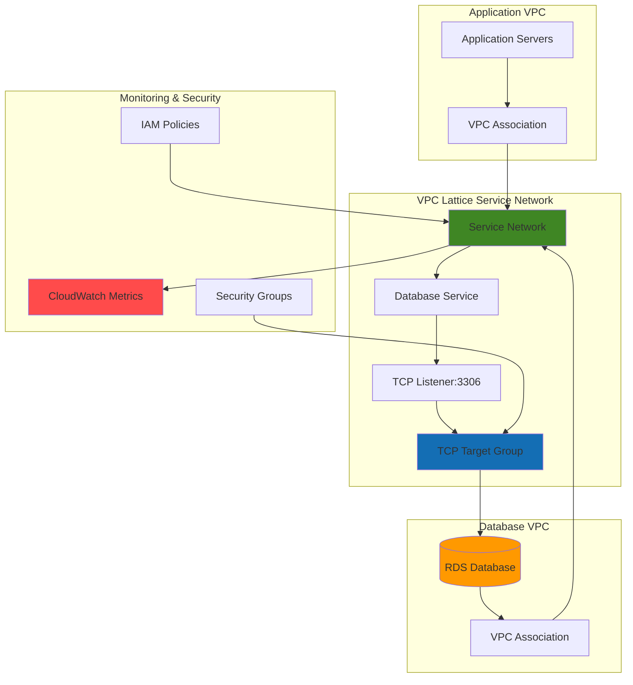

# TCP Resource Connectivity with VPC Lattice and CloudWatch

## Problem

Organizations need to securely connect applications to TCP-based resources like RDS databases across multiple VPCs without complex VPC peering configurations or exposing databases publicly. Traditional cross-VPC database access requires managing multiple VPC peering connections and route tables, which becomes increasingly complex as environments scale. This approach creates security risks through overly broad network access and operational overhead from managing interconnected VPC topologies.

## Solution

Amazon VPC Lattice provides a service networking layer that enables secure TCP connectivity to database resources across VPCs using a simplified service mesh approach. By creating VPC Lattice services with TCP target groups pointing to RDS instances, applications can connect to databases using service-aware networking with built-in access controls and comprehensive CloudWatch monitoring for cost optimization and performance tracking.

## Architecture Diagram



## Prerequisites

1. AWS account with VPC Lattice, RDS, CloudWatch, and IAM permissions
2. AWS CLI v2 installed and configured (version 2.0 or later)
3. Two VPCs in the same region (one for application, one for database)
4. Understanding of TCP networking and database connectivity concepts
5. Estimated cost: $25-40/month for RDS db.t3.micro instance and VPC Lattice service charges

> **Note**: VPC Lattice charges are based on service network hours and processed data. Review the [VPC Lattice pricing](https://aws.amazon.com/vpc/lattice/pricing/) for current rates.

## Preparation

```bash
# Set environment variables
export AWS_REGION=$(aws configure get region)
export AWS_ACCOUNT_ID=$(aws sts get-caller-identity \
    --query Account --output text)

# Generate unique identifiers for resources
RANDOM_SUFFIX=$(aws secretsmanager get-random-password \
    --exclude-punctuation --exclude-uppercase \
    --password-length 6 --require-each-included-type \
    --output text --query RandomPassword)

# Set resource names
export SERVICE_NETWORK_NAME="database-service-network-${RANDOM_SUFFIX}"
export DATABASE_SERVICE_NAME="rds-database-service-${RANDOM_SUFFIX}"
export TARGET_GROUP_NAME="rds-tcp-targets-${RANDOM_SUFFIX}"
export RDS_INSTANCE_ID="vpc-lattice-db-${RANDOM_SUFFIX}"

# Get default VPC and subnet information for this demo
export DEFAULT_VPC_ID=$(aws ec2 describe-vpcs \
    --filters "Name=is-default,Values=true" \
    --query 'Vpcs[0].VpcId' --output text)

export SUBNET_IDS=$(aws ec2 describe-subnets \
    --filters "Name=vpc-id,Values=${DEFAULT_VPC_ID}" \
    --query 'Subnets[0:2].SubnetId' --output text | tr '\t' ' ')

export SECURITY_GROUP_ID=$(aws ec2 describe-security-groups \
    --filters "Name=vpc-id,Values=${DEFAULT_VPC_ID}" \
             "Name=group-name,Values=default" \
    --query 'SecurityGroups[0].GroupId' --output text)

# Create foundational IAM role for VPC Lattice service
aws iam create-role \
    --role-name VPCLatticeServiceRole-${RANDOM_SUFFIX} \
    --assume-role-policy-document '{
        "Version": "2012-10-17",
        "Statement": [
            {
                "Effect": "Allow",
                "Principal": {
                    "Service": "vpc-lattice.amazonaws.com"
                },
                "Action": "sts:AssumeRole"
            }
        ]
    }'

echo "✅ AWS environment configured with unique suffix: ${RANDOM_SUFFIX}"
echo "Default VPC ID: ${DEFAULT_VPC_ID}"
echo "Subnet IDs: ${SUBNET_IDS}"
echo "Security Group ID: ${SECURITY_GROUP_ID}"
```

## Steps

1. **Create VPC Lattice Service Network**:

   VPC Lattice service networks provide the foundational networking layer that enables secure communication between services across multiple VPCs. Creating a service network establishes the control plane that will manage routing, security policies, and access controls for all attached services and VPC associations.

   ```bash
   # Create the service network for cross-VPC database connectivity
   SERVICE_NETWORK_ARN=$(aws vpc-lattice create-service-network \
       --name ${SERVICE_NETWORK_NAME} \
       --auth-type "AWS_IAM" \
       --query 'arn' --output text)
   
   # Store the service network ID for subsequent commands
   SERVICE_NETWORK_ID=$(echo ${SERVICE_NETWORK_ARN} | \
       awk -F'/' '{print $NF}')
   
   echo "✅ Service network created: ${SERVICE_NETWORK_ID}"
   ```

   The service network now provides centralized policy enforcement and service discovery capabilities across VPCs. This foundational layer enables applications to connect to databases using service names rather than IP addresses, simplifying network management and improving security posture.

2. **Create RDS Database Instance**:

   Amazon RDS provides managed database services with automatic backups, patching, and high availability features. For this setup, we'll create a MySQL instance in a private subnet that will serve as our TCP target, demonstrating how VPC Lattice enables secure database access without public exposure.

   ```bash
   # Create DB subnet group for RDS instance placement using discovered subnets
   aws rds create-db-subnet-group \
       --db-subnet-group-name ${RDS_INSTANCE_ID}-subnet-group \
       --db-subnet-group-description "Subnet group for VPC Lattice demo" \
       --subnet-ids ${SUBNET_IDS} \
       --tags Key=Project,Value=VPCLatticeDemo
   
   # Create RDS MySQL instance for TCP connectivity testing
   aws rds create-db-instance \
       --db-instance-identifier ${RDS_INSTANCE_ID} \
       --db-instance-class db.t3.micro \
       --engine mysql \
       --engine-version 8.0.35 \
       --master-username admin \
       --master-user-password MySecurePassword123! \
       --allocated-storage 20 \
       --db-subnet-group-name ${RDS_INSTANCE_ID}-subnet-group \
       --vpc-security-group-ids ${SECURITY_GROUP_ID} \
       --no-publicly-accessible \
       --port 3306 \
       --backup-retention-period 1 \
       --storage-encrypted
   
   echo "✅ RDS instance creation initiated: ${RDS_INSTANCE_ID}"
   
   # Wait for RDS instance to become available
   aws rds wait db-instance-available \
       --db-instance-identifier ${RDS_INSTANCE_ID}
   
   echo "✅ RDS instance is now available"
   ```

   The RDS instance is now running in a private subnet with no public accessibility, ensuring database security. This configuration demonstrates enterprise-grade database deployment patterns where databases remain isolated from internet access while still being accessible through VPC Lattice's service networking layer.

3. **Get RDS Instance Details**:

   VPC Lattice target groups require specific resource identifiers to route traffic correctly. Retrieving the RDS instance endpoint and port information ensures accurate target registration for TCP connectivity.

   ```bash
   # Retrieve RDS instance endpoint for target group registration
   RDS_ENDPOINT=$(aws rds describe-db-instances \
       --db-instance-identifier ${RDS_INSTANCE_ID} \
       --query 'DBInstances[0].Endpoint.Address' \
       --output text)
   
   RDS_PORT=$(aws rds describe-db-instances \
       --db-instance-identifier ${RDS_INSTANCE_ID} \
       --query 'DBInstances[0].Endpoint.Port' \
       --output text)
   
   echo "✅ RDS endpoint: ${RDS_ENDPOINT}:${RDS_PORT}"
   ```

4. **Create TCP Target Group for RDS**:

   VPC Lattice target groups define how traffic is routed to backend resources. Creating a TCP target group specifically configured for MySQL traffic enables load balancing and health checking for database connections while supporting the MySQL wire protocol requirements.

   ```bash
   # Create target group for TCP database connections
   TARGET_GROUP_ARN=$(aws vpc-lattice create-target-group \
       --name ${TARGET_GROUP_NAME} \
       --type "IP" \
       --config '{
           "port": '${RDS_PORT}',
           "protocol": "TCP",
           "vpcIdentifier": "'${DEFAULT_VPC_ID}'",
           "healthCheck": {
               "enabled": true,
               "protocol": "TCP",
               "port": '${RDS_PORT}',
               "healthCheckIntervalSeconds": 30,
               "healthCheckTimeoutSeconds": 5,
               "healthyThresholdCount": 2,
               "unhealthyThresholdCount": 2
           }
       }' \
       --query 'arn' --output text)
   
   TARGET_GROUP_ID=$(echo ${TARGET_GROUP_ARN} | awk -F'/' '{print $NF}')
   
   echo "✅ TCP target group created: ${TARGET_GROUP_ID}"
   ```

   The target group is now configured with TCP health checks that verify database connectivity without requiring application-layer protocols. This approach ensures that only healthy database instances receive traffic while maintaining optimal performance through native TCP monitoring.

5. **Register RDS Instance as Target**:

   Target registration establishes the connection between VPC Lattice routing and the actual database instance. Registering the RDS endpoint enables VPC Lattice to direct incoming TCP connections to the appropriate database server while maintaining connection state and load balancing capabilities.

   ```bash
   # Register RDS instance IP as target in the TCP target group
   aws vpc-lattice register-targets \
       --target-group-identifier ${TARGET_GROUP_ID} \
       --targets '[{
           "id": "'${RDS_ENDPOINT}'",
           "port": '${RDS_PORT}'
       }]'
   
   echo "✅ RDS instance registered as target"
   
   # Verify target registration and health status
   aws vpc-lattice list-targets \
       --target-group-identifier ${TARGET_GROUP_ID}
   ```

6. **Create VPC Lattice Service**:

   VPC Lattice services provide the application-facing interface for backend resources. Creating a database service establishes a stable endpoint that applications can use to connect to RDS instances regardless of underlying infrastructure changes or scaling events.

   ```bash
   # Create VPC Lattice service for database access
   DATABASE_SERVICE_ARN=$(aws vpc-lattice create-service \
       --name ${DATABASE_SERVICE_NAME} \
       --auth-type "AWS_IAM" \
       --query 'arn' --output text)
   
   DATABASE_SERVICE_ID=$(echo ${DATABASE_SERVICE_ARN} | \
       awk -F'/' '{print $NF}')
   
   echo "✅ Database service created: ${DATABASE_SERVICE_ID}"
   ```

7. **Create TCP Listener for Database Service**:

   Listeners define how incoming connections are processed and routed to target groups. Creating a TCP listener on port 3306 enables MySQL client connections while maintaining protocol compatibility and connection state management through VPC Lattice's networking layer.

   ```bash
   # Create TCP listener for MySQL connections (port 3306)
   LISTENER_ARN=$(aws vpc-lattice create-listener \
       --service-identifier ${DATABASE_SERVICE_ID} \
       --name "mysql-tcp-listener" \
       --protocol "TCP" \
       --port 3306 \
       --default-action '{
           "forward": {
               "targetGroups": [{
                   "targetGroupIdentifier": "'${TARGET_GROUP_ID}'",
                   "weight": 100
               }]
           }
       }' \
       --query 'arn' --output text)
   
   LISTENER_ID=$(echo ${LISTENER_ARN} | awk -F'/' '{print $NF}')
   
   echo "✅ TCP listener created on port 3306: ${LISTENER_ID}"
   ```

   The TCP listener now routes all incoming MySQL connections to the registered RDS target group. This configuration maintains full protocol compatibility while providing service mesh benefits like traffic observability, access controls, and automated health checking.

8. **Associate Service with Service Network**:

   Service network associations enable service discovery and routing between VPC Lattice services. Associating the database service with the service network makes it discoverable by applications and enables centralized policy enforcement across the entire service mesh.

   ```bash
   # Associate database service with the service network
   aws vpc-lattice create-service-network-service-association \
       --service-network-identifier ${SERVICE_NETWORK_ID} \
       --service-identifier ${DATABASE_SERVICE_ID}
   
   echo "✅ Database service associated with service network"
   ```

9. **Associate VPC with Service Network**:

   VPC associations establish the network connectivity required for service mesh operations. Associating the VPC with the service network enables cross-VPC communication while maintaining network isolation and security boundaries.

   ```bash
   # Associate VPC with service network for both application and database access
   VPC_ASSOCIATION_ARN=$(aws vpc-lattice create-service-network-vpc-association \
       --service-network-identifier ${SERVICE_NETWORK_ID} \
       --vpc-identifier ${DEFAULT_VPC_ID} \
       --security-group-ids ${SECURITY_GROUP_ID} \
       --query 'arn' --output text)
   
   echo "✅ VPC associated with service network: ${VPC_ASSOCIATION_ARN}"
   ```

   The VPC is now connected to the service network, enabling applications to discover and connect to the database service through VPC Lattice's service mesh networking. This association provides secure, managed connectivity without requiring complex routing configurations.

10. **Configure CloudWatch Monitoring**:

    CloudWatch integration provides comprehensive observability for VPC Lattice services including connection metrics, throughput monitoring, and cost tracking. Enabling detailed monitoring ensures optimal database performance and cost management through real-time visibility into service usage patterns.

    ```bash
    # Create CloudWatch dashboard for VPC Lattice metrics
    aws cloudwatch put-dashboard \
        --dashboard-name "VPCLattice-Database-Monitoring-${RANDOM_SUFFIX}" \
        --dashboard-body '{
            "widgets": [
                {
                    "type": "metric",
                    "x": 0,
                    "y": 0,
                    "width": 12,
                    "height": 6,
                    "properties": {
                        "metrics": [
                            ["AWS/VpcLattice", "NewConnectionCount", "TargetGroup", "'${TARGET_GROUP_ID}'"],
                            [".", "ActiveConnectionCount", ".", "."],
                            [".", "ConnectionErrorCount", ".", "."]
                        ],
                        "period": 300,
                        "stat": "Sum",
                        "region": "'${AWS_REGION}'",
                        "title": "Database Connection Metrics"
                    }
                },
                {
                    "type": "metric", 
                    "x": 0,
                    "y": 6,
                    "width": 12,
                    "height": 6,
                    "properties": {
                        "metrics": [
                            ["AWS/VpcLattice", "ProcessedBytes", "TargetGroup", "'${TARGET_GROUP_ID}'"]
                        ],
                        "period": 300,
                        "stat": "Sum", 
                        "region": "'${AWS_REGION}'",
                        "title": "Database Traffic Volume"
                    }
                }
            ]
        }'
    
    # Create CloudWatch alarm for connection errors
    aws cloudwatch put-metric-alarm \
        --alarm-name "VPCLattice-Database-Connection-Errors-${RANDOM_SUFFIX}" \
        --alarm-description "Alert on database connection errors" \
        --metric-name ConnectionErrorCount \
        --namespace AWS/VpcLattice \
        --statistic Sum \
        --period 300 \
        --threshold 5 \
        --comparison-operator GreaterThanThreshold \
        --dimensions Name=TargetGroup,Value=${TARGET_GROUP_ID} \
        --evaluation-periods 2
    
    echo "✅ CloudWatch monitoring configured for VPC Lattice service"
    ```

## Validation & Testing

1. **Verify VPC Lattice Service Network Status**:

   ```bash
   # Check service network configuration and status
   aws vpc-lattice get-service-network \
       --service-network-identifier ${SERVICE_NETWORK_ID}
   ```

   Expected output: Service network in "ACTIVE" state with AWS_IAM authentication type.

2. **Verify Target Health**:

   ```bash
   # Check target group health status
   aws vpc-lattice list-targets \
       --target-group-identifier ${TARGET_GROUP_ID}
   ```

   Expected output: RDS endpoint registered as "HEALTHY" target.

3. **Test Database Connectivity**:

   ```bash
   # Get the VPC Lattice service endpoint for connectivity testing
   SERVICE_ENDPOINT="${DATABASE_SERVICE_NAME}.${SERVICE_NETWORK_ID}.vpc-lattice-svcs.${AWS_REGION}.on.aws"
   
   echo "Service endpoint: ${SERVICE_ENDPOINT}"
   
   # Test TCP connectivity to VPC Lattice service (requires EC2 instance)
   # telnet ${SERVICE_ENDPOINT} 3306
   
   # Alternative: Use nc (netcat) to test connectivity
   # timeout 5 nc -zv ${SERVICE_ENDPOINT} 3306
   ```

   Expected output: Successful TCP connection to port 3306 indicating MySQL protocol availability.

4. **Monitor CloudWatch Metrics**:

   ```bash
   # View connection metrics for the past hour
   aws cloudwatch get-metric-statistics \
       --namespace AWS/VpcLattice \
       --metric-name NewConnectionCount \
       --dimensions Name=TargetGroup,Value=${TARGET_GROUP_ID} \
       --start-time $(date -u -d '1 hour ago' +%Y-%m-%dT%H:%M:%S) \
       --end-time $(date -u +%Y-%m-%dT%H:%M:%S) \
       --period 300 \
       --statistics Sum
   ```

## Cleanup

1. **Remove VPC Associations**:

   ```bash
   # List and delete VPC associations
   VPC_ASSOCIATIONS=$(aws vpc-lattice list-service-network-vpc-associations \
       --service-network-identifier ${SERVICE_NETWORK_ID} \
       --query 'items[].arn' --output text)
   
   for association in ${VPC_ASSOCIATIONS}; do
       aws vpc-lattice delete-service-network-vpc-association \
           --service-network-vpc-association-identifier ${association}
       echo "Deleted VPC association: ${association}"
   done
   
   echo "✅ VPC associations removed"
   ```

2. **Remove Service Association**:

   ```bash
   # Delete service network service association
   SERVICE_ASSOCIATIONS=$(aws vpc-lattice list-service-network-service-associations \
       --service-network-identifier ${SERVICE_NETWORK_ID} \
       --query 'items[].arn' --output text)
   
   for association in ${SERVICE_ASSOCIATIONS}; do
       aws vpc-lattice delete-service-network-service-association \
           --service-network-service-association-identifier ${association}
       echo "Deleted service association: ${association}"
   done
   
   echo "✅ Service associations removed"
   ```

3. **Delete VPC Lattice Resources**:

   ```bash
   # Delete listener
   aws vpc-lattice delete-listener \
       --service-identifier ${DATABASE_SERVICE_ID} \
       --listener-identifier ${LISTENER_ID}
   
   # Delete service
   aws vpc-lattice delete-service \
       --service-identifier ${DATABASE_SERVICE_ID}
   
   # Deregister targets and delete target group
   aws vpc-lattice deregister-targets \
       --target-group-identifier ${TARGET_GROUP_ID} \
       --targets '[{"id": "'${RDS_ENDPOINT}'", "port": '${RDS_PORT}'}]'
   
   aws vpc-lattice delete-target-group \
       --target-group-identifier ${TARGET_GROUP_ID}
   
   # Delete service network
   aws vpc-lattice delete-service-network \
       --service-network-identifier ${SERVICE_NETWORK_ID}
   
   echo "✅ VPC Lattice resources deleted"
   ```

4. **Remove RDS and CloudWatch Resources**:

   ```bash
   # Delete RDS instance
   aws rds delete-db-instance \
       --db-instance-identifier ${RDS_INSTANCE_ID} \
       --skip-final-snapshot
   
   # Delete DB subnet group
   aws rds delete-db-subnet-group \
       --db-subnet-group-name ${RDS_INSTANCE_ID}-subnet-group
   
   # Delete CloudWatch dashboard and alarms
   aws cloudwatch delete-dashboards \
       --dashboard-names "VPCLattice-Database-Monitoring-${RANDOM_SUFFIX}"
   
   aws cloudwatch delete-alarms \
       --alarm-names "VPCLattice-Database-Connection-Errors-${RANDOM_SUFFIX}"
   
   # Delete IAM role
   aws iam delete-role \
       --role-name VPCLatticeServiceRole-${RANDOM_SUFFIX}
   
   echo "✅ All resources cleaned up"
   ```

## Discussion

VPC Lattice revolutionizes cross-VPC database connectivity by providing a service mesh architecture that eliminates the complexity of traditional VPC peering and transit gateway configurations. The TCP protocol support enables direct database connections while maintaining the benefits of service-aware networking, including automatic service discovery, traffic routing, and comprehensive observability through CloudWatch integration. This approach aligns with the [AWS Well-Architected Framework](https://docs.aws.amazon.com/wellarchitected/latest/framework/welcome.html) by providing operational excellence through simplified networking and security through IAM-based access controls.

The architecture demonstrated in this recipe follows AWS security best practices by implementing IAM-based access controls and network isolation, reliability through health checking and automatic failover capabilities, and operational excellence through CloudWatch monitoring and centralized service management. This approach significantly reduces the operational overhead associated with managing complex VPC interconnections while improving security posture through fine-grained access controls as outlined in the [VPC Lattice User Guide](https://docs.aws.amazon.com/vpc-lattice/latest/ug/what-is-vpc-lattice.html).

Cost optimization becomes achievable through VPC Lattice's usage-based pricing model and CloudWatch metrics that provide visibility into actual database usage patterns. Organizations can leverage these insights to right-size database instances, optimize connection pooling strategies, and implement cost-effective scaling policies based on real-world traffic patterns rather than static capacity planning assumptions. The [CloudWatch integration](https://docs.aws.amazon.com/vpc-lattice/latest/ug/monitoring-cloudwatch.html) provides comprehensive visibility into connection counts, data transfer volumes, error rates, and latency metrics across the entire service mesh topology.

Performance monitoring through CloudWatch enables proactive identification of database connectivity issues, connection pool exhaustion, and traffic anomalies before they impact application performance. The TCP health checks ensure database availability while maintaining optimal connection handling, providing enterprise-grade reliability for mission-critical applications.

> **Tip**: Enable VPC Flow Logs for additional network-level visibility and use AWS Config to monitor VPC Lattice configuration changes for compliance and security auditing requirements. See the [VPC Flow Logs documentation](https://docs.aws.amazon.com/vpc/latest/userguide/flow-logs.html) for implementation guidance.

## Challenge

Extend this solution by implementing these enhancements:

1. **Multi-AZ Database High Availability**: Configure RDS Multi-AZ deployment with VPC Lattice target groups spanning multiple availability zones for automatic failover capabilities and improved resilience.

2. **Read Replica Load Balancing**: Create additional target groups for RDS read replicas to distribute read traffic across multiple database endpoints while maintaining write traffic isolation to the primary instance.

3. **Cross-Account Database Access**: Implement Resource Access Manager (RAM) sharing to enable VPC Lattice service network access across AWS accounts while maintaining security boundaries and cost allocation visibility.

4. **Advanced CloudWatch Monitoring**: Deploy CloudWatch Insights queries to analyze VPC Lattice logs, create custom metrics for database connection patterns, and implement automated scaling triggers based on connection density metrics.

5. **Security Enhancement with Resource-Based Policies**: Implement VPC Lattice resource-based policies for fine-grained access control and integrate with AWS Config for continuous compliance monitoring and automated remediation.

## Infrastructure Code

### Available Infrastructure as Code:

- [Infrastructure Code Overview](code/README.md) - Detailed description of all infrastructure components
- [AWS CDK (Python)](code/cdk-python/) - AWS CDK Python implementation
- [AWS CDK (TypeScript)](code/cdk-typescript/) - AWS CDK TypeScript implementation
- [CloudFormation](code/cloudformation.yaml) - AWS CloudFormation template
- [Bash CLI Scripts](code/scripts/) - Example bash scripts using AWS CLI commands to deploy infrastructure
- [Terraform](code/terraform/) - Terraform configuration files