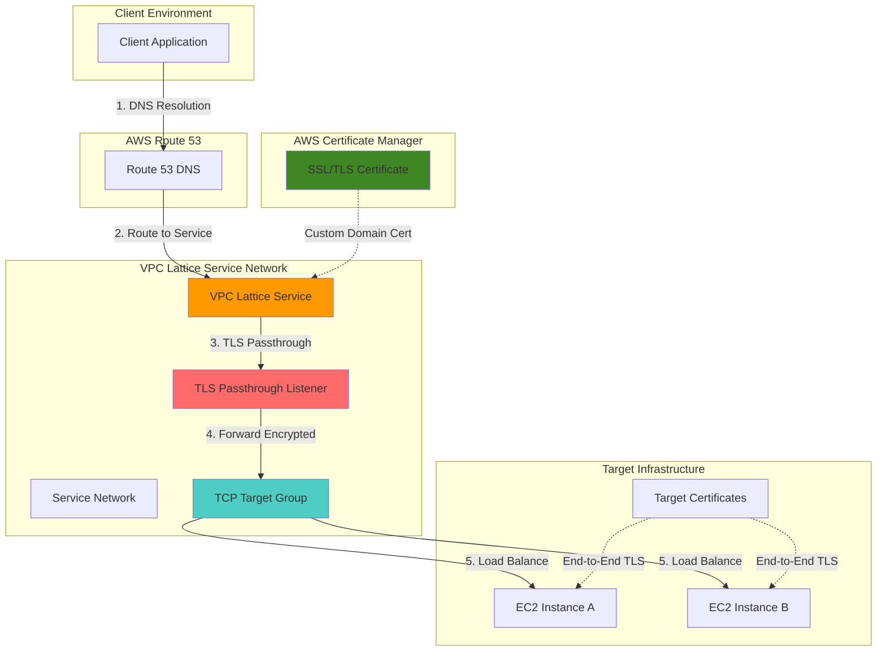

# End-to-End Encryption with VPC Lattice TLS Passthrough

## Problem

Organizations handling sensitive data often require true end-to-end encryption where traffic remains encrypted from client to application without intermediate decryption points to meet strict compliance requirements like PCI DSS, HIPAA, or financial regulations. Traditional load balancers and service meshes typically terminate TLS connections and re-encrypt traffic, creating potential security gaps and compliance concerns where encrypted data is momentarily decrypted in transit infrastructure.

## Solution

Amazon VPC Lattice TLS passthrough provides secure service-to-service communication by forwarding encrypted traffic directly to target applications without intermediate decryption. Combined with AWS Certificate Manager for certificate lifecycle management and Route 53 for DNS resolution, this approach ensures complete end-to-end encryption while simplifying service discovery and load balancing across microservices architectures.

## Architecture Diagram



## Prerequisites

1. AWS account with permissions for VPC Lattice, Certificate Manager, Route 53, and EC2
2. AWS CLI v2 installed and configured (or AWS CloudShell)
3. Basic understanding of TLS/SSL certificates and DNS configuration
4. A registered domain name for creating custom certificates (you can use a subdomain)
5. Estimated cost: $25-50 for testing (EC2 instances, VPC Lattice service, certificates)

> **Note**: This recipe requires a custom domain name to enable TLS passthrough functionality. VPC Lattice uses Server Name Indication (SNI) for routing encrypted traffic.

## Preparation

```bash
# Set environment variables
export AWS_REGION=$(aws configure get region)
export AWS_ACCOUNT_ID=$(aws sts get-caller-identity \
    --query Account --output text)

# Generate unique identifiers for resources
RANDOM_SUFFIX=$(aws secretsmanager get-random-password \
    --exclude-punctuation --exclude-uppercase \
    --password-length 6 --require-each-included-type \
    --output text --query RandomPassword)

# Set custom domain name (replace with your domain)
export CUSTOM_DOMAIN="api-service.example.com"
export CERT_DOMAIN="*.example.com"

# Create VPC for target instances
VPC_ID=$(aws ec2 create-vpc \
    --cidr-block 10.0.0.0/16 \
    --tag-specifications \
    'ResourceType=vpc,Tags=[{Key=Name,Value=vpc-lattice-demo}]' \
    --query 'Vpc.VpcId' --output text)

# Create subnet for target instances
SUBNET_ID=$(aws ec2 create-subnet \
    --vpc-id ${VPC_ID} \
    --cidr-block 10.0.1.0/24 \
    --availability-zone ${AWS_REGION}a \
    --tag-specifications \
    'ResourceType=subnet,Tags=[{Key=Name,Value=lattice-targets}]' \
    --query 'Subnet.SubnetId' --output text)

# Create internet gateway for target access
IGW_ID=$(aws ec2 create-internet-gateway \
    --tag-specifications \
    'ResourceType=internet-gateway,Tags=[{Key=Name,Value=lattice-demo-igw}]' \
    --query 'InternetGateway.InternetGatewayId' --output text)

aws ec2 attach-internet-gateway \
    --internet-gateway-id ${IGW_ID} \
    --vpc-id ${VPC_ID}

echo "✅ VPC infrastructure created with ID: ${VPC_ID}"
```

## Steps

1. **Create Route Table and Security Group for Target Infrastructure**:

   VPC Lattice requires proper networking configuration to enable secure communication between the service network and target instances. The security group configuration allows HTTPS traffic on port 443 while maintaining restrictive access controls that follow AWS security best practices.

   ```bash
   # Create route table for internet access
   ROUTE_TABLE_ID=$(aws ec2 create-route-table \
       --vpc-id ${VPC_ID} \
       --tag-specifications \
       'ResourceType=route-table,Tags=[{Key=Name,Value=lattice-demo-rt}]' \
       --query 'RouteTable.RouteTableId' --output text)
   
   # Add route to internet gateway
   aws ec2 create-route \
       --route-table-id ${ROUTE_TABLE_ID} \
       --destination-cidr-block 0.0.0.0/0 \
       --gateway-id ${IGW_ID}
   
   # Associate route table with subnet
   aws ec2 associate-route-table \
       --route-table-id ${ROUTE_TABLE_ID} \
       --subnet-id ${SUBNET_ID}
   
   # Create security group for target instances
   SECURITY_GROUP_ID=$(aws ec2 create-security-group \
       --group-name lattice-targets-sg-${RANDOM_SUFFIX} \
       --description "Security group for VPC Lattice target instances" \
       --vpc-id ${VPC_ID} \
       --tag-specifications \
       'ResourceType=security-group,Tags=[{Key=Name,Value=lattice-targets-sg}]' \
       --query 'GroupId' --output text)
   
   # Allow HTTPS traffic from VPC Lattice service network range
   aws ec2 authorize-security-group-ingress \
       --group-id ${SECURITY_GROUP_ID} \
       --protocol tcp \
       --port 443 \
       --cidr 10.0.0.0/8
   
   echo "✅ Network configuration completed"
   ```

2. **Request SSL/TLS Certificate from AWS Certificate Manager**:

   AWS Certificate Manager provides managed certificates with automatic renewal capabilities, eliminating the operational burden of manual certificate management. For TLS passthrough scenarios, certificates are needed on both the VPC Lattice service for domain validation and target instances for complete end-to-end encryption.

   ```bash
   # Request certificate for custom domain
   CERT_ARN=$(aws acm request-certificate \
       --domain-name ${CERT_DOMAIN} \
       --validation-method DNS \
       --subject-alternative-names ${CUSTOM_DOMAIN} \
       --tags Key=Name,Value=lattice-tls-passthrough \
       --query 'CertificateArn' --output text)
   
   echo "Certificate ARN: ${CERT_ARN}"
   echo "✅ Certificate requested - validate via DNS in ACM console"
   
   # Display validation instructions
   echo "To complete certificate validation:"
   echo "1. Go to ACM console: https://console.aws.amazon.com/acm/"
   echo "2. Find your certificate and create the DNS validation records"
   echo "3. Wait for validation to complete (usually 5-10 minutes)"
   echo "Press Enter after certificate validation is complete..."
   read -p ""
   
   # Verify certificate is issued
   CERT_STATUS=$(aws acm describe-certificate \
       --certificate-arn ${CERT_ARN} \
       --query 'Certificate.Status' --output text)
   
   echo "Certificate status: ${CERT_STATUS}"
   ```

3. **Deploy Target EC2 Instances with Self-Signed Certificates**:

   Target instances require their own TLS certificates to complete the end-to-end encryption chain. This configuration uses Amazon Linux 2023 with Apache HTTP Server configured for HTTPS, demonstrating how applications receive encrypted traffic directly from clients through VPC Lattice.

   ```bash
   # Get latest Amazon Linux 2023 AMI ID
   AMI_ID=$(aws ssm get-parameters \
       --names /aws/service/ami-amazon-linux-latest/al2023-ami-kernel-6.1-x86_64 \
       --query 'Parameters[0].Value' --output text)
   
   # Create user data script for target instances
   cat > user-data.sh << 'EOF'
#!/bin/bash
dnf update -y
dnf install -y httpd mod_ssl openssl

# Generate self-signed certificate for target
openssl req -x509 -nodes -days 365 -newkey rsa:2048 \
    -keyout /etc/pki/tls/private/server.key \
    -out /etc/pki/tls/certs/server.crt \
    -subj "/C=US/ST=State/L=City/O=Organization/CN=api-service.example.com"

# Configure SSL virtual host
cat > /etc/httpd/conf.d/ssl.conf << 'SSLCONF'
LoadModule ssl_module modules/mod_ssl.so
Listen 443
<VirtualHost *:443>
    ServerName api-service.example.com
    DocumentRoot /var/www/html
    SSLEngine on
    SSLCertificateFile /etc/pki/tls/certs/server.crt
    SSLCertificateKeyFile /etc/pki/tls/private/server.key
    SSLProtocol TLSv1.2 TLSv1.3
    SSLCipherSuite ECDHE+AESGCM:ECDHE+CHACHA20:DHE+AESGCM:DHE+CHACHA20:!aNULL:!MD5:!DSS
</VirtualHost>
SSLCONF

# Create simple HTTPS response with instance identification
INSTANCE_ID=$(curl -s http://169.254.169.254/latest/meta-data/instance-id)
echo "<h1>Target Instance Response - TLS Passthrough Success</h1>" > /var/www/html/index.html
echo "<p>Instance ID: ${INSTANCE_ID}</p>" >> /var/www/html/index.html
echo "<p>Timestamp: $(date)</p>" >> /var/www/html/index.html

# Start Apache
systemctl enable httpd
systemctl start httpd
EOF

   # Launch target instances
   INSTANCE_1=$(aws ec2 run-instances \
       --image-id ${AMI_ID} \
       --instance-type t3.micro \
       --subnet-id ${SUBNET_ID} \
       --security-group-ids ${SECURITY_GROUP_ID} \
       --user-data file://user-data.sh \
       --tag-specifications \
       'ResourceType=instance,Tags=[{Key=Name,Value=lattice-target-1}]' \
       --query 'Instances[0].InstanceId' --output text)
   
   INSTANCE_2=$(aws ec2 run-instances \
       --image-id ${AMI_ID} \
       --instance-type t3.micro \
       --subnet-id ${SUBNET_ID} \
       --security-group-ids ${SECURITY_GROUP_ID} \
       --user-data file://user-data.sh \
       --tag-specifications \
       'ResourceType=instance,Tags=[{Key=Name,Value=lattice-target-2}]' \
       --query 'Instances[0].InstanceId' --output text)
   
   # Wait for instances to be running
   aws ec2 wait instance-running --instance-ids ${INSTANCE_1} ${INSTANCE_2}
   
   echo "✅ Target instances launched: ${INSTANCE_1}, ${INSTANCE_2}"
   ```

4. **Create VPC Lattice Service Network**:

   VPC Lattice service networks provide the foundation for service-to-service communication and enable cross-VPC connectivity. The service network acts as a logical boundary for service discovery and access control policies, enabling secure communication patterns across distributed applications.

   ```bash
   # Create VPC Lattice service network
   SERVICE_NETWORK_ID=$(aws vpc-lattice create-service-network \
       --name "tls-passthrough-network-${RANDOM_SUFFIX}" \
       --auth-type "NONE" \
       --tags Key=Name,Value=tls-passthrough-network \
       --query 'id' --output text)
   
   # Associate VPC with service network
   aws vpc-lattice create-service-network-vpc-association \
       --service-network-identifier ${SERVICE_NETWORK_ID} \
       --vpc-identifier ${VPC_ID} \
       --tags Key=Name,Value=target-vpc-association
   
   echo "✅ Service network created: ${SERVICE_NETWORK_ID}"
   ```

5. **Create TCP Target Group for TLS Passthrough**:

   TLS passthrough requires TCP protocol target groups since the traffic remains encrypted and cannot be inspected at the HTTP layer. Health checks operate at the TCP level, providing connection-based monitoring that ensures targets can accept encrypted connections while maintaining the security boundary.

   ```bash
   # Create TCP target group for TLS passthrough
   TARGET_GROUP_ARN=$(aws vpc-lattice create-target-group \
       --name "tls-passthrough-targets-${RANDOM_SUFFIX}" \
       --type "INSTANCE" \
       --protocol "TCP" \
       --port 443 \
       --vpc-identifier ${VPC_ID} \
       --health-check '{
           "enabled": true,
           "protocol": "TCP",
           "port": 443,
           "healthyThresholdCount": 2,
           "unhealthyThresholdCount": 2,
           "intervalSeconds": 30,
           "timeoutSeconds": 5
       }' \
       --tags Key=Name,Value=tls-passthrough-targets \
       --query 'arn' --output text)
   
   # Register target instances
   aws vpc-lattice register-targets \
       --target-group-identifier ${TARGET_GROUP_ARN} \
       --targets "id=${INSTANCE_1},port=443" "id=${INSTANCE_2},port=443"
   
   echo "✅ TCP target group created: ${TARGET_GROUP_ARN}"
   ```

6. **Create VPC Lattice Service with Custom Domain**:

   The VPC Lattice service configuration requires a custom domain name for TLS passthrough functionality. This enables Server Name Indication (SNI) routing to forward encrypted traffic to appropriate targets based on the requested domain, maintaining encryption while enabling intelligent routing decisions.

   ```bash
   # Create VPC Lattice service with custom domain
   SERVICE_ARN=$(aws vpc-lattice create-service \
       --name "tls-passthrough-service-${RANDOM_SUFFIX}" \
       --custom-domain-name ${CUSTOM_DOMAIN} \
       --certificate-arn ${CERT_ARN} \
       --auth-type "NONE" \
       --tags Key=Name,Value=tls-passthrough-service \
       --query 'arn' --output text)
   
   # Associate service with service network
   aws vpc-lattice create-service-network-service-association \
       --service-network-identifier ${SERVICE_NETWORK_ID} \
       --service-identifier ${SERVICE_ARN} \
       --tags Key=Name,Value=service-association
   
   echo "✅ VPC Lattice service created: ${SERVICE_ARN}"
   ```

7. **Configure TLS Passthrough Listener**:

   The TLS listener configuration enables passthrough mode where encrypted traffic flows directly to targets without intermediate decryption. This maintains end-to-end encryption integrity while providing load balancing and health monitoring capabilities through the VPC Lattice service mesh.

   ```bash
   # Create TLS passthrough listener
   LISTENER_ARN=$(aws vpc-lattice create-listener \
       --service-identifier ${SERVICE_ARN} \
       --name "tls-passthrough-listener" \
       --protocol "TLS_PASSTHROUGH" \
       --port 443 \
       --default-action '{
           "forward": {
               "targetGroups": [
                   {
                       "targetGroupIdentifier": "'${TARGET_GROUP_ARN}'",
                       "weight": 100
                   }
               ]
           }
       }' \
       --tags Key=Name,Value=tls-passthrough-listener \
       --query 'arn' --output text)
   
   echo "✅ TLS passthrough listener created: ${LISTENER_ARN}"
   ```

8. **Configure Route 53 DNS Resolution**:

   Route 53 provides DNS resolution for the custom domain, directing traffic to the VPC Lattice service. This enables clients to discover and connect to services using familiar DNS-based service discovery patterns while maintaining the security and performance benefits of the VPC Lattice service mesh.

   ```bash
   # Get VPC Lattice service DNS name
   SERVICE_DNS=$(aws vpc-lattice get-service \
       --service-identifier ${SERVICE_ARN} \
       --query 'dnsEntry.domainName' --output text)
   
   echo "VPC Lattice service DNS: ${SERVICE_DNS}"
   
   # Create Route 53 hosted zone (if not exists)
   HOSTED_ZONE_ID=$(aws route53 create-hosted-zone \
       --name "example.com" \
       --caller-reference "lattice-demo-$(date +%s)" \
       --hosted-zone-config Comment="VPC Lattice TLS Passthrough Demo" \
       --query 'HostedZone.Id' --output text 2>/dev/null || \
       aws route53 list-hosted-zones-by-name \
       --dns-name "example.com" \
       --query 'HostedZones[0].Id' --output text)
   
   # Create CNAME record pointing to VPC Lattice service
   cat > dns-change.json << EOF
{
    "Changes": [
        {
            "Action": "UPSERT",
            "ResourceRecordSet": {
                "Name": "${CUSTOM_DOMAIN}",
                "Type": "CNAME",
                "TTL": 300,
                "ResourceRecords": [
                    {
                        "Value": "${SERVICE_DNS}"
                    }
                ]
            }
        }
    ]
}
EOF
   
   CHANGE_ID=$(aws route53 change-resource-record-sets \
       --hosted-zone-id ${HOSTED_ZONE_ID} \
       --change-batch file://dns-change.json \
       --query 'ChangeInfo.Id' --output text)
   
   echo "✅ DNS configuration completed for ${CUSTOM_DOMAIN}"
   echo "DNS change ID: ${CHANGE_ID}"
   ```

## Validation & Testing

1. **Verify VPC Lattice Service Health**:

   ```bash
   # Check service status
   SERVICE_STATUS=$(aws vpc-lattice get-service \
       --service-identifier ${SERVICE_ARN} \
       --query 'status' --output text)
   
   echo "Service status: ${SERVICE_STATUS}"
   
   # Verify target health
   aws vpc-lattice list-targets \
       --target-group-identifier ${TARGET_GROUP_ARN} \
       --query 'items[*].{Id:id,Status:status}' \
       --output table
   ```

   Expected output: Service status should be "ACTIVE" and targets should show "HEALTHY" status.

2. **Test TLS Passthrough Connectivity**:

   ```bash
   # Wait for DNS propagation (optional)
   echo "Waiting 30 seconds for DNS propagation..."
   sleep 30
   
   # Test HTTPS connection with certificate verification disabled
   # (since we're using self-signed certificates on targets)
   echo "Testing HTTPS connectivity..."
   curl -k -v https://${CUSTOM_DOMAIN} 2>&1 | head -20
   
   # Verify TLS handshake shows target certificate details
   echo "Verifying TLS handshake..."
   openssl s_client -connect ${CUSTOM_DOMAIN}:443 \
       -servername ${CUSTOM_DOMAIN} </dev/null 2>/dev/null | \
       grep -E "(subject|issuer|BEGIN CERTIFICATE)"
   ```

   Expected output: Should receive target instance response and show target certificate details in TLS handshake.

3. **Verify End-to-End Encryption and Load Balancing**:

   ```bash
   # Test multiple requests to verify load balancing
   echo "Testing load balancing across target instances..."
   for i in {1..5}; do
       echo "Request $i:"
       curl -k -s https://${CUSTOM_DOMAIN} | grep -E "(Instance ID|Timestamp)"
       sleep 2
   done
   ```

   Expected output: Responses should alternate between target instances, confirming load balancing while maintaining encryption.

## Cleanup

1. **Remove Route 53 DNS Records**:

   ```bash
   # Delete DNS record
   cat > dns-delete.json << EOF
{
    "Changes": [
        {
            "Action": "DELETE",
            "ResourceRecordSet": {
                "Name": "${CUSTOM_DOMAIN}",
                "Type": "CNAME",
                "TTL": 300,
                "ResourceRecords": [
                    {
                        "Value": "${SERVICE_DNS}"
                    }
                ]
            }
        }
    ]
}
EOF
   
   aws route53 change-resource-record-sets \
       --hosted-zone-id ${HOSTED_ZONE_ID} \
       --change-batch file://dns-delete.json
   
   echo "✅ DNS records removed"
   ```

2. **Delete VPC Lattice Resources**:

   ```bash
   # Delete listener
   aws vpc-lattice delete-listener \
       --service-identifier ${SERVICE_ARN} \
       --listener-identifier ${LISTENER_ARN}
   
   # Delete service network associations
   aws vpc-lattice delete-service-network-service-association \
       --service-network-identifier ${SERVICE_NETWORK_ID} \
       --service-identifier ${SERVICE_ARN}
   
   aws vpc-lattice delete-service-network-vpc-association \
       --service-network-identifier ${SERVICE_NETWORK_ID} \
       --vpc-identifier ${VPC_ID}
   
   # Delete service and target group
   aws vpc-lattice delete-service --service-identifier ${SERVICE_ARN}
   aws vpc-lattice delete-target-group --target-group-identifier ${TARGET_GROUP_ARN}
   aws vpc-lattice delete-service-network --service-network-identifier ${SERVICE_NETWORK_ID}
   
   echo "✅ VPC Lattice resources deleted"
   ```

3. **Terminate EC2 Instances and VPC Infrastructure**:

   ```bash
   # Terminate EC2 instances
   aws ec2 terminate-instances --instance-ids ${INSTANCE_1} ${INSTANCE_2}
   
   # Wait for instance termination
   aws ec2 wait instance-terminated --instance-ids ${INSTANCE_1} ${INSTANCE_2}
   
   # Clean up VPC infrastructure
   aws ec2 detach-internet-gateway --internet-gateway-id ${IGW_ID} --vpc-id ${VPC_ID}
   aws ec2 delete-internet-gateway --internet-gateway-id ${IGW_ID}
   aws ec2 delete-subnet --subnet-id ${SUBNET_ID}
   aws ec2 delete-security-group --group-id ${SECURITY_GROUP_ID}
   aws ec2 delete-route-table --route-table-id ${ROUTE_TABLE_ID}
   aws ec2 delete-vpc --vpc-id ${VPC_ID}
   
   # Delete certificate (optional - comment out to retain)
   # aws acm delete-certificate --certificate-arn ${CERT_ARN}
   
   # Clean up temporary files
   rm -f user-data.sh dns-change.json dns-delete.json
   
   echo "✅ All resources cleaned up"
   ```

## Discussion

VPC Lattice TLS passthrough represents a significant advancement in service-to-service security for modern microservices architectures. Unlike traditional load balancing approaches that terminate and re-encrypt TLS connections, passthrough mode maintains encryption integrity from client to target, addressing stringent compliance requirements in regulated industries such as healthcare, finance, and government sectors. This approach aligns with zero-trust security principles where encryption is maintained throughout the entire communication path.

The architecture leverages AWS Certificate Manager for centralized certificate lifecycle management, eliminating the operational burden of manual certificate renewal and distribution. Route 53 integration provides DNS-based service discovery, enabling dynamic service resolution while maintaining security policies. The combination creates a robust foundation for zero-trust networking principles where every communication channel remains encrypted end-to-end, supporting compliance frameworks that require demonstrable encryption controls.

Performance considerations include VPC Lattice's 10-minute connection duration limit for TLS passthrough, which may require connection pooling strategies for long-running applications. Target health monitoring operates at the TCP level rather than HTTP, requiring careful consideration of health check configurations to ensure accurate service availability detection. Cost optimization can be achieved through appropriate target instance sizing, leveraging AWS Graviton processors for enhanced price-performance ratios, and implementing auto-scaling policies based on connection metrics.

The solution addresses compliance frameworks like PCI DSS requirement 4.1 (encrypt transmission of cardholder data) and HIPAA technical safeguards for data transmission security. Organizations can demonstrate end-to-end encryption without intermediate decryption points, simplifying compliance audits and reducing security risk surfaces. For additional insights, refer to the [AWS VPC Lattice User Guide](https://docs.aws.amazon.com/vpc-lattice/latest/ug/), [AWS Certificate Manager Best Practices](https://docs.aws.amazon.com/acm/latest/userguide/acm-bestpractices.html), and the [AWS Well-Architected Security Pillar](https://docs.aws.amazon.com/wellarchitected/latest/security-pillar/).

> **Tip**: Implement certificate rotation automation using AWS Lambda and EventBridge to ensure certificates are updated across all target instances before expiration, maintaining continuous security compliance and avoiding service disruptions.

## Challenge

Extend this solution by implementing these enhancements:

1. **Multi-Region Active-Active Configuration**: Deploy VPC Lattice services across multiple AWS regions with Route 53 health checks for automated failover and latency-based routing to provide global high availability and disaster recovery capabilities.

2. **Certificate Automation Pipeline**: Create AWS Lambda functions triggered by ACM certificate renewal events to automatically update target instance certificates, ensuring seamless certificate lifecycle management without service interruption using Systems Manager Parameter Store for certificate distribution.

3. **Observability and Monitoring**: Integrate AWS X-Ray distributed tracing with custom CloudWatch metrics to monitor TLS handshake performance, connection patterns, and encryption overhead across the service mesh, including alerting on certificate expiration and target health issues.

4. **Advanced Security Policies**: Implement VPC Lattice auth policies with IAM integration to provide fine-grained access control based on service identity, request attributes, and compliance requirements while maintaining TLS passthrough capabilities for regulated workloads.

5. **Service Mesh Integration**: Combine with AWS App Mesh for advanced traffic management features like circuit breakers, retries, and canary deployments while preserving end-to-end encryption through coordinated TLS certificate management and mutual TLS authentication.

## Infrastructure Code

*Infrastructure code will be generated after recipe approval.*