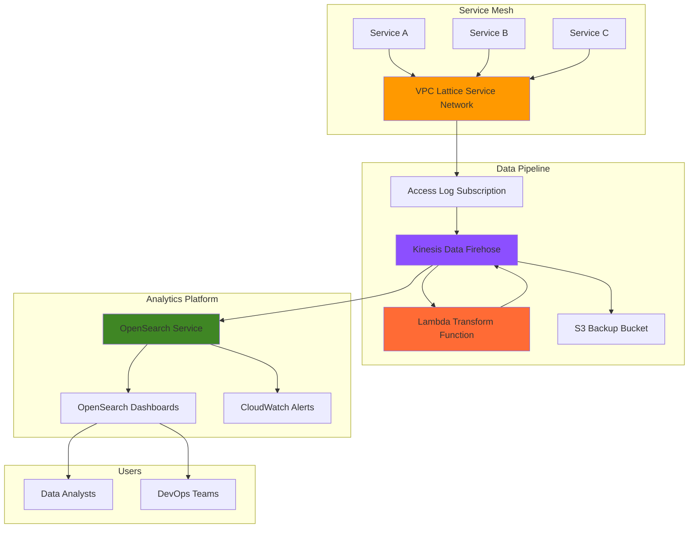

# Traffic Analytics with VPC Lattice and OpenSearch

## Problem

Organizations running microservices architectures struggle with comprehensive traffic analysis and security monitoring across their service mesh. Traditional logging solutions don't provide real-time insights into service communication patterns, making it difficult to detect anomalies, optimize performance, or troubleshoot issues quickly. Without centralized traffic analytics, teams lack visibility into request flows, authentication failures, and performance bottlenecks that can impact customer experience and operational efficiency.

## Solution

Build a comprehensive traffic analytics solution using VPC Lattice access logs streamed through Kinesis Data Firehose to OpenSearch Service. This architecture automatically captures detailed traffic information from your service mesh, processes and enriches the data through Lambda transformations, and provides real-time analytics dashboards for monitoring service communication patterns, security events, and performance metrics.

## Architecture Diagram



## Prerequisites

1. AWS account with VPC Lattice, OpenSearch, Kinesis, and Lambda permissions
2. AWS CLI v2 installed and configured (or use CloudShell)
3. Understanding of service mesh concepts and streaming data processing
4. Existing VPC Lattice service network with at least one service (or willingness to create demo services)
5. Estimated cost: $20-40 per day for OpenSearch domain, minimal costs for Kinesis and Lambda

> **Note**: This recipe follows AWS Well-Architected Framework principles for reliability and cost optimization. OpenSearch domains incur the highest costs, so consider using smaller instance types for testing.

## Preparation

```bash
# Set environment variables
export AWS_REGION=$(aws configure get region)
export AWS_ACCOUNT_ID=$(aws sts get-caller-identity \
    --query Account --output text)

# Generate unique identifiers for resources
RANDOM_SUFFIX=$(aws secretsmanager get-random-password \
    --exclude-punctuation --exclude-uppercase \
    --password-length 6 --require-each-included-type \
    --output text --query RandomPassword)

# Set resource names
export OPENSEARCH_DOMAIN_NAME="traffic-analytics-${RANDOM_SUFFIX}"
export FIREHOSE_DELIVERY_STREAM="vpc-lattice-stream-${RANDOM_SUFFIX}"
export LAMBDA_FUNCTION_NAME="traffic-transform-${RANDOM_SUFFIX}"
export S3_BACKUP_BUCKET="vpc-lattice-backup-${RANDOM_SUFFIX}"
export SERVICE_NETWORK_NAME="demo-network-${RANDOM_SUFFIX}"

# Create S3 bucket for backup and error records
aws s3 mb s3://${S3_BACKUP_BUCKET} --region ${AWS_REGION}

echo "✅ AWS environment configured with unique resource names"
```

## Steps

1. **Create OpenSearch Service Domain for Analytics**:

   OpenSearch Service provides a fully managed analytics platform with built-in visualization capabilities through OpenSearch Dashboards. This domain will serve as our central repository for traffic analytics, offering powerful search, aggregation, and real-time monitoring capabilities across your service mesh traffic patterns.

   ```bash
   # Create OpenSearch domain with appropriate sizing for traffic analytics
   aws opensearch create-domain \
       --domain-name ${OPENSEARCH_DOMAIN_NAME} \
       --engine-version "OpenSearch_2.11" \
       --cluster-config \
       InstanceType=t3.small.search,InstanceCount=1,DedicatedMasterEnabled=false \
       --ebs-options EBSEnabled=true,VolumeType=gp3,VolumeSize=20 \
       --access-policies '{
           "Version": "2012-10-17",
           "Statement": [
               {
                   "Effect": "Allow",
                   "Principal": {
                       "AWS": "*"
                   },
                   "Action": "es:*",
                   "Resource": "arn:aws:es:'${AWS_REGION}':'${AWS_ACCOUNT_ID}':domain/'${OPENSEARCH_DOMAIN_NAME}'/*"
               }
           ]
       }' \
       --domain-endpoint-options EnforceHTTPS=true \
       --node-to-node-encryption-options Enabled=true \
       --encryption-at-rest-options Enabled=true
   
   # Wait for domain to be available (this takes 10-15 minutes)
   echo "Creating OpenSearch domain... This will take 10-15 minutes"
   aws opensearch wait domain-available --domain-name ${OPENSEARCH_DOMAIN_NAME}
   
   # Get the domain endpoint
   OPENSEARCH_ENDPOINT=$(aws opensearch describe-domain \
       --domain-name ${OPENSEARCH_DOMAIN_NAME} \
       --query 'DomainStatus.Endpoint' --output text)
   
   echo "✅ OpenSearch domain created at: https://${OPENSEARCH_ENDPOINT}"
   ```

2. **Create Lambda Function for Data Transformation**:

   Lambda enables real-time data transformation and enrichment of VPC Lattice access logs before they're indexed in OpenSearch. This function parses log entries, adds contextual information, and formats data for optimal analytics performance, ensuring your traffic data is searchable and aggregated effectively.

   ```bash
   # Create Lambda execution role with required permissions
   aws iam create-role \
       --role-name vpc-lattice-transform-role-${RANDOM_SUFFIX} \
       --assume-role-policy-document '{
           "Version": "2012-10-17",
           "Statement": [
               {
                   "Effect": "Allow",
                   "Principal": {
                       "Service": "lambda.amazonaws.com"
                   },
                   "Action": "sts:AssumeRole"
               }
           ]
       }'
   
   # Attach basic Lambda execution policy
   aws iam attach-role-policy \
       --role-name vpc-lattice-transform-role-${RANDOM_SUFFIX} \
       --policy-arn arn:aws:iam::aws:policy/service-role/AWSLambdaBasicExecutionRole
   
   # Wait for IAM role to propagate
   sleep 10
   
   # Create Lambda function code for traffic log transformation
   cat > transform_function.py << 'EOF'
import json
import base64
import gzip
import datetime

def lambda_handler(event, context):
    output = []
    
    for record in event['records']:
        # Decode and decompress the data
        compressed_payload = base64.b64decode(record['data'])
        uncompressed_payload = gzip.decompress(compressed_payload)
        log_data = json.loads(uncompressed_payload)
        
        # Transform and enrich each log entry
        for log_entry in log_data.get('logEvents', []):
            try:
                # Parse the log message if it's JSON
                if log_entry['message'].startswith('{'):
                    parsed_log = json.loads(log_entry['message'])
                    
                    # Add timestamp and enrichment fields
                    parsed_log['@timestamp'] = datetime.datetime.fromtimestamp(
                        log_entry['timestamp'] / 1000
                    ).isoformat()
                    parsed_log['log_group'] = log_data.get('logGroup', '')
                    parsed_log['log_stream'] = log_data.get('logStream', '')
                    
                    # Add derived fields for analytics
                    if 'responseCode' in parsed_log:
                        parsed_log['response_class'] = str(parsed_log['responseCode'])[0] + 'xx'
                        parsed_log['is_error'] = parsed_log['responseCode'] >= 400
                    
                    if 'responseTimeMs' in parsed_log:
                        parsed_log['response_time_bucket'] = categorize_response_time(
                            parsed_log['responseTimeMs']
                        )
                    
                    output_record = {
                        'recordId': record['recordId'],
                        'result': 'Ok',
                        'data': base64.b64encode(
                            (json.dumps(parsed_log) + '\n').encode('utf-8')
                        ).decode('utf-8')
                    }
                else:
                    # If not JSON, pass through with minimal processing
                    enhanced_log = {
                        'message': log_entry['message'],
                        '@timestamp': datetime.datetime.fromtimestamp(
                            log_entry['timestamp'] / 1000
                        ).isoformat(),
                        'log_group': log_data.get('logGroup', ''),
                        'log_stream': log_data.get('logStream', '')
                    }
                    
                    output_record = {
                        'recordId': record['recordId'],
                        'result': 'Ok',
                        'data': base64.b64encode(
                            (json.dumps(enhanced_log) + '\n').encode('utf-8')
                        ).decode('utf-8')
                    }
                
                output.append(output_record)
                
            except Exception as e:
                # If processing fails, mark as processing failure
                output.append({
                    'recordId': record['recordId'],
                    'result': 'ProcessingFailed'
                })
    
    return {'records': output}

def categorize_response_time(response_time_ms):
    """Categorize response times for analytics"""
    if response_time_ms < 100:
        return 'fast'
    elif response_time_ms < 500:
        return 'medium'
    elif response_time_ms < 2000:
        return 'slow'
    else:
        return 'very_slow'
EOF
   
   # Package the Lambda function
   zip transform_function.zip transform_function.py
   
   # Create the Lambda function
   aws lambda create-function \
       --function-name ${LAMBDA_FUNCTION_NAME} \
       --runtime python3.12 \
       --role arn:aws:iam::${AWS_ACCOUNT_ID}:role/vpc-lattice-transform-role-${RANDOM_SUFFIX} \
       --handler transform_function.lambda_handler \
       --zip-file fileb://transform_function.zip \
       --timeout 60 \
       --memory-size 256 \
       --description "Transform VPC Lattice access logs for OpenSearch analytics"
   
   echo "✅ Lambda transformation function created"
   ```

3. **Create Kinesis Data Firehose Delivery Stream**:

   Kinesis Data Firehose provides a fully managed service for reliably loading streaming data into OpenSearch Service. The delivery stream handles buffering, compression, and error handling while automatically scaling to match your traffic volume, ensuring no data loss even during traffic spikes.

   ```bash
   # Create IAM role for Firehose with OpenSearch permissions
   aws iam create-role \
       --role-name firehose-opensearch-role-${RANDOM_SUFFIX} \
       --assume-role-policy-document '{
           "Version": "2012-10-17",
           "Statement": [
               {
                   "Effect": "Allow",
                   "Principal": {
                       "Service": "firehose.amazonaws.com"
                   },
                   "Action": "sts:AssumeRole"
               }
           ]
       }'
   
   # Create policy for Firehose to write to OpenSearch and S3
   aws iam put-role-policy \
       --role-name firehose-opensearch-role-${RANDOM_SUFFIX} \
       --policy-name FirehoseOpenSearchPolicy \
       --policy-document '{
           "Version": "2012-10-17",
           "Statement": [
               {
                   "Effect": "Allow",
                   "Action": [
                       "es:DescribeDomain",
                       "es:DescribeDomains",
                       "es:DescribeDomainConfig",
                       "es:ESHttpPost",
                       "es:ESHttpPut"
                   ],
                   "Resource": "arn:aws:es:'${AWS_REGION}':'${AWS_ACCOUNT_ID}':domain/'${OPENSEARCH_DOMAIN_NAME}'/*"
               },
               {
                   "Effect": "Allow",
                   "Action": [
                       "s3:AbortMultipartUpload",
                       "s3:GetBucketLocation",
                       "s3:GetObject",
                       "s3:ListBucket",
                       "s3:ListBucketMultipartUploads",
                       "s3:PutObject"
                   ],
                   "Resource": [
                       "arn:aws:s3:::'${S3_BACKUP_BUCKET}'",
                       "arn:aws:s3:::'${S3_BACKUP_BUCKET}'/*"
                   ]
               },
               {
                   "Effect": "Allow",
                   "Action": [
                       "lambda:InvokeFunction",
                       "lambda:GetFunctionConfiguration"
                   ],
                   "Resource": "arn:aws:lambda:'${AWS_REGION}':'${AWS_ACCOUNT_ID}':function:'${LAMBDA_FUNCTION_NAME}'"
               }
           ]
       }'
   
   # Wait for IAM role to propagate
   sleep 10
   
   # Create the Firehose delivery stream with OpenSearch destination
   aws firehose create-delivery-stream \
       --delivery-stream-name ${FIREHOSE_DELIVERY_STREAM} \
       --delivery-stream-type DirectPut \
       --amazon-opensearch-service-destination-configuration '{
           "RoleARN": "arn:aws:iam:'${AWS_ACCOUNT_ID}':role/firehose-opensearch-role-'${RANDOM_SUFFIX}'",
           "DomainARN": "arn:aws:es:'${AWS_REGION}':'${AWS_ACCOUNT_ID}':domain/'${OPENSEARCH_DOMAIN_NAME}'",
           "IndexName": "vpc-lattice-traffic",
           "S3Configuration": {
               "RoleARN": "arn:aws:iam:'${AWS_ACCOUNT_ID}':role/firehose-opensearch-role-'${RANDOM_SUFFIX}'",
               "BucketARN": "arn:aws:s3:::'${S3_BACKUP_BUCKET}'",
               "Prefix": "firehose-backup/",
               "BufferingHints": {
                   "SizeInMBs": 1,
                   "IntervalInSeconds": 60
               },
               "CompressionFormat": "GZIP"
           },
           "ProcessingConfiguration": {
               "Enabled": true,
               "Processors": [
                   {
                       "Type": "Lambda",
                       "Parameters": [
                           {
                               "ParameterName": "LambdaArn",
                               "ParameterValue": "arn:aws:lambda:'${AWS_REGION}':'${AWS_ACCOUNT_ID}':function:'${LAMBDA_FUNCTION_NAME}'"
                           }
                       ]
                   }
               ]
           },
           "CloudWatchLoggingOptions": {
               "Enabled": true,
               "LogGroupName": "/aws/kinesisfirehose/'${FIREHOSE_DELIVERY_STREAM}'"
           }
       }'
   
   echo "✅ Kinesis Data Firehose delivery stream created"
   ```

4. **Create VPC Lattice Service Network and Demo Services**:

   VPC Lattice provides application-level networking for microservices with built-in security, observability, and traffic management. Creating a demo service network allows us to generate realistic traffic patterns for our analytics solution while demonstrating how access logs capture detailed communication metadata.

   ```bash
   # Create VPC Lattice service network
   aws vpc-lattice create-service-network \
       --name ${SERVICE_NETWORK_NAME} \
       --auth-type AWS_IAM
   
   # Get service network details
   SERVICE_NETWORK_ARN=$(aws vpc-lattice list-service-networks \
       --query "items[?name=='${SERVICE_NETWORK_NAME}'].arn" \
       --output text)
   
   SERVICE_NETWORK_ID=$(aws vpc-lattice list-service-networks \
       --query "items[?name=='${SERVICE_NETWORK_NAME}'].id" \
       --output text)
   
   # Create a demo service for generating traffic
   aws vpc-lattice create-service \
       --name demo-service-${RANDOM_SUFFIX} \
       --auth-type AWS_IAM
   
   DEMO_SERVICE_ARN=$(aws vpc-lattice list-services \
       --query "items[?name=='demo-service-${RANDOM_SUFFIX}'].arn" \
       --output text)
   
   # Associate the service with the service network
   aws vpc-lattice create-service-network-service-association \
       --service-network-identifier ${SERVICE_NETWORK_ID} \
       --service-identifier ${DEMO_SERVICE_ARN}
   
   echo "✅ VPC Lattice service network and demo service created"
   echo "Service Network ARN: ${SERVICE_NETWORK_ARN}"
   ```

5. **Configure Access Log Subscription for Traffic Capture**:

   VPC Lattice access logs capture comprehensive traffic metadata including request/response details, authentication information, and performance metrics. Configuring the access log subscription to stream directly to Kinesis Data Firehose enables real-time processing and analysis of your service mesh communications.

   ```bash
   # Create access log subscription for the service network
   aws vpc-lattice create-access-log-subscription \
       --resource-identifier ${SERVICE_NETWORK_ARN} \
       --destination-arn arn:aws:firehose:${AWS_REGION}:${AWS_ACCOUNT_ID}:deliverystream/${FIREHOSE_DELIVERY_STREAM}
   
   # Get the access log subscription details
   ACCESS_LOG_SUBSCRIPTION_ARN=$(aws vpc-lattice list-access-log-subscriptions \
       --resource-identifier ${SERVICE_NETWORK_ARN} \
       --query 'items[0].arn' --output text)
   
   echo "✅ Access log subscription configured"
   echo "Subscription ARN: ${ACCESS_LOG_SUBSCRIPTION_ARN}"
   echo "Traffic logs will now stream to OpenSearch via Firehose"
   ```

6. **Create OpenSearch Index Template and Sample Dashboard**:

   OpenSearch index templates ensure consistent field mappings and optimal performance for traffic analytics queries. Creating a dedicated index template with appropriate field types enables efficient aggregations, time-series analysis, and real-time monitoring of your service mesh traffic patterns.

   ```bash
   # Wait for OpenSearch domain to be fully ready
   sleep 30
   
   # Create index template for VPC Lattice traffic logs
   curl -X PUT "https://${OPENSEARCH_ENDPOINT}/_index_template/vpc-lattice-template" \
       -H "Content-Type: application/json" \
       -d '{
           "index_patterns": ["vpc-lattice-traffic*"],
           "template": {
               "settings": {
                   "number_of_shards": 1,
                   "number_of_replicas": 0,
                   "refresh_interval": "5s"
               },
               "mappings": {
                   "properties": {
                       "@timestamp": { "type": "date" },
                       "sourceIpPort": { "type": "keyword" },
                       "destinationIpPort": { "type": "keyword" },
                       "requestMethod": { "type": "keyword" },
                       "requestPath": { "type": "keyword" },
                       "responseCode": { "type": "integer" },
                       "responseTimeMs": { "type": "integer" },
                       "userAgent": { 
                           "type": "text", 
                           "fields": {"keyword": {"type": "keyword"}} 
                       },
                       "serviceNetworkArn": { "type": "keyword" },
                       "targetGroupArn": { "type": "keyword" },
                       "response_class": { "type": "keyword" },
                       "is_error": { "type": "boolean" },
                       "response_time_bucket": { "type": "keyword" }
                   }
               }
           }
       }'
   
   # Create sample index pattern for immediate use
   curl -X PUT "https://${OPENSEARCH_ENDPOINT}/vpc-lattice-traffic-$(date +%Y.%m.%d)" \
       -H "Content-Type: application/json" \
       -d '{
           "settings": {
               "number_of_shards": 1,
               "number_of_replicas": 0
           }
       }'
   
   echo "✅ OpenSearch index template and initial index created"
   echo "OpenSearch Dashboards URL: https://${OPENSEARCH_ENDPOINT}/_dashboards"
   ```

## Validation & Testing

1. **Verify OpenSearch domain is accessible and healthy**:

   ```bash
   # Check OpenSearch cluster health
   curl -X GET "https://${OPENSEARCH_ENDPOINT}/_cluster/health" | jq '.'
   
   # Verify the index template was created
   curl -X GET "https://${OPENSEARCH_ENDPOINT}/_index_template/vpc-lattice-template" | \
       jq '.index_templates[0].name'
   ```

   Expected output: Cluster status should be "green" or "yellow", and template name should be "vpc-lattice-template"

2. **Test Kinesis Data Firehose delivery stream**:

   ```bash
   # Check Firehose delivery stream status
   aws firehose describe-delivery-stream \
       --delivery-stream-name ${FIREHOSE_DELIVERY_STREAM} \
       --query 'DeliveryStreamDescription.DeliveryStreamStatus'
   
   # Send test record to verify data flow
   echo '{"test_message": "VPC Lattice traffic analytics test", "timestamp": "'$(date -u +%Y-%m-%dT%H:%M:%SZ)'"}' | \
   aws firehose put-record \
       --delivery-stream-name ${FIREHOSE_DELIVERY_STREAM} \
       --record Data=blob://dev/stdin
   ```

   Expected output: Delivery stream status should be "ACTIVE"

3. **Verify Lambda function is processing data correctly**:

   ```bash
   # Check Lambda function configuration
   aws lambda get-function \
       --function-name ${LAMBDA_FUNCTION_NAME} \
       --query 'Configuration.State'
   
   # Check recent Lambda execution logs
   aws logs describe-log-groups \
       --log-group-name-prefix "/aws/lambda/${LAMBDA_FUNCTION_NAME}" \
       --query 'logGroups[0].logGroupName' --output text
   ```

   Expected output: Function state should be "Active"

4. **Test VPC Lattice access log generation**:

   ```bash
   # Verify access log subscription is active
   aws vpc-lattice get-access-log-subscription \
       --access-log-subscription-identifier ${ACCESS_LOG_SUBSCRIPTION_ARN} \
       --query 'destinationArn'
   
   # Generate some test traffic (if you have services configured)
   echo "Generate traffic to your VPC Lattice services to see logs in OpenSearch"
   echo "Monitor the OpenSearch index for incoming data:"
   echo "curl -X GET 'https://${OPENSEARCH_ENDPOINT}/vpc-lattice-traffic-*/_search?pretty'"
   ```

## Cleanup

1. **Remove access log subscription and VPC Lattice resources**:

   ```bash
   # Delete access log subscription
   aws vpc-lattice delete-access-log-subscription \
       --access-log-subscription-identifier ${ACCESS_LOG_SUBSCRIPTION_ARN}
   
   # Delete service network associations and services
   DEMO_SERVICE_ID=$(aws vpc-lattice list-services \
       --query "items[?name=='demo-service-${RANDOM_SUFFIX}'].id" \
       --output text)
   
   aws vpc-lattice delete-service \
       --service-identifier ${DEMO_SERVICE_ID}
   
   aws vpc-lattice delete-service-network \
       --service-network-identifier ${SERVICE_NETWORK_ID}
   
   echo "✅ VPC Lattice resources deleted"
   ```

2. **Delete Kinesis Data Firehose delivery stream**:

   ```bash
   # Delete the delivery stream
   aws firehose delete-delivery-stream \
       --delivery-stream-name ${FIREHOSE_DELIVERY_STREAM}
   
   echo "✅ Kinesis Data Firehose delivery stream deleted"
   ```

3. **Remove Lambda function and IAM roles**:

   ```bash
   # Delete Lambda function
   aws lambda delete-function \
       --function-name ${LAMBDA_FUNCTION_NAME}
   
   # Delete IAM roles and policies
   aws iam delete-role-policy \
       --role-name firehose-opensearch-role-${RANDOM_SUFFIX} \
       --policy-name FirehoseOpenSearchPolicy
   
   aws iam delete-role --role-name firehose-opensearch-role-${RANDOM_SUFFIX}
   aws iam detach-role-policy \
       --role-name vpc-lattice-transform-role-${RANDOM_SUFFIX} \
       --policy-arn arn:aws:iam::aws:policy/service-role/AWSLambdaBasicExecutionRole
   aws iam delete-role --role-name vpc-lattice-transform-role-${RANDOM_SUFFIX}
   
   # Clean up local files
   rm -f transform_function.py transform_function.zip
   
   echo "✅ Lambda function and IAM roles deleted"
   ```

4. **Delete OpenSearch domain and S3 bucket**:

   ```bash
   # Delete OpenSearch domain
   aws opensearch delete-domain \
       --domain-name ${OPENSEARCH_DOMAIN_NAME}
   
   # Empty and delete S3 bucket
   aws s3 rm s3://${S3_BACKUP_BUCKET} --recursive
   aws s3 rb s3://${S3_BACKUP_BUCKET}
   
   echo "✅ OpenSearch domain and S3 bucket deleted"
   echo "Note: OpenSearch domain deletion takes 10-15 minutes to complete"
   ```

## Discussion

This traffic analytics solution demonstrates the power of combining AWS managed services to create a comprehensive observability platform for service mesh architectures. VPC Lattice provides application-level networking with detailed access logging capabilities, capturing rich metadata about every request including source/destination information, authentication details, response codes, and timing metrics. This granular visibility is essential for understanding service communication patterns and identifying potential issues before they impact users.

The streaming data pipeline built with Kinesis Data Firehose offers several advantages over traditional batch processing approaches. Real-time data ingestion enables immediate detection of anomalies, authentication failures, or performance degradation. The Lambda transformation layer adds significant value by enriching raw log data with derived fields such as response time categorization and error classification, making analytics queries more efficient and insights more actionable. The automatic buffering and compression provided by Firehose ensures reliable data delivery even during traffic spikes while optimizing storage costs in both OpenSearch and the S3 backup location.

OpenSearch Service serves as an ideal analytics platform for this use case due to its powerful aggregation capabilities and real-time search performance. The service automatically handles index management, scaling, and high availability while providing OpenSearch Dashboards for visualization and alerting. The index template configuration ensures optimal field mappings for traffic analytics, enabling efficient time-series queries and statistical analysis. This setup supports various analytics scenarios including traffic volume monitoring, error rate tracking, performance analysis, and security audit workflows.

The architecture follows AWS Well-Architected Framework principles by implementing proper error handling through S3 backup storage, encryption at rest and in transit, and cost optimization through right-sizing of OpenSearch instances. For production deployments, consider implementing additional security measures such as VPC endpoints for service communication and fine-grained access controls using IAM policies and OpenSearch security features. The solution also incorporates operational excellence through automated deployment scripts and monitoring capabilities that provide visibility into system health and performance.

> **Tip**: Use OpenSearch index lifecycle management to automatically transition older traffic data to cheaper storage tiers, reducing long-term storage costs while maintaining query performance for recent data.

**Documentation Sources:**
- [VPC Lattice Access Logs Documentation](https://docs.aws.amazon.com/vpc-lattice/latest/ug/monitoring-access-logs.html)
- [Kinesis Data Firehose with OpenSearch Integration](https://docs.aws.amazon.com/opensearch-service/latest/developerguide/integrations-fh.html)
- [OpenSearch Service Data Streaming](https://docs.aws.amazon.com/opensearch-service/latest/developerguide/integrations-kinesis.html)
- [AWS Well-Architected Framework](https://docs.aws.amazon.com/wellarchitected/latest/framework/welcome.html)
- [Lambda Data Transformation for Analytics](https://docs.aws.amazon.com/firehose/latest/dev/data-transformation.html)

## Challenge

Extend this traffic analytics solution by implementing these enhancements:

1. **Advanced Security Monitoring**: Add AWS WAF integration to correlate VPC Lattice traffic with web application firewall events, creating comprehensive security dashboards that identify attack patterns and malicious traffic sources.

2. **Machine Learning Anomaly Detection**: Implement Amazon SageMaker integration to build ML models that automatically detect unusual traffic patterns, response time anomalies, and potential security threats based on historical service communication data.

3. **Multi-Region Traffic Correlation**: Extend the solution to aggregate traffic data from VPC Lattice service networks across multiple AWS regions, providing global visibility into distributed application performance and cross-region communication patterns.

4. **Cost Attribution Analytics**: Enhance the Lambda transformation function to calculate traffic-based cost allocation by parsing request/response sizes and associating them with service ownership tags, enabling accurate chargeback models for shared service platforms.

5. **Real-time Alerting and Remediation**: Integrate with Amazon EventBridge and AWS Systems Manager to automatically trigger remediation actions based on traffic analytics insights, such as scaling services during traffic spikes or isolating compromised endpoints.

## Infrastructure Code

*Infrastructure code will be generated after recipe approval.*