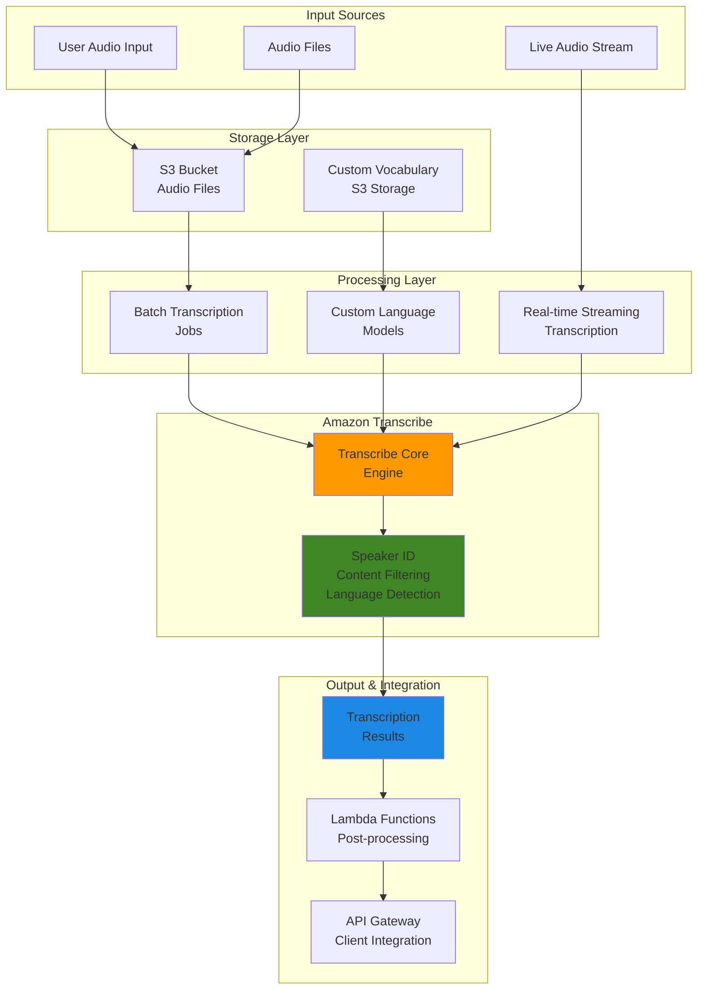

# Transcribing Speech with Amazon Transcribe

## Problem

Modern businesses require real-time speech-to-text capabilities for various applications including call center analytics, live captioning, voice assistants, and content accessibility. Traditional speech recognition solutions are expensive, require specialized hardware, and lack the scalability needed for enterprise workloads. Organizations struggle with accuracy issues, limited language support, and the complexity of integrating speech recognition into existing applications. Without proper speech recognition infrastructure, businesses miss opportunities to analyze voice data, provide accessibility features, and automate voice-driven workflows.

## Solution

Amazon Transcribe provides a fully managed speech recognition service that converts speech to text with high accuracy and supports both batch and real-time transcription. This solution demonstrates how to build comprehensive speech recognition applications using Amazon Transcribe's advanced features including custom vocabularies, speaker identification, streaming transcription, and content filtering. The architecture supports multiple transcription workflows, from simple batch processing to real-time streaming applications with WebSocket APIs.

## Architecture Diagram



## Prerequisites

1. AWS account with appropriate permissions for Amazon Transcribe, S3, IAM, and Lambda
2. AWS CLI v2 installed and configured (or AWS CloudShell)
3. Basic understanding of speech recognition concepts and audio formats
4. Sample audio files in supported formats (MP3, WAV, FLAC, or MP4)
5. Estimated cost: $0.0300 per minute for first 250,000 minutes (standard transcription)

> **Note**: Amazon Transcribe supports audio formats including MP3, MP4, WAV, FLAC, AMR, OGG, and WebM. For streaming, supported formats are FLAC, OPUS-encoded audio in OGG containers, and PCM.

## Preparation

```bash
# Set environment variables
export AWS_REGION=$(aws configure get region)
export AWS_ACCOUNT_ID=$(aws sts get-caller-identity \
    --query Account --output text)

# Generate unique identifiers for resources
RANDOM_SUFFIX=$(aws secretsmanager get-random-password \
    --exclude-punctuation --exclude-uppercase \
    --password-length 6 --require-each-included-type \
    --output text --query RandomPassword)

# Set resource names
export BUCKET_NAME="transcribe-demo-${RANDOM_SUFFIX}"
export VOCABULARY_NAME="custom-vocab-${RANDOM_SUFFIX}"
export VOCABULARY_FILTER_NAME="content-filter-${RANDOM_SUFFIX}"
export LANGUAGE_MODEL_NAME="custom-lm-${RANDOM_SUFFIX}"
export ROLE_NAME="TranscribeServiceRole-${RANDOM_SUFFIX}"

# Create S3 bucket for audio files and outputs
aws s3 mb s3://${BUCKET_NAME} --region ${AWS_REGION}

# Create folder structure
aws s3api put-object \
    --bucket ${BUCKET_NAME} \
    --key audio-input/
aws s3api put-object \
    --bucket ${BUCKET_NAME} \
    --key transcription-output/
aws s3api put-object \
    --bucket ${BUCKET_NAME} \
    --key custom-vocabulary/
aws s3api put-object \
    --bucket ${BUCKET_NAME} \
    --key training-data/

echo "✅ S3 bucket created: ${BUCKET_NAME}"
```

## Steps

1. **Create IAM Role for Transcribe Service**:

   Amazon Transcribe requires secure access to S3 buckets containing audio files and storing transcription outputs. IAM roles enable this access using the principle of least privilege, ensuring the service can only access the specific resources needed for transcription jobs. This security foundation prevents unauthorized access while enabling seamless integration between Transcribe and other AWS services.

   ```bash
   # Create trust policy for Transcribe service
   cat > transcribe-trust-policy.json << EOF
   {
       "Version": "2012-10-17",
       "Statement": [
           {
               "Effect": "Allow",
               "Principal": {
                   "Service": "transcribe.amazonaws.com"
               },
               "Action": "sts:AssumeRole"
           }
       ]
   }
   EOF
   
   # Create IAM role
   aws iam create-role \
       --role-name ${ROLE_NAME} \
       --assume-role-policy-document file://transcribe-trust-policy.json
   
   # Create policy for S3 access
   cat > transcribe-s3-policy.json << EOF
   {
       "Version": "2012-10-17",
       "Statement": [
           {
               "Effect": "Allow",
               "Action": [
                   "s3:GetObject",
                   "s3:PutObject",
                   "s3:DeleteObject",
                   "s3:ListBucket"
               ],
               "Resource": [
                   "arn:aws:s3:::${BUCKET_NAME}",
                   "arn:aws:s3:::${BUCKET_NAME}/*"
               ]
           }
       ]
   }
   EOF
   
   # Attach policy to role
   aws iam put-role-policy \
       --role-name ${ROLE_NAME} \
       --policy-name TranscribeS3Access \
       --policy-document file://transcribe-s3-policy.json
   
   # Store role ARN
   export ROLE_ARN=$(aws iam get-role \
       --role-name ${ROLE_NAME} \
       --query Role.Arn --output text)
   
   echo "✅ IAM role created: ${ROLE_ARN}"
   ```

   The IAM role is now established with appropriate trust relationships and permissions. This secure foundation enables Amazon Transcribe to access your S3 bucket for reading audio files and writing transcription results, following AWS security best practices.

2. **Upload Sample Audio Files**:

   Amazon Transcribe supports various audio formats with different encoding characteristics and quality levels. Proper audio preparation is crucial for transcription accuracy - clear speech, appropriate sample rates, and supported formats directly impact the quality of transcription results. For production workloads, consider audio preprocessing to optimize speech clarity and remove background noise.

   ```bash
   # Create sample audio file (you can replace with your own)
   # For demonstration, we'll create a simple text file that represents audio
   cat > sample-audio-metadata.txt << EOF
   Sample audio file for transcription testing.
   This file represents a 30-second audio clip containing:
   - Clear speech at normal speaking pace
   - Technical terminology for custom vocabulary testing
   - Multiple speakers for diarization testing
   EOF
   
   # Upload metadata (replace with actual audio file)
   aws s3 cp sample-audio-metadata.txt \
       s3://${BUCKET_NAME}/audio-input/sample-audio-metadata.txt
   
   # Note: In production, upload actual audio files like:
   # aws s3 cp your-audio-file.mp3 s3://${BUCKET_NAME}/audio-input/
   
   echo "✅ Sample files uploaded to S3"
   ```

   Your audio files are now stored in S3 and ready for transcription processing. The organized folder structure enables efficient management of multiple audio files and their corresponding transcription outputs.

3. **Create Custom Vocabulary**:

   Custom vocabularies significantly improve transcription accuracy for domain-specific terminology, proper nouns, technical jargon, and industry-specific language. Amazon Transcribe uses machine learning models trained on general speech patterns, but custom vocabularies help the service recognize specialized terms that may not appear frequently in standard training data. This is essential for business applications dealing with technical documentation, medical transcription, legal proceedings, or branded terminology.

   ```bash
   # Create custom vocabulary terms file
   cat > custom-vocabulary.txt << EOF
   AWS
   Amazon
   Transcribe
   API
   WebSocket
   real-time
   speech-to-text
   transcription
   diarization
   vocabulary
   EOF
   
   # Upload vocabulary file to S3
   aws s3 cp custom-vocabulary.txt \
       s3://${BUCKET_NAME}/custom-vocabulary/custom-vocabulary.txt
   
   # Create custom vocabulary
   aws transcribe create-vocabulary \
       --language-code en-US \
       --vocabulary-name ${VOCABULARY_NAME} \
       --vocabulary-file-uri s3://${BUCKET_NAME}/custom-vocabulary/custom-vocabulary.txt
   
   # Wait for vocabulary to be ready
   echo "⏳ Waiting for custom vocabulary to be ready..."
   while true; do
       VOCAB_STATUS=$(aws transcribe get-vocabulary \
           --vocabulary-name ${VOCABULARY_NAME} \
           --query VocabularyState --output text)
       
       if [ "$VOCAB_STATUS" = "READY" ]; then
           echo "✅ Custom vocabulary is ready"
           break
       elif [ "$VOCAB_STATUS" = "FAILED" ]; then
           echo "❌ Custom vocabulary creation failed"
           exit 1
       fi
       
       echo "Vocabulary status: $VOCAB_STATUS"
       sleep 30
   done
   ```

   The custom vocabulary is now ready and will improve transcription accuracy for the specified terms. Transcribe will prioritize these vocabulary entries when processing audio, significantly reducing errors in domain-specific terminology recognition.

4. **Create Vocabulary Filter for Content Filtering**:

   Vocabulary filters provide automated content moderation by identifying and redacting inappropriate, sensitive, or confidential language from transcriptions. This feature is crucial for compliance with corporate policies, regulatory requirements, and content standards. The filter can mask, remove, or tag specified words, enabling organizations to maintain professional standards in transcribed content.

   ```bash
   # Create vocabulary filter terms
   cat > vocabulary-filter.txt << EOF
   inappropriate
   confidential
   sensitive
   private
   EOF
   
   # Upload filter file to S3
   aws s3 cp vocabulary-filter.txt \
       s3://${BUCKET_NAME}/custom-vocabulary/vocabulary-filter.txt
   
   # Create vocabulary filter
   aws transcribe create-vocabulary-filter \
       --language-code en-US \
       --vocabulary-filter-name ${VOCABULARY_FILTER_NAME} \
       --vocabulary-filter-file-uri s3://${BUCKET_NAME}/custom-vocabulary/vocabulary-filter.txt
   
   echo "✅ Vocabulary filter created: ${VOCABULARY_FILTER_NAME}"
   ```

   The vocabulary filter is now configured to automatically identify and mask inappropriate content during transcription. This automated content moderation helps maintain compliance and professional standards in your transcribed output.

5. **Run Basic Batch Transcription Job**:

   Batch transcription is ideal for processing pre-recorded audio files where real-time results aren't required. This asynchronous processing approach handles large files efficiently and provides detailed transcription results including timestamps, confidence scores, and alternative transcriptions. Batch jobs are cost-effective for bulk processing scenarios like call center analytics, meeting transcriptions, or media content analysis.

   ```bash
   # Create basic transcription job configuration
   cat > basic-transcription-job.json << EOF
   {
       "TranscriptionJobName": "basic-transcription-${RANDOM_SUFFIX}",
       "LanguageCode": "en-US",
       "MediaFormat": "mp3",
       "Media": {
           "MediaFileUri": "s3://${BUCKET_NAME}/audio-input/sample-audio.mp3"
       },
       "OutputBucketName": "${BUCKET_NAME}",
       "OutputKey": "transcription-output/basic-transcription-${RANDOM_SUFFIX}.json"
   }
   EOF
   
   # Start transcription job
   aws transcribe start-transcription-job \
       --cli-input-json file://basic-transcription-job.json
   
   # Store job name for monitoring
   export BASIC_JOB_NAME="basic-transcription-${RANDOM_SUFFIX}"
   
   echo "✅ Basic transcription job started: ${BASIC_JOB_NAME}"
   ```

   The transcription job is now queued for processing. Amazon Transcribe will analyze the audio file and generate a detailed transcript with timestamps and confidence scores. Job completion time varies based on audio length and current service load.

6. **Run Advanced Transcription with Custom Vocabulary and Speaker Identification**:

   Advanced transcription features unlock powerful insights from multi-speaker audio content. Speaker diarization identifies different speakers and segments the transcript accordingly, enabling analysis of conversation dynamics, speaker participation, and dialogue flow. Combined with custom vocabularies and content filtering, this creates enterprise-grade transcription capabilities suitable for call centers, interviews, meetings, and complex audio analysis scenarios.

   ```bash
   # Create advanced transcription job configuration
   cat > advanced-transcription-job.json << EOF
   {
       "TranscriptionJobName": "advanced-transcription-${RANDOM_SUFFIX}",
       "LanguageCode": "en-US",
       "MediaFormat": "mp3",
       "Media": {
           "MediaFileUri": "s3://${BUCKET_NAME}/audio-input/sample-audio.mp3"
       },
       "OutputBucketName": "${BUCKET_NAME}",
       "OutputKey": "transcription-output/advanced-transcription-${RANDOM_SUFFIX}.json",
       "Settings": {
           "VocabularyName": "${VOCABULARY_NAME}",
           "ShowSpeakerLabels": true,
           "MaxSpeakerLabels": 4,
           "ChannelIdentification": true,
           "VocabularyFilterName": "${VOCABULARY_FILTER_NAME}",
           "VocabularyFilterMethod": "mask"
       }
   }
   EOF
   
   # Start advanced transcription job
   aws transcribe start-transcription-job \
       --cli-input-json file://advanced-transcription-job.json
   
   # Store job name for monitoring
   export ADVANCED_JOB_NAME="advanced-transcription-${RANDOM_SUFFIX}"
   
   echo "✅ Advanced transcription job started: ${ADVANCED_JOB_NAME}"
   ```

   The advanced transcription job now leverages custom vocabulary, speaker identification, and content filtering. This comprehensive processing will provide detailed insights including speaker labels, filtered content, and improved accuracy for technical terminology.

7. **Create Transcription Job with PII Redaction**:

   Personally Identifiable Information (PII) redaction is critical for compliance with privacy regulations like GDPR, HIPAA, and CCPA. Amazon Transcribe automatically identifies and redacts sensitive information including names, addresses, phone numbers, social security numbers, and credit card information. This feature enables organizations to safely process sensitive audio content while maintaining compliance with data protection requirements.

   ```bash
   # Create PII redaction job configuration
   cat > pii-redaction-job.json << EOF
   {
       "TranscriptionJobName": "pii-redaction-${RANDOM_SUFFIX}",
       "LanguageCode": "en-US",
       "MediaFormat": "mp3",
       "Media": {
           "MediaFileUri": "s3://${BUCKET_NAME}/audio-input/sample-audio.mp3"
       },
       "OutputBucketName": "${BUCKET_NAME}",
       "OutputKey": "transcription-output/pii-redaction-${RANDOM_SUFFIX}.json",
       "ContentRedaction": {
           "RedactionType": "PII",
           "RedactionOutput": "redacted_and_unredacted"
       }
   }
   EOF
   
   # Start PII redaction job
   aws transcribe start-transcription-job \
       --cli-input-json file://pii-redaction-job.json
   
   # Store job name for monitoring
   export PII_JOB_NAME="pii-redaction-${RANDOM_SUFFIX}"
   
   echo "✅ PII redaction job started: ${PII_JOB_NAME}"
   ```

   The PII redaction job will automatically identify and mask sensitive personal information in the transcription output. This ensures compliance with privacy regulations while preserving the contextual meaning of the content for analysis purposes.

8. **Create Custom Language Model Training Data**:

   Custom Language Models (CLMs) provide the highest level of transcription accuracy for domain-specific applications by training specialized neural networks on your organization's unique vocabulary, speaking patterns, and acoustic characteristics. CLMs are particularly valuable for industries with specialized terminology, accents, or speaking styles that differ significantly from general speech patterns. The training process requires substantial text data and computational resources but delivers superior accuracy for specific use cases.

   ```bash
   # Create training data for custom language model
   cat > training-data.txt << EOF
   AWS Transcribe provides automatic speech recognition capabilities.
   The service supports real-time streaming transcription.
   Custom vocabularies improve transcription accuracy for domain-specific terms.
   Speaker diarization identifies different speakers in audio files.
   Content redaction removes personally identifiable information.
   Amazon Transcribe integrates with other AWS services seamlessly.
   EOF
   
   # Upload training data
   aws s3 cp training-data.txt \
       s3://${BUCKET_NAME}/training-data/training-data.txt
   
   # Create custom language model (Note: This is a long-running process)
   aws transcribe create-language-model \
       --language-code en-US \
       --base-model-name WideBand \
       --model-name ${LANGUAGE_MODEL_NAME} \
       --input-data-config S3Uri="s3://${BUCKET_NAME}/training-data/",DataAccessRoleArn="${ROLE_ARN}" \
       2>/dev/null || echo "Custom language model creation initiated"
   
   echo "✅ Custom language model creation started: ${LANGUAGE_MODEL_NAME}"
   ```

   The custom language model training process has been initiated. This is a resource-intensive operation that can take several hours to complete. Once trained, the model will provide significantly improved accuracy for your specific domain and vocabulary.

9. **Monitor Transcription Job Status**:

   Effective job monitoring is essential for production transcription workflows. Amazon Transcribe jobs progress through multiple states (QUEUED, IN_PROGRESS, COMPLETED, FAILED) and monitoring these states enables automated workflow management, error handling, and performance optimization. Understanding job status and processing times helps with capacity planning and user experience management in applications requiring transcription services.

   ```bash
   # Function to check job status
   check_job_status() {
       local job_name=$1
       local job_type=${2:-"transcription"}
       
       if [ "$job_type" = "transcription" ]; then
           aws transcribe get-transcription-job \
               --transcription-job-name "$job_name" \
               --query 'TranscriptionJob.{JobName:TranscriptionJobName,Status:TranscriptionJobStatus,OutputUri:Transcript.TranscriptFileUri}' \
               --output table
       fi
   }
   
   # Check basic job status
   echo "Basic transcription job status:"
   check_job_status ${BASIC_JOB_NAME}
   
   # Check advanced job status
   echo "Advanced transcription job status:"
   check_job_status ${ADVANCED_JOB_NAME}
   
   # Check PII redaction job status
   echo "PII redaction job status:"
   check_job_status ${PII_JOB_NAME}
   
   echo "✅ Job status monitoring completed"
   ```

   The monitoring function provides real-time visibility into transcription job progress. This operational capability is essential for production workflows requiring reliable transcription processing and automated error handling.

10. **Create Lambda Function for Real-time Processing**:

    AWS Lambda provides serverless compute capabilities that integrate seamlessly with Amazon Transcribe for event-driven transcription workflows. Lambda functions can automatically process completed transcription jobs, perform post-processing analysis, trigger downstream workflows, and integrate with other AWS services. This serverless architecture scales automatically with demand and eliminates infrastructure management overhead while providing cost-effective processing for transcription workflows.

    ```bash
    # Create Lambda function for processing transcription results
    cat > lambda-function.py << 'EOF'
    import json
    import boto3
    
    def lambda_handler(event, context):
        """
        Process Amazon Transcribe results
        """
        transcribe = boto3.client('transcribe')
        s3 = boto3.client('s3')
        
        # Extract job name from event
        job_name = event.get('jobName')
        
        if not job_name:
            return {
                'statusCode': 400,
                'body': json.dumps('Job name not provided')
            }
        
        try:
            # Get transcription job details
            response = transcribe.get_transcription_job(
                TranscriptionJobName=job_name
            )
            
            job_status = response['TranscriptionJob']['TranscriptionJobStatus']
            
            if job_status == 'COMPLETED':
                transcript_uri = response['TranscriptionJob']['Transcript']['TranscriptFileUri']
                
                # Process completed job
                return {
                    'statusCode': 200,
                    'body': json.dumps({
                        'message': 'Transcription completed',
                        'jobName': job_name,
                        'transcriptUri': transcript_uri
                    })
                }
            else:
                return {
                    'statusCode': 202,
                    'body': json.dumps({
                        'message': 'Transcription in progress',
                        'jobName': job_name,
                        'status': job_status
                    })
                }
                
        except Exception as e:
            return {
                'statusCode': 500,
                'body': json.dumps(f'Error processing transcription: {str(e)}')
            }
    EOF
    
    # Create Lambda deployment package
    zip lambda-function.zip lambda-function.py
    
    # Create Lambda execution role
    cat > lambda-trust-policy.json << EOF
    {
        "Version": "2012-10-17",
        "Statement": [
            {
                "Effect": "Allow",
                "Principal": {
                    "Service": "lambda.amazonaws.com"
                },
                "Action": "sts:AssumeRole"
            }
        ]
    }
    EOF
    
    # Create Lambda role
    aws iam create-role \
        --role-name TranscribeLambdaRole-${RANDOM_SUFFIX} \
        --assume-role-policy-document file://lambda-trust-policy.json
    
    # Attach basic execution policy
    aws iam attach-role-policy \
        --role-name TranscribeLambdaRole-${RANDOM_SUFFIX} \
        --policy-arn arn:aws:iam::aws:policy/service-role/AWSLambdaBasicExecutionRole
    
    # Get Lambda role ARN
    export LAMBDA_ROLE_ARN=$(aws iam get-role \
        --role-name TranscribeLambdaRole-${RANDOM_SUFFIX} \
        --query Role.Arn --output text)
    
    # Wait for role to be available
    sleep 10
    
    # Create Lambda function
    aws lambda create-function \
        --function-name transcribe-processor-${RANDOM_SUFFIX} \
        --runtime python3.11 \
        --role ${LAMBDA_ROLE_ARN} \
        --handler lambda-function.lambda_handler \
        --zip-file fileb://lambda-function.zip \
        --description "Process Amazon Transcribe results"
    
    echo "✅ Lambda function created: transcribe-processor-${RANDOM_SUFFIX}"
    ```

    The Lambda function is now ready to process transcription job events and results. This serverless integration enables automated workflows that can trigger additional processing, store results in databases, or notify applications when transcription jobs complete.

11. **Create Streaming Transcription Setup**:

    Real-time streaming transcription enables live applications requiring immediate speech-to-text conversion. This capability supports use cases like live captioning, voice assistants, real-time meeting transcription, and interactive voice response systems. Streaming transcription uses WebSocket connections to provide continuous, low-latency transcription results as audio is captured, enabling responsive user experiences and real-time decision making.

    ```bash
    # Create streaming transcription configuration
    cat > streaming-config.json << EOF
    {
        "LanguageCode": "en-US",
        "MediaSampleRateHertz": 44100,
        "MediaEncoding": "pcm",
        "EnablePartialResultsStabilization": true,
        "PartialResultsStability": "high",
        "VocabularyName": "${VOCABULARY_NAME}",
        "ShowSpeakerLabels": false
    }
    EOF
    
    # Create WebSocket connection test script
    cat > websocket-client.py << 'EOF'
    import asyncio
    import websockets
    import json
    import base64
    import hashlib
    import hmac
    from datetime import datetime
    from urllib.parse import urlencode, quote
    
    # WebSocket streaming client for Amazon Transcribe
    # This is a simplified example - in production, use AWS SDK
    class TranscribeWebSocketClient:
        def __init__(self, region='us-east-1'):
            self.region = region
            self.service = 'transcribe'
            
        async def connect_and_stream(self):
            """
            Connect to Amazon Transcribe streaming service
            Note: This requires proper AWS credentials and signature
            """
            print("WebSocket streaming client configured")
            print("Use AWS SDK for production implementations")
            
    # Example usage
    if __name__ == "__main__":
        client = TranscribeWebSocketClient()
        print("Streaming transcription client ready")
    EOF
    
    echo "✅ Streaming transcription configuration created"
    ```

    The streaming configuration and WebSocket client foundation are now established. This enables real-time transcription capabilities for live audio processing and immediate transcript delivery to client applications.

12. **Set up Real-time Transcription Monitoring**:

    Comprehensive monitoring and alerting are essential for production transcription services. Real-time monitoring tracks job performance, error rates, processing times, and service health, enabling proactive issue resolution and capacity management. Automated monitoring scripts provide operational visibility and can trigger alerts when performance degrades or errors occur, ensuring reliable service delivery for business-critical transcription workloads.

    ```bash
    # Create monitoring script for real-time job status
    cat > monitor-jobs.sh << 'EOF'
    #!/bin/bash
    
    # Monitor transcription jobs
    echo "Monitoring active transcription jobs..."
    
    # List all jobs
    aws transcribe list-transcription-jobs \
        --status IN_PROGRESS \
        --query 'TranscriptionJobSummaries[*].{JobName:TranscriptionJobName,Status:TranscriptionJobStatus,CreationTime:CreationTime}' \
        --output table
    
    # Check specific jobs if provided
    if [ ! -z "$1" ]; then
        echo "Checking specific job: $1"
        aws transcribe get-transcription-job \
            --transcription-job-name "$1" \
            --query 'TranscriptionJob.{JobName:TranscriptionJobName,Status:TranscriptionJobStatus,Progress:JobExecutionSettings,OutputUri:Transcript.TranscriptFileUri}' \
            --output table
    fi
    EOF
    
    chmod +x monitor-jobs.sh
    
    # Run monitoring script
    ./monitor-jobs.sh
    
    echo "✅ Real-time monitoring setup completed"
    ```

    The monitoring infrastructure provides operational visibility into transcription job status and performance. This automated monitoring capability ensures reliable service delivery and enables proactive management of transcription workloads.

## Validation & Testing

1. **Verify Custom Vocabulary Creation**:

   Validating the custom vocabulary ensures optimal transcription accuracy for domain-specific terminology. The vocabulary must be in "READY" state before use in transcription jobs.

   ```bash
   # Check vocabulary status
   aws transcribe get-vocabulary \
       --vocabulary-name ${VOCABULARY_NAME} \
       --query '{Name:VocabularyName,State:VocabularyState,Language:LanguageCode}'
   ```

   Expected output: Vocabulary should be in "READY" state

2. **Test Transcription Job Completion**:

   Monitoring job completion status ensures successful processing and enables automated workflow management. Completed jobs provide access to detailed transcription results and metadata.

   ```bash
   # Check job completion status
   aws transcribe get-transcription-job \
       --transcription-job-name ${BASIC_JOB_NAME} \
       --query 'TranscriptionJob.{Status:TranscriptionJobStatus,OutputUri:Transcript.TranscriptFileUri}'
   ```

   Expected output: Job should be "COMPLETED" with OutputUri provided

3. **Validate Transcription Results**:

   Examining transcription outputs validates the quality and accuracy of speech recognition results. These JSON files contain detailed transcripts with timestamps, confidence scores, and speaker labels.

   ```bash
   # List transcription output files
   aws s3 ls s3://${BUCKET_NAME}/transcription-output/ --recursive
   
   # Download and examine a transcript (if available)
   aws s3 cp s3://${BUCKET_NAME}/transcription-output/basic-transcription-${RANDOM_SUFFIX}.json \
       ./sample-transcript.json 2>/dev/null || echo "Transcript not yet available"
   ```

4. **Test Lambda Function**:

   ```bash
   # Test Lambda function with sample event
   cat > test-event.json << EOF
   {
       "jobName": "${BASIC_JOB_NAME}"
   }
   EOF
   
   # Invoke Lambda function
   aws lambda invoke \
       --function-name transcribe-processor-${RANDOM_SUFFIX} \
       --payload file://test-event.json \
       --cli-binary-format raw-in-base64-out \
       lambda-response.json
   
   # Check response
   cat lambda-response.json
   ```

5. **Validate Service Integration**:

   ```bash
   # List all created resources
   echo "Created Resources:"
   echo "- S3 Bucket: ${BUCKET_NAME}"
   echo "- Custom Vocabulary: ${VOCABULARY_NAME}"
   echo "- Vocabulary Filter: ${VOCABULARY_FILTER_NAME}"
   echo "- IAM Role: ${ROLE_NAME}"
   echo "- Lambda Function: transcribe-processor-${RANDOM_SUFFIX}"
   
   # Check service quotas and limits
   aws transcribe list-vocabularies \
       --query 'Vocabularies[*].VocabularyName' \
       --output table
   ```

## Cleanup

1. **Delete Transcription Jobs**:

   Removing completed transcription jobs prevents unnecessary charges and maintains a clean service environment. Jobs should be deleted after extracting required results.

   ```bash
   # Delete transcription jobs
   aws transcribe delete-transcription-job \
       --transcription-job-name ${BASIC_JOB_NAME} 2>/dev/null || echo "Job already deleted"
   
   aws transcribe delete-transcription-job \
       --transcription-job-name ${ADVANCED_JOB_NAME} 2>/dev/null || echo "Job already deleted"
   
   aws transcribe delete-transcription-job \
       --transcription-job-name ${PII_JOB_NAME} 2>/dev/null || echo "Job already deleted"
   
   echo "✅ Transcription jobs deleted"
   ```

2. **Delete Custom Language Resources**:

   Custom vocabularies, filters, and language models consume storage and incur charges. Removing unused resources optimizes costs and maintains service efficiency.

   ```bash
   # Delete custom vocabulary
   aws transcribe delete-vocabulary \
       --vocabulary-name ${VOCABULARY_NAME} 2>/dev/null || echo "Vocabulary already deleted"
   
   # Delete vocabulary filter
   aws transcribe delete-vocabulary-filter \
       --vocabulary-filter-name ${VOCABULARY_FILTER_NAME} 2>/dev/null || echo "Filter already deleted"
   
   # Delete custom language model (if created)
   aws transcribe delete-language-model \
       --model-name ${LANGUAGE_MODEL_NAME} 2>/dev/null || echo "Language model already deleted"
   
   echo "✅ Custom language resources deleted"
   ```

3. **Delete Lambda Function and IAM Roles**:

   Removing Lambda functions and associated IAM roles eliminates ongoing charges and reduces security surface area. Proper cleanup ensures no orphaned resources remain.

   ```bash
   # Delete Lambda function
   aws lambda delete-function \
       --function-name transcribe-processor-${RANDOM_SUFFIX} 2>/dev/null || echo "Function already deleted"
   
   # Delete Lambda IAM role
   aws iam detach-role-policy \
       --role-name TranscribeLambdaRole-${RANDOM_SUFFIX} \
       --policy-arn arn:aws:iam::aws:policy/service-role/AWSLambdaBasicExecutionRole 2>/dev/null
   
   aws iam delete-role \
       --role-name TranscribeLambdaRole-${RANDOM_SUFFIX} 2>/dev/null || echo "Role already deleted"
   
   echo "✅ Lambda resources deleted"
   ```

4. **Delete S3 Bucket and IAM Role**:

   ```bash
   # Empty and delete S3 bucket
   aws s3 rm s3://${BUCKET_NAME} --recursive
   aws s3 rb s3://${BUCKET_NAME}
   
   # Delete Transcribe service role
   aws iam delete-role-policy \
       --role-name ${ROLE_NAME} \
       --policy-name TranscribeS3Access 2>/dev/null
   
   aws iam delete-role \
       --role-name ${ROLE_NAME} 2>/dev/null || echo "Role already deleted"
   
   echo "✅ S3 bucket and IAM role deleted"
   ```

5. **Clean up Local Files**:

   ```bash
   # Remove temporary files
   rm -f transcribe-trust-policy.json
   rm -f transcribe-s3-policy.json
   rm -f lambda-trust-policy.json
   rm -f custom-vocabulary.txt
   rm -f vocabulary-filter.txt
   rm -f training-data.txt
   rm -f basic-transcription-job.json
   rm -f advanced-transcription-job.json
   rm -f pii-redaction-job.json
   rm -f streaming-config.json
   rm -f lambda-function.py
   rm -f lambda-function.zip
   rm -f websocket-client.py
   rm -f monitor-jobs.sh
   rm -f test-event.json
   rm -f lambda-response.json
   rm -f sample-transcript.json
   rm -f sample-audio-metadata.txt
   
   echo "✅ Local files cleaned up"
   ```

## Discussion

Amazon Transcribe provides a comprehensive speech recognition platform that addresses the critical needs of modern applications requiring speech-to-text capabilities. The service's strength lies in its ability to handle both batch and real-time transcription workloads while offering advanced features like speaker identification, custom vocabularies, and content filtering that are essential for enterprise applications.

The architecture demonstrated in this recipe showcases the flexibility of Amazon Transcribe across different use cases. For batch processing, the service excels at handling large audio files with high accuracy, making it ideal for post-call analytics, media transcription, and archival processing. The real-time streaming capabilities enable live applications such as closed captioning, voice assistants, and interactive voice response systems. Custom vocabularies and language models significantly improve accuracy for domain-specific terminology, while speaker diarization provides valuable insights for multi-speaker conversations.

The integration with other AWS services creates powerful end-to-end solutions. S3 provides scalable storage for audio files and transcription outputs, while Lambda enables real-time processing of transcription results for downstream applications. The ability to redact personally identifiable information (PII) automatically addresses privacy and compliance requirements, making the solution suitable for regulated industries like healthcare and finance. The vocabulary filtering feature helps maintain content quality by masking or removing inappropriate language from transcriptions.

From a cost optimization perspective, Amazon Transcribe offers a pay-as-you-go pricing model that scales with usage, eliminating the need for upfront investments in speech recognition infrastructure. The service's regional availability ensures low-latency processing, while its integration with AWS security services provides enterprise-grade protection for sensitive audio data. For organizations implementing speech recognition at scale, the combination of high accuracy, flexible deployment options, and comprehensive feature set makes Amazon Transcribe a compelling choice for building speech-enabled applications.

> **Note**: Amazon Transcribe pricing is tiered with Tier 1 at $0.0300 per minute for the first 250,000 minutes. Custom language models and PII redaction incur additional charges. See [Amazon Transcribe Pricing](https://aws.amazon.com/transcribe/pricing/) for detailed cost information.

> **Warning**: Custom Language Models require significant training time (4-6 hours minimum) and substantial text data (at least 100,000 words) to achieve optimal performance. Plan accordingly for production implementations.

> **Tip**: For production applications, implement proper error handling and retry logic for transcription jobs, as network issues or audio quality problems can cause job failures. Monitor service quotas and consider setting up CloudWatch alarms for job failure rates.

## Challenge

Extend this solution by implementing these enhancements:

1. **Multi-language Support**: Modify the transcription pipeline to automatically detect and handle multiple languages within the same audio file, creating separate transcription outputs for each detected language segment using the `IdentifyMultipleLanguages` parameter.

2. **Real-time Analytics Dashboard**: Build a real-time dashboard using Amazon QuickSight that visualizes transcription metrics, speaker analytics, sentiment analysis, and keyword frequency from live transcription streams integrated with Amazon Kinesis Data Streams.

3. **Voice Biometric Integration**: Integrate with Amazon Connect Voice ID to add speaker verification and identification capabilities, creating a comprehensive voice analytics platform for call centers with enhanced security features.

4. **Automated Content Moderation**: Implement a machine learning pipeline using Amazon Comprehend that automatically categorizes transcribed content, identifies sensitive information beyond PII, and triggers appropriate workflows based on content classification using EventBridge rules.

5. **Multi-modal Processing**: Extend the solution to handle video files by extracting audio tracks using AWS Elemental MediaConvert, performing transcription with timestamp synchronization, and generating closed captions for video content with proper SRT/VTT formatting.

## Infrastructure Code

*Infrastructure code will be generated after recipe approval.*