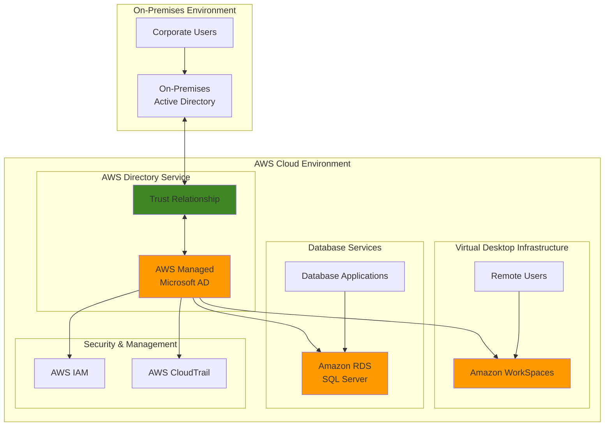

# Unified Identity Management System with AWS Directory Service

## Problem

Organizations with distributed workforces face significant challenges managing user identities across on-premises and cloud environments, leading to security gaps, administrative overhead, and poor user experience. Traditional identity management solutions require complex federation setups, multiple credential sets, and lack seamless integration with cloud services like virtual desktops and managed databases. Without centralized identity management, IT teams struggle to enforce consistent security policies, users experience authentication friction, and organizations face increased compliance risks.

## Solution

AWS Directory Service provides a fully managed Microsoft Active Directory solution that bridges on-premises and cloud identity management through trust relationships and seamless AWS service integration. This approach establishes AWS Managed Microsoft AD as the central identity provider for cloud workloads while maintaining trust relationships with existing on-premises Active Directory, enabling single sign-on for WorkSpaces virtual desktops and Windows Authentication for RDS SQL Server databases. The solution provides centralized user management, consistent security policies, and simplified authentication across hybrid environments.

## Architecture Diagram



## Prerequisites

1. AWS account with appropriate permissions for Directory Service, WorkSpaces, and RDS
2. AWS CLI installed and configured (version 2.0 or later)
3. On-premises Active Directory environment with domain administrator access (optional for trust setup)
4. VPC with at least two subnets in different Availability Zones
5. Network connectivity between on-premises and AWS (VPN or Direct Connect) for trust relationships
6. Knowledge of Active Directory concepts and Windows networking
7. Estimated cost: $300-400/month for AWS Managed Microsoft AD Standard edition, WorkSpaces, and RDS instance

> **Note**: AWS Managed Microsoft AD Standard edition costs approximately $146/month ($0.20/hour per domain controller × 2 controllers × 744 hours). Enterprise edition costs $292/month. Additional costs include WorkSpaces usage and RDS instance charges.

## Preparation

```bash
# Set environment variables
export AWS_REGION=$(aws configure get region)
export AWS_ACCOUNT_ID=$(aws sts get-caller-identity \
    --query Account --output text)

# Generate unique identifiers for resources
RANDOM_SUFFIX=$(aws secretsmanager get-random-password \
    --exclude-punctuation --exclude-uppercase \
    --password-length 6 --require-each-included-type \
    --output text --query RandomPassword)

# Set resource names
export DIRECTORY_NAME="corp-hybrid-ad-${RANDOM_SUFFIX}"
export VPC_NAME="hybrid-identity-vpc-${RANDOM_SUFFIX}"
export RDS_INSTANCE_ID="hybrid-sql-${RANDOM_SUFFIX}"

# Create VPC for directory services
aws ec2 create-vpc \
    --cidr-block 10.0.0.0/16 \
    --tag-specifications \
    'ResourceType=vpc,Tags=[{Key=Name,Value='${VPC_NAME}'}]'

# Get VPC ID
export VPC_ID=$(aws ec2 describe-vpcs \
    --filters "Name=tag:Name,Values=${VPC_NAME}" \
    --query 'Vpcs[0].VpcId' --output text)

# Create internet gateway and attach to VPC
aws ec2 create-internet-gateway \
    --tag-specifications \
    'ResourceType=internet-gateway,Tags=[{Key=Name,Value=igw-'${VPC_NAME}'}]'

export IGW_ID=$(aws ec2 describe-internet-gateways \
    --filters "Name=tag:Name,Values=igw-${VPC_NAME}" \
    --query 'InternetGateways[0].InternetGatewayId' --output text)

aws ec2 attach-internet-gateway \
    --internet-gateway-id ${IGW_ID} \
    --vpc-id ${VPC_ID}

# Create subnets in different AZs
aws ec2 create-subnet \
    --vpc-id ${VPC_ID} \
    --cidr-block 10.0.1.0/24 \
    --availability-zone ${AWS_REGION}a \
    --tag-specifications \
    'ResourceType=subnet,Tags=[{Key=Name,Value=directory-subnet-1}]'

aws ec2 create-subnet \
    --vpc-id ${VPC_ID} \
    --cidr-block 10.0.2.0/24 \
    --availability-zone ${AWS_REGION}b \
    --tag-specifications \
    'ResourceType=subnet,Tags=[{Key=Name,Value=directory-subnet-2}]'

# Get subnet IDs
export SUBNET_ID_1=$(aws ec2 describe-subnets \
    --filters "Name=tag:Name,Values=directory-subnet-1" \
    --query 'Subnets[0].SubnetId' --output text)

export SUBNET_ID_2=$(aws ec2 describe-subnets \
    --filters "Name=tag:Name,Values=directory-subnet-2" \
    --query 'Subnets[0].SubnetId' --output text)

# Create route table and add route to internet gateway
aws ec2 create-route-table \
    --vpc-id ${VPC_ID} \
    --tag-specifications \
    'ResourceType=route-table,Tags=[{Key=Name,Value=rt-'${VPC_NAME}'}]'

export RT_ID=$(aws ec2 describe-route-tables \
    --filters "Name=tag:Name,Values=rt-${VPC_NAME}" \
    --query 'RouteTables[0].RouteTableId' --output text)

aws ec2 create-route \
    --route-table-id ${RT_ID} \
    --destination-cidr-block 0.0.0.0/0 \
    --gateway-id ${IGW_ID}

# Associate subnets with route table
aws ec2 associate-route-table \
    --subnet-id ${SUBNET_ID_1} \
    --route-table-id ${RT_ID}

aws ec2 associate-route-table \
    --subnet-id ${SUBNET_ID_2} \
    --route-table-id ${RT_ID}

echo "✅ AWS environment prepared with VPC: ${VPC_ID}"
echo "✅ Subnets created: ${SUBNET_ID_1}, ${SUBNET_ID_2}"
```

## Steps

1. **Create AWS Managed Microsoft AD Directory**:

   AWS Managed Microsoft AD provides a fully managed Active Directory service that operates as a standalone directory or can establish trust relationships with on-premises Active Directory. This service creates two domain controllers in different Availability Zones for high availability and includes automatic patching, monitoring, and backup capabilities. The managed directory supports standard Active Directory features including Group Policy, Kerberos authentication, and LDAP queries while eliminating the operational overhead of managing domain controllers.

   ```bash
   # Create AWS Managed Microsoft AD
   aws ds create-microsoft-ad \
       --name ${DIRECTORY_NAME}.corp.local \
       --password 'TempPassword123!' \
       --description "Hybrid Identity Management Directory" \
       --vpc-settings VpcId=${VPC_ID},SubnetIds=${SUBNET_ID_1},${SUBNET_ID_2} \
       --edition Standard \
       --tags Key=Purpose,Value=HybridIdentity
   
   # Get directory ID
   export DIRECTORY_ID=$(aws ds describe-directories \
       --query 'DirectoryDescriptions[?Name==`'${DIRECTORY_NAME}'.corp.local`].DirectoryId' \
       --output text)
   
   # Wait for directory to become active (this can take 15-20 minutes)
   echo "⏳ Waiting for directory to become active (this may take 15-20 minutes)..."
   aws ds wait directory-active --directory-id ${DIRECTORY_ID}
   
   echo "✅ AWS Managed Microsoft AD created: ${DIRECTORY_ID}"
   ```

   The directory is now operational with domain controllers managing authentication and authorization services. This establishes the foundation for hybrid identity management with enterprise-grade security features and automatic maintenance.

2. **Configure Directory Security Groups and Network Access**:

   Directory Service automatically creates security groups to protect domain controllers while allowing necessary Active Directory communication. These security groups must be properly configured to enable secure communication between AWS services and on-premises resources while maintaining the principle of least privilege access.

   ```bash
   # Get directory security group ID
   export DIRECTORY_SG_ID=$(aws ds describe-directories \
       --directory-ids ${DIRECTORY_ID} \
       --query 'DirectoryDescriptions[0].VpcSettings.SecurityGroupId' \
       --output text)
   
   # Create security group for WorkSpaces and RDS
   aws ec2 create-security-group \
       --group-name workspaces-rds-sg-${RANDOM_SUFFIX} \
       --description "Security group for WorkSpaces and RDS" \
       --vpc-id ${VPC_ID} \
       --tag-specifications \
       'ResourceType=security-group,Tags=[{Key=Name,Value=workspaces-rds-sg}]'
   
   export WORKSPACES_SG_ID=$(aws ec2 describe-security-groups \
       --filters "Name=group-name,Values=workspaces-rds-sg-${RANDOM_SUFFIX}" \
       --query 'SecurityGroups[0].GroupId' --output text)
   
   # Allow WorkSpaces and RDS to communicate with directory
   aws ec2 authorize-security-group-ingress \
       --group-id ${DIRECTORY_SG_ID} \
       --protocol tcp \
       --port 445 \
       --source-group ${WORKSPACES_SG_ID}
   
   aws ec2 authorize-security-group-ingress \
       --group-id ${DIRECTORY_SG_ID} \
       --protocol tcp \
       --port 389 \
       --source-group ${WORKSPACES_SG_ID}
   
   # Allow RDS SQL Server port for database connections
   aws ec2 authorize-security-group-ingress \
       --group-id ${WORKSPACES_SG_ID} \
       --protocol tcp \
       --port 1433 \
       --cidr 10.0.0.0/16
   
   echo "✅ Directory security groups configured"
   echo "✅ WorkSpaces and RDS security group created: ${WORKSPACES_SG_ID}"
   ```

   Security groups now provide controlled access between directory services and AWS resources, enabling secure communication while preventing unauthorized access to domain controllers.

3. **Enable AWS Applications and Services for Directory**:

   AWS Directory Service integration enables other AWS services to authenticate users and authorize access using the managed directory. This step configures the directory to work with WorkSpaces and RDS, allowing these services to leverage Active Directory for user authentication and access control.

   ```bash
   # Enable LDAPS for secure communication
   aws ds enable-ldaps \
       --directory-id ${DIRECTORY_ID} \
       --type Client
   
   # Wait for LDAPS to be enabled
   echo "⏳ Waiting for LDAPS to be enabled..."
   sleep 60
   
   # Verify directory status
   DIRECTORY_STATUS=$(aws ds describe-directories \
       --directory-ids ${DIRECTORY_ID} \
       --query 'DirectoryDescriptions[0].Stage' \
       --output text)
   
   echo "Directory Status: ${DIRECTORY_STATUS}"
   echo "✅ Directory enabled for AWS service integration"
   ```

   The directory now supports secure LDAP connections, providing enterprise-grade security features for integrated AWS services.

4. **Create IAM Role for Directory Service Integration**:

   RDS SQL Server requires an IAM role to integrate with Directory Service for Windows Authentication. This role provides the necessary permissions for RDS to authenticate users against the managed directory and manage domain membership following AWS security best practices.

   ```bash
   # Create IAM role for RDS Directory Service integration
   aws iam create-role \
       --role-name rds-directoryservice-role-${RANDOM_SUFFIX} \
       --assume-role-policy-document '{
           "Version": "2012-10-17",
           "Statement": [
               {
                   "Effect": "Allow",
                   "Principal": {
                       "Service": "rds.amazonaws.com"
                   },
                   "Action": "sts:AssumeRole"
               }
           ]
       }' \
       --tags Key=Purpose,Value=HybridIdentity
   
   # Attach AWS managed policy for Directory Service
   aws iam attach-role-policy \
       --role-name rds-directoryservice-role-${RANDOM_SUFFIX} \
       --policy-arn arn:aws:iam::aws:policy/service-role/AmazonRDSDirectoryServiceAccess
   
   echo "✅ IAM role created for RDS Directory Service integration"
   ```

   The IAM role now enables RDS to integrate with Directory Service for Windows Authentication support while following the principle of least privilege.

5. **Register Directory with WorkSpaces**:

   WorkSpaces requires directory registration to enable virtual desktop provisioning with Active Directory authentication. This registration process configures WorkSpaces to use the managed directory for user authentication and enables domain-joined virtual desktops that provide seamless access to corporate resources.

   ```bash
   # Register directory with WorkSpaces
   aws workspaces register-workspace-directory \
       --directory-id ${DIRECTORY_ID} \
       --subnet-ids ${SUBNET_ID_1} ${SUBNET_ID_2} \
       --enable-work-docs \
       --enable-self-service \
       --tenancy DEDICATED
   
   # Wait for registration to complete
   echo "⏳ Waiting for WorkSpaces directory registration..."
   sleep 120
   
   # Verify directory registration
   REGISTRATION_STATE=$(aws workspaces describe-workspace-directories \
       --directory-ids ${DIRECTORY_ID} \
       --query 'Directories[0].State' \
       --output text)
   
   echo "Registration State: ${REGISTRATION_STATE}"
   echo "✅ WorkSpaces directory registered successfully"
   ```

   WorkSpaces can now provision virtual desktops using the managed directory for authentication, enabling users to access cloud-based workstations with their existing credentials.

6. **Create Test User Management Instance**:

   Creating a Windows EC2 instance joined to the domain enables administrative tasks such as user creation and Group Policy management. This instance provides the tools necessary to manage Active Directory users and validate the hybrid identity solution.

   ```bash
   # Get the latest Windows Server 2022 AMI
   export WINDOWS_AMI_ID=$(aws ec2 describe-images \
       --owners amazon \
       --filters "Name=name,Values=Windows_Server-2022-English-Full-Base-*" \
       --query 'Images|sort_by(@, &CreationDate)[-1].ImageId' \
       --output text)
   
   # Create key pair for EC2 access
   aws ec2 create-key-pair \
       --key-name admin-keypair-${RANDOM_SUFFIX} \
       --query 'KeyMaterial' \
       --output text > admin-keypair.pem
   
   chmod 400 admin-keypair.pem
   
   # Create EC2 instance for domain management
   aws ec2 run-instances \
       --image-id ${WINDOWS_AMI_ID} \
       --instance-type t3.medium \
       --key-name admin-keypair-${RANDOM_SUFFIX} \
       --subnet-id ${SUBNET_ID_1} \
       --security-group-ids ${WORKSPACES_SG_ID} \
       --associate-public-ip-address \
       --user-data "$(cat <<'EOF'
<powershell>
# Install Active Directory management tools
Install-WindowsFeature -Name RSAT-AD-PowerShell,RSAT-AD-AdminCenter,RSAT-ADDS-Tools
# Configure PowerShell execution policy
Set-ExecutionPolicy RemoteSigned -Force
</powershell>
EOF
)" \
       --tag-specifications \
       'ResourceType=instance,Tags=[{Key=Name,Value=domain-admin-instance},{Key=Purpose,Value=HybridIdentity}]'
   
   export ADMIN_INSTANCE_ID=$(aws ec2 describe-instances \
       --filters "Name=tag:Name,Values=domain-admin-instance" "Name=instance-state-name,Values=running,pending" \
       --query 'Reservations[0].Instances[0].InstanceId' \
       --output text)
   
   # Wait for instance to be running
   echo "⏳ Waiting for EC2 instance to be running..."
   aws ec2 wait instance-running --instance-ids ${ADMIN_INSTANCE_ID}
   
   # Get instance public IP
   export ADMIN_INSTANCE_IP=$(aws ec2 describe-instances \
       --instance-ids ${ADMIN_INSTANCE_ID} \
       --query 'Reservations[0].Instances[0].PublicIpAddress' \
       --output text)
   
   echo "✅ Domain admin instance created: ${ADMIN_INSTANCE_ID}"
   echo "✅ Public IP: ${ADMIN_INSTANCE_IP}"
   echo "✅ Key file saved as: admin-keypair.pem"
   ```

   The domain admin instance provides a platform for managing directory users and groups, enabling full Active Directory administration capabilities within the AWS environment.

7. **Configure RDS SQL Server with Windows Authentication**:

   RDS SQL Server integration with AWS Directory Service enables Windows Authentication for database connections, providing seamless access using Active Directory credentials. This configuration eliminates the need for separate database credentials and enables centralized user management for database access while following AWS security best practices.

   ```bash
   # Create DB subnet group
   aws rds create-db-subnet-group \
       --db-subnet-group-name hybrid-db-subnet-group-${RANDOM_SUFFIX} \
       --db-subnet-group-description "Subnet group for hybrid RDS" \
       --subnet-ids ${SUBNET_ID_1} ${SUBNET_ID_2} \
       --tags Key=Purpose,Value=HybridIdentity
   
   # Create RDS SQL Server instance with Directory Service integration
   aws rds create-db-instance \
       --db-instance-identifier ${RDS_INSTANCE_ID} \
       --db-instance-class db.t3.medium \
       --engine sqlserver-ex \
       --master-username admin \
       --master-user-password 'TempPassword123!' \
       --allocated-storage 20 \
       --storage-type gp2 \
       --vpc-security-group-ids ${WORKSPACES_SG_ID} \
       --db-subnet-group-name hybrid-db-subnet-group-${RANDOM_SUFFIX} \
       --domain ${DIRECTORY_ID} \
       --domain-iam-role-name rds-directoryservice-role-${RANDOM_SUFFIX} \
       --backup-retention-period 7 \
       --storage-encrypted \
       --tags Key=Purpose,Value=HybridIdentity
   
   # Wait for RDS instance to be available (this can take 10-15 minutes)
   echo "⏳ Waiting for RDS instance to be available (this may take 10-15 minutes)..."
   aws rds wait db-instance-available --db-instance-identifier ${RDS_INSTANCE_ID}
   
   echo "✅ RDS SQL Server instance created with Directory Service integration"
   ```

   The RDS instance now supports Windows Authentication, enabling users to connect using their Active Directory credentials without separate database logins.

8. **Create WorkSpaces for Test Users**:

   WorkSpaces provisioning creates virtual desktops that are automatically joined to the managed directory domain. These virtual desktops provide users with secure, cloud-based workstations that maintain access to corporate resources and applications while enabling remote work capabilities.

   ```bash
   # Get available WorkSpaces bundles
   export BUNDLE_ID=$(aws workspaces describe-workspace-bundles \
       --query 'Bundles[?contains(Name, `Standard`) && contains(Name, `Windows`)].BundleId | [0]' \
       --output text)
   
   echo "Using WorkSpaces Bundle ID: ${BUNDLE_ID}"
   
   # Note: This step requires users to exist in the directory
   # For demonstration, we'll show the command structure
   echo "To create WorkSpaces for users, first create users in the directory"
   echo "Then use the following command template:"
   echo ""
   echo "aws workspaces create-workspaces \\"
   echo "    --workspaces '[{"
   echo "        \"DirectoryId\": \"${DIRECTORY_ID}\","
   echo "        \"UserName\": \"testuser1\","
   echo "        \"BundleId\": \"${BUNDLE_ID}\","
   echo "        \"VolumeEncryptionKey\": \"alias/aws/workspaces\","
   echo "        \"UserVolumeEncryptionEnabled\": true,"
   echo "        \"RootVolumeEncryptionEnabled\": true,"
   echo "        \"WorkspaceProperties\": {"
   echo "            \"RunningMode\": \"AUTO_STOP\","
   echo "            \"RunningModeAutoStopTimeoutInMinutes\": 60,"
   echo "            \"ComputeTypeName\": \"STANDARD\""
   echo "        },"
   echo "        \"Tags\": [{"
   echo "            \"Key\": \"Purpose\","
   echo "            \"Value\": \"HybridIdentityTesting\""
   echo "        }]"
   echo "    }]'"
   
   echo "✅ WorkSpaces configuration prepared"
   ```

   Users can access secure virtual desktops using their directory credentials once created, providing a consistent work environment regardless of location.

9. **Configure Trust Relationship with On-Premises AD** (Optional):

   Trust relationships enable seamless authentication between AWS Managed Microsoft AD and on-premises Active Directory, allowing users to access AWS resources using their existing corporate credentials. This configuration supports both one-way and two-way trusts depending on organizational requirements.

   ```bash
   # Create trust relationship with on-premises AD
   # Note: This requires network connectivity (VPN/Direct Connect)
   # and coordination with on-premises domain administrators
   
   echo "To create a trust relationship with on-premises AD:"
   echo "1. Ensure network connectivity (VPN/Direct Connect) is established"
   echo "2. Replace placeholder values with actual on-premises domain details"
   echo "3. Coordinate with on-premises domain administrators"
   echo ""
   echo "Example trust creation command:"
   echo "aws ds create-trust \\"
   echo "    --directory-id ${DIRECTORY_ID} \\"
   echo "    --remote-domain-name \"onprem.corp.local\" \\"
   echo "    --trust-password \"TrustPassword123!\" \\"
   echo "    --trust-direction \"Two-Way\" \\"
   echo "    --trust-type \"Forest\" \\"
   echo "    --conditional-forwarder-ip-addrs \"10.1.1.10\" \"10.1.1.11\""
   
   echo "✅ Trust relationship configuration guidance provided"
   ```

   Trust relationships enable users from both domains to access resources in either environment, providing true hybrid identity management capabilities.

## Validation & Testing

1. **Verify Directory Service Status**:

   ```bash
   # Check directory status and configuration
   aws ds describe-directories \
       --directory-ids ${DIRECTORY_ID} \
       --query 'DirectoryDescriptions[0].{Status:Stage,Name:Name,DnsIpAddrs:DnsIpAddrs,Edition:Edition}'
   
   # Verify LDAPS is enabled
   aws ds describe-ldaps-settings \
       --directory-id ${DIRECTORY_ID} \
       --query 'LDAPSSettingsInfo[0].LDAPSStatus'
   ```

   Expected output: Directory should show "Active" status with DNS IP addresses available and LDAPS enabled.

2. **Test WorkSpaces Directory Registration**:

   ```bash
   # Verify WorkSpaces directory registration
   aws workspaces describe-workspace-directories \
       --directory-ids ${DIRECTORY_ID} \
       --query 'Directories[0].{State:State,Type:DirectoryType,Name:DirectoryName}'
   
   # List available WorkSpaces bundles
   aws workspaces describe-workspace-bundles \
       --query 'Bundles[?contains(Name,`Standard`)].{Name:Name,BundleId:BundleId}' \
       --output table
   ```

   Expected output: Directory should show "REGISTERED" state with available bundles listed.

3. **Validate RDS Directory Integration**:

   ```bash
   # Check RDS instance domain membership
   aws rds describe-db-instances \
       --db-instance-identifier ${RDS_INSTANCE_ID} \
       --query 'DBInstances[0].{Status:DBInstanceStatus,Domain:DomainMemberships[0].Domain,FQDN:DomainMemberships[0].FQDN}'
   
   # Get RDS endpoint for connectivity testing
   export RDS_ENDPOINT=$(aws rds describe-db-instances \
       --db-instance-identifier ${RDS_INSTANCE_ID} \
       --query 'DBInstances[0].Endpoint.Address' \
       --output text)
   
   echo "RDS Endpoint: ${RDS_ENDPOINT}"
   ```

   Expected output: RDS instance should show domain membership and endpoint address for testing.

4. **Test Network Connectivity**:

   ```bash
   # Verify EC2 instance is running and accessible
   aws ec2 describe-instances \
       --instance-ids ${ADMIN_INSTANCE_ID} \
       --query 'Reservations[0].Instances[0].{State:State.Name,PublicIp:PublicIpAddress,PrivateIp:PrivateIpAddress}'
   
   # Check security group configurations
   aws ec2 describe-security-groups \
       --group-ids ${DIRECTORY_SG_ID} ${WORKSPACES_SG_ID} \
       --query 'SecurityGroups[].{GroupId:GroupId,GroupName:GroupName,VpcId:VpcId}'
   ```

   Expected output: EC2 instance should show "running" state with public and private IP addresses assigned.

## Cleanup

1. **Remove WorkSpaces Resources**:

   ```bash
   # Deregister directory from WorkSpaces
   aws workspaces deregister-workspace-directory \
       --directory-id ${DIRECTORY_ID} || true
   
   echo "✅ WorkSpaces directory deregistered"
   ```

2. **Remove RDS Instance**:

   ```bash
   # Delete RDS instance
   aws rds delete-db-instance \
       --db-instance-identifier ${RDS_INSTANCE_ID} \
       --skip-final-snapshot \
       --delete-automated-backups
   
   # Wait for deletion
   echo "⏳ Waiting for RDS instance deletion..."
   aws rds wait db-instance-deleted --db-instance-identifier ${RDS_INSTANCE_ID}
   
   # Delete DB subnet group
   aws rds delete-db-subnet-group \
       --db-subnet-group-name hybrid-db-subnet-group-${RANDOM_SUFFIX}
   
   echo "✅ RDS instance and subnet group deleted"
   ```

3. **Remove Directory Service**:

   ```bash
   # Delete trust relationships (if created)
   aws ds describe-trusts --directory-id ${DIRECTORY_ID} \
       --query 'Trusts[0].TrustId' --output text | \
       xargs -I {} aws ds delete-trust \
       --directory-id ${DIRECTORY_ID} \
       --trust-id {} \
       --delete-associated-conditional-forwarder || true
   
   # Delete directory
   aws ds delete-directory --directory-id ${DIRECTORY_ID}
   
   echo "✅ Directory Service deleted"
   ```

4. **Remove IAM Role and EC2 Resources**:

   ```bash
   # Terminate domain admin instance
   aws ec2 terminate-instances --instance-ids ${ADMIN_INSTANCE_ID}
   
   # Wait for termination
   aws ec2 wait instance-terminated --instance-ids ${ADMIN_INSTANCE_ID}
   
   # Delete key pair and local file
   aws ec2 delete-key-pair --key-name admin-keypair-${RANDOM_SUFFIX}
   rm -f admin-keypair.pem
   
   # Delete security groups
   aws ec2 delete-security-group --group-id ${WORKSPACES_SG_ID}
   
   # Delete IAM role
   aws iam detach-role-policy \
       --role-name rds-directoryservice-role-${RANDOM_SUFFIX} \
       --policy-arn arn:aws:iam::aws:policy/service-role/AmazonRDSDirectoryServiceAccess
   
   aws iam delete-role --role-name rds-directoryservice-role-${RANDOM_SUFFIX}
   
   echo "✅ EC2 and IAM resources cleaned up"
   ```

5. **Remove VPC and Network Resources**:

   ```bash
   # Disassociate and delete route table
   aws ec2 disassociate-route-table --association-id $(aws ec2 describe-route-tables \
       --route-table-ids ${RT_ID} \
       --query 'RouteTables[0].Associations[?Main==`false`].RouteTableAssociationId' \
       --output text) || true
   
   aws ec2 delete-route-table --route-table-id ${RT_ID}
   
   # Detach and delete internet gateway
   aws ec2 detach-internet-gateway \
       --internet-gateway-id ${IGW_ID} \
       --vpc-id ${VPC_ID}
   
   aws ec2 delete-internet-gateway --internet-gateway-id ${IGW_ID}
   
   # Delete subnets
   aws ec2 delete-subnet --subnet-id ${SUBNET_ID_1}
   aws ec2 delete-subnet --subnet-id ${SUBNET_ID_2}
   
   # Delete VPC
   aws ec2 delete-vpc --vpc-id ${VPC_ID}
   
   echo "✅ All AWS resources cleaned up"
   ```

## Discussion

AWS Directory Service provides a comprehensive solution for hybrid identity management by bridging on-premises Active Directory with AWS cloud services. The AWS Managed Microsoft AD service operates as a fully managed Windows Server 2019-based directory with automatic patching, monitoring, and backup capabilities, eliminating the operational overhead of maintaining domain controllers while providing enterprise-grade Active Directory functionality. This managed approach follows the AWS Well-Architected Framework's operational excellence pillar by reducing administrative burden and implementing automated management practices.

The integration architecture enables seamless authentication across AWS services including WorkSpaces virtual desktops and RDS SQL Server databases. WorkSpaces users can access their cloud-based workstations using existing corporate credentials, while database applications can leverage Windows Authentication for secure database connections. This approach eliminates credential sprawl and provides consistent user experience across hybrid environments, supporting the AWS Well-Architected Framework's security pillar through centralized identity management and reduced attack surface area.

Trust relationships represent a critical component of hybrid identity management, enabling users from on-premises Active Directory to access AWS resources without requiring separate cloud accounts. Two-way trust relationships support scenarios where AWS resources need to authenticate against on-premises directories, while one-way trusts provide more restrictive access patterns. The conditional forwarder configuration ensures proper DNS resolution between domains, enabling seamless cross-domain authentication while maintaining network segmentation and security boundaries.

Security considerations include proper network segmentation through VPC design, security group configuration to control access to directory services, and encryption of data in transit through LDAPS. The solution follows AWS security best practices including least privilege access through IAM roles, network isolation through security groups, and comprehensive audit logging through CloudTrail integration. Organizations should implement multi-factor authentication and regular access reviews to maintain security posture according to the AWS Security Reference Architecture guidelines.

> **Tip**: Enable CloudTrail logging for directory service activities to maintain comprehensive audit trails for compliance and security monitoring. This provides visibility into authentication events and administrative actions across the hybrid environment, supporting governance and compliance requirements.

For detailed implementation guidance, refer to the [AWS Directory Service Administration Guide](https://docs.aws.amazon.com/directoryservice/latest/admin-guide/directory_microsoft_ad.html), [WorkSpaces Active Directory Integration](https://docs.aws.amazon.com/workspaces/latest/adminguide/active-directory.html), [RDS Windows Authentication Configuration](https://docs.aws.amazon.com/AmazonRDS/latest/UserGuide/USER_SQLServerWinAuth.SettingUp.html), [AWS Directory Service Best Practices](https://docs.aws.amazon.com/directoryservice/latest/admin-guide/ms_ad_best_practices.html), and [AWS Security Reference Architecture](https://docs.aws.amazon.com/prescriptive-guidance/latest/security-reference-architecture/workplace-aws-managed-ad.html).

## Challenge

Extend this solution by implementing these enhancements:

1. **Multi-Region Directory Replication**: Configure AWS Managed Microsoft AD multi-region replication to provide disaster recovery capabilities and improved performance for geographically distributed users, following AWS Well-Architected reliability principles.

2. **AWS IAM Identity Center Integration**: Implement AWS IAM Identity Center (successor to AWS SSO) integration with the managed directory to enable federated access to AWS Management Console and programmatic access to AWS services using SAML assertions.

3. **Application Load Balancer Authentication**: Deploy Application Load Balancer with OIDC authentication actions to provide single sign-on access to web applications using the managed directory, supporting modern authentication protocols.

4. **Amazon Connect Integration**: Integrate Amazon Connect contact center with the directory service to enable agent authentication and customer identity verification through Active Directory, extending identity management to customer service operations.

5. **Advanced Monitoring and Alerting**: Implement comprehensive monitoring using CloudWatch, AWS Config, and Amazon Security Lake to detect and respond to identity-related security events across the hybrid environment, supporting proactive security operations.

## Infrastructure Code

*Infrastructure code will be generated after recipe approval.*