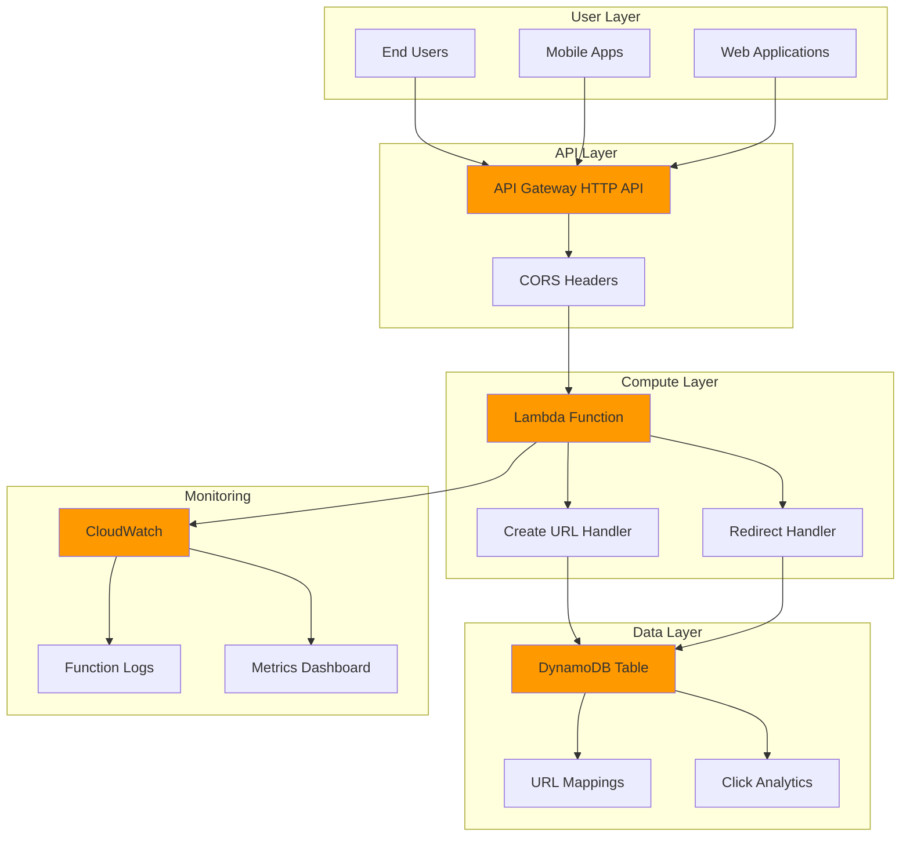

# URL Shortener Service with Lambda and DynamoDB

## Problem

Organizations need to share long URLs in emails, documents, and marketing materials, but lengthy URLs are difficult to manage and track. Traditional URL shortener services create external dependencies and lack customization options. Teams require a serverless solution that can handle variable traffic loads while providing analytics and custom branding capabilities without the overhead of managing servers or databases.

## Solution

Build a serverless URL shortener using AWS Lambda for compute, DynamoDB for storage, and API Gateway for HTTP endpoints. This architecture provides automatic scaling, pay-per-use pricing, and enterprise-grade reliability. The solution creates short URLs that redirect to original destinations while tracking usage metrics through CloudWatch monitoring.

## Architecture Diagram



## Prerequisites

1. AWS account with appropriate permissions for Lambda, DynamoDB, API Gateway, and CloudWatch
2. AWS CLI v2 installed and configured (or AWS CloudShell)
3. Basic understanding of serverless architecture patterns and HTTP APIs
4. Python 3.12 or later for Lambda function development
5. Estimated cost: $0.50-$2.00 per month for development usage (within Free Tier limits)

> **Note**: This recipe follows AWS Well-Architected Framework principles for serverless applications. See [AWS Well-Architected Serverless Lens](https://docs.aws.amazon.com/wellarchitected/latest/serverless-applications-lens/welcome.html) for additional guidance.

## Preparation

```bash
# Set environment variables
export AWS_REGION=$(aws configure get region)
export AWS_ACCOUNT_ID=$(aws sts get-caller-identity \
    --query Account --output text)

# Generate unique identifiers for resources
RANDOM_SUFFIX=$(aws secretsmanager get-random-password \
    --exclude-punctuation --exclude-uppercase \
    --password-length 6 --require-each-included-type \
    --output text --query RandomPassword)

# Set resource names
export TABLE_NAME="url-shortener-${RANDOM_SUFFIX}"
export FUNCTION_NAME="url-shortener-${RANDOM_SUFFIX}"
export API_NAME="url-shortener-api-${RANDOM_SUFFIX}"

# Create IAM role for Lambda execution
aws iam create-role \
    --role-name ${FUNCTION_NAME}-role \
    --assume-role-policy-document '{
        "Version": "2012-10-17",
        "Statement": [
            {
                "Effect": "Allow",
                "Principal": {
                    "Service": "lambda.amazonaws.com"
                },
                "Action": "sts:AssumeRole"
            }
        ]
    }'

# Wait for role to be created
sleep 10

# Attach basic Lambda execution policy
aws iam attach-role-policy \
    --role-name ${FUNCTION_NAME}-role \
    --policy-arn arn:aws:iam::aws:policy/service-role/AWSLambdaBasicExecutionRole

# Create custom policy for DynamoDB access
aws iam create-policy \
    --policy-name ${FUNCTION_NAME}-dynamodb-policy \
    --policy-document '{
        "Version": "2012-10-17",
        "Statement": [
            {
                "Effect": "Allow",
                "Action": [
                    "dynamodb:GetItem",
                    "dynamodb:PutItem",
                    "dynamodb:UpdateItem",
                    "dynamodb:DeleteItem",
                    "dynamodb:Query",
                    "dynamodb:Scan"
                ],
                "Resource": "arn:aws:dynamodb:'${AWS_REGION}':'${AWS_ACCOUNT_ID}':table/url-shortener-*"
            }
        ]
    }'

# Wait for policy to be created
sleep 5

# Attach DynamoDB policy to Lambda role
aws iam attach-role-policy \
    --role-name ${FUNCTION_NAME}-role \
    --policy-arn arn:aws:iam::${AWS_ACCOUNT_ID}:policy/${FUNCTION_NAME}-dynamodb-policy

echo "✅ AWS environment configured with unique suffix: ${RANDOM_SUFFIX}"
```

## Steps

1. **Create DynamoDB Table for URL Storage**:

   DynamoDB provides single-digit millisecond performance and unlimited scalability for our URL shortener service. The table uses a simple partition key design optimized for fast lookups by short URL identifier while supporting additional attributes for analytics and metadata.

   ```bash
   # Create DynamoDB table with on-demand billing
   aws dynamodb create-table \
       --table-name ${TABLE_NAME} \
       --attribute-definitions \
           AttributeName=short_id,AttributeType=S \
       --key-schema \
           AttributeName=short_id,KeyType=HASH \
       --billing-mode PAY_PER_REQUEST \
       --tags Key=Project,Value=URLShortener
   
   # Wait for table to become active
   aws dynamodb wait table-exists --table-name ${TABLE_NAME}
   
   echo "✅ DynamoDB table created: ${TABLE_NAME}"
   ```

   The table is now ready with pay-per-request billing, eliminating the need to provision capacity while ensuring consistent performance. This configuration supports burst traffic patterns typical of URL shortener services.

2. **Create Lambda Function Package**:

   AWS Lambda provides serverless compute that automatically scales based on incoming requests. Our function handles both URL creation and redirection logic using the Python runtime with the AWS SDK (Boto3) for DynamoDB operations.

   ```bash
   # Create function directory and implementation
   mkdir -p /tmp/lambda-function
   
   # Create the main Lambda function code
   cat > /tmp/lambda-function/lambda_function.py << 'EOF'
import json
import boto3
import base64
import hashlib
import uuid
import logging
import os
from datetime import datetime, timedelta
from urllib.parse import urlparse

# Configure logging
logger = logging.getLogger()
logger.setLevel(logging.INFO)

# Initialize DynamoDB client
dynamodb = boto3.resource('dynamodb')
table = dynamodb.Table(os.environ['TABLE_NAME'])

def lambda_handler(event, context):
    """Main Lambda handler for URL shortener operations"""
    
    try:
        # Extract HTTP method and path
        http_method = event['httpMethod']
        path = event['path']
        
        # Route requests based on method and path
        if http_method == 'POST' and path == '/shorten':
            return create_short_url(event)
        elif http_method == 'GET' and path.startswith('/'):
            return redirect_to_long_url(event)
        else:
            return {
                'statusCode': 404,
                'headers': {
                    'Content-Type': 'application/json',
                    'Access-Control-Allow-Origin': '*'
                },
                'body': json.dumps({'error': 'Endpoint not found'})
            }
            
    except Exception as e:
        logger.error(f"Error processing request: {str(e)}")
        return {
            'statusCode': 500,
            'headers': {
                'Content-Type': 'application/json',
                'Access-Control-Allow-Origin': '*'
            },
            'body': json.dumps({'error': 'Internal server error'})
        }

def create_short_url(event):
    """Create a new short URL mapping"""
    
    try:
        # Parse request body
        if event.get('isBase64Encoded', False):
            body = base64.b64decode(event['body']).decode('utf-8')
        else:
            body = event['body']
        
        request_data = json.loads(body)
        original_url = request_data.get('url')
        
        if not original_url:
            return {
                'statusCode': 400,
                'headers': {
                    'Content-Type': 'application/json',
                    'Access-Control-Allow-Origin': '*'
                },
                'body': json.dumps({'error': 'URL is required'})
            }
        
        # Validate URL format
        parsed_url = urlparse(original_url)
        if not parsed_url.scheme or not parsed_url.netloc:
            return {
                'statusCode': 400,
                'headers': {
                    'Content-Type': 'application/json',
                    'Access-Control-Allow-Origin': '*'
                },
                'body': json.dumps({'error': 'Invalid URL format'})
            }
        
        # Generate short ID
        short_id = generate_short_id(original_url)
        
        # Create expiration time (30 days from now)
        expiration_time = datetime.utcnow() + timedelta(days=30)
        
        # Store in DynamoDB
        table.put_item(
            Item={
                'short_id': short_id,
                'original_url': original_url,
                'created_at': datetime.utcnow().isoformat(),
                'expires_at': expiration_time.isoformat(),
                'click_count': 0,
                'is_active': True
            }
        )
        
        # Return success response
        return {
            'statusCode': 201,
            'headers': {
                'Content-Type': 'application/json',
                'Access-Control-Allow-Origin': '*'
            },
            'body': json.dumps({
                'short_id': short_id,
                'short_url': f"https://your-domain.com/{short_id}",
                'original_url': original_url,
                'expires_at': expiration_time.isoformat()
            })
        }
        
    except Exception as e:
        logger.error(f"Error creating short URL: {str(e)}")
        return {
            'statusCode': 500,
            'headers': {
                'Content-Type': 'application/json',
                'Access-Control-Allow-Origin': '*'
            },
            'body': json.dumps({'error': 'Could not create short URL'})
        }

def redirect_to_long_url(event):
    """Redirect to original URL using short ID"""
    
    try:
        # Extract short ID from path
        short_id = event['path'][1:]  # Remove leading slash
        
        if not short_id:
            return {
                'statusCode': 400,
                'headers': {
                    'Content-Type': 'application/json',
                    'Access-Control-Allow-Origin': '*'
                },
                'body': json.dumps({'error': 'Short ID is required'})
            }
        
        # Retrieve from DynamoDB
        response = table.get_item(Key={'short_id': short_id})
        
        if 'Item' not in response:
            return {
                'statusCode': 404,
                'headers': {
                    'Content-Type': 'application/json',
                    'Access-Control-Allow-Origin': '*'
                },
                'body': json.dumps({'error': 'Short URL not found'})
            }
        
        item = response['Item']
        
        # Check if URL is still active
        if not item.get('is_active', True):
            return {
                'statusCode': 410,
                'headers': {
                    'Content-Type': 'application/json',
                    'Access-Control-Allow-Origin': '*'
                },
                'body': json.dumps({'error': 'Short URL has been disabled'})
            }
        
        # Check expiration
        expires_at = datetime.fromisoformat(item['expires_at'])
        if datetime.utcnow() > expires_at:
            return {
                'statusCode': 410,
                'headers': {
                    'Content-Type': 'application/json',
                    'Access-Control-Allow-Origin': '*'
                },
                'body': json.dumps({'error': 'Short URL has expired'})
            }
        
        # Increment click count
        table.update_item(
            Key={'short_id': short_id},
            UpdateExpression='SET click_count = click_count + :inc',
            ExpressionAttributeValues={':inc': 1}
        )
        
        # Return redirect response
        return {
            'statusCode': 302,
            'headers': {
                'Location': item['original_url'],
                'Access-Control-Allow-Origin': '*'
            },
            'body': ''
        }
        
    except Exception as e:
        logger.error(f"Error redirecting URL: {str(e)}")
        return {
            'statusCode': 500,
            'headers': {
                'Content-Type': 'application/json',
                'Access-Control-Allow-Origin': '*'
            },
            'body': json.dumps({'error': 'Could not redirect to URL'})
        }

def generate_short_id(url):
    """Generate a short ID from URL using hash"""
    
    # Create a hash of the URL with timestamp for uniqueness
    hash_input = f"{url}{datetime.utcnow().isoformat()}{uuid.uuid4().hex[:8]}"
    hash_object = hashlib.sha256(hash_input.encode())
    hash_hex = hash_object.hexdigest()
    
    # Convert to base62 for URL-safe short ID
    short_id = base62_encode(int(hash_hex[:16], 16))[:8]
    
    return short_id

def base62_encode(num):
    """Encode number to base62 string"""
    
    alphabet = "0123456789abcdefghijklmnopqrstuvwxyzABCDEFGHIJKLMNOPQRSTUVWXYZ"
    if num == 0:
        return alphabet[0]
    
    result = []
    while num:
        result.append(alphabet[num % 62])
        num //= 62
    
    return ''.join(reversed(result))
EOF
   
   # Create deployment package
   cd /tmp/lambda-function
   zip -r ../lambda-function.zip .
   cd -
   
   echo "✅ Lambda function package created"
   ```

   The function implements secure URL validation, generates unique short IDs using SHA-256 hashing with Base62 encoding, and includes comprehensive error handling. The code follows AWS Lambda best practices with proper logging, response formatting, and efficient DynamoDB operations.

3. **Deploy Lambda Function**:

   ```bash
   # Get Lambda role ARN
   LAMBDA_ROLE_ARN=$(aws iam get-role \
       --role-name ${FUNCTION_NAME}-role \
       --query Role.Arn --output text)
   
   # Create Lambda function with Python 3.12 runtime
   aws lambda create-function \
       --function-name ${FUNCTION_NAME} \
       --runtime python3.12 \
       --role ${LAMBDA_ROLE_ARN} \
       --handler lambda_function.lambda_handler \
       --zip-file fileb:///tmp/lambda-function.zip \
       --timeout 30 \
       --memory-size 256 \
       --description "URL Shortener Service Function" \
       --environment Variables="{TABLE_NAME=${TABLE_NAME}}"
   
   # Wait for function to be active
   aws lambda wait function-active --function-name ${FUNCTION_NAME}
   
   echo "✅ Lambda function deployed: ${FUNCTION_NAME}"
   ```

4. **Create API Gateway HTTP API**:

   API Gateway provides a fully managed service for creating, deploying, and managing HTTP APIs. The HTTP API offers lower latency and cost compared to REST APIs while supporting modern web standards including CORS and JWT authorizers.

   ```bash
   # Create HTTP API with CORS configuration
   API_ID=$(aws apigatewayv2 create-api \
       --name ${API_NAME} \
       --protocol-type HTTP \
       --description "URL Shortener API" \
       --cors-configuration AllowCredentials=false,AllowMethods=GET,POST,OPTIONS,AllowOrigins=*,AllowHeaders=Content-Type,X-Amz-Date,Authorization,X-Api-Key,X-Amz-Security-Token \
       --query ApiId --output text)
   
   # Get Lambda function ARN
   LAMBDA_ARN=$(aws lambda get-function \
       --function-name ${FUNCTION_NAME} \
       --query Configuration.FunctionArn --output text)
   
   # Create integration for Lambda proxy
   INTEGRATION_ID=$(aws apigatewayv2 create-integration \
       --api-id ${API_ID} \
       --integration-type AWS_PROXY \
       --integration-uri ${LAMBDA_ARN} \
       --payload-format-version 1.0 \
       --query IntegrationId --output text)
   
   # Create route for URL shortening
   aws apigatewayv2 create-route \
       --api-id ${API_ID} \
       --route-key "POST /shorten" \
       --target integrations/${INTEGRATION_ID}
   
   # Create route for URL redirection
   aws apigatewayv2 create-route \
       --api-id ${API_ID} \
       --route-key "GET /{proxy+}" \
       --target integrations/${INTEGRATION_ID}
   
   # Create production stage with auto-deploy
   aws apigatewayv2 create-stage \
       --api-id ${API_ID} \
       --stage-name prod \
       --description "Production stage" \
       --auto-deploy
   
   echo "✅ API Gateway HTTP API created: ${API_ID}"
   ```

   The API Gateway now provides HTTP endpoints with automatic CORS handling and efficient Lambda proxy integration. The configuration enables both URL creation and redirection through different HTTP methods and routes.

5. **Grant API Gateway Permission to Invoke Lambda**:

   ```bash
   # Add Lambda permission for API Gateway invocation
   aws lambda add-permission \
       --function-name ${FUNCTION_NAME} \
       --statement-id api-gateway-invoke \
       --action lambda:InvokeFunction \
       --principal apigateway.amazonaws.com \
       --source-arn "arn:aws:execute-api:${AWS_REGION}:${AWS_ACCOUNT_ID}:${API_ID}/*/*/*"
   
   echo "✅ API Gateway permission configured"
   ```

6. **Configure CloudWatch Monitoring**:

   CloudWatch provides comprehensive monitoring for our serverless application, including function execution metrics, error rates, and custom business metrics. This observability enables proactive issue detection and performance optimization.

   ```bash
   # Create CloudWatch dashboard for monitoring
   aws cloudwatch put-dashboard \
       --dashboard-name "URLShortener-${RANDOM_SUFFIX}" \
       --dashboard-body '{
           "widgets": [
               {
                   "type": "metric",
                   "properties": {
                       "metrics": [
                           [ "AWS/Lambda", "Invocations", "FunctionName", "'${FUNCTION_NAME}'" ],
                           [ ".", "Errors", ".", "." ],
                           [ ".", "Duration", ".", "." ]
                       ],
                       "period": 300,
                       "stat": "Average",
                       "region": "'${AWS_REGION}'",
                       "title": "Lambda Function Metrics"
                   }
               },
               {
                   "type": "metric",
                   "properties": {
                       "metrics": [
                           [ "AWS/DynamoDB", "ConsumedReadCapacityUnits", "TableName", "'${TABLE_NAME}'" ],
                           [ ".", "ConsumedWriteCapacityUnits", ".", "." ]
                       ],
                       "period": 300,
                       "stat": "Sum",
                       "region": "'${AWS_REGION}'",
                       "title": "DynamoDB Table Metrics"
                   }
               }
           ]
       }'
   
   # Get API Gateway URL
   API_URL=$(aws apigatewayv2 get-api \
       --api-id ${API_ID} \
       --query ApiEndpoint --output text)
   
   echo "✅ CloudWatch monitoring configured"
   echo "✅ URL Shortener API URL: ${API_URL}"
   ```

   The monitoring dashboard now tracks key performance indicators including function invocations, error rates, and database usage patterns. This provides operational visibility essential for production deployments.

## Validation & Testing

1. **Verify DynamoDB Table Status**:

   ```bash
   # Check table status
   aws dynamodb describe-table --table-name ${TABLE_NAME} \
       --query 'Table.[TableName,TableStatus]' --output table
   ```

   Expected output: Table should show `ACTIVE` status.

2. **Test URL Shortening Function**:

   ```bash
   # Test creating a short URL
   curl -X POST ${API_URL}/shorten \
       -H "Content-Type: application/json" \
       -d '{
           "url": "https://docs.aws.amazon.com/lambda/latest/dg/welcome.html"
       }'
   ```

   Expected output: JSON response with `short_id`, `short_url`, and `original_url` fields.

3. **Test URL Redirection**:

   ```bash
   # Extract short_id from response and test redirection
   SHORT_ID=$(curl -s -X POST ${API_URL}/shorten \
       -H "Content-Type: application/json" \
       -d '{"url": "https://docs.aws.amazon.com/lambda/latest/dg/welcome.html"}' | \
       python3 -c "import json,sys; print(json.load(sys.stdin)['short_id'])")
   
   # Test redirection with verbose headers
   curl -I ${API_URL}/${SHORT_ID}
   ```

   Expected output: HTTP 302 redirect with `Location` header pointing to original URL.

4. **Verify CloudWatch Metrics**:

   ```bash
   # Check Lambda function metrics
   aws cloudwatch get-metric-statistics \
       --namespace AWS/Lambda \
       --metric-name Invocations \
       --dimensions Name=FunctionName,Value=${FUNCTION_NAME} \
       --start-time $(date -u -d '10 minutes ago' +%Y-%m-%dT%H:%M:%S) \
       --end-time $(date -u +%Y-%m-%dT%H:%M:%S) \
       --period 300 \
       --statistics Sum
   ```

   Expected output: Metric data showing function invocations from testing.

## Cleanup

1. **Remove API Gateway HTTP API**:

   ```bash
   # Delete API Gateway
   aws apigatewayv2 delete-api --api-id ${API_ID}
   
   echo "✅ Deleted API Gateway: ${API_ID}"
   ```

2. **Remove Lambda Function**:

   ```bash
   # Delete Lambda function
   aws lambda delete-function --function-name ${FUNCTION_NAME}
   
   echo "✅ Deleted Lambda function: ${FUNCTION_NAME}"
   ```

3. **Remove DynamoDB Table**:

   ```bash
   # Delete DynamoDB table
   aws dynamodb delete-table --table-name ${TABLE_NAME}
   
   echo "✅ Deleted DynamoDB table: ${TABLE_NAME}"
   ```

4. **Remove IAM Resources**:

   ```bash
   # Detach policies from role
   aws iam detach-role-policy \
       --role-name ${FUNCTION_NAME}-role \
       --policy-arn arn:aws:iam::aws:policy/service-role/AWSLambdaBasicExecutionRole
   
   aws iam detach-role-policy \
       --role-name ${FUNCTION_NAME}-role \
       --policy-arn arn:aws:iam::${AWS_ACCOUNT_ID}:policy/${FUNCTION_NAME}-dynamodb-policy
   
   # Delete custom policy
   aws iam delete-policy \
       --policy-arn arn:aws:iam::${AWS_ACCOUNT_ID}:policy/${FUNCTION_NAME}-dynamodb-policy
   
   # Delete IAM role
   aws iam delete-role --role-name ${FUNCTION_NAME}-role
   
   echo "✅ Deleted IAM resources"
   ```

5. **Remove CloudWatch Dashboard**:

   ```bash
   # Delete CloudWatch dashboard
   aws cloudwatch delete-dashboards \
       --dashboard-names "URLShortener-${RANDOM_SUFFIX}"
   
   # Clean up local files
   rm -rf /tmp/lambda-function*
   
   echo "✅ Cleanup completed"
   ```

## Discussion

This serverless URL shortener demonstrates key AWS architectural patterns for building scalable, cost-effective applications. The solution leverages Lambda's event-driven compute model, DynamoDB's single-digit millisecond performance, and API Gateway's managed HTTP API capabilities to create a production-ready service without server management overhead.

The architecture follows AWS Well-Architected Framework principles across all five pillars. For operational excellence, CloudWatch provides comprehensive monitoring and logging. Security is implemented through IAM roles with least privilege access, HTTPS encryption, and input validation. Reliability is achieved through DynamoDB's 99.999% availability SLA and Lambda's automatic scaling and error handling. Performance efficiency comes from optimized cold start times and pay-per-request billing models.

Cost optimization is inherent in the serverless design, with zero charges during idle periods and automatic scaling based on demand. The solution can handle sudden traffic spikes without pre-provisioning capacity while maintaining consistent performance. DynamoDB's on-demand billing eliminates capacity planning concerns while providing unlimited scalability for URL storage and click tracking.

The short ID generation algorithm uses SHA-256 hashing combined with UUID elements and Base62 encoding to create URL-safe identifiers with extremely low collision probability. URL expiration and click tracking provide additional business value while maintaining data governance best practices. For production deployments, consider implementing rate limiting, custom domains, and enhanced analytics as described in the [AWS API Gateway documentation](https://docs.aws.amazon.com/apigateway/latest/developerguide/api-gateway-request-throttling.html).

> **Tip**: Enable AWS X-Ray tracing for distributed request tracing across Lambda, API Gateway, and DynamoDB to identify performance bottlenecks and optimize response times. See the [X-Ray developer guide](https://docs.aws.amazon.com/xray/latest/devguide/) for implementation details.

## Challenge

Extend this solution by implementing these enhancements:

1. **Custom Domain Integration**: Configure Route 53 and AWS Certificate Manager to provide branded short URLs (e.g., `https://short.yourcompany.com/abc123`) following the [API Gateway custom domain guide](https://docs.aws.amazon.com/apigateway/latest/developerguide/how-to-custom-domains.html).

2. **Advanced Analytics Dashboard**: Implement comprehensive analytics using DynamoDB Streams, Kinesis Data Firehose, and QuickSight to track geographic distribution, device types, and referrer patterns with real-time visualization capabilities.

3. **Bulk URL Processing**: Add SQS queue integration for batch URL shortening operations, enabling CSV file uploads and processing thousands of URLs asynchronously with dead letter queue error handling.

4. **Security Enhancements**: Implement AWS WAF for DDoS protection, Cognito authentication for user management, and AWS Config rules for compliance monitoring following the [AWS security best practices guide](https://docs.aws.amazon.com/security/latest/userguide/security-best-practices.html).

5. **Multi-Region Deployment**: Deploy across multiple AWS regions using Route 53 health checks and DynamoDB Global Tables for global availability and sub-100ms response times worldwide.

## Infrastructure Code

### Available Infrastructure as Code:

- [Infrastructure Code Overview](code/README.md) - Detailed description of all infrastructure components
- [AWS CDK (Python)](code/cdk-python/) - AWS CDK Python implementation
- [AWS CDK (TypeScript)](code/cdk-typescript/) - AWS CDK TypeScript implementation
- [CloudFormation](code/cloudformation.yaml) - AWS CloudFormation template
- [Bash CLI Scripts](code/scripts/) - Example bash scripts using AWS CLI commands to deploy infrastructure
- [Terraform](code/terraform/) - Terraform configuration files