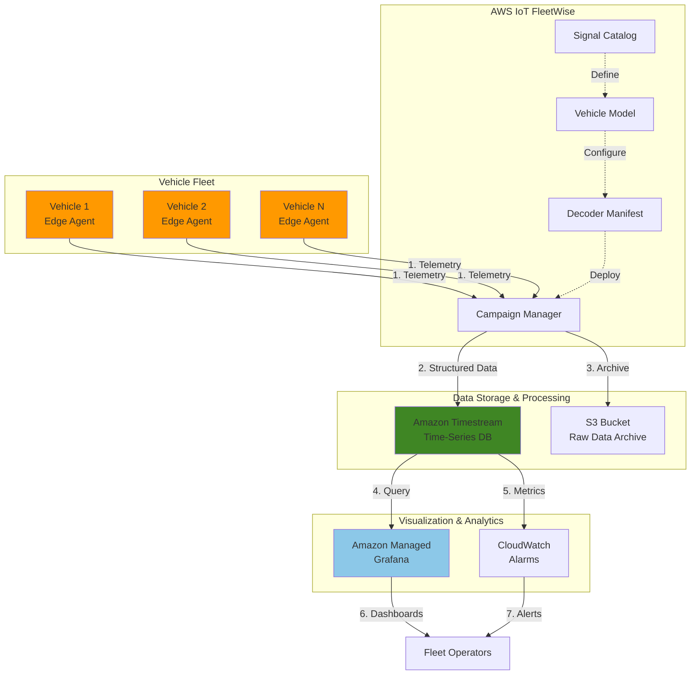

# Vehicle Telemetry Analytics with IoT FleetWise

## Problem

Fleet operators and automotive companies struggle to collect, process, and analyze massive volumes of real-time vehicle telemetry data from thousands of connected vehicles. Traditional solutions lack the ability to standardize diverse signal formats, handle high-frequency time-series data efficiently, and provide actionable insights for predictive maintenance and fleet optimization. This results in increased operational costs, unexpected vehicle breakdowns, and inability to leverage data for improving fleet performance.

## Solution

This recipe implements a comprehensive vehicle telemetry system using AWS IoT FleetWise to standardize and collect vehicle data, Amazon Timestream to store and query time-series telemetry efficiently, and Amazon Managed Grafana for real-time visualization and alerting. The solution enables fleet operators to monitor vehicle health metrics, detect anomalies, and make data-driven decisions for predictive maintenance and route optimization.

## Architecture Diagram



## Prerequisites

1. AWS account with appropriate permissions for IoT FleetWise, Timestream, S3, IAM, and Managed Grafana
2. AWS CLI v2 installed and configured (or AWS CloudShell)
3. Basic understanding of vehicle telemetry, CAN bus protocols, and time-series data
4. Python 3.9 or higher installed for data simulation scripts (optional)
5. Estimated cost: $50-100/month for a small fleet (10 vehicles) with moderate data collection

> **Note**: AWS IoT FleetWise is currently available in US East (N. Virginia), Europe (Frankfurt), and Asia Pacific (Mumbai) regions. Access to Mumbai region and some features requires gated access approval.

## Preparation

```bash
# Set environment variables
export AWS_REGION=$(aws configure get region)
export AWS_ACCOUNT_ID=$(aws sts get-caller-identity \
    --query Account --output text)

# Generate unique identifiers
RANDOM_SUFFIX=$(aws secretsmanager get-random-password \
    --exclude-punctuation --exclude-uppercase \
    --password-length 6 --require-each-included-type \
    --output text --query RandomPassword)

export FLEET_NAME="vehicle-fleet-${RANDOM_SUFFIX}"
export TIMESTREAM_DB="telemetry_db_${RANDOM_SUFFIX}"
export TIMESTREAM_TABLE="vehicle_metrics"
export S3_BUCKET="fleetwise-data-${RANDOM_SUFFIX}"

# Create S3 bucket for data archival with encryption
aws s3 mb s3://${S3_BUCKET} --region ${AWS_REGION}

aws s3api put-bucket-versioning \
    --bucket ${S3_BUCKET} \
    --versioning-configuration Status=Enabled

aws s3api put-bucket-encryption \
    --bucket ${S3_BUCKET} \
    --server-side-encryption-configuration \
    'Rules=[{ApplyServerSideEncryptionByDefault:{SSEAlgorithm:AES256}}]'

echo "✅ Created S3 bucket for telemetry data archival"

# Create IAM role for FleetWise
cat > fleetwise-trust-policy.json << EOF
{
  "Version": "2012-10-17",
  "Statement": [
    {
      "Effect": "Allow",
      "Principal": {
        "Service": "iotfleetwise.amazonaws.com"
      },
      "Action": "sts:AssumeRole"
    }
  ]
}
EOF

FLEETWISE_ROLE_ARN=$(aws iam create-role \
    --role-name FleetWiseServiceRole-${RANDOM_SUFFIX} \
    --assume-role-policy-document file://fleetwise-trust-policy.json \
    --query 'Role.Arn' --output text)

echo "✅ Created IAM role for AWS IoT FleetWise: ${FLEETWISE_ROLE_ARN}"
```

## Steps

1. **Create Amazon Timestream Database and Table**:

   Amazon Timestream is a purpose-built time-series database that can handle trillions of events per day with built-in data lifecycle management. Creating a dedicated database and table establishes the foundation for storing high-frequency vehicle telemetry data with automatic data tiering that moves older data to cost-effective storage while keeping recent data in memory for fast queries.

   ```bash
   # Create Timestream database
   aws timestream-write create-database \
       --database-name ${TIMESTREAM_DB} \
       --region ${AWS_REGION}
   
   # Create table with retention policies
   aws timestream-write create-table \
       --database-name ${TIMESTREAM_DB} \
       --table-name ${TIMESTREAM_TABLE} \
       --retention-properties \
         MemoryStoreRetentionPeriodInHours=24,\
         MagneticStoreRetentionPeriodInDays=30 \
       --region ${AWS_REGION}
   
   echo "✅ Timestream database and table created with retention policies"
   ```

   The Timestream table now stores recent telemetry data in memory for 24 hours enabling millisecond query latency, while automatically moving older data to magnetic storage for 30 days. This tiered storage approach optimizes both performance and cost for time-series workloads according to the [Timestream architecture design](https://docs.aws.amazon.com/timestream/latest/developerguide/architecture.html).

2. **Create Signal Catalog for Vehicle Data Standardization**:

   AWS IoT FleetWise uses a signal catalog to standardize vehicle data formats across different vehicle types and manufacturers. This catalog defines the signals (like engine RPM, speed, fuel level) that vehicles can transmit, ensuring consistent data collection regardless of the underlying vehicle protocols or data formats. The signal catalog follows the Vehicle Signal Specification (VSS) standard for interoperability.

   ```bash
   # Create signal catalog JSON configuration
   cat > signal-catalog.json << 'EOF'
   {
     "name": "VehicleSignalCatalog",
     "description": "Standard vehicle telemetry signals following VSS",
     "nodes": [
       {
         "branch": {
           "fullyQualifiedName": "Vehicle",
           "description": "Root vehicle node"
         }
       },
       {
         "branch": {
           "fullyQualifiedName": "Vehicle.Engine",
           "description": "Engine-related signals"
         }
       },
       {
         "sensor": {
           "fullyQualifiedName": "Vehicle.Engine.RPM",
           "dataType": "DOUBLE",
           "unit": "rpm",
           "min": 0,
           "max": 8000,
           "description": "Engine rotations per minute"
         }
       },
       {
         "sensor": {
           "fullyQualifiedName": "Vehicle.Speed",
           "dataType": "DOUBLE",
           "unit": "km/h",
           "min": 0,
           "max": 300,
           "description": "Vehicle speed in kilometers per hour"
         }
       },
       {
         "sensor": {
           "fullyQualifiedName": "Vehicle.Engine.Temperature",
           "dataType": "DOUBLE",
           "unit": "Celsius",
           "min": -40,
           "max": 200,
           "description": "Engine coolant temperature"
         }
       },
       {
         "sensor": {
           "fullyQualifiedName": "Vehicle.FuelLevel",
           "dataType": "DOUBLE",
           "unit": "Percentage",
           "min": 0,
           "max": 100,
           "description": "Fuel tank level percentage"
         }
       }
     ]
   }
   EOF
   
   # Create signal catalog using AWS CLI
   CATALOG_ARN=$(aws iotfleetwise create-signal-catalog \
       --cli-input-json file://signal-catalog.json \
       --query 'arn' --output text)
   
   echo "✅ Signal catalog created: ${CATALOG_ARN}"
   ```

   The signal catalog now provides a standardized vocabulary for vehicle data, enabling consistent telemetry collection across diverse vehicle types and manufacturers while maintaining data quality and interoperability.

3. **Create and Activate Vehicle Model (Model Manifest)**:

   The vehicle model defines which signals from the catalog apply to specific vehicle types. This abstraction layer enables fleet operators to manage different vehicle configurations while maintaining consistent data collection. The model manifest maps logical signal names to actual vehicle network signals, supporting diverse fleet compositions.

   ```bash
   # Create model manifest configuration
   cat > model-manifest.json << EOF
   {
     "name": "StandardVehicleModel",
     "description": "Model for standard fleet vehicles",
     "signalCatalogArn": "${CATALOG_ARN}",
     "nodes": [
       "Vehicle.Engine.RPM",
       "Vehicle.Speed", 
       "Vehicle.Engine.Temperature",
       "Vehicle.FuelLevel"
     ]
   }
   EOF
   
   # Create model manifest
   MODEL_ARN=$(aws iotfleetwise create-model-manifest \
       --cli-input-json file://model-manifest.json \
       --query 'arn' --output text)
   
   # Activate the model for use in campaigns
   aws iotfleetwise update-model-manifest \
       --name "StandardVehicleModel" \
       --status "ACTIVE"
   
   echo "✅ Vehicle model created and activated: ${MODEL_ARN}"
   ```

   The vehicle model is now active and ready to be associated with decoder manifests. This standardized model can be reused across multiple vehicle types that share similar signal configurations.

4. **Create Decoder Manifest for Signal Mapping**:

   The decoder manifest translates raw vehicle network data (like CAN bus messages) into the standardized signals defined in your catalog. This critical component enables FleetWise Edge Agent to understand vehicle-specific protocols and extract meaningful telemetry data from diverse vehicle networks using protocol-specific decoders.

   ```bash
   # Create decoder manifest configuration
   cat > decoder-manifest.json << EOF
   {
     "name": "StandardDecoder",
     "description": "Decoder for standard vehicle CAN signals",
     "modelManifestArn": "${MODEL_ARN}",
     "signalDecoders": [
       {
         "fullyQualifiedName": "Vehicle.Engine.RPM",
         "type": "CAN_SIGNAL",
         "canSignal": {
           "messageId": 419364097,
           "isBigEndian": false,
           "isSigned": false,
           "startBit": 24,
           "offset": 0.0,
           "factor": 0.25,
           "length": 16
         }
       },
       {
         "fullyQualifiedName": "Vehicle.Speed",
         "type": "CAN_SIGNAL",
         "canSignal": {
           "messageId": 419364352,
           "isBigEndian": false,
           "isSigned": false,
           "startBit": 0,
           "offset": 0.0,
           "factor": 0.01,
           "length": 16
         }
       },
       {
         "fullyQualifiedName": "Vehicle.Engine.Temperature",
         "type": "CAN_SIGNAL",
         "canSignal": {
           "messageId": 419364353,
           "isBigEndian": false,
           "isSigned": true,
           "startBit": 8,
           "offset": -40.0,
           "factor": 1.0,
           "length": 8
         }
       },
       {
         "fullyQualifiedName": "Vehicle.FuelLevel",
         "type": "CAN_SIGNAL",
         "canSignal": {
           "messageId": 419364354,
           "isBigEndian": false,
           "isSigned": false,
           "startBit": 16,
           "offset": 0.0,
           "factor": 0.4,
           "length": 8
         }
       }
     ]
   }
   EOF
   
   # Create decoder manifest
   DECODER_ARN=$(aws iotfleetwise create-decoder-manifest \
       --cli-input-json file://decoder-manifest.json \
       --query 'arn' --output text)
   
   # Activate decoder for campaign deployment
   aws iotfleetwise update-decoder-manifest \
       --name "StandardDecoder" \
       --status "ACTIVE"
   
   echo "✅ Decoder manifest created and activated: ${DECODER_ARN}"
   ```

   The decoder manifest now enables the FleetWise Edge Agent to interpret CAN bus messages and extract standardized telemetry data. This configuration supports real-world CAN message IDs and bit-level signal extraction.

5. **Create Fleet and Register Vehicles**:

   Fleets organize vehicles into logical groups for management and data collection. Creating a fleet and registering vehicles establishes the foundation for deploying data collection campaigns. Each vehicle requires AWS IoT Core provisioning for secure cloud connectivity with certificate-based authentication.

   ```bash
   # Create fleet for vehicle organization
   FLEET_ARN=$(aws iotfleetwise create-fleet \
       --fleet-id ${FLEET_NAME} \
       --description "Production vehicle fleet for telemetry collection" \
       --signal-catalog-arn ${CATALOG_ARN} \
       --query 'arn' --output text)
   
   # Define vehicle identifier
   VEHICLE_NAME="vehicle-001-${RANDOM_SUFFIX}"
   
   # Create IoT thing for secure connectivity
   aws iot create-thing \
       --thing-name ${VEHICLE_NAME} \
       --region ${AWS_REGION}
   
   # Register vehicle in FleetWise
   aws iotfleetwise create-vehicle \
       --vehicle-name ${VEHICLE_NAME} \
       --model-manifest-arn ${MODEL_ARN} \
       --decoder-manifest-arn ${DECODER_ARN}
   
   # Associate vehicle with fleet
   aws iotfleetwise associate-vehicle-fleet \
       --vehicle-name ${VEHICLE_NAME} \
       --fleet-id ${FLEET_NAME}
   
   echo "✅ Fleet created and vehicle registered: ${VEHICLE_NAME}"
   ```

   The fleet infrastructure is now ready for campaign deployment. The vehicle is registered with both IoT Core and FleetWise, enabling secure telemetry transmission and data collection management.

6. **Configure IAM Permissions for Timestream Access**:

   AWS IoT FleetWise requires specific permissions to write telemetry data to Timestream. Creating and attaching the appropriate IAM policy ensures secure data flow from vehicles to the time-series database while following the principle of least privilege for cloud security and enabling cross-service integration.

   ```bash
   # Create IAM policy for Timestream write access
   cat > timestream-policy.json << EOF
   {
     "Version": "2012-10-17",
     "Statement": [
       {
         "Effect": "Allow",
         "Action": [
           "timestream:WriteRecords",
           "timestream:DescribeEndpoints"
         ],
         "Resource": [
           "arn:aws:timestream:${AWS_REGION}:${AWS_ACCOUNT_ID}:database/${TIMESTREAM_DB}/table/${TIMESTREAM_TABLE}"
         ]
       },
       {
         "Effect": "Allow",
         "Action": "timestream:DescribeEndpoints",
         "Resource": "*"
       },
       {
         "Effect": "Allow",
         "Action": [
           "s3:PutObject",
           "s3:GetObject"
         ],
         "Resource": [
           "arn:aws:s3:::${S3_BUCKET}/*"
         ]
       }
     ]
   }
   EOF
   
   # Attach policy to FleetWise service role
   aws iam put-role-policy \
       --role-name FleetWiseServiceRole-${RANDOM_SUFFIX} \
       --policy-name TimestreamWritePolicy \
       --policy-document file://timestream-policy.json
   
   echo "✅ IAM permissions configured for Timestream and S3 access"
   ```

   The IAM role now has the minimum required permissions to write telemetry data to Timestream and archive raw data to S3, following AWS security best practices for service-to-service authentication.

7. **Create Data Collection Campaign**:

   Campaigns define what data to collect, how often to collect it, and where to send it. This campaign configures continuous telemetry collection for critical vehicle metrics, enabling real-time monitoring and historical analysis. The time-based collection scheme ensures consistent data points for time-series analysis and predictive maintenance.

   ```bash
   # Create comprehensive campaign configuration
   cat > campaign.json << EOF
   {
     "name": "TelemetryCampaign-${RANDOM_SUFFIX}",
     "description": "Continuous vehicle telemetry collection for fleet analytics",
     "signalCatalogArn": "${CATALOG_ARN}",
     "targetArn": "${FLEET_ARN}",
     "dataDestinationConfigs": [
       {
         "timestreamConfig": {
           "timestreamTableArn": "arn:aws:timestream:${AWS_REGION}:${AWS_ACCOUNT_ID}:database/${TIMESTREAM_DB}/table/${TIMESTREAM_TABLE}",
           "executionRoleArn": "${FLEETWISE_ROLE_ARN}"
         }
       },
       {
         "s3Config": {
           "bucketArn": "arn:aws:s3:::${S3_BUCKET}",
           "dataFormat": "JSON",
           "prefix": "telemetry-data/",
           "storageCompressionFormat": "GZIP"
         }
       }
     ],
     "collectionScheme": {
       "timeBasedCollectionScheme": {
         "periodMs": 10000
       }
     },
     "signalsToCollect": [
       {
         "name": "Vehicle.Engine.RPM"
       },
       {
         "name": "Vehicle.Speed"
       },
       {
         "name": "Vehicle.Engine.Temperature"
       },
       {
         "name": "Vehicle.FuelLevel"
       }
     ],
     "postTriggerCollectionDuration": 0,
     "diagnosticsMode": "OFF",
     "spoolingMode": "TO_DISK",
     "compression": "SNAPPY"
   }
   EOF
   
   # Create campaign
   CAMPAIGN_ARN=$(aws iotfleetwise create-campaign \
       --cli-input-json file://campaign.json \
       --query 'arn' --output text)
   
   echo "✅ Data collection campaign created: ${CAMPAIGN_ARN}"
   ```

   The campaign is configured to collect telemetry every 10 seconds and send data to both Timestream for real-time analytics and S3 for long-term archival, providing a comprehensive data pipeline for fleet management.

8. **Deploy and Start the Campaign**:

   Deploying the campaign activates data collection across the fleet. The approval process ensures campaigns are reviewed before deployment, while the RUNNING status indicates active telemetry collection. This step transforms the configured infrastructure into an operational data pipeline with proper governance controls.

   ```bash
   # Approve campaign for deployment
   aws iotfleetwise update-campaign \
       --name "TelemetryCampaign-${RANDOM_SUFFIX}" \
       --action APPROVE
   
   # Wait for approval to process
   sleep 10
   
   # Start the campaign
   aws iotfleetwise update-campaign \
       --name "TelemetryCampaign-${RANDOM_SUFFIX}" \
       --action RESUME
   
   # Verify campaign status
   CAMPAIGN_STATUS=$(aws iotfleetwise get-campaign \
       --name "TelemetryCampaign-${RANDOM_SUFFIX}" \
       --query 'status' --output text)
   
   echo "✅ Campaign deployed and running: ${CAMPAIGN_STATUS}"
   
   # Display campaign details
   aws iotfleetwise get-campaign \
       --name "TelemetryCampaign-${RANDOM_SUFFIX}" \
       --query '[name,status,creationTime,targetArn]' \
       --output table
   ```

   The campaign is now actively collecting telemetry data from registered vehicles. Data will begin flowing to Timestream and S3 once FleetWise Edge Agents are installed and configured on vehicles.

9. **Create Amazon Managed Grafana Workspace**:

   Amazon Managed Grafana provides a fully managed visualization platform for time-series data. Creating a workspace establishes the foundation for building interactive dashboards that transform raw telemetry data into actionable insights for fleet operators and maintenance teams with enterprise-grade security and scalability.

   ```bash
   # Create Grafana workspace with Timestream integration
   WORKSPACE_ID=$(aws grafana create-workspace \
       --workspace-name "FleetTelemetry-${RANDOM_SUFFIX}" \
       --workspace-description "Vehicle telemetry dashboards and analytics" \
       --account-access-type "CURRENT_ACCOUNT" \
       --authentication-providers "AWS_SSO" \
       --permission-type "SERVICE_MANAGED" \
       --workspace-data-sources "TIMESTREAM" \
       --workspace-notification-destinations "SNS" \
       --query 'workspace.id' --output text)
   
   echo "✅ Grafana workspace created: ${WORKSPACE_ID}"
   
   # Wait for workspace to become active
   echo "Waiting for Grafana workspace to be active..."
   aws grafana describe-workspace \
       --workspace-id ${WORKSPACE_ID} \
       --query 'workspace.status' --output text
   
   # Get workspace endpoint
   GRAFANA_ENDPOINT=$(aws grafana describe-workspace \
       --workspace-id ${WORKSPACE_ID} \
       --query 'workspace.endpoint' --output text)
   
   echo "✅ Grafana workspace available at: https://${GRAFANA_ENDPOINT}"
   ```

   The Grafana workspace is now available for creating vehicle telemetry dashboards. The workspace includes pre-configured Timestream data source capabilities for seamless integration with your telemetry database.

10. **Configure Timestream Data Source in Grafana**:

    Connecting Grafana to Timestream enables real-time visualization of vehicle telemetry. This integration leverages Grafana's powerful query capabilities with Timestream's optimized time-series storage, creating a seamless analytics experience for monitoring fleet performance and vehicle health metrics.

    ```bash
    # Create service-linked role for Grafana-Timestream integration
    aws iam create-service-linked-role \
        --aws-service-name grafana.amazonaws.com || true
    
    # Display configuration instructions for manual setup
    echo "✅ Complete the following steps in Grafana UI:"
    echo "   1. Navigate to: https://${GRAFANA_ENDPOINT}"
    echo "   2. Sign in using AWS SSO"
    echo "   3. Go to Configuration > Data Sources"
    echo "   4. Add Amazon Timestream data source"
    echo "   5. Configure the following settings:"
    echo "      - Default Region: ${AWS_REGION}"
    echo "      - Database: ${TIMESTREAM_DB}"
    echo "      - Table: ${TIMESTREAM_TABLE}"
    echo "      - Authentication: AWS SDK Default"
    echo "   6. Test the connection and save"
    
    # Store configuration for reference
    cat > grafana-config.json << EOF
{
  "workspace_id": "${WORKSPACE_ID}",
  "endpoint": "https://${GRAFANA_ENDPOINT}",
  "timestream_database": "${TIMESTREAM_DB}",
  "timestream_table": "${TIMESTREAM_TABLE}",
  "aws_region": "${AWS_REGION}"
}
EOF
    
    echo "✅ Grafana configuration saved to grafana-config.json"
    ```

    The Grafana workspace is ready for dashboard creation. Once the Timestream data source is configured, you can create visualizations for RPM trends, speed distributions, temperature monitoring, and fuel consumption analytics.

## Validation & Testing

1. Verify signal catalog and model status:

   ```bash
   # Check signal catalog status
   aws iotfleetwise get-signal-catalog \
       --name "VehicleSignalCatalog" \
       --query '[name,status,creationTime]' --output table
   
   # Check model manifest status
   aws iotfleetwise get-model-manifest \
       --name "StandardVehicleModel" \
       --query '[name,status,creationTime]' --output table
   
   # Verify decoder manifest status
   aws iotfleetwise get-decoder-manifest \
       --name "StandardDecoder" \
       --query '[name,status,creationTime]' --output table
   ```

   Expected output: All components should show "ACTIVE" status with recent creation timestamps

2. Verify campaign is properly configured:

   ```bash
   # Check campaign configuration and status
   aws iotfleetwise get-campaign \
       --name "TelemetryCampaign-${RANDOM_SUFFIX}" \
       --query '[name,status,creationTime,signalsToCollect[].name]' \
       --output table
   
   # List all campaigns for verification
   aws iotfleetwise list-campaigns \
       --query 'campaignSummaries[*].[name,status,creationTime]' \
       --output table
   ```

   Expected output: Campaign should show "RUNNING" or "WAITING_FOR_APPROVAL" status with all four signals listed

3. Test Timestream connectivity and data structure:

   ```bash
   # Verify Timestream database exists
   aws timestream-write describe-database \
       --database-name ${TIMESTREAM_DB} \
       --query '[DatabaseName,CreationTime]' --output table
   
   # Check table configuration
   aws timestream-write describe-table \
       --database-name ${TIMESTREAM_DB} \
       --table-name ${TIMESTREAM_TABLE} \
       --query '[TableName,TableStatus,RetentionProperties]' \
       --output table
   
   # Query for any existing data (will be empty until Edge Agent sends data)
   aws timestream-query query \
       --query-string "SELECT COUNT(*) as record_count FROM \"${TIMESTREAM_DB}\".\"${TIMESTREAM_TABLE}\"" \
       --query 'Rows[0].Data[0].ScalarValue' --output text
   ```

   Expected output: Database and table should exist with proper retention policies. Record count will be 0 until vehicles start sending data.

4. Verify Grafana workspace accessibility:

   ```bash
   # Get workspace status and details
   aws grafana describe-workspace \
       --workspace-id ${WORKSPACE_ID} \
       --query 'workspace.[status,endpoint,grafanaVersion]' \
       --output table
   
   # List configured data sources
   aws grafana list-workspace-service-accounts \
       --workspace-id ${WORKSPACE_ID} \
       --query 'serviceAccounts[*].[name,grafanaRole]' \
       --output table
   ```

   Expected output: Workspace status should be "ACTIVE" with an accessible HTTPS endpoint

## Cleanup

1. Stop and delete the campaign:

   ```bash
   # Suspend active campaign
   aws iotfleetwise update-campaign \
       --name "TelemetryCampaign-${RANDOM_SUFFIX}" \
       --action SUSPEND
   
   # Wait for suspension to complete
   sleep 10
   
   # Delete campaign
   aws iotfleetwise delete-campaign \
       --name "TelemetryCampaign-${RANDOM_SUFFIX}"
   
   echo "✅ Campaign stopped and deleted"
   ```

2. Remove vehicles and fleet:

   ```bash
   # Disassociate vehicle from fleet
   aws iotfleetwise disassociate-vehicle-fleet \
       --vehicle-name ${VEHICLE_NAME} \
       --fleet-id ${FLEET_NAME}
   
   # Delete vehicle from FleetWise
   aws iotfleetwise delete-vehicle \
       --vehicle-name ${VEHICLE_NAME}
   
   # Delete fleet
   aws iotfleetwise delete-fleet \
       --fleet-id ${FLEET_NAME}
   
   # Remove IoT thing
   aws iot delete-thing \
       --thing-name ${VEHICLE_NAME} \
       --region ${AWS_REGION}
   
   echo "✅ Vehicles and fleet removed"
   ```

3. Delete decoder and model manifests:

   ```bash
   # Deactivate decoder manifest
   aws iotfleetwise update-decoder-manifest \
       --name "StandardDecoder" \
       --status "INACTIVE"
   
   # Delete decoder manifest
   aws iotfleetwise delete-decoder-manifest \
       --name "StandardDecoder"
   
   # Deactivate model manifest
   aws iotfleetwise update-model-manifest \
       --name "StandardVehicleModel" \
       --status "INACTIVE"
   
   # Delete model manifest
   aws iotfleetwise delete-model-manifest \
       --name "StandardVehicleModel"
   
   echo "✅ Decoder and model manifests deleted"
   ```

4. Remove signal catalog and Timestream resources:

   ```bash
   # Delete signal catalog
   aws iotfleetwise delete-signal-catalog \
       --name "VehicleSignalCatalog"
   
   # Delete Timestream table
   aws timestream-write delete-table \
       --database-name ${TIMESTREAM_DB} \
       --table-name ${TIMESTREAM_TABLE}
   
   # Delete Timestream database
   aws timestream-write delete-database \
       --database-name ${TIMESTREAM_DB}
   
   echo "✅ Signal catalog and Timestream resources deleted"
   ```

5. Clean up Grafana and remaining resources:

   ```bash
   # Delete Grafana workspace
   aws grafana delete-workspace \
       --workspace-id ${WORKSPACE_ID}
   
   # Empty and delete S3 bucket
   aws s3 rm s3://${S3_BUCKET} --recursive
   aws s3 rb s3://${S3_BUCKET}
   
   # Remove IAM role policies and role
   aws iam delete-role-policy \
       --role-name FleetWiseServiceRole-${RANDOM_SUFFIX} \
       --policy-name TimestreamWritePolicy
   
   aws iam delete-role \
       --role-name FleetWiseServiceRole-${RANDOM_SUFFIX}
   
   # Clean up local configuration files
   rm -f signal-catalog.json model-manifest.json \
       decoder-manifest.json campaign.json \
       timestream-policy.json fleetwise-trust-policy.json \
       grafana-config.json
   
   echo "✅ All resources and configuration files cleaned up"
   ```

## Discussion

Building a real-time vehicle telemetry analytics system with AWS IoT FleetWise and Timestream addresses the complex challenge of collecting, standardizing, and analyzing diverse vehicle data at scale. This architecture leverages AWS IoT FleetWise's ability to normalize data from various vehicle protocols while Timestream provides purpose-built time-series storage optimized for IoT workloads. According to the [AWS IoT FleetWise Developer Guide](https://docs.aws.amazon.com/iot-fleetwise/latest/developerguide/what-is-iotfleetwise.html), this approach can reduce the time to collect vehicle data from months to weeks by providing standardized signal catalogs and automated data collection campaigns.

The signal catalog and decoder manifest pattern provides a powerful abstraction layer that decouples vehicle-specific implementations from data collection logic. This design enables fleet operators to onboard new vehicle types without modifying collection campaigns or analytics pipelines. The [vehicle modeling documentation](https://docs.aws.amazon.com/iot-fleetwise/latest/developerguide/vehicle-modeling.html) explains how this abstraction supports heterogeneous fleet management while maintaining data consistency across different manufacturers and vehicle models. The decoder manifest translates raw CAN bus messages into standardized telemetry signals, enabling seamless integration with cloud analytics services.

From a scalability perspective, Timestream's serverless architecture automatically handles the ingestion of millions of data points per second while providing SQL-compatible queries for analytics. The dual-tier storage model, detailed in the [Timestream architecture documentation](https://docs.aws.amazon.com/timestream/latest/developerguide/architecture.html), optimizes both query performance and storage costs by keeping recent data in memory while moving historical data to magnetic storage. Integration with Amazon Managed Grafana, as described in the [Grafana visualization guide](https://docs.aws.amazon.com/timestream/latest/developerguide/Grafana.html), enables creation of real-time dashboards without managing infrastructure. This combination provides fleet operators with comprehensive visibility into vehicle performance, enabling predictive maintenance and operational optimization strategies.

The solution follows AWS Well-Architected Framework principles by implementing security best practices through IAM roles with least privilege access, reliability through multi-AZ deployments, and cost optimization through intelligent data tiering. The architecture supports both real-time analytics through Timestream and long-term archival through S3, providing comprehensive data lifecycle management for compliance and historical analysis requirements.

> **Tip**: Use AWS IoT FleetWise's campaign diagnostics mode during initial deployment to troubleshoot data collection issues and validate signal decoding before processing large volumes of telemetry data. The [campaign management documentation](https://docs.aws.amazon.com/iot-fleetwise/latest/developerguide/campaigns.html) provides detailed guidance on optimizing collection schemes and managing data ingestion rates.

## Challenge

Extend this solution by implementing these enhancements:

1. **Anomaly Detection Integration**: Add Amazon Lookout for Equipment to identify unusual vehicle behavior patterns and predict maintenance needs before failures occur, integrating with the existing Timestream data pipeline for automated anomaly detection
2. **Geofencing and Location Services**: Implement geofencing capabilities by integrating Amazon Location Service to track vehicle positions and generate alerts when vehicles enter or exit designated areas, combining location data with telemetry metrics
3. **Automated Archival Workflows**: Create automated data archival workflows using AWS Lambda and Amazon S3 lifecycle policies to move historical telemetry data to Glacier for long-term compliance storage and cost optimization
4. **Machine Learning Pipeline**: Build a comprehensive ML pipeline using Amazon SageMaker to analyze driving patterns, predict fuel efficiency, and optimize routes across the fleet based on historical telemetry data
5. **Real-time Alerting System**: Develop a sophisticated alerting system using Amazon SNS, AWS Lambda, and CloudWatch to notify fleet managers of critical vehicle conditions requiring immediate attention, with escalation procedures and mobile notifications

## Infrastructure Code

*Infrastructure code will be generated after recipe approval.*