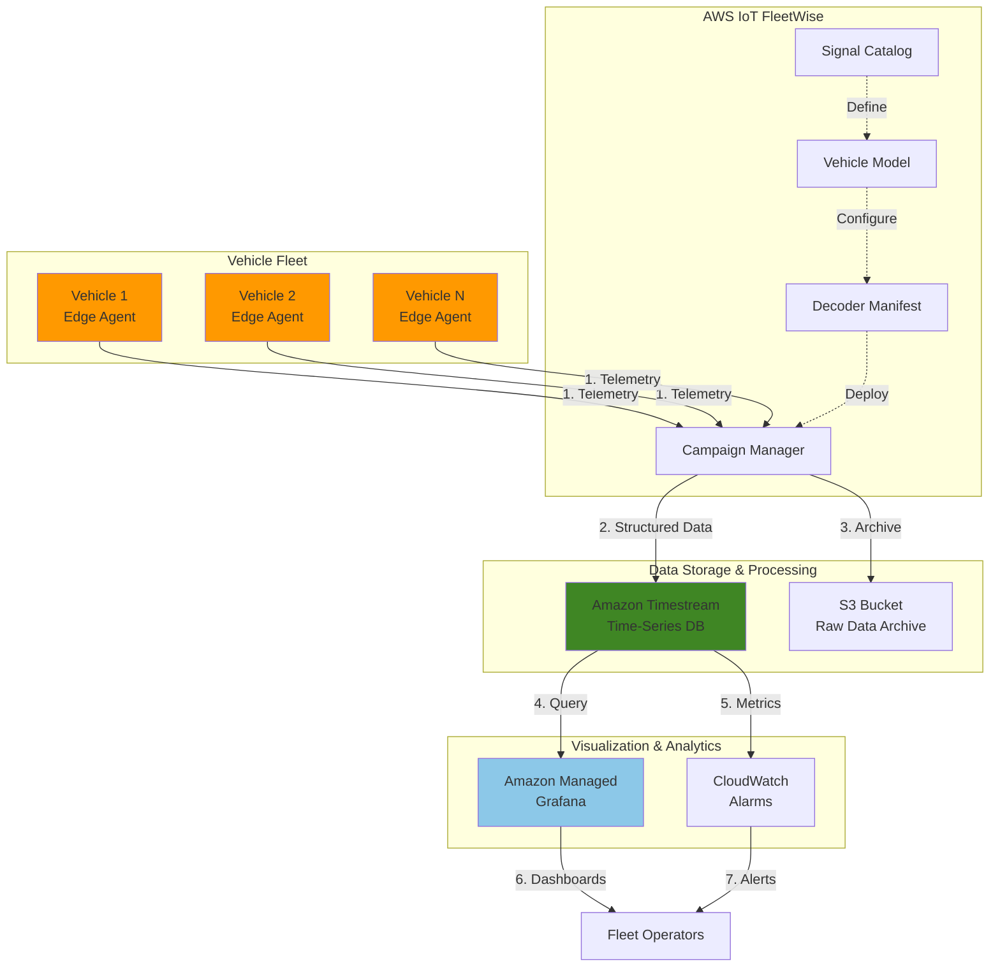

# Vehicle Telemetry Analytics with IoT FleetWise

## Problem

Fleet operators and automotive companies struggle to collect, process, and analyze massive volumes of real-time vehicle telemetry data from thousands of connected vehicles. Traditional solutions lack the ability to standardize diverse signal formats, handle high-frequency time-series data efficiently, and provide actionable insights for predictive maintenance and fleet optimization. This results in increased operational costs, unexpected vehicle breakdowns, and inability to leverage data for improving fleet performance.

## Solution

This recipe implements a comprehensive vehicle telemetry system using AWS IoT FleetWise to standardize and collect vehicle data, Amazon Timestream to store and query time-series telemetry efficiently, and Amazon Managed Grafana for real-time visualization and alerting. The solution enables fleet operators to monitor vehicle health metrics, detect anomalies, and make data-driven decisions for predictive maintenance and route optimization.

## Architecture Diagram



## Prerequisites

1. AWS account with appropriate permissions for IoT FleetWise, Timestream, S3, IAM, and Managed Grafana
2. AWS CLI v2 installed and configured (or AWS CloudShell)
3. Basic understanding of vehicle telemetry, CAN bus protocols, and time-series data
4. Python 3.9 or higher installed for data simulation scripts
5. Estimated cost: $50-100/month for a small fleet (10 vehicles) with moderate data collection

> **Note**: AWS IoT FleetWise is currently available in US East (N. Virginia) and Europe (Frankfurt) regions only.

## Preparation

```bash
# Set environment variables
export AWS_REGION=us-east-1  # or eu-central-1
export AWS_ACCOUNT_ID=$(aws sts get-caller-identity \
    --query Account --output text)

# Generate unique identifiers
RANDOM_SUFFIX=$(aws secretsmanager get-random-password \
    --exclude-punctuation --exclude-uppercase \
    --password-length 6 --require-each-included-type \
    --output text --query RandomPassword)

export FLEET_NAME="vehicle-fleet-${RANDOM_SUFFIX}"
export TIMESTREAM_DB="telemetry_db_${RANDOM_SUFFIX}"
export TIMESTREAM_TABLE="vehicle_metrics"
export S3_BUCKET="fleetwise-data-${RANDOM_SUFFIX}"

# Create S3 bucket for data archival
aws s3 mb s3://${S3_BUCKET} --region ${AWS_REGION}

aws s3api put-bucket-versioning \
    --bucket ${S3_BUCKET} \
    --versioning-configuration Status=Enabled

echo "✅ Created S3 bucket for telemetry data archival"

# Create IAM role for FleetWise
cat > fleetwise-trust-policy.json << EOF
{
  "Version": "2012-10-17",
  "Statement": [
    {
      "Effect": "Allow",
      "Principal": {
        "Service": "iotfleetwise.amazonaws.com"
      },
      "Action": "sts:AssumeRole"
    }
  ]
}
EOF

FLEETWISE_ROLE_ARN=$(aws iam create-role \
    --role-name FleetWiseServiceRole-${RANDOM_SUFFIX} \
    --assume-role-policy-document file://fleetwise-trust-policy.json \
    --query 'Role.Arn' --output text)

echo "✅ Created IAM role for AWS IoT FleetWise"
```

## Steps

1. **Create Amazon Timestream Database and Table**:

   Amazon Timestream is a purpose-built time-series database that can handle trillions of events per day with built-in data lifecycle management. Creating a dedicated database and table establishes the foundation for storing high-frequency vehicle telemetry data with automatic data tiering that moves older data to cost-effective storage while keeping recent data in memory for fast queries.

   ```bash
   # Create Timestream database
   aws timestream-write create-database \
       --database-name ${TIMESTREAM_DB} \
       --region ${AWS_REGION}
   
   # Create table with retention policies
   aws timestream-write create-table \
       --database-name ${TIMESTREAM_DB} \
       --table-name ${TIMESTREAM_TABLE} \
       --retention-properties \
         MemoryStoreRetentionPeriodInHours=24,\
         MagneticStoreRetentionPeriodInDays=30 \
       --region ${AWS_REGION}
   
   echo "✅ Timestream database and table created"
   ```

   The Timestream table now stores recent telemetry data in memory for 24 hours enabling millisecond query latency, while automatically moving older data to magnetic storage for 30 days. This tiered storage approach optimizes both performance and cost for time-series workloads.

2. **Create Signal Catalog for Vehicle Data Standardization**:

   AWS IoT FleetWise uses a signal catalog to standardize vehicle data formats across different vehicle types and manufacturers. This catalog defines the signals (like engine RPM, speed, fuel level) that vehicles can transmit, ensuring consistent data collection regardless of the underlying vehicle protocols or data formats.

   ```bash
   # Create signal catalog JSON
   cat > signal-catalog.json << 'EOF'
   {
     "name": "VehicleSignalCatalog",
     "description": "Standard vehicle telemetry signals",
     "nodes": [
       {
         "branch": {
           "fullyQualifiedName": "Vehicle"
         }
       },
       {
         "branch": {
           "fullyQualifiedName": "Vehicle.Engine"
         }
       },
       {
         "sensor": {
           "fullyQualifiedName": "Vehicle.Engine.RPM",
           "dataType": "DOUBLE",
           "unit": "rpm",
           "min": 0,
           "max": 8000
         }
       },
       {
         "sensor": {
           "fullyQualifiedName": "Vehicle.Speed",
           "dataType": "DOUBLE",
           "unit": "km/h",
           "min": 0,
           "max": 300
         }
       },
       {
         "sensor": {
           "fullyQualifiedName": "Vehicle.Engine.Temperature",
           "dataType": "DOUBLE",
           "unit": "Celsius",
           "min": -40,
           "max": 200
         }
       },
       {
         "sensor": {
           "fullyQualifiedName": "Vehicle.FuelLevel",
           "dataType": "DOUBLE",
           "unit": "Percentage",
           "min": 0,
           "max": 100
         }
       }
     ]
   }
   EOF
   
   # Create signal catalog
   CATALOG_ARN=$(aws iotfleetwise create-signal-catalog \
       --cli-input-json file://signal-catalog.json \
       --query 'arn' --output text)
   
   echo "✅ Signal catalog created: ${CATALOG_ARN}"
   ```

3. **Create and Activate Vehicle Model (Model Manifest)**:

   The vehicle model defines which signals from the catalog apply to specific vehicle types. This abstraction layer enables fleet operators to manage different vehicle configurations while maintaining consistent data collection. The model manifest maps logical signal names to actual vehicle network signals.

   ```bash
   # Create model manifest
   cat > model-manifest.json << EOF
   {
     "name": "StandardVehicleModel",
     "description": "Model for standard fleet vehicles",
     "signalCatalogArn": "${CATALOG_ARN}",
     "nodes": [
       "Vehicle.Engine.RPM",
       "Vehicle.Speed", 
       "Vehicle.Engine.Temperature",
       "Vehicle.FuelLevel"
     ]
   }
   EOF
   
   MODEL_ARN=$(aws iotfleetwise create-model-manifest \
       --cli-input-json file://model-manifest.json \
       --query 'arn' --output text)
   
   # Activate the model
   aws iotfleetwise update-model-manifest \
       --name "StandardVehicleModel" \
       --status "ACTIVE"
   
   echo "✅ Vehicle model created and activated"
   ```

4. **Create Decoder Manifest for Signal Mapping**:

   The decoder manifest translates raw vehicle network data (like CAN bus messages) into the standardized signals defined in your catalog. This critical component enables FleetWise Edge Agent to understand vehicle-specific protocols and extract meaningful telemetry data from diverse vehicle networks.

   ```bash
   # Create decoder manifest
   cat > decoder-manifest.json << EOF
   {
     "name": "StandardDecoder",
     "description": "Decoder for standard vehicle signals",
     "modelManifestArn": "${MODEL_ARN}",
     "signalDecoders": [
       {
         "fullyQualifiedName": "Vehicle.Engine.RPM",
         "type": "CAN_SIGNAL",
         "canSignal": {
           "messageId": 419364097,
           "isBigEndian": false,
           "isSigned": false,
           "startBit": 24,
           "offset": 0.0,
           "factor": 0.25,
           "length": 16
         }
       },
       {
         "fullyQualifiedName": "Vehicle.Speed",
         "type": "CAN_SIGNAL",
         "canSignal": {
           "messageId": 419364352,
           "isBigEndian": false,
           "isSigned": false,
           "startBit": 0,
           "offset": 0.0,
           "factor": 0.01,
           "length": 16
         }
       }
     ]
   }
   EOF
   
   DECODER_ARN=$(aws iotfleetwise create-decoder-manifest \
       --cli-input-json file://decoder-manifest.json \
       --query 'arn' --output text)
   
   # Activate decoder
   aws iotfleetwise update-decoder-manifest \
       --name "StandardDecoder" \
       --status "ACTIVE"
   
   echo "✅ Decoder manifest created and activated"
   ```

5. **Create Fleet and Register Vehicles**:

   Fleets organize vehicles into logical groups for management and data collection. Creating a fleet and registering vehicles establishes the foundation for deploying data collection campaigns. Each vehicle requires AWS IoT Core provisioning for secure cloud connectivity.

   ```bash
   # Create fleet
   FLEET_ARN=$(aws iotfleetwise create-fleet \
       --fleet-id ${FLEET_NAME} \
       --description "Production vehicle fleet" \
       --signal-catalog-arn ${CATALOG_ARN} \
       --query 'arn' --output text)
   
   # Create and register a vehicle
   VEHICLE_NAME="vehicle-001-${RANDOM_SUFFIX}"
   
   # Create IoT thing for the vehicle
   aws iot create-thing \
       --thing-name ${VEHICLE_NAME} \
       --region ${AWS_REGION}
   
   # Create vehicle in FleetWise
   aws iotfleetwise create-vehicle \
       --vehicle-name ${VEHICLE_NAME} \
       --model-manifest-arn ${MODEL_ARN} \
       --decoder-manifest-arn ${DECODER_ARN}
   
   # Associate vehicle with fleet
   aws iotfleetwise associate-vehicle-fleet \
       --vehicle-name ${VEHICLE_NAME} \
       --fleet-id ${FLEET_NAME}
   
   echo "✅ Fleet created and vehicle registered"
   ```

6. **Configure IAM Permissions for Timestream Access**:

   AWS IoT FleetWise requires specific permissions to write telemetry data to Timestream. Creating and attaching the appropriate IAM policy ensures secure data flow from vehicles to the time-series database while following the principle of least privilege for cloud security.

   ```bash
   # Create policy for Timestream access
   cat > timestream-policy.json << EOF
   {
     "Version": "2012-10-17",
     "Statement": [
       {
         "Effect": "Allow",
         "Action": [
           "timestream:WriteRecords",
           "timestream:DescribeEndpoints"
         ],
         "Resource": [
           "arn:aws:timestream:${AWS_REGION}:${AWS_ACCOUNT_ID}:database/${TIMESTREAM_DB}/table/${TIMESTREAM_TABLE}"
         ]
       },
       {
         "Effect": "Allow",
         "Action": "timestream:DescribeEndpoints",
         "Resource": "*"
       }
     ]
   }
   EOF
   
   aws iam put-role-policy \
       --role-name FleetWiseServiceRole-${RANDOM_SUFFIX} \
       --policy-name TimestreamWritePolicy \
       --policy-document file://timestream-policy.json
   
   echo "✅ IAM permissions configured for Timestream"
   ```

7. **Create Data Collection Campaign**:

   Campaigns define what data to collect, how often to collect it, and where to send it. This campaign configures continuous telemetry collection for critical vehicle metrics, enabling real-time monitoring and historical analysis. The time-based collection scheme ensures consistent data points for time-series analysis.

   ```bash
   # Create campaign configuration
   cat > campaign.json << EOF
   {
     "name": "TelemetryCampaign-${RANDOM_SUFFIX}",
     "description": "Collect vehicle telemetry data",
     "signalCatalogArn": "${CATALOG_ARN}",
     "targetArn": "${FLEET_ARN}",
     "dataDestinationConfigs": [
       {
         "timestreamConfig": {
           "timestreamTableArn": "arn:aws:timestream:${AWS_REGION}:${AWS_ACCOUNT_ID}:database/${TIMESTREAM_DB}/table/${TIMESTREAM_TABLE}",
           "executionRoleArn": "${FLEETWISE_ROLE_ARN}"
         }
       }
     ],
     "collectionScheme": {
       "timeBasedCollectionScheme": {
         "periodMs": 10000
       }
     },
     "signalsToCollect": [
       {
         "name": "Vehicle.Engine.RPM"
       },
       {
         "name": "Vehicle.Speed"
       },
       {
         "name": "Vehicle.Engine.Temperature"
       },
       {
         "name": "Vehicle.FuelLevel"
       }
     ],
     "postTriggerCollectionDuration": 0,
     "diagnosticsMode": "OFF",
     "spoolingMode": "TO_DISK",
     "compression": "SNAPPY"
   }
   EOF
   
   CAMPAIGN_ARN=$(aws iotfleetwise create-campaign \
       --cli-input-json file://campaign.json \
       --query 'arn' --output text)
   
   echo "✅ Data collection campaign created"
   ```

8. **Deploy and Start the Campaign**:

   Deploying the campaign activates data collection across the fleet. The approval process ensures campaigns are reviewed before deployment, while the RUNNING status indicates active telemetry collection. This step transforms the configured infrastructure into an operational data pipeline.

   ```bash
   # Approve the campaign
   aws iotfleetwise update-campaign \
       --name "TelemetryCampaign-${RANDOM_SUFFIX}" \
       --action APPROVE
   
   # Wait for approval to process
   sleep 5
   
   # Start the campaign
   aws iotfleetwise update-campaign \
       --name "TelemetryCampaign-${RANDOM_SUFFIX}" \
       --action RESUME
   
   # Check campaign status
   CAMPAIGN_STATUS=$(aws iotfleetwise get-campaign \
       --name "TelemetryCampaign-${RANDOM_SUFFIX}" \
       --query 'status' --output text)
   
   echo "✅ Campaign deployed and running: ${CAMPAIGN_STATUS}"
   ```

9. **Create Amazon Managed Grafana Workspace**:

   Amazon Managed Grafana provides a fully managed visualization platform for time-series data. Creating a workspace establishes the foundation for building interactive dashboards that transform raw telemetry data into actionable insights for fleet operators and maintenance teams.

   ```bash
   # Create Grafana workspace
   WORKSPACE_ID=$(aws grafana create-workspace \
       --workspace-name "FleetTelemetry-${RANDOM_SUFFIX}" \
       --workspace-description "Vehicle telemetry dashboards" \
       --account-access-type "CURRENT_ACCOUNT" \
       --authentication-providers "AWS_SSO" \
       --permission-type "SERVICE_MANAGED" \
       --workspace-data-sources "TIMESTREAM" \
       --query 'workspace.id' --output text)
   
   echo "✅ Grafana workspace created: ${WORKSPACE_ID}"
   
   # Wait for workspace to be active
   aws grafana wait workspace-active \
       --workspace-id ${WORKSPACE_ID}
   
   # Get workspace endpoint
   GRAFANA_ENDPOINT=$(aws grafana describe-workspace \
       --workspace-id ${WORKSPACE_ID} \
       --query 'workspace.endpoint' --output text)
   
   echo "✅ Grafana available at: https://${GRAFANA_ENDPOINT}"
   ```

10. **Configure Timestream Data Source in Grafana**:

    Connecting Grafana to Timestream enables real-time visualization of vehicle telemetry. This integration leverages Grafana's powerful query capabilities with Timestream's optimized time-series storage, creating a seamless analytics experience for monitoring fleet performance and vehicle health.

    ```bash
    # Create service account for API access
    SERVICE_ACCOUNT=$(aws grafana create-workspace-service-account \
        --workspace-id ${WORKSPACE_ID} \
        --grafana-role "ADMIN" \
        --name "terraform-sa" \
        --query 'id' --output text)
    
    # Create API key
    API_KEY=$(aws grafana create-workspace-service-account-token \
        --workspace-id ${WORKSPACE_ID} \
        --name "api-key" \
        --service-account-id ${SERVICE_ACCOUNT} \
        --query 'serviceAccountToken.key' --output text)
    
    # Note: Manual configuration required in Grafana UI
    echo "✅ Complete Timestream configuration in Grafana:"
    echo "   1. Navigate to: https://${GRAFANA_ENDPOINT}"
    echo "   2. Go to Configuration > Data Sources"
    echo "   3. Add Timestream data source"
    echo "   4. Set Database: ${TIMESTREAM_DB}"
    echo "   5. Set Table: ${TIMESTREAM_TABLE}"
    ```

## Validation & Testing

1. Verify signal catalog and model status:

   ```bash
   # Check signal catalog
   aws iotfleetwise get-signal-catalog \
       --name "VehicleSignalCatalog" \
       --query '[name,status]' --output table
   
   # Check model manifest
   aws iotfleetwise get-model-manifest \
       --name "StandardVehicleModel" \
       --query '[name,status]' --output table
   ```

   Expected output: Both should show "ACTIVE" status

2. Verify campaign is collecting data:

   ```bash
   # Check campaign metrics
   aws iotfleetwise get-campaign \
       --name "TelemetryCampaign-${RANDOM_SUFFIX}" \
       --query '[name,status,creationTime]' --output table
   
   # Query Timestream for collected data
   aws timestream-query query \
       --query-string "SELECT * FROM ${TIMESTREAM_DB}.${TIMESTREAM_TABLE} \
           ORDER BY time DESC LIMIT 5" \
       --query 'Rows[*].[Data[0].ScalarValue,Data[1].ScalarValue]' \
       --output table
   ```

   Expected output: Recent telemetry data points if Edge Agent is running

3. Test Grafana connectivity:

   ```bash
   # Get workspace details
   aws grafana describe-workspace \
       --workspace-id ${WORKSPACE_ID} \
       --query 'workspace.[status,endpoint]' --output table
   ```

   Expected output: Status should be "ACTIVE" with accessible endpoint URL

## Cleanup

1. Stop and delete the campaign:

   ```bash
   # Suspend campaign
   aws iotfleetwise update-campaign \
       --name "TelemetryCampaign-${RANDOM_SUFFIX}" \
       --action SUSPEND
   
   sleep 5
   
   # Delete campaign
   aws iotfleetwise delete-campaign \
       --name "TelemetryCampaign-${RANDOM_SUFFIX}"
   
   echo "✅ Campaign deleted"
   ```

2. Remove vehicles and fleet:

   ```bash
   # Disassociate vehicle from fleet
   aws iotfleetwise disassociate-vehicle-fleet \
       --vehicle-name ${VEHICLE_NAME} \
       --fleet-id ${FLEET_NAME}
   
   # Delete vehicle
   aws iotfleetwise delete-vehicle \
       --vehicle-name ${VEHICLE_NAME}
   
   # Delete fleet
   aws iotfleetwise delete-fleet \
       --fleet-id ${FLEET_NAME}
   
   # Delete IoT thing
   aws iot delete-thing \
       --thing-name ${VEHICLE_NAME}
   
   echo "✅ Vehicles and fleet removed"
   ```

3. Delete decoder and model manifests:

   ```bash
   # Deactivate and delete decoder manifest
   aws iotfleetwise update-decoder-manifest \
       --name "StandardDecoder" \
       --status "INACTIVE"
   
   aws iotfleetwise delete-decoder-manifest \
       --name "StandardDecoder"
   
   # Deactivate and delete model manifest
   aws iotfleetwise update-model-manifest \
       --name "StandardVehicleModel" \
       --status "INACTIVE"
   
   aws iotfleetwise delete-model-manifest \
       --name "StandardVehicleModel"
   
   echo "✅ Decoder and model manifests deleted"
   ```

4. Remove signal catalog and Timestream resources:

   ```bash
   # Delete signal catalog
   aws iotfleetwise delete-signal-catalog \
       --name "VehicleSignalCatalog"
   
   # Delete Timestream table and database
   aws timestream-write delete-table \
       --database-name ${TIMESTREAM_DB} \
       --table-name ${TIMESTREAM_TABLE}
   
   aws timestream-write delete-database \
       --database-name ${TIMESTREAM_DB}
   
   echo "✅ Signal catalog and Timestream resources deleted"
   ```

5. Clean up Grafana and remaining resources:

   ```bash
   # Delete Grafana workspace
   aws grafana delete-workspace \
       --workspace-id ${WORKSPACE_ID}
   
   # Delete S3 bucket
   aws s3 rb s3://${S3_BUCKET} --force
   
   # Delete IAM role
   aws iam delete-role-policy \
       --role-name FleetWiseServiceRole-${RANDOM_SUFFIX} \
       --policy-name TimestreamWritePolicy
   
   aws iam delete-role \
       --role-name FleetWiseServiceRole-${RANDOM_SUFFIX}
   
   # Clean up local files
   rm -f signal-catalog.json model-manifest.json \
       decoder-manifest.json campaign.json \
       timestream-policy.json fleetwise-trust-policy.json
   
   echo "✅ All resources cleaned up"
   ```

## Discussion

Building a real-time vehicle telemetry analytics system with AWS IoT FleetWise and Timestream addresses the complex challenge of collecting, standardizing, and analyzing diverse vehicle data at scale. This architecture leverages AWS IoT FleetWise's ability to normalize data from various vehicle protocols while Timestream provides purpose-built time-series storage optimized for IoT workloads. According to the [AWS IoT FleetWise Developer Guide](https://docs.aws.amazon.com/iot-fleetwise/latest/developerguide/what-is-iotfleetwise.html), this approach can reduce the time to collect vehicle data from months to weeks.

The signal catalog and decoder manifest pattern provides a powerful abstraction layer that decouples vehicle-specific implementations from data collection logic. This design enables fleet operators to onboard new vehicle types without modifying collection campaigns or analytics pipelines. The [vehicle modeling documentation](https://docs.aws.amazon.com/iot-fleetwise/latest/developerguide/vehicle-modeling.html) explains how this abstraction supports heterogeneous fleet management while maintaining data consistency.

From a scalability perspective, Timestream's serverless architecture automatically handles the ingestion of millions of data points per second while providing SQL-compatible queries for analytics. The dual-tier storage model, detailed in the [Timestream architecture documentation](https://docs.aws.amazon.com/timestream/latest/developerguide/architecture.html), optimizes both query performance and storage costs by keeping recent data in memory while moving historical data to magnetic storage. Integration with Amazon Managed Grafana, as described in the [Grafana visualization guide](https://docs.aws.amazon.com/timestream/latest/developerguide/Grafana.html), enables creation of real-time dashboards without managing infrastructure.

> **Tip**: Use AWS IoT FleetWise's campaign diagnostics mode during initial deployment to troubleshoot data collection issues and validate signal decoding before processing large volumes of telemetry data. The [campaign management documentation](https://docs.aws.amazon.com/iot-fleetwise/latest/developerguide/campaigns.html) provides detailed guidance on optimizing collection schemes.

## Challenge

Extend this solution by implementing these enhancements:

1. Add anomaly detection using Amazon Lookout for Equipment to identify unusual vehicle behavior patterns and predict maintenance needs before failures occur
2. Implement geofencing capabilities by integrating Amazon Location Service to track vehicle positions and generate alerts when vehicles enter or exit designated areas
3. Create automated data archival workflows using AWS Lambda and Amazon S3 lifecycle policies to move historical telemetry data to Glacier for long-term compliance storage
4. Build a machine learning pipeline using Amazon SageMaker to analyze driving patterns and optimize fuel efficiency across the fleet
5. Develop a real-time alerting system using Amazon SNS and AWS Lambda to notify fleet managers of critical vehicle conditions requiring immediate attention

## Infrastructure Code

*Infrastructure code will be generated after recipe approval.*