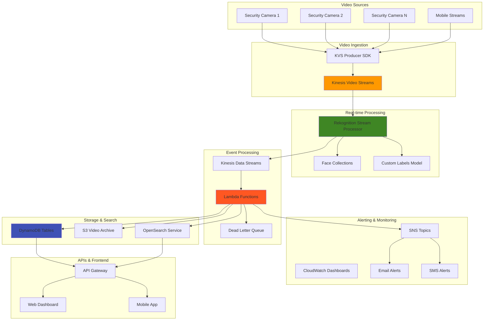

# Analyzing Video Streams with Rekognition and Kinesis

## Problem

Security and retail organizations require real-time analysis of video streams from hundreds of cameras to detect security incidents, monitor customer behavior, and ensure compliance with safety protocols. Traditional video surveillance systems only provide recording capabilities without intelligent analysis, forcing security teams to manually review hours of footage after incidents occur. Organizations need automated video analytics that can process live video streams, detect objects and faces in real-time, trigger immediate alerts for security events, and provide searchable metadata for forensic analysis while maintaining low latency and high accuracy.

## Solution

Implement a comprehensive real-time video analytics platform using Amazon Rekognition Video stream processing with Kinesis Video Streams for ingestion and Lambda for event-driven analytics. The solution provides automated detection of objects, faces, and activities with configurable alerting, real-time dashboards, and searchable video metadata storage. This architecture supports multiple video streams, custom detection models, and integration with existing security systems while maintaining GDPR and privacy compliance through configurable face recognition policies.

## Architecture Diagram



## Prerequisites

1. AWS account with Rekognition, Kinesis Video Streams, Lambda, DynamoDB, and SNS permissions
2. AWS CLI v2 installed and configured (or AWS CloudShell)
3. Basic understanding of video streaming and computer vision concepts
4. Test video sources or IP cameras for streaming (or use provided sample video)
5. Estimated cost: $100-200 for processing multiple video streams over several hours

> **Warning**: Rekognition Video stream processing and Kinesis Video Streams incur significant charges. Monitor usage carefully and clean up resources promptly after testing.

## Preparation

```bash
# Set environment variables
export AWS_REGION=$(aws configure get region)
export AWS_ACCOUNT_ID=$(aws sts get-caller-identity \
    --query Account --output text)

# Generate unique identifiers
RANDOM_SUFFIX=$(aws secretsmanager get-random-password \
    --exclude-punctuation --exclude-uppercase \
    --password-length 6 --require-each-included-type \
    --output text --query RandomPassword)

export PROJECT_NAME="video-analytics-${RANDOM_SUFFIX}"
export STREAM_NAME="security-stream-${RANDOM_SUFFIX}"
export ROLE_NAME="VideoAnalyticsRole-${RANDOM_SUFFIX}"
export COLLECTION_NAME="security-faces-${RANDOM_SUFFIX}"

# Create IAM role for video analytics
cat > trust-policy.json << EOF
{
  "Version": "2012-10-17",
  "Statement": [
    {
      "Effect": "Allow",
      "Principal": {
        "Service": [
          "lambda.amazonaws.com",
          "rekognition.amazonaws.com"
        ]
      },
      "Action": "sts:AssumeRole"
    }
  ]
}
EOF

# Create custom policy for DynamoDB and SNS access
cat > video-analytics-policy.json << EOF
{
  "Version": "2012-10-17",
  "Statement": [
    {
      "Effect": "Allow",
      "Action": [
        "dynamodb:PutItem",
        "dynamodb:Query",
        "dynamodb:Scan",
        "dynamodb:GetItem",
        "dynamodb:UpdateItem",
        "dynamodb:DeleteItem"
      ],
      "Resource": [
        "arn:aws:dynamodb:${AWS_REGION}:${AWS_ACCOUNT_ID}:table/${PROJECT_NAME}-*"
      ]
    },
    {
      "Effect": "Allow",
      "Action": [
        "sns:Publish"
      ],
      "Resource": "arn:aws:sns:${AWS_REGION}:${AWS_ACCOUNT_ID}:${PROJECT_NAME}-*"
    },
    {
      "Effect": "Allow",
      "Action": [
        "kinesis:PutRecord",
        "kinesis:PutRecords",
        "kinesis:GetRecords",
        "kinesis:GetShardIterator",
        "kinesis:DescribeStream",
        "kinesis:ListStreams"
      ],
      "Resource": "arn:aws:kinesis:${AWS_REGION}:${AWS_ACCOUNT_ID}:stream/${PROJECT_NAME}-*"
    }
  ]
}
EOF

aws iam create-role \
    --role-name ${ROLE_NAME} \
    --assume-role-policy-document file://trust-policy.json

# Create and attach custom policy
aws iam create-policy \
    --policy-name "${PROJECT_NAME}-policy" \
    --policy-document file://video-analytics-policy.json

# Attach required policies
aws iam attach-role-policy \
    --role-name ${ROLE_NAME} \
    --policy-arn arn:aws:iam::aws:policy/AmazonRekognitionFullAccess

aws iam attach-role-policy \
    --role-name ${ROLE_NAME} \
    --policy-arn arn:aws:iam::aws:policy/AmazonKinesisVideoStreamsFullAccess

aws iam attach-role-policy \
    --role-name ${ROLE_NAME} \
    --policy-arn arn:aws:iam::aws:policy/service-role/AWSLambdaBasicExecutionRole

aws iam attach-role-policy \
    --role-name ${ROLE_NAME} \
    --policy-arn "arn:aws:iam::${AWS_ACCOUNT_ID}:policy/${PROJECT_NAME}-policy"

export ROLE_ARN="arn:aws:iam::${AWS_ACCOUNT_ID}:role/${ROLE_NAME}"

echo "✅ Created IAM role and set environment variables"
```

## Steps

1. **Create Kinesis Video Stream**:

   Amazon Kinesis Video Streams provides a fully managed service for securely streaming video from connected devices to AWS for analytics, machine learning, and storage. This foundational component serves as the ingestion layer for our real-time video analytics pipeline, enabling scalable processing of multiple camera feeds with built-in durability and encryption.

   ```bash
   # Create video stream for ingestion
   aws kinesisvideo create-stream \
       --stream-name ${STREAM_NAME} \
       --data-retention-in-hours 24 \
       --media-type "video/h264"
   
   # Wait for stream to be active
   sleep 10
   
   # Get stream information
   STREAM_ARN=$(aws kinesisvideo describe-stream \
       --stream-name ${STREAM_NAME} \
       --query 'StreamInfo.StreamARN' \
       --output text)
   
   echo "✅ Created Kinesis Video Stream: ${STREAM_ARN}"
   ```

   The video stream is now configured with H.264 encoding support and 24-hour retention, providing a reliable ingestion point for camera feeds. This establishes the foundation for real-time processing while ensuring video data remains available for forensic analysis within the retention window.

2. **Create Face Collection for Recognition**:

   Amazon Rekognition face collections enable facial recognition by storing facial feature vectors derived from reference images. This creates a searchable database of known individuals, allowing the system to identify authorized personnel, flagged individuals, or persons of interest in real-time video streams. The collection uses machine learning algorithms to extract facial features while maintaining privacy through mathematical representations rather than storing actual images.

   ```bash
   # Create Rekognition face collection
   aws rekognition create-collection \
       --collection-id ${COLLECTION_NAME}
   
   # Verify collection creation
   aws rekognition describe-collection \
       --collection-id ${COLLECTION_NAME}
   
   echo "✅ Created face collection: ${COLLECTION_NAME}"
   ```

   The face collection is now ready to store facial feature vectors for comparison against video streams. In production environments, you would populate this collection with reference images of authorized personnel, enabling automated access control and security monitoring capabilities.

3. **Create Data Stream for Analytics Results**:

   Kinesis Data Streams provides a real-time data streaming service that captures and delivers analysis results from Rekognition stream processors. This creates a scalable pipeline for processing detection events, enabling downstream applications to consume and react to video analytics results in near real-time. The two-shard configuration provides sufficient throughput for multiple video streams while maintaining ordered processing of detection events.

   ```bash
   # Create Kinesis Data Stream for processing results
   aws kinesis create-stream \
       --stream-name "${PROJECT_NAME}-analytics" \
       --shard-count 2
   
   # Wait for stream to become active
   aws kinesis wait stream-exists \
       --stream-name "${PROJECT_NAME}-analytics"
   
   DATA_STREAM_ARN="arn:aws:kinesis:${AWS_REGION}:${AWS_ACCOUNT_ID}:stream/${PROJECT_NAME}-analytics"
   
   echo "✅ Created analytics data stream: ${DATA_STREAM_ARN}"
   ```

   The analytics data stream is now active and ready to receive detection results from Rekognition stream processors. This establishes the event-driven processing pipeline that enables real-time alerting, data persistence, and integration with downstream analytics systems.

4. **Create DynamoDB Tables for Metadata Storage**:

   DynamoDB provides a fast, scalable NoSQL database for storing video analytics metadata with single-digit millisecond latency. The detection events table uses a composite key structure (StreamName + Timestamp) enabling efficient queries for specific camera feeds and time ranges. The faces table organizes facial recognition data by FaceId, supporting rapid lookups for person tracking and historical analysis. This design enables forensic searches, trend analysis, and real-time dashboard updates.

   ```bash
   # Create table for detection events
   aws dynamodb create-table \
       --table-name "${PROJECT_NAME}-detections" \
       --attribute-definitions \
           AttributeName=StreamName,AttributeType=S \
           AttributeName=Timestamp,AttributeType=N \
       --key-schema \
           AttributeName=StreamName,KeyType=HASH \
           AttributeName=Timestamp,KeyType=RANGE \
       --provisioned-throughput \
           ReadCapacityUnits=5,WriteCapacityUnits=5
   
   # Create table for face metadata
   aws dynamodb create-table \
       --table-name "${PROJECT_NAME}-faces" \
       --attribute-definitions \
           AttributeName=FaceId,AttributeType=S \
           AttributeName=Timestamp,AttributeType=N \
       --key-schema \
           AttributeName=FaceId,KeyType=HASH \
           AttributeName=Timestamp,KeyType=RANGE \
       --provisioned-throughput \
           ReadCapacityUnits=5,WriteCapacityUnits=5
   
   # Wait for tables to be active
   aws dynamodb wait table-exists \
       --table-name "${PROJECT_NAME}-detections"
   
   aws dynamodb wait table-exists \
       --table-name "${PROJECT_NAME}-faces"
   
   echo "✅ Created DynamoDB tables for metadata storage"
   ```

   Both DynamoDB tables are now active and optimized for video analytics workloads. The detection events table enables time-series queries for incident investigation, while the faces table supports person tracking across multiple camera feeds. The provisioned throughput configuration provides consistent performance for real-time ingestion and querying.

5. **Create Lambda Function for Processing Analytics**:

   AWS Lambda provides serverless compute for processing video analytics events in real-time without managing infrastructure. This function processes detection results from the Kinesis data stream, performing intelligent filtering, data transformation, and automated alerting. The serverless architecture automatically scales to handle varying video processing loads while implementing business logic for security event classification and response workflows.

   ```bash
   # Create analytics processing Lambda function
   cat > analytics_processor.py << 'EOF'
import json
import boto3
import base64
from datetime import datetime
import os

dynamodb = boto3.resource('dynamodb')
sns = boto3.client('sns')
rekognition = boto3.client('rekognition')

DETECTIONS_TABLE = os.environ['DETECTIONS_TABLE']
FACES_TABLE = os.environ['FACES_TABLE']
SNS_TOPIC_ARN = os.environ.get('SNS_TOPIC_ARN')

def lambda_handler(event, context):
    for record in event['Records']:
        # Decode Kinesis data
        payload = base64.b64decode(record['kinesis']['data'])
        data = json.loads(payload)
        
        try:
            process_detection_event(data)
        except Exception as e:
            print(f"Error processing record: {str(e)}")
            
    return {'statusCode': 200}

def process_detection_event(data):
    timestamp = datetime.now().timestamp()
    stream_name = data.get('StreamName', 'unknown')
    
    # Process face detections
    if 'FaceSearchResponse' in data:
        process_face_detection(data['FaceSearchResponse'], stream_name, timestamp)
    
    # Process label detections
    if 'LabelDetectionResponse' in data:
        process_label_detection(data['LabelDetectionResponse'], stream_name, timestamp)
    
    # Process person tracking
    if 'PersonTrackingResponse' in data:
        process_person_tracking(data['PersonTrackingResponse'], stream_name, timestamp)

def process_face_detection(face_data, stream_name, timestamp):
    table = dynamodb.Table(FACES_TABLE)
    
    for face_match in face_data.get('FaceMatches', []):
        face_id = face_match['Face']['FaceId']
        confidence = face_match['Face']['Confidence']
        similarity = face_match['Similarity']
        
        # Store face detection event
        table.put_item(
            Item={
                'FaceId': face_id,
                'Timestamp': int(timestamp * 1000),
                'StreamName': stream_name,
                'Confidence': str(confidence),
                'Similarity': str(similarity),
                'BoundingBox': face_match['Face']['BoundingBox']
            }
        )
        
        # Send alert for high-confidence matches
        if similarity > 90:
            send_alert(f"High confidence face match detected: {face_id}", 
                      f"Similarity: {similarity}%, Stream: {stream_name}")

def process_label_detection(label_data, stream_name, timestamp):
    table = dynamodb.Table(DETECTIONS_TABLE)
    
    for label in label_data.get('Labels', []):
        label_name = label['Label']['Name']
        confidence = label['Label']['Confidence']
        
        # Store detection event
        table.put_item(
            Item={
                'StreamName': stream_name,
                'Timestamp': int(timestamp * 1000),
                'DetectionType': 'Label',
                'Label': label_name,
                'Confidence': str(confidence),
                'BoundingBox': json.dumps(label['Label'].get('BoundingBox', {}))
            }
        )
        
        # Check for security-relevant objects
        security_objects = ['Weapon', 'Gun', 'Knife', 'Person', 'Car', 'Motorcycle']
        if label_name in security_objects and confidence > 80:
            send_alert(f"Security object detected: {label_name}", 
                      f"Confidence: {confidence}%, Stream: {stream_name}")

def process_person_tracking(person_data, stream_name, timestamp):
    table = dynamodb.Table(DETECTIONS_TABLE)
    
    for person in person_data.get('Persons', []):
        person_id = person.get('Index', 'unknown')
        
        # Store person tracking event
        table.put_item(
            Item={
                'StreamName': stream_name,
                'Timestamp': int(timestamp * 1000),
                'DetectionType': 'Person',
                'PersonId': str(person_id),
                'BoundingBox': json.dumps(person.get('BoundingBox', {}))
            }
        )

def send_alert(subject, message):
    if SNS_TOPIC_ARN:
        try:
            sns.publish(
                TopicArn=SNS_TOPIC_ARN,
                Subject=subject,
                Message=message
            )
        except Exception as e:
            print(f"Failed to send alert: {str(e)}")
EOF
   
   # Create deployment package
   zip analytics_processor.zip analytics_processor.py
   
   # Create Lambda function with updated runtime
   aws lambda create-function \
       --function-name "${PROJECT_NAME}-analytics-processor" \
       --runtime python3.12 \
       --role ${ROLE_ARN} \
       --handler analytics_processor.lambda_handler \
       --zip-file fileb://analytics_processor.zip \
       --timeout 60 \
       --environment Variables="{DETECTIONS_TABLE=${PROJECT_NAME}-detections,FACES_TABLE=${PROJECT_NAME}-faces}"
   
   echo "✅ Created analytics processing Lambda function"
   ```

   The analytics processing Lambda function is now deployed and ready to consume detection events from the Kinesis data stream. This establishes the intelligent processing layer that transforms raw detection data into actionable insights, automatically storing metadata in DynamoDB and triggering alerts for security-relevant events.

6. **Create Stream Processor for Real-time Analysis**:

   Amazon Rekognition stream processors provide the core computer vision capabilities for real-time video analysis. This managed service continuously analyzes video frames from Kinesis Video Streams, detecting faces, objects, and activities with configurable confidence thresholds. The face search configuration enables automatic comparison against the face collection, while maintaining an 80% similarity threshold to balance accuracy with false positive prevention. This creates a highly scalable video analytics engine without requiring custom machine learning model development.

   ```bash
   # Create stream processor configuration
   cat > stream_processor_config.json << EOF
{
  "Name": "${PROJECT_NAME}-processor",
  "Input": {
    "KinesisVideoStream": {
      "Arn": "${STREAM_ARN}"
    }
  },
  "Output": {
    "KinesisDataStream": {
      "Arn": "${DATA_STREAM_ARN}"
    }
  },
  "RoleArn": "${ROLE_ARN}",
  "Settings": {
    "FaceSearch": {
      "CollectionId": "${COLLECTION_NAME}",
      "FaceMatchThreshold": 80.0
    }
  }
}
EOF
   
   # Create the stream processor
   aws rekognition create-stream-processor \
       --cli-input-json file://stream_processor_config.json
   
   # Wait for processor to be ready
   sleep 10
   
   # Start the stream processor
   aws rekognition start-stream-processor \
       --name "${PROJECT_NAME}-processor"
   
   echo "✅ Created and started Rekognition stream processor"
   ```

   The Rekognition stream processor is now actively analyzing video frames and outputting detection results to the Kinesis data stream. This establishes continuous computer vision processing that automatically identifies faces, objects, and activities in real-time, enabling immediate response to security events and operational insights.

7. **Configure Lambda Trigger for Data Stream**:

   Event source mapping creates an automated trigger that invokes the Lambda function whenever new detection events arrive in the Kinesis data stream. This establishes a real-time processing pipeline where video analytics results are immediately processed for alerting, storage, and business logic execution. The batch size of 10 optimizes processing efficiency while maintaining low latency for time-sensitive security events.

   ```bash
   # Create event source mapping for Kinesis to Lambda
   aws lambda create-event-source-mapping \
       --function-name "${PROJECT_NAME}-analytics-processor" \
       --event-source-arn ${DATA_STREAM_ARN} \
       --starting-position LATEST \
       --batch-size 10
   
   echo "✅ Configured Lambda trigger for analytics processing"
   ```

   The event-driven processing pipeline is now complete, automatically invoking the analytics Lambda function for each batch of detection events. This ensures immediate processing and response to video analytics results without requiring polling or manual intervention.

8. **Create SNS Topic for Alerts**:

   Amazon Simple Notification Service (SNS) provides a fully managed messaging service for delivering security alerts and notifications to multiple endpoints. This enables immediate notification of critical security events detected in video streams, supporting email, SMS, and webhook delivery methods. The pub/sub model allows multiple stakeholders to receive alerts simultaneously while maintaining flexible subscription management for different alert types and severity levels.

   ```bash
   # Create SNS topic for security alerts
   TOPIC_ARN=$(aws sns create-topic \
       --name "${PROJECT_NAME}-security-alerts" \
       --query 'TopicArn' --output text)
   
   # Update Lambda environment with SNS topic
   aws lambda update-function-configuration \
       --function-name "${PROJECT_NAME}-analytics-processor" \
       --environment Variables="{DETECTIONS_TABLE=${PROJECT_NAME}-detections,FACES_TABLE=${PROJECT_NAME}-faces,SNS_TOPIC_ARN=${TOPIC_ARN}}"
   
   # Subscribe email to SNS topic (replace with your email)
   read -p "Enter email address for alerts: " EMAIL_ADDRESS
   aws sns subscribe \
       --topic-arn ${TOPIC_ARN} \
       --protocol email \
       --notification-endpoint ${EMAIL_ADDRESS}
   
   echo "✅ Created SNS topic and email subscription"
   echo "Check your email and confirm the subscription"
   ```

   The alerting system is now configured to deliver real-time notifications for security events detected in video streams. The Lambda function can automatically send alerts when high-confidence face matches or security-relevant objects are detected, enabling immediate response to potential incidents.

9. **Create API for Video Analytics Queries**:

   API Gateway with Lambda provides a scalable RESTful interface for querying video analytics data stored in DynamoDB. This enables integration with security dashboards, mobile applications, and third-party systems for forensic analysis and operational reporting. The API supports time-range queries, stream-specific searches, and statistical analysis, providing programmatic access to detection metadata and facial recognition results.

   ```bash
   # Create Lambda function for API queries
   cat > query_api.py << 'EOF'
import json
import boto3
from boto3.dynamodb.conditions import Key
from datetime import datetime, timedelta

dynamodb = boto3.resource('dynamodb')

def lambda_handler(event, context):
    try:
        # Parse request
        http_method = event['httpMethod']
        path = event['path']
        query_params = event.get('queryStringParameters', {}) or {}
        
        if path == '/detections' and http_method == 'GET':
            return get_detections(query_params)
        elif path == '/faces' and http_method == 'GET':
            return get_face_detections(query_params)
        elif path == '/stats' and http_method == 'GET':
            return get_statistics(query_params)
        else:
            return {
                'statusCode': 404,
                'body': json.dumps({'error': 'Not found'})
            }
            
    except Exception as e:
        return {
            'statusCode': 500,
            'body': json.dumps({'error': str(e)})
        }

def get_detections(params):
    table = dynamodb.Table(f"{params.get('project', 'video-analytics')}-detections")
    
    stream_name = params.get('stream')
    hours_back = int(params.get('hours', 24))
    
    if not stream_name:
        return {
            'statusCode': 400,
            'body': json.dumps({'error': 'stream parameter required'})
        }
    
    # Query recent detections
    start_time = int((datetime.now() - timedelta(hours=hours_back)).timestamp() * 1000)
    
    response = table.query(
        KeyConditionExpression=Key('StreamName').eq(stream_name) & 
                             Key('Timestamp').gte(start_time),
        ScanIndexForward=False,
        Limit=100
    )
    
    return {
        'statusCode': 200,
        'headers': {
            'Content-Type': 'application/json',
            'Access-Control-Allow-Origin': '*'
        },
        'body': json.dumps({
            'detections': response['Items'],
            'count': len(response['Items'])
        })
    }

def get_face_detections(params):
    table = dynamodb.Table(f"{params.get('project', 'video-analytics')}-faces")
    
    # Scan recent face detections (in production, use GSI for better performance)
    response = table.scan(
        Limit=50
    )
    
    return {
        'statusCode': 200,
        'headers': {
            'Content-Type': 'application/json',
            'Access-Control-Allow-Origin': '*'
        },
        'body': json.dumps({
            'faces': response['Items'],
            'count': len(response['Items'])
        })
    }

def get_statistics(params):
    # Simple statistics - in production, use OpenSearch or analytics service
    return {
        'statusCode': 200,
        'headers': {
            'Content-Type': 'application/json',
            'Access-Control-Allow-Origin': '*'
        },
        'body': json.dumps({
            'message': 'Statistics endpoint - implement with your analytics requirements',
            'timestamp': datetime.now().isoformat()
        })
    }
EOF
   
   # Create deployment package
   zip query_api.zip query_api.py
   
   # Create API Lambda function
   aws lambda create-function \
       --function-name "${PROJECT_NAME}-query-api" \
       --runtime python3.12 \
       --role ${ROLE_ARN} \
       --handler query_api.lambda_handler \
       --zip-file fileb://query_api.zip \
       --timeout 30
   
   # Create API Gateway (HTTP API)
   API_ID=$(aws apigatewayv2 create-api \
       --name "${PROJECT_NAME}-api" \
       --protocol-type HTTP \
       --target "arn:aws:lambda:${AWS_REGION}:${AWS_ACCOUNT_ID}:function:${PROJECT_NAME}-query-api" \
       --query 'ApiId' --output text)
   
   # Add Lambda permission for API Gateway
   aws lambda add-permission \
       --function-name "${PROJECT_NAME}-query-api" \
       --statement-id api-gateway-invoke \
       --action lambda:InvokeFunction \
       --principal apigateway.amazonaws.com \
       --source-arn "arn:aws:execute-api:${AWS_REGION}:${AWS_ACCOUNT_ID}:${API_ID}/*/*"
   
   # Get API endpoint
   API_ENDPOINT=$(aws apigatewayv2 get-api \
       --api-id ${API_ID} \
       --query 'ApiEndpoint' --output text)
   
   echo "✅ Created query API: ${API_ENDPOINT}"
   ```

   The video analytics query API is now available for integration with dashboards and applications. This RESTful interface enables secure access to detection metadata, supporting forensic investigations, operational reporting, and real-time monitoring of video analytics results across multiple camera feeds.

## Validation & Testing

1. **Test Video Stream Ingestion**:

   ```bash
   # Check stream processor status
   aws rekognition describe-stream-processor \
       --name "${PROJECT_NAME}-processor"
   
   # Verify data stream is active
   aws kinesis describe-stream \
       --stream-name "${PROJECT_NAME}-analytics"
   ```

   Expected output: Stream processor in "RUNNING" state and data stream showing "ACTIVE" status.

2. **Test Analytics API**:

   ```bash
   # Test detections endpoint (replace with actual stream name after sending video)
   curl "${API_ENDPOINT}/detections?stream=${STREAM_NAME}&hours=1"
   
   # Test faces endpoint
   curl "${API_ENDPOINT}/faces?project=${PROJECT_NAME}"
   
   # Test statistics endpoint
   curl "${API_ENDPOINT}/stats"
   ```

3. **Send Sample Video to Stream** (Optional):

   ```bash
   # Note: This requires actual video file and KVS Producer SDK
   # For testing purposes, use AWS console to send test video
   echo "To test with actual video:"
   echo "1. Use KVS Producer SDK or GStreamer to send video"
   echo "2. Upload test video through AWS Console"
   echo "3. Monitor DynamoDB tables for detection results"
   ```

4. **Monitor Detection Results**:

   ```bash
   # Check DynamoDB for detection events
   aws dynamodb scan \
       --table-name "${PROJECT_NAME}-detections" \
       --limit 10
   
   # Check for face detection events
   aws dynamodb scan \
       --table-name "${PROJECT_NAME}-faces" \
       --limit 10
   ```

5. **Verify Lambda Function Logs**:

   ```bash
   # Check Lambda function logs for processing activity
   aws logs describe-log-groups \
       --log-group-name-prefix "/aws/lambda/${PROJECT_NAME}"
   
   # View recent log events
   aws logs describe-log-streams \
       --log-group-name "/aws/lambda/${PROJECT_NAME}-analytics-processor" \
       --order-by LastEventTime \
       --descending \
       --max-items 1
   ```

## Cleanup

1. **Stop Stream Processor**:

   ```bash
   # Stop and delete stream processor
   aws rekognition stop-stream-processor \
       --name "${PROJECT_NAME}-processor"
   
   # Wait for processor to stop
   sleep 30
   
   aws rekognition delete-stream-processor \
       --name "${PROJECT_NAME}-processor"
   
   echo "✅ Stopped and deleted stream processor"
   ```

2. **Delete Lambda Functions and API Gateway**:

   ```bash
   # Delete event source mapping first
   EVENT_SOURCE_UUID=$(aws lambda list-event-source-mappings \
       --function-name "${PROJECT_NAME}-analytics-processor" \
       --query 'EventSourceMappings[0].UUID' \
       --output text)
   
   if [ "$EVENT_SOURCE_UUID" != "None" ]; then
       aws lambda delete-event-source-mapping \
           --uuid ${EVENT_SOURCE_UUID}
   fi
   
   # Delete Lambda functions
   aws lambda delete-function \
       --function-name "${PROJECT_NAME}-analytics-processor"
   
   aws lambda delete-function \
       --function-name "${PROJECT_NAME}-query-api"
   
   # Delete API Gateway
   aws apigatewayv2 delete-api --api-id ${API_ID}
   
   echo "✅ Deleted Lambda functions and API Gateway"
   ```

3. **Delete DynamoDB Tables and Streams**:

   ```bash
   # Delete DynamoDB tables
   aws dynamodb delete-table \
       --table-name "${PROJECT_NAME}-detections"
   
   aws dynamodb delete-table \
       --table-name "${PROJECT_NAME}-faces"
   
   # Delete Kinesis streams
   aws kinesis delete-stream \
       --stream-name "${PROJECT_NAME}-analytics" \
       --enforce-consumer-deletion
   
   aws kinesisvideo delete-stream \
       --stream-arn ${STREAM_ARN}
   
   echo "✅ Deleted storage resources"
   ```

4. **Clean up Remaining Resources**:

   ```bash
   # Delete face collection
   aws rekognition delete-collection \
       --collection-id ${COLLECTION_NAME}
   
   # Delete SNS topic
   aws sns delete-topic --topic-arn ${TOPIC_ARN}
   
   # Delete IAM role and policy
   aws iam detach-role-policy \
       --role-name ${ROLE_NAME} \
       --policy-arn arn:aws:iam::aws:policy/AmazonRekognitionFullAccess
   
   aws iam detach-role-policy \
       --role-name ${ROLE_NAME} \
       --policy-arn arn:aws:iam::aws:policy/AmazonKinesisVideoStreamsFullAccess
   
   aws iam detach-role-policy \
       --role-name ${ROLE_NAME} \
       --policy-arn arn:aws:iam::aws:policy/service-role/AWSLambdaBasicExecutionRole
   
   aws iam detach-role-policy \
       --role-name ${ROLE_NAME} \
       --policy-arn "arn:aws:iam::${AWS_ACCOUNT_ID}:policy/${PROJECT_NAME}-policy"
   
   aws iam delete-policy \
       --policy-arn "arn:aws:iam::${AWS_ACCOUNT_ID}:policy/${PROJECT_NAME}-policy"
   
   aws iam delete-role --role-name ${ROLE_NAME}
   
   # Clean up local files
   rm -f trust-policy.json video-analytics-policy.json \
         stream_processor_config.json \
         analytics_processor.py analytics_processor.zip \
         query_api.py query_api.zip
   
   echo "✅ Cleaned up all resources"
   ```

## Discussion

This real-time video analytics solution demonstrates the power of combining Amazon Rekognition's computer vision capabilities with Kinesis Video Streams for scalable video ingestion and processing. The architecture supports high-throughput video analysis with low latency, making it suitable for security monitoring, retail analytics, and smart city applications following AWS Well-Architected Framework principles for operational excellence, security, and cost optimization.

The stream processor provides continuous analysis of video feeds, automatically detecting faces, objects, and activities without requiring manual intervention. The event-driven architecture using Lambda ensures that detection results are processed immediately and can trigger real-time alerts or actions. DynamoDB provides fast access to detection metadata, enabling rapid searches and analytics queries with single-digit millisecond response times.

For production deployments, consider implementing additional features such as custom Rekognition models for domain-specific object detection, integration with existing security systems through webhooks or message queues, and advanced analytics using Amazon OpenSearch Service for complex queries and visualizations. The solution can be extended to support facial recognition with privacy controls, anomaly detection using Amazon Lookout for Vision, and automated incident response workflows.

The serverless architecture automatically scales to handle varying video processing loads while maintaining cost efficiency through pay-per-use pricing models. This approach eliminates infrastructure management overhead while providing enterprise-grade reliability and security. See the [AWS Well-Architected Framework](https://docs.aws.amazon.com/wellarchitected/latest/framework/welcome.html) for additional architectural guidance.

> **Note**: Amazon Rekognition Video supports multiple concurrent stream processors, enabling analysis of dozens of camera feeds simultaneously. For large-scale deployments, consider implementing regional distribution and edge processing with AWS IoT Greengrass to reduce latency and bandwidth costs. Review the [Amazon Rekognition Video streaming documentation](https://docs.aws.amazon.com/rekognition/latest/dg/streaming-video.html) for scaling best practices.

> **Tip**: Use Rekognition Custom Labels to train models for specific objects relevant to your use case, such as detecting specific uniforms, equipment, or safety violations in industrial environments. See the [Amazon Rekognition Custom Labels Developer Guide](https://docs.aws.amazon.com/rekognition/latest/customlabels-dg/) for training requirements and best practices.

> **Warning**: Monitor Rekognition and Kinesis Video Streams costs carefully, as continuous video processing can generate significant charges. Implement automated shutoff mechanisms and cost alerts to prevent unexpected billing. Use [AWS Cost Anomaly Detection](https://docs.aws.amazon.com/awsaccountbilling/latest/aboutv2/manage-ad.html) for proactive cost monitoring.

## Challenge

Enhance this video analytics platform with these advanced capabilities:

1. **Multi-Camera Correlation**: Implement person tracking across multiple cameras using facial recognition and similarity matching to follow individuals through different areas
2. **Custom Object Detection**: Train and deploy Rekognition Custom Labels models to detect domain-specific objects like safety equipment, specific vehicles, or hazardous materials
3. **Real-time Dashboards**: Build interactive dashboards using Amazon QuickSight or custom web applications to visualize detection patterns, heat maps, and live video feeds
4. **Behavioral Analytics**: Implement complex event processing to detect suspicious behaviors, crowd formation, or loitering using temporal analysis of detection events
5. **Edge Processing**: Deploy AWS IoT Greengrass with local Rekognition processing for low-latency analysis and reduced bandwidth usage in remote locations

## Infrastructure Code

*Infrastructure code will be generated after recipe approval.*