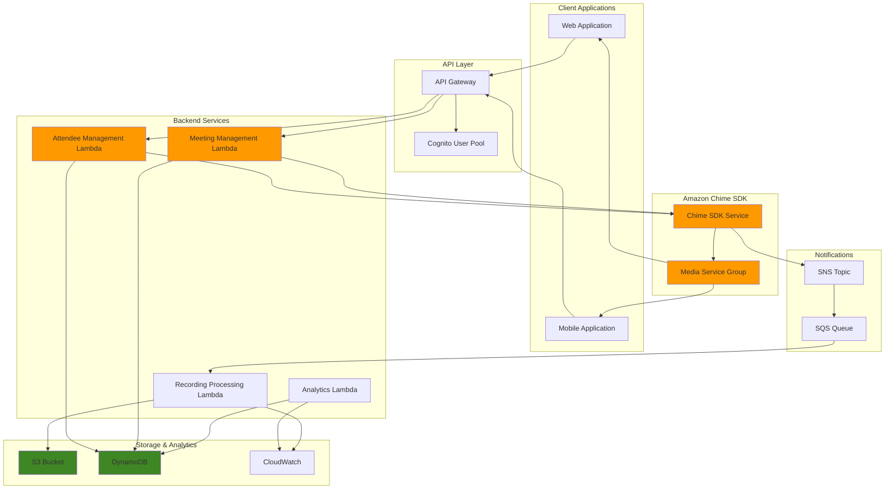

# Custom Video Conferencing with Amazon Chime SDK


## Problem

Modern businesses need custom video conferencing solutions that can be seamlessly integrated into their existing applications, branding, and workflows. Traditional video conferencing platforms offer limited customization options, lack programmatic control, and don't provide the flexibility to build domain-specific features like custom analytics, compliance recording, or specialized collaboration tools. Companies struggle to create differentiated communication experiences that align with their specific business requirements and user interface standards.

## Solution

Amazon Chime SDK provides a comprehensive set of APIs and client libraries to build custom video conferencing applications with full control over the user experience. This solution demonstrates how to create a scalable video conferencing platform using Chime SDK for real-time audio/video communications, Lambda for backend logic, API Gateway for RESTful endpoints, and S3 for storing meeting recordings and artifacts. The architecture supports custom branding, advanced meeting features, and seamless integration with existing business applications.

## Architecture Diagram



## Prerequisites

1. AWS account with appropriate permissions for Chime SDK, Lambda, API Gateway, DynamoDB, and S3
2. AWS CLI v2 installed and configured (or AWS CloudShell)
3. Node.js 18+ and npm for client-side development
4. Basic knowledge of JavaScript/TypeScript and REST APIs
5. Understanding of real-time communication concepts (WebRTC, signaling)
6. Estimated cost: $50-100/month for development environment (depends on meeting usage)

> **Note**: Amazon Chime SDK charges per attendee-minute for meetings. Review the [pricing](https://aws.amazon.com/chime/chime-sdk/pricing/) before deploying to production.

## Preparation

```bash
# Set environment variables
export AWS_REGION=$(aws configure get region)
export AWS_ACCOUNT_ID=$(aws sts get-caller-identity \
    --query Account --output text)

# Generate unique identifiers for resources
RANDOM_SUFFIX=$(aws secretsmanager get-random-password \
    --exclude-punctuation --exclude-uppercase \
    --password-length 6 --require-each-included-type \
    --output text --query RandomPassword)

export PROJECT_NAME="video-conferencing-${RANDOM_SUFFIX}"
export BUCKET_NAME="${PROJECT_NAME}-recordings"
export TABLE_NAME="${PROJECT_NAME}-meetings"
export SNS_TOPIC_NAME="${PROJECT_NAME}-events"

# Create S3 bucket for recordings
aws s3 mb s3://${BUCKET_NAME} --region ${AWS_REGION}

# Create DynamoDB table for meeting metadata
aws dynamodb create-table \
    --table-name ${TABLE_NAME} \
    --attribute-definitions \
        AttributeName=MeetingId,AttributeType=S \
        AttributeName=CreatedAt,AttributeType=S \
    --key-schema \
        AttributeName=MeetingId,KeyType=HASH \
        AttributeName=CreatedAt,KeyType=RANGE \
    --provisioned-throughput \
        ReadCapacityUnits=5,WriteCapacityUnits=5 \
    --region ${AWS_REGION}

# Create SNS topic for event notifications
aws sns create-topic \
    --name ${SNS_TOPIC_NAME} \
    --region ${AWS_REGION}

export SNS_TOPIC_ARN=$(aws sns get-topic-attributes \
    --topic-arn arn:aws:sns:${AWS_REGION}:${AWS_ACCOUNT_ID}:${SNS_TOPIC_NAME} \
    --query 'Attributes.TopicArn' --output text)

echo "✅ Foundation resources created successfully"
```

## Steps

1. **Create IAM Role for Lambda Functions**:

   IAM roles establish secure, temporary credential delegation for AWS services following the principle of least privilege. Creating a dedicated role for Lambda functions enables secure access to Chime SDK APIs, DynamoDB storage, and S3 resources without hardcoding credentials. This security foundation ensures your video conferencing application can scale while maintaining enterprise-grade access controls.

   ```bash
   # Create trust policy for Lambda
   cat > lambda-trust-policy.json << EOF
   {
       "Version": "2012-10-17",
       "Statement": [
           {
               "Effect": "Allow",
               "Principal": {
                   "Service": "lambda.amazonaws.com"
               },
               "Action": "sts:AssumeRole"
           }
       ]
   }
   EOF
   
   # Create IAM role
   aws iam create-role \
       --role-name ${PROJECT_NAME}-lambda-role \
       --assume-role-policy-document file://lambda-trust-policy.json
   
   # Attach basic Lambda execution policy
   aws iam attach-role-policy \
       --role-name ${PROJECT_NAME}-lambda-role \
       --policy-arn arn:aws:iam::aws:policy/service-role/AWSLambdaBasicExecutionRole
   
   # Create and attach Chime SDK policy
   cat > chime-sdk-policy.json << EOF
   {
       "Version": "2012-10-17",
       "Statement": [
           {
               "Effect": "Allow",
               "Action": [
                   "chime:CreateMeeting",
                   "chime:DeleteMeeting",
                   "chime:GetMeeting",
                   "chime:ListMeetings",
                   "chime:CreateAttendee",
                   "chime:DeleteAttendee",
                   "chime:GetAttendee",
                   "chime:ListAttendees",
                   "chime:BatchCreateAttendee",
                   "chime:BatchDeleteAttendee",
                   "chime:StartMeetingTranscription",
                   "chime:StopMeetingTranscription"
               ],
               "Resource": "*"
           },
           {
               "Effect": "Allow",
               "Action": [
                   "dynamodb:PutItem",
                   "dynamodb:GetItem",
                   "dynamodb:UpdateItem",
                   "dynamodb:DeleteItem",
                   "dynamodb:Query",
                   "dynamodb:Scan"
               ],
               "Resource": "arn:aws:dynamodb:${AWS_REGION}:${AWS_ACCOUNT_ID}:table/${TABLE_NAME}"
           },
           {
               "Effect": "Allow",
               "Action": [
                   "s3:PutObject",
                   "s3:GetObject",
                   "s3:DeleteObject"
               ],
               "Resource": "arn:aws:s3:::${BUCKET_NAME}/*"
           }
       ]
   }
   EOF
   
   aws iam put-role-policy \
       --role-name ${PROJECT_NAME}-lambda-role \
       --policy-name ChimeSDKPolicy \
       --policy-document file://chime-sdk-policy.json
   
   export LAMBDA_ROLE_ARN=$(aws iam get-role \
       --role-name ${PROJECT_NAME}-lambda-role \
       --query 'Role.Arn' --output text)
   
   echo "✅ IAM role created: ${LAMBDA_ROLE_ARN}"
   ```

   The IAM role is now configured with all necessary permissions for Chime SDK operations, DynamoDB access, and S3 storage. This security foundation enables Lambda functions to interact with AWS services using temporary, rotatable credentials rather than permanent access keys.

> **Warning**: Always follow the principle of least privilege when creating IAM policies. Grant only the minimum permissions required for your application to function, and regularly audit permissions to ensure they remain appropriate.

2. **Create Meeting Management Lambda Function**:

   Lambda functions provide serverless compute for meeting lifecycle management without infrastructure overhead. This function handles creating, retrieving, and deleting Chime SDK meetings while automatically scaling to handle concurrent requests. The serverless architecture eliminates capacity planning and provides cost-effective scaling for your video conferencing platform.

   ```bash
   # Create meeting management Lambda code
   cat > meeting-handler.js << 'EOF'
   const AWS = require('aws-sdk');
   const { v4: uuidv4 } = require('uuid');
   
   const chime = new AWS.ChimeSDKMeetings({
       region: process.env.AWS_REGION,
       endpoint: `https://meetings-chime.${process.env.AWS_REGION}.amazonaws.com`
   });
   
   const dynamodb = new AWS.DynamoDB.DocumentClient();
   
   exports.handler = async (event) => {
       const { httpMethod, path, body } = event;
       
       try {
           switch (httpMethod) {
               case 'POST':
                   if (path === '/meetings') {
                       return await createMeeting(JSON.parse(body));
                   }
                   break;
               case 'GET':
                   if (path.startsWith('/meetings/')) {
                       const meetingId = path.split('/')[2];
                       return await getMeeting(meetingId);
                   }
                   break;
               case 'DELETE':
                   if (path.startsWith('/meetings/')) {
                       const meetingId = path.split('/')[2];
                       return await deleteMeeting(meetingId);
                   }
                   break;
           }
           
           return {
               statusCode: 404,
               body: JSON.stringify({ error: 'Not found' })
           };
       } catch (error) {
           console.error('Error:', error);
           return {
               statusCode: 500,
               body: JSON.stringify({ error: 'Internal server error' })
           };
       }
   };
   
   async function createMeeting(requestBody) {
       const { externalMeetingId, mediaRegion, meetingHostId } = requestBody;
       
       const meetingRequest = {
           ClientRequestToken: uuidv4(),
           ExternalMeetingId: externalMeetingId || uuidv4(),
           MediaRegion: mediaRegion || process.env.AWS_REGION,
           MeetingHostId: meetingHostId,
           NotificationsConfiguration: {
               SnsTopicArn: process.env.SNS_TOPIC_ARN
           },
           MeetingFeatures: {
               Audio: {
                   EchoReduction: 'AVAILABLE'
               },
               Video: {
                   MaxResolution: 'HD'
               },
               Content: {
                   MaxResolution: 'FHD'
               }
           }
       };
       
       const meeting = await chime.createMeeting(meetingRequest).promise();
       
       // Store meeting metadata in DynamoDB
       await dynamodb.put({
           TableName: process.env.TABLE_NAME,
           Item: {
               MeetingId: meeting.Meeting.MeetingId,
               CreatedAt: new Date().toISOString(),
               ExternalMeetingId: meeting.Meeting.ExternalMeetingId,
               MediaRegion: meeting.Meeting.MediaRegion,
               Status: 'ACTIVE'
           }
       }).promise();
       
       return {
           statusCode: 201,
           headers: {
               'Content-Type': 'application/json',
               'Access-Control-Allow-Origin': '*'
           },
           body: JSON.stringify({
               Meeting: meeting.Meeting
           })
       };
   }
   
   async function getMeeting(meetingId) {
       const meeting = await chime.getMeeting({ MeetingId: meetingId }).promise();
       
       return {
           statusCode: 200,
           headers: {
               'Content-Type': 'application/json',
               'Access-Control-Allow-Origin': '*'
           },
           body: JSON.stringify({
               Meeting: meeting.Meeting
           })
       };
   }
   
   async function deleteMeeting(meetingId) {
       await chime.deleteMeeting({ MeetingId: meetingId }).promise();
       
       // Update meeting status in DynamoDB
       await dynamodb.update({
           TableName: process.env.TABLE_NAME,
           Key: { MeetingId: meetingId },
           UpdateExpression: 'SET #status = :status, UpdatedAt = :updatedAt',
           ExpressionAttributeNames: {
               '#status': 'Status'
           },
           ExpressionAttributeValues: {
               ':status': 'DELETED',
               ':updatedAt': new Date().toISOString()
           }
       }).promise();
       
       return {
           statusCode: 204,
           headers: {
               'Access-Control-Allow-Origin': '*'
           }
       };
   }
   EOF
   
   # Create deployment package
   npm init -y
   npm install aws-sdk uuid
   zip -r meeting-handler.zip meeting-handler.js node_modules/ package.json
   
   # Create Lambda function
   aws lambda create-function \
       --function-name ${PROJECT_NAME}-meeting-handler \
       --runtime nodejs18.x \
       --role ${LAMBDA_ROLE_ARN} \
       --handler meeting-handler.handler \
       --zip-file fileb://meeting-handler.zip \
       --environment Variables="{
           TABLE_NAME=${TABLE_NAME},
           SNS_TOPIC_ARN=${SNS_TOPIC_ARN}
       }" \
       --timeout 30
   
   echo "✅ Meeting management Lambda created"
   ```

   The meeting management Lambda is now deployed and ready to handle video conference requests. This serverless function automatically scales to accommodate varying meeting loads and provides the core API endpoints for creating and managing Chime SDK meetings.

3. **Create Attendee Management Lambda Function**:

   Attendee management controls participant access and capabilities within Chime SDK meetings. This Lambda function creates unique attendee credentials that enable secure access to audio, video, and content sharing features. Each attendee receives individual join tokens that establish their identity and permissions within the meeting session.

   ```bash
   # Create attendee management Lambda code
   cat > attendee-handler.js << 'EOF'
   const AWS = require('aws-sdk');
   const { v4: uuidv4 } = require('uuid');
   
   const chime = new AWS.ChimeSDKMeetings({
       region: process.env.AWS_REGION,
       endpoint: `https://meetings-chime.${process.env.AWS_REGION}.amazonaws.com`
   });
   
   exports.handler = async (event) => {
       const { httpMethod, path, body } = event;
       
       try {
           switch (httpMethod) {
               case 'POST':
                   if (path.startsWith('/meetings/') && path.endsWith('/attendees')) {
                       const meetingId = path.split('/')[2];
                       return await createAttendee(meetingId, JSON.parse(body));
                   }
                   break;
               case 'GET':
                   if (path.includes('/attendees/')) {
                       const pathParts = path.split('/');
                       const meetingId = pathParts[2];
                       const attendeeId = pathParts[4];
                       return await getAttendee(meetingId, attendeeId);
                   }
                   break;
               case 'DELETE':
                   if (path.includes('/attendees/')) {
                       const pathParts = path.split('/');
                       const meetingId = pathParts[2];
                       const attendeeId = pathParts[4];
                       return await deleteAttendee(meetingId, attendeeId);
                   }
                   break;
           }
           
           return {
               statusCode: 404,
               body: JSON.stringify({ error: 'Not found' })
           };
       } catch (error) {
           console.error('Error:', error);
           return {
               statusCode: 500,
               body: JSON.stringify({ error: 'Internal server error' })
           };
       }
   };
   
   async function createAttendee(meetingId, requestBody) {
       const { externalUserId, capabilities } = requestBody;
       
       const attendeeRequest = {
           MeetingId: meetingId,
           ExternalUserId: externalUserId || uuidv4(),
           Capabilities: capabilities || {
               Audio: 'SendReceive',
               Video: 'SendReceive',
               Content: 'SendReceive'
           }
       };
       
       const attendee = await chime.createAttendee(attendeeRequest).promise();
       
       return {
           statusCode: 201,
           headers: {
               'Content-Type': 'application/json',
               'Access-Control-Allow-Origin': '*'
           },
           body: JSON.stringify({
               Attendee: attendee.Attendee
           })
       };
   }
   
   async function getAttendee(meetingId, attendeeId) {
       const attendee = await chime.getAttendee({
           MeetingId: meetingId,
           AttendeeId: attendeeId
       }).promise();
       
       return {
           statusCode: 200,
           headers: {
               'Content-Type': 'application/json',
               'Access-Control-Allow-Origin': '*'
           },
           body: JSON.stringify({
               Attendee: attendee.Attendee
           })
       };
   }
   
   async function deleteAttendee(meetingId, attendeeId) {
       await chime.deleteAttendee({
           MeetingId: meetingId,
           AttendeeId: attendeeId
       }).promise();
       
       return {
           statusCode: 204,
           headers: {
               'Access-Control-Allow-Origin': '*'
           }
       };
   }
   EOF
   
   # Create deployment package
   zip -r attendee-handler.zip attendee-handler.js node_modules/ package.json
   
   # Create Lambda function
   aws lambda create-function \
       --function-name ${PROJECT_NAME}-attendee-handler \
       --runtime nodejs18.x \
       --role ${LAMBDA_ROLE_ARN} \
       --handler attendee-handler.handler \
       --zip-file fileb://attendee-handler.zip \
       --timeout 30
   
   echo "✅ Attendee management Lambda created"
   ```

   The attendee management system is now operational, providing secure participant onboarding and access control. This function ensures each meeting participant receives appropriate permissions and secure access credentials for the video conference.

4. **Create API Gateway REST API**:

   API Gateway provides a managed API layer that handles authentication, rate limiting, and request routing for your video conferencing backend. Creating a RESTful API structure enables clean separation between client applications and Lambda functions while providing consistent HTTP endpoints for meeting and attendee operations.

   ```bash
   # Create REST API
   export API_ID=$(aws apigateway create-rest-api \
       --name ${PROJECT_NAME}-api \
       --description "Video Conferencing API" \
       --query 'id' --output text)
   
   # Get root resource ID
   export ROOT_RESOURCE_ID=$(aws apigateway get-resources \
       --rest-api-id ${API_ID} \
       --query 'items[0].id' --output text)
   
   # Create /meetings resource
   export MEETINGS_RESOURCE_ID=$(aws apigateway create-resource \
       --rest-api-id ${API_ID} \
       --parent-id ${ROOT_RESOURCE_ID} \
       --path-part meetings \
       --query 'id' --output text)
   
   # Create /meetings/{meetingId} resource
   export MEETING_ID_RESOURCE_ID=$(aws apigateway create-resource \
       --rest-api-id ${API_ID} \
       --parent-id ${MEETINGS_RESOURCE_ID} \
       --path-part '{meetingId}' \
       --query 'id' --output text)
   
   # Create /meetings/{meetingId}/attendees resource
   export ATTENDEES_RESOURCE_ID=$(aws apigateway create-resource \
       --rest-api-id ${API_ID} \
       --parent-id ${MEETING_ID_RESOURCE_ID} \
       --path-part attendees \
       --query 'id' --output text)
   
   # Create /meetings/{meetingId}/attendees/{attendeeId} resource
   export ATTENDEE_ID_RESOURCE_ID=$(aws apigateway create-resource \
       --rest-api-id ${API_ID} \
       --parent-id ${ATTENDEES_RESOURCE_ID} \
       --path-part '{attendeeId}' \
       --query 'id' --output text)
   
   echo "✅ API Gateway resources created"
   ```

   The API resource hierarchy is now established, providing organized endpoints for meeting and attendee operations. This RESTful structure enables intuitive client integration and supports scalable API design patterns for video conferencing applications.

5. **Configure API Gateway Methods and Integrations**:

   API Gateway integrations connect HTTP methods to Lambda functions using AWS_PROXY integration, which passes complete request context to your functions. This configuration enables Lambda functions to process HTTP requests and return properly formatted responses while API Gateway handles protocol translation, error handling, and response formatting.

   ```bash
   # Get Lambda function ARNs
   export MEETING_LAMBDA_ARN=$(aws lambda get-function \
       --function-name ${PROJECT_NAME}-meeting-handler \
       --query 'Configuration.FunctionArn' --output text)
   
   export ATTENDEE_LAMBDA_ARN=$(aws lambda get-function \
       --function-name ${PROJECT_NAME}-attendee-handler \
       --query 'Configuration.FunctionArn' --output text)
   
   # Create POST method for /meetings
   aws apigateway put-method \
       --rest-api-id ${API_ID} \
       --resource-id ${MEETINGS_RESOURCE_ID} \
       --http-method POST \
       --authorization-type NONE
   
   # Create integration for POST /meetings
   aws apigateway put-integration \
       --rest-api-id ${API_ID} \
       --resource-id ${MEETINGS_RESOURCE_ID} \
       --http-method POST \
       --type AWS_PROXY \
       --integration-http-method POST \
       --uri arn:aws:apigateway:${AWS_REGION}:lambda:path/2015-03-31/functions/${MEETING_LAMBDA_ARN}/invocations
   
   # Create GET method for /meetings/{meetingId}
   aws apigateway put-method \
       --rest-api-id ${API_ID} \
       --resource-id ${MEETING_ID_RESOURCE_ID} \
       --http-method GET \
       --authorization-type NONE
   
   # Create integration for GET /meetings/{meetingId}
   aws apigateway put-integration \
       --rest-api-id ${API_ID} \
       --resource-id ${MEETING_ID_RESOURCE_ID} \
       --http-method GET \
       --type AWS_PROXY \
       --integration-http-method POST \
       --uri arn:aws:apigateway:${AWS_REGION}:lambda:path/2015-03-31/functions/${MEETING_LAMBDA_ARN}/invocations
   
   # Create DELETE method for /meetings/{meetingId}
   aws apigateway put-method \
       --rest-api-id ${API_ID} \
       --resource-id ${MEETING_ID_RESOURCE_ID} \
       --http-method DELETE \
       --authorization-type NONE
   
   # Create integration for DELETE /meetings/{meetingId}
   aws apigateway put-integration \
       --rest-api-id ${API_ID} \
       --resource-id ${MEETING_ID_RESOURCE_ID} \
       --http-method DELETE \
       --type AWS_PROXY \
       --integration-http-method POST \
       --uri arn:aws:apigateway:${AWS_REGION}:lambda:path/2015-03-31/functions/${MEETING_LAMBDA_ARN}/invocations
   
   echo "✅ Meeting API methods configured"
   ```

   The meeting API endpoints are now connected to Lambda functions through AWS_PROXY integration. This configuration enables seamless HTTP request processing and provides the foundation for client applications to interact with your video conferencing backend.

6. **Configure Attendee API Methods**:

   Attendee API endpoints enable participant management within specific meetings through nested resource paths. These endpoints support creating attendee credentials, retrieving participant information, and managing participant lifecycle within active video conferences.

   ```bash
   # Create POST method for /meetings/{meetingId}/attendees
   aws apigateway put-method \
       --rest-api-id ${API_ID} \
       --resource-id ${ATTENDEES_RESOURCE_ID} \
       --http-method POST \
       --authorization-type NONE
   
   # Create integration for POST /meetings/{meetingId}/attendees
   aws apigateway put-integration \
       --rest-api-id ${API_ID} \
       --resource-id ${ATTENDEES_RESOURCE_ID} \
       --http-method POST \
       --type AWS_PROXY \
       --integration-http-method POST \
       --uri arn:aws:apigateway:${AWS_REGION}:lambda:path/2015-03-31/functions/${ATTENDEE_LAMBDA_ARN}/invocations
   
   # Create GET method for /meetings/{meetingId}/attendees/{attendeeId}
   aws apigateway put-method \
       --rest-api-id ${API_ID} \
       --resource-id ${ATTENDEE_ID_RESOURCE_ID} \
       --http-method GET \
       --authorization-type NONE
   
   # Create integration for GET /meetings/{meetingId}/attendees/{attendeeId}
   aws apigateway put-integration \
       --rest-api-id ${API_ID} \
       --resource-id ${ATTENDEE_ID_RESOURCE_ID} \
       --http-method GET \
       --type AWS_PROXY \
       --integration-http-method POST \
       --uri arn:aws:apigateway:${AWS_REGION}:lambda:path/2015-03-31/functions/${ATTENDEE_LAMBDA_ARN}/invocations
   
   # Create DELETE method for /meetings/{meetingId}/attendees/{attendeeId}
   aws apigateway put-method \
       --rest-api-id ${API_ID} \
       --resource-id ${ATTENDEE_ID_RESOURCE_ID} \
       --http-method DELETE \
       --authorization-type NONE
   
   # Create integration for DELETE /meetings/{meetingId}/attendees/{attendeeId}
   aws apigateway put-integration \
       --rest-api-id ${API_ID} \
       --resource-id ${ATTENDEE_ID_RESOURCE_ID} \
       --http-method DELETE \
       --type AWS_PROXY \
       --integration-http-method POST \
       --uri arn:aws:apigateway:${AWS_REGION}:lambda:path/2015-03-31/functions/${ATTENDEE_LAMBDA_ARN}/invocations
   
   echo "✅ Attendee API methods configured"
   ```

   The attendee management API is now fully configured with all necessary HTTP methods and Lambda integrations. This completes the backend API structure for comprehensive meeting and participant management.

7. **Grant API Gateway Permission to Invoke Lambda Functions**:

   Lambda resource-based policies grant API Gateway explicit permission to invoke your functions. Without these permissions, API Gateway cannot execute Lambda functions even with proper IAM roles configured. This step establishes the trust relationship between API Gateway and your video conferencing Lambda functions.

   ```bash
   # Grant permission for meeting Lambda
   aws lambda add-permission \
       --function-name ${PROJECT_NAME}-meeting-handler \
       --statement-id apigateway-invoke-meeting \
       --action lambda:InvokeFunction \
       --principal apigateway.amazonaws.com \
       --source-arn "arn:aws:execute-api:${AWS_REGION}:${AWS_ACCOUNT_ID}:${API_ID}/*/*"
   
   # Grant permission for attendee Lambda
   aws lambda add-permission \
       --function-name ${PROJECT_NAME}-attendee-handler \
       --statement-id apigateway-invoke-attendee \
       --action lambda:InvokeFunction \
       --principal apigateway.amazonaws.com \
       --source-arn "arn:aws:execute-api:${AWS_REGION}:${AWS_ACCOUNT_ID}:${API_ID}/*/*"
   
   echo "✅ Lambda permissions granted"
   ```

   API Gateway now has the necessary permissions to invoke your Lambda functions securely. This completes the integration configuration and enables end-to-end request processing from client applications to your video conferencing backend.

8. **Deploy API Gateway**:

   API Gateway deployments activate your API configuration and make endpoints available to client applications. Creating a deployment stage provides versioning capabilities and enables you to manage different environments (development, staging, production) for your video conferencing API.

   ```bash
   # Create deployment
   aws apigateway create-deployment \
       --rest-api-id ${API_ID} \
       --stage-name prod
   
   # Get API endpoint
   export API_ENDPOINT="https://${API_ID}.execute-api.${AWS_REGION}.amazonaws.com/prod"
   
   echo "✅ API deployed at: ${API_ENDPOINT}"
   ```

   Your video conferencing API is now live and accessible to client applications. The production endpoint provides the base URL for all meeting and attendee operations, enabling real-time video conference functionality.

> **Tip**: Monitor API Gateway metrics using CloudWatch to track request latency, error rates, and usage patterns. Set up CloudWatch alarms for high error rates or unusual traffic patterns to ensure optimal performance. See the [API Gateway monitoring guide](https://docs.aws.amazon.com/apigateway/latest/developerguide/monitoring-cloudwatch.html) for detailed metrics configuration.

9. **Create Basic Web Client**:

   A web client demonstrates integration with the Chime SDK JavaScript library and your backend APIs. This browser-based application showcases real-time video conferencing capabilities including meeting creation, participant management, and audio/video controls. The client serves as a reference implementation for custom video conferencing applications.

   ```bash
   # Create web client directory
   mkdir -p web-client
   cd web-client
   
   # Create package.json
   cat > package.json << 'EOF'
   {
       "name": "chime-sdk-video-client",
       "version": "1.0.0",
       "description": "Amazon Chime SDK Video Conferencing Client",
       "main": "index.js",
       "scripts": {
           "start": "http-server -p 8080 -c-1",
           "build": "echo 'Build complete'"
       },
       "dependencies": {
           "amazon-chime-sdk-js": "^3.17.0"
       },
       "devDependencies": {
           "http-server": "^14.1.1"
       }
   }
   EOF
   
   # Install dependencies
   npm install
   
   # Create HTML file
   cat > index.html << 'EOF'
   <!DOCTYPE html>
   <html lang="en">
   <head>
       <meta charset="UTF-8">
       <meta name="viewport" content="width=device-width, initial-scale=1.0">
       <title>Video Conferencing with Amazon Chime SDK</title>
       <style>
           body {
               font-family: Arial, sans-serif;
               max-width: 1200px;
               margin: 0 auto;
               padding: 20px;
           }
           .container {
               display: flex;
               gap: 20px;
           }
           .controls {
               flex: 1;
               min-width: 300px;
           }
           .video-container {
               flex: 2;
               min-height: 400px;
               border: 1px solid #ccc;
               border-radius: 8px;
               padding: 20px;
           }
           .video-tile {
               width: 300px;
               height: 200px;
               background: #f0f0f0;
               border: 1px solid #ddd;
               border-radius: 4px;
               margin: 10px;
               display: inline-block;
           }
           button {
               background: #007bff;
               color: white;
               border: none;
               padding: 10px 20px;
               border-radius: 4px;
               cursor: pointer;
               margin: 5px;
           }
           button:hover {
               background: #0056b3;
           }
           input {
               width: 100%;
               padding: 8px;
               margin: 5px 0;
               border: 1px solid #ddd;
               border-radius: 4px;
           }
           .status {
               background: #f8f9fa;
               padding: 10px;
               border-radius: 4px;
               margin: 10px 0;
           }
       </style>
   </head>
   <body>
       <h1>Video Conferencing with Amazon Chime SDK</h1>
       
       <div class="container">
           <div class="controls">
               <h3>Meeting Controls</h3>
               
               <div>
                   <label>Meeting ID:</label>
                   <input type="text" id="meetingId" placeholder="Leave empty to create new meeting">
               </div>
               
               <div>
                   <label>Your Name:</label>
                   <input type="text" id="attendeeName" placeholder="Enter your name">
               </div>
               
               <div>
                   <button onclick="createMeeting()">Create Meeting</button>
                   <button onclick="joinMeeting()">Join Meeting</button>
                   <button onclick="leaveMeeting()">Leave Meeting</button>
               </div>
               
               <div>
                   <button onclick="toggleMute()">Toggle Mute</button>
                   <button onclick="toggleVideo()">Toggle Video</button>
               </div>
               
               <div class="status" id="status">
                   Status: Not connected
               </div>
               
               <div id="attendeeList">
                   <h4>Attendees:</h4>
                   <ul id="attendees"></ul>
               </div>
           </div>
           
           <div class="video-container">
               <h3>Video Tiles</h3>
               <div id="videoTiles"></div>
           </div>
       </div>
   
       <script src="node_modules/amazon-chime-sdk-js/build/amazon-chime-sdk.min.js"></script>
       <script src="app.js"></script>
   </body>
   </html>
   EOF
   
   echo "✅ Web client created"
   ```

   The web client structure is now established with all necessary dependencies for Chime SDK integration. This foundation enables rapid development of custom video conferencing user interfaces with full control over branding and user experience.

10. **Create JavaScript Application Logic**:

    The JavaScript application logic integrates the Chime SDK with your backend APIs to provide complete video conferencing functionality. This client-side code handles meeting session management, audio/video controls, and real-time event processing. The implementation demonstrates best practices for WebRTC integration and responsive user interface updates.

    ```bash
    # Create the main application JavaScript
    cat > app.js << 'EOF'
    const ChimeSDK = window.ChimeSDK;
    const API_ENDPOINT = 'API_ENDPOINT_PLACEHOLDER';
    
    let meetingSession = null;
    let audioVideo = null;
    let currentMeetingId = null;
    let currentAttendeeId = null;
    let isMuted = false;
    let isVideoEnabled = false;
    
    // Initialize logger
    const logger = new ChimeSDK.ConsoleLogger('ChimeSDKDemo', ChimeSDK.LogLevel.INFO);
    
    // Update status
    function updateStatus(message) {
        document.getElementById('status').textContent = `Status: ${message}`;
        console.log(message);
    }
    
    // Create a new meeting
    async function createMeeting() {
        try {
            updateStatus('Creating meeting...');
            
            const response = await fetch(`${API_ENDPOINT}/meetings`, {
                method: 'POST',
                headers: {
                    'Content-Type': 'application/json',
                },
                body: JSON.stringify({
                    externalMeetingId: `meeting-${Date.now()}`,
                    mediaRegion: 'us-east-1'
                })
            });
            
            const data = await response.json();
            
            if (response.ok) {
                currentMeetingId = data.Meeting.MeetingId;
                document.getElementById('meetingId').value = currentMeetingId;
                updateStatus(`Meeting created: ${currentMeetingId}`);
                
                // Automatically join the meeting
                await joinMeeting();
            } else {
                throw new Error(data.error || 'Failed to create meeting');
            }
        } catch (error) {
            updateStatus(`Error creating meeting: ${error.message}`);
        }
    }
    
    // Join an existing meeting
    async function joinMeeting() {
        try {
            const meetingId = document.getElementById('meetingId').value;
            const attendeeName = document.getElementById('attendeeName').value;
            
            if (!meetingId || !attendeeName) {
                alert('Please enter meeting ID and your name');
                return;
            }
            
            updateStatus('Joining meeting...');
            
            // Create attendee
            const attendeeResponse = await fetch(`${API_ENDPOINT}/meetings/${meetingId}/attendees`, {
                method: 'POST',
                headers: {
                    'Content-Type': 'application/json',
                },
                body: JSON.stringify({
                    externalUserId: attendeeName
                })
            });
            
            const attendeeData = await attendeeResponse.json();
            
            if (!attendeeResponse.ok) {
                throw new Error(attendeeData.error || 'Failed to create attendee');
            }
            
            // Get meeting details
            const meetingResponse = await fetch(`${API_ENDPOINT}/meetings/${meetingId}`);
            const meetingData = await meetingResponse.json();
            
            if (!meetingResponse.ok) {
                throw new Error(meetingData.error || 'Failed to get meeting details');
            }
            
            currentMeetingId = meetingId;
            currentAttendeeId = attendeeData.Attendee.AttendeeId;
            
            // Initialize Chime SDK session
            await initializeChimeSession(meetingData.Meeting, attendeeData.Attendee);
            
            updateStatus(`Joined meeting: ${meetingId}`);
            
        } catch (error) {
            updateStatus(`Error joining meeting: ${error.message}`);
        }
    }
    
    // Initialize Chime SDK session
    async function initializeChimeSession(meeting, attendee) {
        try {
            // Create meeting session configuration
            const configuration = new ChimeSDK.MeetingSessionConfiguration(meeting, attendee);
            
            // Create meeting session
            meetingSession = new ChimeSDK.DefaultMeetingSession(configuration, logger, new ChimeSDK.DefaultDeviceController(logger));
            
            // Get audio-video facade
            audioVideo = meetingSession.audioVideo;
            
            // Set up event listeners
            setupEventListeners();
            
            // Start audio-video session
            audioVideo.start();
            
            updateStatus('Connected to meeting');
            
        } catch (error) {
            throw new Error(`Failed to initialize Chime session: ${error.message}`);
        }
    }
    
    // Set up event listeners
    function setupEventListeners() {
        // Audio-video observers
        audioVideo.addObserver({
            audioVideoDidStart: () => {
                console.log('Audio-video started');
            },
            audioVideoDidStop: (sessionStatus) => {
                console.log('Audio-video stopped', sessionStatus);
                updateStatus('Disconnected from meeting');
            },
            audioVideoDidStartConnecting: (reconnecting) => {
                console.log('Audio-video connecting', reconnecting);
                updateStatus(reconnecting ? 'Reconnecting...' : 'Connecting...');
            }
        });
        
        // Video tile observer
        audioVideo.addObserver({
            videoTileDidUpdate: (tileState) => {
                console.log('Video tile updated', tileState);
                if (!tileState.boundAttendeeId) {
                    return;
                }
                
                const videoElement = document.getElementById(`video-${tileState.tileId}`) || 
                                   document.createElement('video');
                videoElement.id = `video-${tileState.tileId}`;
                videoElement.className = 'video-tile';
                videoElement.autoplay = true;
                videoElement.muted = tileState.localTile;
                
                audioVideo.bindVideoElement(tileState.tileId, videoElement);
                
                const videoContainer = document.getElementById('videoTiles');
                if (!document.getElementById(`video-${tileState.tileId}`)) {
                    videoContainer.appendChild(videoElement);
                }
            },
            videoTileWasRemoved: (tileId) => {
                console.log('Video tile removed', tileId);
                const videoElement = document.getElementById(`video-${tileId}`);
                if (videoElement) {
                    videoElement.remove();
                }
            }
        });
    }
    
    // Leave meeting
    async function leaveMeeting() {
        try {
            if (audioVideo) {
                audioVideo.stop();
            }
            
            if (currentMeetingId && currentAttendeeId) {
                // Remove attendee
                await fetch(`${API_ENDPOINT}/meetings/${currentMeetingId}/attendees/${currentAttendeeId}`, {
                    method: 'DELETE'
                });
            }
            
            currentMeetingId = null;
            currentAttendeeId = null;
            meetingSession = null;
            audioVideo = null;
            
            // Clear video tiles
            document.getElementById('videoTiles').innerHTML = '';
            
            updateStatus('Left meeting');
            
        } catch (error) {
            updateStatus(`Error leaving meeting: ${error.message}`);
        }
    }
    
    // Toggle mute
    async function toggleMute() {
        if (!audioVideo) return;
        
        if (isMuted) {
            audioVideo.realtimeUnmuteLocalAudio();
            isMuted = false;
            updateStatus('Unmuted');
        } else {
            audioVideo.realtimeMuteLocalAudio();
            isMuted = true;
            updateStatus('Muted');
        }
    }
    
    // Toggle video
    async function toggleVideo() {
        if (!audioVideo) return;
        
        try {
            if (isVideoEnabled) {
                audioVideo.stopLocalVideoTile();
                isVideoEnabled = false;
                updateStatus('Video disabled');
            } else {
                const devices = await audioVideo.listVideoInputDevices();
                if (devices.length > 0) {
                    await audioVideo.startVideoInput(devices[0]);
                    audioVideo.startLocalVideoTile();
                    isVideoEnabled = true;
                    updateStatus('Video enabled');
                }
            }
        } catch (error) {
            updateStatus(`Error toggling video: ${error.message}`);
        }
    }
    
    // Initialize audio devices on page load
    window.addEventListener('load', async () => {
        try {
            // Request media permissions
            await navigator.mediaDevices.getUserMedia({ audio: true, video: true });
            updateStatus('Media permissions granted');
        } catch (error) {
            updateStatus('Media permissions required for video conferencing');
        }
    });
    EOF
    
    # Replace API endpoint placeholder
    sed -i.bak "s|API_ENDPOINT_PLACEHOLDER|${API_ENDPOINT}|g" app.js
    rm app.js.bak
    
    cd ..
    
    echo "✅ JavaScript application created with API endpoint: ${API_ENDPOINT}"
    ```

    The complete video conferencing application is now ready for testing. This client-side implementation provides all essential functionality including meeting creation, participant management, and real-time audio/video communication through the Chime SDK.

## Validation & Testing

1. **Test Meeting Creation via API**:

   ```bash
   # Test create meeting
   curl -X POST "${API_ENDPOINT}/meetings" \
       -H "Content-Type: application/json" \
       -d '{
           "externalMeetingId": "test-meeting-123",
           "mediaRegion": "us-east-1"
       }'
   ```

   Expected output: JSON response with meeting details including `MeetingId` and `MediaPlacement`.

2. **Test Attendee Creation**:

   ```bash
   # Extract meeting ID from previous response and test attendee creation
   export TEST_MEETING_ID="your-meeting-id-here"
   
   curl -X POST "${API_ENDPOINT}/meetings/${TEST_MEETING_ID}/attendees" \
       -H "Content-Type: application/json" \
       -d '{
           "externalUserId": "test-user-123"
       }'
   ```

   Expected output: JSON response with attendee details including `AttendeeId` and `JoinToken`.

3. **Test Web Client**:

   ```bash
   # Start web server
   cd web-client
   npm start
   ```

   Open browser to `http://localhost:8080` and test:
   - Create a new meeting
   - Join the meeting with your name
   - Toggle mute/unmute
   - Enable/disable video

4. **Verify DynamoDB Storage**:

   ```bash
   # Check meeting metadata in DynamoDB
   aws dynamodb scan \
       --table-name ${TABLE_NAME} \
       --select ALL_ATTRIBUTES
   ```

   Expected output: Meeting records with status and metadata.

## Cleanup

1. **Delete API Gateway**:

   ```bash
   # Delete API Gateway
   aws apigateway delete-rest-api \
       --rest-api-id ${API_ID}
   
   echo "✅ API Gateway deleted"
   ```

2. **Delete Lambda Functions**:

   ```bash
   # Delete Lambda functions
   aws lambda delete-function \
       --function-name ${PROJECT_NAME}-meeting-handler
   
   aws lambda delete-function \
       --function-name ${PROJECT_NAME}-attendee-handler
   
   echo "✅ Lambda functions deleted"
   ```

3. **Delete IAM Role**:

   ```bash
   # Detach policies and delete role
   aws iam detach-role-policy \
       --role-name ${PROJECT_NAME}-lambda-role \
       --policy-arn arn:aws:iam::aws:policy/service-role/AWSLambdaBasicExecutionRole
   
   aws iam delete-role-policy \
       --role-name ${PROJECT_NAME}-lambda-role \
       --policy-name ChimeSDKPolicy
   
   aws iam delete-role \
       --role-name ${PROJECT_NAME}-lambda-role
   
   echo "✅ IAM role deleted"
   ```

4. **Delete DynamoDB Table**:

   ```bash
   # Delete DynamoDB table
   aws dynamodb delete-table \
       --table-name ${TABLE_NAME}
   
   echo "✅ DynamoDB table deleted"
   ```

5. **Delete S3 Bucket**:

   ```bash
   # Empty and delete S3 bucket
   aws s3 rm s3://${BUCKET_NAME} --recursive
   aws s3 rb s3://${BUCKET_NAME}
   
   echo "✅ S3 bucket deleted"
   ```

6. **Delete SNS Topic**:

   ```bash
   # Delete SNS topic
   aws sns delete-topic \
       --topic-arn ${SNS_TOPIC_ARN}
   
   echo "✅ SNS topic deleted"
   ```

7. **Clean up local files**:

   ```bash
   # Remove temporary files
   rm -f lambda-trust-policy.json chime-sdk-policy.json
   rm -f meeting-handler.js attendee-handler.js
   rm -f meeting-handler.zip attendee-handler.zip
   rm -f package.json package-lock.json
   rm -rf node_modules/ web-client/
   
   echo "✅ Local cleanup complete"
   ```

## Discussion

The Amazon Chime SDK provides a powerful platform for building custom video conferencing solutions with full control over the user experience. This implementation demonstrates several key architectural patterns and best practices for production-ready video conferencing applications.

**Real-time Media Architecture**: The Chime SDK uses a media service group architecture where all audio and video streams are processed through AWS-managed infrastructure. This eliminates the complexity of peer-to-peer WebRTC connections and provides consistent quality regardless of network conditions. The media placement URLs returned by the CreateMeeting API direct clients to the optimal regional endpoints for their geographic location.

**Scalable Backend Design**: The serverless architecture using Lambda functions provides automatic scaling for meeting management operations. API Gateway handles authentication, rate limiting, and request routing, while DynamoDB stores meeting metadata for analytics and compliance. The event-driven design using SNS notifications enables real-time monitoring and can trigger automated workflows like recording processing or participant notifications.

**Client-Side Integration**: The JavaScript client demonstrates how to integrate the Chime SDK with custom user interfaces. The SDK provides comprehensive APIs for device management, audio/video controls, and screen sharing. The observer pattern used for event handling enables responsive UI updates as meeting state changes occur.

**Security Considerations**: Production implementations should include proper authentication using Amazon Cognito or custom JWT tokens, implement meeting access controls, and consider encrypting sensitive meeting data. The current implementation uses open API endpoints for demonstration purposes but should be secured with appropriate authorization mechanisms.

> **Tip**: Use CloudWatch Logs Insights to monitor meeting quality metrics and identify connectivity issues. The Chime SDK emits detailed telemetry data that can help optimize the user experience.

## Challenge

Extend this video conferencing solution with these advanced features:

1. **Real-time Messaging Integration**: Implement Amazon Chime SDK messaging to add chat functionality, file sharing, and meeting annotations alongside video calls.

2. **Meeting Recording and Playback**: Add server-side recording capabilities using Amazon Chime SDK media pipelines and S3 for storage, with automated transcription using Amazon Transcribe.

3. **Advanced Analytics Dashboard**: Build a comprehensive analytics system using Amazon QuickSight to track meeting metrics, participant engagement, and quality statistics.

4. **Multi-region Deployment**: Implement global deployment with automatic region selection based on participant locations, using Route 53 for DNS-based routing.

5. **AI-Powered Features**: Integrate Amazon Bedrock for real-time meeting summarization, sentiment analysis, and automated action item extraction from meeting transcripts.

## Infrastructure Code

*Infrastructure code will be generated after recipe approval.*