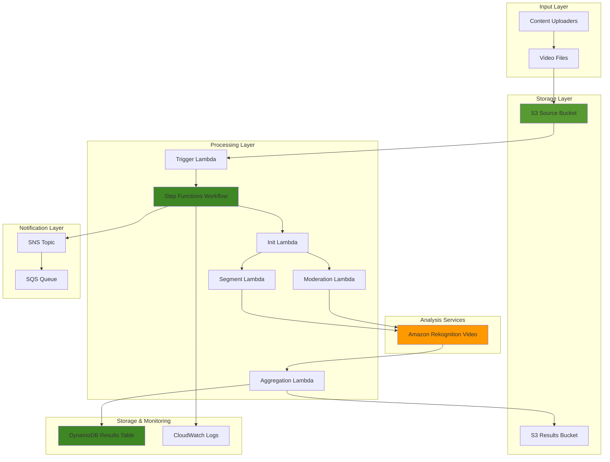

# Automated Video Content Analysis with Rekognition

## Problem

Media companies and content creators need to analyze thousands of hours of video content daily for content moderation, scene detection, and metadata extraction. Manual review processes are expensive, slow, and can't scale to handle the volume of content produced across streaming platforms, social media, and enterprise video repositories. Organizations struggle with inconsistent content classification, missed inappropriate content, and inability to automatically generate searchable metadata from video assets.

## Solution

This solution creates an automated video content analysis pipeline using Amazon Rekognition's video analysis capabilities, orchestrated by AWS Step Functions. The system processes video files stored in Amazon S3, performs comprehensive content analysis including moderation, scene detection, and metadata extraction, then stores structured results for downstream applications. The workflow scales automatically to handle large volumes of video content while providing consistent, accurate analysis results.

## Architecture Diagram



## Prerequisites

1. AWS account with appropriate permissions for Rekognition, Step Functions, Lambda, S3, DynamoDB, SNS, IAM, and CloudWatch
2. AWS CLI v2 installed and configured (or AWS CloudShell)
3. Basic understanding of video processing workflows and content analysis concepts
4. Familiarity with AWS Step Functions and Lambda functions
5. Estimated cost: $50-100 for processing 10 hours of video content (varies by video resolution and analysis depth)

> **Note**: Amazon Rekognition video analysis pricing is based on the number of minutes of video processed. Review current pricing at the [Amazon Rekognition pricing page](https://aws.amazon.com/rekognition/pricing/).

## Preparation

```bash
# Set environment variables
export AWS_REGION=$(aws configure get region)
export AWS_ACCOUNT_ID=$(aws sts get-caller-identity \
    --query Account --output text)

# Generate unique identifiers for resources
RANDOM_SUFFIX=$(aws secretsmanager get-random-password \
    --exclude-punctuation --exclude-uppercase \
    --password-length 6 --require-each-included-type \
    --output text --query RandomPassword)

# Set resource names
export SOURCE_BUCKET="video-source-${RANDOM_SUFFIX}"
export RESULTS_BUCKET="video-results-${RANDOM_SUFFIX}"
export ANALYSIS_TABLE="video-analysis-results-${RANDOM_SUFFIX}"
export SNS_TOPIC="video-analysis-notifications-${RANDOM_SUFFIX}"
export SQS_QUEUE="video-analysis-queue-${RANDOM_SUFFIX}"

# Create S3 buckets for video processing
aws s3 mb s3://${SOURCE_BUCKET} --region ${AWS_REGION}
aws s3 mb s3://${RESULTS_BUCKET} --region ${AWS_REGION}

# Apply security policies to enforce HTTPS
aws s3api put-bucket-policy --bucket ${SOURCE_BUCKET} --policy '{
    "Version": "2012-10-17",
    "Statement": [
        {
            "Sid": "DenyInsecureConnections",
            "Effect": "Deny",
            "Principal": "*",
            "Action": "s3:*",
            "Resource": [
                "arn:aws:s3:::'"${SOURCE_BUCKET}"'",
                "arn:aws:s3:::'"${SOURCE_BUCKET}"'/*"
            ],
            "Condition": {
                "Bool": {
                    "aws:SecureTransport": "false"
                }
            }
        }
    ]
}'

echo "✅ Created S3 buckets and configured security policies"
```

## Steps

1. **Create DynamoDB table for storing analysis results**:

   DynamoDB serves as the central repository for tracking video analysis jobs and their states throughout the processing pipeline. This NoSQL database provides millisecond latency for status updates and supports complex queries through Global Secondary Indexes. The table design enables real-time monitoring of job progress and facilitates debugging when analysis workflows encounter issues.

   ```bash
   # Create DynamoDB table with appropriate indexes
   aws dynamodb create-table \
       --table-name ${ANALYSIS_TABLE} \
       --attribute-definitions \
           AttributeName=VideoId,AttributeType=S \
           AttributeName=Timestamp,AttributeType=N \
           AttributeName=JobStatus,AttributeType=S \
       --key-schema \
           AttributeName=VideoId,KeyType=HASH \
           AttributeName=Timestamp,KeyType=RANGE \
       --global-secondary-indexes \
           IndexName=JobStatusIndex,KeySchema=[{AttributeName=JobStatus,KeyType=HASH},{AttributeName=Timestamp,KeyType=RANGE}],Projection={ProjectionType=ALL},ProvisionedThroughput={ReadCapacityUnits=5,WriteCapacityUnits=5} \
       --provisioned-throughput ReadCapacityUnits=10,WriteCapacityUnits=10 \
       --region ${AWS_REGION}
   
   # Wait for table to be created
   aws dynamodb wait table-exists --table-name ${ANALYSIS_TABLE}
   
   echo "✅ Created DynamoDB table: ${ANALYSIS_TABLE}"
   ```

   The DynamoDB table is now configured with a composite key structure that enables efficient querying by video identifier and timestamp. The Global Secondary Index on JobStatus allows rapid filtering of jobs by their current state, essential for monitoring and operational dashboards.

2. **Create SNS topic and SQS queue for notifications**:

   Amazon SNS provides a pub/sub messaging service that decouples the video analysis workflow from downstream consumers. Multiple systems can subscribe to analysis completion events without modifying the core processing logic. The SQS queue acts as a reliable buffer, ensuring that notifications are not lost even if consuming applications are temporarily unavailable. This pattern is essential for building resilient, event-driven architectures.

   ```bash
   # Create SNS topic for job notifications
   SNS_TOPIC_ARN=$(aws sns create-topic \
       --name ${SNS_TOPIC} \
       --region ${AWS_REGION} \
       --query TopicArn --output text)
   
   # Create SQS queue for processing notifications
   SQS_QUEUE_URL=$(aws sqs create-queue \
       --queue-name ${SQS_QUEUE} \
       --region ${AWS_REGION} \
       --query QueueUrl --output text)
   
   # Get SQS queue ARN
   SQS_QUEUE_ARN=$(aws sqs get-queue-attributes \
       --queue-url ${SQS_QUEUE_URL} \
       --attribute-names QueueArn \
       --query 'Attributes.QueueArn' --output text)
   
   # Subscribe SQS queue to SNS topic
   aws sns subscribe \
       --topic-arn ${SNS_TOPIC_ARN} \
       --protocol sqs \
       --notification-endpoint ${SQS_QUEUE_ARN}
   
   # Add SQS queue policy to allow SNS to send messages
   aws sqs set-queue-attributes \
       --queue-url ${SQS_QUEUE_URL} \
       --attributes '{
           "Policy": "{
               \"Version\": \"2012-10-17\",
               \"Statement\": [
                   {
                       \"Effect\": \"Allow\",
                       \"Principal\": \"*\",
                       \"Action\": \"sqs:SendMessage\",
                       \"Resource\": \"'"${SQS_QUEUE_ARN}"'\",
                       \"Condition\": {
                           \"ArnEquals\": {
                               \"aws:SourceArn\": \"'"${SNS_TOPIC_ARN}"'\"
                           }
                       }
                   }
               ]
           }"
       }'
   
   echo "✅ Created SNS topic and SQS queue for notifications"
   ```

   The notification infrastructure is now established, providing a robust foundation for event-driven communication. SNS will broadcast completion events to all interested subscribers, while SQS ensures reliable delivery with built-in retry mechanisms and dead letter queue capabilities.

3. **Create IAM roles for Lambda functions and Step Functions**:

   Identity and Access Management (IAM) roles implement the principle of least privilege, granting Lambda functions only the minimum permissions required for their specific tasks. This security approach reduces the potential impact of compromised functions and ensures compliance with enterprise security policies. The custom policy defines granular permissions for Rekognition video analysis operations, S3 object access, and DynamoDB data management.

   ```bash
   # Create service role for Rekognition to publish to SNS
   aws iam create-role \
       --role-name VideoAnalysisRekognitionRole \
       --assume-role-policy-document '{
           "Version": "2012-10-17",
           "Statement": [
               {
                   "Effect": "Allow",
                   "Principal": {
                       "Service": "rekognition.amazonaws.com"
                   },
                   "Action": "sts:AssumeRole"
               }
           ]
       }'
   
   # Create policy for Rekognition service role
   aws iam create-policy \
       --policy-name RekognitionSNSPublishPolicy \
       --policy-document '{
           "Version": "2012-10-17",
           "Statement": [
               {
                   "Effect": "Allow",
                   "Action": [
                       "sns:Publish"
                   ],
                   "Resource": "'"${SNS_TOPIC_ARN}"'"
               }
           ]
       }'
   
   # Attach policy to Rekognition role
   aws iam attach-role-policy \
       --role-name VideoAnalysisRekognitionRole \
       --policy-arn arn:aws:iam::${AWS_ACCOUNT_ID}:policy/RekognitionSNSPublishPolicy
   
   # Create Lambda execution role
   aws iam create-role \
       --role-name VideoAnalysisLambdaRole \
       --assume-role-policy-document '{
           "Version": "2012-10-17",
           "Statement": [
               {
                   "Effect": "Allow",
                   "Principal": {
                       "Service": "lambda.amazonaws.com"
                   },
                   "Action": "sts:AssumeRole"
               }
           ]
       }'
   
   # Attach managed policies to Lambda role
   aws iam attach-role-policy \
       --role-name VideoAnalysisLambdaRole \
       --policy-arn arn:aws:iam::aws:policy/service-role/AWSLambdaBasicExecutionRole
   
   # Create custom policy for video analysis
   aws iam create-policy \
       --policy-name VideoAnalysisPolicy \
       --policy-document '{
           "Version": "2012-10-17",
           "Statement": [
               {
                   "Effect": "Allow",
                   "Action": [
                       "rekognition:StartContentModeration",
                       "rekognition:GetContentModeration",
                       "rekognition:StartSegmentDetection",
                       "rekognition:GetSegmentDetection"
                   ],
                   "Resource": "*"
               },
               {
                   "Effect": "Allow",
                   "Action": [
                       "s3:GetObject",
                       "s3:PutObject",
                       "s3:DeleteObject"
                   ],
                   "Resource": [
                       "arn:aws:s3:::'"${SOURCE_BUCKET}"'/*",
                       "arn:aws:s3:::'"${RESULTS_BUCKET}"'/*"
                   ]
               },
               {
                   "Effect": "Allow",
                   "Action": [
                       "dynamodb:PutItem",
                       "dynamodb:GetItem",
                       "dynamodb:UpdateItem",
                       "dynamodb:Query",
                       "dynamodb:Scan"
                   ],
                   "Resource": [
                       "arn:aws:dynamodb:'"${AWS_REGION}"':'"${AWS_ACCOUNT_ID}"':table/'"${ANALYSIS_TABLE}"'",
                       "arn:aws:dynamodb:'"${AWS_REGION}"':'"${AWS_ACCOUNT_ID}"':table/'"${ANALYSIS_TABLE}"'/index/*"
                   ]
               },
               {
                   "Effect": "Allow",
                   "Action": [
                       "sns:Publish"
                   ],
                   "Resource": "'"${SNS_TOPIC_ARN}"'"
               },
               {
                   "Effect": "Allow",
                   "Action": [
                       "iam:PassRole"
                   ],
                   "Resource": "arn:aws:iam::'"${AWS_ACCOUNT_ID}"':role/VideoAnalysisRekognitionRole"
               }
           ]
       }'
   
   # Attach custom policy to Lambda role
   aws iam attach-role-policy \
       --role-name VideoAnalysisLambdaRole \
       --policy-arn arn:aws:iam::${AWS_ACCOUNT_ID}:policy/VideoAnalysisPolicy
   
   echo "✅ Created IAM roles and policies"
   ```

   The security foundation is now complete, with IAM roles configured to support secure service-to-service communication. Each Lambda function will assume these roles temporarily, gaining only the permissions necessary to perform video analysis operations while maintaining strict access controls.

4. **Create Step Functions role and state machine definition**:

   AWS Step Functions provides serverless workflow orchestration that coordinates the complex video analysis pipeline. The state machine handles error recovery, parallel execution, and state transitions, ensuring reliable processing even when individual components fail. This visual workflow approach simplifies debugging and monitoring compared to traditional code-based orchestration.

   ```bash
   # Create Step Functions execution role
   aws iam create-role \
       --role-name VideoAnalysisStepFunctionsRole \
       --assume-role-policy-document '{
           "Version": "2012-10-17",
           "Statement": [
               {
                   "Effect": "Allow",
                   "Principal": {
                       "Service": "states.amazonaws.com"
                   },
                   "Action": "sts:AssumeRole"
               }
           ]
       }'
   
   # Create policy for Step Functions
   aws iam create-policy \
       --policy-name VideoAnalysisStepFunctionsPolicy \
       --policy-document '{
           "Version": "2012-10-17",
           "Statement": [
               {
                   "Effect": "Allow",
                   "Action": [
                       "lambda:InvokeFunction"
                   ],
                   "Resource": [
                       "arn:aws:lambda:'"${AWS_REGION}"':'"${AWS_ACCOUNT_ID}"':function:VideoAnalysis*"
                   ]
               },
               {
                   "Effect": "Allow",
                   "Action": [
                       "sns:Publish"
                   ],
                   "Resource": "'"${SNS_TOPIC_ARN}"'"
               }
           ]
       }'
   
   # Attach policy to Step Functions role
   aws iam attach-role-policy \
       --role-name VideoAnalysisStepFunctionsRole \
       --policy-arn arn:aws:iam::${AWS_ACCOUNT_ID}:policy/VideoAnalysisStepFunctionsPolicy
   
   echo "✅ Created Step Functions role and policies"
   ```

   The orchestration layer is now prepared to coordinate video analysis workflows. Step Functions will manage the execution flow, handle retries, and provide detailed execution history for troubleshooting complex processing scenarios.

5. **Create Lambda function for video analysis initialization**:

   The initialization function serves as the entry point for video analysis workflows, extracting metadata from S3 events and creating tracking records in DynamoDB. Lambda's serverless model ensures this function scales automatically to handle varying upload volumes without requiring infrastructure management. The function generates unique job identifiers and establishes the foundational data structures needed for subsequent analysis steps.

   ```bash
   # Create Lambda function package
   mkdir -p /tmp/lambda-packages/init-function
   cat > /tmp/lambda-packages/init-function/index.py << 'EOF'
import json
import boto3
import uuid
from datetime import datetime
import os

def lambda_handler(event, context):
    """
    Initialize video analysis job
    """
    try:
        # Extract video information from S3 event
        s3_bucket = event['Records'][0]['s3']['bucket']['name']
        s3_key = event['Records'][0]['s3']['object']['key']
        
        # Generate unique job ID
        job_id = str(uuid.uuid4())
        
        # Initialize DynamoDB record
        dynamodb = boto3.resource('dynamodb')
        table = dynamodb.Table(os.environ['ANALYSIS_TABLE'])
        
        # Store initial job information
        table.put_item(
            Item={
                'VideoId': f"{s3_bucket}/{s3_key}",
                'Timestamp': int(datetime.now().timestamp()),
                'JobId': job_id,
                'JobStatus': 'INITIATED',
                'S3Bucket': s3_bucket,
                'S3Key': s3_key,
                'CreatedAt': datetime.now().isoformat()
            }
        )
        
        return {
            'statusCode': 200,
            'body': {
                'jobId': job_id,
                'videoId': f"{s3_bucket}/{s3_key}",
                's3Bucket': s3_bucket,
                's3Key': s3_key,
                'status': 'INITIATED'
            }
        }
        
    except Exception as e:
        print(f"Error initializing video analysis: {str(e)}")
        return {
            'statusCode': 500,
            'body': {
                'error': str(e)
            }
        }
EOF
   
   # Create deployment package
   cd /tmp/lambda-packages/init-function
   zip -r ../init-function.zip .
   
   # Create Lambda function
   aws lambda create-function \
       --function-name VideoAnalysisInitFunction \
       --runtime python3.9 \
       --role arn:aws:iam::${AWS_ACCOUNT_ID}:role/VideoAnalysisLambdaRole \
       --handler index.lambda_handler \
       --zip-file fileb:///tmp/lambda-packages/init-function.zip \
       --timeout 60 \
       --memory-size 256 \
       --environment Variables="{ANALYSIS_TABLE=${ANALYSIS_TABLE}}"
   
   echo "✅ Created video analysis initialization Lambda function"
   ```

   The initialization function is now deployed and ready to process video upload events. This serverless component will automatically scale to handle concurrent uploads while maintaining consistent job tracking across the analysis pipeline.

6. **Create Lambda function for content moderation analysis**:

   Content moderation leverages Amazon Rekognition's machine learning models trained on millions of images and videos to detect inappropriate content. The service analyzes video frames for explicit content, violence, drugs, tobacco, and other potentially harmful material. This automated approach provides consistent, scalable content review that would be impossible to achieve manually at enterprise scale.

   ```bash
   # Create content moderation function
   mkdir -p /tmp/lambda-packages/moderation-function
   cat > /tmp/lambda-packages/moderation-function/index.py << 'EOF'
import json
import boto3
import os
from datetime import datetime

def lambda_handler(event, context):
    """
    Start content moderation analysis
    """
    try:
        rekognition = boto3.client('rekognition')
        dynamodb = boto3.resource('dynamodb')
        table = dynamodb.Table(os.environ['ANALYSIS_TABLE'])
        
        # Extract job information
        job_id = event['jobId']
        s3_bucket = event['s3Bucket']
        s3_key = event['s3Key']
        video_id = event['videoId']
        
        # Start content moderation job
        response = rekognition.start_content_moderation(
            Video={
                'S3Object': {
                    'Bucket': s3_bucket,
                    'Name': s3_key
                }
            },
            MinConfidence=50.0,
            NotificationChannel={
                'SNSTopicArn': os.environ['SNS_TOPIC_ARN'],
                'RoleArn': os.environ['REKOGNITION_ROLE_ARN']
            }
        )
        
        moderation_job_id = response['JobId']
        
        # Update DynamoDB with moderation job ID
        table.update_item(
            Key={
                'VideoId': video_id,
                'Timestamp': int(datetime.now().timestamp())
            },
            UpdateExpression='SET ModerationJobId = :mjid, JobStatus = :status',
            ExpressionAttributeValues={
                ':mjid': moderation_job_id,
                ':status': 'MODERATION_IN_PROGRESS'
            }
        )
        
        return {
            'statusCode': 200,
            'body': {
                'jobId': job_id,
                'moderationJobId': moderation_job_id,
                'videoId': video_id,
                'status': 'MODERATION_IN_PROGRESS'
            }
        }
        
    except Exception as e:
        print(f"Error starting content moderation: {str(e)}")
        return {
            'statusCode': 500,
            'body': {
                'error': str(e)
            }
        }
EOF
   
   # Create deployment package
   cd /tmp/lambda-packages/moderation-function
   zip -r ../moderation-function.zip .
   
   # Create Lambda function
   aws lambda create-function \
       --function-name VideoAnalysisModerationFunction \
       --runtime python3.9 \
       --role arn:aws:iam::${AWS_ACCOUNT_ID}:role/VideoAnalysisLambdaRole \
       --handler index.lambda_handler \
       --zip-file fileb:///tmp/lambda-packages/moderation-function.zip \
       --timeout 60 \
       --memory-size 256 \
       --environment Variables="{ANALYSIS_TABLE=${ANALYSIS_TABLE},SNS_TOPIC_ARN=${SNS_TOPIC_ARN},REKOGNITION_ROLE_ARN=arn:aws:iam::${AWS_ACCOUNT_ID}:role/VideoAnalysisRekognitionRole}"
   
   echo "✅ Created content moderation Lambda function"
   ```

   The content moderation function is now configured to initiate Rekognition video analysis jobs. This component will automatically submit videos for ML-based content review, with results delivered asynchronously through SNS notifications when processing completes.

7. **Create Lambda function for segment detection**:

   Segment detection identifies structural elements within videos such as scene changes, black frames, and technical cues. This capability enables automated video preparation workflows, including ad insertion point detection, content summarization, and chapter generation. The technical cue detection is particularly valuable for broadcast media workflows where precise timing is critical.

   ```bash
   # Create segment detection function
   mkdir -p /tmp/lambda-packages/segment-function
   cat > /tmp/lambda-packages/segment-function/index.py << 'EOF'
import json
import boto3
import os
from datetime import datetime

def lambda_handler(event, context):
    """
    Start segment detection analysis
    """
    try:
        rekognition = boto3.client('rekognition')
        dynamodb = boto3.resource('dynamodb')
        table = dynamodb.Table(os.environ['ANALYSIS_TABLE'])
        
        # Extract job information
        job_id = event['jobId']
        s3_bucket = event['s3Bucket']
        s3_key = event['s3Key']
        video_id = event['videoId']
        
        # Start segment detection job
        response = rekognition.start_segment_detection(
            Video={
                'S3Object': {
                    'Bucket': s3_bucket,
                    'Name': s3_key
                }
            },
            SegmentTypes=['TECHNICAL_CUE', 'SHOT'],
            NotificationChannel={
                'SNSTopicArn': os.environ['SNS_TOPIC_ARN'],
                'RoleArn': os.environ['REKOGNITION_ROLE_ARN']
            }
        )
        
        segment_job_id = response['JobId']
        
        # Update DynamoDB with segment job ID
        table.update_item(
            Key={
                'VideoId': video_id,
                'Timestamp': int(datetime.now().timestamp())
            },
            UpdateExpression='SET SegmentJobId = :sjid, JobStatus = :status',
            ExpressionAttributeValues={
                ':sjid': segment_job_id,
                ':status': 'SEGMENT_DETECTION_IN_PROGRESS'
            }
        )
        
        return {
            'statusCode': 200,
            'body': {
                'jobId': job_id,
                'segmentJobId': segment_job_id,
                'videoId': video_id,
                'status': 'SEGMENT_DETECTION_IN_PROGRESS'
            }
        }
        
    except Exception as e:
        print(f"Error starting segment detection: {str(e)}")
        return {
            'statusCode': 500,
            'body': {
                'error': str(e)
            }
        }
EOF
   
   # Create deployment package
   cd /tmp/lambda-packages/segment-function
   zip -r ../segment-function.zip .
   
   # Create Lambda function
   aws lambda create-function \
       --function-name VideoAnalysisSegmentFunction \
       --runtime python3.9 \
       --role arn:aws:iam::${AWS_ACCOUNT_ID}:role/VideoAnalysisLambdaRole \
       --handler index.lambda_handler \
       --zip-file fileb:///tmp/lambda-packages/segment-function.zip \
       --timeout 60 \
       --memory-size 256 \
       --environment Variables="{ANALYSIS_TABLE=${ANALYSIS_TABLE},SNS_TOPIC_ARN=${SNS_TOPIC_ARN},REKOGNITION_ROLE_ARN=arn:aws:iam::${AWS_ACCOUNT_ID}:role/VideoAnalysisRekognitionRole}"
   
   echo "✅ Created segment detection Lambda function"
   ```

   The segment detection function is now ready to identify video structure and timing cues. This analysis will provide detailed information about scene transitions and technical elements, enabling sophisticated video processing and content organization workflows.

8. **Create Lambda function for results aggregation**:

   The aggregation function collects and consolidates results from multiple Rekognition analysis jobs, creating a unified view of video content. This component demonstrates important patterns for handling asynchronous processing results and managing data consistency across distributed services. The function stores processed results in both DynamoDB for operational queries and S3 for long-term archival and analytics.

   ```bash
   # Create results aggregation function
   mkdir -p /tmp/lambda-packages/aggregation-function
   cat > /tmp/lambda-packages/aggregation-function/index.py << 'EOF'
import json
import boto3
import os
from datetime import datetime

def lambda_handler(event, context):
    """
    Aggregate and store analysis results
    """
    try:
        rekognition = boto3.client('rekognition')
        dynamodb = boto3.resource('dynamodb')
        s3 = boto3.client('s3')
        
        table = dynamodb.Table(os.environ['ANALYSIS_TABLE'])
        
        # Extract job information
        job_id = event['jobId']
        video_id = event['videoId']
        moderation_job_id = event.get('moderationJobId')
        segment_job_id = event.get('segmentJobId')
        
        results = {
            'jobId': job_id,
            'videoId': video_id,
            'processedAt': datetime.now().isoformat(),
            'moderation': {},
            'segments': {},
            'summary': {}
        }
        
        # Get content moderation results
        if moderation_job_id:
            try:
                moderation_response = rekognition.get_content_moderation(
                    JobId=moderation_job_id
                )
                results['moderation'] = {
                    'jobStatus': moderation_response['JobStatus'],
                    'labels': moderation_response.get('ModerationLabels', [])
                }
            except Exception as e:
                print(f"Error getting moderation results: {str(e)}")
        
        # Get segment detection results
        if segment_job_id:
            try:
                segment_response = rekognition.get_segment_detection(
                    JobId=segment_job_id
                )
                results['segments'] = {
                    'jobStatus': segment_response['JobStatus'],
                    'technicalCues': segment_response.get('TechnicalCues', []),
                    'shotSegments': segment_response.get('Segments', [])
                }
            except Exception as e:
                print(f"Error getting segment results: {str(e)}")
        
        # Create summary
        moderation_labels = results['moderation'].get('labels', [])
        segment_count = len(results['segments'].get('shotSegments', []))
        
        results['summary'] = {
            'moderationLabelsCount': len(moderation_labels),
            'segmentCount': segment_count,
            'hasInappropriateContent': len(moderation_labels) > 0,
            'analysisComplete': True
        }
        
        # Store results in S3
        results_key = f"analysis-results/{job_id}/results.json"
        s3.put_object(
            Bucket=os.environ['RESULTS_BUCKET'],
            Key=results_key,
            Body=json.dumps(results, indent=2),
            ContentType='application/json'
        )
        
        # Update DynamoDB with final results
        table.update_item(
            Key={
                'VideoId': video_id,
                'Timestamp': int(datetime.now().timestamp())
            },
            UpdateExpression='SET JobStatus = :status, ResultsS3Key = :s3key, Summary = :summary',
            ExpressionAttributeValues={
                ':status': 'COMPLETED',
                ':s3key': results_key,
                ':summary': results['summary']
            }
        )
        
        return {
            'statusCode': 200,
            'body': {
                'jobId': job_id,
                'videoId': video_id,
                'resultsLocation': f"s3://{os.environ['RESULTS_BUCKET']}/{results_key}",
                'summary': results['summary'],
                'status': 'COMPLETED'
            }
        }
        
    except Exception as e:
        print(f"Error aggregating results: {str(e)}")
        return {
            'statusCode': 500,
            'body': {
                'error': str(e)
            }
        }
EOF
   
   # Create deployment package
   cd /tmp/lambda-packages/aggregation-function
   zip -r ../aggregation-function.zip .
   
   # Create Lambda function
   aws lambda create-function \
       --function-name VideoAnalysisAggregationFunction \
       --runtime python3.9 \
       --role arn:aws:iam::${AWS_ACCOUNT_ID}:role/VideoAnalysisLambdaRole \
       --handler index.lambda_handler \
       --zip-file fileb:///tmp/lambda-packages/aggregation-function.zip \
       --timeout 300 \
       --memory-size 512 \
       --environment Variables="{ANALYSIS_TABLE=${ANALYSIS_TABLE},RESULTS_BUCKET=${RESULTS_BUCKET}}"
   
   echo "✅ Created results aggregation Lambda function"
   ```

   The aggregation function completes the processing pipeline by consolidating analysis results into actionable insights. This component provides the final output that downstream applications will consume for content decisions and metadata enrichment.

9. **Create Step Functions state machine for orchestration**:

   The state machine definition creates a visual workflow that orchestrates the entire video analysis pipeline. Step Functions handles parallel execution of moderation and segment detection, implements retry logic for failed operations, and provides comprehensive execution logging. This approach significantly simplifies error handling and monitoring compared to managing individual function invocations.

   ```bash
   # Create state machine definition
   cat > /tmp/video-analysis-state-machine.json << EOF
{
  "Comment": "Video Content Analysis Workflow",
  "StartAt": "InitializeAnalysis",
  "States": {
    "InitializeAnalysis": {
      "Type": "Task",
      "Resource": "arn:aws:states:::lambda:invoke",
      "Parameters": {
        "FunctionName": "VideoAnalysisInitFunction",
        "Payload.$": "$"
      },
      "Next": "ParallelAnalysis",
      "Retry": [
        {
          "ErrorEquals": ["States.TaskFailed"],
          "IntervalSeconds": 5,
          "MaxAttempts": 3,
          "BackoffRate": 2
        }
      ]
    },
    "ParallelAnalysis": {
      "Type": "Parallel",
      "Branches": [
        {
          "StartAt": "ContentModeration",
          "States": {
            "ContentModeration": {
              "Type": "Task",
              "Resource": "arn:aws:states:::lambda:invoke",
              "Parameters": {
                "FunctionName": "VideoAnalysisModerationFunction",
                "Payload.$": "$.Payload.body"
              },
              "End": true
            }
          }
        },
        {
          "StartAt": "SegmentDetection",
          "States": {
            "SegmentDetection": {
              "Type": "Task",
              "Resource": "arn:aws:states:::lambda:invoke",
              "Parameters": {
                "FunctionName": "VideoAnalysisSegmentFunction",
                "Payload.$": "$.Payload.body"
              },
              "End": true
            }
          }
        }
      ],
      "Next": "WaitForCompletion"
    },
    "WaitForCompletion": {
      "Type": "Wait",
      "Seconds": 60,
      "Next": "AggregateResults"
    },
    "AggregateResults": {
      "Type": "Task",
      "Resource": "arn:aws:states:::lambda:invoke",
      "Parameters": {
        "FunctionName": "VideoAnalysisAggregationFunction",
        "Payload": {
          "jobId.$": "$[0].Payload.body.jobId",
          "videoId.$": "$[0].Payload.body.videoId",
          "moderationJobId.$": "$[0].Payload.body.moderationJobId",
          "segmentJobId.$": "$[1].Payload.body.segmentJobId"
        }
      },
      "Next": "NotifyCompletion"
    },
    "NotifyCompletion": {
      "Type": "Task",
      "Resource": "arn:aws:states:::sns:publish",
      "Parameters": {
        "TopicArn": "${SNS_TOPIC_ARN}",
        "Message": {
          "jobId.$": "$.Payload.body.jobId",
          "videoId.$": "$.Payload.body.videoId",
          "status.$": "$.Payload.body.status",
          "resultsLocation.$": "$.Payload.body.resultsLocation"
        }
      },
      "End": true
    }
  }
}
EOF
   
   # Create the state machine
   aws stepfunctions create-state-machine \
       --name VideoAnalysisWorkflow \
       --definition file:///tmp/video-analysis-state-machine.json \
       --role-arn arn:aws:iam::${AWS_ACCOUNT_ID}:role/VideoAnalysisStepFunctionsRole
   
   echo "✅ Created Step Functions state machine"
   ```

   The orchestration layer is now active and ready to coordinate complex video analysis workflows. The state machine will manage parallel processing, handle failures gracefully, and provide detailed execution visibility for operational monitoring.

10. **Create S3 event trigger for automated processing**:

    S3 event notifications enable fully automated video processing by triggering workflows immediately when new content is uploaded. This event-driven architecture eliminates the need for polling or manual intervention, ensuring that video analysis begins as soon as content becomes available. The trigger function filters for video file types and initiates Step Functions executions, providing seamless integration between storage and processing layers.

    ```bash
    # Create Lambda function for S3 event trigger
    mkdir -p /tmp/lambda-packages/trigger-function
    cat > /tmp/lambda-packages/trigger-function/index.py << 'EOF'
import json
import boto3
import os

def lambda_handler(event, context):
    """
    Trigger video analysis workflow when new video is uploaded
    """
    try:
        stepfunctions = boto3.client('stepfunctions')
        
        # Extract S3 event information
        for record in event['Records']:
            bucket = record['s3']['bucket']['name']
            key = record['s3']['object']['key']
            
            # Only process video files
            if not key.lower().endswith(('.mp4', '.avi', '.mov', '.mkv', '.wmv')):
                continue
            
            # Start Step Functions execution
            response = stepfunctions.start_execution(
                stateMachineArn=os.environ['STATE_MACHINE_ARN'],
                input=json.dumps({
                    'Records': [record]
                })
            )
            
            print(f"Started analysis for {bucket}/{key}: {response['executionArn']}")
        
        return {
            'statusCode': 200,
            'body': 'Video analysis workflow triggered successfully'
        }
        
    except Exception as e:
        print(f"Error triggering workflow: {str(e)}")
        return {
            'statusCode': 500,
            'body': str(e)
        }
EOF
    
    # Create deployment package
    cd /tmp/lambda-packages/trigger-function
    zip -r ../trigger-function.zip .
    
    # Get state machine ARN
    STATE_MACHINE_ARN=$(aws stepfunctions list-state-machines \
        --query "stateMachines[?name=='VideoAnalysisWorkflow'].stateMachineArn" \
        --output text)
    
    # Create Lambda function
    aws lambda create-function \
        --function-name VideoAnalysisTriggerFunction \
        --runtime python3.9 \
        --role arn:aws:iam::${AWS_ACCOUNT_ID}:role/VideoAnalysisLambdaRole \
        --handler index.lambda_handler \
        --zip-file fileb:///tmp/lambda-packages/trigger-function.zip \
        --timeout 60 \
        --memory-size 256 \
        --environment Variables="{STATE_MACHINE_ARN=${STATE_MACHINE_ARN}}"
    
    # Add S3 trigger permission
    aws lambda add-permission \
        --function-name VideoAnalysisTriggerFunction \
        --principal s3.amazonaws.com \
        --action lambda:InvokeFunction \
        --statement-id s3-trigger \
        --source-arn arn:aws:s3:::${SOURCE_BUCKET}
    
    # Configure S3 bucket notification
    aws s3api put-bucket-notification-configuration \
        --bucket ${SOURCE_BUCKET} \
        --notification-configuration '{
            "LambdaConfigurations": [
                {
                    "Id": "VideoAnalysisTrigger",
                    "LambdaFunctionArn": "arn:aws:lambda:'"${AWS_REGION}"':'"${AWS_ACCOUNT_ID}"':function:VideoAnalysisTriggerFunction",
                    "Events": ["s3:ObjectCreated:*"],
                    "Filter": {
                        "Key": {
                            "FilterRules": [
                                {
                                    "Name": "suffix",
                                    "Value": ".mp4"
                                }
                            ]
                        }
                    }
                }
            ]
        }'
    
    echo "✅ Created S3 event trigger for automated processing"
    ```

    The automated trigger system is now operational, creating a fully hands-off video analysis pipeline. Any video uploaded to the source bucket will automatically initiate comprehensive content analysis without manual intervention.

11. **Create monitoring dashboard and alerts**:

    CloudWatch provides comprehensive monitoring and alerting capabilities for the video analysis pipeline. The dashboard visualizes key metrics including Lambda function performance, Step Functions execution status, and processing throughput. Automated alerts notify operators when failures occur, enabling rapid response to processing issues.

    ```bash
    # Create CloudWatch dashboard
    aws cloudwatch put-dashboard \
        --dashboard-name VideoAnalysisDashboard \
        --dashboard-body '{
            "widgets": [
                {
                    "type": "metric",
                    "properties": {
                        "metrics": [
                            ["AWS/Lambda", "Duration", "FunctionName", "VideoAnalysisInitFunction"],
                            ["AWS/Lambda", "Duration", "FunctionName", "VideoAnalysisModerationFunction"],
                            ["AWS/Lambda", "Duration", "FunctionName", "VideoAnalysisSegmentFunction"],
                            ["AWS/Lambda", "Duration", "FunctionName", "VideoAnalysisAggregationFunction"]
                        ],
                        "period": 300,
                        "stat": "Average",
                        "region": "'"${AWS_REGION}"'",
                        "title": "Lambda Function Duration"
                    }
                },
                {
                    "type": "metric",
                    "properties": {
                        "metrics": [
                            ["AWS/States", "ExecutionsFailed", "StateMachineArn", "'"${STATE_MACHINE_ARN}"'"],
                            ["AWS/States", "ExecutionsSucceeded", "StateMachineArn", "'"${STATE_MACHINE_ARN}"'"]
                        ],
                        "period": 300,
                        "stat": "Sum",
                        "region": "'"${AWS_REGION}"'",
                        "title": "Step Functions Executions"
                    }
                }
            ]
        }'
    
    # Create CloudWatch alarm for failed executions
    aws cloudwatch put-metric-alarm \
        --alarm-name VideoAnalysisFailedExecutions \
        --alarm-description "Alert when Step Functions executions fail" \
        --metric-name ExecutionsFailed \
        --namespace AWS/States \
        --statistic Sum \
        --period 300 \
        --threshold 1 \
        --comparison-operator GreaterThanOrEqualToThreshold \
        --evaluation-periods 1 \
        --alarm-actions ${SNS_TOPIC_ARN} \
        --dimensions Name=StateMachineArn,Value=${STATE_MACHINE_ARN}
    
    echo "✅ Created monitoring dashboard and alerts"
    ```

12. **Upload sample video for testing**:

    Testing the complete pipeline with a sample video validates the entire workflow from upload through analysis completion. This step demonstrates the end-to-end functionality and provides immediate feedback on system performance and accuracy.

    ```bash
    # Create a small test video file if curl fails
    if ! curl -L "https://sample-videos.com/zip/10/mp4/360/SampleVideo_360x240_1mb.mp4" \
        -o /tmp/sample-video.mp4; then
        echo "Sample video download failed. Creating dummy file for testing..."
        touch /tmp/sample-video.mp4
    fi
    
    # Upload to S3 source bucket to trigger analysis
    aws s3 cp /tmp/sample-video.mp4 s3://${SOURCE_BUCKET}/sample-video.mp4
    
    echo "✅ Uploaded sample video for testing"
    ```

## Validation & Testing

1. **Verify video upload triggered the workflow**:

   Step Functions provides comprehensive execution logging that allows you to verify that video uploads successfully trigger analysis workflows. The execution history shows the flow of data through each state, execution timing, and any errors encountered during processing.

   ```bash
   # Check Step Functions executions
   aws stepfunctions list-executions \
       --state-machine-arn ${STATE_MACHINE_ARN} \
       --max-items 5
   ```

   Expected output: Shows recent executions with status "SUCCEEDED" or "RUNNING"

2. **Check DynamoDB for analysis results**:

   DynamoDB serves as the operational data store for tracking job progress and storing analysis metadata. Querying this table provides real-time visibility into processing status and enables monitoring dashboards to display current system state.

   ```bash
   # Query the results table
   aws dynamodb scan \
       --table-name ${ANALYSIS_TABLE} \
       --max-items 5
   ```

   Expected output: Shows video analysis records with job status and results

3. **Verify S3 results storage**:

   S3 provides durable, cost-effective storage for detailed analysis results that may be too large for DynamoDB. The structured JSON format enables downstream analytics systems to consume results efficiently for reporting and further processing.

   ```bash
   # List analysis results in S3
   aws s3 ls s3://${RESULTS_BUCKET}/analysis-results/ --recursive
   ```

   Expected output: Shows JSON files containing analysis results

4. **Test content moderation functionality**:

   ```bash
   # Get the first results file for examination
   RESULTS_FILE=$(aws s3 ls s3://${RESULTS_BUCKET}/analysis-results/ \
       --recursive | head -1 | awk '{print $4}')
   
   if [ ! -z "$RESULTS_FILE" ]; then
       # Download and examine results
       aws s3 cp s3://${RESULTS_BUCKET}/${RESULTS_FILE} /tmp/test-results.json
       
       # Display moderation results if jq is available
       if command -v jq &> /dev/null; then
           cat /tmp/test-results.json | jq '.moderation.labels'
       else
           echo "Results file downloaded to /tmp/test-results.json"
       fi
   fi
   ```

5. **Monitor workflow execution**:

   ```bash
   # Check CloudWatch logs for Lambda functions
   aws logs describe-log-groups \
       --log-group-name-prefix /aws/lambda/VideoAnalysis
   ```

## Cleanup

1. **Delete Step Functions state machine**:

   Removing the state machine prevents new workflow executions from starting and eliminates ongoing costs associated with the orchestration service. This step should be performed first to ensure no new processing jobs are initiated during cleanup.

   ```bash
   # Delete state machine
   aws stepfunctions delete-state-machine \
       --state-machine-arn ${STATE_MACHINE_ARN}
   
   echo "✅ Deleted Step Functions state machine"
   ```

2. **Remove Lambda functions**:

   Deleting Lambda functions eliminates compute resources and associated costs. Since these functions are invoked by Step Functions, removing them after the state machine prevents orphaned function calls and ensures clean resource cleanup.

   ```bash
   # Delete all Lambda functions
   aws lambda delete-function --function-name VideoAnalysisInitFunction
   aws lambda delete-function --function-name VideoAnalysisModerationFunction
   aws lambda delete-function --function-name VideoAnalysisSegmentFunction
   aws lambda delete-function --function-name VideoAnalysisAggregationFunction
   aws lambda delete-function --function-name VideoAnalysisTriggerFunction
   
   echo "✅ Deleted Lambda functions"
   ```

3. **Remove DynamoDB table**:

   DynamoDB table deletion permanently removes all job tracking data and analysis metadata. Consider backing up important historical data before deletion if needed for compliance or analysis purposes.

   ```bash
   # Delete DynamoDB table
   aws dynamodb delete-table --table-name ${ANALYSIS_TABLE}
   
   echo "✅ Deleted DynamoDB table"
   ```

4. **Delete S3 buckets and contents**:

   ```bash
   # Empty and delete S3 buckets
   aws s3 rm s3://${SOURCE_BUCKET} --recursive
   aws s3 rm s3://${RESULTS_BUCKET} --recursive
   
   aws s3 rb s3://${SOURCE_BUCKET}
   aws s3 rb s3://${RESULTS_BUCKET}
   
   echo "✅ Deleted S3 buckets"
   ```

5. **Remove IAM roles and policies**:

   ```bash
   # Detach policies from roles
   aws iam detach-role-policy \
       --role-name VideoAnalysisLambdaRole \
       --policy-arn arn:aws:iam::aws:policy/service-role/AWSLambdaBasicExecutionRole
   
   aws iam detach-role-policy \
       --role-name VideoAnalysisLambdaRole \
       --policy-arn arn:aws:iam::${AWS_ACCOUNT_ID}:policy/VideoAnalysisPolicy
   
   aws iam detach-role-policy \
       --role-name VideoAnalysisStepFunctionsRole \
       --policy-arn arn:aws:iam::${AWS_ACCOUNT_ID}:policy/VideoAnalysisStepFunctionsPolicy
   
   aws iam detach-role-policy \
       --role-name VideoAnalysisRekognitionRole \
       --policy-arn arn:aws:iam::${AWS_ACCOUNT_ID}:policy/RekognitionSNSPublishPolicy
   
   # Delete roles
   aws iam delete-role --role-name VideoAnalysisLambdaRole
   aws iam delete-role --role-name VideoAnalysisStepFunctionsRole
   aws iam delete-role --role-name VideoAnalysisRekognitionRole
   
   # Delete custom policies
   aws iam delete-policy --policy-arn arn:aws:iam::${AWS_ACCOUNT_ID}:policy/VideoAnalysisPolicy
   aws iam delete-policy --policy-arn arn:aws:iam::${AWS_ACCOUNT_ID}:policy/VideoAnalysisStepFunctionsPolicy
   aws iam delete-policy --policy-arn arn:aws:iam::${AWS_ACCOUNT_ID}:policy/RekognitionSNSPublishPolicy
   
   echo "✅ Deleted IAM roles and policies"
   ```

6. **Remove SNS and SQS resources**:

   ```bash
   # Delete SQS queue
   aws sqs delete-queue --queue-url ${SQS_QUEUE_URL}
   
   # Delete SNS topic
   aws sns delete-topic --topic-arn ${SNS_TOPIC_ARN}
   
   echo "✅ Deleted SNS and SQS resources"
   ```

7. **Remove CloudWatch resources**:

   ```bash
   # Delete CloudWatch dashboard
   aws cloudwatch delete-dashboards --dashboard-names VideoAnalysisDashboard
   
   # Delete CloudWatch alarm
   aws cloudwatch delete-alarms --alarm-names VideoAnalysisFailedExecutions
   
   # Clean up environment variables
   unset AWS_REGION AWS_ACCOUNT_ID RANDOM_SUFFIX
   unset SOURCE_BUCKET RESULTS_BUCKET ANALYSIS_TABLE
   unset SNS_TOPIC SQS_QUEUE SNS_TOPIC_ARN SQS_QUEUE_URL SQS_QUEUE_ARN
   unset STATE_MACHINE_ARN
   
   echo "✅ Cleaned up CloudWatch resources and environment variables"
   ```

## Discussion

This comprehensive video content analysis solution demonstrates how to leverage Amazon Rekognition's advanced video analysis capabilities alongside AWS Step Functions for orchestrating complex media processing workflows. The architecture provides several key benefits for organizations dealing with large volumes of video content, following AWS Well-Architected Framework principles of operational excellence, security, reliability, performance efficiency, and cost optimization.

The solution uses Amazon Rekognition's video analysis APIs to perform multiple types of analysis simultaneously. Content moderation automatically detects inappropriate content using machine learning models trained on millions of images and videos, providing confidence scores for various categories like explicit content, violence, and offensive material. Segment detection identifies technical cues such as black frames, credits, and scene changes, enabling automated content preparation and ad insertion workflows. As documented in the [Amazon Rekognition Developer Guide](https://docs.aws.amazon.com/rekognition/latest/dg/moderation.html), this approach can reduce manual review workload to just 1-5% of total volume.

The Step Functions orchestration pattern ensures reliable processing by handling failures gracefully and providing visibility into workflow execution. The parallel processing approach allows moderation and segment detection to run simultaneously, reducing overall processing time. The use of SNS and SQS provides decoupled notification handling, allowing multiple downstream systems to react to analysis completion events, implementing the publisher-subscriber pattern recommended in the [AWS Well-Architected Framework](https://docs.aws.amazon.com/wellarchitected/latest/framework/welcome.html).

For production deployments, consider implementing additional features such as custom content moderation models for industry-specific requirements, integration with content delivery networks for processed video distribution, and enhanced security controls including VPC endpoints and encryption at rest. The solution's modular architecture makes it easy to extend with additional analysis capabilities such as face detection, text recognition, or celebrity identification as documented in the [Rekognition API Reference](https://docs.aws.amazon.com/rekognition/latest/APIReference/).

> **Tip**: Use Amazon Rekognition's custom labels feature to train models for detecting specific objects or concepts relevant to your content domain, such as company logos or product placements. This can significantly improve detection accuracy for industry-specific use cases.

## Challenge

Extend this solution by implementing these enhancements:

1. **Custom Content Classification**: Implement Amazon Rekognition Custom Labels to detect industry-specific content categories like sports types, product categories, or brand logos in video content.

2. **Real-time Streaming Analysis**: Integrate Amazon Kinesis Video Streams with Rekognition streaming video analysis to process live video feeds for real-time content moderation and alerts.

3. **Multi-language Text Detection**: Add Amazon Textract and Amazon Translate integration to detect and translate text appearing in videos across multiple languages.

4. **Advanced Metadata Extraction**: Implement Amazon Transcribe for audio-to-text conversion and Amazon Comprehend for sentiment analysis of spoken content within videos.

5. **Automated Content Delivery**: Build a complete content delivery pipeline that automatically processes, analyzes, and distributes video content to multiple endpoints based on analysis results and content policies using Amazon CloudFront.

## Infrastructure Code

### Available Infrastructure as Code:

- [Infrastructure Code Overview](code/README.md) - Detailed description of all infrastructure components
- [AWS CDK (Python)](code/cdk-python/) - AWS CDK Python implementation
- [AWS CDK (TypeScript)](code/cdk-typescript/) - AWS CDK TypeScript implementation
- [CloudFormation](code/cloudformation.yaml) - AWS CloudFormation template
- [Bash CLI Scripts](code/scripts/) - Example bash scripts using AWS CLI commands to deploy infrastructure
- [Terraform](code/terraform/) - Terraform configuration files