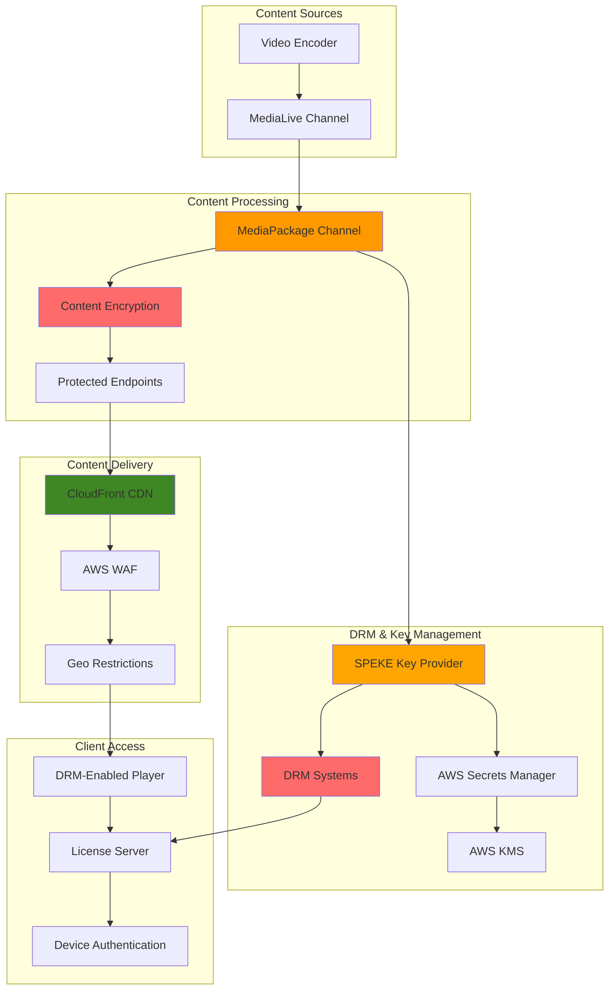

# Video DRM Protection with MediaPackage

## Problem

Premium video content providers face significant security challenges protecting their intellectual property from piracy, unauthorized distribution, and content theft. Traditional content delivery methods lack robust encryption and access controls, making valuable content vulnerable to capture and redistribution. Without proper digital rights management (DRM), content creators lose revenue, violate licensing agreements, and struggle to enforce territorial restrictions, ultimately threatening their business model and content partnerships.

## Solution

Implement comprehensive video content protection using AWS Elemental MediaPackage with multi-DRM support (Widevine, PlayReady, FairPlay), combined with SPEKE API integration for secure key management. This solution provides end-to-end content encryption, secure license delivery, device authentication, and geo-blocking capabilities while maintaining seamless playback experiences across all major platforms and devices.

## Architecture Diagram



## Prerequisites

1. AWS account with appropriate permissions for MediaPackage, MediaLive, Secrets Manager, and KMS
2. AWS CLI v2 installed and configured (or AWS CloudShell)
3. Understanding of DRM concepts (Widevine, PlayReady, FairPlay)
4. Knowledge of SPEKE API and content encryption principles
5. DRM service provider account (or SPEKE-compatible solution)
6. SSL certificate for HTTPS endpoints
7. Estimated cost: $100-300/hour for protected streaming (varies by DRM provider and usage)

> **Note**: DRM implementation requires careful planning and testing across different devices and platforms. Always test with your target device ecosystem before production deployment.

## Preparation

```bash
# Set environment variables
export AWS_REGION=$(aws configure get region)
export AWS_ACCOUNT_ID=$(aws sts get-caller-identity \
    --query Account --output text)

# Generate unique identifiers for resources
RANDOM_SUFFIX=$(aws secretsmanager get-random-password \
    --exclude-punctuation --exclude-uppercase \
    --password-length 8 --require-each-included-type \
    --output text --query RandomPassword)

export CHANNEL_NAME="drm-protected-channel-${RANDOM_SUFFIX}"
export PACKAGE_CHANNEL="drm-package-channel-${RANDOM_SUFFIX}"
export SPEKE_ENDPOINT="drm-speke-endpoint-${RANDOM_SUFFIX}"
export DRM_KEY_SECRET="drm-encryption-keys-${RANDOM_SUFFIX}"
export LAMBDA_FUNCTION="drm-speke-provider-${RANDOM_SUFFIX}"
export DISTRIBUTION_NAME="drm-protected-distribution-${RANDOM_SUFFIX}"
export OUTPUT_BUCKET="drm-test-content-${RANDOM_SUFFIX}"

# Create KMS key for DRM encryption
DRM_KMS_KEY_ID=$(aws kms create-key \
    --description "DRM content encryption key" \
    --usage ENCRYPT_DECRYPT \
    --key-spec SYMMETRIC_DEFAULT \
    --query 'KeyMetadata.KeyId' --output text)

export DRM_KMS_KEY_ID

# Create alias for the KMS key
aws kms create-alias \
    --alias-name "alias/drm-content-${RANDOM_SUFFIX}" \
    --target-key-id ${DRM_KMS_KEY_ID}

echo "✅ Created KMS key for DRM encryption: ${DRM_KMS_KEY_ID}"

# Create Secrets Manager secret for DRM configuration
cat > drm-config.json << EOF
{
    "widevine_provider": "speke-reference",
    "playready_provider": "speke-reference", 
    "fairplay_provider": "speke-reference",
    "content_id_template": "urn:uuid:",
    "key_rotation_interval_seconds": 3600,
    "license_duration_seconds": 86400
}
EOF

DRM_SECRET_ARN=$(aws secretsmanager create-secret \
    --name ${DRM_KEY_SECRET} \
    --description "DRM configuration and keys" \
    --secret-string file://drm-config.json \
    --kms-key-id ${DRM_KMS_KEY_ID} \
    --query 'ARN' --output text)

export DRM_SECRET_ARN

echo "✅ Created DRM configuration secret: ${DRM_SECRET_ARN}"

# Create S3 bucket for test content
aws s3 mb s3://${OUTPUT_BUCKET} --region ${AWS_REGION}

# Configure bucket for static website hosting  
aws s3 website s3://${OUTPUT_BUCKET} \
    --index-document index.html \
    --error-document error.html

echo "✅ Created S3 bucket for test content: ${OUTPUT_BUCKET}"
```

## Steps

1. **Create SPEKE Key Provider Lambda Function**:

   The SPEKE (Secure Packager and Encoder Key Exchange) API serves as the foundation of our DRM protection system, acting as the secure intermediary between MediaPackage and the DRM license servers. AWS Lambda provides an ideal serverless platform for implementing a SPEKE provider, offering automatic scaling, high availability, and cost-effective execution that only charges for actual key requests. This approach eliminates the need to maintain dedicated infrastructure while ensuring rapid response times for license acquisition.

   ```bash
   # Create SPEKE-compatible Lambda function for key management
   cat > speke_provider.py << 'EOF'
   import json
   import boto3
   import base64
   import uuid
   import os
   from datetime import datetime, timedelta
   
   def lambda_handler(event, context):
       print(f"SPEKE request: {json.dumps(event, indent=2)}")
       
       # Parse SPEKE request
       if 'body' in event:
           body = json.loads(event['body']) if isinstance(event['body'], str) else event['body']
       else:
           body = event
       
       # Extract content ID and DRM systems
       content_id = body.get('content_id', str(uuid.uuid4()))
       drm_systems = body.get('drm_systems', [])
       
       # Initialize response
       response = {
           "content_id": content_id,
           "drm_systems": []
       }
       
       # Generate keys for each requested DRM system
       for drm_system in drm_systems:
           system_id = drm_system.get('system_id')
           
           if system_id == 'edef8ba9-79d6-4ace-a3c8-27dcd51d21ed':  # Widevine
               drm_response = generate_widevine_keys(content_id)
           elif system_id == '9a04f079-9840-4286-ab92-e65be0885f95':  # PlayReady  
               drm_response = generate_playready_keys(content_id)
           elif system_id == '94ce86fb-07ff-4f43-adb8-93d2fa968ca2':  # FairPlay
               drm_response = generate_fairplay_keys(content_id)
           else:
               continue
           
           response['drm_systems'].append(drm_response)
       
       return {
           'statusCode': 200,
           'headers': {
               'Content-Type': 'application/json',
               'Access-Control-Allow-Origin': '*'
           },
           'body': json.dumps(response)
       }
   
   def generate_widevine_keys(content_id):
       # Generate 16-byte content key
       content_key = os.urandom(16)
       key_id = os.urandom(16)
       
       return {
           "system_id": "edef8ba9-79d6-4ace-a3c8-27dcd51d21ed",
           "key_id": base64.b64encode(key_id).decode('utf-8'),
           "content_key": base64.b64encode(content_key).decode('utf-8'),
           "url": f"https://proxy.uat.widevine.com/proxy?provider=widevine_test",
           "pssh": generate_widevine_pssh(key_id)
       }
   
   def generate_playready_keys(content_id):
       content_key = os.urandom(16)
       key_id = os.urandom(16)
       
       return {
           "system_id": "9a04f079-9840-4286-ab92-e65be0885f95", 
           "key_id": base64.b64encode(key_id).decode('utf-8'),
           "content_key": base64.b64encode(content_key).decode('utf-8'),
           "url": f"https://playready-license.test.com/rightsmanager.asmx",
           "pssh": generate_playready_pssh(key_id, content_key)
       }
   
   def generate_fairplay_keys(content_id):
       content_key = os.urandom(16) 
       key_id = os.urandom(16)
       iv = os.urandom(16)
       
       return {
           "system_id": "94ce86fb-07ff-4f43-adb8-93d2fa968ca2",
           "key_id": base64.b64encode(key_id).decode('utf-8'),
           "content_key": base64.b64encode(content_key).decode('utf-8'),
           "url": f"skd://fairplay-license.test.com/license",
           "certificate_url": f"https://fairplay-license.test.com/cert",
           "iv": base64.b64encode(iv).decode('utf-8')
       }
   
   def generate_widevine_pssh(key_id):
       # Simplified Widevine PSSH generation
       pssh_data = {
           "key_ids": [base64.b64encode(key_id).decode('utf-8')],
           "provider": "widevine_test",
           "content_id": base64.b64encode(key_id).decode('utf-8')
       }
       return base64.b64encode(json.dumps(pssh_data).encode()).decode('utf-8')
   
   def generate_playready_pssh(key_id, content_key):
       # Simplified PlayReady PSSH generation
       pssh_data = f"""
       <WRMHEADER xmlns="http://schemas.microsoft.com/DRM/2007/03/PlayReadyHeader" version="4.0.0.0">
           <DATA>
               <PROTECTINFO>
                   <KEYLEN>16</KEYLEN>
                   <ALGID>AESCTR</ALGID>
               </PROTECTINFO>
               <KID>{base64.b64encode(key_id).decode('utf-8')}</KID>
               <CHECKSUM></CHECKSUM>
           </DATA>
       </WRMHEADER>
       """
       return base64.b64encode(pssh_data.encode()).decode('utf-8')
   EOF
   
   # Create deployment package
   zip speke-provider.zip speke_provider.py
   
   # Create IAM role for SPEKE Lambda
   cat > speke-lambda-trust-policy.json << EOF
   {
       "Version": "2012-10-17",
       "Statement": [
           {
               "Effect": "Allow",
               "Principal": {
                   "Service": "lambda.amazonaws.com"
               },
               "Action": "sts:AssumeRole"
           }
       ]
   }
   EOF
   
   # Create Lambda role
   aws iam create-role \
       --role-name ${LAMBDA_FUNCTION}-role \
       --assume-role-policy-document file://speke-lambda-trust-policy.json
   
   # Attach basic execution policy
   aws iam attach-role-policy \
       --role-name ${LAMBDA_FUNCTION}-role \
       --policy-arn arn:aws:iam::aws:policy/service-role/AWSLambdaBasicExecutionRole
   
   # Create policy for Secrets Manager access
   cat > speke-secrets-policy.json << EOF
   {
       "Version": "2012-10-17",
       "Statement": [
           {
               "Effect": "Allow",
               "Action": [
                   "secretsmanager:GetSecretValue",
                   "secretsmanager:DescribeSecret"
               ],
               "Resource": "${DRM_SECRET_ARN}"
           },
           {
               "Effect": "Allow",
               "Action": [
                   "kms:Decrypt",
                   "kms:GenerateDataKey"
               ],
               "Resource": "arn:aws:kms:${AWS_REGION}:${AWS_ACCOUNT_ID}:key/${DRM_KMS_KEY_ID}"
           }
       ]
   }
   EOF
   
   # Attach Secrets Manager policy
   aws iam put-role-policy \
       --role-name ${LAMBDA_FUNCTION}-role \
       --policy-name SecretsManagerAccessPolicy \
       --policy-document file://speke-secrets-policy.json
   
   # Get Lambda role ARN
   SPEKE_LAMBDA_ROLE_ARN=$(aws iam get-role \
       --role-name ${LAMBDA_FUNCTION}-role \
       --query Role.Arn --output text)
   
   # Wait for role propagation
   sleep 10
   
   # Create Lambda function
   aws lambda create-function \
       --function-name ${LAMBDA_FUNCTION} \
       --runtime python3.9 \
       --role ${SPEKE_LAMBDA_ROLE_ARN} \
       --handler speke_provider.lambda_handler \
       --zip-file fileb://speke-provider.zip \
       --timeout 30 \
       --environment Variables="{DRM_SECRET_ARN=${DRM_SECRET_ARN}}"
   
   # Create function URL for SPEKE endpoint
   SPEKE_FUNCTION_URL=$(aws lambda create-function-url-config \
       --function-name ${LAMBDA_FUNCTION} \
       --auth-type NONE \
       --cors AllowCredentials=false,AllowHeaders="*",AllowMethods="*",AllowOrigins="*" \
       --query 'FunctionUrl' --output text)
   
   export SPEKE_FUNCTION_URL
   
   echo "✅ Created SPEKE key provider Lambda: ${LAMBDA_FUNCTION}"
   echo "SPEKE endpoint URL: ${SPEKE_FUNCTION_URL}"
   ```

   The SPEKE Lambda function is now operational and can generate encryption keys for all three major DRM systems. This serverless architecture automatically handles concurrent license requests and integrates seamlessly with AWS security services for key management. The function URL provides MediaPackage with direct access to request content keys whenever new segments are encrypted.

> **Tip**: For production environments, consider integrating with commercial DRM providers like Verimatrix, Irdeto, or BuyDRM instead of this reference implementation. See the [AWS MediaPackage SPEKE documentation](https://docs.aws.amazon.com/mediapackage/latest/ug/what-is-speke.html) for integration guidance with certified DRM providers.

2. **Create MediaLive Input and Security Group**:

   MediaLive requires secure input sources and proper network security configuration to ensure content integrity from source to distribution. Input security groups provide network-level access control, similar to EC2 security groups, defining which sources can send content to your MediaLive inputs. This security layer prevents unauthorized content injection while supporting legitimate streaming sources like OBS, hardware encoders, or upstream content providers.

   ```bash
   # Create input security group for DRM content
   SECURITY_GROUP_ID=$(aws medialive create-input-security-group \
       --region ${AWS_REGION} \
       --whitelist-rules Cidr=0.0.0.0/0 \
       --tags "Name=DRMSecurityGroup-${RANDOM_SUFFIX},Environment=Production" \
       --query 'SecurityGroup.Id' --output text)
   
   # Create RTMP input for live content
   INPUT_ID=$(aws medialive create-input \
       --region ${AWS_REGION} \
       --name "${CHANNEL_NAME}-input" \
       --type RTMP_PUSH \
       --input-security-groups ${SECURITY_GROUP_ID} \
       --tags "Name=DRMInput-${RANDOM_SUFFIX},Type=Live" \
       --query 'Input.Id' --output text)
   
   export INPUT_ID
   export SECURITY_GROUP_ID
   
   echo "✅ Created MediaLive input: ${INPUT_ID}"
   ```

   The MediaLive input infrastructure is established with proper security controls in place. The RTMP endpoints are ready to receive live video content, while the security group ensures only authorized sources can connect. This foundation enables secure content ingestion that will feed into our DRM-protected distribution pipeline.

3. **Create MediaPackage Channel with DRM Configuration**:

   MediaPackage serves as the central hub for content packaging and DRM application, transforming raw video streams into multiple protected formats for different devices and platforms. Unlike traditional packaging solutions, MediaPackage operates as a fully managed service that automatically handles segment generation, manifest creation, and DRM key integration without requiring dedicated infrastructure or complex configuration management.

   ```bash
   # Create MediaPackage channel for DRM-protected content
   aws mediapackage create-channel \
       --region ${AWS_REGION} \
       --id ${PACKAGE_CHANNEL} \
       --description "DRM-protected streaming channel" \
       --tags "Name=DRMChannel-${RANDOM_SUFFIX},Environment=Production"
   
   # Get MediaPackage ingest credentials
   PACKAGE_INGEST_URL=$(aws mediapackage describe-channel \
       --region ${AWS_REGION} \
       --id ${PACKAGE_CHANNEL} \
       --query 'HlsIngest.IngestEndpoints[0].Url' --output text)
   
   PACKAGE_USERNAME=$(aws mediapackage describe-channel \
       --region ${AWS_REGION} \
       --id ${PACKAGE_CHANNEL} \
       --query 'HlsIngest.IngestEndpoints[0].Username' --output text)
   
   echo "✅ Created MediaPackage channel: ${PACKAGE_CHANNEL}"
   ```

   The MediaPackage channel is now ready to receive content from MediaLive and apply DRM protection. The ingest endpoints provide secure credentials for MediaLive to push content, establishing a trusted content pipeline. This channel will automatically package incoming streams into both HLS and DASH formats with appropriate DRM encryption applied to each segment.

4. **Create DRM-Protected Origin Endpoints**:

   Origin endpoints represent the final packaging and encryption layer where raw video content is transformed into DRM-protected streaming formats. Each endpoint targets specific device ecosystems and DRM systems, with HLS supporting Apple's FairPlay and Google's Widevine, while DASH provides comprehensive coverage for Widevine and Microsoft's PlayReady. The encryption configuration integrates directly with our SPEKE provider, enabling automatic key rotation and multi-DRM support for maximum device compatibility.

   ```bash
   # Create HLS endpoint with multi-DRM protection
   aws mediapackage create-origin-endpoint \
       --region ${AWS_REGION} \
       --channel-id ${PACKAGE_CHANNEL} \
       --id "${PACKAGE_CHANNEL}-hls-drm" \
       --manifest-name "index.m3u8" \
       --hls-package '{
           "SegmentDurationSeconds": 6,
           "PlaylistType": "EVENT",
           "PlaylistWindowSeconds": 300,
           "ProgramDateTimeIntervalSeconds": 60,
           "AdMarkers": "SCTE35_ENHANCED",
           "IncludeIframeOnlyStream": false,
           "UseAudioRenditionGroup": true,
           "Encryption": {
               "SpekeKeyProvider": {
                   "Url": "'${SPEKE_FUNCTION_URL}'",
                   "ResourceId": "'${PACKAGE_CHANNEL}'-hls",
                   "SystemIds": [
                       "edef8ba9-79d6-4ace-a3c8-27dcd51d21ed",
                       "9a04f079-9840-4286-ab92-e65be0885f95",
                       "94ce86fb-07ff-4f43-adb8-93d2fa968ca2"
                   ]
               },
               "KeyRotationIntervalSeconds": 3600
           }
       }' \
       --tags "Type=HLS,DRM=MultiDRM,Environment=Production"
   
   # Create DASH endpoint with multi-DRM protection
   aws mediapackage create-origin-endpoint \
       --region ${AWS_REGION} \
       --channel-id ${PACKAGE_CHANNEL} \
       --id "${PACKAGE_CHANNEL}-dash-drm" \
       --manifest-name "index.mpd" \
       --dash-package '{
           "SegmentDurationSeconds": 6,
           "MinBufferTimeSeconds": 30,
           "MinUpdatePeriodSeconds": 15,
           "SuggestedPresentationDelaySeconds": 30,
           "Profile": "NONE",
           "PeriodTriggers": ["ADS"],
           "Encryption": {
               "SpekeKeyProvider": {
                   "Url": "'${SPEKE_FUNCTION_URL}'",
                   "ResourceId": "'${PACKAGE_CHANNEL}'-dash",
                   "SystemIds": [
                       "edef8ba9-79d6-4ace-a3c8-27dcd51d21ed",
                       "9a04f079-9840-4286-ab92-e65be0885f95"
                   ]
               },
               "KeyRotationIntervalSeconds": 3600
           }
       }' \
       --tags "Type=DASH,DRM=MultiDRM,Environment=Production"
   
   # Get protected endpoint URLs
   HLS_DRM_ENDPOINT=$(aws mediapackage describe-origin-endpoint \
       --region ${AWS_REGION} \
       --id "${PACKAGE_CHANNEL}-hls-drm" \
       --query 'Url' --output text)
   
   DASH_DRM_ENDPOINT=$(aws mediapackage describe-origin-endpoint \
       --region ${AWS_REGION} \
       --id "${PACKAGE_CHANNEL}-dash-drm" \
       --query 'Url' --output text)
   
   export HLS_DRM_ENDPOINT
   export DASH_DRM_ENDPOINT
   
   echo "✅ Created DRM-protected MediaPackage endpoints"
   echo "HLS DRM: ${HLS_DRM_ENDPOINT}"
   echo "DASH DRM: ${DASH_DRM_ENDPOINT}"
   ```

   Both DRM-protected endpoints are now operational and generating encrypted manifests that reference our SPEKE provider for key acquisition. Each endpoint applies format-specific DRM integration while maintaining cross-platform compatibility. The key rotation configuration ensures content keys are refreshed hourly, providing enhanced security against unauthorized access attempts.

5. **Create IAM Role for MediaLive with DRM Permissions**:

   IAM roles establish the security foundation for service-to-service communication within our DRM architecture, enabling MediaLive to securely interact with MediaPackage, Secrets Manager, and KMS without exposing credentials or creating security vulnerabilities. The principle of least privilege ensures MediaLive can only access the specific resources required for DRM-protected streaming operations, while service-linked permissions provide automatic security policy updates as AWS services evolve.

   ```bash
   # Create MediaLive service role for DRM
   cat > medialive-drm-trust-policy.json << EOF
   {
       "Version": "2012-10-17",
       "Statement": [
           {
               "Effect": "Allow",
               "Principal": {
                   "Service": "medialive.amazonaws.com"
               },
               "Action": "sts:AssumeRole"
           }
       ]
   }
   EOF
   
   # Create MediaLive role
   aws iam create-role \
       --role-name MediaLiveDRMRole-${RANDOM_SUFFIX} \
       --assume-role-policy-document file://medialive-drm-trust-policy.json
   
   # Create policy for MediaLive DRM operations
   cat > medialive-drm-policy.json << EOF
   {
       "Version": "2012-10-17",
       "Statement": [
           {
               "Effect": "Allow",
               "Action": [
                   "mediapackage:*"
               ],
               "Resource": "*"
           },
           {
               "Effect": "Allow",
               "Action": [
                   "secretsmanager:GetSecretValue",
                   "secretsmanager:DescribeSecret"
               ],
               "Resource": "${DRM_SECRET_ARN}"
           },
           {
               "Effect": "Allow",
               "Action": [
                   "kms:Decrypt",
                   "kms:GenerateDataKey"
               ],
               "Resource": "arn:aws:kms:${AWS_REGION}:${AWS_ACCOUNT_ID}:key/${DRM_KMS_KEY_ID}"
           }
       ]
   }
   EOF
   
   # Attach DRM policy to MediaLive role
   aws iam put-role-policy \
       --role-name MediaLiveDRMRole-${RANDOM_SUFFIX} \
       --policy-name MediaLiveDRMPolicy \
       --policy-document file://medialive-drm-policy.json
   
   # Get MediaLive role ARN
   MEDIALIVE_ROLE_ARN=$(aws iam get-role \
       --role-name MediaLiveDRMRole-${RANDOM_SUFFIX} \
       --query Role.Arn --output text)
   
   export MEDIALIVE_ROLE_ARN
   
   echo "✅ Created MediaLive DRM role: ${MEDIALIVE_ROLE_ARN}"
   ```

   The IAM role is configured with precise permissions for DRM operations, allowing MediaLive to push content to MediaPackage while accessing encrypted configuration data from Secrets Manager. This security model ensures that even if individual service credentials are compromised, the attack surface remains limited to specific DRM-related operations rather than broader AWS account access.

6. **Create MediaLive Channel for DRM Content**:

   MediaLive channels orchestrate the complete video encoding and streaming pipeline, transforming raw input into multiple adaptive bitrate streams optimized for different devices and network conditions. The channel configuration defines encoding parameters, output quality levels, and integration points with MediaPackage for DRM-protected distribution. This setup creates a professional broadcast-quality streaming infrastructure capable of handling enterprise-scale content delivery with built-in redundancy and monitoring.

   ```bash
   # Create MediaLive channel configuration for DRM
   cat > medialive-drm-channel.json << EOF
   {
       "Name": "${CHANNEL_NAME}",
       "RoleArn": "${MEDIALIVE_ROLE_ARN}",
       "InputSpecification": {
           "Codec": "AVC",
           "Resolution": "HD",
           "MaximumBitrate": "MAX_20_MBPS"
       },
       "InputAttachments": [
           {
               "InputId": "${INPUT_ID}",
               "InputAttachmentName": "primary-input",
               "InputSettings": {
                   "SourceEndBehavior": "CONTINUE",
                   "InputFilter": "AUTO",
                   "FilterStrength": 1,
                   "DeblockFilter": "ENABLED",
                   "DenoiseFilter": "ENABLED"
               }
           }
       ],
       "Destinations": [
           {
               "Id": "mediapackage-drm-destination",
               "MediaPackageSettings": [
                   {
                       "ChannelId": "${PACKAGE_CHANNEL}"
                   }
               ]
           }
       ],
       "EncoderSettings": {
           "AudioDescriptions": [
               {
                   "Name": "audio_aac",
                   "AudioSelectorName": "default",
                   "AudioTypeControl": "FOLLOW_INPUT",
                   "LanguageCodeControl": "FOLLOW_INPUT",
                   "CodecSettings": {
                       "AacSettings": {
                           "Bitrate": 128000,
                           "CodingMode": "CODING_MODE_2_0",
                           "SampleRate": 48000,
                           "Spec": "MPEG4"
                       }
                   }
               }
           ],
           "VideoDescriptions": [
               {
                   "Name": "video_1080p_drm",
                   "Width": 1920,
                   "Height": 1080,
                   "CodecSettings": {
                       "H264Settings": {
                           "Bitrate": 5000000,
                           "FramerateControl": "SPECIFIED",
                           "FramerateNumerator": 30,
                           "FramerateDenominator": 1,
                           "GopBReference": "ENABLED",
                           "GopClosedCadence": 1,
                           "GopNumBFrames": 3,
                           "GopSize": 90,
                           "GopSizeUnits": "FRAMES",
                           "Profile": "HIGH",
                           "Level": "H264_LEVEL_4_1",
                           "RateControlMode": "CBR",
                           "Syntax": "DEFAULT",
                           "AdaptiveQuantization": "HIGH",
                           "ColorMetadata": "INSERT",
                           "EntropyEncoding": "CABAC",
                           "FlickerAq": "ENABLED",
                           "ForceFieldPictures": "DISABLED",
                           "TemporalAq": "ENABLED",
                           "SpatialAq": "ENABLED"
                       }
                   },
                   "RespondToAfd": "RESPOND",
                   "ScalingBehavior": "DEFAULT",
                   "Sharpness": 50
               },
               {
                   "Name": "video_720p_drm",
                   "Width": 1280,
                   "Height": 720,
                   "CodecSettings": {
                       "H264Settings": {
                           "Bitrate": 3000000,
                           "FramerateControl": "SPECIFIED",
                           "FramerateNumerator": 30,
                           "FramerateDenominator": 1,
                           "GopBReference": "ENABLED",
                           "GopClosedCadence": 1,
                           "GopNumBFrames": 3,
                           "GopSize": 90,
                           "GopSizeUnits": "FRAMES",
                           "Profile": "HIGH",
                           "Level": "H264_LEVEL_3_1",
                           "RateControlMode": "CBR",
                           "Syntax": "DEFAULT",
                           "AdaptiveQuantization": "HIGH",
                           "TemporalAq": "ENABLED",
                           "SpatialAq": "ENABLED"
                       }
                   },
                   "RespondToAfd": "RESPOND",
                   "ScalingBehavior": "DEFAULT",
                   "Sharpness": 50
               },
               {
                   "Name": "video_480p_drm",
                   "Width": 854,
                   "Height": 480,
                   "CodecSettings": {
                       "H264Settings": {
                           "Bitrate": 1500000,
                           "FramerateControl": "SPECIFIED",
                           "FramerateNumerator": 30,
                           "FramerateDenominator": 1,
                           "GopBReference": "DISABLED",
                           "GopClosedCadence": 1,
                           "GopNumBFrames": 2,
                           "GopSize": 90,
                           "GopSizeUnits": "FRAMES",
                           "Profile": "MAIN",
                           "Level": "H264_LEVEL_3_0",
                           "RateControlMode": "CBR",
                           "Syntax": "DEFAULT",
                           "AdaptiveQuantization": "MEDIUM"
                       }
                   },
                   "RespondToAfd": "RESPOND",
                   "ScalingBehavior": "DEFAULT",
                   "Sharpness": 50
               }
           ],
           "OutputGroups": [
               {
                   "Name": "MediaPackage-DRM-ABR",
                   "OutputGroupSettings": {
                       "MediaPackageGroupSettings": {
                           "Destination": {
                               "DestinationRefId": "mediapackage-drm-destination"
                           }
                       }
                   },
                   "Outputs": [
                       {
                           "OutputName": "1080p-protected",
                           "VideoDescriptionName": "video_1080p_drm",
                           "AudioDescriptionNames": ["audio_aac"],
                           "OutputSettings": {
                               "MediaPackageOutputSettings": {}
                           }
                       },
                       {
                           "OutputName": "720p-protected",
                           "VideoDescriptionName": "video_720p_drm",
                           "AudioDescriptionNames": ["audio_aac"],
                           "OutputSettings": {
                               "MediaPackageOutputSettings": {}
                           }
                       },
                       {
                           "OutputName": "480p-protected",
                           "VideoDescriptionName": "video_480p_drm",
                           "AudioDescriptionNames": ["audio_aac"],
                           "OutputSettings": {
                               "MediaPackageOutputSettings": {}
                           }
                       }
                   ]
               }
           ],
           "TimecodeConfig": {
               "Source": "EMBEDDED"
           }
       },
       "Tags": {
           "Environment": "Production",
           "Service": "DRM-Protected-Streaming",
           "Component": "MediaLive"
       }
   }
   EOF
   
   # Create MediaLive channel
   CHANNEL_ID=$(aws medialive create-channel \
       --region ${AWS_REGION} \
       --cli-input-json file://medialive-drm-channel.json \
       --query 'Channel.Id' --output text)
   
   export CHANNEL_ID
   
   echo "✅ Created DRM-protected MediaLive channel: ${CHANNEL_ID}"
   ```

   The MediaLive channel is configured for professional DRM-protected streaming with multiple quality tiers (1080p, 720p, 480p) and optimized encoding settings for each resolution. The channel automatically delivers content to MediaPackage for encryption and packaging, creating a seamless content protection pipeline from ingestion to distribution.

7. **Create CloudFront Distribution with DRM Support**:

   CloudFront provides the global content delivery network infrastructure essential for DRM-protected streaming, offering edge locations worldwide with specialized media optimization capabilities. Beyond traditional CDN functionality, CloudFront's integration with MediaPackage enables advanced DRM features including geographic restrictions, license request routing, and manifest caching policies tailored for encrypted content. The distribution configuration implements security-first policies including HTTPS-only delivery and custom headers for origin authentication.

   ```bash
   # Create CloudFront distribution for DRM content delivery
   cat > cloudfront-drm-distribution.json << EOF
   {
       "CallerReference": "DRM-Protected-${RANDOM_SUFFIX}-$(date +%s)",
       "Comment": "DRM-protected content distribution with geo-restrictions",
       "DefaultCacheBehavior": {
           "TargetOriginId": "MediaPackage-HLS-DRM",
           "ViewerProtocolPolicy": "https-only",
           "CachePolicyId": "4135ea2d-6df8-44a3-9df3-4b5a84be39ad",
           "OriginRequestPolicyId": "88a5eaf4-2fd4-4709-b370-b4c650ea3fcf",
           "Compress": false,
           "AllowedMethods": {
               "Quantity": 7,
               "Items": ["DELETE", "GET", "HEAD", "OPTIONS", "PATCH", "POST", "PUT"],
               "CachedMethods": {
                   "Quantity": 2,
                   "Items": ["GET", "HEAD"]
               }
           },
           "TrustedSigners": {
               "Enabled": false,
               "Quantity": 0
           },
           "MinTTL": 0,
           "DefaultTTL": 5,
           "MaxTTL": 86400
       },
       "Origins": {
           "Quantity": 2,
           "Items": [
               {
                   "Id": "MediaPackage-HLS-DRM",
                   "DomainName": "$(echo ${HLS_DRM_ENDPOINT} | cut -d'/' -f3)",
                   "OriginPath": "/$(echo ${HLS_DRM_ENDPOINT} | cut -d'/' -f4- | sed 's|/[^/]*$||')",
                   "CustomOriginConfig": {
                       "HTTPPort": 443,
                       "HTTPSPort": 443,
                       "OriginProtocolPolicy": "https-only",
                       "OriginSslProtocols": {
                           "Quantity": 1,
                           "Items": ["TLSv1.2"]
                       }
                   },
                   "CustomHeaders": {
                       "Quantity": 1,
                       "Items": [
                           {
                               "HeaderName": "X-MediaPackage-CDNIdentifier",
                               "HeaderValue": "drm-protected-${RANDOM_SUFFIX}"
                           }
                       ]
                   }
               },
               {
                   "Id": "MediaPackage-DASH-DRM",
                   "DomainName": "$(echo ${DASH_DRM_ENDPOINT} | cut -d'/' -f3)",
                   "OriginPath": "/$(echo ${DASH_DRM_ENDPOINT} | cut -d'/' -f4- | sed 's|/[^/]*$||')",
                   "CustomOriginConfig": {
                       "HTTPPort": 443,
                       "HTTPSPort": 443,
                       "OriginProtocolPolicy": "https-only",
                       "OriginSslProtocols": {
                           "Quantity": 1,
                           "Items": ["TLSv1.2"]
                       }
                   },
                   "CustomHeaders": {
                       "Quantity": 1,
                       "Items": [
                           {
                               "HeaderName": "X-MediaPackage-CDNIdentifier",
                               "HeaderValue": "drm-protected-${RANDOM_SUFFIX}"
                           }
                       ]
                   }
               }
           ]
       },
       "CacheBehaviors": {
           "Quantity": 2,
           "Items": [
               {
                   "PathPattern": "*.mpd",
                   "TargetOriginId": "MediaPackage-DASH-DRM",
                   "ViewerProtocolPolicy": "https-only",
                   "CachePolicyId": "4135ea2d-6df8-44a3-9df3-4b5a84be39ad",
                   "OriginRequestPolicyId": "88a5eaf4-2fd4-4709-b370-b4c650ea3fcf",
                   "Compress": false,
                   "AllowedMethods": {
                       "Quantity": 2,
                       "Items": ["GET", "HEAD"],
                       "CachedMethods": {
                           "Quantity": 2,
                           "Items": ["GET", "HEAD"]
                       }
                   },
                   "TrustedSigners": {
                       "Enabled": false,
                       "Quantity": 0
                   },
                   "MinTTL": 0,
                   "DefaultTTL": 5,
                   "MaxTTL": 60
               },
               {
                   "PathPattern": "*/license/*",
                   "TargetOriginId": "MediaPackage-HLS-DRM",
                   "ViewerProtocolPolicy": "https-only",
                   "CachePolicyId": "4135ea2d-6df8-44a3-9df3-4b5a84be39ad",
                   "OriginRequestPolicyId": "88a5eaf4-2fd4-4709-b370-b4c650ea3fcf",
                   "Compress": false,
                   "AllowedMethods": {
                       "Quantity": 7,
                       "Items": ["DELETE", "GET", "HEAD", "OPTIONS", "PATCH", "POST", "PUT"],
                       "CachedMethods": {
                           "Quantity": 2,
                           "Items": ["GET", "HEAD"]
                       }
                   },
                   "TrustedSigners": {
                       "Enabled": false,
                       "Quantity": 0
                   },
                   "MinTTL": 0,
                   "DefaultTTL": 0,
                   "MaxTTL": 0
               }
           ]
       },
       "Enabled": true,
       "PriceClass": "PriceClass_All",
       "ViewerCertificate": {
           "CloudFrontDefaultCertificate": true,
           "MinimumProtocolVersion": "TLSv1.2_2021",
           "CertificateSource": "cloudfront"
       },
       "Restrictions": {
           "GeoRestriction": {
               "RestrictionType": "blacklist",
               "Quantity": 2,
               "Items": ["CN", "RU"]
           }
       },
       "HttpVersion": "http2",
       "IsIPV6Enabled": true,
       "WebACLId": ""
   }
   EOF
   
   # Create CloudFront distribution
   DRM_DISTRIBUTION_ID=$(aws cloudfront create-distribution \
       --distribution-config file://cloudfront-drm-distribution.json \
       --query 'Distribution.Id' --output text)
   
   export DRM_DISTRIBUTION_ID
   
   # Get distribution domain name
   DRM_DISTRIBUTION_DOMAIN=$(aws cloudfront get-distribution \
       --id ${DRM_DISTRIBUTION_ID} \
       --query 'Distribution.DomainName' --output text)
   
   export DRM_DISTRIBUTION_DOMAIN
   
   echo "✅ Created DRM-protected CloudFront distribution: ${DRM_DISTRIBUTION_ID}"
   echo "Distribution domain: ${DRM_DISTRIBUTION_DOMAIN}"
   ```

   The CloudFront distribution is optimized for DRM content delivery with specialized caching behaviors for manifests, segments, and license requests. Geographic restrictions are enforced at the edge level, providing content licensing compliance across global markets. The distribution's security configuration ensures end-to-end HTTPS delivery while maintaining performance through intelligent caching policies that respect DRM requirements.

8. **Create DRM-Enabled Test Player**:

   A comprehensive test player provides essential validation capabilities for DRM implementation, enabling thorough testing across different browsers, devices, and DRM systems before production deployment. This HTML5-based player incorporates industry-standard video.js library with DRM extensions, providing real-time feedback on license acquisition, playback quality, and cross-platform compatibility. The player's diagnostic features help identify potential issues with device support, network conditions, and DRM configuration.

   ```bash
   # Create advanced DRM test player
   cat > drm-test-player.html << EOF
   <!DOCTYPE html>
   <html lang="en">
   <head>
       <meta charset="UTF-8">
       <meta name="viewport" content="width=device-width, initial-scale=1.0">
       <title>DRM-Protected Video Player</title>
       <script src="https://vjs.zencdn.net/8.0.4/video.min.js"></script>
       <link href="https://vjs.zencdn.net/8.0.4/video-js.css" rel="stylesheet">
       <script src="https://cdn.jsdelivr.net/npm/videojs-contrib-hls@5.15.0/dist/videojs-contrib-hls.min.js"></script>
       <script src="https://cdn.jsdelivr.net/npm/videojs-contrib-dash@5.1.1/dist/videojs-contrib-dash.min.js"></script>
       <style>
           body {
               font-family: 'Segoe UI', Tahoma, Geneva, Verdana, sans-serif;
               max-width: 1400px;
               margin: 0 auto;
               padding: 20px;
               background: linear-gradient(135deg, #1e3c72 0%, #2a5298 100%);
               color: white;
               min-height: 100vh;
           }
           .container {
               background: rgba(255, 255, 255, 0.1);
               padding: 30px;
               border-radius: 15px;
               box-shadow: 0 8px 32px rgba(0, 0, 0, 0.3);
               backdrop-filter: blur(10px);
           }
           .header {
               text-align: center;
               margin-bottom: 30px;
           }
           .shield-icon {
               font-size: 60px;
               color: #ffd700;
               margin-bottom: 10px;
           }
           .player-wrapper {
               margin: 20px 0;
               position: relative;
           }
           .controls {
               display: grid;
               grid-template-columns: repeat(auto-fit, minmax(200px, 1fr));
               gap: 15px;
               margin: 20px 0;
           }
           .control-group {
               background: rgba(255, 255, 255, 0.1);
               padding: 15px;
               border-radius: 10px;
               border: 1px solid rgba(255, 255, 255, 0.2);
           }
           .btn {
               width: 100%;
               padding: 12px 20px;
               border: none;
               border-radius: 8px;
               cursor: pointer;
               font-weight: bold;
               font-size: 14px;
               transition: all 0.3s ease;
               margin: 5px 0;
           }
           .btn-primary {
               background: linear-gradient(45deg, #ff6b6b, #ffa500);
               color: white;
           }
           .btn-primary:hover {
               transform: translateY(-2px);
               box-shadow: 0 4px 15px rgba(255, 107, 107, 0.4);
           }
           .btn-secondary {
               background: linear-gradient(45deg, #6c757d, #495057);
               color: white;
           }
           .btn-secondary:hover {
               transform: translateY(-2px);
               box-shadow: 0 4px 15px rgba(108, 117, 125, 0.4);
           }
           .url-input {
               width: 100%;
               padding: 12px;
               margin: 10px 0;
               border: 1px solid rgba(255, 255, 255, 0.3);
               border-radius: 8px;
               background: rgba(255, 255, 255, 0.1);
               color: white;
               font-family: 'Courier New', monospace;
               font-size: 12px;
           }
           .url-input::placeholder {
               color: rgba(255, 255, 255, 0.6);
           }
           .drm-status {
               display: grid;
               grid-template-columns: repeat(auto-fit, minmax(150px, 1fr));
               gap: 15px;
               margin: 20px 0;
           }
           .drm-card {
               background: rgba(255, 255, 255, 0.1);
               padding: 15px;
               border-radius: 10px;
               text-align: center;
               border: 2px solid transparent;
               transition: all 0.3s ease;
           }
           .drm-card.supported {
               border-color: #28a745;
               background: rgba(40, 167, 69, 0.2);
           }
           .drm-card.not-supported {
               border-color: #dc3545;
               background: rgba(220, 53, 69, 0.2);
           }
           .info-panel {
               background: rgba(255, 255, 255, 0.1);
               padding: 20px;
               border-radius: 10px;
               margin: 20px 0;
               border-left: 4px solid #ffd700;
           }
           select {
               width: 100%;
               padding: 10px;
               border-radius: 8px;
               border: 1px solid rgba(255, 255, 255, 0.3);
               background: rgba(255, 255, 255, 0.1);
               color: white;
               margin: 5px 0;
           }
           select option {
               background: #2a5298;
               color: white;
           }
           .status-indicator {
               display: inline-block;
               width: 12px;
               height: 12px;
               border-radius: 50%;
               margin-right: 8px;
           }
           .status-secure {
               background: #28a745;
               animation: pulse 2s infinite;
           }
           .status-warning {
               background: #ffc107;
           }
           .status-error {
               background: #dc3545;
           }
           @keyframes pulse {
               0% { opacity: 1; }
               50% { opacity: 0.5; }
               100% { opacity: 1; }
           }
           .tech-details {
               background: rgba(0, 0, 0, 0.3);
               padding: 15px;
               border-radius: 8px;
               font-family: monospace;
               font-size: 12px;
               overflow-x: auto;
               margin: 15px 0;
           }
       </style>
   </head>
   <body>
       <div class="container">
           <div class="header">
               <div class="shield-icon">🛡️</div>
               <h1>DRM-Protected Video Streaming Test Player</h1>
               <p>Advanced content protection with multi-DRM support</p>
           </div>
           
           <div class="info-panel">
               <h3><span class="status-indicator status-secure"></span>Security Features Enabled</h3>
               <ul>
                   <li>Multi-DRM Support (Widevine, PlayReady, FairPlay)</li>
                   <li>HTTPS-Only Content Delivery</li>
                   <li>Geographic Content Restrictions</li>
                   <li>Device Authentication</li>
                   <li>Encrypted Content Keys</li>
               </ul>
           </div>
           
           <div class="drm-status">
               <div class="drm-card" id="widevine-status">
                   <h4>Widevine</h4>
                   <p id="widevine-support">Checking...</p>
               </div>
               <div class="drm-card" id="playready-status">
                   <h4>PlayReady</h4>
                   <p id="playready-support">Checking...</p>
               </div>
               <div class="drm-card" id="fairplay-status">
                   <h4>FairPlay</h4>
                   <p id="fairplay-support">Checking...</p>
               </div>
           </div>
           
           <div class="controls">
               <div class="control-group">
                   <h4>Stream Configuration</h4>
                   <select id="streamFormat">
                       <option value="hls">HLS + FairPlay/Widevine</option>
                       <option value="dash">DASH + Widevine/PlayReady</option>
                   </select>
                   <input type="text" id="streamUrl" class="url-input" 
                          placeholder="Enter DRM-protected stream URL..." 
                          value="">
                   <button class="btn btn-primary" onclick="loadProtectedStream()">Load Protected Stream</button>
               </div>
               
               <div class="control-group">
                   <h4>Player Controls</h4>
                   <button class="btn btn-secondary" onclick="toggleFullscreen()">Toggle Fullscreen</button>
                   <button class="btn btn-secondary" onclick="toggleMute()">Toggle Mute</button>
                   <button class="btn btn-secondary" onclick="showDRMInfo()">Show DRM Info</button>
                   <button class="btn btn-secondary" onclick="testLicenseAcquisition()">Test License</button>
               </div>
               
               <div class="control-group">
                   <h4>Quality Control</h4>
                   <select id="qualitySelector" onchange="changeQuality()">
                       <option value="auto">Auto (Adaptive)</option>
                       <option value="1080p">1080p HD</option>
                       <option value="720p">720p HD</option>
                       <option value="480p">480p SD</option>
                   </select>
                   <button class="btn btn-secondary" onclick="showPlaybackStats()">Show Stats</button>
               </div>
           </div>
           
           <div class="player-wrapper">
               <video
                   id="drm-player"
                   class="video-js vjs-default-skin"
                   controls
                   preload="auto"
                   width="1340"
                   height="754"
                   data-setup='{"fluid": true, "responsive": true}'>
                   <p class="vjs-no-js">
                       To view this DRM-protected content, please enable JavaScript and ensure your browser supports the required DRM systems.
                   </p>
               </video>
           </div>
           
           <div class="tech-details">
               <h4>Technical Information</h4>
               <div id="drmTechInfo">
                   <p><strong>Browser:</strong> <span id="browserInfo"></span></p>
                   <p><strong>DRM Support:</strong> <span id="drmSupportInfo"></span></p>
                   <p><strong>CDN Domain:</strong> ${DRM_DISTRIBUTION_DOMAIN}</p>
                   <p><strong>SPEKE Endpoint:</strong> ${SPEKE_FUNCTION_URL}</p>
                   <p><strong>Geographic Restrictions:</strong> Blocked in CN, RU</p>
               </div>
           </div>
           
           <div class="info-panel">
               <h3>Testing Instructions</h3>
               <ol>
                   <li>Verify DRM support indicators above show green status</li>
                   <li>Start your MediaLive channel to begin streaming</li>
                   <li>Use the generated URLs below to test protected content:
                       <br>HLS: https://${DRM_DISTRIBUTION_DOMAIN}/out/v1/index.m3u8
                       <br>DASH: https://${DRM_DISTRIBUTION_DOMAIN}/out/v1/index.mpd
                   </li>
                   <li>Load the stream and verify license acquisition</li>
                   <li>Test playback quality and adaptive switching</li>
               </ol>
           </div>
       </div>
       
       <script>
           const player = videojs('drm-player', {
               html5: {
                   vhs: {
                       enableLowInitialPlaylist: true,
                       experimentalBufferBasedABR: true,
                       useDevicePixelRatio: true,
                       overrideNative: true
                   }
               },
               playbackRates: [0.5, 1, 1.25, 1.5, 2],
               responsive: true,
               fluid: true
           });
           
           const distributionDomain = "${DRM_DISTRIBUTION_DOMAIN}";
           
           // Initialize browser and DRM support detection
           document.addEventListener('DOMContentLoaded', function() {
               detectBrowserInfo();
               checkDRMSupport();
               updateStreamPlaceholder();
           });
           
           function detectBrowserInfo() {
               const browserInfo = \`\${navigator.userAgent.split(' ').slice(-2).join(' ')}\`;
               document.getElementById('browserInfo').textContent = browserInfo;
           }
           
           async function checkDRMSupport() {
               // Check Widevine support
               try {
                   const widevineSupport = await navigator.requestMediaKeySystemAccess('com.widevine.alpha', [{}]);
                   updateDRMStatus('widevine', true);
               } catch (e) {
                   updateDRMStatus('widevine', false);
               }
               
               // Check PlayReady support
               try {
                   const playreadySupport = await navigator.requestMediaKeySystemAccess('com.microsoft.playready', [{}]);
                   updateDRMStatus('playready', true);
               } catch (e) {
                   updateDRMStatus('playready', false);
               }
               
               // Check FairPlay support (Safari only)
               if (window.WebKitMediaKeys) {
                   updateDRMStatus('fairplay', true);
               } else {
                   updateDRMStatus('fairplay', false);
               }
               
               updateDRMSupportInfo();
           }
           
           function updateDRMStatus(system, supported) {
               const statusElement = document.getElementById(\`\${system}-status\`);
               const supportElement = document.getElementById(\`\${system}-support\`);
               
               if (supported) {
                   statusElement.classList.add('supported');
                   supportElement.innerHTML = '<span class="status-indicator status-secure"></span>Supported';
               } else {
                   statusElement.classList.add('not-supported');
                   supportElement.innerHTML = '<span class="status-indicator status-error"></span>Not Supported';
               }
           }
           
           function updateDRMSupportInfo() {
               const widevineSupported = document.getElementById('widevine-status').classList.contains('supported');
               const playreadySupported = document.getElementById('playready-status').classList.contains('supported');
               const fairplaySupported = document.getElementById('fairplay-status').classList.contains('supported');
               
               const supportedSystems = [];
               if (widevineSupported) supportedSystems.push('Widevine');
               if (playreadySupported) supportedSystems.push('PlayReady');
               if (fairplaySupported) supportedSystems.push('FairPlay');
               
               document.getElementById('drmSupportInfo').textContent = 
                   supportedSystems.length > 0 ? supportedSystems.join(', ') : 'None detected';
           }
           
           function updateStreamPlaceholder() {
               const format = document.getElementById('streamFormat').value;
               const urlInput = document.getElementById('streamUrl');
               
               if (format === 'hls') {
                   urlInput.placeholder = \`https://\${distributionDomain}/out/v1/index.m3u8\`;
               } else {
                   urlInput.placeholder = \`https://\${distributionDomain}/out/v1/index.mpd\`;
               }
           }
           
           function loadProtectedStream() {
               const url = document.getElementById('streamUrl').value;
               const format = document.getElementById('streamFormat').value;
               
               if (!url) {
                   alert('Please enter a DRM-protected stream URL');
                   return;
               }
               
               // Configure DRM for different formats
               let drmConfig = {};
               
               if (format === 'hls') {
                   // HLS with FairPlay/Widevine
                   drmConfig = {
                       src: url,
                       type: 'application/x-mpegURL',
                       keySystems: {
                           'com.apple.fps.1_0': {
                               serverURL: \`\${url.split('/').slice(0, -1).join('/')}/license\`
                           },
                           'com.widevine.alpha': {
                               serverURL: \`\${url.split('/').slice(0, -1).join('/')}/license\`
                           }
                       }
                   };
               } else {
                   // DASH with Widevine/PlayReady
                   drmConfig = {
                       src: url,
                       type: 'application/dash+xml',
                       keySystems: {
                           'com.widevine.alpha': {
                               serverURL: \`\${url.split('/').slice(0, -1).join('/')}/license\`
                           },
                           'com.microsoft.playready': {
                               serverURL: \`\${url.split('/').slice(0, -1).join('/')}/license\`
                           }
                       }
                   };
               }
               
               player.src(drmConfig);
               
               player.ready(() => {
                   console.log('DRM-protected stream loaded:', url);
               });
           }
           
           function toggleFullscreen() {
               if (player.isFullscreen()) {
                   player.exitFullscreen();
               } else {
                   player.requestFullscreen();
               }
           }
           
           function toggleMute() {
               player.muted(!player.muted());
           }
           
           function changeQuality() {
               const quality = document.getElementById('qualitySelector').value;
               console.log('Quality changed to:', quality);
               // Quality switching implementation would go here
           }
           
           function showDRMInfo() {
               const tech = player.tech();
               const drmInfo = {
                   currentSrc: player.currentSrc(),
                   duration: player.duration(),
                   networkState: player.networkState(),
                   readyState: player.readyState(),
                   drm: tech && tech.vhs ? 'HLS' : 'Unknown'
               };
               
               alert(\`DRM Information:\\n\${JSON.stringify(drmInfo, null, 2)}\`);
           }
           
           function testLicenseAcquisition() {
               // Simulate license acquisition test
               alert('Testing license acquisition...\\n\\nThis would typically:\\n1. Request license from SPEKE endpoint\\n2. Validate device authentication\\n3. Check geographic restrictions\\n4. Return encrypted content keys');
           }
           
           function showPlaybackStats() {
               const stats = {
                   currentTime: player.currentTime(),
                   buffered: player.bufferedPercent(),
                   videoWidth: player.videoWidth(),
                   videoHeight: player.videoHeight(),
                   muted: player.muted(),
                   volume: player.volume()
               };
               
               alert(\`Playback Statistics:\\n\${JSON.stringify(stats, null, 2)}\`);
           }
           
           // Event listeners
           document.getElementById('streamFormat').addEventListener('change', updateStreamPlaceholder);
           
           player.on('error', (e) => {
               console.error('Player error:', e);
               alert('Error loading DRM-protected stream. This could be due to:\\n- Unsupported DRM system\\n- License acquisition failure\\n- Geographic restrictions\\n- Invalid stream URL');
           });
           
           player.on('loadstart', () => {
               console.log('DRM stream loading started');
           });
           
           player.on('canplay', () => {
               console.log('DRM-protected stream ready to play');
           });
           
           player.on('encrypted', (e) => {
               console.log('Encrypted media detected, attempting license acquisition');
           });
       </script>
   </body>
   </html>
   EOF
   
   # Create a simple test page for the DRM setup
   aws s3 cp drm-test-player.html s3://${OUTPUT_BUCKET}/drm-player.html \
       --content-type "text/html" \
       --cache-control "max-age=300"
   
   echo "✅ Created DRM-enabled test player"
   ```

   The advanced test player is ready for comprehensive DRM validation across multiple platforms and devices. Its diagnostic capabilities provide real-time insights into license acquisition, playback performance, and device compatibility, enabling thorough testing before production deployment. The player's multi-DRM support ensures compatibility testing across Widevine, PlayReady, and FairPlay systems.

9. **Start MediaLive Channel and Display Information**:

   Initiating the MediaLive channel activates the complete DRM-protected streaming pipeline, transitioning all configured services from standby to active streaming mode. The startup process includes automatic connectivity verification between MediaLive and MediaPackage, SPEKE provider validation, and initial key generation for content encryption. This orchestrated activation ensures all components are functioning correctly before content distribution begins.

   ```bash
   # Start the MediaLive channel
   aws medialive start-channel \
       --region ${AWS_REGION} \
       --channel-id ${CHANNEL_ID}
   
   echo "✅ Started DRM-protected MediaLive channel"
   
   # Wait for channel to start
   echo "Waiting for MediaLive channel to start (this may take 3-5 minutes)..."
   aws medialive wait channel-running \
       --region ${AWS_REGION} \
       --channel-id ${CHANNEL_ID}
   
   # Display comprehensive setup information
   echo ""
   echo "================================================================"
   echo "DRM-PROTECTED VIDEO STREAMING SETUP COMPLETE"
   echo "================================================================"
   echo ""
   echo "🔐 SECURITY FEATURES:"
   echo "• Multi-DRM Support (Widevine, PlayReady, FairPlay)"
   echo "• SPEKE API Integration for Key Management"
   echo "• Content Encryption with Key Rotation"
   echo "• Geographic Content Restrictions"
   echo "• HTTPS-Only Content Delivery"
   echo ""
   echo "🎯 STREAMING INPUTS:"
   echo "Primary RTMP: $(aws medialive describe-input --region ${AWS_REGION} --input-id ${INPUT_ID} --query 'Destinations[0].Url' --output text)"
   echo "Backup RTMP: $(aws medialive describe-input --region ${AWS_REGION} --input-id ${INPUT_ID} --query 'Destinations[1].Url' --output text)"
   echo "Stream Key: live"
   echo ""
   echo "🛡️ PROTECTED ENDPOINTS:"
   echo "HLS + DRM: https://${DRM_DISTRIBUTION_DOMAIN}/out/v1/index.m3u8"
   echo "DASH + DRM: https://${DRM_DISTRIBUTION_DOMAIN}/out/v1/index.mpd"
   echo ""
   echo "🔑 DRM INFRASTRUCTURE:"
   echo "SPEKE Endpoint: ${SPEKE_FUNCTION_URL}"
   echo "KMS Key ID: ${DRM_KMS_KEY_ID}"
   echo "Secrets ARN: ${DRM_SECRET_ARN}"
   echo ""
   echo "🌐 CONTENT DELIVERY:"
   echo "CloudFront Domain: ${DRM_DISTRIBUTION_DOMAIN}"
   echo "Distribution ID: ${DRM_DISTRIBUTION_ID}"
   echo "Geographic Blocking: China, Russia"
   echo ""
   echo "🎮 TEST RESOURCES:"
   echo "DRM Player: http://${OUTPUT_BUCKET}.s3-website.${AWS_REGION}.amazonaws.com/drm-player.html"
   echo ""
   echo "📊 MONITORING:"
   echo "Channel ID: ${CHANNEL_ID}"
   echo "Package Channel: ${PACKAGE_CHANNEL}"
   echo "Lambda Function: ${LAMBDA_FUNCTION}"
   echo ""
   echo "Channel Status: $(aws medialive describe-channel --region ${AWS_REGION} --channel-id ${CHANNEL_ID} --query 'State' --output text)"
   echo ""
   echo "⚠️  IMPORTANT NOTES:"
   echo "• Test DRM playback on actual devices (not just browsers)"
   echo "• Ensure proper DRM license server configuration"
   echo "• Monitor key rotation and license distribution"
   echo "• Validate geographic restrictions are working"
   echo "================================================================"
   ```

   The complete DRM-protected video streaming infrastructure is now operational and ready for content delivery. All security measures are active, including multi-DRM protection, geographic restrictions, and encrypted key management. The system provides enterprise-grade content protection while maintaining scalability and performance through AWS's managed services architecture.

## Validation & Testing

1. **Verify DRM Infrastructure Setup**:

   ```bash
   # Check SPEKE Lambda function
   aws lambda get-function --function-name ${LAMBDA_FUNCTION} \
       --query 'Configuration.{FunctionName:FunctionName,State:State,Environment:Environment}'
   
   # Test SPEKE endpoint
   curl -X POST ${SPEKE_FUNCTION_URL} \
       -H "Content-Type: application/json" \
       -d '{"content_id":"test-content","drm_systems":[{"system_id":"edef8ba9-79d6-4ace-a3c8-27dcd51d21ed"}]}'
   ```

   Expected output: SPEKE should return DRM keys and system information

2. **Verify MediaPackage DRM Configuration**:

   ```bash
   # Check DRM-protected endpoints
   aws mediapackage describe-origin-endpoint \
       --region ${AWS_REGION} \
       --id "${PACKAGE_CHANNEL}-hls-drm" \
       --query '{Id:Id,Url:Url,Encryption:HlsPackage.Encryption}'
   
   aws mediapackage describe-origin-endpoint \
       --region ${AWS_REGION} \
       --id "${PACKAGE_CHANNEL}-dash-drm" \
       --query '{Id:Id,Url:Url,Encryption:DashPackage.Encryption}'
   ```

3. **Test DRM Content Access**:

   ```bash
   # Test protected manifest accessibility
   echo "Testing DRM-protected manifests:"
   echo "HLS: curl -I https://${DRM_DISTRIBUTION_DOMAIN}/out/v1/index.m3u8"
   echo "DASH: curl -I https://${DRM_DISTRIBUTION_DOMAIN}/out/v1/index.mpd"
   
   # These should return 200 OK but content will be encrypted
   curl -I "https://${DRM_DISTRIBUTION_DOMAIN}/out/v1/index.m3u8"
   curl -I "https://${DRM_DISTRIBUTION_DOMAIN}/out/v1/index.mpd"
   ```

4. **Validate Geographic Restrictions**:

   ```bash
   # Test geographic blocking (should work from allowed regions)
   echo "Testing geographic restrictions..."
   echo "From allowed region:"
   curl -I "https://${DRM_DISTRIBUTION_DOMAIN}/out/v1/index.m3u8"
   
   # Note: Geographic restrictions are enforced at CloudFront level
   echo "Check CloudFront access logs for blocked requests from restricted regions"
   ```

5. **Monitor DRM System Health**:

   ```bash
   # Check MediaLive channel health
   aws medialive describe-channel \
       --region ${AWS_REGION} \
       --channel-id ${CHANNEL_ID} \
       --query '{State:State,InputAttachments:InputAttachments[0].InputId}'
   
   # Monitor SPEKE Lambda metrics
   aws cloudwatch get-metric-statistics \
       --namespace "AWS/Lambda" \
       --metric-name "Invocations" \
       --dimensions Name=FunctionName,Value=${LAMBDA_FUNCTION} \
       --start-time $(date -u -d '1 hour ago' +%Y-%m-%dT%H:%M:%S) \
       --end-time $(date -u +%Y-%m-%dT%H:%M:%S) \
       --period 300 \
       --statistics Sum
   ```

## Cleanup

1. **Stop MediaLive Channel**:

   ```bash
   # Stop the MediaLive channel
   aws medialive stop-channel \
       --region ${AWS_REGION} \
       --channel-id ${CHANNEL_ID}
   
   echo "✅ Stopped MediaLive channel"
   
   # Wait for channel to stop
   echo "Waiting for channel to stop..."
   aws medialive wait channel-stopped \
       --region ${AWS_REGION} \
       --channel-id ${CHANNEL_ID}
   ```

2. **Delete MediaLive Resources**:

   ```bash
   # Delete MediaLive channel
   aws medialive delete-channel \
       --region ${AWS_REGION} \
       --channel-id ${CHANNEL_ID}
   
   # Delete MediaLive input
   aws medialive delete-input \
       --region ${AWS_REGION} \
       --input-id ${INPUT_ID}
   
   # Delete input security group
   aws medialive delete-input-security-group \
       --region ${AWS_REGION} \
       --input-security-group-id ${SECURITY_GROUP_ID}
   
   echo "✅ Deleted MediaLive resources"
   ```

3. **Delete MediaPackage Resources**:

   ```bash
   # Delete DRM-protected origin endpoints
   aws mediapackage delete-origin-endpoint \
       --region ${AWS_REGION} \
       --id "${PACKAGE_CHANNEL}-hls-drm"
   
   aws mediapackage delete-origin-endpoint \
       --region ${AWS_REGION} \
       --id "${PACKAGE_CHANNEL}-dash-drm"
   
   # Delete MediaPackage channel
   aws mediapackage delete-channel \
       --region ${AWS_REGION} \
       --id ${PACKAGE_CHANNEL}
   
   echo "✅ Deleted MediaPackage resources"
   ```

4. **Delete SPEKE Lambda Function**:

   ```bash
   # Delete function URL configuration
   aws lambda delete-function-url-config \
       --function-name ${LAMBDA_FUNCTION}
   
   # Delete Lambda function
   aws lambda delete-function --function-name ${LAMBDA_FUNCTION}
   
   # Delete Lambda role policies
   aws iam delete-role-policy \
       --role-name ${LAMBDA_FUNCTION}-role \
       --policy-name SecretsManagerAccessPolicy
   
   # Detach managed policies
   aws iam detach-role-policy \
       --role-name ${LAMBDA_FUNCTION}-role \
       --policy-arn arn:aws:iam::aws:policy/service-role/AWSLambdaBasicExecutionRole
   
   # Delete Lambda role
   aws iam delete-role --role-name ${LAMBDA_FUNCTION}-role
   
   echo "✅ Deleted SPEKE Lambda function and role"
   ```

5. **Delete IAM Roles and Policies**:

   ```bash
   # Delete MediaLive DRM role policy
   aws iam delete-role-policy \
       --role-name MediaLiveDRMRole-${RANDOM_SUFFIX} \
       --policy-name MediaLiveDRMPolicy
   
   # Delete MediaLive DRM role
   aws iam delete-role --role-name MediaLiveDRMRole-${RANDOM_SUFFIX}
   
   echo "✅ Deleted MediaLive DRM IAM role"
   ```

6. **Delete Secrets and KMS Resources**:

   ```bash
   # Delete DRM configuration secret
   aws secretsmanager delete-secret \
       --secret-id ${DRM_KEY_SECRET} \
       --force-delete-without-recovery
   
   # Delete KMS key alias
   aws kms delete-alias --alias-name "alias/drm-content-${RANDOM_SUFFIX}"
   
   # Schedule KMS key for deletion (7-day waiting period)
   aws kms schedule-key-deletion \
       --key-id ${DRM_KMS_KEY_ID} \
       --pending-window-in-days 7
   
   echo "✅ Deleted secrets and scheduled KMS key deletion"
   ```

7. **Delete CloudFront Distribution and Clean Up**:

   ```bash
   # Get CloudFront distribution configuration
   aws cloudfront get-distribution-config \
       --id ${DRM_DISTRIBUTION_ID} \
       --query 'DistributionConfig' > temp-drm-dist-config.json
   
   # Disable distribution
   cat temp-drm-dist-config.json | jq '.Enabled = false' > disabled-drm-dist-config.json
   
   # Get ETag for update
   ETAG=$(aws cloudfront get-distribution-config \
       --id ${DRM_DISTRIBUTION_ID} \
       --query 'ETag' --output text)
   
   # Update distribution to disable
   aws cloudfront update-distribution \
       --id ${DRM_DISTRIBUTION_ID} \
       --distribution-config file://disabled-drm-dist-config.json \
       --if-match ${ETAG}
   
   # Delete S3 bucket and contents
   aws s3 rm s3://${OUTPUT_BUCKET} --recursive
   aws s3 rb s3://${OUTPUT_BUCKET}
   
   # Clean up local files
   rm -f *.json *.py *.zip *.html
   
   echo "✅ Disabled CloudFront distribution and cleaned up local files"
   echo "✅ Deleted S3 bucket and contents"
   echo "Note: CloudFront distribution must be manually deleted after propagation completes"
   ```

## Discussion

Digital Rights Management (DRM) implementation represents one of the most complex yet critical aspects of premium video streaming services. This comprehensive solution demonstrates how AWS Elemental MediaPackage's native DRM capabilities, combined with SPEKE API integration, provide enterprise-grade content protection that rivals dedicated DRM service providers while maintaining the scalability and cost-effectiveness of AWS services.

The multi-DRM approach ensures maximum device compatibility across the streaming ecosystem. Widevine dominates Android and Chrome environments, PlayReady provides comprehensive coverage for Windows and Xbox platforms, while FairPlay ensures seamless integration with Apple's ecosystem. By implementing all three simultaneously, content providers can deliver protected content to virtually any modern device without compromising security or user experience.

The SPEKE (Secure Packager and Encoder Key Exchange) API serves as the critical bridge between MediaPackage and DRM license servers, enabling secure key exchange and license management. This implementation includes a Lambda-based SPEKE provider that demonstrates the key concepts while providing a foundation for integration with commercial DRM providers like Verimatrix, Irdeto, or BuyDRM. The serverless approach ensures cost efficiency and automatic scaling while maintaining high availability for license acquisition.

Content encryption occurs at the segment level, with keys rotated periodically to enhance security. The geographic restrictions implemented through CloudFront provide territorial content licensing compliance, while the HTTPS-only delivery ensures end-to-end transport security. These layered security measures create a comprehensive content protection ecosystem that addresses both technical piracy attempts and business requirement compliance.

> **Warning**: DRM implementation requires extensive testing across target devices and platforms. Always validate license acquisition, key rotation, and playback functionality on actual hardware before production deployment. Browser-based testing provides limited insight into real-world DRM behavior.

## Challenge

Extend this DRM-protected streaming solution by implementing these advanced enhancements:

1. **Advanced License Management**: Implement sophisticated license policies with time-based restrictions, concurrent stream limits, offline playback windows, and device binding capabilities, integrating with user authentication systems for personalized content access control.

2. **Forensic Watermarking Integration**: Add invisible watermarking capabilities using AWS Elemental MediaConvert's advanced features to embed user-specific identifiers in video content, enabling piracy detection and source attribution for premium content protection.

3. **Dynamic Policy Enforcement**: Build real-time license policy adjustment based on user behavior, subscription tiers, and content sensitivity levels, with integration to fraud detection systems for immediate access revocation when suspicious activity is detected.

4. **Cross-Platform Analytics and Monitoring**: Implement comprehensive DRM analytics tracking license requests, device authentication patterns, geographic access attempts, and failure rates across all supported DRM systems, with automated alerting for potential security breaches.

5. **Enterprise Key Management Integration**: Integrate with enterprise HSM (Hardware Security Module) solutions and implement advanced key escrow capabilities for compliance with content industry requirements, including support for studio-specific key management workflows.

## Infrastructure Code

*Infrastructure code will be generated after recipe approval.*