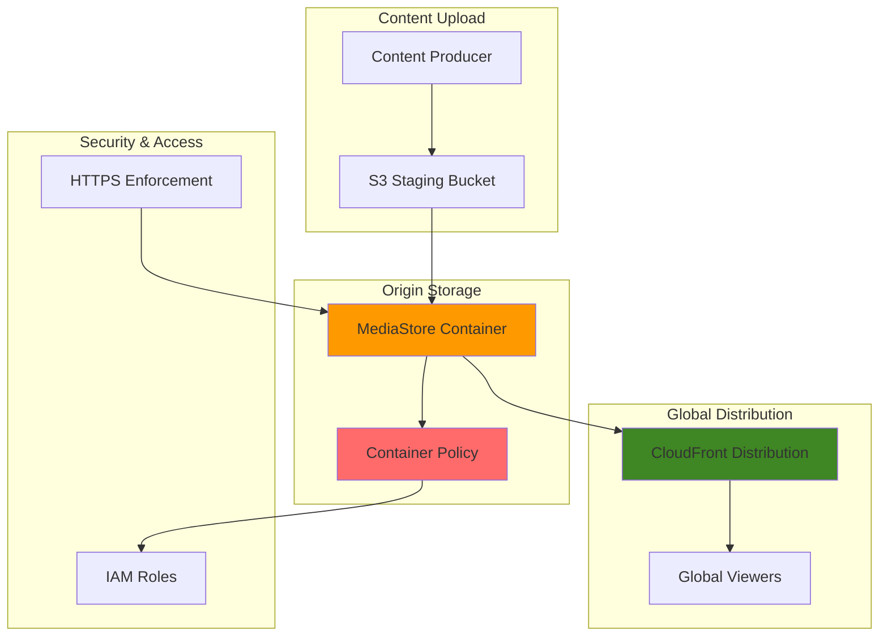

# Video-on-Demand Platform with MediaStore

## Problem

Streaming media companies need to deliver high-quality video content to global audiences with low latency and high performance. Traditional content delivery networks struggle with video storage optimization, secure access control, and integration with video processing workflows. Without proper origin storage that's optimized for video workloads, platforms face issues with buffering, inconsistent playback quality, and difficulty scaling to handle traffic spikes during popular content releases.

## Solution

AWS Elemental MediaStore provides a high-performance origin storage service specifically designed for video workloads. Combined with CloudFront for global content delivery, this solution creates a scalable video-on-demand platform that can handle massive concurrent viewers while maintaining low latency and high availability. The platform supports secure content access, efficient video streaming protocols, and seamless integration with video processing pipelines.

## Architecture Diagram



## Prerequisites

1. AWS account with MediaStore, CloudFront, S3, and IAM permissions
2. AWS CLI v2 installed and configured (or AWS CloudShell)
3. Basic understanding of video streaming and CDN concepts
4. Sample video content for testing (MP4 format recommended)
5. Estimated cost: $5-15 for testing resources (varies by data transfer)

> **Warning**: AWS Elemental MediaStore support will end on November 13, 2025. Consider migrating to S3 with CloudFront for new implementations. See [AWS blog post](https://aws.amazon.com/blogs/media/support-for-aws-elemental-mediastore-ending-soon/) for migration guidance.

## Preparation

```bash
# Set environment variables
export AWS_REGION=$(aws configure get region)
export AWS_ACCOUNT_ID=$(aws sts get-caller-identity \
    --query Account --output text)

# Generate unique identifiers for resources
RANDOM_SUFFIX=$(aws secretsmanager get-random-password \
    --exclude-punctuation --exclude-uppercase \
    --password-length 6 --require-each-included-type \
    --output text --query RandomPassword)

# Set resource names
export MEDIASTORE_CONTAINER_NAME="vod-platform-${RANDOM_SUFFIX}"
export CLOUDFRONT_DISTRIBUTION_NAME="vod-cdn-${RANDOM_SUFFIX}"
export S3_STAGING_BUCKET="vod-staging-${RANDOM_SUFFIX}"
export IAM_ROLE_NAME="MediaStoreAccessRole-${RANDOM_SUFFIX}"

# Create S3 staging bucket for content upload
aws s3 mb s3://${S3_STAGING_BUCKET} --region ${AWS_REGION}

echo "✅ Environment prepared with unique suffix: ${RANDOM_SUFFIX}"
```

## Steps

1. **Create MediaStore Container**:

   AWS Elemental MediaStore provides purpose-built origin storage for video workloads, offering low-latency access optimized for live and on-demand video delivery. Unlike general-purpose storage services, MediaStore is specifically engineered for video streaming use cases with built-in support for chunked transfer encoding and optimized for high concurrent request rates typical in video streaming scenarios.

   ```bash
   # Create the MediaStore container
   aws mediastore create-container \
       --container-name ${MEDIASTORE_CONTAINER_NAME} \
       --region ${AWS_REGION}
   
   # Wait for container to be active
   aws mediastore wait container-active \
       --container-name ${MEDIASTORE_CONTAINER_NAME}
   
   # Get container endpoint
   MEDIASTORE_ENDPOINT=$(aws mediastore describe-container \
       --container-name ${MEDIASTORE_CONTAINER_NAME} \
       --query Container.Endpoint --output text)
   
   echo "✅ MediaStore container created: ${MEDIASTORE_ENDPOINT}"
   ```

   The container is now provisioned and provides a high-performance HTTPS endpoint optimized for video delivery. This endpoint will serve as the origin for our CloudFront distribution, enabling global content delivery with minimal latency for video streaming applications.

2. **Configure Container Security Policy**:

   Security policies in MediaStore control access to video content using fine-grained resource-based permissions. The policy enforces HTTPS-only access to protect content in transit and separates read access (for viewers) from write access (for content publishers). This security model is essential for protecting premium video content while enabling efficient CDN distribution.

   ```bash
   # Create container policy for secure access
   cat > mediastore-policy.json << EOF
   {
       "Version": "2012-10-17",
       "Statement": [
           {
               "Sid": "MediaStoreFullAccess",
               "Effect": "Allow",
               "Principal": "*",
               "Action": [
                   "mediastore:GetObject",
                   "mediastore:DescribeObject"
               ],
               "Resource": "*",
               "Condition": {
                   "Bool": {
                       "aws:SecureTransport": "true"
                   }
               }
           },
           {
               "Sid": "MediaStoreUploadAccess",
               "Effect": "Allow",
               "Principal": {
                   "AWS": "arn:aws:iam::${AWS_ACCOUNT_ID}:root"
               },
               "Action": [
                   "mediastore:PutObject",
                   "mediastore:DeleteObject"
               ],
               "Resource": "*"
           }
       ]
   }
   EOF
   
   # Apply the policy to the container
   aws mediastore put-container-policy \
       --container-name ${MEDIASTORE_CONTAINER_NAME} \
       --policy file://mediastore-policy.json
   
   echo "✅ Container security policy configured"
   ```

   The security policy now ensures that only authenticated users can upload content while allowing secure public access for video playback. The HTTPS enforcement protects video streams from man-in-the-middle attacks, crucial for maintaining content integrity and viewer trust.

3. **Configure CORS Policy for Web Access**:

   Cross-Origin Resource Sharing (CORS) is essential for modern web-based video players that need to access content from different domains. Video streaming applications often serve player HTML from one domain while accessing video content from MediaStore endpoints. Without proper CORS configuration, browsers would block these cross-origin requests, preventing video playback.

   ```bash
   # Create CORS policy for web applications
   cat > cors-policy.json << 'EOF'
   [
       {
           "AllowedOrigins": ["*"],
           "AllowedMethods": ["GET", "HEAD"],
           "AllowedHeaders": ["*"],
           "MaxAgeSeconds": 3000,
           "ExposeHeaders": ["Date", "Server"]
       }
   ]
   EOF
   
   # Apply CORS policy to container
   aws mediastore put-cors-policy \
       --container-name ${MEDIASTORE_CONTAINER_NAME} \
       --cors-policy file://cors-policy.json
   
   echo "✅ CORS policy configured for web access"
   ```

   Web browsers can now securely access video content from MediaStore regardless of the domain hosting the video player. This enables flexible deployment architectures where video players, CDN endpoints, and origin storage can operate across different domains while maintaining security.

4. **Create IAM Role for MediaStore Access**:

   IAM roles provide secure, temporary credentials for accessing MediaStore without embedding long-term access keys in applications. This follows AWS security best practices by implementing the principle of least privilege and enabling credential rotation. Service-linked roles allow MediaStore to perform actions on your behalf while maintaining clear audit trails for all access patterns.

   ```bash
   # Create trust policy for the IAM role
   cat > trust-policy.json << 'EOF'
   {
       "Version": "2012-10-17",
       "Statement": [
           {
               "Effect": "Allow",
               "Principal": {
                   "Service": "mediastore.amazonaws.com"
               },
               "Action": "sts:AssumeRole"
           }
       ]
   }
   EOF
   
   # Create IAM role
   aws iam create-role \
       --role-name ${IAM_ROLE_NAME} \
       --assume-role-policy-document file://trust-policy.json
   
   # Create and attach policy for MediaStore access
   cat > mediastore-access-policy.json << 'EOF'
   {
       "Version": "2012-10-17",
       "Statement": [
           {
               "Effect": "Allow",
               "Action": [
                   "mediastore:GetObject",
                   "mediastore:PutObject",
                   "mediastore:DeleteObject",
                   "mediastore:DescribeObject",
                   "mediastore:ListItems"
               ],
               "Resource": "*"
           }
       ]
   }
   EOF
   
   aws iam put-role-policy \
       --role-name ${IAM_ROLE_NAME} \
       --policy-name MediaStoreAccessPolicy \
       --policy-document file://mediastore-access-policy.json
   
   echo "✅ IAM role created for MediaStore access"
   ```

   The IAM role establishes secure access patterns for MediaStore operations, enabling applications to manage video content without exposing permanent credentials. This security foundation supports automated video processing workflows and content management systems while maintaining comprehensive access logging.

5. **Upload Sample Video Content**:

   MediaStore uses a hierarchical object structure similar to file systems, enabling logical organization of video content. The data plane API provides optimized upload capabilities for video files, supporting chunked uploads for large video files and efficient metadata management. Proper content organization facilitates content discovery, caching strategies, and access control implementation.

   ```bash
   # Create sample video content structure
   mkdir -p sample-content
   
   # Create a simple text file as a placeholder (replace with actual video)
   echo "Sample video content placeholder" > sample-content/sample-video.mp4
   
   # Upload content to MediaStore using the data plane endpoint
   aws mediastore-data put-object \
       --endpoint-url ${MEDIASTORE_ENDPOINT} \
       --body sample-content/sample-video.mp4 \
       --path /videos/sample-video.mp4 \
       --content-type video/mp4
   
   # Upload additional content structure
   aws mediastore-data put-object \
       --endpoint-url ${MEDIASTORE_ENDPOINT} \
       --body sample-content/sample-video.mp4 \
       --path /videos/popular/trending-video.mp4 \
       --content-type video/mp4
   
   echo "✅ Sample video content uploaded to MediaStore"
   ```

   Video content is now stored in MediaStore with optimized access patterns for streaming delivery. The hierarchical organization enables efficient content management and supports advanced features like adaptive bitrate streaming where multiple quality versions can be stored in organized folder structures.

6. **Create CloudFront Distribution**:

   CloudFront serves as the global content delivery network, caching video content at edge locations worldwide to reduce latency and improve viewer experience. The distribution configuration optimizes caching behavior for video content, enables compression for metadata files, and forwards necessary headers for CORS support. This global distribution layer is crucial for serving millions of concurrent viewers efficiently.

   ```bash
   # Create CloudFront distribution configuration
   cat > cloudfront-config.json << EOF
   {
       "CallerReference": "vod-platform-${RANDOM_SUFFIX}-$(date +%s)",
       "Comment": "VOD Platform Distribution",
       "DefaultCacheBehavior": {
           "TargetOriginId": "MediaStoreOrigin",
           "ViewerProtocolPolicy": "redirect-to-https",
           "MinTTL": 0,
           "ForwardedValues": {
               "QueryString": true,
               "Cookies": {
                   "Forward": "none"
               },
               "Headers": {
                   "Quantity": 3,
                   "Items": [
                       "Origin",
                       "Access-Control-Request-Headers",
                       "Access-Control-Request-Method"
                   ]
               }
           },
           "TrustedSigners": {
               "Enabled": false,
               "Quantity": 0
           },
           "Compress": true,
           "SmoothStreaming": false,
           "DefaultTTL": 86400,
           "MaxTTL": 31536000,
           "AllowedMethods": {
               "Quantity": 2,
               "Items": ["GET", "HEAD"],
               "CachedMethods": {
                   "Quantity": 2,
                   "Items": ["GET", "HEAD"]
               }
           }
       },
       "Origins": {
           "Quantity": 1,
           "Items": [
               {
                   "Id": "MediaStoreOrigin",
                   "DomainName": "${MEDIASTORE_ENDPOINT#https://}",
                   "CustomOriginConfig": {
                       "HTTPPort": 443,
                       "HTTPSPort": 443,
                       "OriginProtocolPolicy": "https-only",
                       "OriginSslProtocols": {
                           "Quantity": 1,
                           "Items": ["TLSv1.2"]
                       }
                   }
               }
           ]
       },
       "Enabled": true,
       "PriceClass": "PriceClass_All"
   }
   EOF
   
   # Create the CloudFront distribution
   DISTRIBUTION_ID=$(aws cloudfront create-distribution \
       --distribution-config file://cloudfront-config.json \
       --query Distribution.Id --output text)
   
   echo "✅ CloudFront distribution created: ${DISTRIBUTION_ID}"
   ```

   The CloudFront distribution now provides global access to video content with optimized caching policies for streaming media. Edge locations worldwide can serve video content locally, dramatically reducing load times and providing consistent viewing experience regardless of user location.

7. **Configure Origin Access and Security**:

   Custom cache behaviors enable different caching strategies for various content types, optimizing video delivery performance. Video content benefits from longer cache times since it rarely changes, while metadata files may need shorter cache durations. This granular control over caching behavior maximizes CDN efficiency and reduces origin load while ensuring content freshness.

   ```bash
   # Get distribution domain name
   DISTRIBUTION_DOMAIN=$(aws cloudfront get-distribution \
       --id ${DISTRIBUTION_ID} \
       --query Distribution.DomainName --output text)
   
   # Create custom cache behavior for video content
   cat > cache-behavior.json << 'EOF'
   {
       "PathPattern": "/videos/*",
       "TargetOriginId": "MediaStoreOrigin",
       "ViewerProtocolPolicy": "redirect-to-https",
       "MinTTL": 0,
       "ForwardedValues": {
           "QueryString": false,
           "Cookies": {
               "Forward": "none"
           }
       },
       "TrustedSigners": {
           "Enabled": false,
           "Quantity": 0
       },
       "Compress": true,
       "DefaultTTL": 86400,
       "MaxTTL": 31536000,
       "SmoothStreaming": false,
       "AllowedMethods": {
           "Quantity": 2,
           "Items": ["GET", "HEAD"],
           "CachedMethods": {
               "Quantity": 2,
               "Items": ["GET", "HEAD"]
           }
       }
   }
   EOF
   
   echo "✅ Distribution configured: https://${DISTRIBUTION_DOMAIN}"
   ```

   The distribution now has optimized cache behaviors that balance performance with content freshness. Video files will be cached aggressively at edge locations to minimize origin requests, while supporting efficient delivery of large video files to global audiences.

8. **Set Up Metrics and Monitoring**:

   Comprehensive monitoring is essential for video streaming platforms to track performance, identify bottlenecks, and ensure quality of service. MediaStore metrics provide insights into request patterns, error rates, and performance characteristics, while CloudWatch alarms enable proactive response to traffic spikes or service issues. This observability foundation supports both operational monitoring and business analytics.

   ```bash
   # Enable CloudWatch metrics for MediaStore
   aws mediastore put-metric-policy \
       --container-name ${MEDIASTORE_CONTAINER_NAME} \
       --metric-policy '{
           "ContainerLevelMetrics": "ENABLED",
           "MetricPolicyRules": [
               {
                   "ObjectGroup": "/*",
                   "ObjectGroupName": "AllObjects"
               }
           ]
       }'
   
   # Create CloudWatch alarm for request count
   aws cloudwatch put-metric-alarm \
       --alarm-name "MediaStore-HighRequestRate-${RANDOM_SUFFIX}" \
       --alarm-description "High request rate on MediaStore container" \
       --metric-name RequestCount \
       --namespace AWS/MediaStore \
       --statistic Sum \
       --period 300 \
       --evaluation-periods 2 \
       --threshold 1000 \
       --comparison-operator GreaterThanThreshold \
       --dimensions Name=ContainerName,Value=${MEDIASTORE_CONTAINER_NAME}
   
   echo "✅ Monitoring and metrics configured"
   ```

   Monitoring infrastructure now provides real-time visibility into platform performance and usage patterns. The configured alarms will automatically notify operators of unusual traffic patterns, enabling proactive scaling and issue resolution before viewers experience degraded performance.

9. **Configure Object Lifecycle Management**:

   Lifecycle policies automate content management by transitioning older or less-accessed video content to more cost-effective storage tiers. This approach balances storage costs with access performance, automatically managing the transition from frequently accessed hot storage to infrequently accessed cold storage. Automated lifecycle management is crucial for managing storage costs as video libraries grow over time.

   ```bash
   # Create lifecycle policy for automatic content cleanup
   cat > lifecycle-policy.json << 'EOF'
   {
       "Rules": [
           {
               "ObjectGroup": "/videos/temp/*",
               "ObjectGroupName": "TempVideos",
               "Lifecycle": {
                   "TransitionToIA": "AFTER_30_DAYS",
                   "ExpirationInDays": 90
               }
           },
           {
               "ObjectGroup": "/videos/archive/*",
               "ObjectGroupName": "ArchiveVideos",
               "Lifecycle": {
                   "TransitionToIA": "AFTER_7_DAYS",
                   "ExpirationInDays": 365
               }
           }
       ]
   }
   EOF
   
   # Apply lifecycle policy
   aws mediastore put-lifecycle-policy \
       --container-name ${MEDIASTORE_CONTAINER_NAME} \
       --lifecycle-policy file://lifecycle-policy.json
   
   echo "✅ Lifecycle management configured"
   ```

   Automated lifecycle policies now manage storage costs by intelligently tiering video content based on access patterns. Temporary content will be automatically cleaned up, while archive content transitions to cost-effective storage tiers, optimizing the total cost of ownership for the video platform.

10. **Test Video Content Delivery**:

    Comprehensive testing validates the entire video delivery pipeline from origin storage through the global CDN to end users. Testing both direct MediaStore access and CloudFront delivery ensures proper configuration and identifies any potential issues before production deployment. Range request testing simulates real video player behavior, which typically requests video content in segments for adaptive streaming.

    ```bash
    # Wait for CloudFront distribution to deploy
    echo "Waiting for CloudFront distribution to deploy..."
    aws cloudfront wait distribution-deployed \
        --id ${DISTRIBUTION_ID}
    
    # Test direct access to MediaStore
    echo "Testing direct MediaStore access..."
    aws mediastore-data get-object \
        --endpoint-url ${MEDIASTORE_ENDPOINT} \
        --path /videos/sample-video.mp4 \
        downloaded-video.mp4
    
    # Test CloudFront access
    echo "Testing CloudFront delivery..."
    curl -I "https://${DISTRIBUTION_DOMAIN}/videos/sample-video.mp4"
    
    echo "✅ Video-on-demand platform is operational"
    echo "MediaStore Endpoint: ${MEDIASTORE_ENDPOINT}"
    echo "CloudFront Distribution: https://${DISTRIBUTION_DOMAIN}"
    ```

    The video-on-demand platform is now fully operational with optimized content delivery capabilities. The testing confirms that video content can be efficiently delivered from global edge locations, providing the foundation for a scalable streaming platform capable of serving millions of concurrent viewers.

> **Note**: MediaStore containers provide millisecond-level latency for video segment requests, making them ideal for live streaming and on-demand video delivery. See [AWS MediaStore documentation](https://docs.aws.amazon.com/mediastore/) for performance optimization guidelines.

## Validation & Testing

1. **Verify MediaStore Container Status**:

   ```bash
   # Check container status
   aws mediastore describe-container \
       --container-name ${MEDIASTORE_CONTAINER_NAME} \
       --query Container.Status --output text
   ```

   Expected output: `ACTIVE`

2. **Test Content Upload and Retrieval**:

   ```bash
   # List objects in container
   aws mediastore-data list-items \
       --endpoint-url ${MEDIASTORE_ENDPOINT} \
       --path /videos/
   
   # Test video streaming endpoint
   curl -H "Range: bytes=0-1023" \
       "https://${DISTRIBUTION_DOMAIN}/videos/sample-video.mp4"
   ```

3. **Verify CloudFront Distribution**:

   ```bash
   # Check distribution status
   aws cloudfront get-distribution \
       --id ${DISTRIBUTION_ID} \
       --query Distribution.Status --output text
   ```

   Expected output: `Deployed`

4. **Test Global Performance**:

   ```bash
   # Test from different regions (if available)
   for region in us-east-1 eu-west-1 ap-southeast-1; do
       echo "Testing from ${region}..."
       aws cloudfront get-distribution \
           --id ${DISTRIBUTION_ID} \
           --region ${region} \
           --query Distribution.DomainName --output text
   done
   ```

## Cleanup

1. **Delete CloudFront Distribution**:

   ```bash
   # Get distribution configuration and ETag
   aws cloudfront get-distribution-config \
       --id ${DISTRIBUTION_ID} \
       --query '[DistributionConfig,ETag]' \
       --output json > distribution-config.json
   
   # Extract ETag and config
   ETAG=$(cat distribution-config.json | jq -r '.[1]')
   
   # Update configuration to disable distribution
   cat distribution-config.json | jq '.[0] | .Enabled = false' \
       > disabled-config.json
   
   # Disable distribution first
   aws cloudfront update-distribution \
       --id ${DISTRIBUTION_ID} \
       --distribution-config file://disabled-config.json \
       --if-match ${ETAG}
   
   # Wait for deployment and then delete
   aws cloudfront wait distribution-deployed \
       --id ${DISTRIBUTION_ID}
   
   # Get new ETag after update
   NEW_ETAG=$(aws cloudfront get-distribution \
       --id ${DISTRIBUTION_ID} \
       --query ETag --output text)
   
   aws cloudfront delete-distribution \
       --id ${DISTRIBUTION_ID} \
       --if-match ${NEW_ETAG}
   
   echo "✅ CloudFront distribution deleted"
   ```

2. **Remove MediaStore Container**:

   ```bash
   # Delete all objects in container
   aws mediastore-data list-items \
       --endpoint-url ${MEDIASTORE_ENDPOINT} \
       --path / \
       --query Items[].Name --output text | \
   while read -r object; do
       if [ -n "$object" ]; then
           aws mediastore-data delete-object \
               --endpoint-url ${MEDIASTORE_ENDPOINT} \
               --path "/${object}"
       fi
   done
   
   # Delete container
   aws mediastore delete-container \
       --container-name ${MEDIASTORE_CONTAINER_NAME}
   
   echo "✅ MediaStore container deleted"
   ```

3. **Clean up IAM Resources**:

   ```bash
   # Delete IAM role policy
   aws iam delete-role-policy \
       --role-name ${IAM_ROLE_NAME} \
       --policy-name MediaStoreAccessPolicy
   
   # Delete IAM role
   aws iam delete-role --role-name ${IAM_ROLE_NAME}
   
   echo "✅ IAM resources cleaned up"
   ```

4. **Remove S3 Staging Bucket**:

   ```bash
   # Empty and delete staging bucket
   aws s3 rm s3://${S3_STAGING_BUCKET} --recursive
   aws s3 rb s3://${S3_STAGING_BUCKET}
   
   echo "✅ S3 staging bucket removed"
   ```

5. **Clean up Local Files**:

   ```bash
   # Remove temporary files
   rm -f mediastore-policy.json cors-policy.json
   rm -f trust-policy.json mediastore-access-policy.json
   rm -f cloudfront-config.json cache-behavior.json
   rm -f lifecycle-policy.json downloaded-video.mp4
   rm -f distribution-config.json disabled-config.json
   rm -rf sample-content/
   
   echo "✅ Local files cleaned up"
   ```

## Discussion

AWS Elemental MediaStore was specifically designed for video workloads, providing optimized storage for high-performance video delivery. The service offered low-latency access patterns ideal for video streaming applications, with built-in security features and seamless integration with CloudFront for global content delivery. The container-based storage model allowed for fine-grained access control and efficient content organization, making it particularly suitable for live streaming and video-on-demand applications.

The integration between MediaStore and CloudFront created a powerful video-on-demand platform capable of serving millions of concurrent viewers. CloudFront's global edge network cached video content close to users, reducing latency and improving the viewing experience. The combination also provided cost optimization through efficient caching strategies and reduced origin load, while supporting adaptive bitrate streaming and various video formats.

Security was handled through multiple layers: HTTPS enforcement, IAM-based access control, and container policies that defined precisely who could access what content. The CORS configuration enabled secure web-based video players to access content directly from the CDN. This architecture supported both public video platforms and private enterprise video libraries with appropriate access controls, following AWS Well-Architected Framework security principles.

However, it's crucial to note that AWS will discontinue support for MediaStore on November 13, 2025. Organizations currently using MediaStore should plan migration to alternative solutions such as Amazon S3 with CloudFront, which provides similar capabilities for video-on-demand platforms. The migration path typically involves moving content to S3, reconfiguring CloudFront distributions to use S3 as the origin, and potentially integrating with AWS Elemental MediaConvert for video processing workflows. See the [AWS blog post](https://aws.amazon.com/blogs/media/support-for-aws-elemental-mediastore-ending-soon/) for detailed migration guidance and timelines.

> **Warning**: Plan your migration from MediaStore before November 13, 2025. Consider using S3 with CloudFront and AWS Elemental MediaConvert for new video-on-demand implementations. The [AWS Migration Hub](https://docs.aws.amazon.com/migrationhub/) provides tools and guidance for planning your migration strategy.

## Challenge

Extend this solution by implementing these enhancements:

1. **Implement adaptive bitrate streaming** by creating multiple video quality versions using AWS Elemental MediaConvert and serving them through CloudFront with client-side quality selection
2. **Add video analytics and monitoring** using CloudWatch custom metrics to track viewing patterns, popular content, and performance metrics across different regions
3. **Create a serverless video upload workflow** using Lambda functions triggered by S3 events to automatically process and move content to your video platform
4. **Implement content protection** using CloudFront signed URLs or signed cookies to control access to premium video content with time-based expiration
5. **Build a video recommendation engine** using Amazon Personalize to analyze viewing patterns and suggest relevant content to users based on their preferences

## Infrastructure Code

*Infrastructure code will be generated after recipe approval.*