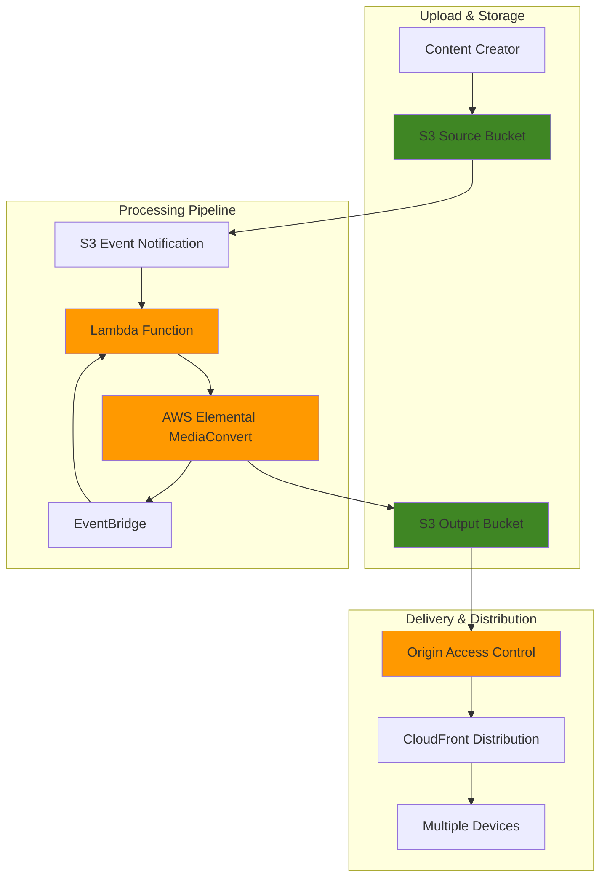

# Building Video Processing Workflows with S3, Lambda, and MediaConvert

## Problem

A streaming media company needs to automatically process user-uploaded videos into multiple formats and resolutions for different devices and bandwidth conditions. Manual video processing is time-consuming and doesn't scale with growing content volume. The company requires an automated solution that can handle various input formats, create adaptive bitrate streams, generate thumbnails, and trigger downstream workflows when processing completes.

## Solution

This solution creates an event-driven video processing pipeline using Amazon S3 for storage, AWS Lambda for orchestration, and AWS Elemental MediaConvert for transcoding. When videos are uploaded to S3, Lambda functions automatically initiate MediaConvert jobs to create HLS adaptive bitrate streams, MP4 files, and thumbnail images, enabling seamless content delivery across multiple devices and network conditions.

## Architecture Diagram



## Prerequisites

1. AWS account with appropriate permissions for S3, Lambda, MediaConvert, EventBridge, CloudFront, and IAM
2. AWS CLI v2 installed and configured (or AWS CloudShell)
3. Basic knowledge of video formats and streaming protocols
4. Understanding of event-driven architectures
5. Estimated cost: $5-15 for testing (depends on video processing volume)

> **Note**: AWS Elemental MediaConvert is the recommended service for video processing. Amazon Elastic Transcoder was discontinued on November 13, 2025, and all new applications should use MediaConvert for video processing workflows.

> **Warning**: MediaConvert pricing is based on the duration and complexity of video processing. Monitor your usage through AWS Cost Explorer and consider implementing processing limits for cost control.

## Preparation

```bash
# Set environment variables
export AWS_REGION=$(aws configure get region)
export AWS_ACCOUNT_ID=$(aws sts get-caller-identity \
    --query Account --output text)

# Generate unique identifiers for resources
RANDOM_SUFFIX=$(aws secretsmanager get-random-password \
    --exclude-punctuation --exclude-uppercase \
    --password-length 6 --require-each-included-type \
    --output text --query RandomPassword)

export S3_SOURCE_BUCKET="video-source-${RANDOM_SUFFIX}"
export S3_OUTPUT_BUCKET="video-output-${RANDOM_SUFFIX}"
export LAMBDA_FUNCTION_NAME="video-processor-${RANDOM_SUFFIX}"
export MEDIACONVERT_ROLE_NAME="MediaConvertRole-${RANDOM_SUFFIX}"
export LAMBDA_ROLE_NAME="LambdaVideoProcessorRole-${RANDOM_SUFFIX}"

# Create S3 buckets for video processing
aws s3 mb s3://${S3_SOURCE_BUCKET} --region ${AWS_REGION}
aws s3 mb s3://${S3_OUTPUT_BUCKET} --region ${AWS_REGION}

# Enable versioning and encryption for security
aws s3api put-bucket-versioning \
    --bucket ${S3_SOURCE_BUCKET} \
    --versioning-configuration Status=Enabled

aws s3api put-bucket-versioning \
    --bucket ${S3_OUTPUT_BUCKET} \
    --versioning-configuration Status=Enabled

aws s3api put-bucket-encryption \
    --bucket ${S3_SOURCE_BUCKET} \
    --server-side-encryption-configuration \
    'Rules=[{ApplyServerSideEncryptionByDefault:{SSEAlgorithm:AES256}}]'

aws s3api put-bucket-encryption \
    --bucket ${S3_OUTPUT_BUCKET} \
    --server-side-encryption-configuration \
    'Rules=[{ApplyServerSideEncryptionByDefault:{SSEAlgorithm:AES256}}]'

echo "✅ Created S3 buckets: ${S3_SOURCE_BUCKET} and ${S3_OUTPUT_BUCKET}"
```

## Steps

1. **Create IAM role for MediaConvert**:

   AWS Elemental MediaConvert requires an IAM service role to access your S3 buckets for reading source videos and writing processed outputs. This role operates on the principle of least privilege, providing MediaConvert with only the specific permissions needed to perform video transcoding operations. Understanding IAM roles for AWS services is fundamental to building secure, automated workflows that follow AWS Well-Architected Framework security principles.

   ```bash
   # Create trust policy for MediaConvert
   cat > mediaconvert-trust-policy.json << EOF
   {
     "Version": "2012-10-17",
     "Statement": [
       {
         "Effect": "Allow",
         "Principal": {
           "Service": "mediaconvert.amazonaws.com"
         },
         "Action": "sts:AssumeRole"
       }
     ]
   }
   EOF
   
   # Create MediaConvert role
   aws iam create-role \
       --role-name ${MEDIACONVERT_ROLE_NAME} \
       --assume-role-policy-document file://mediaconvert-trust-policy.json
   
   # Create custom policy with specific bucket access
   cat > mediaconvert-s3-policy.json << EOF
   {
     "Version": "2012-10-17",
     "Statement": [
       {
         "Effect": "Allow",
         "Action": [
           "s3:GetObject",
           "s3:GetObjectVersion"
         ],
         "Resource": "arn:aws:s3:::${S3_SOURCE_BUCKET}/*"
       },
       {
         "Effect": "Allow",
         "Action": [
           "s3:PutObject",
           "s3:PutObjectAcl"
         ],
         "Resource": "arn:aws:s3:::${S3_OUTPUT_BUCKET}/*"
       }
     ]
   }
   EOF
   
   # Create and attach the policy
   aws iam create-policy \
       --policy-name MediaConvertS3Policy-${RANDOM_SUFFIX} \
       --policy-document file://mediaconvert-s3-policy.json
   
   aws iam attach-role-policy \
       --role-name ${MEDIACONVERT_ROLE_NAME} \
       --policy-arn arn:aws:iam::${AWS_ACCOUNT_ID}:policy/MediaConvertS3Policy-${RANDOM_SUFFIX}
   
   export MEDIACONVERT_ROLE_ARN=$(aws iam get-role \
       --role-name ${MEDIACONVERT_ROLE_NAME} \
       --query Role.Arn --output text)
   
   echo "✅ Created MediaConvert role: ${MEDIACONVERT_ROLE_ARN}"
   ```

   The MediaConvert service role is now established with specific S3 permissions following the principle of least privilege. This security foundation enables MediaConvert to securely access your video files and write processed outputs without exposing your AWS credentials or granting excessive permissions.

2. **Create IAM role for Lambda function**:

   Lambda functions require an execution role to interact with other AWS services like MediaConvert and S3. This role enables the serverless orchestration of video processing workflows while maintaining security through temporary, rotatable credentials. The execution role eliminates the need to embed AWS credentials in your function code, following AWS security best practices and IAM guidelines.

   ```bash
   # Create trust policy for Lambda
   cat > lambda-trust-policy.json << EOF
   {
     "Version": "2012-10-17",
     "Statement": [
       {
         "Effect": "Allow",
         "Principal": {
           "Service": "lambda.amazonaws.com"
         },
         "Action": "sts:AssumeRole"
       }
     ]
   }
   EOF
   
   # Create Lambda role
   aws iam create-role \
       --role-name ${LAMBDA_ROLE_NAME} \
       --assume-role-policy-document file://lambda-trust-policy.json
   
   # Attach basic Lambda execution policy
   aws iam attach-role-policy \
       --role-name ${LAMBDA_ROLE_NAME} \
       --policy-arn arn:aws:iam::aws:policy/service-role/AWSLambdaBasicExecutionRole
   
   # Create custom policy for MediaConvert and S3 access
   cat > lambda-permissions-policy.json << EOF
   {
     "Version": "2012-10-17",
     "Statement": [
       {
         "Effect": "Allow",
         "Action": [
           "mediaconvert:CreateJob",
           "mediaconvert:GetJob",
           "mediaconvert:ListJobs",
           "mediaconvert:DescribeEndpoints"
         ],
         "Resource": "*"
       },
       {
         "Effect": "Allow",
         "Action": [
           "s3:GetObject"
         ],
         "Resource": "arn:aws:s3:::${S3_SOURCE_BUCKET}/*"
       },
       {
         "Effect": "Allow",
         "Action": [
           "iam:PassRole"
         ],
         "Resource": "${MEDIACONVERT_ROLE_ARN}"
       }
     ]
   }
   EOF
   
   # Create and attach the policy
   aws iam create-policy \
       --policy-name LambdaMediaConvertPolicy-${RANDOM_SUFFIX} \
       --policy-document file://lambda-permissions-policy.json
   
   aws iam attach-role-policy \
       --role-name ${LAMBDA_ROLE_NAME} \
       --policy-arn arn:aws:iam::${AWS_ACCOUNT_ID}:policy/LambdaMediaConvertPolicy-${RANDOM_SUFFIX}
   
   export LAMBDA_ROLE_ARN=$(aws iam get-role \
       --role-name ${LAMBDA_ROLE_NAME} \
       --query Role.Arn --output text)
   
   echo "✅ Created Lambda role: ${LAMBDA_ROLE_ARN}"
   ```

   The Lambda execution role is configured with specific permissions to orchestrate MediaConvert jobs and access S3 resources. This serverless security model enables your function to make AWS API calls on your behalf while adhering to the principle of least privilege.

3. **Get MediaConvert endpoint**:

   AWS Elemental MediaConvert uses region-specific endpoints that must be discovered dynamically. Unlike many AWS services with predictable endpoint patterns, MediaConvert assigns unique endpoints per region to optimize performance and distribute load. This step retrieves your region's dedicated endpoint, which is essential for all subsequent MediaConvert API operations.

   ```bash
   # Get the MediaConvert endpoint for your region
   export MEDIACONVERT_ENDPOINT=$(aws mediaconvert describe-endpoints \
       --query Endpoints[0].Url --output text)
   
   echo "✅ MediaConvert endpoint: ${MEDIACONVERT_ENDPOINT}"
   ```

   Your region's MediaConvert endpoint is now configured and ready for video processing operations. This endpoint will be used by the Lambda function to submit transcoding jobs and monitor their progress.

4. **Create Lambda function for video processing**:

   The Lambda function serves as the intelligent orchestrator of your video processing pipeline. When triggered by S3 events, it automatically creates MediaConvert jobs with predefined settings for HLS adaptive bitrate streaming and MP4 output. This serverless approach eliminates the need for constantly running servers, automatically scales with demand, and only charges for actual processing time.

   ```bash
   # Create Lambda function code
   cat > lambda_function.py << 'EOF'
   import json
   import boto3
   import urllib.parse
   import os
   
   def lambda_handler(event, context):
       # Initialize MediaConvert client
       mediaconvert = boto3.client('mediaconvert', 
           endpoint_url=os.environ['MEDIACONVERT_ENDPOINT'])
       
       # Parse S3 event
       for record in event['Records']:
           bucket = record['s3']['bucket']['name']
           key = urllib.parse.unquote_plus(record['s3']['object']['key'])
           
           # Skip if not a video file
           video_extensions = ('.mp4', '.mov', '.avi', '.mkv', '.m4v', '.flv', '.wmv')
           if not key.lower().endswith(video_extensions):
               print(f"Skipping non-video file: {key}")
               continue
           
           # Extract filename without extension
           filename = key.split('.')[0].split('/')[-1]
           
           # Create job settings
           job_settings = {
               "Role": os.environ['MEDIACONVERT_ROLE_ARN'],
               "Settings": {
                   "Inputs": [{
                       "AudioSelectors": {
                           "Audio Selector 1": {
                               "Offset": 0,
                               "DefaultSelection": "DEFAULT",
                               "ProgramSelection": 1
                           }
                       },
                       "VideoSelector": {
                           "ColorSpace": "FOLLOW"
                       },
                       "FilterEnable": "AUTO",
                       "PsiControl": "USE_PSI",
                       "FilterStrength": 0,
                       "DeblockFilter": "DISABLED",
                       "DenoiseFilter": "DISABLED",
                       "TimecodeSource": "EMBEDDED",
                       "FileInput": f"s3://{bucket}/{key}"
                   }],
                   "OutputGroups": [
                       {
                           "Name": "Apple HLS",
                           "OutputGroupSettings": {
                               "Type": "HLS_GROUP_SETTINGS",
                               "HlsGroupSettings": {
                                   "ManifestDurationFormat": "INTEGER",
                                   "Destination": f"s3://{os.environ['S3_OUTPUT_BUCKET']}/hls/{filename}/",
                                   "TimedMetadataId3Frame": "PRIV",
                                   "CodecSpecification": "RFC_4281",
                                   "OutputSelection": "MANIFESTS_AND_SEGMENTS",
                                   "ProgramDateTimePeriod": 600,
                                   "MinSegmentLength": 0,
                                   "DirectoryStructure": "SINGLE_DIRECTORY",
                                   "ProgramDateTime": "EXCLUDE",
                                   "SegmentLength": 10,
                                   "ManifestCompression": "NONE",
                                   "ClientCache": "ENABLED",
                                   "AudioOnlyHeader": "INCLUDE"
                               }
                           },
                           "Outputs": [
                               {
                                   "VideoDescription": {
                                       "ScalingBehavior": "DEFAULT",
                                       "TimecodeInsertion": "DISABLED",
                                       "AntiAlias": "ENABLED",
                                       "Sharpness": 50,
                                       "CodecSettings": {
                                           "Codec": "H_264",
                                           "H264Settings": {
                                               "InterlaceMode": "PROGRESSIVE",
                                               "NumberReferenceFrames": 3,
                                               "Syntax": "DEFAULT",
                                               "Softness": 0,
                                               "GopClosedCadence": 1,
                                               "GopSize": 90,
                                               "Slices": 1,
                                               "GopBReference": "DISABLED",
                                               "SlowPal": "DISABLED",
                                               "SpatialAdaptiveQuantization": "ENABLED",
                                               "TemporalAdaptiveQuantization": "ENABLED",
                                               "FlickerAdaptiveQuantization": "DISABLED",
                                               "EntropyEncoding": "CABAC",
                                               "Bitrate": 2000000,
                                               "FramerateControl": "SPECIFIED",
                                               "RateControlMode": "CBR",
                                               "CodecProfile": "MAIN",
                                               "Telecine": "NONE",
                                               "MinIInterval": 0,
                                               "AdaptiveQuantization": "HIGH",
                                               "CodecLevel": "AUTO",
                                               "FieldEncoding": "PAFF",
                                               "SceneChangeDetect": "ENABLED",
                                               "QualityTuningLevel": "SINGLE_PASS",
                                               "FramerateConversionAlgorithm": "DUPLICATE_DROP",
                                               "UnregisteredSeiTimecode": "DISABLED",
                                               "GopSizeUnits": "FRAMES",
                                               "ParControl": "SPECIFIED",
                                               "NumberBFramesBetweenReferenceFrames": 2,
                                               "RepeatPps": "DISABLED",
                                               "FramerateNumerator": 30,
                                               "FramerateDenominator": 1,
                                               "ParNumerator": 1,
                                               "ParDenominator": 1
                                           }
                                       },
                                       "AfdSignaling": "NONE",
                                       "DropFrameTimecode": "ENABLED",
                                       "RespondToAfd": "NONE",
                                       "ColorMetadata": "INSERT",
                                       "Width": 1280,
                                       "Height": 720
                                   },
                                   "AudioDescriptions": [
                                       {
                                           "AudioTypeControl": "FOLLOW_INPUT",
                                           "CodecSettings": {
                                               "Codec": "AAC",
                                               "AacSettings": {
                                                   "AudioDescriptionBroadcasterMix": "NORMAL",
                                                   "Bitrate": 96000,
                                                   "RateControlMode": "CBR",
                                                   "CodecProfile": "LC",
                                                   "CodingMode": "CODING_MODE_2_0",
                                                   "RawFormat": "NONE",
                                                   "SampleRate": 48000,
                                                   "Specification": "MPEG4"
                                               }
                                           },
                                           "AudioSourceName": "Audio Selector 1",
                                           "LanguageCodeControl": "FOLLOW_INPUT"
                                       }
                                   ],
                                   "OutputSettings": {
                                       "HlsSettings": {
                                           "AudioGroupId": "program_audio",
                                           "AudioTrackType": "ALTERNATE_AUDIO_AUTO_SELECT_DEFAULT",
                                           "IFrameOnlyManifest": "EXCLUDE"
                                       }
                                   },
                                   "NameModifier": "_720p"
                               }
                           ]
                       },
                       {
                           "Name": "File Group",
                           "OutputGroupSettings": {
                               "Type": "FILE_GROUP_SETTINGS",
                               "FileGroupSettings": {
                                   "Destination": f"s3://{os.environ['S3_OUTPUT_BUCKET']}/mp4/"
                               }
                           },
                           "Outputs": [
                               {
                                   "VideoDescription": {
                                       "Width": 1280,
                                       "Height": 720,
                                       "CodecSettings": {
                                           "Codec": "H_264",
                                           "H264Settings": {
                                               "Bitrate": 2000000,
                                               "RateControlMode": "CBR",
                                               "CodecProfile": "MAIN",
                                               "GopSize": 90,
                                               "FramerateControl": "SPECIFIED",
                                               "FramerateNumerator": 30,
                                               "FramerateDenominator": 1,
                                               "InterlaceMode": "PROGRESSIVE",
                                               "NumberReferenceFrames": 3,
                                               "Syntax": "DEFAULT"
                                           }
                                       }
                                   },
                                   "AudioDescriptions": [
                                       {
                                           "CodecSettings": {
                                               "Codec": "AAC",
                                               "AacSettings": {
                                                   "Bitrate": 96000,
                                                   "SampleRate": 48000,
                                                   "CodecProfile": "LC",
                                                   "CodingMode": "CODING_MODE_2_0"
                                               }
                                           },
                                           "AudioSourceName": "Audio Selector 1"
                                       }
                                   ],
                                   "ContainerSettings": {
                                       "Container": "MP4",
                                       "Mp4Settings": {
                                           "CslgAtom": "INCLUDE",
                                           "FreeSpaceBox": "EXCLUDE",
                                           "MoovPlacement": "PROGRESSIVE_DOWNLOAD"
                                       }
                                   },
                                   "NameModifier": f"_{filename}_720p"
                               }
                           ]
                       }
                   ]
               }
           }
           
           # Create MediaConvert job
           try:
               response = mediaconvert.create_job(**job_settings)
               job_id = response['Job']['Id']
               print(f"Created MediaConvert job: {job_id} for {key}")
               
           except Exception as e:
               print(f"Error creating MediaConvert job for {key}: {str(e)}")
               raise
       
       return {
           'statusCode': 200,
           'body': json.dumps('Video processing initiated successfully')
       }
   EOF
   
   # Create deployment package
   zip lambda-function.zip lambda_function.py
   
   # Create Lambda function with updated runtime
   aws lambda create-function \
       --function-name ${LAMBDA_FUNCTION_NAME} \
       --runtime python3.12 \
       --role ${LAMBDA_ROLE_ARN} \
       --handler lambda_function.lambda_handler \
       --zip-file fileb://lambda-function.zip \
       --timeout 60 \
       --environment Variables="{MEDIACONVERT_ENDPOINT=${MEDIACONVERT_ENDPOINT},MEDIACONVERT_ROLE_ARN=${MEDIACONVERT_ROLE_ARN},S3_OUTPUT_BUCKET=${S3_OUTPUT_BUCKET}}"
   
   echo "✅ Created Lambda function: ${LAMBDA_FUNCTION_NAME}"
   ```

   The video processing Lambda function is deployed with an updated Python 3.12 runtime and configured with the necessary environment variables and permissions. This serverless orchestrator will automatically detect video uploads and initiate appropriate MediaConvert jobs, enabling hands-free video processing at scale.

5. **Configure S3 event notification**:

   S3 event notifications create the trigger mechanism that makes your video processing pipeline truly event-driven. When videos are uploaded to your source bucket, S3 automatically invokes your Lambda function within seconds, eliminating the need for polling or manual triggering. This real-time response capability is essential for modern media workflows where processing latency directly impacts user experience.

   ```bash
   # Add Lambda invoke permission for S3
   aws lambda add-permission \
       --function-name ${LAMBDA_FUNCTION_NAME} \
       --statement-id s3-trigger \
       --action lambda:InvokeFunction \
       --principal s3.amazonaws.com \
       --source-arn arn:aws:s3:::${S3_SOURCE_BUCKET}
   
   # Create S3 event notification configuration for multiple video formats
   cat > s3-notification.json << EOF
   {
     "LambdaConfigurations": [
       {
         "Id": "video-processing-trigger",
         "LambdaFunctionArn": "arn:aws:lambda:${AWS_REGION}:${AWS_ACCOUNT_ID}:function:${LAMBDA_FUNCTION_NAME}",
         "Events": ["s3:ObjectCreated:*"],
         "Filter": {
           "Key": {
             "FilterRules": [
               {
                 "Name": "suffix",
                 "Value": ".mp4"
               }
             ]
           }
         }
       }
     ]
   }
   EOF
   
   # Apply notification configuration
   aws s3api put-bucket-notification-configuration \
       --bucket ${S3_SOURCE_BUCKET} \
       --notification-configuration file://s3-notification.json
   
   echo "✅ Configured S3 event notification for video processing"
   ```

   The event-driven architecture is now active. S3 will automatically trigger your Lambda function whenever MP4 files are uploaded to the source bucket, creating a seamless, automated video processing pipeline that responds instantly to new content.

6. **Create EventBridge rule for job completion**:

   EventBridge enables sophisticated workflow orchestration by capturing MediaConvert job state changes and triggering downstream actions. This event-driven pattern allows you to build complex processing workflows, send notifications, update databases, or trigger additional processing steps when video transcoding completes. Understanding EventBridge patterns is crucial for building resilient, decoupled architectures.

   ```bash
   # Create EventBridge rule for MediaConvert job completion
   aws events put-rule \
       --name "MediaConvert-JobComplete-${RANDOM_SUFFIX}" \
       --event-pattern '{
         "source": ["aws.mediaconvert"],
         "detail-type": ["MediaConvert Job State Change"],
         "detail": {
           "status": ["COMPLETE", "ERROR"]
         }
       }' \
       --state ENABLED
   
   # Create Lambda function for job completion handling
   cat > completion_handler.py << 'EOF'
   import json
   import boto3
   
   def lambda_handler(event, context):
       print(f"MediaConvert job status change: {json.dumps(event)}")
       
       # Extract job details
       job_id = event['detail']['jobId']
       status = event['detail']['status']
       timestamp = event['detail']['timestamp']
       
       # Handle different job statuses
       if status == 'COMPLETE':
           print(f"SUCCESS: Job {job_id} completed successfully at {timestamp}")
           
           # Add your success logic here:
           # - Send notifications via SNS
           # - Update database records
           # - Trigger additional workflows
           # - Generate metadata or thumbnails
           
       elif status == 'ERROR':
           error_message = event['detail'].get('errorMessage', 'Unknown error')
           print(f"ERROR: Job {job_id} failed at {timestamp}: {error_message}")
           
           # Add your error handling logic here:
           # - Send error notifications
           # - Log to monitoring systems
           # - Retry mechanisms
           # - Alert administrators
       
       return {
           'statusCode': 200,
           'body': json.dumps({
               'message': f'Job {job_id} status {status} handled successfully',
               'jobId': job_id,
               'status': status,
               'timestamp': timestamp
           })
       }
   EOF
   
   # Create deployment package for completion handler
   zip completion-handler.zip completion_handler.py
   
   # Create completion handler Lambda function
   aws lambda create-function \
       --function-name "completion-handler-${RANDOM_SUFFIX}" \
       --runtime python3.12 \
       --role ${LAMBDA_ROLE_ARN} \
       --handler completion_handler.lambda_handler \
       --zip-file fileb://completion-handler.zip \
       --timeout 30
   
   # Add EventBridge target
   aws events put-targets \
       --rule "MediaConvert-JobComplete-${RANDOM_SUFFIX}" \
       --targets "Id"="1","Arn"="arn:aws:lambda:${AWS_REGION}:${AWS_ACCOUNT_ID}:function:completion-handler-${RANDOM_SUFFIX}"
   
   # Add permission for EventBridge to invoke Lambda
   aws lambda add-permission \
       --function-name "completion-handler-${RANDOM_SUFFIX}" \
       --statement-id eventbridge-trigger \
       --action lambda:InvokeFunction \
       --principal events.amazonaws.com \
       --source-arn "arn:aws:events:${AWS_REGION}:${AWS_ACCOUNT_ID}:rule/MediaConvert-JobComplete-${RANDOM_SUFFIX}"
   
   echo "✅ Created EventBridge rule for job completion handling"
   ```

   The completion handling system is now established with enhanced error handling, creating a comprehensive event-driven workflow. When MediaConvert jobs finish processing (successfully or with errors), EventBridge will automatically trigger the completion handler, enabling post-processing workflows, notifications, and business logic execution.

7. **Test the video processing workflow**:

   Testing validates that your entire event-driven pipeline functions correctly from upload to processing completion. This step simulates real-world usage by uploading a sample video and monitoring the automated workflow execution. Successful testing confirms that S3 events trigger Lambda functions, MediaConvert jobs execute properly, and processed outputs are generated as expected.

   ```bash
   # Download a sample video file for testing
   echo "Downloading sample video file..."
   curl -L -o sample-video.mp4 \
       "https://sample-files.com/zip/video/mp4/SampleVideo_1280x720_1mb.mp4" \
       || curl -L -o sample-video.mp4 \
       "https://file-examples.com/storage/fe85d4ad06906d2cad7e7d7/2017/10/file_example_MP4_1280_10MG.mp4"
   
   # Verify file was downloaded
   if [ ! -f "sample-video.mp4" ]; then
       echo "Sample video download failed. Creating a small test file..."
       # Create a simple test MP4 using FFmpeg if available, or download from alternate source
       curl -L -o sample-video.mp4 \
           "https://www.learningcontainer.com/wp-content/uploads/2020/05/sample-mp4-file.mp4"
   fi
   
   # Upload the video to trigger processing
   aws s3 cp sample-video.mp4 s3://${S3_SOURCE_BUCKET}/test-video.mp4
   
   echo "✅ Uploaded sample video to trigger processing"
   
   # Wait a moment for Lambda to process
   echo "Waiting for Lambda function to process the upload..."
   sleep 15
   
   # Check Lambda logs to verify processing started
   echo "Checking Lambda logs for processing status..."
   aws logs tail /aws/lambda/${LAMBDA_FUNCTION_NAME} \
       --since 5m --format short
   ```

   The video processing workflow is now actively processing your sample video. The logs will show the MediaConvert job creation and you can track processing progress through the various stages of transcoding.

8. **Create CloudFront distribution with Origin Access Control**:

   CloudFront provides global content delivery network (CDN) capabilities essential for streaming video content to users worldwide. By caching video segments at edge locations closer to viewers, CloudFront significantly reduces latency and improves streaming quality. Origin Access Control (OAC) is the modern, secure way to restrict access to S3 origins, replacing the deprecated Origin Access Identity (OAI) approach.

   ```bash
   # Create Origin Access Control (OAC) for secure S3 access
   OAC_ID=$(aws cloudfront create-origin-access-control \
       --origin-access-control-config '{
         "Name": "video-oac-'${RANDOM_SUFFIX}'",
         "Description": "OAC for video streaming S3 bucket",
         "OriginAccessControlOriginType": "s3",
         "SigningBehavior": "always",
         "SigningProtocol": "sigv4"
       }' \
       --query 'OriginAccessControl.Id' --output text)
   
   # Create CloudFront distribution with OAC
   cat > cloudfront-distribution.json << EOF
   {
     "CallerReference": "video-distribution-${RANDOM_SUFFIX}",
     "Aliases": {
       "Quantity": 0
     },
     "Comment": "Video streaming distribution with OAC",
     "Enabled": true,
     "Origins": {
       "Quantity": 1,
       "Items": [
         {
           "Id": "S3-${S3_OUTPUT_BUCKET}",
           "DomainName": "${S3_OUTPUT_BUCKET}.s3.${AWS_REGION}.amazonaws.com",
           "S3OriginConfig": {
             "OriginAccessIdentity": ""
           },
           "OriginAccessControlId": "${OAC_ID}"
         }
       ]
     },
     "DefaultCacheBehavior": {
       "TargetOriginId": "S3-${S3_OUTPUT_BUCKET}",
       "ViewerProtocolPolicy": "redirect-to-https",
       "AllowedMethods": {
         "Quantity": 2,
         "Items": ["GET", "HEAD"],
         "CachedMethods": {
           "Quantity": 2,
           "Items": ["GET", "HEAD"]
         }
       },
       "Compress": true,
       "CachePolicyId": "658327ea-f89d-4fab-a63d-7e88639e58f6",
       "OriginRequestPolicyId": "88a5eaf4-2fd4-4709-b370-b4c650ea3fcf",
       "TrustedSigners": {
         "Enabled": false,
         "Quantity": 0
       }
     },
     "CacheBehaviors": {
       "Quantity": 1,
       "Items": [
         {
           "PathPattern": "*.m3u8",
           "TargetOriginId": "S3-${S3_OUTPUT_BUCKET}",
           "ViewerProtocolPolicy": "redirect-to-https",
           "AllowedMethods": {
             "Quantity": 2,
             "Items": ["GET", "HEAD"]
           },
           "Compress": false,
           "CachePolicyId": "4135ea2d-6df8-44a3-9df3-4b5a84be39ad",
           "TrustedSigners": {
             "Enabled": false,
             "Quantity": 0
           }
         }
       ]
     },
     "PriceClass": "PriceClass_100"
   }
   EOF
   
   # Create CloudFront distribution
   DISTRIBUTION_OUTPUT=$(aws cloudfront create-distribution \
       --distribution-config file://cloudfront-distribution.json)
   
   DISTRIBUTION_ID=$(echo ${DISTRIBUTION_OUTPUT} | \
       python3 -c "import sys, json; print(json.load(sys.stdin)['Distribution']['Id'])")
   
   DISTRIBUTION_DOMAIN=$(echo ${DISTRIBUTION_OUTPUT} | \
       python3 -c "import sys, json; print(json.load(sys.stdin)['Distribution']['DomainName'])")
   
   # Update S3 bucket policy to allow CloudFront OAC access
   cat > bucket-policy.json << EOF
   {
     "Version": "2012-10-17",
     "Statement": [
       {
         "Sid": "AllowCloudFrontServicePrincipal",
         "Effect": "Allow",
         "Principal": {
           "Service": "cloudfront.amazonaws.com"
         },
         "Action": "s3:GetObject",
         "Resource": "arn:aws:s3:::${S3_OUTPUT_BUCKET}/*",
         "Condition": {
           "StringEquals": {
             "AWS:SourceArn": "arn:aws:cloudfront::${AWS_ACCOUNT_ID}:distribution/${DISTRIBUTION_ID}"
           }
         }
       }
     ]
   }
   EOF
   
   aws s3api put-bucket-policy \
       --bucket ${S3_OUTPUT_BUCKET} \
       --policy file://bucket-policy.json
   
   echo "✅ Created CloudFront distribution: ${DISTRIBUTION_DOMAIN}"
   echo "Distribution ID: ${DISTRIBUTION_ID}"
   ```

   Your global content delivery infrastructure is now established with modern Origin Access Control security. CloudFront will cache processed video content at edge locations worldwide while ensuring secure access to your S3 bucket, enabling low-latency streaming to users regardless of their geographic location.

## Validation & Testing

1. **Verify S3 buckets and objects**:

   ```bash
   # List source bucket contents
   echo "Source bucket contents:"
   aws s3 ls s3://${S3_SOURCE_BUCKET}/
   
   # Wait for processing to complete and list output bucket contents
   echo "Waiting for video processing to complete..."
   sleep 60
   
   echo "Output bucket contents:"
   aws s3 ls s3://${S3_OUTPUT_BUCKET}/ --recursive
   ```

   Expected output: You should see the original video in the source bucket and processed outputs (HLS and MP4) in the output bucket.

2. **Check MediaConvert job status**:

   ```bash
   # List recent MediaConvert jobs
   aws mediaconvert list-jobs \
       --endpoint-url ${MEDIACONVERT_ENDPOINT} \
       --max-results 10 \
       --query 'Jobs[*].{Id:Id,Status:Status,CreatedAt:CreatedAt}' \
       --output table
   ```

3. **Test video playback**:

   ```bash
   # Get HLS manifest URL
   echo "HLS manifest files:"
   aws s3 ls s3://${S3_OUTPUT_BUCKET}/hls/ --recursive | grep "\.m3u8"
   
   # Test MP4 file availability
   echo "MP4 output files:"
   aws s3 ls s3://${S3_OUTPUT_BUCKET}/mp4/ --recursive | grep "\.mp4"
   ```

4. **Monitor Lambda function logs**:

   ```bash
   # Check processing logs
   echo "Video processing Lambda logs:"
   aws logs tail /aws/lambda/${LAMBDA_FUNCTION_NAME} --since 1h
   
   # Check completion handler logs
   echo "Completion handler Lambda logs:"
   aws logs tail /aws/lambda/completion-handler-${RANDOM_SUFFIX} --since 1h
   ```

5. **Test CloudFront distribution**:

   ```bash
   # Test CloudFront access to processed video
   echo "Testing CloudFront distribution..."
   echo "Distribution domain: ${DISTRIBUTION_DOMAIN}"
   echo "Note: Distribution deployment takes 15-20 minutes"
   
   # Check distribution status
   aws cloudfront get-distribution \
       --id ${DISTRIBUTION_ID} \
       --query 'Distribution.Status'
   ```

## Cleanup

1. **Delete CloudFront distribution**:

   ```bash
   # Get distribution configuration
   DISTRIBUTION_CONFIG=$(aws cloudfront get-distribution-config \
       --id ${DISTRIBUTION_ID})
   
   ETAG=$(echo ${DISTRIBUTION_CONFIG} | \
       python3 -c "import sys, json; print(json.load(sys.stdin)['ETag'])")
   
   # Disable distribution first
   echo ${DISTRIBUTION_CONFIG} | \
       python3 -c "
   import sys, json
   config = json.load(sys.stdin)['DistributionConfig']
   config['Enabled'] = False
   print(json.dumps(config, indent=2))
   " > distribution-config.json
   
   # Update distribution to disabled
   aws cloudfront update-distribution \
       --id ${DISTRIBUTION_ID} \
       --distribution-config file://distribution-config.json \
       --if-match ${ETAG}
   
   echo "✅ Disabled CloudFront distribution (deletion requires manual completion)"
   echo "Note: Wait for distribution to be disabled before attempting deletion"
   ```

2. **Remove EventBridge rule and targets**:

   ```bash
   # Remove targets
   aws events remove-targets \
       --rule "MediaConvert-JobComplete-${RANDOM_SUFFIX}" \
       --ids "1"
   
   # Delete rule
   aws events delete-rule \
       --name "MediaConvert-JobComplete-${RANDOM_SUFFIX}"
   
   echo "✅ Deleted EventBridge rule and targets"
   ```

3. **Delete Lambda functions**:

   ```bash
   # Delete video processor function
   aws lambda delete-function \
       --function-name ${LAMBDA_FUNCTION_NAME}
   
   # Delete completion handler function
   aws lambda delete-function \
       --function-name "completion-handler-${RANDOM_SUFFIX}"
   
   echo "✅ Deleted Lambda functions"
   ```

4. **Remove S3 buckets and contents**:

   ```bash
   # Empty and delete source bucket
   aws s3 rm s3://${S3_SOURCE_BUCKET} --recursive
   aws s3 rb s3://${S3_SOURCE_BUCKET}
   
   # Empty and delete output bucket
   aws s3 rm s3://${S3_OUTPUT_BUCKET} --recursive
   aws s3 rb s3://${S3_OUTPUT_BUCKET}
   
   echo "✅ Deleted S3 buckets and contents"
   ```

5. **Delete IAM roles and policies**:

   ```bash
   # Detach and delete policies for MediaConvert role
   aws iam detach-role-policy \
       --role-name ${MEDIACONVERT_ROLE_NAME} \
       --policy-arn arn:aws:iam::${AWS_ACCOUNT_ID}:policy/MediaConvertS3Policy-${RANDOM_SUFFIX}
   
   aws iam delete-policy \
       --policy-arn arn:aws:iam::${AWS_ACCOUNT_ID}:policy/MediaConvertS3Policy-${RANDOM_SUFFIX}
   
   aws iam delete-role \
       --role-name ${MEDIACONVERT_ROLE_NAME}
   
   # Detach and delete policies for Lambda role
   aws iam detach-role-policy \
       --role-name ${LAMBDA_ROLE_NAME} \
       --policy-arn arn:aws:iam::aws:policy/service-role/AWSLambdaBasicExecutionRole
   
   aws iam detach-role-policy \
       --role-name ${LAMBDA_ROLE_NAME} \
       --policy-arn arn:aws:iam::${AWS_ACCOUNT_ID}:policy/LambdaMediaConvertPolicy-${RANDOM_SUFFIX}
   
   aws iam delete-policy \
       --policy-arn arn:aws:iam::${AWS_ACCOUNT_ID}:policy/LambdaMediaConvertPolicy-${RANDOM_SUFFIX}
   
   aws iam delete-role \
       --role-name ${LAMBDA_ROLE_NAME}
   
   echo "✅ Deleted IAM roles and policies"
   ```

6. **Clean up local files**:

   ```bash
   # Remove local files
   rm -f lambda_function.py completion_handler.py
   rm -f lambda-function.zip completion-handler.zip
   rm -f *.json sample-video.mp4
   
   echo "✅ Cleaned up local files"
   ```

## Discussion

This video processing workflow demonstrates a modern, scalable approach to automated video transcoding using AWS managed services. The architecture leverages event-driven processing to automatically handle video uploads, eliminating the need for manual intervention or polling mechanisms while following AWS Well-Architected Framework principles.

AWS Elemental MediaConvert provides enterprise-grade video processing capabilities with support for a wide range of input and output formats, advanced features like adaptive bitrate streaming, and seamless integration with other AWS services. The service handles the complexity of video processing infrastructure, allowing developers to focus on business logic rather than managing encoding resources or maintaining transcoding servers.

The Lambda-based orchestration provides several advantages over traditional approaches. Functions automatically scale based on demand, process videos in parallel, and integrate seamlessly with other AWS services. The event-driven architecture ensures processing begins immediately when videos are uploaded, reducing latency and improving user experience. The updated Python 3.12 runtime provides enhanced performance and security features.

The implementation of CloudFront with Origin Access Control (OAC) represents current AWS security best practices, replacing the deprecated Origin Access Identity (OAI) approach. This ensures secure, scalable content delivery while maintaining proper access controls to your S3 storage.

> **Tip**: Consider implementing additional features like progress tracking using DynamoDB, custom presets for different content types, and integration with AWS Elemental MediaLive for live streaming workflows. For advanced configuration options, see the [MediaConvert User Guide](https://docs.aws.amazon.com/mediaconvert/latest/ug/) and the [S3 Batch Operations tutorial](https://docs.aws.amazon.com/AmazonS3/latest/userguide/tutorial-s3-batchops-lambda-mediaconvert-video.html) for batch processing scenarios.

## Challenge

Extend this solution by implementing these enhancements:

1. **Multi-resolution processing**: Modify the MediaConvert job to create multiple output resolutions (480p, 720p, 1080p) for different device capabilities and bandwidth conditions
2. **Thumbnail generation**: Add thumbnail extraction at specific time intervals and store them in a separate S3 prefix for video previews and seeking functionality
3. **Content analysis**: Integrate Amazon Rekognition Video to detect and tag video content automatically, enabling content moderation and searchability
4. **Cost optimization**: Implement S3 Intelligent-Tiering and Glacier transitions for processed video archives, with automated lifecycle policies
5. **Advanced monitoring**: Create CloudWatch dashboards with custom metrics for processing times, error rates, cost tracking, and quality metrics using MediaConvert job metadata

## Infrastructure Code

*Infrastructure code will be generated after recipe approval.*