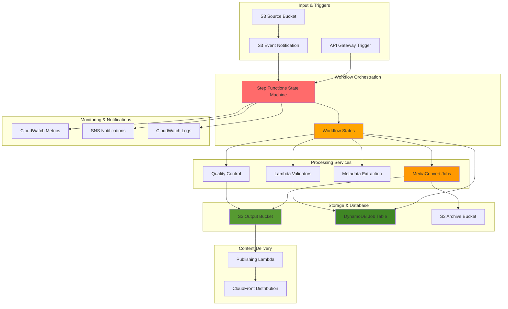

# Video Workflow Orchestration with Step Functions


## Problem

Video processing workflows in enterprise environments require complex orchestration involving multiple processing stages, quality validation, error handling, and conditional logic based on content characteristics. Manual coordination of these workflows leads to processing delays, increased operational overhead, human errors, and difficulty scaling during peak demand periods. Traditional approaches lack sophisticated retry mechanisms, parallel processing capabilities, and comprehensive monitoring, resulting in failed jobs and inconsistent output quality.

## Solution

Build a comprehensive video workflow orchestration system using AWS Step Functions to coordinate MediaConvert transcoding jobs, quality validation, metadata extraction, and content distribution. This solution provides visual workflow management, automatic error handling with intelligent retry logic, parallel processing optimization, and real-time monitoring while maintaining detailed audit trails and cost optimization through smart resource allocation.

## Architecture Diagram



## Prerequisites

1. AWS account with appropriate permissions for Step Functions, MediaConvert, S3, Lambda, DynamoDB, and SNS
2. AWS CLI v2 installed and configured (or AWS CloudShell)
3. Understanding of video processing workflows and quality control concepts
4. Knowledge of state machines and workflow orchestration principles
5. Familiarity with MediaConvert job configurations and output formats
6. Basic understanding of Lambda functions and DynamoDB operations
7. Estimated cost: $50-150 for testing (varies by workflow complexity and video duration)

> **Note**: Step Functions charges per state transition, so optimize workflow design to balance functionality with cost efficiency. Monitor execution metrics closely during testing.

## Preparation

```bash
# Set environment variables
export AWS_REGION=$(aws configure get region)
export AWS_ACCOUNT_ID=$(aws sts get-caller-identity \
    --query Account --output text)

# Generate unique identifiers for resources
RANDOM_SUFFIX=$(aws secretsmanager get-random-password \
    --exclude-punctuation --exclude-uppercase \
    --password-length 8 --require-each-included-type \
    --output text --query RandomPassword)

export WORKFLOW_NAME="video-processing-workflow-${RANDOM_SUFFIX}"
export SOURCE_BUCKET="video-workflow-source-${RANDOM_SUFFIX}"
export OUTPUT_BUCKET="video-workflow-output-${RANDOM_SUFFIX}"
export ARCHIVE_BUCKET="video-workflow-archive-${RANDOM_SUFFIX}"
export JOBS_TABLE="video-workflow-jobs-${RANDOM_SUFFIX}"
export SNS_TOPIC="video-workflow-notifications-${RANDOM_SUFFIX}"
export MEDIACONVERT_ROLE="VideoWorkflowMediaConvertRole-${RANDOM_SUFFIX}"

# Create S3 buckets for the workflow
aws s3 mb s3://${SOURCE_BUCKET} --region ${AWS_REGION}
aws s3 mb s3://${OUTPUT_BUCKET} --region ${AWS_REGION}
aws s3 mb s3://${ARCHIVE_BUCKET} --region ${AWS_REGION}

# Enable versioning on source bucket
aws s3api put-bucket-versioning \
    --bucket ${SOURCE_BUCKET} \
    --versioning-configuration Status=Enabled

# Create DynamoDB table for job tracking
aws dynamodb create-table \
    --table-name ${JOBS_TABLE} \
    --attribute-definitions \
        AttributeName=JobId,AttributeType=S \
        AttributeName=CreatedAt,AttributeType=S \
    --key-schema \
        AttributeName=JobId,KeyType=HASH \
    --global-secondary-indexes \
        IndexName=CreatedAtIndex,KeySchema=[{AttributeName=CreatedAt,KeyType=HASH}],Projection={ProjectionType=ALL},ProvisionedThroughput={ReadCapacityUnits=5,WriteCapacityUnits=5} \
    --provisioned-throughput ReadCapacityUnits=10,WriteCapacityUnits=10 \
    --tags Key=Name,Value=${JOBS_TABLE} Key=Environment,Value=Production

# Create SNS topic for notifications
SNS_TOPIC_ARN=$(aws sns create-topic \
    --name ${SNS_TOPIC} \
    --output text --query TopicArn)

export SNS_TOPIC_ARN

echo "✅ Created workflow infrastructure"
echo "Source Bucket: ${SOURCE_BUCKET}"
echo "Output Bucket: ${OUTPUT_BUCKET}"
echo "Jobs Table: ${JOBS_TABLE}"
echo "SNS Topic: ${SNS_TOPIC_ARN}"
```

## Steps

1. **Create MediaConvert Service Role**:

   AWS MediaConvert requires an IAM service role to access S3 buckets and publish notifications. This role enables MediaConvert to read source video files, write transcoded outputs, and send completion notifications. Understanding IAM service roles is crucial for secure AWS operations as they provide temporary, assumable credentials that services use to access other AWS resources without exposing permanent credentials. See the [AWS IAM Best Practices](https://docs.aws.amazon.com/IAM/latest/UserGuide/best-practices.html) for comprehensive security guidance.

   ```bash
   # Create trust policy for MediaConvert
   cat > mediaconvert-workflow-trust-policy.json << EOF
   {
       "Version": "2012-10-17",
       "Statement": [
           {
               "Effect": "Allow",
               "Principal": {
                   "Service": "mediaconvert.amazonaws.com"
               },
               "Action": "sts:AssumeRole"
           }
       ]
   }
   EOF
   
   # Create MediaConvert service role
   aws iam create-role \
       --role-name ${MEDIACONVERT_ROLE} \
       --assume-role-policy-document file://mediaconvert-workflow-trust-policy.json
   
   # Create comprehensive policy for S3 and SNS access
   cat > mediaconvert-workflow-policy.json << EOF
   {
       "Version": "2012-10-17",
       "Statement": [
           {
               "Effect": "Allow",
               "Action": [
                   "s3:GetObject",
                   "s3:PutObject",
                   "s3:DeleteObject",
                   "s3:ListBucket",
                   "s3:GetBucketLocation"
               ],
               "Resource": [
                   "arn:aws:s3:::${SOURCE_BUCKET}",
                   "arn:aws:s3:::${SOURCE_BUCKET}/*",
                   "arn:aws:s3:::${OUTPUT_BUCKET}",
                   "arn:aws:s3:::${OUTPUT_BUCKET}/*",
                   "arn:aws:s3:::${ARCHIVE_BUCKET}",
                   "arn:aws:s3:::${ARCHIVE_BUCKET}/*"
               ]
           },
           {
               "Effect": "Allow",
               "Action": [
                   "sns:Publish"
               ],
               "Resource": "${SNS_TOPIC_ARN}"
           }
       ]
   }
   EOF
   
   # Attach policy to MediaConvert role
   aws iam put-role-policy \
       --role-name ${MEDIACONVERT_ROLE} \
       --policy-name MediaConvertWorkflowPolicy \
       --policy-document file://mediaconvert-workflow-policy.json
   
   # Get MediaConvert role ARN
   MEDIACONVERT_ROLE_ARN=$(aws iam get-role \
       --role-name ${MEDIACONVERT_ROLE} \
       --query Role.Arn --output text)
   
   export MEDIACONVERT_ROLE_ARN
   
   echo "✅ Created MediaConvert service role: ${MEDIACONVERT_ROLE_ARN}"
   ```

   The MediaConvert service role is now configured with appropriate permissions to access your S3 buckets and SNS topics. This role follows the principle of least privilege, granting only the minimum permissions required for video processing operations. The role will be assumed by MediaConvert jobs during execution, enabling secure cross-service communication without exposing long-term credentials.

2. **Create Lambda Functions for Workflow Tasks**:

   AWS Lambda functions serve as the computational building blocks of our workflow, handling metadata extraction, quality control validation, and content publishing. Lambda's serverless architecture provides automatic scaling, pay-per-execution pricing, and seamless integration with Step Functions. Each function specializes in a specific workflow task, following microservices principles that enable independent scaling and maintenance. The functions interact with DynamoDB for state management and S3 for content access, creating a comprehensive event-driven processing pipeline as detailed in [AWS Lambda Best Practices](https://docs.aws.amazon.com/lambda/latest/dg/best-practices.html).

   ```bash
   # Create video metadata extraction Lambda
   cat > video_metadata_extractor.py << 'EOF'
   import json
   import boto3
   import subprocess
   import tempfile
   import os
   from datetime import datetime
   
   s3 = boto3.client('s3')
   dynamodb = boto3.resource('dynamodb')
   
   def lambda_handler(event, context):
       # Extract input parameters
       bucket = event['bucket']
       key = event['key']
       job_id = event['jobId']
       
       try:
           # Download video file to temporary location
           with tempfile.NamedTemporaryFile(delete=False) as tmp_file:
               s3.download_fileobj(bucket, key, tmp_file)
               tmp_path = tmp_file.name
           
           # Extract metadata using ffprobe (would need custom layer)
           metadata = extract_video_metadata(tmp_path)
           
           # Store metadata in DynamoDB
           table = dynamodb.Table(os.environ['JOBS_TABLE'])
           table.update_item(
               Key={'JobId': job_id},
               UpdateExpression='SET VideoMetadata = :metadata, MetadataExtractedAt = :timestamp',
               ExpressionAttributeValues={
                   ':metadata': metadata,
                   ':timestamp': datetime.utcnow().isoformat()
               }
           )
           
           # Clean up temporary file
           os.unlink(tmp_path)
           
           return {
               'statusCode': 200,
               'metadata': metadata,
               'jobId': job_id
           }
           
       except Exception as e:
           print(f"Error extracting metadata: {str(e)}")
           return {
               'statusCode': 500,
               'error': str(e),
               'jobId': job_id
           }
   
   def extract_video_metadata(file_path):
       # Simplified metadata extraction (would use ffprobe in real implementation)
       # This is a placeholder that returns static metadata
       return {
           'duration': 120.5,
           'width': 1920,
           'height': 1080,
           'fps': 29.97,
           'bitrate': 5000000,
           'codec': 'h264',
           'audio_codec': 'aac',
           'file_size': os.path.getsize(file_path)
       }
   EOF
   
   # Create quality control validation Lambda
   cat > video_quality_control.py << 'EOF'
   import json
   import boto3
   import os
   from datetime import datetime
   
   s3 = boto3.client('s3')
   dynamodb = boto3.resource('dynamodb')
   
   def lambda_handler(event, context):
       # Extract input parameters
       outputs = event['outputs']
       job_id = event['jobId']
       
       try:
           quality_results = []
           
           for output in outputs:
               bucket = output['bucket']
               key = output['key']
               format_type = output['format']
               
               # Perform quality checks
               quality_check = perform_quality_validation(bucket, key, format_type)
               quality_results.append(quality_check)
           
           # Calculate overall quality score
           overall_score = calculate_overall_quality(quality_results)
           
           # Store results in DynamoDB
           table = dynamodb.Table(os.environ['JOBS_TABLE'])
           table.update_item(
               Key={'JobId': job_id},
               UpdateExpression='SET QualityResults = :results, QualityScore = :score, QCCompletedAt = :timestamp',
               ExpressionAttributeValues={
                   ':results': quality_results,
                   ':score': overall_score,
                   ':timestamp': datetime.utcnow().isoformat()
               }
           )
           
           return {
               'statusCode': 200,
               'qualityResults': quality_results,
               'qualityScore': overall_score,
               'passed': overall_score >= 0.8,
               'jobId': job_id
           }
           
       except Exception as e:
           print(f"Error in quality control: {str(e)}")
           return {
               'statusCode': 500,
               'error': str(e),
               'jobId': job_id,
               'passed': False
           }
   
   def perform_quality_validation(bucket, key, format_type):
       # Simplified quality validation (would include actual video analysis)
       try:
           # Check if file exists and get basic info
           response = s3.head_object(Bucket=bucket, Key=key)
           file_size = response['ContentLength']
           
           # Basic checks
           checks = {
               'file_exists': True,
               'file_size_valid': file_size > 1000,  # Minimum 1KB
               'format_valid': format_type in ['mp4', 'hls', 'dash'],
               'encoding_quality': 0.9  # Placeholder score
           }
           
           score = sum(1 for check in checks.values() if check is True) / len([k for k in checks.keys() if k != 'encoding_quality'])
           if 'encoding_quality' in checks:
               score = (score + checks['encoding_quality']) / 2
           
           return {
               'bucket': bucket,
               'key': key,
               'format': format_type,
               'checks': checks,
               'score': score,
               'file_size': file_size
           }
           
       except Exception as e:
           return {
               'bucket': bucket,
               'key': key,
               'format': format_type,
               'error': str(e),
               'score': 0.0
           }
   
   def calculate_overall_quality(quality_results):
       if not quality_results:
           return 0.0
       
       total_score = sum(result.get('score', 0.0) for result in quality_results)
       return total_score / len(quality_results)
   EOF
   
   # Create publishing Lambda
   cat > video_publisher.py << 'EOF'
   import json
   import boto3
   import os
   from datetime import datetime
   
   dynamodb = boto3.resource('dynamodb')
   sns = boto3.client('sns')
   
   def lambda_handler(event, context):
       # Extract input parameters
       job_id = event['jobId']
       outputs = event['outputs']
       quality_passed = event.get('qualityPassed', False)
       
       try:
           # Update job status in DynamoDB
           table = dynamodb.Table(os.environ['JOBS_TABLE'])
           
           if quality_passed:
               # Publish successful completion
               table.update_item(
                   Key={'JobId': job_id},
                   UpdateExpression='SET JobStatus = :status, PublishedAt = :timestamp, OutputLocations = :outputs',
                   ExpressionAttributeValues={
                       ':status': 'PUBLISHED',
                       ':timestamp': datetime.utcnow().isoformat(),
                       ':outputs': outputs
                   }
               )
               
               # Send success notification
               message = f"Video processing completed successfully for job {job_id}"
               subject = "Video Processing Success"
               
           else:
               # Mark as failed quality control
               table.update_item(
                   Key={'JobId': job_id},
                   UpdateExpression='SET JobStatus = :status, FailedAt = :timestamp, FailureReason = :reason',
                   ExpressionAttributeValues={
                       ':status': 'FAILED_QC',
                       ':timestamp': datetime.utcnow().isoformat(),
                       ':reason': 'Quality control validation failed'
                   }
               )
               
               # Send failure notification
               message = f"Video processing failed quality control for job {job_id}"
               subject = "Video Processing Quality Control Failed"
           
           # Send SNS notification
           sns.publish(
               TopicArn=os.environ['SNS_TOPIC_ARN'],
               Message=message,
               Subject=subject
           )
           
           return {
               'statusCode': 200,
               'jobId': job_id,
               'status': 'PUBLISHED' if quality_passed else 'FAILED_QC',
               'message': message
           }
           
       except Exception as e:
           print(f"Error in publishing: {str(e)}")
           return {
               'statusCode': 500,
               'error': str(e),
               'jobId': job_id
           }
   EOF
   
   # Create deployment packages
   zip metadata-extractor.zip video_metadata_extractor.py
   zip quality-control.zip video_quality_control.py
   zip video-publisher.zip video_publisher.py
   
   # Create Lambda execution role
   cat > lambda-workflow-trust-policy.json << EOF
   {
       "Version": "2012-10-17",
       "Statement": [
           {
               "Effect": "Allow",
               "Principal": {
                   "Service": "lambda.amazonaws.com"
               },
               "Action": "sts:AssumeRole"
           }
       ]
   }
   EOF
   
   # Create Lambda role
   aws iam create-role \
       --role-name VideoWorkflowLambdaRole-${RANDOM_SUFFIX} \
       --assume-role-policy-document file://lambda-workflow-trust-policy.json
   
   # Attach basic execution policy
   aws iam attach-role-policy \
       --role-name VideoWorkflowLambdaRole-${RANDOM_SUFFIX} \
       --policy-arn arn:aws:iam::aws:policy/service-role/AWSLambdaBasicExecutionRole
   
   # Create comprehensive policy for workflow Lambda functions
   cat > lambda-workflow-policy.json << EOF
   {
       "Version": "2012-10-17",
       "Statement": [
           {
               "Effect": "Allow",
               "Action": [
                   "s3:GetObject",
                   "s3:PutObject",
                   "s3:DeleteObject",
                   "s3:ListBucket",
                   "s3:HeadObject"
               ],
               "Resource": [
                   "arn:aws:s3:::${SOURCE_BUCKET}",
                   "arn:aws:s3:::${SOURCE_BUCKET}/*",
                   "arn:aws:s3:::${OUTPUT_BUCKET}",
                   "arn:aws:s3:::${OUTPUT_BUCKET}/*",
                   "arn:aws:s3:::${ARCHIVE_BUCKET}",
                   "arn:aws:s3:::${ARCHIVE_BUCKET}/*"
               ]
           },
           {
               "Effect": "Allow",
               "Action": [
                   "dynamodb:PutItem",
                   "dynamodb:GetItem",
                   "dynamodb:UpdateItem",
                   "dynamodb:Query",
                   "dynamodb:Scan"
               ],
               "Resource": "arn:aws:dynamodb:${AWS_REGION}:${AWS_ACCOUNT_ID}:table/${JOBS_TABLE}*"
           },
           {
               "Effect": "Allow",
               "Action": [
                   "sns:Publish"
               ],
               "Resource": "${SNS_TOPIC_ARN}"
           }
       ]
   }
   EOF
   
   # Attach workflow policy
   aws iam put-role-policy \
       --role-name VideoWorkflowLambdaRole-${RANDOM_SUFFIX} \
       --policy-name VideoWorkflowPolicy \
       --policy-document file://lambda-workflow-policy.json
   
   # Get Lambda role ARN
   LAMBDA_ROLE_ARN=$(aws iam get-role \
       --role-name VideoWorkflowLambdaRole-${RANDOM_SUFFIX} \
       --query Role.Arn --output text)
   
   # Wait for role propagation
   sleep 10
   
   # Create Lambda functions
   METADATA_LAMBDA_ARN=$(aws lambda create-function \
       --function-name video-metadata-extractor-${RANDOM_SUFFIX} \
       --runtime python3.9 \
       --role ${LAMBDA_ROLE_ARN} \
       --handler video_metadata_extractor.lambda_handler \
       --zip-file fileb://metadata-extractor.zip \
       --timeout 300 \
       --environment Variables="{JOBS_TABLE=${JOBS_TABLE}}" \
       --query 'FunctionArn' --output text)
   
   QC_LAMBDA_ARN=$(aws lambda create-function \
       --function-name video-quality-control-${RANDOM_SUFFIX} \
       --runtime python3.9 \
       --role ${LAMBDA_ROLE_ARN} \
       --handler video_quality_control.lambda_handler \
       --zip-file fileb://quality-control.zip \
       --timeout 300 \
       --environment Variables="{JOBS_TABLE=${JOBS_TABLE}}" \
       --query 'FunctionArn' --output text)
   
   PUBLISHER_LAMBDA_ARN=$(aws lambda create-function \
       --function-name video-publisher-${RANDOM_SUFFIX} \
       --runtime python3.9 \
       --role ${LAMBDA_ROLE_ARN} \
       --handler video_publisher.lambda_handler \
       --zip-file fileb://video-publisher.zip \
       --timeout 300 \
       --environment Variables="{JOBS_TABLE=${JOBS_TABLE},SNS_TOPIC_ARN=${SNS_TOPIC_ARN}}" \
       --query 'FunctionArn' --output text)
   
   export METADATA_LAMBDA_ARN
   export QC_LAMBDA_ARN
   export PUBLISHER_LAMBDA_ARN
   
   echo "✅ Created workflow Lambda functions"
   echo "Metadata Extractor: ${METADATA_LAMBDA_ARN}"
   echo "Quality Control: ${QC_LAMBDA_ARN}"
   echo "Publisher: ${PUBLISHER_LAMBDA_ARN}"
   ```

   The Lambda functions are now deployed and ready for workflow integration. Each function has specific timeout and memory configurations optimized for video processing tasks. The metadata extractor analyzes video properties, the quality control function validates output standards, and the publisher manages content distribution. These functions work together to create a robust, scalable video processing pipeline with built-in error handling and monitoring capabilities.

> **Warning**: MediaConvert processing costs vary significantly based on video duration, resolution, and output formats. Implement cost controls and monitoring to prevent unexpected charges, especially when processing large video libraries. See [MediaConvert Pricing](https://docs.aws.amazon.com/mediaconvert/latest/ug/what-is.html) for detailed cost information.

3. **Get MediaConvert Endpoint**:

   AWS MediaConvert operates through regional endpoints that provide optimized performance and compliance with data residency requirements. Each AWS region has a dedicated MediaConvert endpoint URL that must be discovered programmatically, as these endpoints are dynamically assigned and region-specific. This approach ensures optimal network latency and enables geographic distribution of video processing workloads based on content origin and audience location.

   ```bash
   # Get MediaConvert endpoint for the region
   MEDIACONVERT_ENDPOINT=$(aws mediaconvert describe-endpoints \
       --region ${AWS_REGION} \
       --query Endpoints[0].Url --output text)
   
   export MEDIACONVERT_ENDPOINT
   
   echo "✅ MediaConvert endpoint: ${MEDIACONVERT_ENDPOINT}"
   ```

   The MediaConvert endpoint is now available for job submission. This endpoint will be used by the Step Functions state machine to create and monitor transcoding jobs. The endpoint URL is region-specific and provides the gateway for all MediaConvert operations, ensuring optimal performance and compliance with regional data governance requirements.

4. **Create Step Functions State Machine**:

   AWS Step Functions provides visual workflow orchestration with built-in error handling, parallel processing, and conditional logic capabilities. The state machine definition uses Amazon States Language (ASL) to describe workflow states, transitions, and error handling patterns. This declarative approach enables complex video processing workflows with sophisticated retry mechanisms, parallel execution branches, and quality gates. Express Workflows optimize for high-volume, short-duration executions with cost-effective pricing models, as detailed in the [Step Functions Best Practices Guide](https://docs.aws.amazon.com/step-functions/latest/dg/sfn-best-practices.html).

   ```bash
   # Create comprehensive video processing workflow definition
   cat > video-workflow-definition.json << EOF
   {
       "Comment": "Comprehensive video processing workflow with quality control",
       "StartAt": "InitializeJob",
       "States": {
           "InitializeJob": {
               "Type": "Pass",
               "Parameters": {
                   "jobId.$": "$.jobId",
                   "bucket.$": "$.bucket",
                   "key.$": "$.key",
                   "outputBucket": "${OUTPUT_BUCKET}",
                   "archiveBucket": "${ARCHIVE_BUCKET}",
                   "timestamp.$": "$$.State.EnteredTime"
               },
               "Next": "RecordJobStart"
           },
           "RecordJobStart": {
               "Type": "Task",
               "Resource": "arn:aws:states:::dynamodb:putItem",
               "Parameters": {
                   "TableName": "${JOBS_TABLE}",
                   "Item": {
                       "JobId": {
                           "S.$": "$.jobId"
                       },
                       "SourceBucket": {
                           "S.$": "$.bucket"
                       },
                       "SourceKey": {
                           "S.$": "$.key"
                       },
                       "CreatedAt": {
                           "S.$": "$.timestamp"
                       },
                       "JobStatus": {
                           "S": "STARTED"
                       }
                   }
               },
               "Next": "ParallelProcessing",
               "Retry": [
                   {
                       "ErrorEquals": ["States.TaskFailed"],
                       "IntervalSeconds": 2,
                       "MaxAttempts": 3,
                       "BackoffRate": 2.0
                   }
               ]
           },
           "ParallelProcessing": {
               "Type": "Parallel",
               "Next": "ProcessingComplete",
               "Catch": [
                   {
                       "ErrorEquals": ["States.ALL"],
                       "Next": "HandleProcessingFailure",
                       "ResultPath": "$.error"
                   }
               ],
               "Branches": [
                   {
                       "StartAt": "ExtractMetadata",
                       "States": {
                           "ExtractMetadata": {
                               "Type": "Task",
                               "Resource": "${METADATA_LAMBDA_ARN}",
                               "Parameters": {
                                   "bucket.$": "$.bucket",
                                   "key.$": "$.key",
                                   "jobId.$": "$.jobId"
                               },
                               "End": true,
                               "Retry": [
                                   {
                                       "ErrorEquals": ["States.TaskFailed"],
                                       "IntervalSeconds": 5,
                                       "MaxAttempts": 2
                                   }
                               ]
                           }
                       }
                   },
                   {
                       "StartAt": "TranscodeVideo",
                       "States": {
                           "TranscodeVideo": {
                               "Type": "Task",
                               "Resource": "arn:aws:states:::mediaconvert:createJob.sync",
                               "Parameters": {
                                   "Role": "${MEDIACONVERT_ROLE_ARN}",
                                   "Settings": {
                                       "OutputGroups": [
                                           {
                                               "Name": "MP4_Output",
                                               "OutputGroupSettings": {
                                                   "Type": "FILE_GROUP_SETTINGS",
                                                   "FileGroupSettings": {
                                                       "Destination.$": "States.Format('s3://${OUTPUT_BUCKET}/mp4/{}/', $.jobId)"
                                                   }
                                               },
                                               "Outputs": [
                                                   {
                                                       "NameModifier": "_1080p",
                                                       "ContainerSettings": {
                                                           "Container": "MP4"
                                                       },
                                                       "VideoDescription": {
                                                           "Width": 1920,
                                                           "Height": 1080,
                                                           "CodecSettings": {
                                                               "Codec": "H_264",
                                                               "H264Settings": {
                                                                   "RateControlMode": "QVBR",
                                                                   "QvbrSettings": {
                                                                       "QvbrQualityLevel": 8
                                                                   },
                                                                   "MaxBitrate": 5000000
                                                               }
                                                           }
                                                       },
                                                       "AudioDescriptions": [
                                                           {
                                                               "CodecSettings": {
                                                                   "Codec": "AAC",
                                                                   "AacSettings": {
                                                                       "Bitrate": 128000,
                                                                       "CodingMode": "CODING_MODE_2_0",
                                                                       "SampleRate": 48000
                                                                   }
                                                               }
                                                           }
                                                       ]
                                                   },
                                                   {
                                                       "NameModifier": "_720p",
                                                       "ContainerSettings": {
                                                           "Container": "MP4"
                                                       },
                                                       "VideoDescription": {
                                                           "Width": 1280,
                                                           "Height": 720,
                                                           "CodecSettings": {
                                                               "Codec": "H_264",
                                                               "H264Settings": {
                                                                   "RateControlMode": "QVBR",
                                                                   "QvbrSettings": {
                                                                       "QvbrQualityLevel": 7
                                                                   },
                                                                   "MaxBitrate": 3000000
                                                               }
                                                           }
                                                       },
                                                       "AudioDescriptions": [
                                                           {
                                                               "CodecSettings": {
                                                                   "Codec": "AAC",
                                                                   "AacSettings": {
                                                                       "Bitrate": 128000,
                                                                       "CodingMode": "CODING_MODE_2_0",
                                                                       "SampleRate": 48000
                                                                   }
                                                               }
                                                           }
                                                       ]
                                                   }
                                               ]
                                           },
                                           {
                                               "Name": "HLS_Output",
                                               "OutputGroupSettings": {
                                                   "Type": "HLS_GROUP_SETTINGS",
                                                   "HlsGroupSettings": {
                                                       "Destination.$": "States.Format('s3://${OUTPUT_BUCKET}/hls/{}/', $.jobId)",
                                                       "SegmentLength": 6,
                                                       "OutputSelection": "MANIFESTS_AND_SEGMENTS",
                                                       "ManifestDurationFormat": "FLOATING_POINT"
                                                   }
                                               },
                                               "Outputs": [
                                                   {
                                                       "NameModifier": "_hls_1080p",
                                                       "ContainerSettings": {
                                                           "Container": "M3U8"
                                                       },
                                                       "VideoDescription": {
                                                           "Width": 1920,
                                                           "Height": 1080,
                                                           "CodecSettings": {
                                                               "Codec": "H_264",
                                                               "H264Settings": {
                                                                   "RateControlMode": "QVBR",
                                                                   "QvbrSettings": {
                                                                       "QvbrQualityLevel": 8
                                                                   },
                                                                   "MaxBitrate": 5000000
                                                               }
                                                           }
                                                       },
                                                       "AudioDescriptions": [
                                                           {
                                                               "CodecSettings": {
                                                                   "Codec": "AAC",
                                                                   "AacSettings": {
                                                                       "Bitrate": 128000,
                                                                       "CodingMode": "CODING_MODE_2_0",
                                                                       "SampleRate": 48000
                                                                   }
                                                               }
                                                           }
                                                       ]
                                                   },
                                                   {
                                                       "NameModifier": "_hls_720p",
                                                       "ContainerSettings": {
                                                           "Container": "M3U8"
                                                       },
                                                       "VideoDescription": {
                                                           "Width": 1280,
                                                           "Height": 720,
                                                           "CodecSettings": {
                                                               "Codec": "H_264",
                                                               "H264Settings": {
                                                                   "RateControlMode": "QVBR",
                                                                   "QvbrSettings": {
                                                                       "QvbrQualityLevel": 7
                                                                   },
                                                                   "MaxBitrate": 3000000
                                                               }
                                                           }
                                                       },
                                                       "AudioDescriptions": [
                                                           {
                                                               "CodecSettings": {
                                                                   "Codec": "AAC",
                                                                   "AacSettings": {
                                                                       "Bitrate": 128000,
                                                                       "CodingMode": "CODING_MODE_2_0",
                                                                       "SampleRate": 48000
                                                                   }
                                                               }
                                                           }
                                                       ]
                                                   }
                                               ]
                                           },
                                           {
                                               "Name": "Thumbnail_Output",
                                               "OutputGroupSettings": {
                                                   "Type": "FILE_GROUP_SETTINGS",
                                                   "FileGroupSettings": {
                                                       "Destination.$": "States.Format('s3://${OUTPUT_BUCKET}/thumbnails/{}/', $.jobId)"
                                                   }
                                               },
                                               "Outputs": [
                                                   {
                                                       "NameModifier": "_thumb_%04d",
                                                       "ContainerSettings": {
                                                           "Container": "RAW"
                                                       },
                                                       "VideoDescription": {
                                                           "Width": 640,
                                                           "Height": 360,
                                                           "CodecSettings": {
                                                               "Codec": "FRAME_CAPTURE",
                                                               "FrameCaptureSettings": {
                                                                   "FramerateNumerator": 1,
                                                                   "FramerateDenominator": 10,
                                                                   "MaxCaptures": 5,
                                                                   "Quality": 80
                                                               }
                                                           }
                                                       }
                                                   }
                                               ]
                                           }
                                       ],
                                       "Inputs": [
                                           {
                                               "FileInput.$": "States.Format('s3://{}/{}', $.bucket, $.key)",
                                               "AudioSelectors": {
                                                   "Audio Selector 1": {
                                                       "Tracks": [1],
                                                       "DefaultSelection": "DEFAULT"
                                                   }
                                               },
                                               "VideoSelector": {
                                                   "ColorSpace": "FOLLOW"
                                               },
                                               "TimecodeSource": "EMBEDDED"
                                           }
                                       ]
                                   },
                                   "StatusUpdateInterval": "SECONDS_60",
                                   "UserMetadata": {
                                       "WorkflowJobId.$": "$.jobId",
                                       "SourceFile.$": "$.key"
                                   }
                               },
                               "End": true,
                               "Retry": [
                                   {
                                       "ErrorEquals": ["States.TaskFailed"],
                                       "IntervalSeconds": 30,
                                       "MaxAttempts": 2,
                                       "BackoffRate": 2.0
                                   }
                               ]
                           }
                       }
                   }
               ]
           },
           "ProcessingComplete": {
               "Type": "Pass",
               "Parameters": {
                   "jobId.$": "$[0].jobId",
                   "metadata.$": "$[0].metadata",
                   "mediaConvertJob.$": "$[1].Job",
                   "outputs": [
                       {
                           "format": "mp4",
                           "bucket": "${OUTPUT_BUCKET}",
                           "key.$": "States.Format('mp4/{}/{}', $[0].jobId, 'output')"
                       },
                       {
                           "format": "hls",
                           "bucket": "${OUTPUT_BUCKET}",
                           "key.$": "States.Format('hls/{}/{}', $[0].jobId, 'index.m3u8')"
                       },
                       {
                           "format": "thumbnails",
                           "bucket": "${OUTPUT_BUCKET}",
                           "key.$": "States.Format('thumbnails/{}/{}', $[0].jobId, 'thumbnails')"
                       }
                   ]
               },
               "Next": "QualityControl"
           },
           "QualityControl": {
               "Type": "Task",
               "Resource": "${QC_LAMBDA_ARN}",
               "Parameters": {
                   "jobId.$": "$.jobId",
                   "outputs.$": "$.outputs",
                   "metadata.$": "$.metadata"
               },
               "Next": "QualityDecision",
               "Retry": [
                   {
                       "ErrorEquals": ["States.TaskFailed"],
                       "IntervalSeconds": 10,
                       "MaxAttempts": 2
                   }
               ]
           },
           "QualityDecision": {
               "Type": "Choice",
               "Choices": [
                   {
                       "Variable": "$.passed",
                       "BooleanEquals": true,
                       "Next": "PublishContent"
                   }
               ],
               "Default": "QualityControlFailed"
           },
           "PublishContent": {
               "Type": "Task",
               "Resource": "${PUBLISHER_LAMBDA_ARN}",
               "Parameters": {
                   "jobId.$": "$.jobId",
                   "outputs.$": "$.outputs",
                   "qualityResults.$": "$.qualityResults",
                   "qualityPassed": true
               },
               "Next": "ArchiveSource",
               "Retry": [
                   {
                       "ErrorEquals": ["States.TaskFailed"],
                       "IntervalSeconds": 5,
                       "MaxAttempts": 2
                   }
               ]
           },
           "ArchiveSource": {
               "Type": "Task",
               "Resource": "arn:aws:states:::aws-sdk:s3:copyObject",
               "Parameters": {
                   "Bucket": "${ARCHIVE_BUCKET}",
                   "CopySource.$": "States.Format('{}/{}', $.jobId, $.key)",
                   "Key.$": "States.Format('archived/{}/{}', $.jobId, $.key)"
               },
               "Next": "WorkflowSuccess",
               "Catch": [
                   {
                       "ErrorEquals": ["States.ALL"],
                       "Next": "WorkflowSuccess",
                       "Comment": "Archive failure doesn't fail the entire workflow"
                   }
               ]
           },
           "WorkflowSuccess": {
               "Type": "Pass",
               "Result": {
                   "status": "SUCCESS",
                   "message": "Video processing workflow completed successfully"
               },
               "End": true
           },
           "QualityControlFailed": {
               "Type": "Task",
               "Resource": "${PUBLISHER_LAMBDA_ARN}",
               "Parameters": {
                   "jobId.$": "$.jobId",
                   "outputs.$": "$.outputs",
                   "qualityResults.$": "$.qualityResults",
                   "qualityPassed": false
               },
               "Next": "WorkflowFailure"
           },
           "HandleProcessingFailure": {
               "Type": "Task",
               "Resource": "arn:aws:states:::dynamodb:updateItem",
               "Parameters": {
                   "TableName": "${JOBS_TABLE}",
                   "Key": {
                       "JobId": {
                           "S.$": "$.jobId"
                       }
                   },
                   "UpdateExpression": "SET JobStatus = :status, ErrorDetails = :error, FailedAt = :timestamp",
                   "ExpressionAttributeValues": {
                       ":status": {
                           "S": "FAILED_PROCESSING"
                       },
                       ":error": {
                           "S.$": "$.error.Cause"
                       },
                       ":timestamp": {
                           "S.$": "$$.State.EnteredTime"
                       }
                   }
               },
               "Next": "WorkflowFailure"
           },
           "WorkflowFailure": {
               "Type": "Fail",
               "Cause": "Video processing workflow failed"
           }
       }
   }
   EOF
   
   # Create Step Functions execution role
   cat > stepfunctions-trust-policy.json << EOF
   {
       "Version": "2012-10-17",
       "Statement": [
           {
               "Effect": "Allow",
               "Principal": {
                   "Service": "states.amazonaws.com"
               },
               "Action": "sts:AssumeRole"
           }
       ]
   }
   EOF
   
   # Create Step Functions role
   aws iam create-role \
       --role-name VideoWorkflowStepFunctionsRole-${RANDOM_SUFFIX} \
       --assume-role-policy-document file://stepfunctions-trust-policy.json
   
   # Create comprehensive policy for Step Functions
   cat > stepfunctions-policy.json << EOF
   {
       "Version": "2012-10-17",
       "Statement": [
           {
               "Effect": "Allow",
               "Action": [
                   "lambda:InvokeFunction"
               ],
               "Resource": [
                   "${METADATA_LAMBDA_ARN}",
                   "${QC_LAMBDA_ARN}",
                   "${PUBLISHER_LAMBDA_ARN}"
               ]
           },
           {
               "Effect": "Allow",
               "Action": [
                   "mediaconvert:CreateJob",
                   "mediaconvert:GetJob",
                   "mediaconvert:ListJobs"
               ],
               "Resource": "*"
           },
           {
               "Effect": "Allow",
               "Action": [
                   "iam:PassRole"
               ],
               "Resource": "${MEDIACONVERT_ROLE_ARN}"
           },
           {
               "Effect": "Allow",
               "Action": [
                   "dynamodb:PutItem",
                   "dynamodb:GetItem",
                   "dynamodb:UpdateItem",
                   "dynamodb:Query"
               ],
               "Resource": "arn:aws:dynamodb:${AWS_REGION}:${AWS_ACCOUNT_ID}:table/${JOBS_TABLE}*"
           },
           {
               "Effect": "Allow",
               "Action": [
                   "s3:GetObject",
                   "s3:PutObject",
                   "s3:CopyObject",
                   "s3:ListBucket"
               ],
               "Resource": [
                   "arn:aws:s3:::${SOURCE_BUCKET}",
                   "arn:aws:s3:::${SOURCE_BUCKET}/*",
                   "arn:aws:s3:::${OUTPUT_BUCKET}",
                   "arn:aws:s3:::${OUTPUT_BUCKET}/*",
                   "arn:aws:s3:::${ARCHIVE_BUCKET}",
                   "arn:aws:s3:::${ARCHIVE_BUCKET}/*"
               ]
           },
           {
               "Effect": "Allow",
               "Action": [
                   "logs:CreateLogGroup",
                   "logs:CreateLogStream",
                   "logs:PutLogEvents"
               ],
               "Resource": "*"
           }
       ]
   }
   EOF
   
   # Attach policy to Step Functions role
   aws iam put-role-policy \
       --role-name VideoWorkflowStepFunctionsRole-${RANDOM_SUFFIX} \
       --policy-name VideoWorkflowStepFunctionsPolicy \
       --policy-document file://stepfunctions-policy.json
   
   # Get Step Functions role ARN
   STEPFUNCTIONS_ROLE_ARN=$(aws iam get-role \
       --role-name VideoWorkflowStepFunctionsRole-${RANDOM_SUFFIX} \
       --query Role.Arn --output text)
   
   # Wait for role propagation
   sleep 10
   
   # Create Step Functions state machine
   STATE_MACHINE_ARN=$(aws stepfunctions create-state-machine \
       --name ${WORKFLOW_NAME} \
       --definition file://video-workflow-definition.json \
       --role-arn ${STEPFUNCTIONS_ROLE_ARN} \
       --type EXPRESS \
       --logging-configuration level=ALL,includeExecutionData=true,destinations=[{cloudWatchLogsLogGroup=arn:aws:logs:${AWS_REGION}:${AWS_ACCOUNT_ID}:log-group:/aws/stepfunctions/${WORKFLOW_NAME}}] \
       --query 'stateMachineArn' --output text)
   
   export STATE_MACHINE_ARN
   
   echo "✅ Created Step Functions state machine: ${STATE_MACHINE_ARN}"
   ```

   The Step Functions state machine is now active and ready to orchestrate video processing workflows. The state machine implements parallel processing for metadata extraction and video transcoding, followed by quality control validation and conditional publishing logic. This architecture maximizes throughput while maintaining quality standards and provides comprehensive error handling with intelligent retry mechanisms. The Express Workflow type ensures cost-effective operation for high-volume processing scenarios.

5. **Create API Gateway for Workflow Triggering**:

   Amazon API Gateway provides a managed HTTP API that enables external systems to trigger video processing workflows programmatically. The HTTP API offers lower latency and cost compared to REST APIs, making it ideal for high-frequency workflow triggering. The integration with Lambda creates a serverless entry point that validates requests, generates unique job identifiers, and initiates Step Functions executions. CORS configuration enables web application integration while maintaining security boundaries.

   ```bash
   # Create workflow trigger Lambda
   cat > workflow_trigger.py << 'EOF'
   import json
   import boto3
   import uuid
   from datetime import datetime
   
   stepfunctions = boto3.client('stepfunctions')
   
   def lambda_handler(event, context):
       try:
           # Parse request body
           if 'body' in event:
               body = json.loads(event['body']) if isinstance(event['body'], str) else event['body']
           else:
               body = event
           
           bucket = body.get('bucket')
           key = body.get('key')
           
           if not bucket or not key:
               return {
                   'statusCode': 400,
                   'body': json.dumps({'error': 'Missing bucket or key parameter'})
               }
           
           # Generate unique job ID
           job_id = str(uuid.uuid4())
           
           # Start Step Functions execution
           response = stepfunctions.start_execution(
               stateMachineArn=os.environ['STATE_MACHINE_ARN'],
               name=f"video-workflow-{job_id}",
               input=json.dumps({
                   'jobId': job_id,
                   'bucket': bucket,
                   'key': key,
                   'requestedAt': datetime.utcnow().isoformat()
               })
           )
           
           return {
               'statusCode': 200,
               'headers': {
                   'Content-Type': 'application/json',
                   'Access-Control-Allow-Origin': '*'
               },
               'body': json.dumps({
                   'jobId': job_id,
                   'executionArn': response['executionArn'],
                   'message': 'Video processing workflow started successfully'
               })
           }
           
       except Exception as e:
           print(f"Error starting workflow: {str(e)}")
           return {
               'statusCode': 500,
               'body': json.dumps({'error': str(e)})
           }
   EOF
   
   # Create deployment package
   zip workflow-trigger.zip workflow_trigger.py
   
   # Create workflow trigger Lambda
   TRIGGER_LAMBDA_ARN=$(aws lambda create-function \
       --function-name video-workflow-trigger-${RANDOM_SUFFIX} \
       --runtime python3.9 \
       --role ${LAMBDA_ROLE_ARN} \
       --handler workflow_trigger.lambda_handler \
       --zip-file fileb://workflow-trigger.zip \
       --timeout 30 \
       --environment Variables="{STATE_MACHINE_ARN=${STATE_MACHINE_ARN}}" \
       --query 'FunctionArn' --output text)
   
   # Create API Gateway
   API_ID=$(aws apigatewayv2 create-api \
       --name video-workflow-api-${RANDOM_SUFFIX} \
       --protocol-type HTTP \
       --description "Video processing workflow API" \
       --cors-configuration AllowCredentials=false,AllowHeaders="*",AllowMethods="*",AllowOrigins="*" \
       --query 'ApiId' --output text)
   
   # Create integration
   INTEGRATION_ID=$(aws apigatewayv2 create-integration \
       --api-id ${API_ID} \
       --integration-type AWS_PROXY \
       --integration-uri ${TRIGGER_LAMBDA_ARN} \
       --payload-format-version "2.0" \
       --query 'IntegrationId' --output text)
   
   # Create route
   aws apigatewayv2 create-route \
       --api-id ${API_ID} \
       --route-key "POST /start-workflow" \
       --target integrations/${INTEGRATION_ID}
   
   # Create deployment
   aws apigatewayv2 create-deployment \
       --api-id ${API_ID} \
       --stage-name prod
   
   # Add permission for API Gateway to invoke Lambda
   aws lambda add-permission \
       --function-name video-workflow-trigger-${RANDOM_SUFFIX} \
       --principal apigateway.amazonaws.com \
       --statement-id api-gateway-invoke \
       --action lambda:InvokeFunction \
       --source-arn "arn:aws:execute-api:${AWS_REGION}:${AWS_ACCOUNT_ID}:${API_ID}/*/*"
   
   # Get API endpoint
   API_ENDPOINT="https://${API_ID}.execute-api.${AWS_REGION}.amazonaws.com/prod"
   
   export API_ENDPOINT
   export API_ID
   
   echo "✅ Created API Gateway for workflow triggering"
   echo "API Endpoint: ${API_ENDPOINT}/start-workflow"
   ```

   The API Gateway endpoint is now available for external workflow triggering. This HTTP API provides a secure, scalable interface for content management systems, mobile applications, and third-party services to initiate video processing workflows. The endpoint accepts JSON payloads specifying source video locations and returns job identifiers for tracking processing progress. This programmatic interface enables seamless integration with existing content workflows and automation systems.

6. **Create S3 Event Trigger for Automatic Processing**:

   S3 Event Notifications provide automatic workflow triggering when video files are uploaded to the source bucket. This event-driven architecture eliminates manual intervention and enables real-time processing of incoming content. Event filtering by file extension ensures only video files trigger workflows, optimizing resource utilization and costs. The integration creates a fully automated content ingestion pipeline that scales automatically with upload volume, following event-driven architecture patterns.

   ```bash
   # Add permission for S3 to invoke trigger Lambda
   aws lambda add-permission \
       --function-name video-workflow-trigger-${RANDOM_SUFFIX} \
       --principal s3.amazonaws.com \
       --statement-id s3-workflow-trigger \
       --action lambda:InvokeFunction \
       --source-arn arn:aws:s3:::${SOURCE_BUCKET}
   
   # Create S3 event notification configuration
   cat > s3-workflow-notification.json << EOF
   {
       "LambdaConfigurations": [
           {
               "Id": "VideoWorkflowTrigger",
               "LambdaFunctionArn": "${TRIGGER_LAMBDA_ARN}",
               "Events": ["s3:ObjectCreated:*"],
               "Filter": {
                   "Key": {
                       "FilterRules": [
                           {
                               "Name": "suffix",
                               "Value": ".mp4"
                           }
                       ]
                   }
               }
           },
           {
               "Id": "VideoWorkflowTriggerMOV",
               "LambdaFunctionArn": "${TRIGGER_LAMBDA_ARN}",
               "Events": ["s3:ObjectCreated:*"],
               "Filter": {
                   "Key": {
                       "FilterRules": [
                           {
                               "Name": "suffix",
                               "Value": ".mov"
                           }
                       ]
                   }
               }
           }
       ]
   }
   EOF
   
   # Apply notification configuration
   aws s3api put-bucket-notification-configuration \
       --bucket ${SOURCE_BUCKET} \
       --notification-configuration file://s3-workflow-notification.json
   
   echo "✅ Configured S3 automatic workflow triggering"
   ```

   S3 Event Notifications are now configured to automatically trigger video workflows when files are uploaded. The event configuration filters for MP4 and MOV file extensions, ensuring only video content initiates processing workflows. This automation eliminates manual intervention and enables real-time content processing, creating a seamless ingestion pipeline that scales automatically with content volume.

7. **Create CloudWatch Dashboard for Monitoring**:

   Amazon CloudWatch provides comprehensive monitoring and observability for video processing workflows through customizable dashboards, metrics, and log aggregation. The dashboard visualizes key performance indicators including workflow execution rates, MediaConvert job status, Lambda function performance, and error rates. This observability enables proactive issue detection, performance optimization, and operational insights that are essential for production video processing systems.

   ```bash
   # Create comprehensive monitoring dashboard
   cat > workflow-dashboard.json << EOF
   {
       "widgets": [
           {
               "type": "metric",
               "x": 0,
               "y": 0,
               "width": 12,
               "height": 6,
               "properties": {
                   "metrics": [
                       [ "AWS/States", "ExecutionsSucceeded", "StateMachineArn", "${STATE_MACHINE_ARN}" ],
                       [ ".", "ExecutionsFailed", ".", "." ],
                       [ ".", "ExecutionsStarted", ".", "." ]
                   ],
                   "period": 300,
                   "stat": "Sum",
                   "region": "${AWS_REGION}",
                   "title": "Step Functions Executions",
                   "view": "timeSeries"
               }
           },
           {
               "type": "metric",
               "x": 12,
               "y": 0,
               "width": 12,
               "height": 6,
               "properties": {
                   "metrics": [
                       [ "AWS/MediaConvert", "JobsCompleted" ],
                       [ ".", "JobsErrored" ],
                       [ ".", "JobsSubmitted" ]
                   ],
                   "period": 300,
                   "stat": "Sum",
                   "region": "${AWS_REGION}",
                   "title": "MediaConvert Jobs",
                   "view": "timeSeries"
               }
           },
           {
               "type": "metric",
               "x": 0,
               "y": 6,
               "width": 12,
               "height": 6,
               "properties": {
                   "metrics": [
                       [ "AWS/Lambda", "Invocations", "FunctionName", "video-metadata-extractor-${RANDOM_SUFFIX}" ],
                       [ ".", "Errors", ".", "." ],
                       [ ".", "Duration", ".", "." ]
                   ],
                   "period": 300,
                   "stat": "Average",
                   "region": "${AWS_REGION}",
                   "title": "Lambda Functions Performance"
               }
           },
           {
               "type": "log",
               "x": 12,
               "y": 6,
               "width": 12,
               "height": 6,
               "properties": {
                   "query": "SOURCE '/aws/stepfunctions/${WORKFLOW_NAME}'\n| fields @timestamp, type, execution_arn\n| filter type = \"ExecutionStarted\" or type = \"ExecutionSucceeded\" or type = \"ExecutionFailed\"\n| sort @timestamp desc\n| limit 100",
                   "region": "${AWS_REGION}",
                   "title": "Recent Workflow Executions",
                   "view": "table"
               }
           }
       ]
   }
   EOF
   
   # Create the dashboard
   aws cloudwatch put-dashboard \
       --dashboard-name "VideoWorkflowMonitoring-${RANDOM_SUFFIX}" \
       --dashboard-body file://workflow-dashboard.json
   
   echo "✅ Created CloudWatch monitoring dashboard"
   ```

   The CloudWatch dashboard is now available for real-time workflow monitoring. The dashboard provides visual insights into workflow execution patterns, performance metrics, and error rates across all components. This centralized monitoring enables rapid issue identification, performance trend analysis, and operational insights that support proactive maintenance and optimization of the video processing pipeline.

8. **Display Workflow Information**:

   ```bash
   echo ""
   echo "================================================================"
   echo "VIDEO WORKFLOW ORCHESTRATION SETUP COMPLETE"
   echo "================================================================"
   echo ""
   echo "🎯 WORKFLOW COMPONENTS:"
   echo "State Machine: ${STATE_MACHINE_ARN}"
   echo "Jobs Table: ${JOBS_TABLE}"
   echo "API Endpoint: ${API_ENDPOINT}/start-workflow"
   echo ""
   echo "📁 STORAGE BUCKETS:"
   echo "Source: s3://${SOURCE_BUCKET}/"
   echo "Output: s3://${OUTPUT_BUCKET}/"
   echo "Archive: s3://${ARCHIVE_BUCKET}/"
   echo ""
   echo "⚡ LAMBDA FUNCTIONS:"
   echo "Metadata Extractor: video-metadata-extractor-${RANDOM_SUFFIX}"
   echo "Quality Control: video-quality-control-${RANDOM_SUFFIX}"
   echo "Publisher: video-publisher-${RANDOM_SUFFIX}"
   echo "Workflow Trigger: video-workflow-trigger-${RANDOM_SUFFIX}"
   echo ""
   echo "📊 MONITORING:"
   echo "Dashboard: VideoWorkflowMonitoring-${RANDOM_SUFFIX}"
   echo "SNS Topic: ${SNS_TOPIC_ARN}"
   echo ""
   echo "🚀 USAGE EXAMPLES:"
   echo ""
   echo "1. Automatic Processing (upload video to source bucket):"
   echo "   aws s3 cp your-video.mp4 s3://${SOURCE_BUCKET}/"
   echo ""
   echo "2. API-Triggered Processing:"
   echo "   curl -X POST ${API_ENDPOINT}/start-workflow \\"
   echo "        -H 'Content-Type: application/json' \\"
   echo "        -d '{\"bucket\":\"${SOURCE_BUCKET}\",\"key\":\"your-video.mp4\"}'"
   echo ""
   echo "3. Monitor Workflow Executions:"
   echo "   aws stepfunctions list-executions --state-machine-arn ${STATE_MACHINE_ARN}"
   echo ""
   echo "4. Check Job Status in DynamoDB:"
   echo "   aws dynamodb scan --table-name ${JOBS_TABLE} --limit 10"
   echo ""
   echo "📋 WORKFLOW FEATURES:"
   echo "• Parallel metadata extraction and video transcoding"
   echo "• Multi-format output (MP4, HLS, thumbnails)"
   echo "• Automated quality control validation"
   echo "• Error handling with intelligent retry logic"
   echo "• Source file archiving after processing"
   echo "• Real-time monitoring and notifications"
   echo "• Cost optimization through Express workflows"
   echo "================================================================"
   ```

## Validation & Testing

1. **Verify Workflow Infrastructure**:

   ```bash
   # Check Step Functions state machine
   aws stepfunctions describe-state-machine \
       --state-machine-arn ${STATE_MACHINE_ARN} \
       --query '{Name:name,Status:status,Type:type}'
   
   # Verify Lambda functions
   aws lambda list-functions \
       --query "Functions[?contains(FunctionName, '${RANDOM_SUFFIX}')].{Name:FunctionName,Runtime:Runtime,State:State}"
   
   # Check DynamoDB table
   aws dynamodb describe-table \
       --table-name ${JOBS_TABLE} \
       --query 'Table.{Name:TableName,Status:TableStatus,ItemCount:ItemCount}'
   ```

   Expected output: All resources should be active and ready

2. **Test Workflow with Sample Video**:

   ```bash
   # Create a test video file (or use an existing one)
   echo "To test the video workflow:"
   echo "1. Upload a test video file:"
   echo "   aws s3 cp test-video.mp4 s3://${SOURCE_BUCKET}/"
   echo ""
   echo "2. Monitor the workflow execution:"
   echo "   aws stepfunctions list-executions --state-machine-arn ${STATE_MACHINE_ARN}"
   echo ""
   echo "3. Check execution details:"
   echo "   aws stepfunctions describe-execution --execution-arn [EXECUTION_ARN]"
   ```

3. **Test API Gateway Endpoint**:

   ```bash
   # Test the API endpoint
   curl -X POST ${API_ENDPOINT}/start-workflow \
       -H "Content-Type: application/json" \
       -d '{"bucket":"'${SOURCE_BUCKET}'","key":"test-video.mp4"}' | jq '.'
   ```

4. **Monitor Workflow Progress**:

   ```bash
   # Get recent executions
   aws stepfunctions list-executions \
       --state-machine-arn ${STATE_MACHINE_ARN} \
       --max-results 5 \
       --query 'executions[].{Name:name,Status:status,StartDate:startDate}'
   
   # Check DynamoDB for job records
   aws dynamodb scan \
       --table-name ${JOBS_TABLE} \
       --limit 5 \
       --query 'Items[].{JobId:JobId.S,Status:JobStatus.S,CreatedAt:CreatedAt.S}'
   ```

5. **Validate Output Generation**:

   ```bash
   # Check for generated outputs after workflow completion
   echo "Check for workflow outputs:"
   echo "MP4 outputs: aws s3 ls s3://${OUTPUT_BUCKET}/mp4/ --recursive"
   echo "HLS outputs: aws s3 ls s3://${OUTPUT_BUCKET}/hls/ --recursive"
   echo "Thumbnails: aws s3 ls s3://${OUTPUT_BUCKET}/thumbnails/ --recursive"
   ```

## Cleanup

1. **Delete Step Functions State Machine**:

   ```bash
   # Delete the state machine
   aws stepfunctions delete-state-machine \
       --state-machine-arn ${STATE_MACHINE_ARN}
   
   echo "✅ Deleted Step Functions state machine"
   ```

2. **Remove S3 Event Notifications**:

   ```bash
   # Clear S3 bucket notifications
   aws s3api put-bucket-notification-configuration \
       --bucket ${SOURCE_BUCKET} \
       --notification-configuration '{}'
   
   echo "✅ Removed S3 event notifications"
   ```

3. **Delete Lambda Functions**:

   ```bash
   # Delete workflow Lambda functions
   aws lambda delete-function \
       --function-name video-metadata-extractor-${RANDOM_SUFFIX}
   
   aws lambda delete-function \
       --function-name video-quality-control-${RANDOM_SUFFIX}
   
   aws lambda delete-function \
       --function-name video-publisher-${RANDOM_SUFFIX}
   
   aws lambda delete-function \
       --function-name video-workflow-trigger-${RANDOM_SUFFIX}
   
   echo "✅ Deleted Lambda functions"
   ```

4. **Delete API Gateway**:

   ```bash
   # Delete API Gateway
   aws apigatewayv2 delete-api --api-id ${API_ID}
   
   echo "✅ Deleted API Gateway"
   ```

5. **Delete IAM Roles and Policies**:

   ```bash
   # Delete Step Functions role
   aws iam delete-role-policy \
       --role-name VideoWorkflowStepFunctionsRole-${RANDOM_SUFFIX} \
       --policy-name VideoWorkflowStepFunctionsPolicy
   
   aws iam delete-role \
       --role-name VideoWorkflowStepFunctionsRole-${RANDOM_SUFFIX}
   
   # Delete Lambda role
   aws iam delete-role-policy \
       --role-name VideoWorkflowLambdaRole-${RANDOM_SUFFIX} \
       --policy-name VideoWorkflowPolicy
   
   aws iam detach-role-policy \
       --role-name VideoWorkflowLambdaRole-${RANDOM_SUFFIX} \
       --policy-arn arn:aws:iam::aws:policy/service-role/AWSLambdaBasicExecutionRole
   
   aws iam delete-role \
       --role-name VideoWorkflowLambdaRole-${RANDOM_SUFFIX}
   
   # Delete MediaConvert role
   aws iam delete-role-policy \
       --role-name ${MEDIACONVERT_ROLE} \
       --policy-name MediaConvertWorkflowPolicy
   
   aws iam delete-role --role-name ${MEDIACONVERT_ROLE}
   
   echo "✅ Deleted IAM roles and policies"
   ```

6. **Delete Storage Resources**:

   ```bash
   # Delete DynamoDB table
   aws dynamodb delete-table --table-name ${JOBS_TABLE}
   
   # Delete SNS topic
   aws sns delete-topic --topic-arn ${SNS_TOPIC_ARN}
   
   # Delete S3 bucket contents and buckets
   aws s3 rm s3://${SOURCE_BUCKET} --recursive
   aws s3 rm s3://${OUTPUT_BUCKET} --recursive
   aws s3 rm s3://${ARCHIVE_BUCKET} --recursive
   
   aws s3 rb s3://${SOURCE_BUCKET}
   aws s3 rb s3://${OUTPUT_BUCKET}
   aws s3 rb s3://${ARCHIVE_BUCKET}
   
   echo "✅ Deleted storage resources"
   ```

7. **Delete CloudWatch Resources**:

   ```bash
   # Delete CloudWatch dashboard
   aws cloudwatch delete-dashboards \
       --dashboard-names "VideoWorkflowMonitoring-${RANDOM_SUFFIX}"
   
   # Clean up local files
   rm -f *.json *.py *.zip
   
   echo "✅ Deleted monitoring resources and cleaned up local files"
   ```

## Discussion

Automated video workflow orchestration represents a paradigm shift from manual, error-prone processing pipelines to intelligent, self-managing systems that adapt to content characteristics and business requirements. AWS Step Functions provides the perfect orchestration layer for complex video processing workflows, offering visual workflow design, built-in error handling, and comprehensive monitoring capabilities that traditional batch processing systems cannot match.

The parallel processing approach implemented in this solution maximizes resource utilization and minimizes processing time by simultaneously extracting metadata while transcoding video content. This design pattern is particularly valuable for time-sensitive workflows where every minute of processing delay translates to potential revenue loss or viewer abandonment. The quality control validation ensures that only content meeting predefined standards reaches audiences, protecting brand reputation and user experience.

The Express Workflow type provides cost optimization for high-volume processing scenarios, charging only for actual state transitions rather than workflow duration. This pricing model makes the solution particularly attractive for organizations processing hundreds or thousands of videos daily. The comprehensive error handling with exponential backoff ensures resilient operation even when individual services experience temporary failures.

Integration with DynamoDB provides detailed audit trails and enables real-time status tracking for external systems and users following [DynamoDB Best Practices](https://docs.aws.amazon.com/amazondynamodb/latest/developerguide/bp-table-design.html) for optimal performance and cost efficiency. The API Gateway endpoint allows for programmatic workflow triggering, enabling integration with content management systems, mobile applications, and third-party services. This flexibility supports diverse use cases from social media platforms to enterprise training systems while maintaining security and scalability standards outlined in [AWS Well-Architected Framework](https://docs.aws.amazon.com/wellarchitected/latest/framework/welcome.html).

> **Tip**: Monitor Step Functions state transition costs closely, especially for workflows with many conditional branches. Consider consolidating related operations into single Lambda functions to reduce the number of state transitions while maintaining functionality. Reference the [Step Functions Best Practices](https://docs.aws.amazon.com/step-functions/latest/dg/sfn-best-practices.html) for optimization strategies.

## Challenge

Extend this video workflow orchestration solution by implementing these advanced enhancements:

1. **AI-Powered Content Analysis**: Integrate Amazon Rekognition Video and Amazon Transcribe to automatically detect content types, generate metadata tags, extract subtitles, and implement content moderation workflows with automatic flagging of inappropriate content.

2. **Dynamic Workflow Routing**: Implement intelligent workflow routing based on content characteristics, file size, and processing requirements, automatically selecting optimal processing parameters and output formats based on video analysis and business rules.

3. **Advanced Cost Optimization**: Build cost prediction models that estimate processing costs before execution, implement spot instance integration for batch processing, and create dynamic resource allocation based on current AWS pricing and demand patterns.

4. **Multi-Region Processing**: Distribute workflow processing across multiple AWS regions based on content origin, audience geography, and compliance requirements, with intelligent failover and load balancing for global content processing capabilities.

5. **Enterprise Integration Patterns**: Implement advanced integration patterns including event sourcing with EventBridge, workflow versioning and rollback capabilities, A/B testing for processing parameters, and integration with enterprise asset management systems for complete content lifecycle management.

## Infrastructure Code

*Infrastructure code will be generated after recipe approval.*