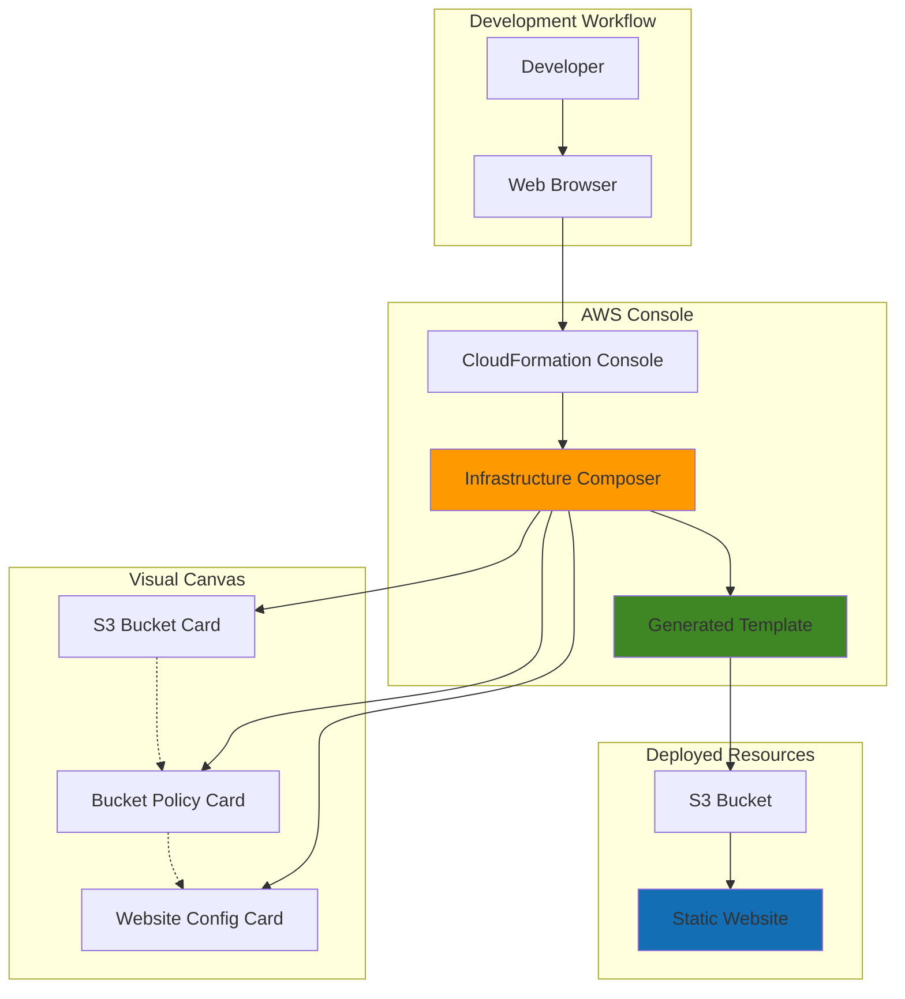

# Visual Infrastructure Design with Application Composer and CloudFormation

## Problem

Development teams struggle with creating CloudFormation templates manually, requiring deep YAML/JSON syntax knowledge and complex resource relationships. This creates barriers for developers who want to design AWS infrastructure but lack extensive CloudFormation expertise, leading to deployment delays and configuration errors that slow down project delivery.

## Solution

AWS Infrastructure Composer provides a visual drag-and-drop interface within the CloudFormation console that allows teams to design infrastructure visually and automatically generate CloudFormation templates. This approach democratizes infrastructure design while ensuring best practices and proper resource configurations are maintained throughout the development process.

## Architecture Diagram



## Prerequisites

1. AWS account with CloudFormation and S3 permissions
2. AWS Management Console access via web browser
3. Basic understanding of static website hosting concepts
4. Basic familiarity with AWS S3 service
5. Estimated cost: $0.50-2.00 per month for S3 storage and requests

> **Note**: Infrastructure Composer is available at no additional cost within the CloudFormation console and generates standard CloudFormation templates.

## Preparation

```bash
# Set environment variables for AWS region and account
export AWS_REGION=$(aws configure get region)
export AWS_ACCOUNT_ID=$(aws sts get-caller-identity \
    --query Account --output text)

# Generate unique suffix for resource naming
RANDOM_SUFFIX=$(aws secretsmanager get-random-password \
    --exclude-punctuation --exclude-uppercase \
    --password-length 6 --require-each-included-type \
    --output text --query RandomPassword)

# Store bucket name for later use
export BUCKET_NAME="my-visual-website-${RANDOM_SUFFIX}"

echo "✅ Environment configured for visual infrastructure design"
echo "Bucket name: ${BUCKET_NAME}"
echo "AWS Region: ${AWS_REGION}"
```

## Steps

1. **Access Infrastructure Composer in CloudFormation Console**:

   AWS Infrastructure Composer integrates directly with the CloudFormation console, providing a seamless visual design experience that eliminates the need to switch between different tools. This integration allows you to move from visual design to deployment within a single workflow, making infrastructure as code accessible to developers with varying levels of CloudFormation expertise.

   Navigate to the AWS Management Console and access CloudFormation:
   - Go to https://console.aws.amazon.com/cloudformation
   - Select **Infrastructure Composer** from the left navigation menu
   - This opens Infrastructure Composer in CloudFormation console mode

   ```bash
   # Verify AWS CLI access and region configuration
   aws cloudformation describe-stacks --region ${AWS_REGION} \
       --query 'Stacks[?StackStatus==`CREATE_COMPLETE`].[StackName]' \
       --output table
   
   echo "✅ CloudFormation console access verified"
   ```

   Infrastructure Composer now loads with a blank canvas where you can drag and drop AWS resources to build your infrastructure visually, bridging the gap between conceptual design and deployable infrastructure.

2. **Create S3 Bucket Using Visual Canvas**:

   The visual canvas in Infrastructure Composer uses "cards" to represent AWS resources, where each card corresponds to a CloudFormation resource type. This intuitive approach allows you to configure AWS services without writing YAML or JSON code, while ensuring the generated templates follow AWS best practices for security and performance.

   In the Infrastructure Composer interface:
   - From the **Resources** palette on the left, find **Storage** section
   - Drag an **S3 Bucket** card onto the canvas
   - Double-click the S3 Bucket card to open properties panel
   - Set the bucket name to `my-visual-website-${RANDOM_SUFFIX}`
   - Enable **Static website hosting** in the properties

   ```bash
   # The visual interface generates CloudFormation template automatically
   # You can preview the generated template by clicking "Template" tab
   echo "✅ S3 Bucket card configured for static website hosting"
   ```

   Infrastructure Composer automatically generates the appropriate CloudFormation resource definition, including required properties and best practice configurations for static website hosting, ensuring your infrastructure follows AWS Well-Architected Framework principles.

3. **Configure Website Properties Visually**:

   Infrastructure Composer provides guided configuration panels that help you set up AWS resources according to AWS best practices. The visual interface ensures you don't miss critical settings while maintaining the flexibility to customize advanced options, making complex configurations accessible to developers at all skill levels.

   Continue in the Infrastructure Composer interface:
   - In the S3 Bucket properties panel, configure:
     - **Index document**: `index.html`
     - **Error document**: `error.html`
   - From the **Security** section, drag a **Bucket Policy** card
   - Connect the Bucket Policy card to the S3 Bucket card by dragging between them
   - Configure the bucket policy for public read access to website files

   ```bash
   # The visual connections automatically create proper CloudFormation references
   # This ensures resources are properly linked in the generated template
   echo "✅ Website configuration and security policy connected visually"
   ```

   The visual connections between cards automatically generate proper CloudFormation references and dependencies, ensuring resources are created in the correct order during deployment while maintaining security best practices.

4. **Review Generated CloudFormation Template**:

   One of the key benefits of Infrastructure Composer is the ability to switch between visual and code views seamlessly. This feature allows you to learn CloudFormation syntax while building visually, providing a natural learning path that bridges the gap between visual design and infrastructure as code proficiency.

   In Infrastructure Composer:
   - Click the **Template** tab to view generated CloudFormation code
   - Review the automatically generated YAML template
   - Notice how visual connections translate to CloudFormation references
   - Verify resource properties match your visual configuration

   ```bash
   # The template can be downloaded or directly deployed
   # All AWS best practices are automatically applied
   echo "✅ CloudFormation template generated from visual design"
   ```

   The generated template includes proper resource dependencies, IAM permissions, and security configurations that would require significant CloudFormation expertise to create manually, demonstrating how Infrastructure Composer accelerates development while maintaining quality.

5. **Deploy Infrastructure from Visual Design**:

   Infrastructure Composer streamlines the deployment process by integrating directly with CloudFormation stack creation. This eliminates the need to manually export templates or configure deployment parameters separately, providing a seamless transition from design to deployment within the same interface.

   Complete the deployment in Infrastructure Composer:
   - Click **Create template** button in the upper right
   - Select **Confirm and export to CloudFormation**
   - Provide stack name: `visual-website-stack-${RANDOM_SUFFIX}`
   - Review parameters and click **Next** through the wizard
   - Acknowledge IAM capabilities and click **Submit**

   ```bash
   # Monitor stack creation progress
   aws cloudformation describe-stacks \
       --stack-name visual-website-stack-${RANDOM_SUFFIX} \
       --query 'Stacks[0].StackStatus' \
       --output text
   
   # Wait for stack creation to complete
   aws cloudformation wait stack-create-complete \
       --stack-name visual-website-stack-${RANDOM_SUFFIX}
   
   echo "✅ Infrastructure deployed from visual design"
   ```

   CloudFormation creates all resources defined in your visual design, maintaining the proper dependencies and configurations established through the visual interface while providing the same reliability and rollback capabilities as traditional CloudFormation deployments.

6. **Upload Website Content to Deployed Bucket**:

   With the infrastructure successfully deployed from your visual design, you can now upload content to test the static website functionality. This step demonstrates how the visually designed infrastructure supports real-world use cases while validating that all configurations work as intended.

   ```bash
   # Create simple website files locally
   cat > index.html << 'EOF'
   <!DOCTYPE html>
   <html>
   <head>
       <title>Visual Infrastructure Demo</title>
       <style>
           body { font-family: Arial, sans-serif; margin: 40px; }
           .container { max-width: 800px; margin: 0 auto; }
           .success { color: #4CAF50; }
       </style>
   </head>
   <body>
       <div class="container">
           <h1>🎉 Success!</h1>
           <p class="success">This website was deployed using AWS Infrastructure Composer!</p>
           <p>Your visual infrastructure design is now live and serving content.</p>
       </div>
   </body>
   </html>
   EOF
   
   cat > error.html << 'EOF'
   <!DOCTYPE html>
   <html>
   <head><title>Page Not Found</title></head>
   <body><h1>404 - Page Not Found</h1></body>
   </html>
   EOF
   
   # Upload files to the bucket created by visual design
   aws s3 cp index.html s3://${BUCKET_NAME}/
   aws s3 cp error.html s3://${BUCKET_NAME}/
   
   echo "✅ Website content uploaded to visually designed infrastructure"
   ```

   The website files are now hosted on the S3 bucket that was created through your visual infrastructure design, demonstrating the complete workflow from conceptual design to functional deployment.

7. **Access and Test Visual Infrastructure Website**:

   Testing the deployed infrastructure validates that your visual design translated correctly into functional AWS resources. This verification step ensures the Infrastructure Composer generated appropriate configurations for your use case and demonstrates the reliability of the visual-to-code translation process.

   ```bash
   # Get website URL from CloudFormation stack outputs
   WEBSITE_URL=$(aws cloudformation describe-stacks \
       --stack-name visual-website-stack-${RANDOM_SUFFIX} \
       --query 'Stacks[0].Outputs[?OutputKey==`WebsiteURL`].OutputValue' \
       --output text)
   
   # If no output exists, construct URL manually
   if [ -z "$WEBSITE_URL" ]; then
       WEBSITE_URL="http://${BUCKET_NAME}.s3-website-${AWS_REGION}.amazonaws.com"
   fi
   
   echo "🌐 Website URL: ${WEBSITE_URL}"
   echo "✅ Visual infrastructure design successfully deployed and accessible"
   
   # Test website accessibility
   curl -I "${WEBSITE_URL}" 2>/dev/null | head -1
   ```

   Your static website is now live and accessible, powered by infrastructure that was designed visually using Infrastructure Composer and deployed through CloudFormation, proving the effectiveness of visual infrastructure design.

## Validation & Testing

1. Verify CloudFormation stack was created successfully:

   ```bash
   # Check stack status and resources
   aws cloudformation describe-stacks \
       --stack-name visual-website-stack-${RANDOM_SUFFIX} \
       --query 'Stacks[0].[StackName,StackStatus,CreationTime]' \
       --output table
   ```

   Expected output: Stack status should show `CREATE_COMPLETE`

2. Test website functionality:

   ```bash
   # Test main page
   curl -s "${WEBSITE_URL}" | grep -i "Visual Infrastructure Demo"
   
   # Test error page
   curl -s "${WEBSITE_URL}/nonexistent" | grep -i "404"
   ```

   Expected output: Both tests should return matching content

3. Verify S3 bucket configuration:

   ```bash
   # Check bucket website configuration
   aws s3api get-bucket-website --bucket ${BUCKET_NAME}
   
   # List uploaded files
   aws s3 ls s3://${BUCKET_NAME}/
   ```

   Expected output: Website configuration and uploaded files should be visible

## Cleanup

1. Remove website files from S3 bucket:

   ```bash
   # Empty the S3 bucket before deletion
   aws s3 rm s3://${BUCKET_NAME} --recursive
   
   echo "✅ S3 bucket contents removed"
   ```

2. Delete CloudFormation stack and all resources:

   ```bash
   # Delete the entire stack created through visual design
   aws cloudformation delete-stack \
       --stack-name visual-website-stack-${RANDOM_SUFFIX}
   
   # Wait for stack deletion to complete
   aws cloudformation wait stack-delete-complete \
       --stack-name visual-website-stack-${RANDOM_SUFFIX}
   
   echo "✅ Visual infrastructure design and all resources cleaned up"
   ```

3. Clean up local environment:

   ```bash
   # Remove local files
   rm -f index.html error.html
   
   # Unset environment variables
   unset BUCKET_NAME WEBSITE_URL RANDOM_SUFFIX
   
   echo "✅ Local environment cleaned up"
   ```

## Discussion

AWS Infrastructure Composer represents a significant advancement in infrastructure as code tooling, bridging the gap between visual design and CloudFormation template generation. The tool democratizes AWS infrastructure design by providing an intuitive drag-and-drop interface that automatically generates production-ready CloudFormation templates following AWS best practices. This approach is particularly valuable for teams that include members with varying levels of CloudFormation expertise, as it allows visual learners to contribute to infrastructure design while maintaining the benefits of infrastructure as code.

The integration with CloudFormation console mode ensures that visual designs seamlessly transition into deployable infrastructure without requiring additional tools or complex export processes. The generated templates maintain all the benefits of traditional CloudFormation, including version control compatibility, drift detection, and rollback capabilities. This integration also means that teams can start with visual design and gradually transition to direct template editing as their CloudFormation expertise grows, providing a natural learning path for infrastructure as code adoption that aligns with the AWS Well-Architected Framework principles.

Infrastructure Composer particularly excels in educational environments and proof-of-concept scenarios where rapid prototyping is essential. The visual feedback loop helps developers understand AWS resource relationships and dependencies more intuitively than reading YAML or JSON templates. Additionally, the tool's ability to generate clean, well-structured templates means that even visually designed infrastructure can be maintained and extended using traditional CloudFormation workflows, ensuring long-term sustainability and integration with existing DevOps practices.

The static website hosting example demonstrates how Infrastructure Composer handles common AWS patterns effectively. The tool automatically configures proper S3 bucket policies, website hosting settings, and resource dependencies that would require significant manual configuration in traditional CloudFormation authoring. For more complex architectures, Infrastructure Composer supports the full range of CloudFormation resources, making it suitable for enterprise-grade infrastructure design. Reference the [AWS Infrastructure Composer Developer Guide](https://docs.aws.amazon.com/infrastructure-composer/latest/dg/what-is-composer.html) and [CloudFormation visual template creation documentation](https://docs.aws.amazon.com/AWSCloudFormation/latest/UserGuide/infrastructure-composer-for-cloudformation.html) for comprehensive guidance on advanced features and best practices.

> **Tip**: Use Infrastructure Composer's template view to learn CloudFormation syntax while building visually. This dual-view approach accelerates CloudFormation learning and helps teams transition from visual design to code-based infrastructure management.

## Challenge

Extend this visual infrastructure design solution by implementing these enhancements:

1. **Add CloudFront Distribution**: Use Infrastructure Composer to add a CloudFront distribution card connected to your S3 bucket for global content delivery and improved performance.

2. **Implement Custom Domain**: Extend the visual design to include Route 53 hosted zone and SSL certificate management through AWS Certificate Manager for a professional domain setup.

3. **Add Monitoring and Alerting**: Incorporate CloudWatch alarms and SNS notifications into your visual design to monitor website performance and availability.

4. **Create Multi-Environment Template**: Design a parameterized template that supports development, staging, and production environments with different configurations for each.

5. **Build CI/CD Integration**: Extend the solution to include CodePipeline and CodeBuild cards for automated website deployment triggered by source code changes in a Git repository.

## Infrastructure Code

### Available Infrastructure as Code:

- [Infrastructure Code Overview](code/README.md) - Detailed description of all infrastructure components
- [AWS CDK (Python)](code/cdk-python/) - AWS CDK Python implementation
- [AWS CDK (TypeScript)](code/cdk-typescript/) - AWS CDK TypeScript implementation
- [CloudFormation](code/cloudformation.yaml) - AWS CloudFormation template
- [Bash CLI Scripts](code/scripts/) - Example bash scripts using AWS CLI commands to deploy infrastructure
- [Terraform](code/terraform/) - Terraform configuration files