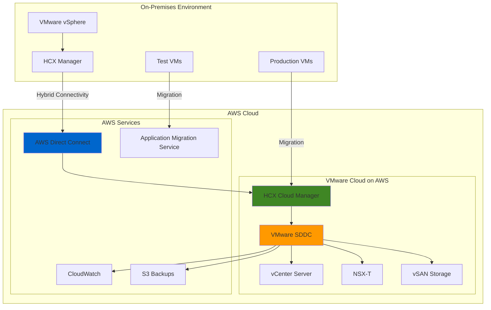

# VMware Cloud Migration with VMware Cloud on AWS

## Problem

Enterprise organizations running VMware workloads on-premises face mounting challenges with aging hardware, data center lease expirations, and limited scalability. Traditional migration approaches require significant application refactoring, resulting in extended downtime, increased complexity, and potential application compatibility issues. Organizations need a seamless path to migrate their VMware environments to the cloud while maintaining operational continuity and leveraging familiar VMware tools and processes.

## Solution

VMware Cloud on AWS provides a native VMware vSphere environment running on dedicated AWS infrastructure, enabling lift-and-shift migration of VMware workloads without application changes. This solution combines VMware's software-defined data center (SDDC) stack with AWS's global infrastructure, providing seamless hybrid cloud operations using VMware HCX for workload mobility and AWS Application Migration Service for non-VMware workloads.

## Architecture Diagram



## Prerequisites

1. AWS account with VMware Cloud on AWS service enabled
2. VMware vSphere environment version 6.0 or later
3. AWS CLI v2 installed and configured (or AWS CloudShell)
4. My VMware account with appropriate licensing
5. Network connectivity between on-premises and AWS (VPN/Direct Connect)
6. Estimated cost: $8,000-15,000/month for 3-host SDDC cluster

> **Note**: VMware Cloud on AWS pricing varies by region and instance type. Use the AWS Pricing Calculator for accurate estimates. As of April 2024, VMware Cloud on AWS is available through Broadcom following their acquisition of VMware.

## Preparation

```bash
# Set environment variables
export AWS_REGION=$(aws configure get region)
export AWS_ACCOUNT_ID=$(aws sts get-caller-identity \
    --query Account --output text)

# Generate unique identifiers for resources
RANDOM_SUFFIX=$(aws secretsmanager get-random-password \
    --exclude-punctuation --exclude-uppercase \
    --password-length 6 --require-each-included-type \
    --output text --query RandomPassword)

# Set VMware Cloud on AWS specific variables
export SDDC_NAME="vmware-migration-${RANDOM_SUFFIX}"
export MANAGEMENT_SUBNET="10.0.0.0/16"
export SDDC_REGION="${AWS_REGION}"

# Create VPC for VMware Cloud on AWS connectivity
export VPC_ID=$(aws ec2 create-vpc \
    --cidr-block 10.1.0.0/16 \
    --tag-specifications "ResourceType=vpc,Tags=[{Key=Name,Value=vmware-migration-vpc}]" \
    --query Vpc.VpcId --output text)

# Create subnet for VMware Cloud connectivity
export SUBNET_ID=$(aws ec2 create-subnet \
    --vpc-id $VPC_ID \
    --cidr-block 10.1.1.0/24 \
    --availability-zone "${AWS_REGION}a" \
    --tag-specifications "ResourceType=subnet,Tags=[{Key=Name,Value=vmware-migration-subnet}]" \
    --query Subnet.SubnetId --output text)

echo "✅ Environment prepared with VPC: $VPC_ID and Subnet: $SUBNET_ID"
```

## Steps

1. **Create VMware Cloud on AWS Connected VPC**:

   VMware Cloud on AWS requires a dedicated VPC for secure connectivity between your AWS environment and the VMware SDDC. This connected VPC serves as the networking bridge, enabling seamless communication while maintaining network isolation and security. The VPC configuration establishes the foundation for hybrid cloud operations and ensures proper routing between on-premises, AWS native services, and VMware workloads.

   ```bash
   # Create internet gateway for VPC
   export IGW_ID=$(aws ec2 create-internet-gateway \
       --tag-specifications "ResourceType=internet-gateway,Tags=[{Key=Name,Value=vmware-migration-igw}]" \
       --query InternetGateway.InternetGatewayId --output text)
   
   # Attach internet gateway to VPC
   aws ec2 attach-internet-gateway \
       --internet-gateway-id $IGW_ID \
       --vpc-id $VPC_ID
   
   # Create route table for public subnet
   export RT_ID=$(aws ec2 create-route-table \
       --vpc-id $VPC_ID \
       --tag-specifications "ResourceType=route-table,Tags=[{Key=Name,Value=vmware-migration-rt}]" \
       --query RouteTable.RouteTableId --output text)
   
   # Add route to internet gateway
   aws ec2 create-route \
       --route-table-id $RT_ID \
       --destination-cidr-block 0.0.0.0/0 \
       --gateway-id $IGW_ID
   
   # Associate route table with subnet
   aws ec2 associate-route-table \
       --route-table-id $RT_ID \
       --subnet-id $SUBNET_ID
   
   echo "✅ VPC configured for VMware Cloud on AWS connectivity"
   ```

   The connected VPC is now established with internet connectivity and proper routing. This networking foundation enables secure communication between VMware Cloud on AWS and your existing AWS infrastructure, supporting both migration activities and ongoing hybrid operations.

2. **Set up AWS Application Migration Service**:

   AWS Application Migration Service (MGN) provides agent-based, lift-and-shift migration capabilities for servers that aren't running on VMware infrastructure. MGN offers continuous block-level replication with minimal business disruption, making it ideal for migrating mixed environments where some workloads exist outside the VMware ecosystem. This service complements VMware HCX by handling non-VMware workloads in your migration strategy.

   ```bash
   # Initialize MGN service in the region
   aws mgn initialize-service \
       --region $AWS_REGION
   
   # Create security group for MGN replication servers
   export MGN_SG_ID=$(aws ec2 create-security-group \
       --group-name mgn-replication-sg \
       --description "Security group for MGN replication servers" \
       --vpc-id $VPC_ID \
       --query GroupId --output text)
   
   # Allow MGN replication traffic
   aws ec2 authorize-security-group-ingress \
       --group-id $MGN_SG_ID \
       --protocol tcp \
       --port 1500 \
       --cidr 10.0.0.0/8
   
   # Create replication configuration template
   aws mgn create-replication-configuration-template \
       --associate-default-security-group \
       --bandwidth-throttling 100 \
       --create-public-ip \
       --data-plane-routing PRIVATE_IP \
       --default-large-staging-disk-type GP3 \
       --ebs-encryption DEFAULT \
       --replication-server-instance-type m5.large \
       --replication-servers-security-groups-i-ds $MGN_SG_ID \
       --staging-area-subnet-id $SUBNET_ID \
       --staging-area-tags Environment=Migration,Project=VMware \
       --use-dedicated-replication-server false
   
   echo "✅ MGN service initialized for non-VMware workloads"
   ```

   The MGN service is now configured with replication templates that define how source servers will be replicated and launched in AWS. This parallel migration capability ensures comprehensive migration coverage beyond just VMware workloads, enabling a complete data center migration strategy.

3. **Create Direct Connect Virtual Interface (Optional)**:

   AWS Direct Connect provides dedicated network connectivity between your on-premises environment and AWS, offering more predictable bandwidth, lower latency, and reduced data transfer costs compared to internet-based connections. For VMware migrations involving large data sets or strict network requirements, Direct Connect ensures optimal performance during bulk migrations and ongoing hybrid operations. The Direct Connect Gateway enables connection to multiple VPCs and VMware SDDCs across regions.

   ```bash
   # Create Direct Connect gateway for hybrid connectivity
   export DX_GATEWAY_ID=$(aws directconnect create-direct-connect-gateway \
       --name "vmware-migration-dx-gateway" \
       --amazon-side-asn 64512 \
       --query directConnectGateway.directConnectGatewayId --output text)
   
   # Create virtual interface (requires existing Direct Connect connection)
   # Replace DX_CONNECTION_ID with your actual connection ID
   if [[ -n "$DX_CONNECTION_ID" ]]; then
       aws directconnect create-private-virtual-interface \
           --connection-id $DX_CONNECTION_ID \
           --new-private-virtual-interface \
           vlan=100,asn=65000,mtu=1500,vif=vmware-migration-vif,addressFamily=ipv4,customerAddress=192.168.1.1/30,amazonAddress=192.168.1.2/30,directConnectGatewayId=$DX_GATEWAY_ID
   fi
   
   echo "✅ Direct Connect gateway configured"
   ```

   The Direct Connect gateway provides centralized connectivity management for hybrid cloud networking. This dedicated connection significantly improves migration performance and enables consistent network experiences for users accessing migrated workloads.

4. **Deploy VMware Cloud on AWS SDDC**:

   The Software-Defined Data Center (SDDC) deployment creates a complete VMware stack including vSphere, vCenter, NSX-T, and vSAN running on dedicated AWS hardware. This native VMware environment provides 100% API compatibility with on-premises VMware infrastructure, enabling seamless workload migration and management using familiar VMware tools. The SDDC operates as an isolated environment while providing integration points with AWS native services.

   ```bash
   # Create IAM role for VMware Cloud on AWS
   aws iam create-role \
       --role-name VMwareCloudOnAWS-ServiceRole \
       --assume-role-policy-document '{
           "Version": "2012-10-17",
           "Statement": [
               {
                   "Effect": "Allow",
                   "Principal": {
                       "AWS": "arn:aws:iam::063048924651:root"
                   },
                   "Action": "sts:AssumeRole",
                   "Condition": {
                       "StringEquals": {
                           "sts:ExternalId": "'$AWS_ACCOUNT_ID'"
                       }
                   }
               }
           ]
       }'
   
   # Attach required policies to the role
   aws iam attach-role-policy \
       --role-name VMwareCloudOnAWS-ServiceRole \
       --policy-arn arn:aws:iam::aws:policy/VMwareCloudOnAWSServiceRolePolicy
   
   # Note: SDDC creation must be done through VMware Cloud Console
   # The following would be done via VMware Cloud Console:
   # 1. Login to VMware Cloud Console (vmc.vmware.com)
   # 2. Create SDDC with parameters:
   #    - Name: $SDDC_NAME
   #    - Region: $SDDC_REGION
   #    - Host Type: i3.metal
   #    - Number of Hosts: 3
   #    - Management Subnet: $MANAGEMENT_SUBNET
   #    - Connected VPC: $VPC_ID
   #    - Connected Subnet: $SUBNET_ID
   
   echo "✅ SDDC deployment initiated (complete via VMware Cloud Console)"
   ```

   The IAM service role enables VMware Cloud on AWS to provision and manage AWS resources on your behalf. SDDC deployment typically takes 2-4 hours and creates a fully functional VMware environment with high availability, automated patching, and integrated monitoring capabilities.

5. **Configure CloudWatch Monitoring**:

   CloudWatch integration provides comprehensive monitoring and alerting for VMware Cloud on AWS infrastructure and migration activities. This monitoring framework tracks SDDC health, host performance, migration progress, and operational metrics. CloudWatch enables proactive issue detection and provides historical data for capacity planning and performance optimization during and after migration.

   ```bash
   # Create CloudWatch log group for VMware operations
   aws logs create-log-group \
       --log-group-name "/aws/vmware/migration" \
       --retention-in-days 30
   
   # Create SNS topic for VMware alerts first
   export SNS_TOPIC_ARN=$(aws sns create-topic \
       --name VMware-Migration-Alerts \
       --query TopicArn --output text)
   
   # Create CloudWatch alarm for SDDC health
   aws cloudwatch put-metric-alarm \
       --alarm-name "VMware-SDDC-HostHealth" \
       --alarm-description "Monitor VMware SDDC host health" \
       --metric-name "HostHealth" \
       --namespace "AWS/VMwareCloudOnAWS" \
       --statistic "Average" \
       --period 300 \
       --threshold 1 \
       --comparison-operator "LessThanThreshold" \
       --evaluation-periods 2 \
       --alarm-actions "$SNS_TOPIC_ARN"
   
   # Create custom metric for migration progress
   aws cloudwatch put-metric-data \
       --namespace "VMware/Migration" \
       --metric-data MetricName=MigrationProgress,Value=0,Unit=Percent
   
   echo "✅ CloudWatch monitoring configured for VMware environment"
   ```

   The monitoring infrastructure now captures critical metrics for both operational health and migration progress tracking. This observability foundation enables data-driven decision making and automated response to infrastructure events.

6. **Set up HCX Hybrid Connectivity**:

   VMware HCX (Hybrid Cloud Extension) serves as the migration engine, providing secure connectivity and workload mobility between on-premises VMware environments and VMware Cloud on AWS. HCX supports multiple migration methods including vMotion (zero-downtime), bulk migration (scheduled maintenance windows), and Replication Assisted vMotion (WAN-optimized). The security group configuration ensures proper network access for HCX services while maintaining security boundaries.

   ```bash
   # Create security group for HCX traffic
   export HCX_SG_ID=$(aws ec2 create-security-group \
       --group-name vmware-hcx-sg \
       --description "Security group for VMware HCX traffic" \
       --vpc-id $VPC_ID \
       --query GroupId --output text)
   
   # Configure HCX security group rules based on VMware documentation
   # HCX Cloud Manager (HTTPS)
   aws ec2 authorize-security-group-ingress \
       --group-id $HCX_SG_ID \
       --protocol tcp \
       --port 443 \
       --cidr 0.0.0.0/0
   
   # HCX Interconnect Service (HTTPS)
   aws ec2 authorize-security-group-ingress \
       --group-id $HCX_SG_ID \
       --protocol tcp \
       --port 9443 \
       --cidr 0.0.0.0/0
   
   # HCX Cloud Connector (HTTPS)
   aws ec2 authorize-security-group-ingress \
       --group-id $HCX_SG_ID \
       --protocol tcp \
       --port 8043 \
       --cidr 0.0.0.0/0
   
   # Allow HCX vMotion traffic (ESXi hosts)
   aws ec2 authorize-security-group-ingress \
       --group-id $HCX_SG_ID \
       --protocol tcp \
       --port 902 \
       --cidr 192.168.0.0/16
   
   # Allow HCX Network Extension traffic
   aws ec2 authorize-security-group-ingress \
       --group-id $HCX_SG_ID \
       --protocol tcp \
       --port 4500 \
       --cidr 192.168.0.0/16
   
   # Allow UDP traffic for HCX tunneling
   aws ec2 authorize-security-group-ingress \
       --group-id $HCX_SG_ID \
       --protocol udp \
       --port 4500 \
       --cidr 192.168.0.0/16
   
   echo "✅ HCX security group configured: $HCX_SG_ID"
   ```

   The HCX security configuration enables encrypted communication channels between source and destination environments. These network rules facilitate seamless workload migration while maintaining enterprise security standards throughout the migration process.

7. **Configure S3 Backup and Disaster Recovery**:

   Amazon S3 provides highly durable (99.999999999%) storage for VMware backup and disaster recovery operations. S3's multiple storage classes enable cost-effective long-term retention with intelligent tiering based on access patterns. This backup strategy complements VMware-native backup solutions and provides additional protection against data loss scenarios. The lifecycle policies automatically optimize storage costs by transitioning older backups to more economical storage tiers.

   ```bash
   # Create S3 bucket for VMware backups
   export BACKUP_BUCKET="vmware-backup-${RANDOM_SUFFIX}-${AWS_ACCOUNT_ID}"
   
   # Create bucket with region-specific configuration
   if [ "$AWS_REGION" = "us-east-1" ]; then
       aws s3api create-bucket \
           --bucket $BACKUP_BUCKET \
           --region $AWS_REGION
   else
       aws s3api create-bucket \
           --bucket $BACKUP_BUCKET \
           --region $AWS_REGION \
           --create-bucket-configuration LocationConstraint=$AWS_REGION
   fi
   
   # Configure bucket versioning
   aws s3api put-bucket-versioning \
       --bucket $BACKUP_BUCKET \
       --versioning-configuration Status=Enabled
   
   # Enable default encryption
   aws s3api put-bucket-encryption \
       --bucket $BACKUP_BUCKET \
       --server-side-encryption-configuration '{
           "Rules": [
               {
                   "ApplyServerSideEncryptionByDefault": {
                       "SSEAlgorithm": "AES256"
                   }
               }
           ]
       }'
   
   # Set up lifecycle policy for cost optimization
   aws s3api put-bucket-lifecycle-configuration \
       --bucket $BACKUP_BUCKET \
       --lifecycle-configuration '{
           "Rules": [
               {
                   "ID": "VMwareBackupLifecycle",
                   "Status": "Enabled",
                   "Transitions": [
                       {
                           "Days": 30,
                           "StorageClass": "STANDARD_IA"
                       },
                       {
                           "Days": 90,
                           "StorageClass": "GLACIER"
                       }
                   ]
               }
           ]
       }'
   
   echo "✅ S3 backup bucket configured: $BACKUP_BUCKET"
   ```

   The S3 backup infrastructure provides a robust foundation for data protection with automated lifecycle management. This configuration ensures long-term data retention while optimizing costs through intelligent storage tiering.

8. **Create Migration Waves and Test Migration**:

   Migration wave planning provides structured approach to workload migration, reducing risk and ensuring systematic execution. This wave-based strategy allows organizations to validate connectivity, test procedures, and identify issues with lower-risk workloads before migrating critical production systems. The DynamoDB table provides centralized tracking of migration progress across all waves.

   ```bash
   # Create migration wave plan
   cat > migration-waves.json << EOF
   {
       "waves": [
           {
               "wave": 1,
               "description": "Test/Dev workloads",
               "priority": "Low",
               "vms": ["test-vm-01", "dev-vm-01"],
               "migration_type": "HCX_vMotion"
           },
           {
               "wave": 2,
               "description": "Non-critical production",
               "priority": "Medium", 
               "vms": ["web-server-01", "app-server-01"],
               "migration_type": "HCX_Bulk_Migration"
           },
           {
               "wave": 3,
               "description": "Critical production",
               "priority": "High",
               "vms": ["db-server-01", "core-app-01"],
               "migration_type": "HCX_RAV"
           }
       ]
   }
   EOF
   
   # Upload migration plan to S3
   aws s3 cp migration-waves.json s3://$BACKUP_BUCKET/migration-plan/
   
   # Create DynamoDB table to track migration progress
   aws dynamodb create-table \
       --table-name VMwareMigrationTracking \
       --attribute-definitions \
           AttributeName=VMName,AttributeType=S \
           AttributeName=MigrationWave,AttributeType=S \
       --key-schema \
           AttributeName=VMName,KeyType=HASH \
           AttributeName=MigrationWave,KeyType=RANGE \
       --provisioned-throughput ReadCapacityUnits=5,WriteCapacityUnits=5
   
   echo "✅ Migration wave plan created and tracking configured"
   ```

   The migration planning framework provides systematic approach to workload migration with centralized tracking capabilities. This structured methodology reduces migration risks and provides visibility into migration progress across multiple waves.

9. **Configure Cost Optimization and Governance**:

   Cost management and governance are critical for VMware Cloud on AWS deployments due to the significant monthly costs of dedicated infrastructure. AWS Budgets and Cost Anomaly Detection provide proactive monitoring and alerting capabilities to prevent unexpected cost overruns. This governance framework ensures financial accountability and enables cost optimization throughout the migration lifecycle.

   ```bash
   # Create budget for VMware Cloud on AWS
   aws budgets create-budget \
       --account-id $AWS_ACCOUNT_ID \
       --budget '{
           "BudgetName": "VMware-Cloud-Budget",
           "BudgetLimit": {
               "Amount": "15000",
               "Unit": "USD"
           },
           "TimeUnit": "MONTHLY",
           "BudgetType": "COST",
           "CostFilters": {
               "Service": ["VMware Cloud on AWS"]
           }
       }' \
       --notifications-with-subscribers '[
           {
               "Notification": {
                   "NotificationType": "ACTUAL",
                   "ComparisonOperator": "GREATER_THAN",
                   "Threshold": 80,
                   "ThresholdType": "PERCENTAGE"
               },
               "Subscribers": [
                   {
                       "SubscriptionType": "EMAIL",
                       "Address": "admin@company.com"
                   }
               ]
           }
       ]'
   
   # Create cost anomaly detector
   aws ce create-anomaly-detector \
       --anomaly-detector '{
           "DetectorName": "VMware-Cost-Anomaly-Detector",
           "MonitorType": "DIMENSIONAL",
           "DimensionKey": "SERVICE",
           "MatchOptions": ["EQUALS"],
           "MonitorSpecification": {
               "DimensionKey": "SERVICE",
               "MatchOptions": ["EQUALS"],
               "Values": ["VMware Cloud on AWS"]
           }
       }'
   
   echo "✅ Cost optimization and governance configured"
   ```

   The cost governance framework provides automated monitoring and alerting for VMware Cloud on AWS spending. This proactive approach helps organizations maintain budget control and identify optimization opportunities throughout the migration and operational phases.

10. **Set up Operational Monitoring and Alerting**:

    Comprehensive operational monitoring provides visibility into migration progress, infrastructure health, and performance metrics. The CloudWatch dashboard consolidates key metrics from multiple sources, enabling centralized monitoring of the entire migration ecosystem. EventBridge integration automates response to SDDC state changes, ensuring rapid notification of critical events.

    ```bash
    # Subscribe email to SNS topic
    aws sns subscribe \
        --topic-arn $SNS_TOPIC_ARN \
        --protocol email \
        --notification-endpoint admin@company.com
    
    # Create CloudWatch dashboard for VMware operations
    aws cloudwatch put-dashboard \
        --dashboard-name "VMware-Migration-Dashboard" \
        --dashboard-body '{
            "widgets": [
                {
                    "type": "metric",
                    "width": 12,
                    "height": 6,
                    "properties": {
                        "metrics": [
                            ["AWS/VMwareCloudOnAWS", "HostHealth"],
                            ["VMware/Migration", "MigrationProgress"],
                            ["AWS/ApplicationMigrationService", "ReplicationProgress"]
                        ],
                        "period": 300,
                        "stat": "Average",
                        "region": "'$AWS_REGION'",
                        "title": "VMware Migration Status"
                    }
                }
            ]
        }'
    
    # Create EventBridge rule for SDDC events
    aws events put-rule \
        --name VMware-SDDC-StateChange \
        --event-pattern '{
            "source": ["aws.vmware"],
            "detail-type": ["VMware Cloud on AWS SDDC State Change"]
        }'
    
    aws events put-targets \
        --rule VMware-SDDC-StateChange \
        --targets "Id"="1","Arn"="$SNS_TOPIC_ARN"
    
    echo "✅ Operational monitoring and alerting configured"
    ```

    The monitoring infrastructure provides comprehensive visibility into migration progress and infrastructure health. This observability foundation enables proactive issue detection and automated response to critical events throughout the migration lifecycle.

11. **Validate HCX Connectivity and Perform Test Migration**:

    Migration validation ensures that all connectivity components function correctly before production workload migration. This validation phase tests network connectivity, DNS resolution, authentication, and HCX service availability. Performing test migrations with non-critical workloads validates the migration process and identifies potential issues in a controlled environment, reducing risk for production migrations.

    ```bash
    # Create test file for migration validation
    cat > test-migration-validation.sh << 'EOF'
    #!/bin/bash
    
    # Test HCX connectivity
    echo "Testing HCX connectivity..."
    
    # Check if HCX services are reachable (replace with actual SDDC URLs)
    SDDC_HCX_URL="https://hcx-cloud-manager.sddc-1-2-3-4.vmc.vmware.com:443"
    if curl -k -s --connect-timeout 10 $SDDC_HCX_URL > /dev/null; then
        echo "✅ HCX Cloud Manager is reachable"
    else
        echo "❌ HCX Cloud Manager is not reachable"
    fi
    
    # Validate network segments
    echo "Validating network segments..."
    
    # Test DNS resolution (replace with actual SDDC domain)
    VCENTER_FQDN="vcenter.sddc-1-2-3-4.vmc.vmware.com"
    if nslookup $VCENTER_FQDN > /dev/null 2>&1; then
        echo "✅ DNS resolution working"
    else
        echo "❌ DNS resolution failed"
    fi
    
    # Test network connectivity to management network
    echo "Testing management network connectivity..."
    
    echo "Validation complete"
    EOF
    
    chmod +x test-migration-validation.sh
    
    # Upload validation script to S3
    aws s3 cp test-migration-validation.sh s3://$BACKUP_BUCKET/scripts/
    
    # Update migration progress metric
    aws cloudwatch put-metric-data \
        --namespace "VMware/Migration" \
        --metric-data MetricName=MigrationProgress,Value=25,Unit=Percent
    
    echo "✅ Test migration validation prepared"
    ```

    The validation framework provides comprehensive testing capabilities to verify migration readiness. These automated tests help identify and resolve connectivity issues before attempting production workload migrations, ensuring higher success rates and reduced downtime.

12. **Execute Production Migration Waves**:

    Production migration execution requires careful orchestration and monitoring to ensure successful workload transitions. The automated orchestration framework provides standardized procedures for wave execution, progress tracking, and error handling. Lambda-based automation reduces manual effort and ensures consistent execution across all migration waves.

    ```bash
    # Create migration execution script
    cat > execute-migration-wave.sh << 'EOF'
    #!/bin/bash
    
    WAVE_NUMBER=$1
    
    if [ -z "$WAVE_NUMBER" ]; then
        echo "Usage: $0 <wave_number>"
        exit 1
    fi
    
    echo "Executing migration wave $WAVE_NUMBER..."
    
    # Start migration wave
    aws cloudwatch put-metric-data \
        --namespace "VMware/Migration" \
        --metric-data MetricName=CurrentWave,Value=$WAVE_NUMBER,Unit=Count
    
    # Create log stream if it doesn't exist
    aws logs create-log-stream \
        --log-group-name "/aws/vmware/migration" \
        --log-stream-name "wave-$WAVE_NUMBER" || true
    
    # Log migration start
    aws logs put-log-events \
        --log-group-name "/aws/vmware/migration" \
        --log-stream-name "wave-$WAVE_NUMBER" \
        --log-events timestamp=$(date +%s000),message="Starting migration wave $WAVE_NUMBER"
    
    # Simulate migration progress updates
    for i in {1..10}; do
        PROGRESS=$((i * 10))
        aws cloudwatch put-metric-data \
            --namespace "VMware/Migration" \
            --metric-data MetricName=WaveProgress,Value=$PROGRESS,Unit=Percent
        sleep 30
    done
    
    echo "Migration wave $WAVE_NUMBER completed"
    EOF
    
    chmod +x execute-migration-wave.sh
    
    # Upload execution script to S3
    aws s3 cp execute-migration-wave.sh s3://$BACKUP_BUCKET/scripts/
    
    # Create Lambda execution role (if it doesn't exist)
    aws iam create-role \
        --role-name lambda-vmware-migration-role \
        --assume-role-policy-document '{
            "Version": "2012-10-17",
            "Statement": [
                {
                    "Effect": "Allow",
                    "Principal": {
                        "Service": "lambda.amazonaws.com"
                    },
                    "Action": "sts:AssumeRole"
                }
            ]
        }' || true
    
    # Attach basic Lambda execution policy
    aws iam attach-role-policy \
        --role-name lambda-vmware-migration-role \
        --policy-arn arn:aws:iam::aws:policy/service-role/AWSLambdaBasicExecutionRole || true
    
    echo "✅ Migration execution framework deployed"
    ```

    The migration execution framework provides standardized automation for production workload migrations. This systematic approach ensures consistent procedures across all migration waves while providing comprehensive monitoring and logging capabilities.

## Validation & Testing

1. **Verify SDDC deployment and connectivity**:

   ```bash
   # Check VPC connectivity
   aws ec2 describe-vpcs \
       --vpc-ids $VPC_ID \
       --query 'Vpcs[0].State' --output text
   ```

   Expected output: `available`

2. **Test HCX service status**:

   ```bash
   # Verify HCX security group configuration
   aws ec2 describe-security-groups \
       --group-ids $HCX_SG_ID \
       --query 'SecurityGroups[0].GroupName' --output text
   ```

   Expected output: `vmware-hcx-sg`

3. **Validate monitoring and alerting**:

   ```bash
   # Check CloudWatch dashboard
   aws cloudwatch get-dashboard \
       --dashboard-name "VMware-Migration-Dashboard" \
       --query 'DashboardName' --output text
   ```

   Expected output: `VMware-Migration-Dashboard`

4. **Test backup and disaster recovery**:

   ```bash
   # Verify S3 backup bucket
   aws s3api head-bucket --bucket $BACKUP_BUCKET
   
   # Check bucket versioning
   aws s3api get-bucket-versioning \
       --bucket $BACKUP_BUCKET \
       --query 'Status' --output text
   ```

   Expected output: `Enabled`

## Cleanup

1. **Remove VMware Cloud on AWS resources**:

   ```bash
   # Delete SDDC (must be done through VMware Cloud Console)
   echo "Delete SDDC through VMware Cloud Console"
   
   # Remove CloudWatch resources
   aws cloudwatch delete-dashboard \
       --dashboard-name "VMware-Migration-Dashboard"
   
   aws cloudwatch delete-alarms \
       --alarm-names "VMware-SDDC-HostHealth"
   
   aws logs delete-log-group \
       --log-group-name "/aws/vmware/migration"
   
   echo "✅ CloudWatch resources cleaned up"
   ```

2. **Remove AWS resources**:

   ```bash
   # Delete S3 bucket contents and bucket
   aws s3 rm s3://$BACKUP_BUCKET --recursive
   aws s3api delete-bucket --bucket $BACKUP_BUCKET
   
   # Delete DynamoDB table
   aws dynamodb delete-table --table-name VMwareMigrationTracking
   
   # Delete EventBridge rule targets and rule
   aws events remove-targets \
       --rule VMware-SDDC-StateChange \
       --ids "1"
   aws events delete-rule --name VMware-SDDC-StateChange
   
   echo "✅ AWS resources cleaned up"
   ```

3. **Remove networking resources**:

   ```bash
   # Delete security groups
   aws ec2 delete-security-group --group-id $HCX_SG_ID
   aws ec2 delete-security-group --group-id $MGN_SG_ID
   
   # Disassociate route table
   ASSOCIATION_ID=$(aws ec2 describe-route-tables \
       --route-table-ids $RT_ID \
       --query 'RouteTables[0].Associations[0].RouteTableAssociationId' \
       --output text)
   aws ec2 disassociate-route-table --association-id $ASSOCIATION_ID
   
   # Delete route table
   aws ec2 delete-route-table --route-table-id $RT_ID
   
   # Detach and delete internet gateway
   aws ec2 detach-internet-gateway \
       --internet-gateway-id $IGW_ID \
       --vpc-id $VPC_ID
   aws ec2 delete-internet-gateway --internet-gateway-id $IGW_ID
   
   # Delete subnet and VPC
   aws ec2 delete-subnet --subnet-id $SUBNET_ID
   aws ec2 delete-vpc --vpc-id $VPC_ID
   
   echo "✅ Networking resources cleaned up"
   ```

4. **Remove IAM and notification resources**:

   ```bash
   # Detach and delete IAM roles
   aws iam detach-role-policy \
       --role-name VMwareCloudOnAWS-ServiceRole \
       --policy-arn arn:aws:iam::aws:policy/VMwareCloudOnAWSServiceRolePolicy
   aws iam delete-role --role-name VMwareCloudOnAWS-ServiceRole
   
   aws iam detach-role-policy \
       --role-name lambda-vmware-migration-role \
       --policy-arn arn:aws:iam::aws:policy/service-role/AWSLambdaBasicExecutionRole
   aws iam delete-role --role-name lambda-vmware-migration-role
   
   # Delete SNS topic
   aws sns delete-topic --topic-arn $SNS_TOPIC_ARN
   
   # Delete Direct Connect gateway (if created)
   if [[ -n "$DX_GATEWAY_ID" ]]; then
       aws directconnect delete-direct-connect-gateway \
           --direct-connect-gateway-id $DX_GATEWAY_ID
   fi
   
   echo "✅ IAM and notification resources cleaned up"
   ```

## Discussion

VMware Cloud on AWS represents a compelling solution for organizations seeking to modernize their VMware infrastructure while maintaining operational continuity. The service provides a native VMware environment running on dedicated AWS infrastructure, eliminating the need for application refactoring during migration. Since Broadcom's acquisition of VMware in 2024, the service continues to be available with enhanced enterprise support and integration capabilities.

The key architectural benefit lies in the seamless integration between VMware's SDDC stack and AWS's global infrastructure. HCX (Hybrid Cloud Extension) serves as the migration engine, providing multiple migration modes including vMotion for zero-downtime migration, bulk migration for large workloads, and Replication Assisted vMotion (RAV) for WAN-optimized migrations. This flexibility allows organizations to choose the appropriate migration strategy based on their specific requirements and network constraints.

Cost optimization strategies are crucial for VMware Cloud on AWS deployments. The service operates on a subscription model with dedicated hosts, making it essential to right-size SDDC clusters and leverage AWS native services for complementary workloads. Organizations can achieve significant cost savings by using AWS services like S3 for backup and archival, CloudWatch for monitoring, and AWS Application Migration Service for non-VMware workloads.

The hybrid cloud operational model enabled by VMware Cloud on AWS extends beyond simple migration. Organizations can leverage AWS's breadth of services for analytics, machine learning, and modern application development while maintaining their existing VMware operational processes. This approach provides a bridge to cloud-native architectures without forcing immediate wholesale changes to operational practices. For comprehensive guidance on network requirements and security best practices, refer to the [AWS Prescriptive Guidance for VMware HCX](https://docs.aws.amazon.com/prescriptive-guidance/latest/patterns/migrate-vmware-sddc-to-vmware-cloud-on-aws-using-vmware-hcx.html).

> **Warning**: VMware Cloud on AWS incurs significant monthly costs even when not actively migrating. Plan your migration timeline carefully to minimize infrastructure costs. As of April 2024, VMware Cloud on AWS is available through Broadcom following their acquisition.

> **Tip**: Implement a phased migration approach starting with non-critical workloads to validate connectivity and operational procedures before migrating production systems. Use Gateway Firewall rules to restrict network access to HCX Cloud Manager service.

> **Note**: HCX supports multiple migration types - use vMotion for zero-downtime migrations of critical systems and bulk migration for planned maintenance windows. See [VMware HCX Documentation](https://docs.vmware.com/en/VMware-HCX/) for detailed migration strategies and port requirements.

## Challenge

Extend this VMware Cloud migration solution with these advanced capabilities:

1. **Implement Multi-Region Disaster Recovery**: Configure VMware Site Recovery Manager (SRM) with VMware Cloud on AWS in multiple regions for automated failover and failback capabilities using cross-region SDDC replication.

2. **Integrate with AWS Transit Gateway**: Connect multiple VMware SDDCs across regions using AWS Transit Gateway for centralized network management and routing, enabling global hybrid cloud connectivity.

3. **Deploy VMware Tanzu on VMware Cloud**: Implement container orchestration using VMware Tanzu Kubernetes Grid on VMware Cloud on AWS for modernizing legacy applications with cloud-native architectures.

4. **Advanced Security Integration**: Integrate VMware NSX Advanced Threat Prevention with AWS Security services like GuardDuty and Security Hub for comprehensive threat detection across hybrid environments.

5. **Automated Scaling and Optimization**: Create Lambda functions to automatically scale SDDC clusters based on utilization metrics and integrate with AWS Cost Explorer for automated cost optimization recommendations using AWS Cost Anomaly Detection.

## Infrastructure Code

*Infrastructure code will be generated after recipe approval.*