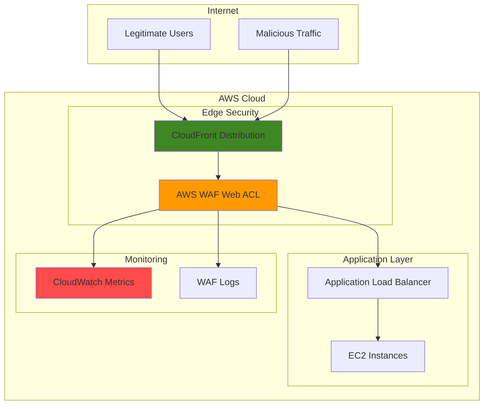

# WAF Rate Limiting for Web Application Protection

## Problem

Organizations face increasing web-based attacks including DDoS attempts, bot traffic, and application-layer attacks that can overwhelm web applications and degrade user experience. Traditional network firewalls cannot inspect HTTP/HTTPS traffic at the application layer, leaving web applications vulnerable to sophisticated attacks that exploit application logic, consume resources through excessive requests, or attempt to bypass authentication mechanisms.

## Solution

AWS WAF (Web Application Firewall) provides application-layer protection by filtering malicious web traffic before it reaches your applications. By implementing rate limiting rules, IP reputation lists, and custom filtering conditions, WAF creates a comprehensive security barrier that automatically blocks attacks while allowing legitimate traffic to pass through, ensuring optimal application performance and availability.

## Architecture Diagram



## Prerequisites

1. AWS account with appropriate permissions for WAF, CloudFront, and ALB management
2. AWS CLI v2 installed and configured (or AWS CloudShell access)
3. Basic understanding of web application security and HTTP protocols
4. Existing web application or willingness to deploy a test application
5. Understanding of rate limiting concepts and DDoS protection strategies
6. Estimated cost: $1-5 per month for WAF rules + CloudFront/ALB usage charges

> **Note**: AWS WAF charges per web ACL ($1/month), per rule ($0.60/month), and per million web requests ($0.60). Test in a development environment first to understand cost implications.

## Preparation

```bash
# Set environment variables
export AWS_REGION=$(aws configure get region)
export AWS_ACCOUNT_ID=$(aws sts get-caller-identity \
    --query Account --output text)

# Generate unique identifiers for resources
RANDOM_SUFFIX=$(aws secretsmanager get-random-password \
    --exclude-punctuation --exclude-uppercase \
    --password-length 6 --require-each-included-type \
    --output text --query RandomPassword)

export WAF_WEB_ACL_NAME="waf-protection-${RANDOM_SUFFIX}"
export RATE_LIMIT_RULE_NAME="rate-limit-rule-${RANDOM_SUFFIX}"
export IP_REPUTATION_RULE_NAME="ip-reputation-rule-${RANDOM_SUFFIX}"

# Create CloudWatch log group for WAF logs
aws logs create-log-group \
    --log-group-name "/aws/wafv2/security-logs" \
    --region ${AWS_REGION}

echo "✅ Environment variables set and log group created"
```

## Steps

1. **Create AWS WAF Web Access Control List (ACL)**:

   AWS WAF Web ACLs serve as the primary container for security rules that protect your web applications. A Web ACL acts as a comprehensive security policy that defines which traffic should be allowed, blocked, or monitored. Understanding Web ACLs is fundamental because they determine how AWS WAF evaluates incoming requests against your defined security criteria, providing the foundation for all subsequent rule evaluations.

   ```bash
   # Create the Web ACL with default allow action
   aws wafv2 create-web-acl \
       --name ${WAF_WEB_ACL_NAME} \
       --scope CLOUDFRONT \
       --default-action Allow={} \
       --description "Web ACL for rate limiting and security protection" \
       --region us-east-1
   
   # Store the Web ACL ARN for later use
   export WEB_ACL_ARN=$(aws wafv2 list-web-acls \
       --scope CLOUDFRONT \
       --region us-east-1 \
       --query "WebACLs[?Name=='${WAF_WEB_ACL_NAME}'].ARN" \
       --output text)
   
   echo "✅ Web ACL created: ${WEB_ACL_ARN}"
   ```

   The Web ACL is now established as your security foundation. This container will hold all your security rules and determines the overall security posture of your web application. The default allow action ensures legitimate traffic flows through while rules define specific blocking conditions based on the AWS Well-Architected security pillar of defense in depth.

2. **Configure Rate Limiting Rule for DDoS Protection**:

   Rate limiting is essential for preventing abuse and ensuring fair resource usage across all users. AWS WAF rate-based rules automatically track request rates from individual IP addresses and temporarily block sources that exceed defined thresholds. This protection mechanism is crucial for maintaining application availability during traffic spikes or attack scenarios, implementing the AWS Well-Architected reliability pillar by designing for failure scenarios.

   ```bash
   # Create rate limiting rule (limit: 2000 requests per 5 minutes)
   aws wafv2 update-web-acl \
       --id $(echo ${WEB_ACL_ARN} | cut -d'/' -f3) \
       --name ${WAF_WEB_ACL_NAME} \
       --scope CLOUDFRONT \
       --default-action Allow={} \
       --rules '[
         {
           "Name": "'${RATE_LIMIT_RULE_NAME}'",
           "Priority": 1,
           "Statement": {
             "RateBasedStatement": {
               "Limit": 2000,
               "AggregateKeyType": "IP"
             }
           },
           "Action": {
             "Block": {}
           },
           "VisibilityConfig": {
             "SampledRequestsEnabled": true,
             "CloudWatchMetricsEnabled": true,
             "MetricName": "RateLimitRule"
           }
         }
       ]' \
       --lock-token $(aws wafv2 get-web-acl \
           --id $(echo ${WEB_ACL_ARN} | cut -d'/' -f3) \
           --scope CLOUDFRONT \
           --region us-east-1 \
           --query 'LockToken' --output text) \
       --region us-east-1
   
   echo "✅ Rate limiting rule configured (2000 req/5min limit)"
   ```

   Your application now has active DDoS protection that automatically blocks IP addresses exceeding the request threshold. This rule prevents resource exhaustion attacks while allowing normal user behavior patterns to continue uninterrupted, following AWS security best practices for automated threat response.

3. **Add IP Reputation Protection Rule**:

   IP reputation rules leverage AWS's threat intelligence to automatically block traffic from known malicious sources. This managed rule group is continuously updated with threat intelligence from AWS and third-party sources, providing proactive protection against emerging threats without requiring manual maintenance. This approach aligns with the AWS Well-Architected security pillar by implementing automated security controls.

   ```bash
   # Add Amazon IP Reputation list managed rule
   aws wafv2 update-web-acl \
       --id $(echo ${WEB_ACL_ARN} | cut -d'/' -f3) \
       --name ${WAF_WEB_ACL_NAME} \
       --scope CLOUDFRONT \
       --default-action Allow={} \
       --rules '[
         {
           "Name": "'${RATE_LIMIT_RULE_NAME}'",
           "Priority": 1,
           "Statement": {
             "RateBasedStatement": {
               "Limit": 2000,
               "AggregateKeyType": "IP"
             }
           },
           "Action": {
             "Block": {}
           },
           "VisibilityConfig": {
             "SampledRequestsEnabled": true,
             "CloudWatchMetricsEnabled": true,
             "MetricName": "RateLimitRule"
           }
         },
         {
           "Name": "'${IP_REPUTATION_RULE_NAME}'",
           "Priority": 2,
           "Statement": {
             "ManagedRuleGroupStatement": {
               "VendorName": "AWS",
               "Name": "AWSManagedRulesAmazonIpReputationList"
             }
           },
           "Action": {
             "Block": {}
           },
           "VisibilityConfig": {
             "SampledRequestsEnabled": true,
             "CloudWatchMetricsEnabled": true,
             "MetricName": "IPReputationRule"
           },
           "OverrideAction": {
             "None": {}
           }
         }
       ]' \
       --lock-token $(aws wafv2 get-web-acl \
           --id $(echo ${WEB_ACL_ARN} | cut -d'/' -f3) \
           --scope CLOUDFRONT \
           --region us-east-1 \
           --query 'LockToken' --output text) \
       --region us-east-1
   
   echo "✅ IP reputation protection rule added"
   ```

   The Web ACL now includes comprehensive threat intelligence protection. Known malicious IP addresses are automatically blocked before they can reach your application, significantly reducing the attack surface and improving overall security posture through intelligence-driven defense mechanisms.

4. **Enable WAF Logging for Security Monitoring**:

   Comprehensive logging is essential for security monitoring, incident response, and compliance requirements. WAF logs provide detailed information about blocked and allowed requests, enabling security teams to analyze attack patterns, adjust rules, and demonstrate compliance with security standards. This implements the AWS Well-Architected operational excellence pillar through comprehensive monitoring and observability.

   ```bash
   # Create logging configuration for the Web ACL
   aws wafv2 put-logging-configuration \
       --logging-configuration '{
         "ResourceArn": "'${WEB_ACL_ARN}'",
         "LogDestinationConfigs": [
           "arn:aws:logs:'${AWS_REGION}':'${AWS_ACCOUNT_ID}':log-group:/aws/wafv2/security-logs"
         ],
         "RedactedFields": [
           {
             "SingleHeader": {
               "Name": "authorization"
             }
           }
         ]
       }' \
       --region us-east-1
   
   echo "✅ WAF logging enabled to CloudWatch Logs"
   ```

   Security logging is now active and capturing all WAF decisions. This audit trail enables security monitoring, threat analysis, and compliance reporting while protecting sensitive header information through field redaction, following data protection best practices.

> **Warning**: WAF logs can generate significant data volume under high traffic conditions. Monitor CloudWatch Logs costs and consider log retention policies to manage expenses effectively while maintaining compliance requirements.

5. **Create CloudWatch Dashboard for WAF Monitoring**:

   Operational visibility through dashboards enables proactive security monitoring and rapid incident response. CloudWatch dashboards provide real-time metrics about WAF performance, blocked requests, and security events, helping security teams maintain situational awareness and respond quickly to threats. This dashboard approach supports the AWS Well-Architected operational excellence pillar through comprehensive monitoring capabilities.

   ```bash
   # Create CloudWatch dashboard for WAF metrics
   aws cloudwatch put-dashboard \
       --dashboard-name "WAF-Security-Dashboard-${RANDOM_SUFFIX}" \
       --dashboard-body '{
         "widgets": [
           {
             "type": "metric",
             "x": 0,
             "y": 0,
             "width": 12,
             "height": 6,
             "properties": {
               "metrics": [
                 [ "AWS/WAFV2", "AllowedRequests", "WebACL", "'${WAF_WEB_ACL_NAME}'", "Region", "CloudFront", "Rule", "ALL" ],
                 [ ".", "BlockedRequests", ".", ".", ".", ".", ".", "." ]
               ],
               "period": 300,
               "stat": "Sum",
               "region": "us-east-1",
               "title": "WAF Allowed vs Blocked Requests"
             }
           },
           {
             "type": "metric",
             "x": 0,
             "y": 6,
             "width": 12,
             "height": 6,
             "properties": {
               "metrics": [
                 [ "AWS/WAFV2", "BlockedRequests", "WebACL", "'${WAF_WEB_ACL_NAME}'", "Region", "CloudFront", "Rule", "'${RATE_LIMIT_RULE_NAME}'" ],
                 [ ".", ".", ".", ".", ".", ".", ".", "'${IP_REPUTATION_RULE_NAME}'" ]
               ],
               "period": 300,
               "stat": "Sum",
               "region": "us-east-1",
               "title": "Blocked Requests by Rule"
             }
           }
         ]
       }' \
       --region ${AWS_REGION}
   
   echo "✅ CloudWatch dashboard created for WAF monitoring"
   ```

   Security monitoring is now operational with real-time visibility into WAF performance. The dashboard provides immediate insights into security events and helps identify attack patterns or rule effectiveness issues, enabling data-driven security decisions.

6. **Associate Web ACL with CloudFront Distribution** (Optional):

   Associating the Web ACL with CloudFront extends protection to the edge, filtering malicious traffic at AWS edge locations before it reaches your origin servers. This placement provides optimal performance and reduces latency for legitimate users while blocking attacks closest to their source. Edge deployment follows the AWS Well-Architected performance efficiency pillar by optimizing response times and resource utilization.

   ```bash
   # List existing CloudFront distributions (optional step)
   aws cloudfront list-distributions \
       --query 'DistributionList.Items[*].{Id:Id,DomainName:DomainName,Status:Status}' \
       --output table
   
   # If you have a CloudFront distribution, you can associate it manually
   # Note: Full distribution update requires complete configuration JSON
   echo "To associate with CloudFront distribution:"
   echo "1. Get distribution config: aws cloudfront get-distribution-config --id DISTRIBUTION_ID"
   echo "2. Update the config JSON to include WebACLId: ${WEB_ACL_ARN}"
   echo "3. Update distribution: aws cloudfront update-distribution --id DISTRIBUTION_ID --distribution-config CONFIG_JSON --if-match ETAG"
   
   echo "✅ CloudFront association instructions provided"
   ```

   When associated with CloudFront, your Web ACL provides global edge protection. This architecture ensures attacks are blocked at the network edge, improving performance for legitimate users while providing comprehensive security coverage across AWS's global infrastructure.

> **Tip**: Consider implementing custom rules for your specific application patterns, such as blocking requests to admin paths from unauthorized IP ranges or implementing CAPTCHA challenges for suspicious behavior patterns. See the [AWS WAF Developer Guide](https://docs.aws.amazon.com/waf/latest/developerguide/) for advanced rule configurations.

## Validation & Testing

1. **Verify Web ACL Configuration**:

   ```bash
   # Check Web ACL details and rules
   aws wafv2 get-web-acl \
       --id $(echo ${WEB_ACL_ARN} | cut -d'/' -f3) \
       --scope CLOUDFRONT \
       --region us-east-1 \
       --query '{Name:Name,Rules:Rules[*].{Name:Name,Priority:Priority,Action:Action}}' \
       --output table
   ```

   Expected output: Table showing your Web ACL with rate limiting and IP reputation rules configured.

2. **Test Rate Limiting Functionality**:

   ```bash
   # Simulate multiple requests to test rate limiting (replace with your URL)
   echo "Testing rate limiting with controlled requests..."
   for i in {1..10}; do
     curl -s -o /dev/null -w "Request $i: %{http_code}\n" \
         https://your-application-url.com
     sleep 1
   done
   
   echo "Check WAF logs for any blocked requests after testing"
   ```

   Expected behavior: Normal requests should receive HTTP 200 responses. If rate limiting triggers, you'll see HTTP 403 responses.

3. **Monitor WAF Metrics in CloudWatch**:

   ```bash
   # Check WAF metrics for recent activity
   aws cloudwatch get-metric-statistics \
       --namespace AWS/WAFV2 \
       --metric-name BlockedRequests \
       --dimensions Name=WebACL,Value=${WAF_WEB_ACL_NAME} Name=Region,Value=CloudFront \
       --start-time $(date -u -d '1 hour ago' +%Y-%m-%dT%H:%M:%S) \
       --end-time $(date -u +%Y-%m-%dT%H:%M:%S) \
       --period 300 \
       --statistics Sum \
       --region us-east-1
   ```

   Expected output: Metric data showing blocked request counts from your Web ACL rules.

4. **Verify Logging Configuration**:

   ```bash
   # Check if WAF logs are being generated
   aws logs describe-log-streams \
       --log-group-name "/aws/wafv2/security-logs" \
       --query 'logStreams[*].{StreamName:logStreamName,LastEvent:lastEventTime}' \
       --output table
   ```

   Expected output: Log streams showing recent WAF logging activity.

## Cleanup

1. **Remove WAF Logging Configuration**:

   ```bash
   # Disable logging for the Web ACL
   aws wafv2 delete-logging-configuration \
       --resource-arn ${WEB_ACL_ARN} \
       --region us-east-1
   
   echo "✅ WAF logging configuration removed"
   ```

2. **Delete CloudWatch Dashboard**:

   ```bash
   # Remove the monitoring dashboard
   aws cloudwatch delete-dashboards \
       --dashboard-names "WAF-Security-Dashboard-${RANDOM_SUFFIX}" \
       --region ${AWS_REGION}
   
   echo "✅ CloudWatch dashboard deleted"
   ```

3. **Delete WAF Web ACL**:

   ```bash
   # Delete the Web ACL (this removes all associated rules)
   aws wafv2 delete-web-acl \
       --id $(echo ${WEB_ACL_ARN} | cut -d'/' -f3) \
       --scope CLOUDFRONT \
       --lock-token $(aws wafv2 get-web-acl \
           --id $(echo ${WEB_ACL_ARN} | cut -d'/' -f3) \
           --scope CLOUDFRONT \
           --region us-east-1 \
           --query 'LockToken' --output text) \
       --region us-east-1
   
   echo "✅ WAF Web ACL and all rules deleted"
   ```

4. **Remove CloudWatch Log Group**:

   ```bash
   # Delete the WAF log group
   aws logs delete-log-group \
       --log-group-name "/aws/wafv2/security-logs" \
       --region ${AWS_REGION}
   
   echo "✅ CloudWatch log group deleted"
   ```

5. **Clean Environment Variables**:

   ```bash
   # Remove environment variables
   unset WAF_WEB_ACL_NAME RATE_LIMIT_RULE_NAME IP_REPUTATION_RULE_NAME \
       WEB_ACL_ARN RANDOM_SUFFIX
   
   echo "✅ Environment variables cleaned up"
   ```

## Discussion

AWS WAF provides comprehensive application-layer security that operates at the edge of AWS's global infrastructure, following the AWS Well-Architected Framework's security pillar principles. By implementing rate limiting rules, you create an automated defense mechanism that scales with your application traffic while maintaining consistent protection against volumetric attacks. The rate-based rule configuration demonstrated here (2000 requests per 5 minutes) provides a balanced approach that blocks obvious abuse while accommodating legitimate high-usage scenarios, ensuring business continuity.

The integration of IP reputation lists adds intelligence-driven security that leverages AWS's global threat intelligence network. This managed rule group automatically updates with new threat indicators, ensuring your protection evolves with the threat landscape without requiring manual intervention. The combination of rate limiting and reputation-based blocking creates layered security that addresses both volumetric and intelligence-based threats, implementing defense in depth strategies recommended in the [AWS Security Best Practices](https://docs.aws.amazon.com/security/latest/userguide/).

CloudWatch integration provides essential operational visibility for security monitoring and compliance reporting. The metrics and logs generated by WAF enable security teams to analyze attack patterns, measure rule effectiveness, and demonstrate security controls to auditors. This observability is crucial for maintaining security posture and improving defenses over time based on actual threat data, supporting the operational excellence pillar through data-driven decision making.

Performance considerations are important when implementing WAF rules. Each rule evaluation adds minimal latency (typically <1ms), but the protection benefits far outweigh performance impacts. Edge deployment through CloudFront integration ensures that blocked traffic never reaches your origin infrastructure, actually improving overall application performance during attack scenarios while reducing resource consumption and costs.

> **Note**: Consider implementing additional WAF managed rule groups like Core Rule Set (CRS) for OWASP Top 10 protection and Known Bad Inputs for comprehensive application security. See the [AWS WAF Developer Guide](https://docs.aws.amazon.com/waf/latest/developerguide/) for advanced configuration options and the [AWS WAF Security Automations](https://aws.amazon.com/solutions/implementations/aws-waf-security-automations/) solution for automated threat response capabilities.

## Challenge

Extend this WAF implementation by adding these advanced security features:

1. **Implement Geo-blocking Rules**: Add geographic restrictions to block traffic from specific countries or regions based on your application's user base and threat intelligence, using AWS WAF geographic match conditions.

2. **Create Custom Rules for Application Logic**: Develop custom rules that protect specific application endpoints, such as login pages or API endpoints, with stricter rate limits and additional validation using path-based matching.

3. **Add CAPTCHA Integration**: Configure AWS WAF CAPTCHA action for suspicious traffic that falls between allowing and blocking thresholds, providing user verification without complete blocking for borderline cases.

4. **Implement Progressive Rate Limiting**: Create tiered rate limiting rules with different thresholds for different user types (authenticated vs anonymous) or application areas (API vs web interface) using custom request headers or cookies.

5. **Set Up Automated Response**: Integrate WAF with Lambda functions to automatically adjust rules based on detected attack patterns or implement custom notification systems for security events using EventBridge and SNS.

## Infrastructure Code

### Available Infrastructure as Code:

- [Infrastructure Code Overview](code/README.md) - Detailed description of all infrastructure components
- [AWS CDK (Python)](code/cdk-python/) - AWS CDK Python implementation
- [AWS CDK (TypeScript)](code/cdk-typescript/) - AWS CDK TypeScript implementation
- [CloudFormation](code/cloudformation.yaml) - AWS CloudFormation template
- [Bash CLI Scripts](code/scripts/) - Example bash scripts using AWS CLI commands to deploy infrastructure
- [Terraform](code/terraform/) - Terraform configuration files