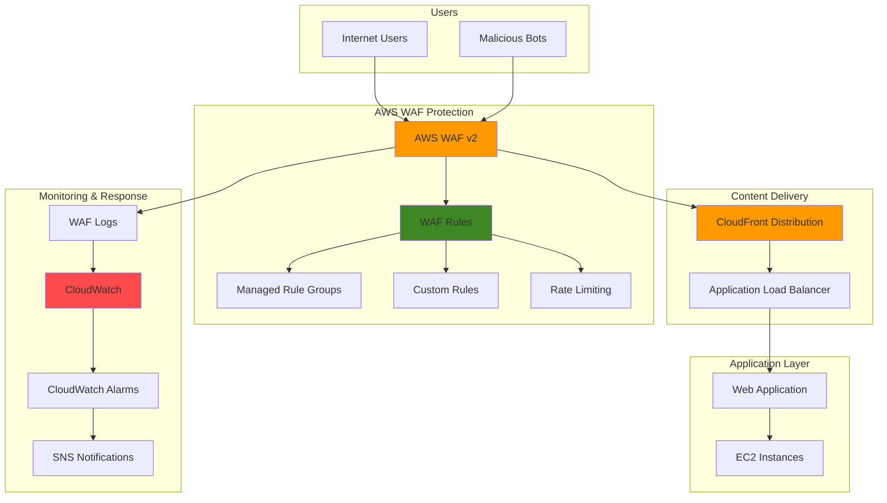

# Web Application Security with WAF Rules

## Problem

Modern web applications face a constant barrage of security threats including SQL injection, cross-site scripting (XSS), DDoS attacks, and bot traffic that can compromise data integrity, degrade performance, and result in significant financial losses. Traditional network security measures are insufficient to protect against application-layer attacks that exploit vulnerabilities in web application code. Organizations need comprehensive web application firewall capabilities to filter malicious traffic before it reaches their applications, while maintaining low latency and high availability for legitimate users.

## Solution

This recipe implements AWS WAF (Web Application Firewall) with a comprehensive security strategy that combines managed rule groups, custom rules, and rate limiting to protect web applications from common attack vectors. The solution uses AWS Managed Rules for baseline protection against OWASP Top 10 vulnerabilities, implements custom rules for application-specific threats, and integrates with CloudWatch for monitoring and automated response capabilities.

## Architecture Diagram



## Prerequisites

1. AWS account with appropriate permissions for WAF, CloudFront, ALB, and CloudWatch
2. AWS CLI v2 installed and configured (or AWS CloudShell)
3. Basic understanding of web application security concepts and HTTP/HTTPS protocols
4. Existing web application deployed with CloudFront or Application Load Balancer
5. Estimated cost: $1-10 per million requests, plus CloudWatch logging fees

> **Note**: WAF pricing varies by region and request volume. Monitor costs using AWS Cost Explorer during testing.

## Preparation

```bash
# Set environment variables
export AWS_REGION=$(aws configure get region)
export AWS_ACCOUNT_ID=$(aws sts get-caller-identity \
    --query Account --output text)

# Generate unique identifiers for resources
RANDOM_SUFFIX=$(aws secretsmanager get-random-password \
    --exclude-punctuation --exclude-uppercase \
    --password-length 6 --require-each-included-type \
    --output text --query RandomPassword)

export WAF_NAME="webapp-security-waf-${RANDOM_SUFFIX}"
export LOG_GROUP_NAME="/aws/wafv2/${WAF_NAME}"
export CLOUDWATCH_ALARM_NAME="waf-high-blocked-requests-${RANDOM_SUFFIX}"

# Create CloudWatch Log Group for WAF logs
aws logs create-log-group \
    --log-group-name "$LOG_GROUP_NAME" \
    --region "$AWS_REGION"

echo "✅ Created CloudWatch Log Group: $LOG_GROUP_NAME"
```

## Steps

1. **Create WAF Web ACL with Managed Rule Groups**:

   AWS WAF v2 serves as the foundation for comprehensive web application security, providing protection against the OWASP Top 10 vulnerabilities through AWS Managed Rules. These managed rule groups are continuously updated by AWS security experts to protect against emerging threats, eliminating the need for manual rule maintenance. Creating a Web ACL establishes the core security framework that will inspect every incoming request and apply protection rules before traffic reaches your application.

   ```bash
   # Create the Web ACL with managed rule groups
   aws wafv2 create-web-acl \
       --name "$WAF_NAME" \
       --scope CLOUDFRONT \
       --default-action Allow={} \
       --description "Comprehensive WAF for web application security" \
       --rules '[
           {
               "Name": "AWSManagedRulesCommonRuleSet",
               "Priority": 1,
               "Statement": {
                   "ManagedRuleGroupStatement": {
                       "VendorName": "AWS",
                       "Name": "AWSManagedRulesCommonRuleSet"
                   }
               },
               "OverrideAction": {
                   "None": {}
               },
               "VisibilityConfig": {
                   "SampledRequestsEnabled": true,
                   "CloudWatchMetricsEnabled": true,
                   "MetricName": "CommonRuleSetMetric"
               }
           },
           {
               "Name": "AWSManagedRulesKnownBadInputsRuleSet",
               "Priority": 2,
               "Statement": {
                   "ManagedRuleGroupStatement": {
                       "VendorName": "AWS",
                       "Name": "AWSManagedRulesKnownBadInputsRuleSet"
                   }
               },
               "OverrideAction": {
                   "None": {}
               },
               "VisibilityConfig": {
                   "SampledRequestsEnabled": true,
                   "CloudWatchMetricsEnabled": true,
                   "MetricName": "KnownBadInputsMetric"
               }
           },
           {
               "Name": "AWSManagedRulesSQLiRuleSet",
               "Priority": 3,
               "Statement": {
                   "ManagedRuleGroupStatement": {
                       "VendorName": "AWS",
                       "Name": "AWSManagedRulesSQLiRuleSet"
                   }
               },
               "OverrideAction": {
                   "None": {}
               },
               "VisibilityConfig": {
                   "SampledRequestsEnabled": true,
                   "CloudWatchMetricsEnabled": true,
                   "MetricName": "SQLiRuleSetMetric"
               }
           }
       ]' \
       --visibility-config SampledRequestsEnabled=true,CloudWatchMetricsEnabled=true,MetricName="${WAF_NAME}Metric" \
       --region "$AWS_REGION"
   
   # Get the Web ACL ARN
   WAF_ARN=$(aws wafv2 list-web-acls \
       --scope CLOUDFRONT \
       --region "$AWS_REGION" \
       --query "WebACLs[?Name=='$WAF_NAME'].ARN" \
       --output text)
   
   echo "✅ Created WAF Web ACL: $WAF_NAME"
   echo "WAF ARN: $WAF_ARN"
   ```

   The Web ACL is now active with three critical managed rule sets: CommonRuleSet provides baseline protection against general web exploits, KnownBadInputsRuleSet blocks requests with malformed or suspicious inputs, and SQLiRuleSet specifically targets SQL injection attempts. These rules operate in blocking mode, meaning malicious requests are denied before reaching your application, providing immediate threat mitigation.

2. **Add Rate Limiting Rules**:

   Rate limiting is essential for protecting against DDoS attacks, brute force attempts, and aggressive bot traffic that can overwhelm your application infrastructure. AWS WAF's rate-based rules monitor request patterns from individual IP addresses and automatically block sources that exceed defined thresholds within a 5-minute window. This proactive defense mechanism prevents resource exhaustion and maintains application availability for legitimate users during attack scenarios.

   ```bash
   # Create rate limiting rule for requests per IP
   aws wafv2 update-web-acl \
       --scope CLOUDFRONT \
       --id $(aws wafv2 list-web-acls \
           --scope CLOUDFRONT \
           --region "$AWS_REGION" \
           --query "WebACLs[?Name=='$WAF_NAME'].Id" \
           --output text) \
       --name "$WAF_NAME" \
       --default-action Allow={} \
       --description "Comprehensive WAF for web application security" \
       --rules '[
           {
               "Name": "AWSManagedRulesCommonRuleSet",
               "Priority": 1,
               "Statement": {
                   "ManagedRuleGroupStatement": {
                       "VendorName": "AWS",
                       "Name": "AWSManagedRulesCommonRuleSet"
                   }
               },
               "OverrideAction": {
                   "None": {}
               },
               "VisibilityConfig": {
                   "SampledRequestsEnabled": true,
                   "CloudWatchMetricsEnabled": true,
                   "MetricName": "CommonRuleSetMetric"
               }
           },
           {
               "Name": "AWSManagedRulesKnownBadInputsRuleSet",
               "Priority": 2,
               "Statement": {
                   "ManagedRuleGroupStatement": {
                       "VendorName": "AWS",
                       "Name": "AWSManagedRulesKnownBadInputsRuleSet"
                   }
               },
               "OverrideAction": {
                   "None": {}
               },
               "VisibilityConfig": {
                   "SampledRequestsEnabled": true,
                   "CloudWatchMetricsEnabled": true,
                   "MetricName": "KnownBadInputsMetric"
               }
           },
           {
               "Name": "AWSManagedRulesSQLiRuleSet",
               "Priority": 3,
               "Statement": {
                   "ManagedRuleGroupStatement": {
                       "VendorName": "AWS",
                       "Name": "AWSManagedRulesSQLiRuleSet"
                   }
               },
               "OverrideAction": {
                   "None": {}
               },
               "VisibilityConfig": {
                   "SampledRequestsEnabled": true,
                   "CloudWatchMetricsEnabled": true,
                   "MetricName": "SQLiRuleSetMetric"
               }
           },
           {
               "Name": "RateLimitRule",
               "Priority": 4,
               "Statement": {
                   "RateBasedStatement": {
                       "Limit": 10000,
                       "AggregateKeyType": "IP"
                   }
               },
               "Action": {
                   "Block": {}
               },
               "VisibilityConfig": {
                   "SampledRequestsEnabled": true,
                   "CloudWatchMetricsEnabled": true,
                   "MetricName": "RateLimitMetric"
               }
           }
       ]' \
       --visibility-config SampledRequestsEnabled=true,CloudWatchMetricsEnabled=true,MetricName="${WAF_NAME}Metric" \
       --lock-token $(aws wafv2 get-web-acl \
           --scope CLOUDFRONT \
           --id $(aws wafv2 list-web-acls \
               --scope CLOUDFRONT \
               --region "$AWS_REGION" \
               --query "WebACLs[?Name=='$WAF_NAME'].Id" \
               --output text) \
           --region "$AWS_REGION" \
           --query "LockToken" \
           --output text) \
       --region "$AWS_REGION"
   
   echo "✅ Added rate limiting rule (10,000 requests per 5 minutes per IP)"
   ```

   The rate limiting rule is now protecting your application by automatically blocking IP addresses that exceed 10,000 requests within a 5-minute window. This threshold balances legitimate user access with attack prevention, ensuring normal browsing patterns remain unaffected while aggressive automated traffic gets blocked. The rule includes comprehensive CloudWatch metrics for monitoring rate limiting effectiveness and identifying attack patterns.

   > **Warning**: Rate limiting thresholds should be adjusted based on your application's normal traffic patterns. Monitor legitimate user behavior for at least a week before implementing aggressive rate limits to avoid blocking valid users.

3. **Create Custom IP Blocking Rule**:

   IP Sets provide granular control for blocking known malicious sources, enabling immediate response to identified threats without waiting for automated detection systems. This capability is crucial for incident response scenarios where security teams need to quickly block specific attackers or entire network ranges associated with malicious activity. IP Sets support both individual addresses and CIDR blocks, allowing flexible blocking strategies based on threat intelligence and forensic analysis.

   ```bash
   # Create IP Set for blocking specific IP addresses
   aws wafv2 create-ip-set \
       --name "blocked-ips-${RANDOM_SUFFIX}" \
       --scope CLOUDFRONT \
       --ip-address-version IPV4 \
       --addresses '["192.0.2.44/32","203.0.113.0/24"]' \
       --description "IP addresses to block" \
       --region "$AWS_REGION"
   
   # Get IP Set ARN
   IP_SET_ARN=$(aws wafv2 list-ip-sets \
       --scope CLOUDFRONT \
       --region "$AWS_REGION" \
       --query "IPSets[?Name=='blocked-ips-${RANDOM_SUFFIX}'].ARN" \
       --output text)
   
   # Update WAF to include IP blocking rule
   aws wafv2 update-web-acl \
       --scope CLOUDFRONT \
       --id $(aws wafv2 list-web-acls \
           --scope CLOUDFRONT \
           --region "$AWS_REGION" \
           --query "WebACLs[?Name=='$WAF_NAME'].Id" \
           --output text) \
       --name "$WAF_NAME" \
       --default-action Allow={} \
       --description "Comprehensive WAF for web application security" \
       --rules '[
           {
               "Name": "AWSManagedRulesCommonRuleSet",
               "Priority": 1,
               "Statement": {
                   "ManagedRuleGroupStatement": {
                       "VendorName": "AWS",
                       "Name": "AWSManagedRulesCommonRuleSet"
                   }
               },
               "OverrideAction": {
                   "None": {}
               },
               "VisibilityConfig": {
                   "SampledRequestsEnabled": true,
                   "CloudWatchMetricsEnabled": true,
                   "MetricName": "CommonRuleSetMetric"
               }
           },
           {
               "Name": "AWSManagedRulesKnownBadInputsRuleSet",
               "Priority": 2,
               "Statement": {
                   "ManagedRuleGroupStatement": {
                       "VendorName": "AWS",
                       "Name": "AWSManagedRulesKnownBadInputsRuleSet"
                   }
               },
               "OverrideAction": {
                   "None": {}
               },
               "VisibilityConfig": {
                   "SampledRequestsEnabled": true,
                   "CloudWatchMetricsEnabled": true,
                   "MetricName": "KnownBadInputsMetric"
               }
           },
           {
               "Name": "AWSManagedRulesSQLiRuleSet",
               "Priority": 3,
               "Statement": {
                   "ManagedRuleGroupStatement": {
                       "VendorName": "AWS",
                       "Name": "AWSManagedRulesSQLiRuleSet"
                   }
               },
               "OverrideAction": {
                   "None": {}
               },
               "VisibilityConfig": {
                   "SampledRequestsEnabled": true,
                   "CloudWatchMetricsEnabled": true,
                   "MetricName": "SQLiRuleSetMetric"
               }
           },
           {
               "Name": "RateLimitRule",
               "Priority": 4,
               "Statement": {
                   "RateBasedStatement": {
                       "Limit": 10000,
                       "AggregateKeyType": "IP"
                   }
               },
               "Action": {
                   "Block": {}
               },
               "VisibilityConfig": {
                   "SampledRequestsEnabled": true,
                   "CloudWatchMetricsEnabled": true,
                   "MetricName": "RateLimitMetric"
               }
           },
           {
               "Name": "BlockMaliciousIPs",
               "Priority": 5,
               "Statement": {
                   "IPSetReferenceStatement": {
                       "ARN": "'"$IP_SET_ARN"'"
                   }
               },
               "Action": {
                   "Block": {}
               },
               "VisibilityConfig": {
                   "SampledRequestsEnabled": true,
                   "CloudWatchMetricsEnabled": true,
                   "MetricName": "IPBlockMetric"
               }
           }
       ]' \
       --visibility-config SampledRequestsEnabled=true,CloudWatchMetricsEnabled=true,MetricName="${WAF_NAME}Metric" \
       --lock-token $(aws wafv2 get-web-acl \
           --scope CLOUDFRONT \
           --id $(aws wafv2 list-web-acls \
               --scope CLOUDFRONT \
               --region "$AWS_REGION" \
               --query "WebACLs[?Name=='$WAF_NAME'].Id" \
               --output text) \
           --region "$AWS_REGION" \
           --query "LockToken" \
           --output text) \
       --region "$AWS_REGION"
   
   echo "✅ Created IP Set and added IP blocking rule to WAF"
   echo "IP Set ARN: $IP_SET_ARN"
   ```

   The IP Set is now configured with example blocked addresses and actively integrated with your WAF rules. The system will immediately block any requests from the specified IP addresses or CIDR ranges. You can dynamically update this list through the AWS CLI or console as new threats are identified, enabling rapid blocking of malicious sources. This foundation supports automated threat response workflows where security tools can programmatically add threatening IPs based on attack detection.

4. **Add Geographic Restrictions**:

   Geographic blocking provides an additional security layer by restricting access based on the source country of incoming requests. This is particularly valuable for organizations that primarily serve specific geographic markets or need to comply with regional regulations. Blocking high-risk countries where your business doesn't operate reduces the attack surface from regions known for cybercriminal activity, while still allowing legitimate traffic from your target markets.

   ```bash
   # Update WAF to include geographic blocking
   aws wafv2 update-web-acl \
       --scope CLOUDFRONT \
       --id $(aws wafv2 list-web-acls \
           --scope CLOUDFRONT \
           --region "$AWS_REGION" \
           --query "WebACLs[?Name=='$WAF_NAME'].Id" \
           --output text) \
       --name "$WAF_NAME" \
       --default-action Allow={} \
       --description "Comprehensive WAF for web application security" \
       --rules '[
           {
               "Name": "AWSManagedRulesCommonRuleSet",
               "Priority": 1,
               "Statement": {
                   "ManagedRuleGroupStatement": {
                       "VendorName": "AWS",
                       "Name": "AWSManagedRulesCommonRuleSet"
                   }
               },
               "OverrideAction": {
                   "None": {}
               },
               "VisibilityConfig": {
                   "SampledRequestsEnabled": true,
                   "CloudWatchMetricsEnabled": true,
                   "MetricName": "CommonRuleSetMetric"
               }
           },
           {
               "Name": "AWSManagedRulesKnownBadInputsRuleSet",
               "Priority": 2,
               "Statement": {
                   "ManagedRuleGroupStatement": {
                       "VendorName": "AWS",
                       "Name": "AWSManagedRulesKnownBadInputsRuleSet"
                   }
               },
               "OverrideAction": {
                   "None": {}
               },
               "VisibilityConfig": {
                   "SampledRequestsEnabled": true,
                   "CloudWatchMetricsEnabled": true,
                   "MetricName": "KnownBadInputsMetric"
               }
           },
           {
               "Name": "AWSManagedRulesSQLiRuleSet",
               "Priority": 3,
               "Statement": {
                   "ManagedRuleGroupStatement": {
                       "VendorName": "AWS",
                       "Name": "AWSManagedRulesSQLiRuleSet"
                   }
               },
               "OverrideAction": {
                   "None": {}
               },
               "VisibilityConfig": {
                   "SampledRequestsEnabled": true,
                   "CloudWatchMetricsEnabled": true,
                   "MetricName": "SQLiRuleSetMetric"
               }
           },
           {
               "Name": "RateLimitRule",
               "Priority": 4,
               "Statement": {
                   "RateBasedStatement": {
                       "Limit": 10000,
                       "AggregateKeyType": "IP"
                   }
               },
               "Action": {
                   "Block": {}
               },
               "VisibilityConfig": {
                   "SampledRequestsEnabled": true,
                   "CloudWatchMetricsEnabled": true,
                   "MetricName": "RateLimitMetric"
               }
           },
           {
               "Name": "BlockMaliciousIPs",
               "Priority": 5,
               "Statement": {
                   "IPSetReferenceStatement": {
                       "ARN": "'"$IP_SET_ARN"'"
                   }
               },
               "Action": {
                   "Block": {}
               },
               "VisibilityConfig": {
                   "SampledRequestsEnabled": true,
                   "CloudWatchMetricsEnabled": true,
                   "MetricName": "IPBlockMetric"
               }
           },
           {
               "Name": "BlockHighRiskCountries",
               "Priority": 6,
               "Statement": {
                   "GeoMatchStatement": {
                       "CountryCodes": ["CN", "RU", "KP"]
                   }
               },
               "Action": {
                   "Block": {}
               },
               "VisibilityConfig": {
                   "SampledRequestsEnabled": true,
                   "CloudWatchMetricsEnabled": true,
                   "MetricName": "GeoBlockMetric"
               }
           }
       ]' \
       --visibility-config SampledRequestsEnabled=true,CloudWatchMetricsEnabled=true,MetricName="${WAF_NAME}Metric" \
       --lock-token $(aws wafv2 get-web-acl \
           --scope CLOUDFRONT \
           --id $(aws wafv2 list-web-acls \
               --scope CLOUDFRONT \
               --region "$AWS_REGION" \
               --query "WebACLs[?Name=='$WAF_NAME'].Id" \
               --output text) \
           --region "$AWS_REGION" \
           --query "LockToken" \
           --output text) \
       --region "$AWS_REGION"
   
   echo "✅ Added geographic restrictions for high-risk countries"
   ```

   Geographic blocking is now active, automatically denying access from specified high-risk countries while maintaining full access for legitimate users in your target markets. This rule significantly reduces automated attack traffic and helps ensure compliance with data sovereignty requirements. The configuration can be easily modified to adjust the blocked country list based on evolving threat intelligence and business requirements.

5. **Enable WAF Logging**:

   WAF logging provides comprehensive visibility into security events, enabling forensic analysis, compliance reporting, and security monitoring. Each log entry contains detailed information about blocked and allowed requests, including request headers, source IPs, and rule matches. This data is essential for understanding attack patterns, tuning rule effectiveness, and meeting audit requirements for security compliance frameworks.

   ```bash
   # Enable WAF logging to CloudWatch
   aws wafv2 put-logging-configuration \
       --logging-configuration '{
           "ResourceArn": "'"$WAF_ARN"'",
           "LogDestinationConfigs": [
               "arn:aws:logs:'"$AWS_REGION"':'"$AWS_ACCOUNT_ID"':log-group:'"$LOG_GROUP_NAME"'"
           ],
           "LogType": "WAF_LOGS",
           "LogScope": "SECURITY_EVENTS",
           "RedactedFields": []
       }' \
       --region "$AWS_REGION"
   
   echo "✅ Enabled WAF logging to CloudWatch"
   ```

   WAF logging is now configured to capture all security events in CloudWatch Logs, providing a centralized repository for security analysis. The logs include sampled allowed requests and all blocked requests, giving security teams comprehensive visibility into both normal traffic patterns and attack attempts. This data foundation enables advanced analytics, automated response systems, and compliance reporting capabilities.

6. **Create CloudWatch Alarms for Security Monitoring**:

   Proactive security monitoring through CloudWatch alarms enables immediate notification when attack patterns emerge, allowing security teams to respond rapidly to threats. By monitoring blocked request metrics, you can detect coordinated attacks, DDoS attempts, and unusual traffic patterns that require immediate attention. The SNS integration ensures that security alerts reach the right personnel through email, SMS, or integration with incident management systems.

   ```bash
   # Create SNS topic for security alerts
   SNS_TOPIC_ARN=$(aws sns create-topic \
       --name "waf-security-alerts-${RANDOM_SUFFIX}" \
       --region "$AWS_REGION" \
       --query "TopicArn" \
       --output text)
   
   # Create CloudWatch alarm for blocked requests
   aws cloudwatch put-metric-alarm \
       --alarm-name "$CLOUDWATCH_ALARM_NAME" \
       --alarm-description "High number of blocked requests detected" \
       --metric-name "BlockedRequests" \
       --namespace "AWS/WAFV2" \
       --statistic "Sum" \
       --period 300 \
       --threshold 1000 \
       --comparison-operator "GreaterThanThreshold" \
       --evaluation-periods 2 \
       --alarm-actions "$SNS_TOPIC_ARN" \
       --dimensions Name=WebACL,Value="$WAF_NAME" Name=Region,Value="$AWS_REGION" \
       --region "$AWS_REGION"
   
   echo "✅ Created CloudWatch alarm for blocked requests"
   echo "SNS Topic ARN: $SNS_TOPIC_ARN"
   ```

   The security monitoring system is now active, automatically alerting when blocked request volumes exceed normal thresholds. This early warning system enables rapid response to potential attacks and provides visibility into the effectiveness of your WAF rules. The alarm triggers when more than 1,000 requests are blocked within two consecutive 5-minute periods, indicating a significant security event requiring attention.

7. **Add Custom String Matching Rule**:

   Custom pattern matching enables detection of application-specific threats and attack signatures that may not be covered by managed rules. Regular expressions provide powerful pattern matching capabilities to identify malicious payloads, including SQL injection attempts, cross-site scripting, directory traversal attacks, and command injection. This customization ensures that your WAF can adapt to unique threats targeting your specific application architecture and business logic.

   ```bash
   # Create regex pattern set for detecting suspicious patterns
   aws wafv2 create-regex-pattern-set \
       --name "suspicious-patterns-${RANDOM_SUFFIX}" \
       --scope CLOUDFRONT \
       --regular-expression-list '[
           {"RegexString": "(?i)(union.*select|select.*from|insert.*into|drop.*table)"},
           {"RegexString": "(?i)(<script|javascript:|onerror=|onload=)"},
           {"RegexString": "(?i)(\\.\\./)|(\\\\\\.\\.\\\\)"},
           {"RegexString": "(?i)(cmd\\.exe|powershell|/bin/bash|/bin/sh)"}
       ]' \
       --description "Patterns for detecting common attack signatures" \
       --region "$AWS_REGION"
   
   # Get regex pattern set ARN
   REGEX_SET_ARN=$(aws wafv2 list-regex-pattern-sets \
       --scope CLOUDFRONT \
       --region "$AWS_REGION" \
       --query "RegexPatternSets[?Name=='suspicious-patterns-${RANDOM_SUFFIX}'].ARN" \
       --output text)
   
   # Update WAF to include regex matching rule
   aws wafv2 update-web-acl \
       --scope CLOUDFRONT \
       --id $(aws wafv2 list-web-acls \
           --scope CLOUDFRONT \
           --region "$AWS_REGION" \
           --query "WebACLs[?Name=='$WAF_NAME'].Id" \
           --output text) \
       --name "$WAF_NAME" \
       --default-action Allow={} \
       --description "Comprehensive WAF for web application security" \
       --rules '[
           {
               "Name": "AWSManagedRulesCommonRuleSet",
               "Priority": 1,
               "Statement": {
                   "ManagedRuleGroupStatement": {
                       "VendorName": "AWS",
                       "Name": "AWSManagedRulesCommonRuleSet"
                   }
               },
               "OverrideAction": {
                   "None": {}
               },
               "VisibilityConfig": {
                   "SampledRequestsEnabled": true,
                   "CloudWatchMetricsEnabled": true,
                   "MetricName": "CommonRuleSetMetric"
               }
           },
           {
               "Name": "AWSManagedRulesKnownBadInputsRuleSet",
               "Priority": 2,
               "Statement": {
                   "ManagedRuleGroupStatement": {
                       "VendorName": "AWS",
                       "Name": "AWSManagedRulesKnownBadInputsRuleSet"
                   }
               },
               "OverrideAction": {
                   "None": {}
               },
               "VisibilityConfig": {
                   "SampledRequestsEnabled": true,
                   "CloudWatchMetricsEnabled": true,
                   "MetricName": "KnownBadInputsMetric"
               }
           },
           {
               "Name": "AWSManagedRulesSQLiRuleSet",
               "Priority": 3,
               "Statement": {
                   "ManagedRuleGroupStatement": {
                       "VendorName": "AWS",
                       "Name": "AWSManagedRulesSQLiRuleSet"
                   }
               },
               "OverrideAction": {
                   "None": {}
               },
               "VisibilityConfig": {
                   "SampledRequestsEnabled": true,
                   "CloudWatchMetricsEnabled": true,
                   "MetricName": "SQLiRuleSetMetric"
               }
           },
           {
               "Name": "RateLimitRule",
               "Priority": 4,
               "Statement": {
                   "RateBasedStatement": {
                       "Limit": 10000,
                       "AggregateKeyType": "IP"
                   }
               },
               "Action": {
                   "Block": {}
               },
               "VisibilityConfig": {
                   "SampledRequestsEnabled": true,
                   "CloudWatchMetricsEnabled": true,
                   "MetricName": "RateLimitMetric"
               }
           },
           {
               "Name": "BlockMaliciousIPs",
               "Priority": 5,
               "Statement": {
                   "IPSetReferenceStatement": {
                       "ARN": "'"$IP_SET_ARN"'"
                   }
               },
               "Action": {
                   "Block": {}
               },
               "VisibilityConfig": {
                   "SampledRequestsEnabled": true,
                   "CloudWatchMetricsEnabled": true,
                   "MetricName": "IPBlockMetric"
               }
           },
           {
               "Name": "BlockHighRiskCountries",
               "Priority": 6,
               "Statement": {
                   "GeoMatchStatement": {
                       "CountryCodes": ["CN", "RU", "KP"]
                   }
               },
               "Action": {
                   "Block": {}
               },
               "VisibilityConfig": {
                   "SampledRequestsEnabled": true,
                   "CloudWatchMetricsEnabled": true,
                   "MetricName": "GeoBlockMetric"
               }
           },
           {
               "Name": "CustomPatternMatching",
               "Priority": 7,
               "Statement": {
                   "RegexPatternSetReferenceStatement": {
                       "ARN": "'"$REGEX_SET_ARN"'",
                       "FieldToMatch": {
                           "UriPath": {}
                       },
                       "TextTransformations": [
                           {
                               "Priority": 0,
                               "Type": "URL_DECODE"
                           },
                           {
                               "Priority": 1,
                               "Type": "HTML_ENTITY_DECODE"
                           }
                       ]
                   }
               },
               "Action": {
                   "Block": {}
               },
               "VisibilityConfig": {
                   "SampledRequestsEnabled": true,
                   "CloudWatchMetricsEnabled": true,
                   "MetricName": "CustomPatternMetric"
               }
           }
       ]' \
       --visibility-config SampledRequestsEnabled=true,CloudWatchMetricsEnabled=true,MetricName="${WAF_NAME}Metric" \
       --lock-token $(aws wafv2 get-web-acl \
           --scope CLOUDFRONT \
           --id $(aws wafv2 list-web-acls \
               --scope CLOUDFRONT \
               --region "$AWS_REGION" \
               --query "WebACLs[?Name=='$WAF_NAME'].Id" \
               --output text) \
           --region "$AWS_REGION" \
           --query "LockToken" \
           --output text) \
       --region "$AWS_REGION"
   
   echo "✅ Created regex pattern set and added custom matching rule"
   echo "Regex Pattern Set ARN: $REGEX_SET_ARN"
   ```

   The custom pattern set is now configured to detect sophisticated attack signatures including SQL injection patterns, XSS attempts, directory traversal exploits, and command injection techniques. These patterns complement the managed rules by providing targeted protection against attack vectors specific to your application environment. The regular expressions are optimized for performance while maintaining high detection accuracy, with URL decoding and HTML entity decoding applied to catch obfuscated attacks.

8. **Associate WAF with CloudFront Distribution**:

   Associating the WAF with your CloudFront distribution activates protection at the edge locations closest to your users, providing optimal performance and global threat mitigation. This integration ensures that malicious requests are blocked before consuming bandwidth or reaching your origin servers, reducing costs and improving application performance. The association process requires updating the CloudFront distribution configuration, which may take several minutes to propagate across all edge locations.

   ```bash
   # List existing CloudFront distributions
   echo "Available CloudFront distributions:"
   aws cloudfront list-distributions \
       --query "DistributionList.Items[*].[Id,Origins.Items[0].DomainName,Status]" \
       --output table
   
   # Set your CloudFront distribution ID
   read -p "Enter your CloudFront Distribution ID: " DISTRIBUTION_ID
   
   # Associate WAF with CloudFront distribution using new command
   aws cloudfront associate-distribution-web-acl \
       --distribution-id "$DISTRIBUTION_ID" \
       --web-acl-id "$WAF_ARN"
   
   echo "✅ Associated WAF with CloudFront distribution: $DISTRIBUTION_ID"
   ```

   The WAF is now protecting your CloudFront distribution, with security rules active across all global edge locations. This integration provides immediate threat blocking at the network edge, reducing latency for legitimate users while preventing malicious traffic from reaching your origin infrastructure. The configuration will propagate to all edge locations within 15-20 minutes, ensuring global protection coverage.

9. **Create Bot Protection Rule**:

   Bot protection addresses the growing threat from automated attacks, content scraping, and competitive intelligence gathering that can overwhelm application resources and compromise business data. AWS Managed Bot Control rules use machine learning and behavioral analysis to distinguish between legitimate automated tools (like search engine crawlers) and malicious bots. This intelligent filtering preserves legitimate automated traffic while blocking harmful bot activities that could impact application performance and data integrity.

   ```bash
   # Update WAF to include bot protection
   aws wafv2 update-web-acl \
       --scope CLOUDFRONT \
       --id $(aws wafv2 list-web-acls \
           --scope CLOUDFRONT \
           --region "$AWS_REGION" \
           --query "WebACLs[?Name=='$WAF_NAME'].Id" \
           --output text) \
       --name "$WAF_NAME" \
       --default-action Allow={} \
       --description "Comprehensive WAF for web application security" \
       --rules '[
           {
               "Name": "AWSManagedRulesCommonRuleSet",
               "Priority": 1,
               "Statement": {
                   "ManagedRuleGroupStatement": {
                       "VendorName": "AWS",
                       "Name": "AWSManagedRulesCommonRuleSet"
                   }
               },
               "OverrideAction": {
                   "None": {}
               },
               "VisibilityConfig": {
                   "SampledRequestsEnabled": true,
                   "CloudWatchMetricsEnabled": true,
                   "MetricName": "CommonRuleSetMetric"
               }
           },
           {
               "Name": "AWSManagedRulesKnownBadInputsRuleSet",
               "Priority": 2,
               "Statement": {
                   "ManagedRuleGroupStatement": {
                       "VendorName": "AWS",
                       "Name": "AWSManagedRulesKnownBadInputsRuleSet"
                   }
               },
               "OverrideAction": {
                   "None": {}
               },
               "VisibilityConfig": {
                   "SampledRequestsEnabled": true,
                   "CloudWatchMetricsEnabled": true,
                   "MetricName": "KnownBadInputsMetric"
               }
           },
           {
               "Name": "AWSManagedRulesSQLiRuleSet",
               "Priority": 3,
               "Statement": {
                   "ManagedRuleGroupStatement": {
                       "VendorName": "AWS",
                       "Name": "AWSManagedRulesSQLiRuleSet"
                   }
               },
               "OverrideAction": {
                   "None": {}
               },
               "VisibilityConfig": {
                   "SampledRequestsEnabled": true,
                   "CloudWatchMetricsEnabled": true,
                   "MetricName": "SQLiRuleSetMetric"
               }
           },
           {
               "Name": "AWSManagedRulesBotControlRuleSet",
               "Priority": 4,
               "Statement": {
                   "ManagedRuleGroupStatement": {
                       "VendorName": "AWS",
                       "Name": "AWSManagedRulesBotControlRuleSet"
                   }
               },
               "OverrideAction": {
                   "None": {}
               },
               "VisibilityConfig": {
                   "SampledRequestsEnabled": true,
                   "CloudWatchMetricsEnabled": true,
                   "MetricName": "BotControlMetric"
               }
           },
           {
               "Name": "RateLimitRule",
               "Priority": 5,
               "Statement": {
                   "RateBasedStatement": {
                       "Limit": 10000,
                       "AggregateKeyType": "IP"
                   }
               },
               "Action": {
                   "Block": {}
               },
               "VisibilityConfig": {
                   "SampledRequestsEnabled": true,
                   "CloudWatchMetricsEnabled": true,
                   "MetricName": "RateLimitMetric"
               }
           },
           {
               "Name": "BlockMaliciousIPs",
               "Priority": 6,
               "Statement": {
                   "IPSetReferenceStatement": {
                       "ARN": "'"$IP_SET_ARN"'"
                   }
               },
               "Action": {
                   "Block": {}
               },
               "VisibilityConfig": {
                   "SampledRequestsEnabled": true,
                   "CloudWatchMetricsEnabled": true,
                   "MetricName": "IPBlockMetric"
               }
           },
           {
               "Name": "BlockHighRiskCountries",
               "Priority": 7,
               "Statement": {
                   "GeoMatchStatement": {
                       "CountryCodes": ["CN", "RU", "KP"]
                   }
               },
               "Action": {
                   "Block": {}
               },
               "VisibilityConfig": {
                   "SampledRequestsEnabled": true,
                   "CloudWatchMetricsEnabled": true,
                   "MetricName": "GeoBlockMetric"
               }
           },
           {
               "Name": "CustomPatternMatching",
               "Priority": 8,
               "Statement": {
                   "RegexPatternSetReferenceStatement": {
                       "ARN": "'"$REGEX_SET_ARN"'",
                       "FieldToMatch": {
                           "UriPath": {}
                       },
                       "TextTransformations": [
                           {
                               "Priority": 0,
                               "Type": "URL_DECODE"
                           },
                           {
                               "Priority": 1,
                               "Type": "HTML_ENTITY_DECODE"
                           }
                       ]
                   }
               },
               "Action": {
                   "Block": {}
               },
               "VisibilityConfig": {
                   "SampledRequestsEnabled": true,
                   "CloudWatchMetricsEnabled": true,
                   "MetricName": "CustomPatternMetric"
               }
           }
       ]' \
       --visibility-config SampledRequestsEnabled=true,CloudWatchMetricsEnabled=true,MetricName="${WAF_NAME}Metric" \
       --lock-token $(aws wafv2 get-web-acl \
           --scope CLOUDFRONT \
           --id $(aws wafv2 list-web-acls \
               --scope CLOUDFRONT \
               --region "$AWS_REGION" \
               --query "WebACLs[?Name=='$WAF_NAME'].Id" \
               --output text) \
           --region "$AWS_REGION" \
           --query "LockToken" \
           --output text) \
       --region "$AWS_REGION"
   
   echo "✅ Added bot control managed rule set for advanced bot protection"
   ```

   Advanced bot protection is now active, using machine learning algorithms to analyze request patterns and identify malicious automated traffic. The Bot Control rule set distinguishes between verified bots (like Google crawlers), unverified bots, and malicious automated tools, ensuring legitimate search engine indexing continues while blocking harmful scraping and attack bots. This intelligent protection adapts to evolving bot techniques and provides detailed metrics for bot traffic analysis.

10. **Configure WAF Dashboard and Monitoring**:

    Comprehensive monitoring dashboards provide real-time visibility into WAF performance and security events, enabling proactive threat response and operational optimization. CloudWatch dashboards consolidate metrics from all WAF rules, showing blocked vs. allowed requests, rule-specific performance, and trending analysis. This centralized view helps security teams quickly identify attack patterns, validate rule effectiveness, and make data-driven decisions about security configurations.

    ```bash
    # Create CloudWatch dashboard for WAF monitoring
    aws cloudwatch put-dashboard \
        --dashboard-name "WAF-Security-Dashboard-${RANDOM_SUFFIX}" \
        --dashboard-body '{
            "widgets": [
                {
                    "type": "metric",
                    "x": 0,
                    "y": 0,
                    "width": 12,
                    "height": 6,
                    "properties": {
                        "metrics": [
                            ["AWS/WAFV2", "AllowedRequests", "WebACL", "'"$WAF_NAME"'", "Region", "'"$AWS_REGION"'"],
                            [".", "BlockedRequests", ".", ".", ".", "."]
                        ],
                        "view": "timeSeries",
                        "stacked": false,
                        "region": "'"$AWS_REGION"'",
                        "title": "WAF Request Statistics",
                        "period": 300
                    }
                },
                {
                    "type": "metric",
                    "x": 12,
                    "y": 0,
                    "width": 12,
                    "height": 6,
                    "properties": {
                        "metrics": [
                            ["AWS/WAFV2", "BlockedRequests", "WebACL", "'"$WAF_NAME"'", "Region", "'"$AWS_REGION"'", "Rule", "CommonRuleSetMetric"],
                            ["...", "KnownBadInputsMetric"],
                            ["...", "SQLiRuleSetMetric"],
                            ["...", "RateLimitMetric"],
                            ["...", "GeoBlockMetric"],
                            ["...", "IPBlockMetric"],
                            ["...", "CustomPatternMetric"]
                        ],
                        "view": "timeSeries",
                        "stacked": false,
                        "region": "'"$AWS_REGION"'",
                        "title": "Blocked Requests by Rule",
                        "period": 300
                    }
                }
            ]
        }' \
        --region "$AWS_REGION"
    
    echo "✅ Created CloudWatch dashboard for WAF monitoring"
    ```

    The WAF monitoring dashboard is now operational, providing comprehensive visibility into security events and rule performance across multiple time periods. The dashboard displays overall request statistics and rule-specific metrics, enabling security teams to monitor protection effectiveness and identify trends. This visual monitoring capability supports both real-time incident response and long-term security analysis for continuous improvement of your WAF configuration.

    > **Note**: WAF dashboards can be customized to include additional metrics such as request latency, geographical distribution of blocked requests, and cost analysis. Consider integrating with AWS Security Hub for centralized security monitoring across all AWS services.

## Validation & Testing

1. **Verify WAF Web ACL Configuration**:

   ```bash
   # Check WAF Web ACL details
   aws wafv2 get-web-acl \
       --scope CLOUDFRONT \
       --id $(aws wafv2 list-web-acls \
           --scope CLOUDFRONT \
           --region "$AWS_REGION" \
           --query "WebACLs[?Name=='$WAF_NAME'].Id" \
           --output text) \
       --region "$AWS_REGION" \
       --query "WebACL.{Name:Name,Rules:Rules[].Name,DefaultAction:DefaultAction}" \
       --output table
   ```

   Expected output: Table showing the WAF name, list of rules, and default action.

2. **Test Rate Limiting Functionality**:

   ```bash
   # Test rate limiting (replace with your domain)
   read -p "Enter your domain name to test: " DOMAIN_NAME
   
   # Send multiple requests to trigger rate limiting
   echo "Testing rate limiting..."
   for i in {1..20}; do
       curl -s -o /dev/null -w "%{http_code} " "https://$DOMAIN_NAME/"
       sleep 0.1
   done
   echo
   
   # Check WAF metrics
   aws cloudwatch get-metric-statistics \
       --namespace "AWS/WAFV2" \
       --metric-name "BlockedRequests" \
       --dimensions Name=WebACL,Value="$WAF_NAME" Name=Region,Value="$AWS_REGION" \
       --start-time $(date -u -d '10 minutes ago' +%Y-%m-%dT%H:%M:%S) \
       --end-time $(date -u +%Y-%m-%dT%H:%M:%S) \
       --period 300 \
       --statistics Sum \
       --region "$AWS_REGION"
   ```

3. **Verify Geographic Blocking**:

   ```bash
   # Check geographic blocking rules
   aws wafv2 get-web-acl \
       --scope CLOUDFRONT \
       --id $(aws wafv2 list-web-acls \
           --scope CLOUDFRONT \
           --region "$AWS_REGION" \
           --query "WebACLs[?Name=='$WAF_NAME'].Id" \
           --output text) \
       --region "$AWS_REGION" \
       --query "WebACL.Rules[?Name=='BlockHighRiskCountries'].Statement.GeoMatchStatement.CountryCodes" \
       --output text
   ```

4. **Test WAF Logging and Monitoring**:

   ```bash
   # Check if WAF logs are being generated
   aws logs describe-log-streams \
       --log-group-name "$LOG_GROUP_NAME" \
       --region "$AWS_REGION" \
       --query "logStreams[0].{LogStreamName:logStreamName,LastEventTime:lastEventTime}" \
       --output table
   
   # View recent WAF log entries
   aws logs get-log-events \
       --log-group-name "$LOG_GROUP_NAME" \
       --log-stream-name $(aws logs describe-log-streams \
           --log-group-name "$LOG_GROUP_NAME" \
           --region "$AWS_REGION" \
           --query "logStreams[0].logStreamName" \
           --output text) \
       --limit 5 \
       --region "$AWS_REGION"
   ```

## Cleanup

1. **Disassociate WAF from CloudFront Distribution**:

   ```bash
   # Remove WAF association from CloudFront
   aws cloudfront disassociate-distribution-web-acl \
       --distribution-id "$DISTRIBUTION_ID"
   
   echo "✅ Removed WAF association from CloudFront distribution"
   ```

2. **Delete CloudWatch Resources**:

   ```bash
   # Delete CloudWatch alarm
   aws cloudwatch delete-alarms \
       --alarm-names "$CLOUDWATCH_ALARM_NAME" \
       --region "$AWS_REGION"
   
   # Delete CloudWatch dashboard
   aws cloudwatch delete-dashboards \
       --dashboard-names "WAF-Security-Dashboard-${RANDOM_SUFFIX}" \
       --region "$AWS_REGION"
   
   # Delete SNS topic
   aws sns delete-topic \
       --topic-arn "$SNS_TOPIC_ARN" \
       --region "$AWS_REGION"
   
   echo "✅ Deleted CloudWatch monitoring resources"
   ```

3. **Delete WAF Resources**:

   ```bash
   # Disable WAF logging
   aws wafv2 delete-logging-configuration \
       --resource-arn "$WAF_ARN" \
       --region "$AWS_REGION"
   
   # Delete IP Set
   aws wafv2 delete-ip-set \
       --scope CLOUDFRONT \
       --id $(aws wafv2 list-ip-sets \
           --scope CLOUDFRONT \
           --region "$AWS_REGION" \
           --query "IPSets[?Name=='blocked-ips-${RANDOM_SUFFIX}'].Id" \
           --output text) \
       --lock-token $(aws wafv2 get-ip-set \
           --scope CLOUDFRONT \
           --id $(aws wafv2 list-ip-sets \
               --scope CLOUDFRONT \
               --region "$AWS_REGION" \
               --query "IPSets[?Name=='blocked-ips-${RANDOM_SUFFIX}'].Id" \
               --output text) \
           --region "$AWS_REGION" \
           --query "LockToken" \
           --output text) \
       --region "$AWS_REGION"
   
   # Delete Regex Pattern Set
   aws wafv2 delete-regex-pattern-set \
       --scope CLOUDFRONT \
       --id $(aws wafv2 list-regex-pattern-sets \
           --scope CLOUDFRONT \
           --region "$AWS_REGION" \
           --query "RegexPatternSets[?Name=='suspicious-patterns-${RANDOM_SUFFIX}'].Id" \
           --output text) \
       --lock-token $(aws wafv2 get-regex-pattern-set \
           --scope CLOUDFRONT \
           --id $(aws wafv2 list-regex-pattern-sets \
               --scope CLOUDFRONT \
               --region "$AWS_REGION" \
               --query "RegexPatternSets[?Name=='suspicious-patterns-${RANDOM_SUFFIX}'].Id" \
               --output text) \
           --region "$AWS_REGION" \
           --query "LockToken" \
           --output text) \
       --region "$AWS_REGION"
   
   echo "✅ Deleted WAF IP Sets and Regex Pattern Sets"
   ```

4. **Delete WAF Web ACL**:

   ```bash
   # Delete WAF Web ACL
   aws wafv2 delete-web-acl \
       --scope CLOUDFRONT \
       --id $(aws wafv2 list-web-acls \
           --scope CLOUDFRONT \
           --region "$AWS_REGION" \
           --query "WebACLs[?Name=='$WAF_NAME'].Id" \
           --output text) \
       --lock-token $(aws wafv2 get-web-acl \
           --scope CLOUDFRONT \
           --id $(aws wafv2 list-web-acls \
               --scope CLOUDFRONT \
               --region "$AWS_REGION" \
               --query "WebACLs[?Name=='$WAF_NAME'].Id" \
               --output text) \
           --region "$AWS_REGION" \
           --query "LockToken" \
           --output text) \
       --region "$AWS_REGION"
   
   echo "✅ Deleted WAF Web ACL"
   ```

5. **Delete CloudWatch Log Group**:

   ```bash
   # Delete CloudWatch Log Group
   aws logs delete-log-group \
       --log-group-name "$LOG_GROUP_NAME" \
       --region "$AWS_REGION"
   
   echo "✅ Deleted CloudWatch Log Group"
   ```

## Discussion

AWS WAF provides comprehensive protection against common web application attacks through a combination of managed rule groups, custom rules, and rate limiting capabilities. The managed rule groups offer protection against the OWASP Top 10 vulnerabilities, including SQL injection, cross-site scripting, and other common attack vectors, while custom rules allow for application-specific threat detection. This layered security approach follows the AWS Well-Architected Framework's security pillar principles of defense in depth and automated security best practices.

The rate limiting functionality protects against DDoS attacks and brute force attempts by limiting the number of requests from a single IP address within a specified time window. Geographic blocking adds another layer of protection by restricting access from high-risk countries, while IP-based blocking allows for immediate response to known malicious sources. The bot control managed rule set provides advanced protection against automated attacks and scraping attempts using machine learning algorithms to distinguish legitimate bots from malicious ones.

Integration with CloudWatch provides comprehensive monitoring and alerting capabilities, enabling security teams to respond quickly to threats and analyze attack patterns. The logging capability captures detailed information about blocked requests, which is essential for forensic analysis and compliance reporting. This solution scales automatically with your application traffic and provides consistent protection across multiple AWS services. For more information on WAF best practices, see the [AWS WAF Developer Guide](https://docs.aws.amazon.com/waf/latest/developerguide/).

> **Tip**: Regularly review WAF logs and metrics to identify new attack patterns and adjust rules accordingly. Consider implementing automated response mechanisms using Lambda functions triggered by CloudWatch alarms to dynamically update IP sets based on detected threats.

## Challenge

Extend this solution by implementing these advanced security enhancements:

1. **Implement Automated Threat Response**: Create Lambda functions that automatically update IP sets based on CloudWatch alarms, adding detected malicious IPs to block lists and removing them after a cooldown period.

2. **Add Custom Machine Learning Detection**: Integrate with Amazon SageMaker to build custom models for detecting application-specific attack patterns and anomalous behavior based on request patterns and payloads.

3. **Implement Dynamic Rate Limiting**: Create adaptive rate limiting that adjusts thresholds based on application performance metrics and historical traffic patterns, using CloudWatch metrics and Lambda functions.

4. **Build Cross-Service Security Integration**: Integrate WAF with AWS Security Hub, GuardDuty, and Inspector to create a comprehensive security monitoring and response system with automated remediation workflows.

5. **Create Multi-Region WAF Management**: Implement a centralized WAF management system that synchronizes rules and configurations across multiple AWS regions for global applications using AWS Config and Lambda.

## Infrastructure Code

*Infrastructure code will be generated after recipe approval.*