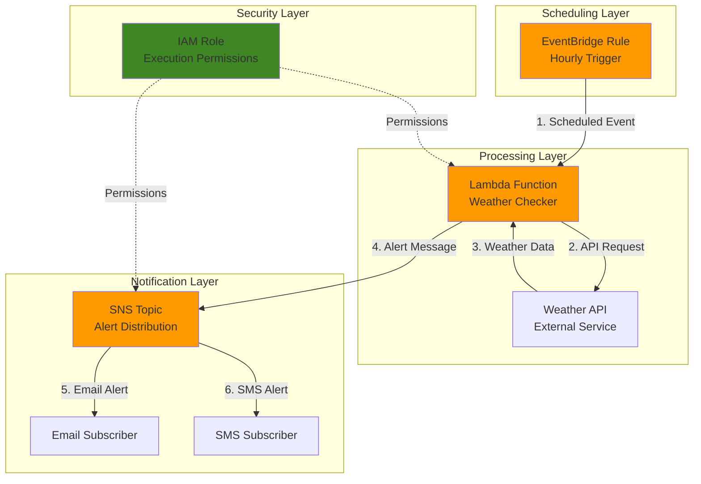

# Weather Alert Notifications with Lambda and SNS

## Problem

Organizations need timely weather alerts to protect outdoor operations, events, and employee safety, but manually monitoring weather conditions throughout the day is inefficient and prone to human error. Traditional monitoring solutions require dedicated infrastructure and maintenance overhead, while weather services don't provide customizable threshold-based alerting for specific business requirements. Without automated weather monitoring, businesses risk operational disruptions and safety incidents during severe weather conditions.

## Solution

Create a serverless weather monitoring system using AWS Lambda to periodically check weather conditions via a public API and Amazon SNS to deliver instant notifications when thresholds are exceeded. EventBridge provides reliable scheduling to trigger weather checks every hour, while Lambda's serverless architecture eliminates infrastructure management. This solution automatically scales based on demand, provides cost-effective monitoring, and delivers immediate alerts through multiple notification channels including email and SMS.

## Architecture Diagram



## Prerequisites

1. AWS account with permissions to create Lambda functions, SNS topics, EventBridge rules, and IAM roles
2. AWS CLI installed and configured (version 2.0 or later)
3. Basic understanding of serverless architectures and JSON data formats
4. Free OpenWeatherMap API key from [openweathermap.org](https://openweathermap.org/api)
5. Estimated cost: $0.05-$0.20 per month for low-volume usage (Lambda requests + SNS messages)

> **Note**: This configuration follows AWS Well-Architected Framework serverless best practices with automatic scaling and pay-per-use pricing.

## Preparation

```bash
# Set AWS environment variables
export AWS_REGION=$(aws configure get region)
export AWS_ACCOUNT_ID=$(aws sts get-caller-identity \
    --query Account --output text)

# Generate unique identifiers for resources
RANDOM_SUFFIX=$(aws secretsmanager get-random-password \
    --exclude-punctuation --exclude-uppercase \
    --password-length 6 --require-each-included-type \
    --output text --query RandomPassword)

# Set resource names
export FUNCTION_NAME="weather-alerts-${RANDOM_SUFFIX}"
export SNS_TOPIC_NAME="weather-notifications-${RANDOM_SUFFIX}"
export ROLE_NAME="weather-lambda-role-${RANDOM_SUFFIX}"
export RULE_NAME="weather-check-schedule-${RANDOM_SUFFIX}"

# Create temporary directory for Lambda code
mkdir -p /tmp/weather-lambda
cd /tmp/weather-lambda

echo "✅ AWS environment configured with unique resource names"
```

## Steps

1. **Create IAM Role for Lambda Function**:

   AWS Lambda requires an execution role with permissions to write logs, publish SNS messages, and access external resources. This role follows the principle of least privilege by granting only the specific permissions needed for weather monitoring functionality.

   ```bash
   # Create trust policy for Lambda service
   cat > trust-policy.json << 'EOF'
   {
     "Version": "2012-10-17",
     "Statement": [
       {
         "Effect": "Allow",
         "Principal": {
           "Service": "lambda.amazonaws.com"
         },
         "Action": "sts:AssumeRole"
       }
     ]
   }
   EOF
   
   # Create IAM role
   aws iam create-role \
       --role-name ${ROLE_NAME} \
       --assume-role-policy-document file://trust-policy.json
   
   # Attach basic Lambda execution policy
   aws iam attach-role-policy \
       --role-name ${ROLE_NAME} \
       --policy-arn arn:aws:iam::aws:policy/service-role/AWSLambdaBasicExecutionRole
   
   echo "✅ IAM role created for Lambda execution"
   ```

2. **Create SNS Topic and Email Subscription**:

   Amazon SNS provides a managed messaging service that enables fan-out delivery to multiple endpoints. Creating a topic establishes the central hub for distributing weather alerts, while subscriptions define the delivery endpoints that will receive notifications when severe weather conditions are detected.

   ```bash
   # Create SNS topic
   SNS_TOPIC_ARN=$(aws sns create-topic \
       --name ${SNS_TOPIC_NAME} \
       --query TopicArn --output text)
   
   # Subscribe your email to the topic (replace with your email)
   read -p "Enter your email address for notifications: " EMAIL_ADDRESS
   aws sns subscribe \
       --topic-arn ${SNS_TOPIC_ARN} \
       --protocol email \
       --notification-endpoint ${EMAIL_ADDRESS}
   
   echo "✅ SNS topic created: ${SNS_TOPIC_ARN}"
   echo "📧 Check your email and confirm subscription"
   ```

3. **Create SNS Publish Policy for Lambda**:

   Lambda functions require explicit permissions to publish messages to SNS topics. This policy grants the minimum necessary permissions for the weather monitoring function to send alert notifications while maintaining security best practices.

   ```bash
   # Create SNS publish policy
   cat > sns-policy.json << EOF
   {
     "Version": "2012-10-17",
     "Statement": [
       {
         "Effect": "Allow",
         "Action": "sns:Publish",
         "Resource": "${SNS_TOPIC_ARN}"
       }
     ]
   }
   EOF
   
   # Create and attach the policy
   aws iam put-role-policy \
       --role-name ${ROLE_NAME} \
       --policy-name SNSPublishPolicy \
       --policy-document file://sns-policy.json
   
   echo "✅ SNS publish permissions granted to Lambda role"
   ```

4. **Create Lambda Function Code**:

   The Lambda function implements the core weather monitoring logic, fetching current conditions from the OpenWeatherMap API and evaluating them against configurable alert thresholds. This serverless approach automatically handles scaling, error recovery, and execution monitoring without infrastructure management. We use the `requests` library for HTTP operations as it provides better error handling and is more Pythonic compared to urllib3.

   ```bash
   # Create Lambda function code
   cat > lambda_function.py << 'EOF'
   import json
   import requests
   import boto3
   import os
   from datetime import datetime
   
   def lambda_handler(event, context):
       # Initialize SNS client
       sns = boto3.client('sns')
       
       # Configuration
       api_key = os.environ.get('WEATHER_API_KEY', 'demo_key')
       city = os.environ.get('CITY', 'Seattle')
       temp_threshold = float(os.environ.get('TEMP_THRESHOLD', '32'))  # Fahrenheit
       wind_threshold = float(os.environ.get('WIND_THRESHOLD', '25'))  # mph
       sns_topic_arn = os.environ['SNS_TOPIC_ARN']
       
       try:
           # Fetch weather data
           if api_key == 'demo_key':
               # For demo purposes, use mock data if no API key provided
               weather_data = {
                   'main': {'temp': 28.5, 'feels_like': 25.0},
                   'wind': {'speed': 30.2},
                   'weather': [{'main': 'Snow', 'description': 'heavy snow'}],
                   'name': city
               }
               print("Using demo weather data for testing")
           else:
               # Make API request to OpenWeatherMap
               url = f'https://api.openweathermap.org/data/2.5/weather'
               params = {
                   'q': city,
                   'appid': api_key,
                   'units': 'imperial'
               }
               
               response = requests.get(url, params=params, timeout=10)
               response.raise_for_status()
               weather_data = response.json()
           
           # Extract weather information
           temperature = weather_data['main']['temp']
           feels_like = weather_data['main']['feels_like']
           wind_speed = weather_data['wind']['speed']
           weather_desc = weather_data['weather'][0]['description']
           city_name = weather_data['name']
           
           print(f"Weather check for {city_name}: {temperature}°F, {weather_desc}, {wind_speed} mph wind")
           
           # Check alert conditions
           alerts = []
           
           if temperature <= temp_threshold:
               alerts.append(f"🥶 Temperature alert: {temperature}°F (feels like {feels_like}°F)")
           
           if wind_speed >= wind_threshold:
               alerts.append(f"💨 Wind alert: {wind_speed} mph")
           
           # Send alerts if conditions met
           if alerts:
               timestamp = datetime.now().strftime('%Y-%m-%d %I:%M %p')
               message = f"""
   ⚠️ WEATHER ALERT for {city_name} ⚠️
   Time: {timestamp}
   
   Current Conditions:
   🌡️ Temperature: {temperature}°F (feels like {feels_like}°F)
   💨 Wind Speed: {wind_speed} mph
   🌤️ Conditions: {weather_desc.title()}
   
   Active Alerts:
   """ + '\n'.join(f"• {alert}" for alert in alerts) + """
   
   Stay safe and take appropriate precautions!
   """
               
               # Send SNS notification
               sns.publish(
                   TopicArn=sns_topic_arn,
                   Subject=f"Weather Alert - {city_name}",
                   Message=message
               )
               
               print(f"Alert sent: {len(alerts)} conditions triggered")
               return {
                   'statusCode': 200,
                   'body': json.dumps({
                       'message': 'Weather alert sent',
                       'alerts': alerts,
                       'city': city_name,
                       'temperature': temperature,
                       'wind_speed': wind_speed
                   })
               }
           else:
               print("No alerts triggered - weather conditions normal")
               return {
                   'statusCode': 200,
                   'body': json.dumps({
                       'message': 'Weather normal - no alerts',
                       'city': city_name,
                       'temperature': temperature,
                       'wind_speed': wind_speed
                   })
               }
               
       except requests.exceptions.RequestException as e:
           print(f"API request error: {str(e)}")
           error_message = f"""
   ❌ Weather API Error
   Time: {datetime.now().strftime('%Y-%m-%d %I:%M %p')}
   
   Error: Unable to fetch weather data - {str(e)}
   
   Please check API configuration and connectivity.
   """
           
           sns.publish(
               TopicArn=sns_topic_arn,
               Subject="Weather API Error",
               Message=error_message
           )
           
           return {
               'statusCode': 500,
               'body': json.dumps({'error': f'API request failed: {str(e)}'})
           }
           
       except Exception as e:
           print(f"Error checking weather: {str(e)}")
           # Send error notification
           error_message = f"""
   ❌ Weather Monitoring System Error
   Time: {datetime.now().strftime('%Y-%m-%d %I:%M %p')}
   
   Error: {str(e)}
   
   Please check the system configuration.
   """
           
           sns.publish(
               TopicArn=sns_topic_arn,
               Subject="Weather System Error",
               Message=error_message
           )
           
           return {
               'statusCode': 500,
               'body': json.dumps({'error': str(e)})
           }
   EOF
   
   echo "✅ Lambda function code created"
   ```

5. **Package and Deploy Lambda Function**:

   AWS Lambda requires function code to be packaged as a ZIP file for deployment. This step creates the deployment package and configures the function with appropriate runtime settings, memory allocation, and environment variables for weather monitoring operations. We use Python 3.12 runtime for optimal performance and modern language features.

   ```bash
   # Create deployment package
   zip lambda-function.zip lambda_function.py
   
   # Get role ARN (wait a moment for role propagation)
   sleep 10
   ROLE_ARN=$(aws iam get-role --role-name ${ROLE_NAME} \
       --query Role.Arn --output text)
   
   # Create Lambda function
   aws lambda create-function \
       --function-name ${FUNCTION_NAME} \
       --runtime python3.12 \
       --role ${ROLE_ARN} \
       --handler lambda_function.lambda_handler \
       --zip-file fileb://lambda-function.zip \
       --timeout 30 \
       --memory-size 128 \
       --environment Variables="{
           SNS_TOPIC_ARN=${SNS_TOPIC_ARN},
           CITY=Seattle,
           TEMP_THRESHOLD=32,
           WIND_THRESHOLD=25
       }"
   
   echo "✅ Lambda function deployed: ${FUNCTION_NAME}"
   ```

6. **Create EventBridge Scheduled Rule**:

   Amazon EventBridge provides reliable, serverless scheduling for automated weather monitoring. Creating a scheduled rule establishes the timing mechanism that triggers weather checks at regular intervals, ensuring consistent monitoring without manual intervention or infrastructure maintenance.

   ```bash
   # Create EventBridge rule for hourly execution
   aws events put-rule \
       --name ${RULE_NAME} \
       --schedule-expression "rate(1 hour)" \
       --description "Hourly weather monitoring trigger" \
       --state ENABLED
   
   # Get rule ARN
   RULE_ARN=$(aws events describe-rule --name ${RULE_NAME} \
       --query Arn --output text)
   
   echo "✅ EventBridge rule created for hourly scheduling"
   ```

7. **Configure Lambda Permission and Target**:

   EventBridge requires explicit permission to invoke Lambda functions for security purposes. This step grants the necessary permissions and establishes the target relationship, enabling the scheduled rule to trigger weather monitoring executions automatically.

   ```bash
   # Add permission for EventBridge to invoke Lambda
   aws lambda add-permission \
       --function-name ${FUNCTION_NAME} \
       --statement-id weather-schedule-permission \
       --action lambda:InvokeFunction \
       --principal events.amazonaws.com \
       --source-arn ${RULE_ARN}
   
   # Add Lambda function as target for EventBridge rule
   aws events put-targets \
       --rule ${RULE_NAME} \
       --targets Id=1,Arn=$(aws lambda get-function \
           --function-name ${FUNCTION_NAME} \
           --query Configuration.FunctionArn --output text)
   
   echo "✅ EventBridge configured to trigger Lambda function"
   ```

## Validation & Testing

1. **Test Lambda Function Manually**:

   ```bash
   # Invoke Lambda function directly to test functionality
   aws lambda invoke \
       --function-name ${FUNCTION_NAME} \
       --payload '{}' \
       response.json
   
   # Display function response
   cat response.json | python3 -m json.tool
   ```

   Expected output: JSON response indicating weather check completion and any alert conditions.

2. **Verify EventBridge Rule Configuration**:

   ```bash
   # Check rule status and targets
   aws events describe-rule --name ${RULE_NAME}
   aws events list-targets-by-rule --rule ${RULE_NAME}
   ```

   Expected output: Rule showing "ENABLED" state with Lambda function as target.

3. **Monitor CloudWatch Logs**:

   ```bash
   # Check Lambda execution logs
   aws logs describe-log-groups \
       --log-group-name-prefix /aws/lambda/${FUNCTION_NAME}
   
   # Get recent log events (wait a few minutes after first execution)
   LOG_GROUP="/aws/lambda/${FUNCTION_NAME}"
   aws logs describe-log-streams \
       --log-group-name ${LOG_GROUP} \
       --order-by LastEventTime --descending --max-items 1
   ```

4. **Test with Real Weather API (Optional)**:

   ```bash
   # Update function with real API key (replace YOUR_API_KEY)
   aws lambda update-function-configuration \
       --function-name ${FUNCTION_NAME} \
       --environment Variables="{
           SNS_TOPIC_ARN=${SNS_TOPIC_ARN},
           CITY=Seattle,
           TEMP_THRESHOLD=32,
           WIND_THRESHOLD=25,
           WEATHER_API_KEY=YOUR_API_KEY
       }"
   
   echo "✅ Function updated with real API key"
   ```

## Cleanup

1. **Remove EventBridge Rule and Targets**:

   ```bash
   # Remove Lambda target from rule
   aws events remove-targets \
       --rule ${RULE_NAME} \
       --ids 1
   
   # Delete EventBridge rule
   aws events delete-rule --name ${RULE_NAME}
   
   echo "✅ EventBridge rule deleted"
   ```

2. **Delete Lambda Function and Permissions**:

   ```bash
   # Delete Lambda function
   aws lambda delete-function --function-name ${FUNCTION_NAME}
   
   echo "✅ Lambda function deleted"
   ```

3. **Remove SNS Resources**:

   ```bash
   # Delete SNS topic (this also removes all subscriptions)
   aws sns delete-topic --topic-arn ${SNS_TOPIC_ARN}
   
   echo "✅ SNS topic and subscriptions deleted"
   ```

4. **Clean Up IAM Role and Policies**:

   ```bash
   # Remove inline policy
   aws iam delete-role-policy \
       --role-name ${ROLE_NAME} \
       --policy-name SNSPublishPolicy
   
   # Detach managed policy
   aws iam detach-role-policy \
       --role-name ${ROLE_NAME} \
       --policy-arn arn:aws:iam::aws:policy/service-role/AWSLambdaBasicExecutionRole
   
   # Delete IAM role
   aws iam delete-role --role-name ${ROLE_NAME}
   
   echo "✅ IAM resources cleaned up"
   ```

5. **Remove Local Files**:

   ```bash
   # Clean up temporary files
   cd /
   rm -rf /tmp/weather-lambda
   
   echo "✅ Local files cleaned up"
   ```

## Discussion

This serverless weather monitoring solution demonstrates the power of event-driven architecture using AWS managed services. The combination of Lambda, SNS, and EventBridge creates a resilient, cost-effective monitoring system that scales automatically and requires minimal operational overhead. Lambda's pay-per-invocation model ensures costs remain low during periods of normal weather conditions, while the serverless architecture eliminates infrastructure management concerns.

The solution leverages AWS Well-Architected Framework principles across all five pillars. Operational excellence is achieved through CloudWatch logging and monitoring capabilities, while security follows least-privilege access patterns with IAM roles and policies. Reliability comes from AWS managed service availability and automatic error handling, while performance efficiency utilizes optimized runtime configurations and minimal resource allocation. Cost optimization is inherent in the serverless pay-per-use model.

EventBridge provides enterprise-grade scheduling capabilities with built-in retry logic and error handling, making it superior to traditional cron-based solutions. The service automatically handles failures and provides detailed monitoring through CloudWatch metrics. SNS ensures reliable message delivery with support for multiple protocols including email, SMS, and webhook endpoints, enabling flexible notification strategies based on organizational requirements.

The updated implementation uses the `requests` library instead of `urllib3` for HTTP operations, providing better error handling, more Pythonic API design, and simplified request management. This approach follows Python best practices and improves code maintainability while offering superior timeout handling and connection pooling capabilities. The architecture supports easy customization through environment variables, allowing different cities, weather thresholds, and notification preferences without code changes.

> **Tip**: Use AWS X-Ray for distributed tracing to monitor API performance and identify bottlenecks across your serverless architecture. The [X-Ray documentation](https://docs.aws.amazon.com/xray/latest/devguide/) provides comprehensive guidance for serverless observability.

*Documentation References:*
- [AWS Lambda Event-Driven Architectures](https://docs.aws.amazon.com/lambda/latest/dg/concepts-event-driven-architectures.html)
- [Amazon SNS Getting Started Guide](https://docs.aws.amazon.com/sns/latest/dg/sns-getting-started.html)
- [EventBridge Scheduled Rules Tutorial](https://docs.aws.amazon.com/eventbridge/latest/userguide/eb-run-lambda-schedule.html)
- [AWS Well-Architected Framework](https://docs.aws.amazon.com/wellarchitected/latest/framework/welcome.html)
- [Lambda Monitoring and Troubleshooting](https://docs.aws.amazon.com/lambda/latest/dg/lambda-monitoring.html)
- [Python Requests Library Documentation](https://docs.python-requests.org/)

## Challenge

Extend this weather monitoring solution with these enhancements:

1. **Multi-City Monitoring**: Modify the Lambda function to check weather conditions for multiple cities simultaneously, using DynamoDB to store city configurations and alert thresholds per location.

2. **Advanced Alert Conditions**: Implement complex weather pattern detection including rapid temperature changes, precipitation probability thresholds, and severe weather warnings using historical data comparison.

3. **Intelligent Notification Routing**: Create conditional SNS message filtering based on severity levels, sending critical alerts via SMS while routing routine notifications through email channels.

4. **Weather Dashboard Integration**: Connect the system to Amazon QuickSight for real-time weather visualization and historical trend analysis, including alert frequency metrics and threshold optimization recommendations.

5. **Machine Learning Predictions**: Integrate Amazon SageMaker to predict weather pattern changes and provide proactive alerts based on forecasting models, enabling preventive action rather than reactive notifications.

## Infrastructure Code

*Infrastructure code will be generated after recipe approval.*